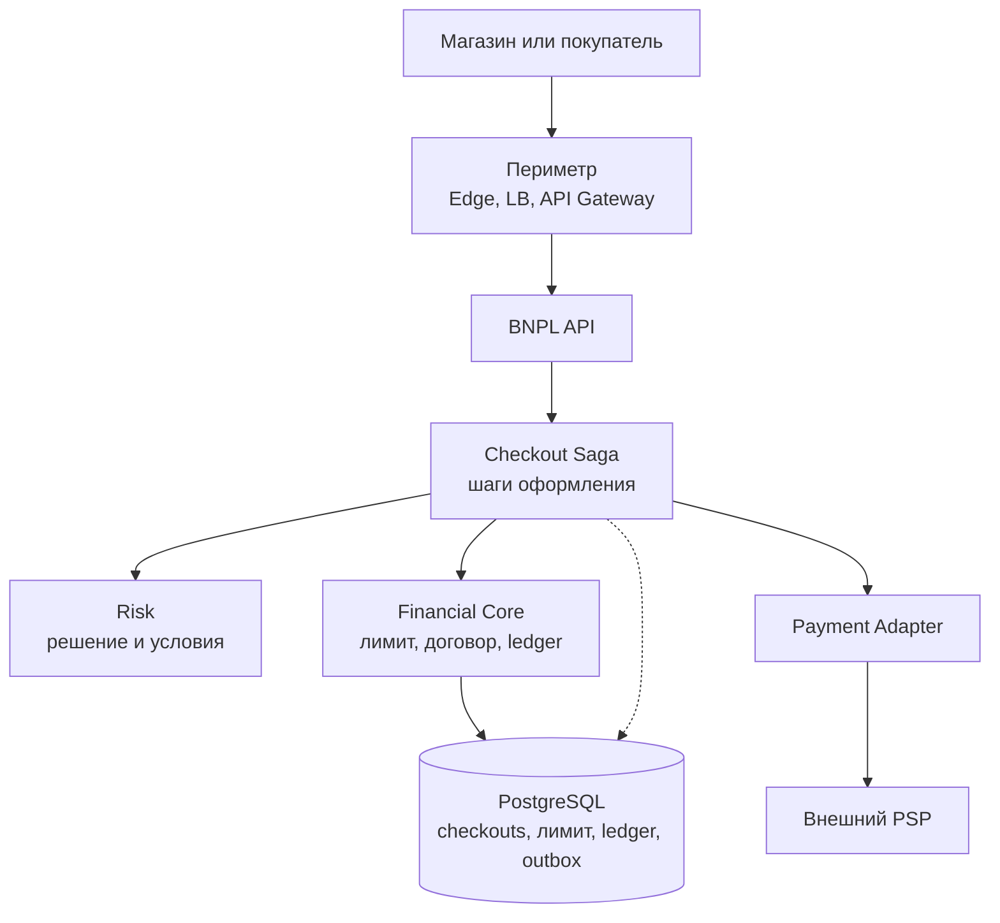
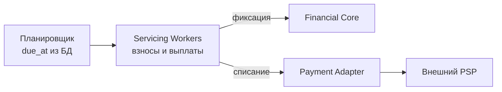
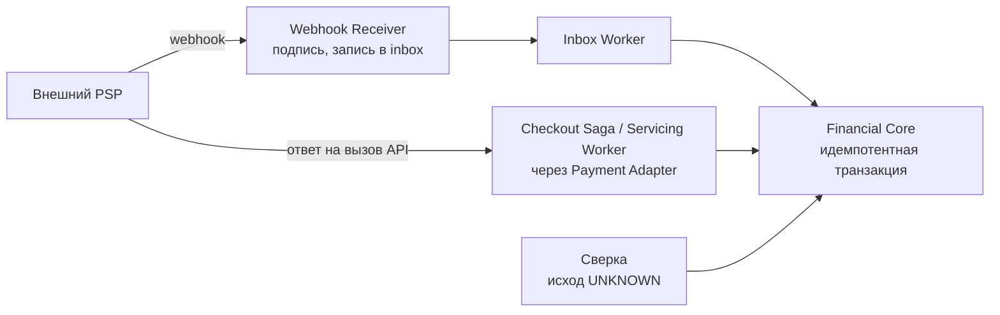
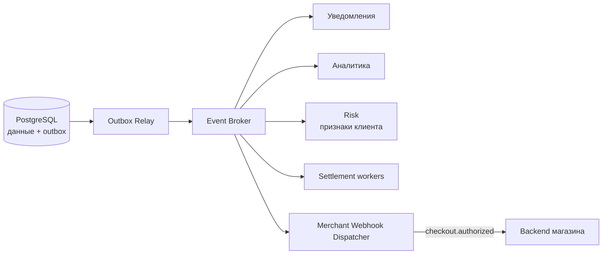
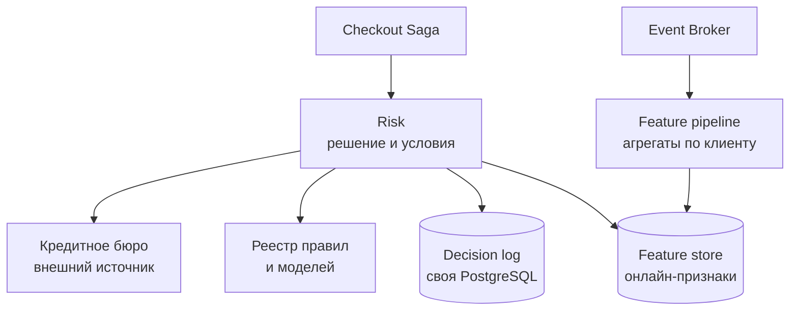
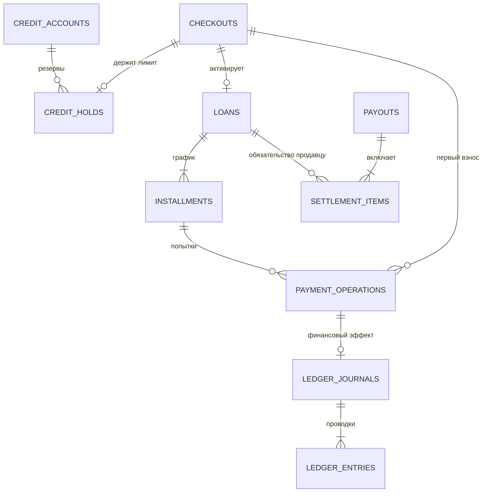

# BNPL Service: рассрочка по модели Tabby / Klarna

## Содержание

- [Что проектируем](#что-проектируем)
- [Фаза 1: уточнение требований](#фаза-1-уточнение-требований)
- [Фаза 2: оценка нагрузки](#фаза-2-оценка-нагрузки)
- [Фаза 3: высокоуровневый дизайн](#фаза-3-высокоуровневый-дизайн)
- [Фаза 4: deep dive](#фаза-4-deep-dive)
- [Сквозные потоки](#сквозные-потоки)
- [Отказы и наблюдаемость](#отказы-и-наблюдаемость)
- [Трейдоффы](#трейдоффы)
- [Фаза 5: финал](#фаза-5-финал)
- [Резерв: детали для уточняющих вопросов](#резерв-детали-для-уточняющих-вопросов)
- [Вопросы и ответы: платёжные сбои и сверка денег](#вопросы-и-ответы-платёжные-сбои-и-сверка-денег)
- [Interview-ready answer](#interview-ready-answer)
- [Связанные материалы и источники](#связанные-материалы-и-источники)

Разбор на 45–60 минут по [общему плану интервью](./00-how-to-approach.md).
Разделы от «Что проектируем» до «Фазы 5» — основной ответ, который помещается
в интервью. Всё, что ниже, — резерв: детали и ответы на уточнения, которые
нужны, только если интервьюер копает в эту сторону.

Основной ответ держится на пяти опорах:

1. **Домен.** Продавцу платим сразу, долг покупателя собираем частями,
   поэтому есть кредитный риск и кассовый разрыв.
2. **Числа.** Сотни запросов в секунду укладываются в один PostgreSQL-кластер;
   шарды и Cassandra не нужны.
3. **Лимит.** Проверка и резерв — один условный `UPDATE`, поэтому две
   параллельные покупки не делят одну свободную сумму.
4. **Деньги и PSP.** Saga, операция в БД до внешнего вызова, ключ
   идемпотентности, `UNKNOWN` вместо `FAILED` при таймауте, ledger и outbox.
5. **Фоновые списания.** Планировщик по `due_at` из БД, своя квота PSP, сверка.

---

## Что проектируем

**BNPL (Buy Now, Pay Later)** — покупка сейчас с оплатой частями.
Проектируем самого провайдера рассрочки, а не магазин, который подключает
готовый способ оплаты через Stripe.

Покупатель берёт товар за 100, платит сейчас 25 и ещё три раза по 25 позже.
Продавец получает согласованную сумму раньше, чем покупатель погасит весь долг.
Провайдер финансирует этот разрыв и принимает оговорённый кредитный риск.

Картами провайдер сам не оперирует: списания и возвраты идут через **PSP**
(`payment service provider`) — внешнего платёжного провайдера, который хранит
карточные данные и обращается к платёжным системам. Поэтому «первый взнос
оплачен», «продавцу перечислены деньги» и «долг погашен» — разные факты,
которые нельзя спрятать за одним `status=PAID`.

Tabby и Klarna здесь — ориентиры продукта, а не описание их внутренних систем.
Их публичные merchant API выделяют операции capture и refund, см.
[Tabby: capture](https://docs.tabby.ai/api-reference/payments/capture-a-payment)
и [Klarna: capture](https://docs.klarna.com/acquirer/klarna/after-payments/order-management/manage-orders-with-the-api/capture-and-track-orders/).

---

## Фаза 1: уточнение требований

### Что спросить

| Вопрос | Почему меняет дизайн |
| --- | --- |
| Строим провайдера или интеграцию магазина? | У провайдера появляются долг клиента, кредитный риск и финансирование продавца |
| Какие страны, валюты и продукты рассрочки? | Проверки клиента, договоры, сроки и правила автосписаний нельзя считать универсальными |
| Когда берём первый взнос и подтверждаем покупку? | Определяет Saga, временные резервы и возврат денег при отмене |
| Когда продавец получает деньги и кто несёт риск неплатежа? | Выплата продавцу не должна случайно зависеть от погашения всех взносов |
| Нужны частичные отгрузки, возвраты, досрочное погашение? | Возникают несколько capture и перераспределение долга между взносами |
| Насколько быстро нужен ответ и что делать при недоступном Risk или PSP? | Быстрый отказ, ожидание и `PROCESSING` — разные продуктовые результаты |

### Учебные допущения и scope

Все сроки, комиссии и правила ниже — допущения кейса, а не тарифы или
юридические правила Tabby/Klarna. Один рынок, одна валюта с двумя знаками:

- Четыре взноса без процентов покупателю; комиссия удерживается с продавца.
  Первый взнос списываем при оформлении, остальные — через 30, 60 и 90 дней.
- Кредитное решение учитывает клиента, сумму и продавца. Лимит клиента общий
  для покупок во всех магазинах провайдера.
- После первого взноса магазин получает разрешение на полный capture,
  действующее 24 часа. Частичные отгрузки за рамками.
- Расширение с несколькими capture по частичным отгрузкам разобрано отдельно:
  [BNPL Order Management](./32b-bnpl-order-management.md).
- Capture активирует договор и обязательство перед продавцом. Выплата идёт
  отдельным процессом по календарю и не ждёт остальных взносов.
- Нужны график, автосписания, ручная оплата, отмена до capture, полные
  и частичные возвраты после него, уведомления и обработка просрочек.
- Проверку личности, кредитные сведения и платёжные реквизиты получаем
  через интеграции. Скоринг, лицензирование, взыскание и привлечение
  финансирования подробно не проектируем.

### Гарантии

| Требование | Контракт |
| --- | --- |
| Корректность лимита | Две параллельные покупки не могут использовать одну свободную сумму |
| Корректность денег | Один финансовый эффект на бизнес-операцию; неизвестный исход не считается отказом |
| Доступность | Учебная цель API — 99,99%; при потере безопасного writer новые обязательства не принимаем |
| Задержка | p99 приёма команды и чтения статуса — 300 мс; решение Risk — до 2 с |
| Внешние платежи | Время действий пользователя и PSP не входит в 300 мс; возвращаем состояние операции |
| Сохранность | Подтверждённые операции переживают потерю узла или зоны; backup и проверка восстановления |

Долг и лимит читаем с leader. История в приложении и аналитика могут отставать.
Новое списание всегда перепроверяет сумму в финансовом ядре, а не доверяет
экрану клиента.

---

## Фаза 2: оценка нагрузки

Все числа — допущения для интервью, а не статистика компаний.

| Показатель | Допущение |
| --- | --- |
| Заявки на рассрочку | 2 млн/сутки |
| Активированные договоры | 500 тыс./сутки, то есть 25% заявок |
| Пик оформления | ×10 к среднесуточному потоку |
| Чтения графика и истории | 10 млн/сутки, пик ×10 |
| Отложенные взносы | 3 на договор, установившийся поток |
| Дополнительные попытки списаний | +20% к числу взносов |
| Окно фоновых списаний | 6 часов в дату платежа |

```text
Заявки:              2 000 000 / 86 400 ≈ 23/с; пик ≈ 232/с
Активации:             500 000 / 86 400 ≈ 5,8/с; пик ≈ 58/с
Чтения:             10 000 000 / 86 400 ≈ 116/с; пик ≈ 1 158/с

Отложенные взносы:     500 000 × 3 = 1 500 000/сутки
С попытками:         1 500 000 × 1,2 = 1 800 000/сутки
Внутри окна:         1 800 000 / (6 × 3 600) ≈ 83 попытки/с
```

Узкое место фоновых списаний — квота PSP, а не наши серверы. Если PSP выделяет
фоновой очереди 100 запросов/с, 1,8 млн попыток занимают
`1 800 000 / 100 = 18 000 с = 5 часов` из шести. При среднем времени запроса 1 с
это около 100 одновременных вызовов. Первым платежам и проверкам статусов нужен
отдельный бюджет квоты.

**Эхо когорт.** Взносы привязаны к +30/+60/+90 дням, поэтому день распродажи
с тройным числом активаций возвращается через месяц очередью в 2,5 млн взносов
вместо 1,5 млн — 8,3 часа при квоте 100/с против окна в 6 часов. Дополнительные
worker квоту не увеличивают; лечится разбросом `due_at` при построении графика.
Расчёт — в [резерве](#эхо-когорт-полный-расчёт).

История: 20 записей жизненного цикла по 1 KB на договор.

```text
500 000 × 20 × 1 KB = 10 GB/сутки
10 GB × 365 = 3,65 TB/год без индексов, реплик и документов
```

Отклонённые и брошенные заявки (1,5 млн/сутки) тоже оставляют строки
для аудита и обучения моделей, поэтому реальный объём выше. Разбивка
по таблицам, партиции и ключ шардирования —
[в резерве](#схема-данных-объёмы-и-шардирование).

**Выводы для схемы:**

- Сотни checkout-запросов в секунду не требуют шардирования. Начинаем
  с PostgreSQL-кластера с синхронной репликацией и проверяем его замерами.
- Средний поток не защищает от массовых списаний в одну минуту: нужен
  планировщик с квотами и очередью, отдельной от checkout.
- Несколько TB истории в год требуют политики архива, а не Cassandra.
- Число узлов определяют замеры транзакций/с, WAL, p99 и лага.

---

## Фаза 3: высокоуровневый дизайн

[Полная схема архитектуры в SVG](./32-bnpl-service-architecture.svg) связывает
оформление, подтверждение первого взноса, уведомление магазина и обслуживание
договора. Ниже те же контуры разобраны по отдельности.

Внешний вход показан на первой схеме. Фоновые worker приходят в ядро изнутри
периметра; единственный внешний вход второй схемы — webhook от PSP.

### Оформление покупки



Периметр проверяет права магазина или клиента и режет поток, но не принимает
кредитных решений. Пунктирная стрелка — состояние самой Saga: она лежит
в той же базе, рядом с деньгами.

**Financial Core** — единственный владелец финансовых изменений: лимит, договор,
график и ledger меняются его локальными транзакциями. Это логические модули,
а не обязательно отдельные микросервисы.

**Checkout Saga** — не отдельный сервис со своей базой, а код координации
в BNPL API и воркерах. Состояние оформления — строка `checkouts` в той же
PostgreSQL, и каждый переход коммитится вместе с резервом лимита,
идемпотентностью и outbox. Отдельная база saga вернула бы двойную запись:
резерв есть, а saga о нём не знает, или наоборот. Внешний PSP в эти
транзакции не входит.

### Обслуживание действующих договоров



Worker сначала фиксирует операцию в ядре, потом вызывает PSP и отдельным
обращением фиксирует результат. Порядок шагов — в 4.5.

Подтверждённый исход операции может попасть в финансовое ядро тремя путями:



Во втором пути Saga или worker сам вызвал PSP через Payment Adapter и получил
ответ в рамках того же запроса. Если ответ по контракту PSP окончательно
подтверждает списание или отказ, вызывающий код фиксирует исход в ядре.
Промежуточный статус или таймаут успехом не считаем: прежнюю операцию выяснят
webhook либо сверка. Все три пути применяют подтверждённый исход через одну
транзакцию ядра, идемпотентную по ID операции: повтор не создаёт второй
финансовый эффект.
Webhook Receiver только проверяет подпись, сохраняет событие в inbox той же
PostgreSQL и отвечает `2xx`; разбор идёт отдельно. Подробнее —
[в резерве](#webhook-receiver-и-inbox).



События пишутся строкой outbox в той же транзакции, что и деньги, а Relay
публикует их после commit. Брокер доставляет факты вроде `loan.activated`,
`installment.paid` и `refund.accepted`. Отдельный обработчик доставляет магазину
подписанный webhook `checkout.authorized` после подтверждения первого взноса.
Это сигнал проверить состояние заказа через `GET /v1/checkouts/{id}`, а не
единственный источник истины: webhook может запоздать или прийти повторно.
Если он не дошёл, магазин проверяет статус через API до истечения своего резерва
товара. Долг и будущие даты платежей живут в БД: Kafka не заменяет ledger
и не служит календарём на три месяца вперёд.

### Роль компонентов

| Компонент | Зачем | Почему так / где подробнее |
| --- | --- | --- |
| Edge, LB, API Gateway | Защита входа, маршрутизация и проверка прав магазина/клиента | Не принимают кредитные решения; [путь внешнего запроса](../../08-networking-and-api/request-lifecycle/04-cdn-load-balancer-reverse-proxy.md) |
| Checkout Saga | Восстанавливает оформление между резервом, первым платежом и capture | Код в API и воркерах, состояние — `checkouts` в общей БД; у PSP нет общей транзакции с БД; [Saga и Outbox](../../04-architecture-and-patterns/patterns/09-saga-and-outbox.md) |
| Risk | Возвращает одобрение, условия, причину и версию решения | Свои хранилища; остатком лимита не владеет ([Risk и его хранилища](#risk-и-его-хранилища)) |
| Financial Core + PostgreSQL | Договоры, лимит, график, финансовые операции и проводки | Общая граница транзакции для связанных инвариантов; [транзакции и блокировки](../../06-databases/database-systems-catalog/postgresql/04-transactions-and-locking.md) |
| Payment Adapter | Изолирует API PSP/банка, ключи повторов и проверку исхода | Авторизация карты не равна списанию; [интеграция с PSP](../../08-networking-and-api/protocols/05-integration-patterns/stripe-payments/README.md) |
| Webhook Receiver + inbox | Принимают события PSP, проверяют подпись, сохраняют до ответа `2xx` | Другая аутентификация и требование быстрого ответа; [webhooks и reconciliation](../../08-networking-and-api/protocols/05-integration-patterns/stripe-payments/03-webhooks-and-reconciliation.md) |
| Merchant Webhook Dispatcher | Сообщает магазину о подтверждённом первом взносе | Исходящий webhook повторяется по устойчивому ID события; статус checkout остаётся доступным через API |
| Планировщик и Servicing Workers | Выбирают наступившие взносы, выполняют списания, возвраты и выплаты | Разные очереди и квоты для этих операций; [Task Queue](./05-task-queue.md) |
| Outbox Relay + Event Broker | Публикуют события после фиксации состояния | БД сама ничего в брокер не отправляет; [outbox](../../06-databases/database-systems-catalog/postgresql/14-outbox-and-idempotency.md), [выбор брокера](../../07-message-brokers-and-streaming/00-comparison.md) |
| Уведомления и аналитика | Напоминают о взносах, строят отчёты и признаки для Risk | Не входят в транзакцию платежа; [Notification Service](./02-notification-service.md) |

Redis для этой нагрузки не обязателен. Он может кешировать публичные условия
и держать rate limiting, но не хранит единственную копию лимита, долга или
идемпотентности.

### Risk и его хранилища

Risk — отдельный сервис со своими данными. Он отвечает, можно ли выдать
рассрочку и на каких условиях, и запоминает, почему так решил. Финансовых
инвариантов он не держит, поэтому его хранилища лежат вне границы ядра.



С ядром Risk связан только через `decision_id`: при `accept` Financial Core
проверяет, что решение действует и сумма не превышает одобренную, а свободный
лимит проверяет сам (4.2). Роли хранилищ, свежесть признаков и поведение
при отказах — [в резерве](#risk-хранилища-свежесть-признаков-и-отказы).

### Одна база, несколько развёртываний

Лимит, договор, график, ledger и outbox — одна транзакционная граница.
Во всех ключевых транзакциях (резерв, активация, списание) участвует строка
лимита клиента, а правило «не выдать сверх лимита» не должно нарушаться
даже на миллисекунду. Risk, выплаты, уведомления и аналитику вынести наружу
дёшево; ledger и договоры отделить от лимита — значит вернуть гонку из 4.2.

Разделять стоит развёртывания, а не базу: API с бюджетом 300 мс, планировщик,
воркеры списаний со своей квотой PSP, воркеры выплат, Outbox Relay и приём
webhook масштабируются и отказывают по-разному. Собственной базы у воркеров
нет. Аргументы и таблица развёртываний —
[в резерве](#одна-база-и-несколько-развёртываний-подробно).

---

## Фаза 4: deep dive

Две темы на выбор: конкурентное использование лимита (4.2) и жизненный цикл
денег (4.3–4.5). Остальные подразделы — ответы на уточнения.

### 4.1 API и основные сущности

| API | Результат |
| --- | --- |
| `POST /v1/checkouts` | Заявка магазина: order reference, сумма, валюта, состав покупки |
| `POST /v1/checkouts/{id}/accept` | Согласие покупателя с конкретной версией условий; начало оформления |
| `GET /v1/checkouts/{id}` | `PROCESSING`, `REQUIRES_ACTION`, `AUTHORIZED`, отказ или отмена |
| `POST /v1/checkouts/{id}/capture` | Однократная полная активация договора магазином |
| `POST /v1/checkouts/{id}/cancel` | Отмена до capture; после него используем refund |
| `GET /v1/loans/{id}` | Долг, версия графика, оплаченные и предстоящие взносы |
| `POST /v1/installments/{id}/pay` | Ручная оплата через ту же защиту, что у автосписаний |
| `POST /v1/loans/{id}/refunds` | Возврат от магазина: сумма и ссылка на исходную покупку |

У изменяющих команд есть `Idempotency-Key`, сохранённый в БД вместе
с результатом и hash параметров: тот же ключ с другой суммой — конфликт,
а не новый платёж. Отдельно уникален `(merchant_id, order_reference)`, чтобы
новый случайный ключ не открыл второй договор на тот же заказ.

| Сущность | Ключевые поля и смысл |
| --- | --- |
| `credit_accounts` | `customer_id`, `currency`, `limit_minor`, `reserved_minor`, `exposure_minor`, `blocked` |
| `checkouts` / `credit_holds` | Продавец и заказ, клиент, сумма, решение Risk, состояние Saga, `capture_deadline`, `next_check_at` и срок резерва |
| `loans` / `installments` | Условия, согласие, версия графика; номер взноса, `due_at`, суммы к оплате/оплаченные/возвращённые |
| `payment_operations` | Назначение, сумма, попытка, PSP reference, `PENDING / UNKNOWN / SUCCEEDED / FAILED` |
| `ledger_journals` / `ledger_entries` | Неизменяемые проводки, `business_operation_id`, валюта и счета |
| `settlement_items` / `payouts` | Обязательства по покупкам, включение в выплату, состояние перевода продавцу |
| `inbox` / `outbox` | Принятые внешние события и события для публикации после commit |

Деньги хранятся целым числом минимальных единиц, без `float`: например,
`10 001 / 4` раскладывается как `2 501 + 2 500 + 2 500 + 2 500`. Правило
округления фиксируется в договоре и не меняется для уже выданных рассрочек.

### 4.2 Кредитное решение и конкурентный лимит

**Underwriting** — оценка, можно ли выдать конкретную рассрочку и на каких
условиях. Risk учитывает личность, историю платежей, устройство, магазин
и антифрод-правила. Одобрение само по себе денег не резервирует: пока
покупатель смотрит предложение, он может оформить другую покупку.

В момент `accept` ядро заново проверяет свободный лимит:

```text
available = limit - reserved - exposure
limit     = допустимая сумма использования
reserved  = незавершённые оформления
exposure  = долг по действующим договорам
```

Пример: лимит 1 000, долг 400, свободно 600. Два магазина одновременно
оформляют покупки по 400. Схема «прочитал 600 → записал резерв» пропустит
обе. Проверку и запись объединяет условный `UPDATE`:

```sql
UPDATE credit_accounts
SET reserved_minor = reserved_minor + :amount
WHERE customer_id = :customer_id
  AND currency = :currency
  AND blocked = false
  AND limit_minor - reserved_minor - exposure_minor >= :amount
RETURNING customer_id;
```

Ноль строк — лимита не хватило или аккаунт заблокирован. В примере первый
резерв оставляет 200, второй не проходит: в PostgreSQL при `READ COMMITTED`
конфликтующий `UPDATE` ждёт первую транзакцию и перепроверяет условие на новой
версии строки, см.
[Transaction Isolation](https://www.postgresql.org/docs/18/transaction-iso.html).

В той же транзакции — запись идемпотентности, переход checkout, строка
`credit_holds` и outbox. Вызовов Risk и PSP внутри неё нет. Если критичные
сведения Risk недоступны, возвращаем `PENDING_REVIEW` или отказ, а не одобрение.
Почему здесь не нужна оптимистичная блокировка и что происходит при снижении
лимита — [в резерве](#лимит-блокировки-и-снижение).

### 4.3 Оформление как Saga

**Шаг 0: решение Risk.** Ни магазин, ни покупатель к Risk напрямую не
обращаются: его вызывает BNPL API, уже после периметра. По времени решение
принимается до `accept`, то есть до того, как тронуты лимит и деньги:

```text
Магазин ──POST /v1/checkouts──▶ BNPL API
                                  ├─ checkout = CREATED
                                  └─ Risk: предварительная проверка
                                     (сумма, магазин, телефон/email, если переданы)
          ◀── «рассрочка доступна» + URL оплаты   или   «недоступна»

Покупатель ──открывает страницу BNPL, входит по OTP──▶ BNPL API
                                  └─ Risk: полное решение
                                     (личность, история, устройство, бюро)
                                     → decision_id, условия 4 × 25, срок действия
          ◀── предложение

Покупатель ──POST /accept──▶ BNPL API → Saga
                                  └─ Financial Core: решение действует?
                                     сумма ≤ одобренной? условный UPDATE лимита
```

Этапов проверки два, потому что при создании checkout покупатель ещё
не известен:

- **Предварительная проверка** — лёгкая и быстрая. По ней магазин решает,
  показывать ли вариант рассрочки.
- **Полное решение** — после входа покупателя, когда доступны его история,
  признаки из feature store и кредитное бюро. `decision_id`, условия и срок
  действия сохраняются в строке `checkouts`.

На `accept` Risk повторно не вызывается: ядро проверяет сохранённое решение
и само резервирует лимит (4.2).

Разрешение на покупку и активация обязательств — разные шаги:

1. После согласия ядро резервирует лимит и сохраняет операцию первого взноса.
   Checkout становится `PROCESSING`.
2. Payment Adapter списывает первый взнос через PSP. Если нужна дополнительная
   проверка владельца карты, клиент получает `REQUIRES_ACTION`.
3. Подтверждённое списание попадает в ledger как деньги клиента, ещё не
   распределённые на договор. Checkout становится `AUTHORIZED`; тот же commit
   пишет `checkout.authorized` в outbox для уведомления магазина.
4. Магазин получает webhook или сам проверяет статус через API. Его backend
   убеждается, что резерв товара ещё действует, и отправляет capture. Одна
   транзакция проверяет состояние и срок, активирует договор, создаёт график и
   проводки, заменяет резерв оставшимся долгом и пишет `loan.activated` в outbox.
5. Выплата магазину планируется отдельно; остальные взносы обслуживаются
   независимо от checkout.

Webhook от PSP идёт провайдеру BNPL, а `checkout.authorized` — от BNPL магазину.
Redirect покупателя не подтверждает ни один из этих переходов. Если товарный
резерв уже истёк, магазин не делает capture и отменяет checkout; поздно
подтверждённый первый взнос провайдер возвращает.

Merchant capture здесь — подтверждение финансирования покупки, а не повторный
карточный capture. После покупки на 100 и взноса 25 резерв уменьшается на 100,
а использованный лимит растёт на 75.

При cancel до активации возвращаем первый взнос и снимаем резерв. Capture
и cancel проверяют одну машину состояний под блокировкой, поэтому успешен
только один переход.

**Таймаут не означает отказ.** Если PSP мог списать деньги, операция остаётся
`UNKNOWN`, клиент получает `202` и ссылку на состояние. Проверка PSP и сверка
доводят операцию до результата; до этого лимит не освобождается и новая
попытка не начинается. После истечения срока capture запрещён, а поздно
обнаруженный первый платёж возвращается.

Saga реализована состоянием в той же PostgreSQL: переход saga коммитится
вместе с резервом, идемпотентностью и outbox. Каждый шаг читает `state`
строки `checkouts` и выполняет разрешённый переход под её блокировкой.
Упавший процесс подхватывает фоновый восстановитель:

```sql
SELECT id FROM checkouts
WHERE state IN ('PROCESSING', 'AUTHORIZED')
  AND next_check_at <= now()
ORDER BY next_check_at
LIMIT 100
FOR UPDATE SKIP LOCKED;
```

Для каждой строки он либо выясняет у PSP исход первого взноса, либо после
`capture_deadline` запускает компенсацию: возврат взноса и снятие резерва.
Сравнение с хореографией и Temporal — [в резерве](#чем-реализовать-saga).

### 4.4 Почему нужен ledger, а не только payment status

**Ledger** — журнал, объясняющий каждое изменение денег и обязательств.
Каждая операция — сбалансированные дебетовые и кредитовые записи; проводки
не переписываются, ошибку исправляет новая компенсирующая запись.

Упрощённый пример на покупке за 100 с первым взносом 25 и комиссией продавца 4:

| Момент | Дебет | Кредит | Сумма |
| --- | --- | --- | ---: |
| Магазин сделал capture | Долг покупателя | Обязательство перед продавцом | 100 |
| Первый взнос отнесён на договор | Средства от клиента | Долг покупателя | 25 |
| Удержана комиссия продавца | Обязательство перед продавцом | Комиссия | 4 |
| Выплата продавцу подтверждена банком | Обязательство перед продавцом | Деньги в банке | 96 |

После capture покупатель должен 75, продавцу причитается 96. Провайдер получил
25 и выплатил 96, то есть финансирует разрыв в 71. Без собственной ликвидности
выплаты не состоятся, сколько бы серверов ни было.

Проводки, долг, лимит, график и outbox фиксируются одной транзакцией;
уникальный `business_operation_id` не даёт провести операцию дважды.
Полная цепочка с требованием к PSP и поступлением в банк —
[в резерве](#ledger-полная-цепочка-проводок).

### 4.5 Взносы, повторные попытки и просрочка

Планировщик выбирает наступившие `due_at` по индексу, небольшими порциями,
и распределяет списания внутри разрешённого окна, а не запускает все в полночь.

1. Worker через ядро блокирует договор и взнос, проверяет остаток и отсутствие
   другой активной операции, создаёт `payment_operation` на точную сумму. Commit.
2. Вызывает PSP с ключом этой операции. Автосписание и ручная оплата проходят
   одну проверку, поэтому один остаток не списывается параллельно.
3. Подтверждённый результат атомарно меняет операцию, распределение платежа,
   ledger, долг, использованный лимит и outbox. Повтор ничего не меняет.
4. При неизвестном результате восстанавливаем эту же операцию. Новую попытку
   создаём только после окончательного отказа.

Истечение аренды задачи не разрешает новое списание: старый worker мог уже
обратиться к PSP.

Недостаток средств запускает ограниченное расписание повторов и напоминаний
(**dunning**), а не бесконечный цикл. Просрочку (**delinquency**) считаем
по непогашенным суммам и датам, а не по одному неудачному запросу; при ней
ядро блокирует новые выдачи. Токены, списание убытка и споры —
[в резерве](#взносы-токены-убытки-и-споры).

### 4.6 Выплата продавцу и возврат покупки

**Settlement** — расчёт того, сколько и когда перечислить продавцу. После
capture эта обязанность не зависит от дисциплины покупателя. Worker атомарно
закрепляет позиции `settlement_items` за `payout_id` и только после commit
вызывает банк, поэтому одна позиция не попадает в две выплаты.

Возврат меняет обязательства, а не только статус заказа. Учебная политика:
сначала уменьшаем оставшийся долг с последних взносов, излишек возвращаем
покупателю.

```text
Покупка 100; оплачено 25; осталось 75; возврат 40:
новая стоимость 60; осталось 35; будущие взносы 25, 10, 0.
На карту ничего не возвращаем: 40 уменьшили будущий долг.

Покупка 100; оплачено 50; осталось 50; возврат 70:
новая стоимость 30; долг 0; покупателю возвращаем 20.
```

Возврат выполняется под блокировкой договора и создаёт новую версию графика
и корректирующие проводки. Инвариант графика, возврат во время идущего
списания и корректировка выплаты продавцу —
[в резерве](#возвраты-график-гонки-и-выплаты).

---

## Сквозные потоки

**1. Покупка и активация.** Магазин создаёт checkout → Risk возвращает условия →
покупатель принимает их → ядро резервирует лимит → PSP списывает первый взнос →
BNPL фиксирует `AUTHORIZED` и уведомляет магазин → backend магазина проверяет
статус и резерв товара → магазин делает capture → ядро атомарно фиксирует
договор, долг, обязательство продавцу и outbox. Итог: покупка подтверждена,
но договор ещё не погашен.

**2. Очередной взнос.** Планировщик находит наступившую дату → worker резервирует
операцию на неоплаченный остаток → адаптер обращается к PSP → подтверждённый
результат уменьшает долг и создаёт событие. Итог: повтор worker/webhook не создаёт
второе списание; уведомление может прийти позже.

**3. Пропал ответ первого платежа.** PSP мог списать деньги → сохраняется `UNKNOWN`
→ API возвращает состояние ожидания → проверка PSP устанавливает исход → Saga
либо разрешает capture, либо после отмены/истечения срока возвращает платёж.
Итог: повтор запроса не начинает независимую покупку и не скрывает неопределённость.

**4. Частичный возврат после выплаты продавцу.** Магазин запрашивает refund →
ядро проверяет лимит возвратов и незавершённые списания → уменьшает долг,
версионирует график и при необходимости возвращает переплату → учитывает
требование к продавцу. Итог: учтены обе стороны операции, а не только карта клиента.

---

## Отказы и наблюдаемость

| Сценарий | Реакция |
| --- | --- |
| Worker упал после успешного списания | Восстанавливаем сохранённую операцию через PSP reference/ключ; не создаём новую |
| Webhook дублируется или опоздал | Проверяем подлинность, сохраняем в durable inbox до ACK, применяем допустимый переход; старое событие не откатывает успех |
| Брокер недоступен | Финансовая транзакция и outbox остаются в БД; relay догоняет после восстановления |
| Планировщик пропустил запуск | Повторная выборка наступивших и незавершённых задач из ядра; alert по возрасту очереди |
| PSP или Risk недоступен | Ограниченные повторы с backoff, отдельные квоты, `PROCESSING`/ожидание проверки; не объявляем платёж успешным |
| Снизился лимит или возник спор | Блокируем новые выдачи по политике, сохраняем прежние обязательства и аудит |
| Закончились деньги для settlement | Эскалация казначейству и контроль срока выплаты; задолженность продавцу остаётся |
| Событие аналитики потеряло порядок | Дедупликация, версия агрегата и восстановление из ядра; проекция не меняет ledger |

БД — leader с синхронной копией в другой зоне; failover допускает только узел
со всеми подтверждёнными операциями. Если это нельзя доказать, новые финансовые
изменения приостанавливаются.

**Reconciliation** — сверка трёх представлений: наш ledger, отчёты PSP
и банковские поступления и выплаты. Оперативно разбираем `UNKNOWN`,
периодически сверяем полные отчёты. Старый `PENDING` — сигнал расследовать,
а не основание признать списание неуспешным. Механика —
[webhooks и reconciliation](../../08-networking-and-api/protocols/05-integration-patterns/stripe-payments/03-webhooks-and-reconciliation.md).

Метрики — не только CPU: несбалансированные проводки и расхождения долга,
возраст `UNKNOWN`, лаг outbox/inbox, доля успешных списаний, задержка выплат,
просроченная сумма. Полный список, отказоустойчивость и безопасность —
[в резерве](#отказоустойчивость-безопасность-и-метрики).

---

## Трейдоффы

| Решение | Альтернатива | Что получаем и чем платим |
| --- | --- | --- |
| Лимит, график и ledger в одном финансовом ядре | Независимые БД микросервисов с первого дня | Локальные инварианты проще; граница ядра крупнее и требует дисциплины модулей |
| Резерв полной цены до capture | Резерв только будущего долга | Проще отмена и восстановление; временно блокируем больше лимита |
| Saga с устойчивыми операциями и компенсациями | Распределённый двухфазный commit | PSP не участвует в общей транзакции; приходится показывать промежуточные состояния |
| Истина в PostgreSQL, кеш только для проекций | Redis как единственный счётчик лимита | Проще обеспечить сохранность и аудит; точные операции зависят от доступности writer |
| Устойчивый график и БД-планировщик | Таймер в памяти на каждый договор | Перезапуск не теряет сроки; нужны индекс, распределение работы и контроль lag |
| Возврат сначала уменьшает будущий долг | Возвращать всё на карту, сохраняя график | Меньше будущих списаний; покупателю нужно ясно объяснить новый график |
| Одна база, несколько развёртываний поверх неё | Отдельные сервисы со своими БД или один под на всё | Инварианты остаются в одной транзакции при раздельном масштабировании; нужна дисциплина модулей внутри общей границы |
| Оркестрация saga состоянием в PostgreSQL | Движок долговременного исполнения с первого дня | Переход saga коммитится вместе с деньгами; свои таймеры и выборка застрявших процессов |
| Один регион записи | Независимые active-active writer | Нет двойного использования лимита при разделении сети; региональная авария ограничивает выдачи |

Типичные ошибки: одобрять по кешу лимита, считать первый взнос полной оплатой,
отпускать hold по TTL при `UNKNOWN`, повторять банковский перевод с новым ID,
терять обязательство перед продавцом после refund и считать write-off погашением.

---

## Фаза 5: финал

### Двухминутное резюме

> Мы спроектировали провайдера рассрочки на четыре взноса. Главная особенность —
> продавцу нужно заплатить раньше, чем покупатель погасит весь долг. Поэтому
> раздельно учитываем оформление, долг клиента, платежи и выплаты продавцу.
>
> Risk предлагает условия, но свободный лимит атомарно резервирует финансовое
> ядро. Это защищает от одновременных покупок в разных магазинах. После первого
> взноса и capture одним commit создаём активный договор, график, проводки и
> события; временный резерв заменяем оставшимся долгом.
>
> С внешним PSP работает Saga: у каждой операции устойчивый ID, есть восстановление
> неизвестного исхода и компенсация. Таймаут не означает, что денег не списали.
> Тот же принцип используем для автосписаний, ручной оплаты и выплат продавцам.
>
> График хранится в БД, фоновые workers выполняют его в пределах квот PSP.
> Возврат уменьшает будущий долг или создаёт возврат переплаты, при этом отдельно
> корректируется расчёт с продавцом. Ledger и reconciliation объясняют все суммы.
>
> Для заданных сотен запросов в секунду начну с PostgreSQL-кластера с синхронной
> репликацией. Шарды добавлю по замерам, а не по названию продукта. Цена решения —
> промежуточные состояния Saga и отказ принимать новые обязательства, когда
> нельзя безопасно подтвердить лимит. Безопасность денег важнее ложного успеха.

### За пределами scope и рост ×10

Юридические процедуры, обучение скоринга, кредитное финансирование, частичные
отгрузки и несколько валют требуют отдельного разбора.

При ×10 получаем около 2 320 заявок/с на пике и 830 фоновых попыток/с в том же
окне, плюс эхо когорт сверху. Сначала проверяем квоты PSP, DB/WAL и время
восстановления; масштабируем stateless workers, изолируем очереди, архивируем
историю. Дополнительные worker не расширяют квоту внешнего провайдера. Если ядро
перестаёт укладываться в запас, шардируем по `customer_id` — цена этого разобрана
[в резерве](#шардирование-по-customer_id).

---

## Резерв: детали для уточняющих вопросов

Подразделы ниже не входят в основной ответ. Они нужны, когда интервьюер
просит обосновать конкретное решение из фаз 3–4.

### Одна база и несколько развёртываний подробно

Одна транзакционная граница — это выбор, а не свойство предметной области.
Критерий один: данные лежат в одной транзакции тогда, когда их связывает
инвариант, который не должен нарушаться даже на миллисекунду. Если правило
допустимо временно нарушить и потом починить сверкой, разносить можно.

Составы транзакций из deep dive показывают, где здесь проходит ось:

```text
резерв (4.2):     идемпотентность + переход checkout + credit_holds
                  + credit_accounts + outbox
активация (4.3):  checkout + loans + installments + ledger
                  + credit_accounts (резерв → exposure) + outbox
списание (4.5):   payment_operation + распределение + ledger
                  + долг + exposure + outbox
```

Во всех трёх участвует `credit_accounts`: лимит клиента связан с его долгом
правилом, которое обязано держаться постоянно.

Проверим критерий самым заманчивым разрезом — вынести ledger и договоры отдельно
от лимита. Активация превращается в двухшаговую сагу, и появляется окно, в котором
резерв уже заменён на `exposure`, а договор с графиком в другой базе ещё не
записан. В этом окне клиент с лимитом 1 000 и покупкой на 400 оформляет вторую
на 400, и условный `UPDATE` её пропустит — в его базе второго долга пока нет.
Гонка из 4.2 возвращается через заднюю дверь и лечится уже только сверкой
постфактум, когда деньги ушли продавцу.

Другие разрезы стоят дёшево, и это показывает, что тесное ядро меньше, чем
«всё финансовое»:

| Что вынести | Цена | Почему |
| --- | --- | --- |
| Risk | Нулевая | Уже снаружи; решение совещательное, ядро всё равно перепроверяет лимит |
| Settlement и выплаты | Низкая | Инвариант «не заплатить продавцу дважды» локален внутри settlement; обязательство приезжает событием |
| Уведомления и аналитика | Нулевая | Ничего не гарантируют ядру |
| Ledger и договоры от лимита | Высокая | Возвращает гонку по лимиту, описанную выше |

Числа за границу не голосуют: 58 активаций/с и 3,65 ТБ в год одинаково ложатся
и на одну базу, и на три. Аргумент здесь только инвариантный. «Одна граница»
не означает «навсегда одна машина»: шардирование по `customer_id` режет ту же
границу по клиентам, оставляя лимит и долг вместе.

Вопрос «сколько тут микросервисов» распадается на два независимых:

| Вопрос | Ответ |
| --- | --- |
| Сколько границ транзакции, то есть баз данных | Одна: лимит, договор, график, ledger и outbox фиксируются вместе |
| Сколько отдельных развёртываний, то есть процессов | Несколько: у них несовместимые профили нагрузки и отказа |

Профили видно из уже посчитанного:

```text
API:      232 checkout/с в пике, бюджет p99 = 300 мс
Воркеры:   83 попытки/с, растянутые на шестичасовое окно,
           вызов PSP ~1 с → около 100 запросов в полёте одновременно
```

Сотня горутин, висящих на секундных внешних вызовах, в одном процессе с приёмом
checkout — это общий рантайм, общий пул соединений к БД и общая сборка мусора.
Замедлился PSP — просела выдача рассрочек, хотя она к нему в этот момент не
обращалась. Бюджет обращений к PSP делится между фоновыми списаниями, первыми
платежами и проверками статусов, и разделение между развёртываниями держит его
структурно. Наконец, воркер при остановке обязан дождаться исхода начатых
вызовов PSP, иначе сам порождает `UNKNOWN`; поды API так задерживать не нужно.

| Развёртывание | Чем масштабируется | Почему отдельно |
| --- | --- | --- |
| BNPL API | Пик оформления | Синхронный путь с бюджетом задержки |
| Планировщик | Практически не масштабируется | Несколько копий не должны выбирать одни строки: аренда задачи и `SKIP LOCKED` |
| Servicing workers | Окно списаний | Своя квота PSP и своё время остановки |
| Settlement workers | Календарь выплат | Другая внешняя интеграция и другая срочность |
| Outbox relay | Допустимый лаг публикации | Отставание публикации не должно мешать ни API, ни списаниям |
| Webhook receiver | Всплески событий PSP | Публичный вход с проверкой подписи; отвечает быстро, даже когда ядро перегружено |
| Inbox worker | Размер очереди inbox | Разбор событий PSP не конкурирует с приёмом webhook |

Воркерам нельзя давать собственную базу. Резерв лимита, запись идемпотентности,
переход состояния и outbox фиксируются одним commit; хранилище воркера,
синхронизирующееся с ядром, возвращает двойную запись, ради устранения которой
outbox и существует.

Итог: одна транзакционная граница, несколько развёртываний поверх неё, общий
код и общие миграции. Это не микросервисы в привычном смысле, но и не один под,
который делает всё.

### Чем реализовать Saga

Слово «Saga» описывает схему восстановления, а не технологию, и вариантов три.

| Вариант | Что даёт | Чем платим |
| --- | --- | --- |
| Хореография: каждый шаг реагирует на событие предыдущего | Нет отдельного координатора | Никто не владеет ответом «в каком состоянии этот checkout»; компенсации и deadline размазаны по подписчикам |
| Оркестрация состоянием в той же PostgreSQL | Переход saga коммитится вместе с резервом, идемпотентностью и outbox | Свои таймеры, повторы и выборка застрявших процессов |
| Движок долговременного исполнения (Temporal, Cadence) | Готовые durable-таймеры, политики повторов, версионирование запущенных процессов, видимость застрявших | Ещё одна stateful-система в эксплуатации; состояние процесса живёт вне вашей транзакции |

Хореография отпадает сразу: у оформления есть deadline, компенсация и внешний
платёж с неопределённым исходом, а в хореографии нет места, где это сходится.

Между двумя оставшимися выбор определяет одно наблюдение: точки принятия
решения saga трогают те же строки, что и деньги. Движок исполнения такой
транзакции не даёт — его состояние живёт в собственном хранилище. Поэтому
даже с Temporal раскладка такая:

```text
в Temporal:      порядок шагов, таймеры (24 ч на capture), политики повторов,
                 видимость и ручное вмешательство в застрявший процесс
в PostgreSQL:    условный UPDATE лимита, запись идемпотентности, состояние
                 checkout, ledger, outbox — всё так же одной транзакцией
```

«Exactly once» у таких движков относится к исполнению шага внутри движка,
а не к внешнему эффекту: вызов PSP всё равно идёт с устойчивым ключом
и последующей проверкой исхода.

Для этого кейса по умолчанию берём оркестрацию в PostgreSQL: saga короткая
(пять шагов), живёт от минут до суток, и её вид один. Движок окупается, когда
разных долгоживущих процессов становится несколько — оформление, dunning,
выплата, спор, проверка клиента. Порог здесь по числу разных процессов,
а не по нагрузке.

### Эхо когорт: полный расчёт

Взносы привязаны к фиксированным +30, +60 и +90 дням, поэтому равномерный поток
в 1,5 млн взносов держится только при равномерных активациях. Всплеск
оформлений возвращается тремя всплесками списаний — через месяц, два и три,
в обычный день.

Пусть в день распродажи активаций втрое больше обычного. Через 30 дней очередь
этого дня складывается из трёх когорт, одна из которых втрое толще:

```text
обычный день: 0,5 + 0,5 + 0,5 = 1,5 млн взносов
              1,5 млн × 1,2   = 1,8 млн попыток →  83/с, 5 ч при квоте 100/с

день-эхо:     0,5 + 0,5 + 1,5 = 2,5 млн взносов
              2,5 млн × 1,2   = 3,0 млн попыток → 139/с
              3 000 000 / 100 = 30 000 с = 8,3 ч
```

Восьмичасовая очередь не влезает в шестичасовое окно, а число worker квоту PSP
не увеличивает. Лечится это при построении графика: `due_at` получает разброс
внутри разрешённого условиями окна не только по времени суток, но и по дате
внутри когорты. Величина разброса — продуктовое и юридическое решение,
её согласуют с владельцем продукта.

### Лимит: блокировки и снижение

**Почему не оптимистичная блокировка.** Конкурентность держит условие
в `WHERE`. Добавление `AND version = :expected` превратило бы честный отказ
«не хватило лимита» в ложный конфликт «кто-то успел раньше», который пришлось
бы повторять даже при достаточном лимите.

**Порядок блокировок.** Все пути изменения лимита, погашения, отмены
и активации проходят через строку аккаунта. При захвате нескольких строк
соблюдается общий порядок, иначе возможны взаимные блокировки.

**Резерв до активации.** До capture резервируем всю цену, даже если первый
взнос уже списан; после активации резерв заменяется оставшимся долгом,
а `exposure` уменьшается при подтверждённом погашении.

**Снижение лимита.** Лимит разрешено снизить ниже занятой суммы: доступно
станет ноль, долг не исчезнет. Поэтому глобальный
`CHECK (reserved + exposure <= limit)` не подходит; запрет превышения действует
только при принятии нового обязательства.

### Ledger: полная цепочка проводок

Упрощённая таблица из 4.4 объединяет «PSP подтвердил списание» и «деньги
пришли на счёт». В полной цепочке это разные шаги. Это операционный учёт,
не бухгалтерская политика признания выручки.

| Момент | Дебет | Кредит | Сумма |
| --- | --- | --- | ---: |
| PSP подтвердил первый взнос | Требование к PSP | Нераспределённые средства клиента | 25 |
| Магазин сделал capture | Долг покупателя | Обязательство перед продавцом | 100 |
| Первый взнос отнесён на договор | Нераспределённые средства клиента | Долг покупателя | 25 |
| Удержана комиссия продавца | Обязательство перед продавцом | Учёт комиссии до признания выручки | 4 |
| PSP перечислил первый взнос | Деньги в банке | Требование к PSP | 25 |
| Выплата продавцу подтверждена банком | Обязательство перед продавцом | Деньги в банке | 96 |

Успех списания в PSP ещё не означает поступления на банковский счёт. Изменение
денег провайдера после получения 25 и выплаты 96 равно `25 - 96 = -71`.
Балансирующая проверка выполняется до commit, а отдельная сверка сопоставляет
материализованные остатки с журналом: нулевая сумма проводок не доказывает,
что списана правильная сумма с правильного клиента.

### Webhook Receiver и inbox

Webhook Receiver делает минимум: проверяет подпись PSP на сыром теле запроса,
выполняет `INSERT` в inbox с уникальностью `(provider, provider_account, event_id)`
и отвечает `2xx`. Бизнес-логики и вызовов PSP в нём нет, поэтому ответ быстрый,
а медленная обработка не превращается у PSP в шторм повторов. Если сохранить
событие не удалось, `2xx` не возвращается, и PSP повторит доставку. Inbox Worker
сопоставляет событие с `payment_operation` и в том же commit, что и финансовый
эффект, отмечает строку inbox обработанной. Дубли и события не по порядку
разобраны в вопросе 4 ниже.

Без webhook не обойтись там, где синхронного ответа нет или он не окончательный:
первый взнос с дополнительной проверкой владельца карты (`REQUIRES_ACTION`),
асинхронные возвраты, chargeback и статусы банковских выплат. Гарантию при этом
даёт не webhook, а сверка: недоставленное событие она находит сама.

### Risk: хранилища, свежесть признаков и отказы

| Хранилище | Что хранит | Требование к сохранности |
| --- | --- | --- |
| Feature store ([Redis](../../06-databases/database-systems-catalog/08-redis.md) или аналог) | Число активных рассрочек, просрочки, признаки устройства и магазина | Производные данные: при потере пересчитываются из событий и DWH |
| Decision log | Вход, результат, причины, версия правил/модели, срок действия, `decision_id` | Append-only аудит: объяснение отказа, разбор мошенничества, обучение моделей |
| Реестр правил и моделей | Версии, активная версия, доля раскатки | Воспроизведение старого решения и откат неудачной модели |
| Кеш ответов бюро | Ответ бюро с TTL | Сокращает платные и медленные вызовы; срок хранения задают договор с бюро и правила рынка |

**Связь с ядром.** Saga сохраняет в checkout идентификатор решения, условия
и срок действия. Risk может учитывать занятый лимит как признак для скоринга,
но эта копия совещательная: хранить в базе Risk единственный счётчик лимита —
значит вернуть гонку из 4.2.

**Свежесть признаков.** Feature pipeline читает события
из [брокера](../../07-message-brokers-and-streaming/01-kafka.md)
с лагом: клиент, только что оформивший покупку, в признаках ещё без неё.
Опасности нет — вторую покупку сверх лимита отсечёт ядро. Опасен другой лаг:
просрочка, не дошедшая до признаков, пропускает клиента, которому уже нельзя
выдавать. Поэтому лаг pipeline — метрика с алертом, а блокировка новых выдач
при просрочке ставится и в самом ядре.

**Отказы.** Бюро или feature store недоступны — по риск-политике
`PENDING_REVIEW` или отказ, но не автоматическое одобрение. Decision log
недоступен — решение не выдаём: одобрение без записи нельзя объяснить клиенту
и регулятору, а позже нельзя воспроизвести.

### Взносы: токены, убытки и споры

**Ключи PSP живут не вечно.** Повторы одной операции идут с тем же ключом
и параметрами; новая бизнес-попытка после подтверждённого отказа получает
новый ID. После окончания срока хранения ключа у PSP сначала устанавливаем
исход, а не повторяем POST вслепую. Например,
[Stripe описывает удаление ключей после как минимум 24 часов](https://docs.stripe.com/api/idempotent_requests).

**Списания без клиента.** Для них сохраняются токен способа оплаты и согласие
на этот сценарий. Токен не гарантирует успех: может потребоваться действие
покупателя, см. [Stripe Setup Intents](https://docs.stripe.com/payments/setup-intents).

**Статусы раздельно.** Статус договора, состояние платежа и наличие просрочки
хранятся отдельно: активный договор может иметь оплаченные, предстоящие
и просроченные взносы.

**Убытки и споры.** Бухгалтерское списание убытка (`write-off`) не означает
прощение долга и не возвращает клиенту лимит автоматически. Оспаривание
карточного платежа — отдельный процесс: коррекция учёта и блокировка риска,
а не переписывание успешного платежа в `FAILED`.

### Возвраты: график, гонки и выплаты

**Инвариант графика.** Каждая версия графика проверяется условием
`сумма всех взносов == captured − принятые возвраты`. Проверка обязательна
при перевыпуске: правило округления кладёт остаток от деления на первый взнос,
а после возврата уменьшаются последние — без явной сверки график разъезжается
с долгом на копейку, и расхождение всплывает только на последнем списании.

**Предел и история.** Сумма принятых возвратов не превышает captured amount.
Под блокировкой договора дедуплицируем возврат, проверяем предел, создаём
корректирующие проводки, новую версию графика и при необходимости отдельную
операцию возврата через PSP. Уже оплаченные факты сохраняем; старый график
остаётся в истории.

**Возврат во время списания.** Если автосписание уже отправлено, сначала
запрещаем новые попытки и сохраняем возврат как ожидающий применения.
Дожидаемся результата существующей операции, затем пересчитываем долг;
переплата возвращается отдельной компенсацией. Нельзя уменьшить взнос, пока PSP
независимо завершает списание старой суммы, и считать, что гонку устранил
новый `schedule_version`.

**Выплата продавцу.** До формирования выплаты уменьшаем payable продавца.
Сумму уже сформированной или неизвестной по исходу выплаты не переписываем:
возврат создаёт отдельную корректировку. После успешной выплаты возникает
требование к продавцу или удержание из будущих выплат; возврат комиссии задаёт
договор с магазином. Возврат покупателю не должен зависеть от удачи немедленно
забрать деньги у продавца.

**Недостаток ликвидности** — сигнал казначейству и задержка выплаты, а не повод
поставить `PAID`. Неизвестный исход банковского перевода блокирует повтор
с новым ID.

### Отказоустойчивость, безопасность и метрики

**БД.** Failover допускает только узел со всеми подтверждёнными операциями
и изолирует прежний leader от записи. Репликация не заменяет backup, архив
журнала и тесты восстановления; потеря региона требует отдельного соглашения
о допустимой потере данных и времени восстановления. Подробнее —
[модели репликации](../../06-databases/database-fundamentals/05-replication-models.md).

**Метрики по группам:**

- **Корректность** — несбалансированные проводки, расхождения графика и долга,
  повторное распределение платежа, дубли settlement items.
- **Надёжность** — возраст `UNKNOWN`, outbox/inbox lag, время восстановления
  Saga, ожидание блокировок, replication lag и время failover.
- **Деньги и продукт** — доля успешных списаний, задержка выплат продавцам,
  ликвидность, просроченная сумма и дни просрочки по когортам договоров.
- **Риск** — изменение одобрений, fraud/dispute rate, качество и свежесть
  входных данных; рост одобрений сам по себе не означает улучшение системы.

**Безопасность.** Карточные данные остаются у PSP, в ядре — токены.
Персональные сведения отделены от финансовых событий, доступ ограничен ролями,
чувствительные поля исключены из логов. Merchant API проверяет владельца заказа;
изменение банковских реквизитов и ручные финансовые корректировки требуют
отдельного контроля и аудита.

### Схема данных, объёмы и шардирование

Подраздел отвечает на уточнения «какие таблицы», «сколько они весят»,
«что партиционировать» и «по какому ключу шардировать». Все размеры —
грубые оценки для интервью: байты на строку включают заголовок строки
PostgreSQL, но не индексы и не реплики.

#### Связи



`inbox` и `outbox` на схеме не показаны: они ссылаются на операции
и агрегаты по идентификатору, без внешних ключей. Договоры связаны со счётом
лимита общим `customer_id`, а не внешним ключом: `exposure_minor` меняется
в тех же транзакциях, что и долг договора.

#### Основные таблицы

Сокращённые определения: только поля, которые участвуют в инвариантах
и запросах из фазы 4.

```sql
CREATE TABLE credit_accounts (
    customer_id     uuid,
    currency        char(3),
    limit_minor     bigint NOT NULL,
    reserved_minor  bigint NOT NULL DEFAULT 0,
    exposure_minor  bigint NOT NULL DEFAULT 0,
    blocked         boolean NOT NULL DEFAULT false,
    updated_at      timestamptz NOT NULL,
    PRIMARY KEY (customer_id, currency)
);

CREATE TABLE checkouts (
    id                uuid,
    created_at        timestamptz,
    merchant_id       uuid NOT NULL,
    order_reference   text NOT NULL,
    customer_id       uuid,              -- NULL до входа покупателя
    amount_minor      bigint NOT NULL,
    state             text NOT NULL,     -- CREATED, PROCESSING, AUTHORIZED, ...
    decision_id       uuid,
    decision_until    timestamptz,
    capture_deadline  timestamptz,
    next_check_at     timestamptz,
    PRIMARY KEY (id, created_at)
) PARTITION BY RANGE (created_at);

CREATE TABLE merchant_orders (             -- глобальная уникальность заказа
    merchant_id      uuid,
    order_reference  text,
    checkout_id      uuid NOT NULL,
    PRIMARY KEY (merchant_id, order_reference)
);

CREATE TABLE loans (
    id                  uuid,
    created_at          timestamptz,
    customer_id         uuid NOT NULL,
    checkout_id         uuid NOT NULL,
    merchant_id         uuid NOT NULL,
    principal_minor     bigint NOT NULL,
    outstanding_minor   bigint NOT NULL,
    status              text NOT NULL,     -- ACTIVE, CLOSED, ...
    terms_version       int NOT NULL,
    schedule_version    int NOT NULL,
    PRIMARY KEY (id, created_at)
) PARTITION BY RANGE (created_at);

CREATE TABLE installments (
    loan_id           uuid,
    loan_created_at   timestamptz,       -- ключ партиции договора
    seq               smallint,
    schedule_version  int,
    due_at            timestamptz NOT NULL,
    amount_minor      bigint NOT NULL,
    paid_minor        bigint NOT NULL DEFAULT 0,
    status            text NOT NULL,     -- DUE, PAID, RETRY, OVERDUE, ...
    PRIMARY KEY (loan_id, loan_created_at, seq, schedule_version)
) PARTITION BY RANGE (loan_created_at);

CREATE INDEX installments_due
    ON installments (due_at)
    WHERE status IN ('DUE', 'RETRY');

CREATE TABLE payment_operations (
    id              uuid,               -- он же ключ идемпотентности у PSP
    created_at      timestamptz,
    customer_id     uuid NOT NULL,
    purpose         text NOT NULL,      -- FIRST_PAYMENT, INSTALLMENT, REFUND
    checkout_id     uuid,
    loan_id         uuid,
    installment_seq smallint,
    amount_minor    bigint NOT NULL,
    status          text NOT NULL,      -- PENDING, UNKNOWN, SUCCEEDED, FAILED
    psp_reference   text,
    PRIMARY KEY (id, created_at)
) PARTITION BY RANGE (created_at);

CREATE TABLE ledger_journals (
    id                     uuid,
    created_at             timestamptz,
    business_operation_id  uuid NOT NULL,
    kind                   text NOT NULL,
    PRIMARY KEY (id, created_at)
) PARTITION BY RANGE (created_at);

CREATE TABLE ledger_entries (
    journal_id    uuid NOT NULL,
    created_at    timestamptz NOT NULL,
    account_id    uuid NOT NULL,      -- счёт: долг клиента, обязательство продавцу, банк
    direction     char(1) NOT NULL,   -- D или C
    amount_minor  bigint NOT NULL
) PARTITION BY RANGE (created_at);

CREATE TABLE ledger_operations (          -- дедупликация проводок
    business_operation_id  uuid PRIMARY KEY,
    journal_id             uuid NOT NULL
);
```

Отдельные таблицы `merchant_orders` и `ledger_operations` появились из-за
ограничения PostgreSQL: уникальный индекс партиционированной таблицы обязан
включать ключ партиции, см.
[партиционирование](../../06-databases/database-systems-catalog/postgresql/05-partitioning.md).
Уникальность `(merchant_id, order_reference)` внутри месячной партиции
не мешает повторить заказ в следующем месяце. Поэтому глобальные ключи
дедупликации лежат в небольших непартиционированных таблицах и пишутся
в той же транзакции. Тот же приём нужен для `inbox`: PSP повторяет доставку
несколько дней, и дубль не должен попасть в соседнюю дневную партицию.

`credit_holds`, `settlement_items`, `payouts`, `inbox`, `outbox`
и `idempotency_keys` устроены по тому же образцу и описаны в 4.1.

#### Сколько строк даёт один договор

Проводки считаем по цепочке из [полной таблицы ledger](#ledger-полная-цепочка-проводок):

```text
активация:        capture, распределение первого взноса, комиссия,
                  подтверждение PSP, поступление в банк        = 5 журналов
три взноса:       по 3 журнала (подтверждение PSP,
                  распределение, поступление) × 3              = 9 журналов
выплата продавцу: закрытие обязательства                        = 1 журнал
                                                        итого  ≈ 15 журналов
в каждом журнале 2 записи                                       ≈ 30 записей
```

Округляем с запасом на корректировки: 16 журналов и 32 записи на договор.

#### Объём основных таблиц

Потоки берутся из фазы 2: 2 млн заявок, 500 тыс. договоров, 1,8 млн попыток
списания в сутки. Дополнительно принимаем 600 тыс. согласий (`accept`)
в сутки — их больше, чем договоров, потому что не каждое оформление
доходит до capture.

| Таблица | Строк в сутки | Байт на строку | В сутки | В год | Партиции |
| --- | ---: | ---: | ---: | ---: | --- |
| `checkouts` | 2 000 000 | 400 | 800 MB | 292 GB | Месяц по `created_at` |
| `credit_holds` | 600 000 | 120 | 72 MB | 26 GB | Месяц |
| `loans` | 500 000 | 300 | 150 MB | 55 GB | Месяц создания договора |
| `installments` | 2 000 000 | 150 | 300 MB | 110 GB | Месяц создания договора |
| `payment_operations` | 2 400 000 | 250 | 600 MB | 219 GB | Месяц |
| `ledger_journals` | 8 000 000 | 100 | 800 MB | 292 GB | Месяц, хранится годами |
| `ledger_entries` | 16 000 000 | 120 | 1 920 MB | 701 GB | Месяц, хранится годами |
| `settlement_items` | 500 000 | 150 | 75 MB | 27 GB | Месяц |
| Итого |  |  | ≈ 4,7 GB | ≈ 1,7 TB |  |

Откуда строки:

- `installments`: 500 тыс. договоров × 4 взноса = 2 млн.
- `payment_operations`: 600 тыс. первых взносов + 1,8 млн попыток = 2,4 млн.
- `ledger_*`: 500 тыс. договоров × 16 журналов = 8 млн; × 2 записи = 16 млн.

Таблицы глобальной дедупликации добавляют ещё около 230 GB в год:

```text
ledger_operations:  8 000 000 × 60 B = 480 MB/сутки
merchant_orders:    2 000 000 × 80 B = 160 MB/сутки
вместе:             640 MB × 365 ≈ 234 GB/год
```

Всего около 2 TB в год, с индексами — примерно в 1,5–2 раза больше,
то есть 3–4 TB на одну копию. Это сходится с грубой оценкой фазы 2 (3,65 TB).
Самая тяжёлая часть — ledger: больше половины объёма, и удалять его нельзя.

Таблицы с ограниченным сроком хранения не растут бесконечно:

| Таблица | Строк в сутки | Байт на строку | Хранение в БД | Постоянный объём |
| --- | ---: | ---: | --- | ---: |
| `outbox` | 7 000 000 | 500 | 3 дня после публикации | ≈ 11 GB |
| `inbox` | 2 500 000 | 1 000 | 30 дней, дальше сырой запрос в объектное хранилище | ≈ 75 GB |
| `idempotency_keys` | 3 500 000 | 300 | 30 дней | ≈ 32 GB |
| `credit_accounts` | — | 100 | Одна строка на клиента, 20 млн клиентов | ≈ 2 GB |

Потоки событий: в outbox около 2 событий на заявку и 6 на договор
(`2 млн × 2 + 500 тыс. × 6 = 7 млн`), в inbox — примерно по одному событию
PSP на каждую из 2,4 млн операций плюс возвраты.

Устаревшие дни удаляются через `DROP` партиции, а не через `DELETE`:
массовое удаление строк оставляет мёртвые версии, которые потом разбирает
VACUUM.

База Risk живёт отдельно, и её decision log оказывается тяжелее всего ядра:

```text
решения:  2 млн предварительных + 1 млн полных = 3 млн в сутки
размер:   входные признаки и причины ≈ 2 KB на решение
объём:    3 000 000 × 2 KB = 6 GB/сутки ≈ 2,2 TB/год
```

Поэтому decision log партиционируют по дням, держат в БД около 90 дней
(≈ 540 GB), а старые партиции выгружают в объектное хранилище и DWH.

#### Горячие данные

Сервисам нужна малая часть объёма. Договор живёт 90 дней, поэтому
одновременно активны около `500 000 × 90 = 45 млн` договоров. Будущих
взносов у них примерно 90 млн:

```text
договоры 0–30 дней:  500 000 × 30 × 3 = 45 млн
договоры 30–60 дней: 500 000 × 30 × 2 = 30 млн
договоры 60–90 дней: 500 000 × 30 × 1 = 15 млн
```

Частичный индекс `installments_due` покрывает только эти строки,
а не всю историю. Закрытые договоры старше срока хранения вместе с партицией
уезжают в архив.

#### Как устроены партиции

`PARTITION BY RANGE (created_at)` только объявляет правило деления. Сами
партиции — обычные таблицы с диапазоном `[FROM, TO)`, и их период выбирается
при создании:

```sql
CREATE TABLE checkouts_2026_09 PARTITION OF checkouts
    FOR VALUES FROM ('2026-09-01') TO ('2026-10-01');
```

PostgreSQL сам кладёт строку в нужную партицию и отсекает лишние при запросе
с условием на `created_at`. Старый период удаляется командой
`DETACH PARTITION` и затем `DROP TABLE`, без `DELETE` миллионов строк.

Период выбирается по двум признакам: как часто удаляются данные и какого
размера получается одна партиция. Ориентир — от единиц до десятков GB
на партицию и сотни, а не тысячи партиций на таблицу: с тысячами
замедляется планирование запросов.

| Таблица | Поток | Период | Размер партиции |
| --- | --- | --- | --- |
| `checkouts` | 800 MB/сутки | Месяц | ≈ 24 GB |
| `ledger_entries` | 1,9 GB/сутки | Месяц | ≈ 58 GB, 12 партиций в год, хранится годами |
| `outbox` | 3,5 GB/сутки | День | ≈ 3,5 GB, живёт 3 дня |
| `inbox` | 2,5 GB/сутки | День | ≈ 2,5 GB, 30 партиций |
| Decision log Risk | 6 GB/сутки | День | ≈ 6 GB, около 90 партиций |

Годовые партиции здесь слишком крупные: ledger за год — это 700 GB в одной
таблице.

**Партиции создаются заранее.** Если на момент вставки подходящей партиции
нет, `INSERT` завершается ошибкой, и оформление покупок встаёт. Поэтому
расширение `pg_partman` или собственная периодическая задача держит
партиции на несколько периодов вперёд, а отсутствие партиции на завтра —
повод для алерта. `DEFAULT`-партиция ошибку прячет, но создаёт новую:
партицию для дат, уже попавших в `DEFAULT`, нельзя создать, пока строки
оттуда не перенесены.

**Время внутри идентификатора.** Запрос `WHERE id = $1` без `created_at`
не отсекает партиции и проверяет индекс в каждой из них. Поэтому
идентификаторы генерируются с временем внутри (UUIDv7 или ULID):
приложение записывает в `created_at` тот же момент, что зашит в `id`,
а при чтении извлекает его из `id` и добавляет условие на `created_at`.
Это подходит для checkout, договоров, операций и журналов: запись создаётся
одновременно с её идентификатором.

Механика подробнее —
[партиционирование PostgreSQL](../../06-databases/database-systems-catalog/postgresql/05-partitioning.md).

#### Партиционирование и шардирование — разные решения

| | Партиционирование | Шардирование |
| --- | --- | --- |
| Что делает | Делит таблицу на части внутри одного сервера | Делит данные между серверами |
| Зачем здесь | Дешёвое удаление старых дней, архив, маленькие индексы | Когда один writer не тянет запись и WAL |
| Ключ | Время: `created_at`, `loan_created_at` | Клиент: `customer_id` |
| Когда | Сразу, с первого дня | По замерам, не раньше |

При исходной нагрузке хватает партиционирования: объём растёт
на 3–4 TB в год, но холодные месяцы уезжают в архив. При ×10 получаем около
50 GB в сутки только на данные ядра и 80 млн журналов ledger в сутки — около
930 транзакций в секунду в среднем и несколько тысяч в пике. Тогда ограничением
становятся запись и WAL одного сервера, и приходит очередь шардирования.

#### Шардирование по `customer_id`

Ключ — `customer_id`, потому что главный инвариант принадлежит клиенту:
лимит, резервы, договоры, взносы и их операции должны меняться в одной
транзакции на одном шарде.

```text
bucket = hash(customer_id) mod 4096
shard  = bucket_map[bucket]        -- например, 4096 бакетов на 4 шарда
```

Виртуальные бакеты позволяют переносить часть клиентов без пересчёта ключа
у всех. Бакет встраивается в идентификаторы `loan_id` и `payment_operation_id`.
Тогда webhook от PSP с нашим ID операции в metadata сразу маршрутизируется
на нужный шард, без глобального поиска.

| Данные | Где живут | Почему |
| --- | --- | --- |
| `credit_accounts`, `credit_holds`, `loans`, `installments`, `payment_operations`, ledger клиента | Шард клиента | Инвариант лимита и долга в одной транзакции |
| `outbox`, `inbox` | На каждом шарде | Событие пишется тем же commit, что и деньги |
| `checkouts` до входа покупателя, `merchant_orders` | Небольшая глобальная база оформления | При создании checkout клиент ещё неизвестен |
| `settlement_items`, `payouts` | Отдельная база расчётов, ключ `merchant_id` | Продавец получает деньги от многих клиентов с разных шардов |

Две сложности, которые шардирование добавляет:

- **Checkout создаётся до того, как известен клиент.** Поэтому он сначала
  живёт в глобальной базе. После входа покупателя состояние saga переезжает
  на шард клиента, а глобальная строка хранит ссылку на бакет. Резерв лимита
  создаётся уже на шарде, в одной транзакции с `credit_accounts`.
- **Выплаты продавцу собираются со многих шардов.** Обязательство перед
  продавцом приходит событием `loan.activated` в базу расчётов. Выплата
  становится отдельной saga с общей сверкой: «не заплатить дважды» держится
  внутри базы расчётов, а сумма сверяется с ledger шардов.

Ключ партиции Kafka — тоже `customer_id`: события одного клиента приходят
по порядку, а это нужно и договорам, и признакам Risk. Порядок между
клиентами не нужен. Подробнее о бакетах и переносе данных —
[шардирование PostgreSQL](../../06-databases/database-systems-catalog/postgresql/12-sharding.md).

---

## Вопросы и ответы: платёжные сбои и сверка денег

Этот блок — тренажёр для уточняющих вопросов после основного дизайна, в том числе
при подготовке к Tabby. Это не список реальных вопросов компании и не описание
её внутренних систем. В каждом ответе сначала формулировка для собеседования,
затем механизм в архитектуре этого кейса.

### 1. Что произойдёт, если банк списал деньги, а сервис получил timeout?

**Короткий ответ.** Таймаут означает неизвестный исход, а не отказ. Сохраняем
`UNKNOWN`, выясняем результат прежней операции и не начинаем независимое списание.

До обращения к PSP в БД уже существуют `payment_operation`, точная сумма,
валюта и ключ провайдера. После потери ответа клиент видит `PROCESSING`
и может получить состояние через API; закрытие приложения процесс не отменяет.
Worker проверяет результат по устойчивой ссылке, принимает подтверждённый webhook
или восстанавливает факт из отчёта сверки. Если PSP допускает безопасный повтор,
использует тот же ключ и параметры в пределах гарантий его API.

При подтверждённом успехе одна транзакция записывает результат, проводки,
распределение платежа и изменение долга/лимита. Если webhook уже сделал это,
ответ status API не применит деньги второй раз. Падение worker между ответом
PSP и commit восстанавливается тем же путём; старый `PENDING` тоже проверяем,
поскольку процесс мог не успеть сохранить `UNKNOWN`.

Пример: взнос 25 списан банком, но HTTP-ответ потерян. До подтверждения наш долг
не уменьшается, зато повторная оплата этого взноса заблокирована. После сверки
долг уменьшается на 25 ровно один раз. Для первого взноса сохраняется hold;
если срок оформления уже истёк, поздний успех запускает возврат, а не capture.

**Ошибка.** Поставить `FAILED` по таймауту и предложить «попробовать ещё раз»
с новой операцией. Даже ответ «не найдено» недостаточен, если контракт PSP
не гарантирует, что прежний запрос уже не может завершиться.

### 2. Как исключить двойное списание?

**Короткий ответ.** Защита нужна в трёх местах: при создании нашей операции,
при внешнем списании и при применении финансового результата.

| Уровень | Механизм | От чего защищает |
| --- | --- | --- |
| Наш API и workers | Устойчивый бизнес-ID, уникальный ключ и сохранённый hash параметров; проверка остатка и незавершённой операции под блокировкой взноса | Повтор HTTP-запроса, гонка ручной оплаты и автосписания, новый случайный ключ клиента |
| Вызов PSP | Сохранённый ключ провайдера для одной попытки и неизменные сумма/валюта | Повтор отправки после обрыва связи или падения worker |
| Финансовое ядро | Уникальный `business_operation_id` журнала и атомарное применение результата, долга и outbox | Одновременные webhook, ответ PSP и reconciliation |

Две горутины могут одновременно выбрать взнос, но только одна создаёт активную
операцию под блокировкой. Вызов PSP идёт после commit, без удержания DB lock.
Если истекла аренда worker, новый исполнитель восстанавливает ту же операцию,
а не создаёт ещё одну. Для выплаты продавцу работают аналогичные ограничения
на `payout_id` и включение `settlement_item` в выплату.

Транспортный повтор сохраняет ключ. Новая бизнес-попытка получает новый ключ
только после окончательно установленного неуспеха предыдущей и повторной
проверки остатка. Срок дедупликации PSP конечен: например,
[Stripe допускает удаление ключей после как минимум 24 часов](https://docs.stripe.com/api/idempotent_requests).
Наши финансовые идентификаторы должны переживать позднюю сверку и replay,
а не исчезать вместе с краткоживущим кешем API.

**Ошибка.** Обещать отсутствие двойного списания только благодаря Redis lock
или уникальной проводке. Они не остановят второй внешний запрос с другим ключом.
Если PSP не предоставляет нужных гарантий, неопределённую операцию нельзя
безопасно автоматически повторять.

### 3. Можно ли доверять redirect пользователя после оплаты?

**Короткий ответ.** Нет. Redirect управляет экраном пользователя, а подтверждение
денег приходит по проверенному серверному каналу.

Пользователь может открыть success URL вручную, подменить параметры или вообще
не вернуться после успешной оплаты. Страница возврата запрашивает наш backend,
а он проверяет принадлежность checkout пользователю и читает сохранённый статус.
Если результата ещё нет, показывает ожидание и запускает проверку PSP.

Перед применением серверного подтверждения сверяем provider account, ссылку
на нашу операцию, сумму, валюту и смысл статуса. Авторизация карты — разрешение
на последующее списание, а не доказательство завершённого списания. В нашем
кейсе подтверждение первого взноса разрешает переход checkout в `AUTHORIZED`;
для активации договора всё ещё нужен отдельный merchant capture.

**Ошибка.** Активировать договор или уменьшить долг по `?success=true`.
Webhook тоже не становится доверенным только потому, что пришёл на секретный URL:
нужна проверка подлинности по контракту PSP.

### 4. Что делать, если webhook пришёл дважды или события пришли не по порядку?

**Короткий ответ.** Доставку дедуплицируем через inbox, финансовый эффект — через
ID операции, а переход состояния проверяем независимо от порядка доставки.

1. Проверяем подлинность по контракту PSP. Например, Stripe требует проверки
   подписи на исходном теле запроса, до преобразования JSON.
2. Сохраняем событие в durable inbox с уникальностью
   `(provider, provider_account, event_id)`, затем отвечаем `2xx`.
   Если сохранить не удалось, успех не подтверждаем; уже сохранённый дубль можно
   подтвердить сразу. Медленная обработка выполняется отдельно.
3. Worker сопоставляет событие с операцией и под блокировкой применяет разрешённый
   переход. Результат, проводки, outbox и отметка обработки inbox — один commit.
4. При противоречии запрашиваем актуальное состояние PSP вне DB-транзакции,
   затем снова проверяем локальное состояние перед commit. Неразрешённый конфликт
   оставляем для сверки, а не выбираем «последний пришедший» статус.

Пример: сначала пришёл успех списания, затем старое сообщение об обработке.
Второе событие не откатывает `SUCCEEDED` в `PENDING`. Если позднее пришёл refund
или chargeback, это новый финансовый факт с собственным ID и корректирующими
проводками, а не причина игнорировать событие из-за завершённого платежа.

Два разных event ID могут описывать один эффект, поэтому одного inbox недостаточно.
Но и дедупликация только по payment ID слишком груба: у одного платежа бывают
несколько частичных возвратов. Их различаем по ID отдельных операций возврата.
Отсутствие гарантированного порядка, дубли и требования к подписи описаны в
[Stripe: webhooks](https://docs.stripe.com/webhooks); сортировка по timestamp
не заменяет проверку переходов.

### 5. Где нужна строгая консистентность, а где допустима eventual consistency?

**Короткий ответ.** Решение, создающее или меняющее финансовое обязательство,
принимается по актуальному состоянию ядра. Отображение и доставка уведомлений
могут отставать, если они не разрешают новое списание или выдачу лимита.

| Что проверяем или меняем | Требуемая гарантия |
| --- | --- |
| Свободный лимит и новый hold | Атомарный условный `UPDATE`; два checkout не расходуют один остаток |
| Активная операция взноса, оплаченная сумма, долг и проводки | Одна транзакция и общий порядок блокировок; ручная оплата не обгоняет автосписание |
| Capture, cancel и применение refund | Согласованные переходы под блокировкой; нельзя одновременно активировать и отменить покупку |
| Состав и сумма выплаты продавцу | Атомарное закрепление позиций за выплатой; повтор не создаёт второй перевод |
| История в приложении, поиск, уведомления, аналитика | Eventual consistency через outbox и проекции с контролем lag |

Точное чтение направляем на leader, но одного чтения недостаточно: между ним
и записью состояние может измениться. Инвариант проверяется внутри изменяющей
транзакции. Даже если UI показывает устаревший долг, команда оплаты перепроверяет
его в ядре.

Между нашей БД, PSP и банком общей атомарной транзакции нет. Там остаются
промежуточные состояния и reconciliation. Строгая консистентность ядра не делает
внешний платёж мгновенно известным. При невозможности безопасной записи лучше
временно не принять финансовую команду, чем подтвердить несуществующий успех.

### 6. Как сверить ledger, данные провайдера и выплату мерчанту?

**Короткий ответ.** Сверяем связанные операции и движение денег по отдельным
этапам. В BNPL клиентские списания не обязаны равняться выплатам продавцам:
провайдер финансирует разрыв.

1. Внутри ядра сверяем проводки с материализованным долгом, распределением платежей
   и обязательствами перед продавцом. Сбалансированный ledger ещё может содержать
   запись на неправильную сумму или не того клиента.
2. Операции ядра сопоставляем с PSP по нашим ID, provider reference, типу операции,
   сумме и валюте. Проверяем обе стороны: успех у PSP без проводки и проводку
   без подтверждения PSP. Отчёт импортируем идемпотентно, сохраняя исходные данные
   и связь каждой строки с результатом сверки.
3. Отчёт PSP связываем с банковским поступлением по расчётному пакету и reference
   перевода. Учитываем комиссии, возвраты, споры и ещё не перечисленные суммы.
   В отчётах Adyen есть отдельные ссылки на операцию и выплату, а также gross/net
   суммы: [transaction-level reconciliation](https://docs.adyen.com/reporting/settlement-reconciliation/transaction-level/).
4. Выплату продавцу сверяем отдельно: обязательство после capture и корректировок
   → закреплённые `settlement_items` → `payout_id` → подтверждение банка.
   Сверяем сумму и получателя, а не только факт списания с нашего счёта.

Все сравнения выполняем в одной валюте, по одному юридическому лицу/счёту и
согласованному моменту отсечения данных. Ожидаемое перечисление завтра — деньги
в пути, а не потеря сегодня. Но у такой разницы есть ожидаемый срок закрытия:
бесконечно объяснять ею расхождение нельзя.

В примере из 4.4 после покупки на 100 клиент должен 75, PSP должен перечислить 25,
а продавцу причитается 96 с учётом комиссии 4. Получить 25 и выплатить 96 —
финансирование разницы 71, а не ошибка ledger; комиссии PSP в том примере опущены.
Если при выплате 96 банк подтверждает перевод 95 без объясняющей комиссии,
это уже исключение для расследования. Ledger не «подгоняем» под отчёт:
исправления проводят отдельными операциями с причиной и аудитом.

### 7. Как переключиться на резервного провайдера?

**Короткий ответ.** Новые операции можно направить к другому PSP, а операцию
с неизвестным исходом нельзя автоматически списать повторно у него.

| Состояние операции у PSP A | Действие |
| --- | --- |
| Вызов точно не начат | Атомарно выбираем PSP B до выдачи операции worker |
| Получен окончательный неуспех без списания | Закрываем попытку; если правила разрешают, создаём новую через PSP B |
| Таймаут, `PENDING` или `UNKNOWN` | Восстанавливаем исход у A; B не вызываем для этого списания |
| Успешно | Применяем результат; возврат связываем с исходной операцией у A |

Маршрут и ключ сохраняются до внешнего вызова. Смена маршрута конкурирует с
захватом операции worker через один атомарный переход: нельзя считать «не отправлено»
доказанным только из-за отсутствия ответа или истечения аренды. После захвата
работы старый исполнитель ещё может отправить запрос в A.

Резервная интеграция должна быть подготовлена заранее: доступный у B платёжный
инструмент, согласие на нужный сценарий списания, поддерживаемые валюта и страна,
квоты и сверка. Токен, выданный A, не считаем автоматически пригодным для B;
может понадобиться повторное участие покупателя. Окончательный банковский отказ
тоже не означает, что правила разрешают перебор провайдеров.

При росте ошибок circuit breaker временно прекращает новые обращения к A;
проверки старых операций продолжаются с отдельной квотой. Одинаковая строка
`Idempotency-Key` у двух независимых PSP не создаёт общую дедупликацию.
Если после таймаута A всё-таки списал 25, параллельная попытка B даст ещё 25.
Поэтому переключение улучшает доступность новых операций, но не устраняет
неопределённость уже отправленных.

### 8. Как провести повторную обработку без изменения уже завершённых операций?

**Короткий ответ.** Replay повторяет применение прежних фактов с прежними ID,
а не создаёт новые списания. Завершённая операция остаётся завершённой;
законная корректировка — отдельный факт.

Сначала разделяем цель повторной обработки:

- Восстановление проекции — читаем сохранённые факты в новую версию проекции,
  проверяем итог и переключаем чтение. Этот обработчик не вызывает PSP и не
  отправляет старые уведомления повторно.
- Восстановление обработки inbox — запускаем штатную проверку перехода и
  уникальности финансового эффекта. Уже применённый успех ничего не меняет;
  пропущенный подтверждённый успех создаёт недостающий результат один раз.
- Восстановление внешней операции — проверяем PSP и используем исходную операцию.
  Истёкший срок действия его idempotency key не разрешает слепой повтор списания.

Пример: обработчик webhook уже создал проводку и уменьшил долг на 25, а оператор
повторно запустил обработку того же события. Повтор не уменьшает долг ещё
раз и не сбрасывает `SUCCEEDED` в `PENDING`. При настоящем возврате создаётся
новый `refund_id` и корректирующие проводки; история успеха сохраняется.

Перед массовым replay делаем прогон без записи, ограничиваем выборку и скорость,
фиксируем версию обработчика и сохраняем позицию для продолжения после сбоя.
Для финансовых исправлений нужны согласование и аудит. Старые проводки не
пересчитываем молча по новым правилам продукта: используем условия договора
и явные корректировки. Нельзя удалять inbox/ключи идемпотентности ради того,
чтобы «заставить всё выполниться заново».

### 9. Какие метрики и алерты покажут финансовое расхождение?

**Короткий ответ.** Нужны суммы, количество и возраст необъяснённых различий,
а не только HTTP error rate. Зелёный API не доказывает правильность денег.

| Сигнал | Что показывает и когда реагировать |
| --- | --- |
| Несбалансированный journal; отличие долга/остатков от ledger | Нарушение инварианта: отклоняем некорректную транзакцию и расследуем; подтверждённое расхождение требует срочной реакции |
| Количество и сумма операций «PSP success без проводки» и обратных случаев | Потерянный финансовый факт; контролируем возраст, а не только число новых ошибок |
| Несовпадение суммы, валюты, получателя; несколько успешных списаний одного взноса | Прямой риск потери денег; требуется срочное расследование и ограничение затронутого пути |
| Необъяснённая разница отчёта PSP и банковского поступления | Проблема расчётов; отделяем ожидаемые комиссии и деньги в пути от просроченных разниц |
| Невыплаченные обязательства продавцам после срока; payout без банковского подтверждения | Задержка выплат, неизвестный перевод или недостаток ликвидности — причины разбираются отдельно |
| Количество, сумма и максимальный возраст `PENDING / UNKNOWN` | Накопление неопределённых обязательств, которое ещё может не попасть в итоговый отчёт |
| Возраст последней успешной сверки, полнота отчётов, inbox/outbox lag | Сверка может показывать ноль ошибок просто потому, что перестала получать данные |

Порог возраста задаём по срокам PSP, расписанию отчётов и обязательствам перед
продавцом; порог суммы — по согласованной риск-политике. Это настройки продукта,
а не универсальные «пять минут для любого банка». Не суммируем разные валюты
и не взаимозачитываем ошибки: расхождения `+25` и `−25` дают ноль в сумме,
но два незакрытых случая и 50 по сумме абсолютных величин в одной валюте.

Alert ведёт к списку операций, владельцу разбора и инструкции действий.
ID платежей/клиентов храним в защищённом журнале сверки, не в labels метрик:
иначе число временных рядов растёт вместе с числом платежей. Ошибка баланса
не исправляется повторным POST в банк из обработчика алерта.

---

## Interview-ready answer

**1. Чем BNPL отличается от обычной платёжной системы?**

- Суть — долг покупателя живёт дольше расчёта с продавцом, провайдер финансирует разрыв.
- Следствие — нужны общий лимит, договор, график и кредитный риск, а не только статус платежа.

**2. Как не превысить лимит при двух покупках одновременно?**

- Защита — условный резерв в строке аккаунта вместе с checkout и идемпотентностью в одной транзакции.
- Risk — одобряет условия, но не заменяет проверку текущего лимита в ядре.

**3. Что делать, если первый платёж завис?**

- Исход — хранить `UNKNOWN` и возвращать состояние процесса, не объявлять отказ по таймауту.
- Восстановление — проверить PSP и продолжить ту же операцию; поздний успех после отмены компенсировать.

**4. Почему нельзя списывать взнос повторно после истечения аренды worker?**

- Причина — старый worker ещё может завершить внешнее списание.
- Защита — сохранённая операция, устойчивый PSP key и запрет новой попытки до установления исхода.

**5. Что происходит с возвратом посреди графика?**

- Политика — уменьшаем будущий долг, остаток возвращаем покупателю; сохраняем новую версию графика.
- Гонка — сначала устанавливаем исход уже отправленного списания, затем применяем перерасчёт и компенсацию.

**6. Нужны ли сразу Redis, шарды и движок долговременного исполнения?**

- База — заданные числа не доказывают необходимость; сначала проверяем PostgreSQL на реальной смеси транзакций.
- Цена — шардирование по клиенту сохраняет его лимит локальным, но усложняет общие выплаты продавцам.
- Saga — состояние в той же БД коммитится вместе с деньгами; Temporal окупается числом разных долгоживущих процессов, а не нагрузкой.
- Граница — движок исполнения не заменяет транзакцию: условный `UPDATE`, идемпотентность и outbox остаются в PostgreSQL.

**7. Что произойдёт через месяц после распродажи?**

- Эффект — фиксированные +30/+60/+90 дней возвращают всплеск оформлений тремя всплесками списаний.
- Числа — втрое более толстая когорта даёт 2,5 млн взносов вместо 1,5 млн: 8,3 часа очереди против окна в 6 часов.
- Почему не масштабируется — квота PSP от числа worker не растёт, а пик приходит в обычный день, а не в пик оформления.
- Решение — разброс `due_at` внутри разрешённого договором окна, согласованный с владельцем продукта.

---

## Связанные материалы и источники

- [Payment System](./11-payment-system.md) — базовый разбор платежей и double-entry ledger.
- [Интеграция со Stripe](../../08-networking-and-api/protocols/05-integration-patterns/stripe-payments/README.md) — взгляд интегратора, не архитектура самого BNPL-провайдера.
- [Saga и Outbox](../../04-architecture-and-patterns/patterns/09-saga-and-outbox.md) — восстановление процесса и доставка событий.
- [Банковские реквизиты поставщиков](./20-vendor-bank-details.md) — защита изменения получателя выплат.
- [Tabby: payment statuses](https://docs.tabby.ai/pay-in-4-custom-integration/payment-statuses) — внешний lifecycle авторизации, capture, cancel и refund.
- [Klarna: refunds](https://docs.klarna.com/acquirer/klarna/after-payments/order-management/manage-orders-with-the-api/refund-orders-and-manage-authorizations/) — возвраты и ключи идемпотентности в merchant API.

Публичные контракты проверены 2 сентября 2026 года. Конкретные сроки, комиссии,
модель лимита и распределение возвратов в этом кейсе — собственные учебные
допущения; для реального продукта их согласуют с владельцами риска и финансов.
