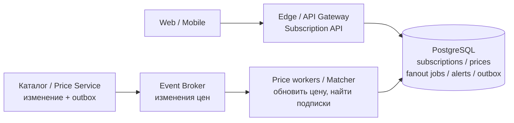
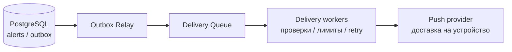

# Оповещения о низких ценах

## Содержание

- [Задача и ожидания от кандидата](#задача-и-ожидания-от-кандидата)
- [Фаза 1: уточнение требований](#фаза-1-уточнение-требований)
- [Фаза 2: оценка нагрузки](#фаза-2-оценка-нагрузки)
- [Фаза 3: высокоуровневый дизайн](#фаза-3-высокоуровневый-дизайн)
- [Фаза 4: deep dive](#фаза-4-deep-dive)
- [Сквозные потоки](#сквозные-потоки)
- [Узкие места, отказы и наблюдаемость](#узкие-места-отказы-и-наблюдаемость)
- [Трейдоффы](#трейдоффы)
- [Фаза 5: финал](#фаза-5-финал)
- [Interview-ready answer](#interview-ready-answer)
- [Связанные материалы](#связанные-материалы)

Разбор на 45–60 минут по [общему плану интервью](./00-how-to-approach.md).
Основной deep dive — поиск подходящих подписок и надёжное создание оповещения.
Доставку через внешние каналы раскрываем как отдельный контур, не проектируя
заново весь [Notification Service](./02-notification-service.md).

---

## Задача и ожидания от кандидата

> Спроектируй сервис доставки оповещений о низких ценах.

Такая формулировка намеренно не задаёт ни источник цен, ни понятие «низкая»,
ни масштаб. До выбора технологий кандидат должен превратить её в проверяемую
бизнес-задачу. Ожидания от этапа:

1. Уточнить задачу, установить рамки и контекст.
2. Предложить архитектуру на уровне сервисов, хранилищ, очередей и их взаимодействий.
3. Самостоятельно найти узкие места при масштабировании и предложить решения.
4. Быть готовым разобрать реализацию одного компонента.
5. Вести дискуссию как ведущий разработчик, ответственный за результат.

Последний пункт — не требование говорить без остановки. Кандидат предлагает
порядок обсуждения, проговаривает допущения и последствия решений, проверяет
согласие интервьюера и возвращается к бизнес-цели после технических деталей.

> «Сначала определю, за какой ценой следим и когда оповещение считается полезным.
> Затем оценю поток изменений и число получателей, нарисую обнаружение и доставку.
> В детали предлагаю пойти на примере товара с миллионом подписчиков».

---

## Фаза 1: уточнение требований

### Какие вопросы задать

| Вопрос интервьюеру | Почему ответ меняет архитектуру |
| --- | --- |
| Это наши товары или цены сторонних магазинов? Есть события изменений или только API опроса? | Собственный поток событий и сбор чужих цен — разные задачи; во втором случае доминируют квоты и свежесть источников |
| Подписка на конкретное предложение, товар у любого продавца или поисковый запрос? | Прямой индекс по offer ID, агрегатор предложений и сопоставление произвольных фильтров требуют разных механизмов |
| «Низкая» — ниже заданной суммы, снижение на процент или минимум за месяц? | Последний вариант требует истории и правил сравнения, а не только текущей цены |
| Включены доставка, купоны, валюта и регион? Нужно ли наличие? | Два числа могут обозначать разные предложения; дешёвый отсутствующий товар не должен запускать рассылку |
| Нужен один сигнал или повторные уведомления при новых снижениях? | Различаются состояние подписки, дедупликация и защита от колебаний цены |
| Какие каналы, сроки доставки, тихие часы и правила отписки? | Очереди и срок годности сообщения зависят от продукта, а не от выбора брокера |
| Сколько подписок и обновлений цен? Сколько подписчиков у самого популярного товара? | Средние значения скрывают главный всплеск рассылки |

Если источник внешний и его нужно опрашивать, переключаем обсуждение на
[подписки на цену авиабилетов](./21-flight-price-alerts.md): там разобраны
объединение одинаковых запросов и бюджет обращений к поставщикам.

### Зафиксированный scope этого решения

Далее — учебные допущения, которые кандидат согласовал с интервьюером:

- Это маркетплейс. Каталог и Price Service уже существуют, публикуют изменения
  предложений и предоставляют API текущей цены и доступности.
- Подписка привязана к `offer_id`: конкретный продавец, вариант товара, регион
  и валюта. Сравниваем публичную цену товара без персональных купонов и доставки;
  это явно указано пользователю.
- Пользователь задаёт `target_price`. Срабатывание происходит, когда доступное
  предложение стоит не дороже порога. Уже подходящую цену проверяем и при создании
  подписки: не ждём следующего изменения.
- Одна версия настройки подписки создаёт не более одного логического оповещения.
  Оно сохраняется в приложении; push — дополнительная доставка. Повторное
  включение создаёт новую версию. Бесконечные повторные сигналы пока вне scope.
- Пользователь видит подписки и оповещения, меняет порог и отключает подписку.
  Отдельно учитываем согласие на push и тихие часы.
- Цена не резервируется и не гарантируется до покупки. В оповещении есть время
  наблюдения, а по переходу открывается актуальное предложение.

Вне scope: парсинг сайтов, персональные рекомендации, расчёт «лучшей цены за год»,
оплата и резерв товара. Email/SMS можно подключить позднее к контуру доставки.

### Нефункциональные требования

Это цели учебного кейса, а не характеристики конкретной компании:

| Цель | Граница обещания |
| --- | --- |
| API доступен 99,9% времени; p99 до 300 мс | Создание/изменение подписки не ждёт внешнего push-провайдера |
| В обычном режиме p99 до 60 секунд от изменения цены до принятия push провайдером | Отдельно измеряем получение на устройстве; offline-устройству этот срок не гарантируется |
| Миллион получателей одного изменения — до 10 минут | Отдельно согласованный режим массового всплеска; проверяем квоты и весь конвейер |
| Срок годности оповещения — 15 минут от обнаружения подходящей цены | После deadline push не отправляем; тихие часы не продлевают жизнь старой цены |
| Подтверждённые подписки и созданные оповещения переживают потерю одного узла/зоны | Реплицируемая БД, безопасное переключение writer, backup и проверка восстановления |

Создание оповещения и его внешний показ — разные гарантии. Внутренний дубль
предотвращаем транзакцией; отсутствие повторного push при неизвестном исходе
провайдера без его поддержки обещать нельзя.

---

## Фаза 2: оценка нагрузки

Все числа ниже — допущения для оценки, не результаты нагрузочного теста.
Для объёмов используем десятичные KB/GB, индексы и реплики считаем отдельно.

```text
10 млн активных подписок, 2 млн предложений → в среднем 5 подписок на предложение
20 млн изменений цен/сутки / 86 400 ≈ 231 событие/с; пик ×10 ≈ 2 315/с
1 млн изменений подписок/сутки / 86 400 ≈ 12/с; пик ×10 ≈ 116/с

Полный просмотр подписок на каждое изменение в пике:
  2 315 × 10 млн ≈ 23 млрд проверок/с
Индекс по предложению при равномерном распределении:
  2 315 × 5 ≈ 11 575 проверок/с до фильтра по порогу

Подписки: 10 млн × 300 Б ≈ 3 GB полезных данных
Допущение: 1 млн логических оповещений/сутки, хранение 90 дней, 1 KB каждое
  1 млн × 90 × 1 KB = 90 GB без индексов, попыток доставки и реплик
```

Пять подписчиков — среднее по каталогу, а не по фактическому потоку событий.
Если цены чаще меняют у популярных товаров, проверок будет больше. Поэтому
индекс снимает полный просмотр базы, но не снимает массовую рассылку.

### Проверка горячего товара

Пусть цена упала у предложения с миллионом подходящих подписчиков. Допустим,
общая согласованная квота push — 5 000 попыток/с, из неё 2 000 зарезервированы
остальному трафику и 3 000 доступны этому всплеску:

```text
Нижняя оценка без повторов: 1 000 000 / 3 000 ≈ 333 с
С допущением 20% дополнительных попыток: 1 200 000 / 3 000 = 400 с
Цель 10 минут: 600 с; остаётся 200 с запаса на другие задержки
```

Это не доказательство выполнения p99: построение заданий, чтение БД, backoff
и ошибки тоже занимают время. Но уже видно, что 60 секунд для такого всплеска
невозможны при данной квоте. Нужно договориться об отдельном сроке, повысить
квоту или изменить продукт, а не только добавить workers.

**Вывод для архитектуры.** Нужны индекс подписок, асинхронный fan-out — разбиение
одного изменения на много получателей — и ограничение исходящего потока.
Размер подписок сам по себе не требует шардирования: начинаем с PostgreSQL,
проверяем нагрузкой смесь чтения, создания оповещений и обновления статусов.

---

## Фаза 3: высокоуровневый дизайн

### Схема 1: подписки и обнаружение подходящей цены



Matcher читает и изменяет БД; стрелка к PostgreSQL обозначает обе операции,
а не одностороннюю выгрузку. API сохраняет подписку вместе с заданием первой
проверки. Price workers сохраняют последнюю версию цены и задания рассылки.
Отдельные процессы Matcher выполняют эти задания порциями.

### Схема 2: доставка созданного оповещения



Перед внешней отправкой worker проверяет подписку, согласие, deadline и актуальность
предложения; результаты попыток сохраняет в БД. Эти обращения раскрыты в deep dive,
чтобы не превращать схему в пересекающиеся стрелки. Event Broker и Delivery Queue
могут быть разными топиками одного брокера; отдельный кластер не обязателен.

### Роль каждого компонента

| Компонент | Зачем и почему выделен |
| --- | --- |
| [Edge / API Gateway](../external-request-flows/edge-and-proxy-patterns/README.md), Subscription API | Аутентификация, ограничения запросов и управление своими подписками; не ждёт выполнения рассылки |
| Каталог / Price Service | Внешняя для этого кейса истина о цене и доступности; версия предложения приходит от владельца данных |
| [PostgreSQL](../../06-databases/database-systems-catalog/postgresql/README.md) | Подписки, текущая проекция цен, задания, оповещения и outbox; одна транзакция связывает состояние подписки с созданным оповещением |
| [Event Broker](../../07-message-brokers-and-streaming/00-comparison.md) | Буфер изменений и повторное чтение после сбоя; публикацию из outbox выполняет сервис/relay, не сама БД |
| Price workers / Matcher | Отделяют приём свежих цен от дорогого перебора получателей; масштабируются независимо от API |
| [Outbox Relay](../../06-databases/database-systems-catalog/postgresql/14-outbox-and-idempotency.md), Delivery Queue | Доставляют созданные намерения отправки после commit и переживают недоступность внешнего канала |
| [Delivery workers](./02-notification-service.md) | Контролируют квоты, отписки, повторные попытки и срок годности; медленный провайдер не блокирует обработку цен |

Redis в базовом решении не нужен как источник истины. Кеш текущих цен или общий
rate limiter добавляем по измерениям; потеря кеша не должна удалять подписки
или позволять повторно создать уже существующее оповещение.

---

## Фаза 4: deep dive

### 4.1 Модель данных и API

| Сущность | Поля, определяющие поведение |
| --- | --- |
| `subscriptions` | `id`, `user_id`, `offer_id`, `target_minor`, `revision`, `state`, `expires_at` |
| `current_prices` | `offer_id`, `source_version`, `price_minor`, `currency`, `available`, `observed_at` |
| `fanout_jobs` | Предложение, версия источника, диапазон подписок или одна подписка для первой проверки, сохранённый курсор, состояние/аренда |
| `alerts` | `alert_id`, подписка и её версия, наблюдавшаяся цена/время, `expires_at`; уникально `(subscription_id, revision)` |
| `deliveries` | `alert_id`, канал/получатель, состояние, попытки, время следующей попытки, provider reference |

Деньги храним в минимальных единицах целым числом. `source_version` монотонна
в пределах предложения; `revision` увеличивается при смене порога или повторном
включении подписки. Это разные счётчики, их нельзя сравнивать между собой.

API: `POST /subscriptions`, `PATCH /subscriptions/{id}`, `DELETE /subscriptions/{id}`,
`GET /subscriptions`, `GET /alerts`. Создание идемпотентно по ключу пользователя
и параметрам; изменение требует ожидаемую `revision`, иначе возвращает конфликт.
Каждая операция проверяет владельца подписки. DELETE логически отключает её,
чтобы позднее задание не восстановило удалённую подписку.

### 4.2 Как найти подписчиков без полного просмотра базы

Задача обратная обычному поиску: пришло предложение, нужно найти сохранённые
условия, которым оно соответствует. Для конкретного `offer_id` и одного
числового порога достаточно индекса, Elasticsearch не обязателен:

```sql
CREATE INDEX subscriptions_match_idx
ON subscriptions (offer_id, target_minor, id)
WHERE state = 'ACTIVE';

SELECT id, revision, target_minor
FROM subscriptions
WHERE state = 'ACTIVE'
  AND offer_id = :offer_id
  AND target_minor >= :price_minor
  AND expires_at > now()
ORDER BY target_minor, id
LIMIT 500;
```

Если цена 8 000, подписки «не дороже 9 000» и «не дороже 8 000» подходят,
а «не дороже 7 000» — нет. Равенство по предложению и диапазон по порогу
сужают чтение B-tree; см. [PostgreSQL: multicolumn indexes](https://www.postgresql.org/docs/18/indexes-multicolumn.html).
Срок подписки проверяем отдельно; `now()` не зашиваем в предикат индекса.

500 — выбранный учебный размер порции, его подбирают нагрузочным тестом.
Следующая страница добавляет условие
`(target_minor, id) > (:last_target, :last_id)`, а не растущий `OFFSET`.
После обработки порции сохраняем курсор вместе с результатами в транзакции.
При повторе порции уникальность оповещения защищает от дубля.

Изменение порога может переместить подписку за уже пройденный курсор.
Поэтому создание, изменение и повторное включение подписки всегда сохраняют
собственное задание проверки в той же транзакции. Matcher выбирает эти задания
из БД наряду с заданиями обхода. Это закрывает гонку с обходом получателей;
новая подписка не обязана попасть в снимок старой рассылки.

### 4.3 Старые цены, конкурирующие workers и одно срабатывание

В этом продукте важно актуальное выгодное предложение, а не фиксация каждого
мимолётного пересечения порога. Price worker принимает только большую
`source_version` и в той же транзакции сохраняет задание Matcher. Устаревший
дубль не откатывает цену; одинаковая версия с другим содержимым — ошибка источника.
Snapshot API нужен для первой проверки и восстановления пропущенных обновлений.

Пример: пришла версия 42 с ценой 8 000, затем запоздала версия 41 с ценой 10 000.
Текущая цена остаётся 8 000. Если версия 43 подняла её до 11 000 раньше отправки,
старое задание не является обещанием отправить уведомление про 8 000.

Для каждого кандидата Matcher выполняет короткую транзакцию:

1. Блокирует строку подписки, проверяет её версию, `ACTIVE`, срок и текущую цену
   предложения в локальной проекции. Полный fan-out под одной блокировкой не идёт.
2. Если условие выполнено, создаёт `alert` с уникальным `(subscription_id, revision)`,
   переводит подписку в `TRIGGERED` и пишет outbox для доставки одним commit.
3. Если другой worker уже выполнил переход или пользователь изменил/отключил
   подписку, кандидат ничего не создаёт. Внешних вызовов внутри транзакции нет.

`TRIGGERED` означает «оповещение создано в приложении», не «push прочитан».
Статус доставки может стать `ACCEPTED`, `EXPIRED` или `FAILED` независимо от него.
При истечении срока push подписка не включается самопроизвольно: для нового
срабатывания пользователь явно включает новую версию. Это цена согласованной
одноразовой семантики, а не универсальное правило для всех price-alert продуктов.

### 4.4 Свежесть, отписка и неизвестный результат отправки

Перед вызовом push-провайдера worker проверяет, что версия подписки не изменена,
она не отключена, есть согласие на канал и не наступил deadline. Тихие часы
откладывают отправку только в пределах этого срока; иначе остаётся запись
в приложении с истёкшей актуальностью.

Цену и наличие перепроверяем через Price Service. Для массовой рассылки
подтверждение одного предложения объединяем между получателями и переиспользуем
не дольше согласованного окна, например 30 секунд. Это допущение о свежести,
а не гарантия неизменности цены. Если цена всё ещё подходит, отправляем актуальное
значение и время проверки; если нет или источник недоступен — откладываем
в пределах deadline либо отменяем push. Само историческое оповещение не стираем.

Даже проверка непосредственно перед отправкой не резервирует предложение:
оно может подорожать или закончиться сразу после ответа. Аналогично отписка
останавливает ещё не начатые отправки, но не отзывает уже переданный push.
Проверку подписки и разрешение начать попытку сериализуем с отключением;
после этого остаётся неизбежное окно внешнего вызова.

Внутренние повторы используют тот же `alert_id` и ключ доставки. Если провайдер
поддерживает идемпотентность/проверку статуса — используем их. Иначе таймаут
оставляет неизвестный исход: для рекламного push в этом кейсе предпочитаем
не повторять такую попытку автоматически, сохраняя оповещение в приложении.
Это осознанный риск пропуска вместо навязчивого дубля. Явный временный отказ,
при котором сообщение не принято, повторяем с backoff и случайной задержкой,
не позже `expires_at`.

Состояние начала попытки сохраняем до внешнего вызова. Если worker умер, оставив
его незавершённым, другой worker не отправляет сообщение заново только потому,
что истекла аренда: результат тоже считаем неизвестным. Так же обрабатываем
падение после успешного ответа провайдера, но до записи результата в БД.

Успех API провайдера не означает показ на телефоне. У push задаём остаточный
срок жизни сообщения: иначе оно может приехать после длительного offline.
Например, [FCM документирует отложенную доставку и TTL](https://firebase.google.com/docs/cloud-messaging/customize-messages/setting-message-lifespan).
Истёкшая запись не должна предлагать купить по старой цене при открытии приложения.

---

## Сквозные потоки

1. Создание подписки → API сохраняет `ACTIVE` и задание первой проверки → Matcher
   получает текущую цену → при выполнении условия создаёт alert и outbox.
   Итог: уже низкая цена не требует нового события для срабатывания.
2. Снижение цены → Price worker обновляет проекцию и сохраняет fan-out job →
   Matcher перебирает подходящие подписки порциями → relay передаёт созданные
   alert в очередь → delivery worker проверяет актуальность и отправляет push.
   Итог: источник цен не ждёт миллиона внешних вызовов.
3. Отключение подписки во время рассылки → API меняет состояние/версию → Matcher
   и delivery worker отклоняют старые задания. Итог: ещё не начатые отправки
   прекращаются; уже переданное провайдеру сообщение может дойти.

---

## Узкие места, отказы и наблюдаемость

### Горячий товар не лечится только числом партиций брокера

Если события разделены по `offer_id`, все версии одного предложения попадают
к одному обработчику. Он должен быстро сохранить свежую цену и задания,
а не сам пройти миллион подписок. Fan-out jobs разбиваем по непересекающимся
диапазонам `(target_minor, id)`; workers выполняют их независимо, сохраняя курсоры.
Старую версию задания можно закрыть в пользу нового обхода текущей цены:
мы договорились не гарантировать каждый краткий провал цены.

Диапазоны распараллеливают обработку, но не расширяют пропускную способность
одной БД или квоту провайдера. Нагрузочный тест должен измерить создание alerts,
индексные чтения, WAL, статусы доставки и восстановление очереди одновременно.
При росте ×10 рассматриваем распределение подписок горячего предложения
по бакетам, а затем по DB-шардам; состояния подписки, alert и outbox остаются
на одном шарде. Простое шардирование только по `offer_id` горячий товар не разделит.

### Что проверять при отказах

| Сценарий | Механизм восстановления и сигнал |
| --- | --- |
| Брокер недоступен | Outbox остаётся в БД; alert по возрасту неопубликованных записей, а не только по их числу |
| Matcher упал на середине диапазона | Продолжение с сохранённого курсора, повтор порции безопасен; измеряем возраст незавершённых jobs |
| Источник перестал присылать цены | Контроль отставания/heartbeat и периодическая сверка со snapshot API; устаревшие данные не выдаём за свежие |
| Цена неожиданно стала нулевой у всего каталога | Валидация формата/валюты, карантин аномалий и ручной выключатель рассылки; не спамим до выяснения |
| Провайдер ограничивает поток | Rate limit, backoff и отдельный бюджет горячей рассылки; контроль времени до deadline |
| Очередь растёт быстрее обработки | Удаление из отправки просроченных заданий, справедливое распределение квоты, пересмотр срока/квоты; больше очереди не увеличивает доставку |
| Потерян узел БД | Реплика с подтверждёнными записями, изоляция прежнего writer; восстановление из backup проверяется отдельно |

Кроме технических lag и ошибок измеряем долю оповещений, истёкших до отправки,
долю отменённых из-за изменения цены, принятие провайдером и доступные сигналы
доставки/открытия отдельно. Смотрим также отписки и жалобы: рост отправок при
росте жалоб не является успехом системы. В labels метрик нет user/offer ID;
конкретные случаи расследуем по `alert_id` в журнале с ограниченным доступом.

---

## Трейдоффы

| Выбор | Альтернатива | Обоснование и цена |
| --- | --- | --- |
| Порог для конкретного предложения | «Самая низкая цена на рынке» | Проверяемое условие без агрегатора; пользователь сам выбирает продавца и порог |
| События цен | Опрос каждой подписки | Не дублируем запросы по одному предложению; нужны восстановление потока и snapshot |
| B-tree по offer и порогу | Поисковый движок для всех условий | Простого условия достаточно; произвольные фильтры потребуют другой модели сопоставления |
| Одно срабатывание на версию | Повторы при каждом снижении | Простая дедупликация; повторное включение явно, для постоянного наблюдения нужны cooldown и правила нового эпизода |
| Актуальная подходящая цена | Обработка каждого пересечения порога | Можно отменять устаревшие задания; краткий провал цены иногда не приводит к push |
| Durable alert и внешняя доставка отдельно | Синхронная отправка из API | Отказ канала не теряет оповещение; пользователь видит промежуточные статусы |
| Не повторять неизвестный неидемпотентный push | Повторять с риском дубля | Предпочитаем меньше спама; часть внешних показов может быть потеряна |

---

## Фаза 5: финал

### Двухминутное резюме

> Я сузил задачу до подписки на доступное предложение конкретного продавца
> с пользовательским порогом цены. Цена не резервируется, а одно срабатывание
> создаёт запись в приложении и попытку push-доставки.
>
> Изменения цен поступают от существующего Price Service. Matcher находит
> подписки индексом по предложению и порогу, затем порциями создаёт оповещения.
> Переход подписки, alert и outbox фиксируются одной транзакцией. Это защищает
> от потери задания и повторного внутреннего срабатывания после сбоя.
>
> Доставка отделена: workers соблюдают квоты, согласия, тихие часы и deadline,
> перепроверяют цену. Успех push API не означает показ на устройстве; неизвестный
> исход без идемпотентности провайдера не превращаем в обещание exactly once.
>
> Главный риск масштаба — не размер таблицы, а миллион получателей одной цены.
> При доступных 3 000 попыток/с он занимает минимум 333 секунды даже без повторов,
> поэтому для всплеска согласован отдельный срок. Разбиваем fan-out на диапазоны,
> сохраняем прогресс и не позволяем одному товару занять весь бюджет доставки.
>
> При росте сначала измерю БД и конвейер целиком, затем распределю горячие
> подписки по бакетам/шардам. История минимумов, внешние магазины и повторные
> сигналы — следующие расширения продукта с отдельной ценой реализации.

### Как вести дискуссию дальше

Не заканчиваем на «всё масштабируется горизонтально». Предлагаем проверяемый
следующий шаг: тест с миллионом подписчиков, падением worker после commit,
изменением цены и отпиской во время fan-out. Проверяем отсутствие повторных
alerts, восстановление курсора, истечение deadline и изоляцию обычного трафика.
Если интервьюер меняет требование на «уведомить всех за минуту», возвращаемся
к квоте и расчёту, а не дорисовываем ещё один брокер.

---

## Interview-ready answer

**1. С чего начать такую общую задачу?**

- Рамки — определить источник цены, объект подписки и смысл слова «низкая».
- Результат — согласовать каналы, сроки, повторы и гарантию актуальности до выбора технологий.

**2. Почему не проверять все подписки по расписанию?**

- Нагрузка — повторяются проверки неизменившихся предложений; в нашем пике полный просмотр даёт около 23 млрд сравнений/с.
- Решение — изменение цены находит кандидатов по индексу; новая подписка получает отдельную первую проверку.

**3. Как убрать дубли при падении worker?**

- Внутри — уникальность по подписке и версии, alert и outbox в одной транзакции.
- Снаружи — поддержка провайдера или явный выбор между риском пропуска и дубля при неизвестном исходе.

**4. Что произойдёт с миллионом подписчиков одного товара?**

- Обработка — короткое принятие цены и отдельные задания по диапазонам подписок.
- Ограничение — DB capacity и квота доставки остаются; 1 млн / 3 000 ≈ 333 секунды без повторов.

**5. Как не прислать старую цену или сообщение после отписки?**

- Проверка — актуальное предложение, версия подписки и deadline перед разрешением отправки.
- Граница — уже начатый внешний вызов не отзывается; цена при покупке проверяется заново.

---

## Связанные материалы

- [Как проходить System Design Interview](./00-how-to-approach.md) — рамки, тайминг и ведение обсуждения.
- [Notification Service](./02-notification-service.md) — каналы, квоты и доставка.
- [Подписки на цену авиабилетов](./21-flight-price-alerts.md) — вариант с внешними источниками и ограниченным опросом.
- [Avito / Classifieds](./13-avito-classifieds.md) — каталог и поисковая проекция.
- [Backpressure](../reliability-patterns/05-backpressure-and-shedding.md) — поведение при переполнении конвейера.
- [Идемпотентность](../reliability-patterns/06-idempotency.md) — границы повторной обработки и внешних эффектов.
