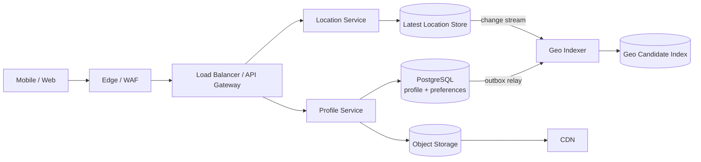
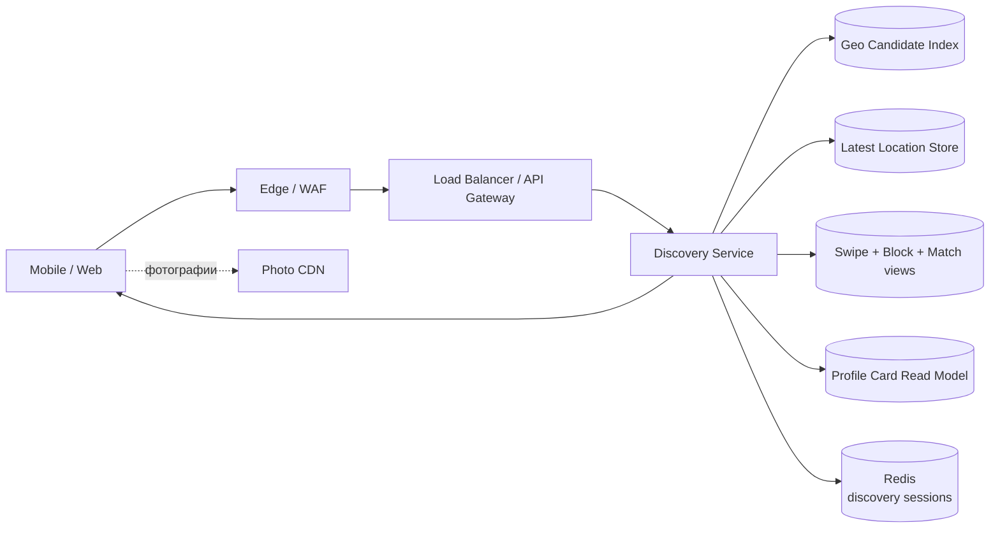
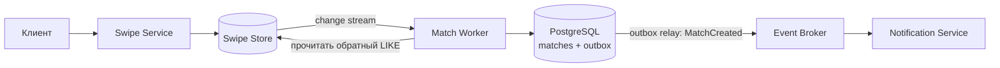

# Dating Service: геопоиск, свайпы и взаимные матчи

## Содержание

- [Что проектируем](#что-проектируем)
- [Фаза 1: уточнение требований](#фаза-1-уточнение-требований)
- [Фаза 2: оценка нагрузки](#фаза-2-оценка-нагрузки)
- [Ключевые концепции](#ключевые-концепции)
- [Фаза 3: высокоуровневый дизайн](#фаза-3-высокоуровневый-дизайн)
- [Фаза 4: deep dive](#фаза-4-deep-dive)
- [Сквозные потоки](#сквозные-потоки)
- [Отказы и наблюдаемость](#отказы-и-наблюдаемость)
- [Трейдоффы](#трейдоффы)
- [Фаза 5: финал](#фаза-5-финал)
- [Interview-ready answer](#interview-ready-answer)
- [Связанные материалы и источники](#связанные-материалы-и-источники)

Разбор на 45–60 минут по [общему плану интервью](./00-how-to-approach.md).
Основные углубления — географический поиск в радиусе `N` и создание одного
матча при двух конкурентных лайках. Чат после матча считаем отдельной системой.

---

## Что проектируем

Пользователь создаёт профиль, задаёт предпочтения и разрешённый радиус поиска.
Сервис показывает анкеты людей, которые подходят по фильтрам и находятся не
дальше `N` километров. Пользователь ставит лайк или пропускает анкету. Если два
человека поставили друг другу лайк, появляется один взаимный матч и оба получают
уведомление.

Здесь важно различать три операции:

- поиск кандидатов — выбрать небольшое множество подходящих анкет;
- свайп — надёжно сохранить решение одного пользователя о другом;
- матч — зафиксировать взаимный лайк как отдельную сущность.

Географический поиск не создаёт матч. Он лишь формирует кандидатов, которых
ещё нужно отфильтровать по блокировкам, предыдущим свайпам, активности и
предпочтениям.

**Главная оговорка.** Телефон сообщает координату с погрешностью и может быть
скомпрометирован. Поэтому контракт «только в радиусе `N`» означает расстояние
между принятыми системой координатами с допустимой свежестью, прочитанными
точной проверкой во время запроса. Сразу после чтения человек может переместиться;
линеаризовать discovery с непрерывным движением пользователей не требуется.
Гарантировать фактическое физическое положение человека backend тоже не может.

---

## Фаза 1: уточнение требований

### Что спросить

| Вопрос | Почему меняет дизайн |
| --- | --- |
| Радиус применяется только к настройке смотрящего или должен быть взаимным? | Во втором случае нужно проверять и максимальный радиус кандидата |
| Насколько свежей должна быть координата? | Определяет частоту обновлений, размер потока и возможность показывать неактивных людей |
| Нужен непрерывный трекинг или последняя координата при использовании приложения? | Непрерывный трекинг кратно увеличивает запись и ухудшает приватность |
| Какие фильтры обязательны? | Возраст, взаимные предпочтения, язык и статус должны попасть в индекс кандидатов |
| Можно ли снова показать пропущенную анкету? | Определяет TTL решения `PASS` и объём истории свайпов |
| Матч должен появиться прямо в ответе на второй лайк? | Синхронная проверка даёт лучший UX, асинхронное восстановление всё равно нужно после timeout |
| Что делает блокировка? | Заблокированный пользователь должен исчезнуть из discovery, матчей и последующей доставки сообщений |
| Нужна ли точная дистанция в интерфейсе? | Возврат точного расстояния облегчает вычисление местоположения пользователя |
| Один регион или весь мир? | Появляются домашний регион данных, перемещение пользователя и поиск у границ регионов |

### Зафиксированный scope

- Создание и редактирование профиля с несколькими фотографиями.
- Обновление последней координаты при активном использовании приложения.
- Получение страницы из 20 кандидатов в радиусе от 1 до 100 км.
- Базовые взаимные фильтры: возрастной диапазон и допустимая аудитория.
- Радиус `N` принадлежит смотрящему; радиус кандидата в MVP не проверяется.
- `LIKE` и `PASS`; пропуск живёт 30 дней, после чего анкету можно показать снова.
- Один матч на неупорядоченную пару пользователей.
- Блокировка пользователя и событие для push-уведомления о матче.

За рамками: чат, платные поднятия анкеты, видеозвонки, точная ML-модель
ранжирования, проверка документов и полный медиапайплайн. Фотографии загружаются
в object storage и раздаются через CDN по уже известному механизму.

### Нефункциональные требования

Для упражнения фиксируем следующие допущения и SLO:

- 10 млн DAU и 50 млн зарегистрированных профилей.
- `GET /discovery`: p99 не более 300 мс внутри региона.
- `POST /swipes`: p99 не более 200 мс до надёжной фиксации свайпа.
- Региональные read- и write-API доступны 99,99% времени при отказе одного узла
  или одной зоны доступности.
- Подтверждённый лайк не теряется; повтор запроса не создаёт второй эффект.
- На одну пару существует не более одного активного матча.
- Матч и уведомление могут появиться с задержкой до нескольких секунд.
- Геоиндекс может отставать до 5 секунд, но финальный ответ не должен содержать
  кандидата за пределами `N` по версии координаты, прочитанной точной проверкой
  во время запроса.
- Координата старше 24 часов не участвует в поиске.
- Точные координаты другого пользователя никогда не возвращаются клиенту.

### Что означает радиус при погрешности GPS

Для MVP принимаем координату только при разумной заявленной точности, например
не хуже 1 км, и сохраняем `accuracy_m`. Есть два возможных контракта:

```text
Обычный продуктовый:
  distance(reported_A, reported_B) <= N

Консервативный:
  distance(reported_A, reported_B) + accuracy_A + accuracy_B <= N
```

Второй реже покажет человека за фактической границей, но потеряет много
кандидатов рядом с ней. На интервью достаточно выбрать один контракт и назвать
цену. Ни один из них не защищает от поддельной координаты — это задача
антифрода, а не пространственного индекса.

---

## Фаза 2: оценка нагрузки

Все числа ниже — допущения для упражнения, а не сведения о реальном Tinder.

```text
DAU                                      10 млн
сессий на пользователя в сутки           2
страниц discovery на сессию               5
анкет на страницу                        20
свайпов на пользователя в сутки          50
обновлений координаты в сутки             20
коэффициент пика                           5
```

### Discovery

```text
10 млн × 2 × 5 = 100 млн страниц/сутки

Среднее: 100 млн / 86 400 ≈ 1 157 запросов/с
Пик:     1 157 × 5       ≈ 5 800 запросов/с

Анкет, рассмотренных системой:
100 млн × 20 = 2 млрд анкет/сутки
```

Если для фильтрации запрашивать из геоиндекса по 200 документов на одну страницу,
на пике он должен рассмотреть около `5 800 × 200 = 1,16 млн` кандидатов/с.
Это не означает миллион сетевых запросов: один поисковый запрос возвращает
пакет кандидатов. Число объясняет, почему фильтры должны исполняться в индексе,
а следующие проверки — пакетно, без одного RPC на каждую анкету.

Если метаданные одной карточки занимают 2 KB, страница из 20 карточек — около
40 KB без фотографий:

```text
100 млн страниц × 40 KB ≈ 4 TB/сутки метаданных
```

Фотографии дают намного больше трафика и идут напрямую через CDN, а не через
Discovery Service.

### Свайпы

```text
10 млн × 50 = 500 млн свайпов/сутки

Среднее: 500 млн / 86 400 ≈ 5 800 записей/с
Пик:     5 800 × 5       ≈ 29 000 записей/с
```

При условных 64 B полезных данных одного свайпа нижняя оценка накопления:

```text
500 млн × 64 B ≈ 32 GB/сутки
32 GB × 365    ≈ 11,7 TB/год
```

Это не физический размер БД. Ключи, служебные поля, индексы, compaction,
репликация и запас увеличивают его в несколько раз. Если `PASS` удаляется
логически через 30 дней, только его активное окно всё равно имеет порядок
`32 GB × 30 ≈ 960 GB` сырого payload при допущении, что все решения — `PASS`.

Вывод: доступ только по известным ключам, высокий поток записи и большой объём
делают KV/wide-column хранилище разумным кандидатом для свайпов. PostgreSQL
остаётся нормальным началом на меньшем масштабе или при достаточном числе шардов,
но выбор подтверждается нагрузочным тестом полной операции.

### Координаты и медиа

```text
10 млн × 20 = 200 млн обновлений координаты/сутки

Среднее: 200 млн / 86 400 ≈ 2 300 записей/с
Пик:     2 300 × 5       ≈ 11 600 записей/с
```

Нужно хранить только последнюю принятую координату, а не 200 млн новых строк
навсегда. История перемещений не входит в scope и ухудшает приватность.

```text
50 млн профилей × 2 KB          ≈ 100 GB сырых метаданных
50 млн × 4 фото × 1 MB          ≈ 200 TB медиа
```

Медиа определяет object storage и CDN. Геообновления определяют отдельную
модель записи и асинхронное обновление поисковой проекции.

### Выводы из чисел

- Discovery Service и Swipe Service масштабируются независимо: 5,8K чтений/с против 29K записей/с в пике.
- Геопоиск возвращает top-K, а не материализует всех людей в радиусе большого города.
- `PASS`, ключи идемпотентности и долгоживущие `LIKE` требуют разных политик retention.
- Координаты обновляются только при движении или истечении интервала, иначе мобильные клиенты создают бессмысленный поток.
- Число узлов и шардов нельзя вывести без benchmark выбранной схемы, индексов и репликации.

---

## Ключевые концепции

### Геоиндекс — генератор кандидатов, а не источник истины

Поисковый индекс хранит координату и фильтруемые атрибуты профиля. Он быстро
находит top-K документов в окружности, но обновляется асинхронно. Поэтому его
результат — широкое множество кандидатов, а не окончательный ответ.

```text
Geo Candidate Index
    → 100-200 возможных кандидатов
    → свежие координаты и точное расстояние
    → блокировки, матчи, прежние свайпы
    → взаимные предпочтения
    → ранжирование и 20 карточек
```

Если старая координата индекса уже за пределами радиуса, недавно приблизившийся
человек временно не попадёт в выдачу. Это допустимый false negative. Если индекс
ещё считает ушедшего человека близким, финальная проверка свежей координаты
удалит его и не допустит false positive за пределами `N`.

### Пространственная ячейка не равна окружности

H3 и geohash разбивают поверхность на ячейки. Для поиска можно взять ячейку
пользователя и соседние ячейки, но граница радиуса пересекает их произвольно:

```text
ячейки дают дешёвый coarse filter
точная формула расстояния даёт окончательный ответ
```

Если проверять только совпадение ячейки, потеряются люди через ближайшую грань,
а из углов соседних ячеек попадут люди дальше `N`. Разрешение сетки также нельзя
жёстко связать с одним радиусом: пользователь может выбрать и 2, и 100 км.

### Матч — отдельная идемпотентная сущность

Два лайка не нужно «сливать» в одну изменяемую строку. Сохраняются направленные
свайпы `A → B` и `B → A`, а матч получает канонический ключ пары:

```text
user_low  = min(A, B)
user_high = max(A, B)
pair_key  = hash(user_low, user_high)

UNIQUE (user_low, user_high)
```

Какой бы лайк ни обрабатывался первым и сколько бы раз событие ни доставлялось,
условная вставка создаёт только один матч.

### Выдача — сессия, а не стабильная страница таблицы

Кандидаты постоянно двигаются, становятся неактивными и получают новые свайпы.
`OFFSET 100` над живой выдачей приводит к дублям и пропускам. На несколько минут
фиксируем короткий список идентификаторов в discovery-сессии и возвращаем
непрозрачный cursor. Новый радиус, новая координата или изменение фильтров
создают новую сессию.

---

## Фаза 3: высокоуровневый дизайн

### Обновление данных для discovery



Location Store надёжно принимает последнюю координату и порождает поток
изменений. Geo Indexer объединяет её с фильтруемыми полями профиля и обновляет
небольшой поисковый документ. Отставание этого пути измеряется отдельно.

### Получение страницы кандидатов



Discovery получает из индекса больше кандидатов, чем требуется странице,
пакетно проверяет актуальные координаты и отношения, ранжирует остаток и
фиксирует короткую сессию в Redis. Redis здесь не решает геопоиск и не является
источником блокировок или свайпов.

### Свайп и создание матча



Синхронный путь после записи свайпа может сразу проверить обратный лайк и
попытаться создать матч. Change stream и Match Worker остаются путём
восстановления: если ответ потерялся или синхронная проверка попала в гонку,
взаимный лайк всё равно будет найден позже.

### Роль компонентов

| Компонент | Зачем | Почему отдельно |
| --- | --- | --- |
| Edge / WAF + Load Balancer / API Gateway | DDoS-защита, аутентификация, rate limiting, маршрутизация и проверка размера запроса | Геообновления и свайпы нельзя принимать без контроля пользователя и абуза |
| Profile Service + PostgreSQL | Профиль, настройки, статусы и блокировки | Нужны ограничения, транзакции и аудит изменений |
| Object Storage + CDN | Оригиналы и производные фотографии | Сотни TB и основной трафик медиа не должны идти через API-сервисы |
| Location Service | Проверка координаты, точности, версии и допустимой скорости движения | Частые записи не должны переписывать весь профиль |
| Latest Location Store | `user_id → latest location` и условное обновление по версии | Точечный high-write доступ отличается от поискового запроса по окружности |
| Geo Candidate Index | Георадиус, фильтры, активность и грубое ранжирование | Это перестраиваемая read-проекция с допустимым lag |
| Discovery Service | Overfetch, точная проверка, исключения, ranking и cursor | Только он соединяет пространственный результат с отношениями и приватностью |
| Swipe Store | Направленные решения и их TTL | 29K записей/с и запросы по известной паре подходят KV/wide-column модели |
| Match Worker | Находит взаимность и повторяет операцию после сбоев | Матч не должен зависеть от одного синхронного RPC |
| Match DB + outbox | Единственный матч пары и надёжное событие `MatchCreated` | Уникальность и публикация связаны одной транзакцией |
| Redis | Короткая discovery-сессия и кеш карточек | Потеря кеша ухудшает latency, но не удаляет профиль, свайп или матч |

---

## Фаза 4: deep dive

### 4.1 API

```http
PUT /v1/me/location

{
    "latitude": 41.7151,
    "longitude": 44.8271,
    "accuracy_m": 25,
    "client_seq": 1842,
    "captured_at": "2026-09-12T10:00:00Z"
}

204 No Content
```

`PUT` повторяется безопасно благодаря условию на `client_seq`, поэтому отдельный
ключ идемпотентности здесь не нужен. `user_id` берётся из авторизации, а не из
body. Сервер проверяет диапазоны
координат, максимальный возраст, точность и монотонную последовательность
конкретного устройства. `client_seq` не заменяет серверную версию при работе
нескольких устройств: Location Service назначает `location_version` либо
разрешает конфликт по принятой продуктовой политике.

```http
GET /v1/discovery?limit=20&cursor=opaque-token

200 OK
{
    "items": [
        {"user_id":"u-42","profile_version":17,"distance_band":"5-10 km"}
    ],
    "next_cursor":"opaque-token-2"
}
```

Cursor подписан и привязан к `viewer_id`, `location_version`, версии фильтров
и discovery-сессии. Координаты и точная дистанция кандидата в ответ не попадают.

```http
POST /v1/swipes
Idempotency-Key: 7f12...

{"target_user_id":"u-42","decision":"LIKE"}

201 Created
{"swipe_id":"sw-91","matched":true,"match_id":"m-15"}
```

`matched=false` означает результат синхронной проверки, а не обещание, что матч
никогда не появится: запоздалый обратный лайк или фоновое восстановление могут
создать его позже. Клиент получает обновление через push и `GET /v1/matches`.
Повтор с тем же `Idempotency-Key` и другим payload отклоняется как конфликт;
при том же payload новый свайп не создаётся, а состояние матча можно перечитать.

Дополнительные операции:

```http
GET  /v1/matches?limit=50&cursor=...
POST /v1/blocks
DELETE /v1/matches/{match_id}
```

Блокировка должна быть идемпотентной. Успешный ответ означает, что блок уже
зафиксирован в авторитетном хранилище; очистка проекций продолжается асинхронно.

### 4.2 Модель данных

Транзакционная часть в PostgreSQL:

```sql
CREATE TABLE profiles (
    user_id             BIGINT PRIMARY KEY,
    status              TEXT NOT NULL,
    birth_date          DATE NOT NULL,
    profile_version     BIGINT NOT NULL,
    updated_at          TIMESTAMPTZ NOT NULL
);

CREATE TABLE preferences (
    user_id             BIGINT PRIMARY KEY,
    min_age             SMALLINT NOT NULL,
    max_age             SMALLINT NOT NULL,
    max_distance_m      INTEGER NOT NULL,
    preference_version  BIGINT NOT NULL
);

CREATE TABLE matches (
    id                  UUID PRIMARY KEY,
    user_low_id         BIGINT NOT NULL,
    user_high_id        BIGINT NOT NULL,
    status              TEXT NOT NULL,
    created_at          TIMESTAMPTZ NOT NULL,
    CHECK (user_low_id < user_high_id),
    UNIQUE (user_low_id, user_high_id)
);

CREATE TABLE blocks (
    blocker_id          BIGINT NOT NULL,
    blocked_id          BIGINT NOT NULL,
    created_at          TIMESTAMPTZ NOT NULL,
    PRIMARY KEY (blocker_id, blocked_id),
    CHECK (blocker_id <> blocked_id)
);

CREATE INDEX idx_blocks_reverse
    ON blocks (blocked_id, blocker_id);
```

Для чтения матчей обоими участниками нужна проекция `matches_by_user`,
шардированная по `user_id`, либо две membership-записи на один матч. Она строится
из `MatchCreated` и восстанавливается из авторитетной таблицы `matches`.
Обратный индекс блокировок позволяет быстро получить и тех, кого заблокировал
пользователь, и тех, кто заблокировал его; при большой нагрузке эти два списка
становятся отдельной read-проекцией.

Логические записи в KV-хранилище:

```text
latest_locations
  PK: user_id
  latitude, longitude, accuracy_m
  location_version, captured_at, accepted_at

swipes
  PK: actor_id
  SK: target_user_id
  decision, swipe_version, request_id, created_at, expires_at?

swipe_requests
  PK: actor_id
  SK: request_id
  payload_hash, swipe_id, created_at, expires_at
```

В DynamoDB запись свайпа и ключ идемпотентности можно выполнить одной
транзакционной операцией. На Cassandra аналогичная модель требует аккуратно
ограничить атомарность одной партицией или принять другой протокол повторов.
Конкретный продукт выбирается после проверки access patterns и нагрузки.

`expires_at` у свайпа опционален: `PASS` получает срок 30 дней, а `LIKE` живёт
до матча, явного отзыва или удаления аккаунта. Если продукт тоже протухает лайки,
это должна быть отдельная бизнес-политика, а не побочный эффект TTL хранилища.

TTL хранилища — механизм очистки, а не проверка бизнес-срока. Удаление может
произойти позже `expires_at`, поэтому Discovery Service сам считает просроченный
`PASS` несуществующим. Это поведение отдельно подчёркивает
[документация DynamoDB TTL](https://docs.aws.amazon.com/amazondynamodb/latest/developerguide/TTL.html).

### 4.3 Выбор геоиндекса

| Вариант | Когда подходит | Ограничение |
| --- | --- | --- |
| PostgreSQL + PostGIS | MVP, один источник данных, умеренный поток обновлений | Частые location updates и тяжёлый discovery конкурируют с OLTP; масштаб проверяется benchmark |
| Elasticsearch/OpenSearch `geo_point` | Георадиус одновременно с фильтрами и top-K ranking | Асинхронное обновление, поэтому это только candidate projection |
| H3/S2 + собственные cell buckets | Нужен контроль шардирования и постепенный поиск по соседним ячейкам | Границы ячеек требуют exact post-filter; фильтры и hot cells придётся строить самим |
| Redis GEO | Небольшая простая выборка «кто рядом» | Сложно совместить много фильтров и ranking; большой общий key может стать hotspot |

Для зафиксированного масштаба выбираем Elasticsearch/OpenSearch как
перестраиваемую проекцию кандидатов. Документ содержит только нужные discovery
поля:

```text
user_id, geo_point, location_version, location_updated_at
birth_date, audience, accepted_audience, accepted_age_range
searchable, profile_version, activity_score
```

`geo_distance` отбирает документы внутри `N`, остальные поля работают как
фильтры, а `activity_score` участвует в top-K. Запрашиваем 100–200 кандидатов,
а не все совпадения. Затем последние координаты перечитываются пакетно и
расстояние проверяется заново.

PostGIS остаётся сильным начальным вариантом: `ST_DWithin` над типом `geography`
принимает расстояние в метрах и использует индексное ограничение кандидатов.
Переход к отдельному поисковому индексу оправдывают измеренные запись, p99 и
сложность фильтров, а не само наличие координат.

H3 полезен как дополнительный routing key или альтернатива поисковому движку:
`gridDisk` возвращает ячейки на расстоянии не больше `k` шагов. Сам `k` не равен
километрам и зависит от resolution; после чтения ячеек точная проверка остаётся.

Подробнее: [Elasticsearch/OpenSearch](../../06-databases/database-systems-catalog/09-elasticsearch-and-opensearch.md),
[геопроекция в Uber-кейсе](./06-uber-ride-sharing.md) и официальные описания
[PostGIS `ST_DWithin`](https://postgis.net/docs/ST_DWithin.html),
[Elasticsearch `geo_distance`](https://www.elastic.co/docs/reference/query-languages/query-dsl/query-dsl-geo-distance-query)
и [H3 `gridDisk`](https://h3geo.org/docs/api/traversal/).

### 4.4 Алгоритм выдачи в радиусе N

```text
1. Прочитать последнюю координату и preferences смотрящего.
2. Отклонить запрос, если координата отсутствует или старше 24 часов.
3. Запросить из Geo Candidate Index 5-10 размеров страницы.
4. Пакетно прочитать latest location для полученных user_id.
5. Удалить stale location и distance > N.
6. Удалить self, block в обе стороны, existing match и действующий swipe.
7. Проверить взаимные возрастные и аудиторные предпочтения. Если продукт требует взаимный радиус, проверить и `distance <= candidate.max_distance`.
8. Применить ranking/diversity и выбрать 20.
9. Сохранить короткую discovery-сессию и вернуть непрозрачный cursor.
10. Если кандидатов мало, прочитать следующую порцию через search_after.
```

Запросы на шагах 4–7 выполняются пакетами. Цикл «на каждого кандидата вызвать
четыре сервиса» при 1,16 млн рассматриваемых кандидатов/с создаст миллионы RPC
и развалит хвост задержки.

На шаге 5 нельзя считать евклидово расстояние между градусами широты и долготы.
Используем проверенную geodesic/Haversine-реализацию либо `ST_DWithin` для
`geography`, если authoritative store — PostGIS; отдельно тестируем переход
через 180-й меридиан. «Точная» здесь означает точность выбранной модели для
прочитанного снимка координат, а не устранение погрешности GPS.

**Fail closed для радиуса.** Если свежую координату кандидата получить не
удалось, его не показываем. Это сохраняет обещание радиуса ценой меньшей выдачи.
При недоступном Swipe Store также безопаснее вернуть меньше карточек или ошибку,
чем массово показать уже отклонённые анкеты.

### 4.5 Плотный город и малонаселённая область

Один радиус создаёт противоположные режимы:

- в центре мегаполиса внутри 5 км могут быть сотни тысяч профилей;
- в сельской местности внутри 50 км может не набраться 20 активных людей.

В плотной области не читаем всех кандидатов. Пространственный индекс сразу
применяет дешёвые фильтры и возвращает ограниченный top-K. Ранжирование добавляет
разнообразие и ограничивает чрезмерное число показов одной анкеты.

В редкой области индекс проходит дальше по отсортированному результату, но не
выходит за `N`. Расширять радиус без согласия пользователя нельзя. Можно вернуть
неполную страницу и предложить изменить настройку.

При H3-подходе горячую ячейку делят более высоким resolution или дополнительным
стабильным bucket. Нельзя случайно выбрать `cell_id` единственным partition key
для миллиона пользователей центра города: все обновления и чтения попадут в
один раздел.

### 4.6 Discovery-сессия и кеш

Персонализированный результат быстро меняется после каждого свайпа, поэтому
глобально кешировать `radius=10km` почти бесполезно. Redis хранит короткую очередь
идентификаторов конкретной сессии:

```text
key:
  discovery:v1:user:<viewer_id>:session:<session_id>

value:
  location_version, preference_version,
  ordered candidate_ids, current_position

TTL:
  10 минут
```

Точное обновление `current_position` не обязательно, если cursor уже содержит
позицию и повтор страницы идемпотентен. Потеря Redis создаёт новую сессию и может
повторить несколько анкет, но не теряет свайпы.

Список ID в Redis не является готовым авторизованным ответом. Перед каждой
страницей Discovery Service заново проверяет свежесть и дистанцию кандидатов,
блокировки и статусы, а выбывших заменяет следующими из пула. Если текущая
`location_version` смотрящего не совпала с версией сессии, cursor инвалидируется
и поиск начинается от новой координаты.

Порядок памяти тоже проверяется числом. Допустим, на пике создаётся 1 200 новых
сессий/с, каждая хранится 10 минут и занимает с ключом и служебными данными
около 2 KB:

```text
1 200 × 600 секунд = 720 000 одновременных сессий
720 000 × 2 KB     ≈ 1,44 GB полезной памяти
```

Реплики, запас и фрагментация считаются сверху. Кластер может понадобиться ради
доступности и распределения запросов, но само рабочее множество не выглядит
огромным.

Карточки профиля можно кешировать отдельно:

```text
profile-card:v1:user:<target_id>:version:<profile_version>
```

Версия не даёт поздней инвалидации вернуть старый текст или фото. После блокировки
и удаления финальный фильтр не полагается только на карточный кеш.

### 4.7 Конкурентные лайки

Рассмотрим одновременные запросы `A LIKE B` и `B LIKE A`:

```text
t1: Swipe Store фиксирует A → B
t2: Swipe Store фиксирует B → A
t3: первый обработчик читает обратный LIKE
t4: второй обработчик читает обратный LIKE
t5: оба выполняют INSERT match(A, B) ON CONFLICT DO NOTHING
t6: только один INSERT создаёт строку и MatchCreated в outbox
```

Если оба обработчика прочитают обратную сторону до её фиксации, синхронный путь
не создаст матч. Change stream доставит оба изменения повторно; Match Worker
прочитает уже сохранённые состояния и выполнит тот же условный `INSERT`.

Если `INSERT` матча закоммитился, но ответ потерялся, повтор по
`Idempotency-Key` находит тот же свайп и может перечитать текущее состояние
канонической пары в Match DB. Сохранять `matched` атомарно вместе со свайпом
нельзя, потому что они находятся в разных хранилищах. `UNIQUE` пары не даёт
создать второй матч, а уведомление идемпотентно по `match_id`.

Перед созданием и перед отправкой уведомления проверяется активная блокировка.
Если блокировка и матч пересеклись по времени, блокировка имеет приоритет:
матч переводится в закрытое состояние, а уведомление не раскрывает профиль.
Для быстрого синхронного ответа обратный свайп можно прочитать строго
консистентно в домашнем регионе. Если такое чтение недоступно или слишком дорого,
ответ остаётся `matched=false`, а корректность обеспечивает фоновая проверка.

### 4.8 География и несколько регионов

Поиск маршрутизируется в регион, где хранится текущая discovery-проекция
пользователя. Крупные географические зоны — это routing, но не граница радиуса:
рядом с государственной или внутренней границей нужно опрашивать соседний
пространственный раздел.

Свайп принадлежит домашнему региону автора, а match маршрутизируется по
каноническому `pair_key`. Межрегионный взаимный лайк может появиться с большей
задержкой, но повторные события и уникальность пары сохраняют корректность.

Активно-активная запись одной координаты из нескольких регионов требует
версии и явного разрешения конфликтов. `last write wins` по клиентским часам
опасен: часы телефона могут уйти вперёд. Используем серверную версию и храним
идентификатор устройства для диагностики.

### 4.9 Приватность и злоупотребления

- Координаты доступны только сервисам поиска и не попадают в публичный профиль, логи или аналитику без необходимости.
- Клиент получает диапазон расстояния, а не широту, долготу и чрезмерно точные метры.
- Частые запросы с меняющимися собственными координатами ограничиваются, чтобы затруднить триангуляцию чужой позиции.
- Неактивный, заблокированный, удалённый или скрытый профиль исключается финальной проверкой, даже если индекс ещё не обновился.
- История точных перемещений не сохраняется по умолчанию; retention и удаление определяются отдельными требованиями.
- Подозрительные скачки координаты и невозможная скорость становятся сигналами антифрода, но не блокируют законные поездки одной эвристикой.

### 4.10 Доступность и восстановление

Stateless-сервисы и входной трафик распределяются минимум по трём зонам
доступности. Региональные хранилища и Event Broker реплицируются между зонами;
свайп подтверждается только после durable write по выбранному quorum или после
синхронного commit на реплику — конкретный механизм зависит от базы.

Для подтверждённых свайпов, блокировок и матчей целевой `RPO = 0`: потеря
доступности предпочтительнее ответа об успехе на ещё не защищённую запись.
Geo Candidate Index и карточные read-модели можно восстановить из Location Store,
Profile DB и потоков изменений, поэтому для них допустим ненулевой RPO самой
проекции. При потере Redis создаётся новая discovery-сессия.

Автоматический failover сам по себе не доказывает `99,99%`. Нужны запас
capacity при потере зоны, проверенные backup/restore и rebuild проекций,
регулярные failover-тесты, а также SLO всех синхронных зависимостей критического
пути. Во время деградации радиус остаётся fail closed: непроверенного кандидата
не показываем.

---

## Сквозные потоки

### 1. Пользователь обновил координату

`PUT /me/location` → Location Service проверяет авторизацию, точность и версию →
Latest Location Store условно записывает более новую координату → change stream →
Geo Indexer обновляет discovery-документ.

Итог: подтверждённая координата сразу доступна точечной проверке; появление
профиля в новом районе допускает задержку до SLO индексатора.

### 2. Пользователь открыл discovery

`GET /discovery` → Geo Candidate Index возвращает 100–200 документов → сервис
пакетно читает последние координаты и отношения → удаляет выходящих за радиус,
заблокированных, просмотренных и несовместимых → ранжирует → сохраняет
упорядоченный пул ID в Redis → возвращает первые 20 карточек и cursor.

Итог: быстрый индекс уменьшает множество, но обещание `distance <= N` защищает
последняя проверка по авторитетной координате.

### 3. Второй лайк создал матч

`POST /swipes` с ключом идемпотентности → Swipe Store фиксирует `B LIKE A` →
синхронная проверка находит `A LIKE B` → Match DB условно создаёт каноническую
пару и outbox → клиент получает `matched=true` → relay публикует `MatchCreated` →
Notification Service отправляет push.

Итог: UX может показать матч сразу, но восстановление не зависит от ответа RPC.

### 4. Синхронная проверка не увидела встречный лайк

Оба лайка сохранены почти одновременно → оба ответа содержат `matched=false` →
change stream доставляет изменения → Match Worker перечитывает обе стороны →
создаёт один матч → пользователи получают push и видят его в `GET /matches`.

Итог: `matched=false` — снимок текущего ответа; acknowledged like не теряется,
а уникальность матча не зависит от порядка событий.

---

## Отказы и наблюдаемость

| Сбой | Поведение | Что измерять |
| --- | --- | --- |
| Geo Candidate Index недоступен | Не сканируем Location Store; возвращаем ошибку или короткую сохранённую сессию после повторной финальной проверки | Search p99/errors, circuit breaker, доля fallback |
| Geo Indexer отстаёт | Возможны временные пропуски; старая близкая координата удаляется точным post-filter | Lag во времени, доля кандидатов, отброшенных по свежей дистанции |
| Latest Location Store недоступен | Не выдаём непроверенных кандидатов за пределами радиуса | Ошибки batch read, пустые/неполные страницы |
| Redis потерял сессию | Создаём новую; возможны повторные карточки, но не повторные свайпы | Cache hit, evictions, session rebuild rate |
| Свайп записан, ответ потерян | Повтор по тому же ключу находит тот же свайп; актуальный матч перечитывается отдельно | Idempotency replays, конфликты payload |
| Change stream доставил дубль | Matcher перечитывает состояния и делает условный insert пары | Duplicate events, match conflicts |
| Notification Service недоступен | Матч остаётся в БД, push повторяется независимо | Outbox age, delivery latency, DLQ |
| Горячая городская ячейка | Ограниченный top-K, более мелкие пространственные разделы, backpressure | Кандидаты на cell/shard, skew, query CPU/p99 |
| Удаление или блокировка не дошли до индекса | Финальный авторитетный фильтр запрещает выдачу | Leakage attempts blocked, projection lag |

Основные продуктово-технические SLI:

- p50/p95/p99 получения первой страницы;
- число найденных и реально возвращённых кандидатов по городу, радиусу и фильтрам;
- доля отсеянных после геоиндекса из-за старой координаты или `distance > N`;
- возраст последнего применённого location/profile event в индексе;
- p99 записи свайпа и время `second like → match created`;
- число взаимных лайков без матча старше SLO — главный reconciliation-индикатор;
- число повторных матчей, конфликтов идемпотентности и дублей уведомлений;
- skew чтений и записей по spatial cell, shard и пользователю;
- доля координат с плохой точностью и аномальными перемещениями.

Для Go важно ограничить параллелизм пакетных чтений. `errgroup` без семафора
может породить сотни одновременных запросов на один discovery. Общий `context`
задаёт budget, а каждому dependency остаётся свой меньший timeout. Большие
списки ID переиспользуются осторожно: пул буферов не должен удерживать редкие
многомегабайтные выбросы и раздувать heap.

---

## Трейдоффы

| Решение | Принято | Альтернатива | Когда менять |
| --- | --- | --- | --- |
| Геопоиск | Elasticsearch/OpenSearch как candidate projection + exact check | PostGIS; H3/S2 buckets; Redis GEO | PostGIS — простой старт; H3 — контроль шардирования; Redis GEO — небольшой набор и мало фильтров |
| Последняя координата | KV store по `user_id` с версией | PostgreSQL/PostGIS | Реляционный вариант проще, пока write benchmark и объём проходят |
| Свайпы | DynamoDB/Cassandra-подобное KV-хранилище | Шардированный PostgreSQL | PostgreSQL при меньшем масштабе или более сложных транзакциях |
| Матчи | PostgreSQL + canonical unique pair | Условная запись в DynamoDB | DynamoDB, если всё состояние пары уже колоцировано и модель доступа стабильна |
| Согласование свайпа и матча | Быстрый sync check + асинхронный repair | Только sync; только async | Только sync теряет матч при гонке/сбое; только async проще, если задержка UX допустима |
| Пагинация | Короткая discovery-сессия в Redis | `search_after` без сессии | Без сессии, если дубли/изменение порядка между страницами приемлемы |
| Расстояние клиенту | Диапазон | Точные километры | Точность увеличивать только при понятной продуктовой пользе и оценке риска |
| Старый геоиндекс | False negatives допустимы, false positives удаляются | Ждать синхронного обновления индекса | Синхронность нужна только при более строгом контракте и оплачивается latency/availability |

Redis не становится обязательным геоиндексом только из-за команды `GEOSEARCH`,
а Kafka не нужна только из-за асинхронности. Конкретный брокер и хранилище
выбираются по [шаблону из общего фреймворка](./00-how-to-approach.md): replay,
порядок, retention, hot keys, отказ и операционная цена.

---

## Фаза 5: финал

### Двухминутное резюме

> Мы проектируем discovery, свайпы и взаимные матчи для 10 млн DAU. Пик — около
> 5,8K страниц discovery, 29K свайпов и 11,6K location updates в секунду.
> Фотографии идут в object storage и CDN.
>
> Последняя координата хранится по `user_id`, а асинхронный индексатор строит
> Geo Candidate Index с геоточкой и базовыми фильтрами. Поиск запрашивает
> 100–200 кандидатов, затем пакетно перечитывает свежие координаты, удаляет
> `distance > N`, прежние свайпы, матчи и блокировки и только потом возвращает
> 20 карточек. Поэтому lag индекса может временно скрыть приблизившегося человека,
> но не должен показать ушедшего за пределы радиуса.
>
> Свайп — направленная идемпотентная запись. При встречном лайке создаётся матч
> с `UNIQUE(min(user_id), max(user_id))`. Синхронная проверка даёт быстрый UX,
> а change stream и Match Worker восстанавливают пропущенный матч после гонки,
> timeout или дубля события. `MatchCreated` публикуется через outbox.
>
> Redis хранит только короткую discovery-сессию и карточки; его потеря не удаляет
> свайпы и матчи. Главные риски — отставание геоиндекса, горячие городские зоны,
> N+1 при фильтрации и утечка координат. Наблюдаем post-filter rejection ratio,
> index lag и взаимные лайки без матча старше SLO.

### За пределами scope и рост ×10

За пределами остались чат, полноценное ML-ранжирование, монетизация, ручная
модерация и юридические требования конкретных стран.

При росте ×10 сначала проверяем:

- число рассматриваемых кандидатов и пакетные чтения, а не только RPS API;
- skew по городам и пространственным разделам;
- число разделов Swipe Store и потребителей change stream;
- write amplification обновлений geo-документа;
- объём discovery-сессий в Redis и трафик профилей;
- региональное размещение данных и восстановление проекций из источников.

Число шардов выводится из benchmark полной операции при целевой загрузке,
а не из самого факта десятикратного роста.

---

## Interview-ready answer

**1. Как гарантировать, что кандидат находится в радиусе N?**

- Контракт — радиус считается по последней принятой координате с ограничением свежести и точности, а не по фактическому положению человека.
- Проверка — геоиндекс даёт широкое множество, после чего сервис перечитывает свежую координату и точно удаляет `distance > N`.

**2. Почему не использовать только H3 или geohash?**

- Причина — ячейка не совпадает с окружностью: рядом с границей появляются и пропуски, и лишние кандидаты.
- Применение — ячейки сокращают поиск и помогают routing, а окончательное решение принимает точная дистанция.

**3. Почему выбран Elasticsearch/OpenSearch?**

- Операции — нужно совместить `geo_distance`, фильтры активности/профиля и ограниченный top-K.
- Цена — индекс eventual consistent и перестраиваем; PostGIS проще для первой версии и остаётся альтернативой до измеренного предела.

**4. Что произойдёт при одновременных взаимных лайках?**

- Уникальность — матч использует каноническую пару `min/max` и условную вставку, поэтому создаётся один раз.
- Восстановление — если обе синхронные проверки промахнулись, события заставят worker перечитать уже сохранённые свайпы.

**5. Как не показывать одну анкету снова?**

- Источник — действующие решения читаются из Swipe Store, а Redis-сессия лишь стабилизирует несколько страниц.
- Истечение — `PASS` имеет бизнес-поле `expires_at`; задержка физического TTL не делает его снова действующим или недействующим раньше времени.

**6. Что делать с миллионом пользователей в одном городе?**

- Ограничение — не извлекать всех в радиусе; фильтровать внутри индекса и получать только overfetch для top-K.
- Шардирование — следить за skew пространственных ключей, делить горячую область на более мелкие ячейки или дополнительные buckets.

**7. Где нужна строгая, а где допустима eventual consistency?**

- Строго — acknowledged swipe, блокировка и уникальность матча не должны теряться или дублироваться.
- Eventual — попадание свежей координаты и профиля в candidate index, уведомление и read-проекция матчей могут отставать в пределах SLO.

**8. Как защищается приватность геолокации?**

- Минимизация — хранится последняя нужная координата, доступ ограничен, клиент получает диапазон расстояния.
- Защита — частые перемещения точки запроса ограничиваются, а удаление/блокировка проверяются после индекса перед выдачей.

---

## Связанные материалы и источники

- [Как проходить System Design Interview](./00-how-to-approach.md) — API, access patterns и выбор хранилищ.
- [Uber / Ride-Sharing](./06-uber-ride-sharing.md) — H3-кандидаты, точная проверка и частые location updates.
- [Airbnb Booking](./31-airbnb-booking.md) — геопоиск как проекция и точный transactional path.
- [Photo Stories](./25-photo-stories-service.md) — media upload, CDN, privacy и viewer relations.
- [Marketplace Messenger](./18-marketplace-messenger.md) — следующий этап после матча: история и realtime-доставка.
- [Elasticsearch/OpenSearch](../../06-databases/database-systems-catalog/09-elasticsearch-and-opensearch.md) — mapping, фильтры, шардирование и переиндексация.
- [DynamoDB](../../06-databases/database-systems-catalog/10-dynamodb.md) — partition key, conditional writes, Streams и TTL.
- [Redis как кеш](../../06-databases/caching/01-redis-as-cache.md) — cache-aside, TTL, stampede и отказ кеша.
- [Kafka](../../07-message-brokers-and-streaming/01-kafka.md) — ключ партиции, порядок, replay и consumer groups.
- [Transactional outbox](../../06-databases/database-systems-catalog/postgresql/14-outbox-and-idempotency.md) — согласование commit и публикации события.
- [PostGIS: `ST_DWithin`](https://postgis.net/docs/ST_DWithin.html) — индексируемая проверка расстояния для `geometry` и `geography`.
- [Elasticsearch: `geo_distance`](https://www.elastic.co/docs/reference/query-languages/query-dsl/query-dsl-geo-distance-query) — фильтр документов в радиусе точки.
- [H3: grid traversal](https://h3geo.org/docs/api/traversal/) — соседние ячейки и `gridDisk`.
- [DynamoDB Streams](https://docs.aws.amazon.com/amazondynamodb/latest/developerguide/Streams.html) — асинхронный поток изменений таблицы.
