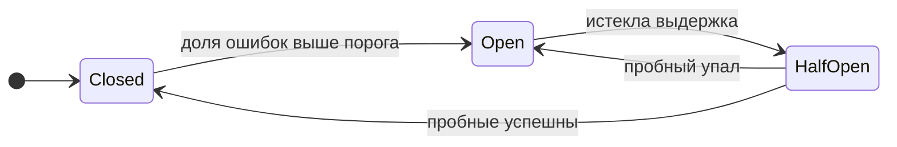

# Circuit Breaker

## Содержание

- [Три состояния](#три-состояния)
- [gobreaker](#gobreaker)
- [Cascade failure: зачем нужен circuit breaker](#cascade-failure-зачем-нужен-circuit-breaker)
- [Тюнинг порогов](#тюнинг-порогов)
- [Fallback стратегии](#fallback-стратегии)
- [Антипаттерны](#антипаттерны)
- [Interview-ready answer](#interview-ready-answer)

Таймаут ограничивает ожидание одного вызова, но не мешает отправлять следующий. Пока зависимость лежит, каждый новый запрос честно ждёт свой таймаут и только потом получает ошибку — и всё это время занимает горутину, соединение и часть бюджета вызывающего.

Circuit breaker (предохранитель) убирает бессмысленное ожидание: обнаружив, что зависимость отвечает ошибками, он начинает отклонять вызовы к ней сразу, не пытаясь их выполнить. Пользы от этого две. Вызывающий получает ответ за микросекунды вместо секунд и успевает сделать что-то полезное — отдать закэшированное значение или ответить без необязательной части. А сама зависимость перестаёт получать поток запросов и получает возможность подняться.

---

## Три состояния



| Состояние | Что происходит с запросом | Что накапливается | Условие выхода |
|---|---|---|---|
| Closed (замкнут) | Уходит к зависимости как обычно | Успехи и ошибки в текущем окне | Доля ошибок выше порога → Open |
| Open (разомкнут) | Отклоняется сразу, вызова нет | Только время в состоянии | Истекла выдержка → Half-Open |
| Half-Open (проверка) | Проходит, пока не исчерпан лимит пробных; сверх лимита отклоняется | Результаты пробных запросов | Пробные успешны → Closed; любой упал → Open |

Название пришло из электрики, и аналогия точная: разомкнутая цепь тока не проводит. Отсюда же путаница, которую стоит снять сразу — Open означает «запросы не идут», а не «всё открыто и работает».

Существование третьего состояния и есть содержательная часть паттерна. Без него пришлось бы выбирать между двумя плохими вариантами: возвращаться в рабочий режим по таймеру, обрушивая на едва поднявшуюся зависимость полный поток, или не возвращаться автоматически вовсе. Half-Open проверяет готовность несколькими запросами, рискуя только ими.

Тот же цикл со стороны вызывающего кода — при пороге в 60% ошибок, выдержке 10 секунд и пяти пробных запросах:

```
00:00  Closed      вызовы уходят к зависимости, счётчики ведутся

00:12  ──────►     12 ошибок из 20 в окне: 60% достигнуто, порог пройден
       Open        каждый вызов возвращается с ErrOpenState за микросекунды,
                   зависимость не получает ни одного запроса

00:22  ──────►     выдержка 10 с истекла
       Half-Open   первые 5 вызовов уходят к зависимости,
                   остальные получают ErrTooManyRequests

00:23  ──────►     все 5 пробных успешны
       Closed      обычная работа, счётчики обнулены

                   (упади хотя бы один пробный — снова Open,
                    и отсчёт выдержки начинается заново)
```

Из этой развёртки видно то, что обычно упускают: в Half-Open вызывающий получает две разные ошибки. Запросы сверх лимита пробных отклоняются с `ErrTooManyRequests`, а не с `ErrOpenState`, — и код, проверяющий только вторую, перестаёт отдавать запасной ответ ровно в момент восстановления.

---

## gobreaker

`github.com/sony/gobreaker` — простая и распространённая реализация. Начиная с v2 тип параметризован, поэтому приведение результата не требуется:

```go
import "github.com/sony/gobreaker/v2"

cb := gobreaker.NewCircuitBreaker[*ChargeResponse](gobreaker.Settings{
    Name: "payment-service",

    // Сколько пробных запросов пропускать в Half-Open.
    // Значение 0 означает один запрос, а не «сколько угодно».
    MaxRequests: 5,

    // Период, через который счётчики в Closed обнуляются.
    // При нулевом значении они не сбрасываются никогда, и редкие
    // ошибки за сутки накапливаются в общей статистике.
    Interval: 60 * time.Second,

    // Сколько ждать в Open перед переходом в Half-Open.
    // При нулевом значении применяется умолчание в 60 секунд.
    Timeout: 10 * time.Second,

    // Условие перехода в Open.
    ReadyToTrip: func(counts gobreaker.Counts) bool {
        if counts.Requests < 5 { // не срабатывать на единичных ошибках
            return false
        }
        failureRatio := float64(counts.TotalFailures) / float64(counts.Requests)
        return failureRatio >= 0.6
    },

    // Что считать неудачей. Без этой функции неудачей считается
    // любая ненулевая ошибка, включая доменные вроде «не найдено».
    IsSuccessful: func(err error) bool {
        if err == nil {
            return true
        }
        var status interface{ StatusCode() int }
        if errors.As(err, &status) {
            // 4xx — проблема запроса, а не доступности сервиса.
            return status.StatusCode() < 500
        }
        return false
    },

    // Смена состояния — событие для логов и метрик.
    OnStateChange: func(name string, from, to gobreaker.State) {
        slog.Warn("circuit breaker state changed",
            "name", name, "from", from.String(), "to", to.String())
        metrics.CircuitBreakerState.WithLabelValues(name).Set(float64(to))
    },
})

// Использование
resp, err := cb.Execute(func() (*ChargeResponse, error) {
    return paymentClient.Charge(ctx, req)
})
switch {
case errors.Is(err, gobreaker.ErrOpenState):
    // Предохранитель разомкнут — зависимость считается недоступной.
    return nil, ErrPaymentServiceUnavailable
case errors.Is(err, gobreaker.ErrTooManyRequests):
    // Half-Open: лимит пробных запросов исчерпан, идёт проверка.
    return nil, ErrPaymentServiceUnavailable
case err != nil:
    return nil, err
}
return resp, nil
```

Три детали этой настройки чаще всего пропускают.

**`IsSuccessful` — правильное место для классификации ошибок.** Без неё предохранитель считает неудачей любую ошибку, и поток ответов «пользователь не найден» разомкнёт цепь к полностью исправному сервису. Альтернативный приём — возвращать `nil` вместо доменной ошибки внутри `Execute` — работает, но заставляет вызывающий код разбирать успешный результат на предмет ошибки.

**`ErrTooManyRequests` — вторая ошибка, а не экзотика.** Она возвращается в Half-Open, когда лимит пробных запросов уже израсходован. Код, проверяющий только `ErrOpenState`, в момент проверки восстановления начнёт отдавать наверх сырую ошибку вместо запасного ответа — то есть ровно тогда, когда запасной ответ нужнее всего.

**`Interval` без явного значения не сбрасывает счётчики.** В Closed-состоянии статистика тогда копится с момента запуска процесса, и предохранитель, переживший давний инцидент, реагирует на текущие ошибки не так, как только что запущенный. Явный интервал делает поведение воспроизводимым.

### Отдельный предохранитель на каждую зависимость

Общий предохранитель на весь сервис объединяет несвязанные отказы: ошибки платёжного сервиса разомкнут цепь к сервису уведомлений, который работает исправно. Гранулярность должна совпадать с границей отказа — то есть с зависимостью.

```go
func newBreaker[T any](name string) *gobreaker.CircuitBreaker[T] {
    return gobreaker.NewCircuitBreaker[T](gobreaker.Settings{
        Name:        name,
        MaxRequests: 5,
        Interval:    60 * time.Second,
        Timeout:     10 * time.Second,
        ReadyToTrip: func(counts gobreaker.Counts) bool {
            return counts.Requests >= 10 &&
                float64(counts.TotalFailures)/float64(counts.Requests) >= 0.5
        },
    })
}

type Breakers struct {
    Payment      *gobreaker.CircuitBreaker[*ChargeResponse]
    Notification *gobreaker.CircuitBreaker[struct{}]
    UserService  *gobreaker.CircuitBreaker[*User]
}

func NewBreakers() *Breakers {
    return &Breakers{
        Payment:      newBreaker[*ChargeResponse]("payment"),
        Notification: newBreaker[struct{}]("notification"),
        UserService:  newBreaker[*User]("user-service"),
    }
}
```

Дробить мельче зависимости имеет смысл, когда отказы внутри неё независимы. Если сервис развёрнут в нескольких зонах доступности и балансировщик отдаёт адреса конкретных экземпляров, предохранитель на экземпляр отсечёт одну сбойную реплику, тогда как общий на сервис при 20% ошибок либо не сработает, либо отключит все реплики разом.

Отдельно стоит помнить, что состояние предохранителя локально для процесса. Каждая реплика сервиса набирает статистику самостоятельно, и при десяти репликах зависимость получит десять независимых наборов пробных запросов в Half-Open. Обычно это допустимо и даже полезно — распределённое состояние потребовало бы сетевого вызова на каждую проверку, — но при большом числе реплик число пробных запросов стоит считать: десять реплик по пять пробных запросов дают полсотни обращений к едва поднявшемуся сервису.

---

## Cascade failure: зачем нужен circuit breaker

Без circuit breaker один медленный downstream убивает весь сервис:

```
PaymentService отвечает за 5s (вместо 200ms)

1. Запросы к PaymentService накапливаются, goroutines ждут
2. Пул goroutines/connections исчерпан
3. Входящие запросы начинают timeout на стороне нашего сервиса
4. Клиент видит ошибки и делает retry — ещё больше goroutines
5. Весь сервис деградирует хотя сам по себе исправен
```

С circuit breaker:
```
PaymentService отвечает за 5s

1. 10 запросов провалились — ReadyToTrip вернул true
2. Circuit переходит в OPEN — запросы к PaymentService блокируются немедленно
3. Goroutines немедленно получают ErrOpenState, не ждут 5s
4. Основной сервис продолжает работать, платёжные запросы отклоняются с понятной ошибкой
5. Через 10s circuit переходит в HALF-OPEN, пробует recovery
```

---

## Тюнинг порогов

**Слишком чувствительный порог** размыкает цепь от единичных ошибок. Каждое ложное срабатывание — это отказ в обслуживании при исправной зависимости, причём длящийся до конца выдержки в Open.

**Слишком терпимый порог** срабатывает, когда деградация уже перешла в отказ. Защита формально есть, но включается позже, чем заканчивается бюджет вызывающего.

Практические ориентиры:

- **Минимальное число запросов в окне** (`Requests >= N`) — иначе две ошибки из двух дадут 100% и разомкнут цепь на холодном старте, когда трафика ещё нет.
- **Порог доли ошибок 50-60%.** Значение ниже задевает нормальный фон ошибок, значение около 100% требует полного отказа — а частичная деградация опаснее: она тратит бюджет вызывающего, не давая при этом однозначного сигнала.
- **Выдержка в Open чуть больше ожидаемого времени восстановления.** Перезапуск пода занимает порядка 30 секунд, поэтому выдержка в 60 секунд разумна. Слишком короткая выдержка возвращает нагрузку на неподнявшийся сервис, слишком длинная удерживает отказ дольше необходимого.
- **Пробных запросов немного.** Их назначение — проверить готовность, а не восстановить обслуживание. При множестве реплик их число умножается на число реплик.

```go
ReadyToTrip: func(counts gobreaker.Counts) bool {
    minRequests := uint32(10)
    failureThreshold := 0.5

    if counts.Requests < minRequests {
        return false
    }
    return float64(counts.TotalFailures)/float64(counts.Requests) >= failureThreshold
},
Timeout: 60 * time.Second,
```

---

## Fallback стратегии

Быстрый отказ ценен сам по себе, но вызывающему всё равно нужно чем-то ответить. Выбор запасного варианта определяется тем, насколько данные обязательны для ответа.

**Кэшированный ответ** — последнее известное значение:
```go
result, err := cb.Execute(func() (interface{}, error) {
    return userService.GetProfile(ctx, userID)
})
if errors.Is(err, gobreaker.ErrOpenState) {
    // Вернуть из кэша
    if cached, ok := profileCache.Get(userID); ok {
        return cached, nil
    }
}
```

**Урезанный ответ** — то же самое с меньшим набором данных:
```go
if errors.Is(err, gobreaker.ErrOpenState) {
    // Базовый профиль без обогащения: рекомендаций и статистики не будет
    return &UserProfile{ID: userID, Degraded: true}, nil
}
```

**Быстрый отказ с честной ошибкой** — когда подменить данные нечем:
```go
if errors.Is(err, gobreaker.ErrOpenState) {
    return nil, status.Error(codes.Unavailable, "payment service temporarily unavailable")
}
```

Правило выбора простое: подменять можно то, без чего ответ остаётся правдивым. Список рекомендаций, счётчик просмотров, аватар — заменяются пустым значением без вреда. Баланс счёта, статус платежа и остаток товара подменять нельзя: устаревшее значение здесь хуже честной ошибки, потому что на его основе примут решение.

Отдельная деталь для урезанных ответов — их нужно помечать. Поле `Degraded` в примере выше существует, чтобы клиент отличал «рекомендаций нет» от «рекомендации не загрузились», а мониторинг видел долю неполных ответов. Без пометки деградация становится невидимой: метрика ошибок чистая, SLO выполняется, а пользователи неделю не видят половину интерфейса.

---

## Антипаттерны

**Один предохранитель на весь сервис** — отказ одной зависимости отключает вызовы ко всем остальным, включая исправные.

**Доменные ошибки засчитываются как отказы** — поток ответов «не найдено» размыкает цепь к работающему сервису. Классификация задаётся через `IsSuccessful`: неудачей считается недоступность (таймаут, отказ в соединении, 5xx), а не отклонённый запрос.

**Смены состояний не попадают в логи и метрики** — без `OnStateChange` разомкнутая цепь выглядит снаружи как массовые ошибки без причины. Минимально нужны два сигнала: текущее состояние как метрика и запись в лог на каждый переход.

**Предохранитель вместо исправления причины** — он превращает отказ в быстрый отказ, но не делает зависимость доступной. Если цепь размыкается регулярно, задача не в подборе порогов.

**Повтор поверх разомкнутой цепи** — повтор проверяет предохранитель, мгновенно получает `ErrOpenState`, ждёт паузу и повторяет снова. Все попытки расходуются вхолостую за микросекунды, и до реального вызова дело не доходит. Порядок должен быть обратным: предохранитель снаружи, повторы внутри, чтобы серия попыток считалась одним обращением.

**Одинаковая выдержка у всех реплик** — по её истечении все реплики одновременно отправляют пробные запросы. Помогает тот же приём, что и с повторами: небольшой случайный разброс выдержки.

---

## Interview-ready answer

**1. Зачем нужен предохранитель, если уже есть таймаут?**

- Таймаут ограничивает одно ожидание, но не мешает отправить следующий запрос: пока зависимость лежит, каждый вызов честно ждёт свой таймаут.
- Предохранитель отклоняет вызовы сразу — вызывающий получает ответ за микросекунды и успевает применить запасной вариант.
- Второй эффект — зависимость перестаёт получать поток запросов и получает возможность восстановиться.

**2. Как устроены три состояния?**

- Closed — запросы проходят, ошибки считаются; превышение порога переводит в Open.
- Open — запросы отклоняются немедленно; по истечении выдержки происходит переход в Half-Open.
- Half-Open — пропускается несколько пробных запросов: успех возвращает в Closed, неудача — в Open.
- Зачем третье состояние — возврат по таймеру обрушил бы на едва поднявшуюся зависимость полный поток; здесь риск ограничен пробными запросами.

**3. Как выбираются пороги?**

- Минимальное число запросов в окне — иначе две ошибки из двух дают 100% и размыкают цепь на холодном старте.
- Доля ошибок 50-60% — ниже задевает нормальный фон, около 100% требует полного отказа, а частичная деградация опаснее.
- Выдержка в Open — чуть больше ожидаемого времени восстановления, порядка минуты при перезапуске пода.
- Разброс выдержки — чтобы реплики не отправляли пробные запросы синхронно.

**4. Какие ошибки предохранитель считать не должен?**

- Доменные — «не найдено», «нет прав», отклонённая валидация: сервис исправен, отказал конкретный запрос.
- Признак — 4xx отражает проблему запроса, 5xx и сетевые ошибки отражают недоступность.
- Место классификации — `IsSuccessful` в настройках, а не подмена ошибки на `nil` внутри вызова.
- Цена ошибки — поток ответов «не найдено» размыкает цепь к полностью работающему сервису.

**5. Как предохранитель сочетается с повторами и запасными ответами?**

- Порядок — предохранитель снаружи, повторы внутри: иначе попытки расходуются на мгновенные `ErrOpenState`.
- Проверять нужно две ошибки — `ErrOpenState` и `ErrTooManyRequests`; вторая приходит в Half-Open и означает то же самое для вызывающего.
- Запасной вариант — кэш или урезанный ответ там, где данные необязательны; честная ошибка там, где на данных принимают решение.
- Урезанный ответ помечается флагом — иначе деградация не видна ни клиенту, ни мониторингу.
- Область состояния — предохранитель локален для процесса, при множестве реплик число пробных запросов умножается.
