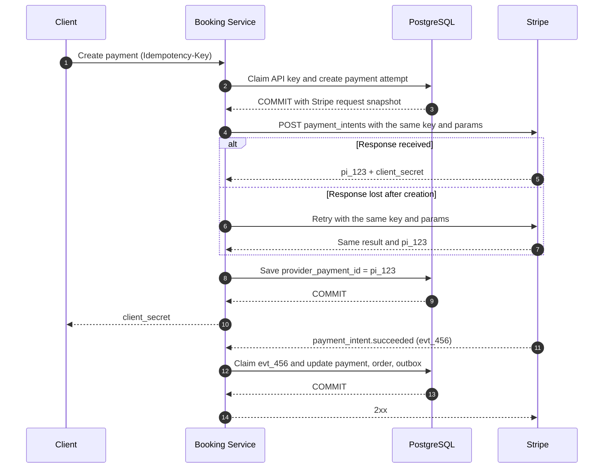

# Идемпотентность (Idempotency)

## Содержание

- [Зачем нужна идемпотентность](#зачем-нужна-идемпотентность)
- [Паттерн Idempotency Key](#паттерн-idempotency-key)
- [Реализация в PostgreSQL](#реализация-в-postgresql)
- [Практический flow: Booking Service и Stripe](#практический-flow-booking-service-и-stripe)
- [At-most-once vs At-least-once vs Exactly-once](#at-most-once-vs-at-least-once-vs-exactly-once)
- [Идемпотентность в очередях сообщений](#идемпотентность-в-очередях-сообщений)
- [Антипаттерны](#антипаттерны)
- [Interview-ready answer](#interview-ready-answer)
- [Источники](#источники)

Идемпотентная операция имеет один и тот же предполагаемый эффект после одного и
нескольких одинаковых вызовов. Ответы при этом могут различаться: первый
`DELETE` вернёт `204`, а второй — `404`, хотя ресурс в обоих случаях отсутствует.

Паттерн с ключом идемпотентности часто даёт более сильный прикладной контракт:
сервер не только предотвращает второй бизнес-эффект, но и возвращает сохранённые
статус, тело и значимые заголовки первого завершённого запроса.

Присвоение значения (`статус = отменён`) обычно идемпотентно само по себе.
Операции относительно текущего состояния — списать сумму, добавить позицию,
увеличить счётчик — требуют отдельной защиты от повторов.

---

## Зачем нужна идемпотентность

Клиент, получивший таймаут или сетевую ошибку, в этот момент не знает, дошёл ли
запрос до сервера:

```
Клиент                          Сервер
  │──── POST /payments ────────►│ (сервер принял)
  │                             │ (обрабатывает 1000ms)
  │◄─── TCP timeout ────────────│ (сервер завершил, ответ потерян)
  │
  │ Что делать?
  │ Retry? Может списали деньги дважды.
  │ Не retry? Может не списали вообще.
```

По одному таймауту исход определить нельзя: сервер мог не получить запрос,
откатить операцию, завершить её или потерять только ответ. Позже клиент может
открыть новое соединение и запросить состояние операции по стабильному ID, но
для безопасного немедленного повтора нужен отдельный контракт.

Ключ идемпотентности делает повтор безопасным в пределах области ключа и срока
его хранения. Он не отменяет deadline, backoff и retry budget: технически
безопасный повтор всё равно может перегрузить зависимость.

```
Клиент отправляет уникальный ключ:
  POST /payments
  Idempotency-Key: 550e8400-e29b-41d4-a716-446655440000

Первый запрос: выполнить операцию, сохранить результат под ключом.
Повтор с тем же ключом: вернуть сохранённый результат, операцию не выполнять.
```

Ключ обычно генерирует инициатор операции. Сервер не может вывести из одинаковых
платёжных данных, является второй запрос повтором или намеренным вторым платежом.
Ключ создаётся один раз на логическую операцию и переиспользуется во всех её
сетевых попытках.

### Идемпотентность в семантике HTTP

HTTP определяет идемпотентность через предполагаемый эффект метода. Клиенты и
прокси могут учитывать это свойство при выборе политики повторов, но конкретная
реализация вправе быть осторожнее.

| Метод | Идемпотентен | Почему |
| --- | --- | --- |
| `GET` | да | клиент не запрашивает изменение ресурса |
| `PUT` | да | присвоение представления: `PUT /orders/42/status` задаёт то же целевое состояние |
| `DELETE` | да | приводит к состоянию «ресурса нет»; второй вызов вернёт `404`, но состояние то же |
| `POST` | не гарантируется | `POST /payments` может на каждый вызов создавать новый платёж |
| `PATCH` | не гарантируется | эффект зависит от формата и содержимого изменений |

`PATCH` попал во вторую группу из-за двух разных способов его применять:

- **Присвоение.** `{"status": "cancelled"}` повторно задаёт то же состояние.
- **Дельта.** Операция «уменьшить баланс на 100» или JSON Patch с добавлением в
  конец массива при каждом повторе изменяет состояние ещё раз:

```json
[
  {
    "op": "add",
    "path": "/items/-",
    "value": { "sku": "ABC-42", "quantity": 1 }
  }
]
```

Поэтому HTTP не гарантирует идемпотентность произвольного `POST` или `PATCH`, но
конкретную операцию можно спроектировать идемпотентной.

`If-Match` не заменяет ключ идемпотентности. `If-Match` проверяет версию ресурса
и предотвращает потерянное обновление; ключ распознаёт повтор одной логической
операции. Для неидемпотентного изменения конкурентно обновляемого ресурса могут
понадобиться оба механизма. Подробнее свойства методов разобраны в
[03-http-methods.md](../../08-networking-and-api/api-design/03-http-methods.md).

---

## Паттерн Idempotency Key

Клиент генерирует уникальный ключ, например UUID v4 или v7, и повторяет его с
каждой попыткой одной операции. Сервер выполняет четыре шага:

Само наличие заголовка `Idempotency-Key` ничего не гарантирует: его область,
срок жизни, сравнение запросов и политика сохранения ответов являются частью
контракта конкретного API.

1. Проверяет запрос и вычисляет канонический `request_hash`.
2. Атомарно захватывает ключ либо читает уже существующую запись.
3. Для существующего ключа сравнивает хэш: другой запрос получает конфликт,
   завершённый повтор — сохранённый ответ, выполняющийся — статус `in progress`.
4. Владелец ключа выполняет бизнес-операцию и фиксирует эффект вместе с итоговым
   ответом в одной доступной ему границе атомарности.

Логическая модель записи выглядит так:

```text
ABSENT ──claim──► IN_PROGRESS ──commit effect + stored result──► COMPLETED
```

`COMPLETED` может хранить как успех, так и известный терминальный бизнес-ответ.

В короткой PostgreSQL-транзакции `IN_PROGRESS` может быть невидим другим
транзакциям. Для долгой операции это отдельное зафиксированное состояние. Эти
два варианта нельзя смешивать — ниже они разобраны отдельно. Вернуть запись в
`ABSENT` безопасно только когда система уверена, что бизнес-эффект не начинался;
при неизвестном внешнем результате сначала нужна сверка состояния.

<details>
<summary>Обработчик: чтение заголовка и выбор кода ответа для повтора</summary>

```go
func (h *PaymentHandler) Create(w http.ResponseWriter, r *http.Request) {
    tenantID, err := h.authenticatedTenantID(r.Context())
    if err != nil {
        http.Error(w, "unauthorized", http.StatusUnauthorized)
        return
    }

    idempKey := r.Header.Get("Idempotency-Key")
    if idempKey == "" ||
        len(idempKey) > maxIdempotencyKeyLength ||
        !validIdempotencyKey(idempKey) {
        http.Error(w, "invalid Idempotency-Key", http.StatusBadRequest)
        return
    }

    var req CreatePaymentRequest
    if err := json.NewDecoder(r.Body).Decode(&req); err != nil {
        http.Error(w, "invalid body", http.StatusBadRequest)
        return
    }

    result, err := h.service.CreatePayment(r.Context(), tenantID, idempKey, req)
    switch {
    case errors.Is(err, ErrIdempotencyConflict):
        http.Error(w, "same key used with another request", http.StatusConflict)
        return
    case errors.Is(err, ErrRequestInProgress):
        w.Header().Set("Retry-After", "2")
        http.Error(w, "request is still in progress", http.StatusConflict)
        return
    case err != nil:
        h.logger.Error("create payment", "error", err)
        http.Error(w, "internal error", http.StatusInternalServerError)
        return
    }

    for name, value := range result.Response.Headers {
        w.Header().Set(name, value)
    }
    w.WriteHeader(result.Response.StatusCode)
    if _, err := w.Write(result.Response.Body); err != nil {
        h.logger.Warn("write payment response", "error", err)
    }
}
```

</details>

### Откуда берётся сам ключ

Механизм зависит от того, что именно клиент считает одной логической операцией.
Ключ идентифицирует намерение, а не сетевую попытку, поэтому создаётся выше
уровня повторов. UUID внутри retry-цикла бесполезен: три попытки придут с тремя
ключами, и сервер увидит три платежа. Повторный клик до завершения той же оплаты
должен использовать прежний ключ; новая намеренная покупка получает новый.

Практически ключ получают одним из четырёх способов:

| Способ | Как получается | Когда подходит | Чем платит |
| --- | --- | --- | --- |
| UUID на экран операции | генерируется при открытии формы оплаты, живёт в `localStorage` до подтверждённого успеха | веб и мобильные клиенты | состояние теряется (инкогнито, переустановка) — новый ключ, защиты нет |
| Ключ, выданный сервером заранее | отдельный вызов создаёт черновик (`POST /payment-intents`), его id и служит ключом | платежи и другие дорогие операции | лишний round-trip до основного запроса |
| Детерминированный из данных операции | `hash(user_id, cart_id, amount, currency)` | вызовы между сервисами, повторный импорт данных | намеренный второй такой же платёж схлопнется в первый |
| Идентификатор сообщения | `event_id`, проставленный продюсером один раз при публикации | консьюмеры очередей | требует, чтобы id ставил продюсер, а не переотправка |

Первые два способа подходят пользовательским сценариям. `localStorage` проще,
но состояние можно потерять; серверный черновик надёжнее и позволяет видеть
незавершённые операции. Сам вызов создания черновика тоже должен переживать
повтор: например, клиент выбирает его ID и использует `PUT`, либо передаёт ключ
идемпотентности уже при `POST /payment-intents`.

Детерминированный ключ не нужно хранить на клиенте, но два намеренно одинаковых
действия становятся неотличимы от повтора. Поэтому в ключ включают идентификатор
намерения: ID корзины, заказа, импорта или явно созданной попытки, а не только
сумму и пользователя.

При вызове между сервисами новый ключ выводят из входящего: передают его как есть
либо считают `hash(входящий ключ + имя нижележащей операции)`, если таких
операций несколько. Иначе повтор, погашенный на первом сервисе,
продублируется на следующем.

Единица ключа — логическая операция, а не запрос, сессия или пользователь. Ключ
на сессию отвергнет второй легитимный платёж, ключ на сетевую попытку не отсечёт
ни одного повтора.

### Область ключа, хэш и срок хранения

Одного случайного значения недостаточно. Запись идентифицируется составной
областью, например `(tenant_id, operation, idempotency_key)`. Это не позволяет
ключу одного пользователя или метода API переиспользовать чужой сохранённый ответ.
Обычная авторизация всё равно выполняется и при повторе.

`request_hash` считают по каноническому представлению значимых параметров после
разбора запроса. Хэш сырых JSON-байтов нестабилен: пробелы и порядок полей могут
измениться без изменения смысла. При необходимости в отпечаток включают версию
API и заголовки, влияющие на результат.

Повтор завершённой операции обычно получает сохранённые HTTP-статус, тело и
значимые заголовки, например `Content-Type` и `Location`. Политику ошибок нужно
задать явно: ошибки валидации до начала операции обычно не сохраняют, а
зафиксированный бизнес-результат сохраняют. Некоторые API сохраняют даже `500`,
чтобы неизвестный частичный результат нельзя было выполнить повторно.

Срок хранения выбирают не по привычному числу часов, а по максимальному окну
повторов и сверки результата. После удаления записи прежний ключ снова выглядит
новым, поэтому клиент и сервер должны одинаково понимать эту границу.

---

## Реализация в PostgreSQL

Первый вопрос — попадает ли бизнес-эффект в ту же транзакцию PostgreSQL, что и
ключ. От ответа зависит вся реализация:

| Сценарий | Корректная модель | Что видит одновременный повтор |
| --- | --- | --- |
| Короткое изменение в той же БД | ключ, эффект и ответ в одной транзакции | ждёт `COMMIT` или `ROLLBACK` первой транзакции |
| Долгая работа или внешний вызов | `IN_PROGRESS` фиксируется заранее | читает состояние и получает `409`/`202` |

Аренда (`lease`) нужна только во второй модели. Если добавить её в первую, она
не начнёт работать: незакоммиченная строка всё равно удерживает уникальный
индекс и не видна другим транзакциям.

### Вариант A. Одна транзакция PostgreSQL

Этот вариант проще и надёжнее, если платёж, заказ или другая бизнес-запись
изменяется в той же БД.

```sql
CREATE TABLE idempotency_keys (
    tenant_id       UUID        NOT NULL,
    operation       TEXT        NOT NULL,
    key             TEXT        NOT NULL,
    request_hash    TEXT        NOT NULL,
    status_code     INT,
    response_headers JSONB      NOT NULL DEFAULT '{}'::jsonb,
    response_body   JSONB,
    created_at      TIMESTAMPTZ NOT NULL DEFAULT NOW(),
    completed_at    TIMESTAMPTZ,
    expires_at      TIMESTAMPTZ,
    PRIMARY KEY (tenant_id, operation, key),
    CHECK (
        (completed_at IS NULL AND status_code IS NULL AND expires_at IS NULL)
        OR
        (completed_at IS NOT NULL AND status_code IS NOT NULL AND expires_at IS NOT NULL)
    )
);

CREATE INDEX idempotency_keys_expires_at_idx
    ON idempotency_keys (expires_at)
    WHERE completed_at IS NOT NULL;
```

<details>
<summary>Основной процесс сервиса в одной транзакции</summary>

```go
func (s *PaymentService) CreatePayment(
    ctx context.Context,
    tenantID uuid.UUID,
    idempKey string,
    req CreatePaymentRequest,
) (*PaymentResult, error) {
    const operation = "payments.create"

    reqHash := hashCanonicalRequest(req)

    tx, err := s.db.Begin(ctx)
    if err != nil {
        return nil, fmt.Errorf("begin: %w", err)
    }
    defer func() {
        _ = tx.Rollback(context.Background()) // no-op после Commit
    }()

    // INSERT и проверка уникальности — одна атомарная операция.
    // При одновременном INSERT проигравшая транзакция ждёт исход победителя.
    tag, err := tx.Exec(ctx, `
        INSERT INTO idempotency_keys (
            tenant_id, operation, key, request_hash
        )
        VALUES ($1, $2, $3, $4)
        ON CONFLICT (tenant_id, operation, key) DO NOTHING
    `, tenantID, operation, idempKey, reqHash)
    if err != nil {
        return nil, fmt.Errorf("claim key: %w", err)
    }

    if tag.RowsAffected() == 0 {
        rec, err := s.loadRecord(ctx, tx, tenantID, operation, idempKey)
        if err != nil {
            return nil, fmt.Errorf("load idempotency record: %w", err)
        }
        if rec.RequestHash != reqHash {
            return nil, ErrIdempotencyConflict
        }
        if rec.CompletedAt == nil {
            return nil, fmt.Errorf("committed incomplete record: %w", ErrInvariant)
        }
        return &PaymentResult{
            Response:  rec.StoredResponse(),
            WasReplay: true,
        }, nil
    }

    payment, err := s.insertPayment(ctx, tx, tenantID, req)
    if err != nil {
        return nil, fmt.Errorf("create payment: %w", err)
    }

    response, err := newPaymentCreatedResponse(payment)
    if err != nil {
        return nil, fmt.Errorf("build payment response: %w", err)
    }
    if err := s.completeRecord(
        ctx, tx, tenantID, operation, idempKey,
        response, s.idempotencyRetention,
    ); err != nil {
        return nil, fmt.Errorf("complete idempotency record: %w", err)
    }

    if err := tx.Commit(ctx); err != nil {
        return nil, fmt.Errorf("commit: %w", err)
    }
    return &PaymentResult{Response: response, WasReplay: false}, nil
}
```

</details>

Пример предполагает стандартный для PostgreSQL уровень `READ COMMITTED`. Если
две транзакции вставляют один ключ, вторая ждёт, пока первая завершится. После
`COMMIT` она получает `RowsAffected() == 0` и читает готовый ответ; после
`ROLLBACK` сама вставляет ключ и выполняет операцию. Поэтому зафиксированного
состояния `IN_PROGRESS` и аренды здесь нет.

`completeRecord` обновляет строку по полному составному ключу, сохраняет
HTTP-статус, тело и выбранные заголовки, выставляет `completed_at` и считает
`expires_at` от момента завершения. Число изменённых строк должно быть равно
одному; иначе транзакция откатывается как нарушение инварианта.

Ожидание уникального индекса ограничивают deadline запроса и при необходимости
`lock_timeout`. Это не превращают в аренду: истечение времени ожидания не даёт
второй транзакции права выполнять работу параллельно.

Граница отказа получается простой:

- до `COMMIT` ключ, платёж и ответ откатываются вместе;
- после `COMMIT` повтор читает сохранённый результат, даже если HTTP-ответ потерян;
- ошибка `Commit` оставляет исход неизвестным клиенту, но повтор с тем же ключом
  безопасно выясняет, был ли `COMMIT`.

Внешний HTTP-вызов в эту атомарность не входит. Если внутри транзакции вызвать
платёжный шлюз, получить успех и затем откатить PostgreSQL, повтор может списать
деньги второй раз. Для внешнего эффекта нижестоящему сервису передают стабильный
ключ либо используют [outbox](../../04-architecture-and-patterns/patterns/09-saga-and-outbox.md)
и отдельную идемпотентную обработку.

### Вариант B. Зафиксированный `IN_PROGRESS` и аренда

Во второй модели таблица дополнительно содержит `status`, `owner_token`,
`lease_until` и монотонный `fencing_token`. Для долгой операции сначала отдельной
короткой транзакцией пытаются зафиксировать владельца:

```sql
INSERT INTO idempotency_keys (
    tenant_id, operation, key, request_hash,
    status, owner_token, lease_until, fencing_token
)
VALUES ($1, $2, $3, $4, 'in_progress', $5, NOW() + $6::interval, 1)
ON CONFLICT (tenant_id, operation, key) DO NOTHING
RETURNING fencing_token;
```

После `COMMIT` логическая запись имеет вид:

```text
IN_PROGRESS {
  request_hash,
  owner_token,
  lease_until,
  fencing_token
}
```

Параметр `$6` задаёт длительность аренды, а начальный момент вычисляет `NOW()` в
PostgreSQL. Поэтому решение об истечении не зависит от рассинхронизации часов
приложений.

После `COMMIT` другие запросы уже видят состояние. Повтор с тем же хэшем получает
`409 Conflict + Retry-After` либо `202 Accepted` со ссылкой на ресурс операции;
другой хэш получает конфликт использования ключа.

Истёкшую аренду забирают сравнением и заменой (`compare-and-set`):

```sql
UPDATE idempotency_keys
   SET owner_token   = $1,
       lease_until   = NOW() + $2::interval,
       fencing_token = fencing_token + 1
 WHERE tenant_id     = $3
   AND operation     = $4
   AND key           = $5
   AND request_hash  = $6
   AND status        = 'in_progress'
   AND lease_until   < NOW()
RETURNING fencing_token;
```

`owner_token` не даёт старому воркеру завершить чужую запись, а монотонная
защитная версия (`fencing_token`) позволяет хранилищу отклонить устаревшего
владельца. Долгая операция периодически продлевает аренду (`heartbeat`).
Финальный `UPDATE` также проверяет `owner_token` и `fencing_token`; ноль
изменённых строк означает, что воркер потерял право завершать запись.

Аренда защищает только запись идемпотентности. Если старый воркер уже отправил
запрос во внешний платёжный шлюз, его поздний ответ нельзя отменить сменой
`owner_token`. Внешняя операция обязана принимать тот же ключ идемпотентности
либо уметь отклонять устаревшую защитную версию. Без этого после перехвата аренды
два воркера могут дать два внешних эффекта.

Для изменения в PostgreSQL новый владелец проверяет `owner_token` и выполняет
бизнес-эффект вместе с переводом в `COMPLETED` в одной транзакции. Для внешнего
эффекта нужна кооперация внешней системы, сверка по стабильному ID или
паттерн outbox.

### Очистка записей

Фоновая задача удаляет только завершённые записи после `expires_at`. Активные
`IN_PROGRESS` не удаляют как обычный мусор: их перехватывает повтор либо
отдельный восстановительный воркер. Без такого процесса забытые операции будут
копиться даже при наличии аренды.

Горизонт хранения должен перекрывать клиентские повторы, работу без сети,
сверку состояния и ручное повторное воспроизведение. На большом объёме таблицу
можно партиционировать по времени истечения, чтобы очистка не превращалась в
большой `DELETE`.

---

## Практический flow: Booking Service и Stripe

Рассмотрим создание `PaymentIntent` для очередной части заказа. Само создание
intent ещё не означает списание денег; последующее подтверждение является
отдельной операцией. Но уже на этом шаге возникает внешний эффект из варианта B:
транзакция Booking Service не может атомарно зафиксировать свою строку
`payment_attempts` и объект внутри Stripe. Поэтому нужны две независимые защиты:

1. исходящий запрос в Stripe повторяется с тем же Stripe idempotency key;
2. входящий webhook захватывается по Stripe `event.id` в той же транзакции, где
   меняются платёж, заказ и локальный outbox.

Если незавершённые попытки могут подбирать несколько восстановительных воркеров,
локальное владение дополнительно защищают с помощью `owner_token` и аренды из
варианта B. Stripe idempotency key всё равно остаётся последним барьером от двух
внешних эффектов.



### Какие идентификаторы здесь участвуют

| Идентификатор | От какого повтора защищает | Область |
| --- | --- | --- |
| API `Idempotency-Key` | клиент повторил создание платёжной попытки | один endpoint и один авторизованный клиент/tenant |
| `payment_attempt_id` | локально связывает все шаги одной попытки | конкретная часть заказа и номер бизнес-попытки |
| Stripe create key | Booking Service повторил `POST /v1/payment_intents` | только создание одного `PaymentIntent` |
| Stripe `PaymentIntent.id` | позволяет продолжить и сверить уже созданный объект | весь жизненный цикл платежа в Stripe |
| Stripe `event.id` | Stripe повторно доставил тот же webhook | один Stripe account и endpoint |

Не стоит передавать один ключ во все Stripe-операции. Создание intent,
подтверждение и refund — разные эффекты, поэтому ключи выводят из стабильных ID и
имени операции:

```go
func stripeKey(operation string, operationID uuid.UUID) string {
    src := "stripe:v1:" + operation + ":" + operationID.String()
    sum := sha256.Sum256([]byte(src))
    return "pay:v1:" + hex.EncodeToString(sum[:16])
}

createKey := stripeKey("payment-intent.create", paymentAttempt.ID)
confirmKey := stripeKey("payment-intent.confirm", confirmationAttempt.ID)
refundKey := stripeKey("refund.create", refund.ID)
```

`paymentAttempt.ID`, `confirmationAttempt.ID` и `refund.ID` создаются и
фиксируются **до** сетевого повтора. Новая карта после отклонения или новый
частичный refund — это новая логическая операция и новый ID. Иначе тот же ключ
уйдёт в Stripe с другими параметрами и Stripe вернёт ошибку повторного
использования ключа.

### Создание `PaymentIntent` без окна для дубля

Практический алгоритм выглядит так:

1. Короткая транзакция атомарно захватывает входящий API-ключ и создаёт
   `payment_attempt` со статусом `creating`, суммой, валютой, Stripe create key и
   snapshot параметров запроса. Затем делает `COMMIT`.
2. Вне транзакции сервис собирает Stripe-параметры из сохранённого snapshot и
   вызывает `paymentintent.New` с `params.SetIdempotencyKey(createKey)`.
3. Вторая короткая транзакция сохраняет `PaymentIntent.id` и переводит попытку в
   `created`. Повторный ответ Stripe с тем же ID должен быть допустимым
   обновлением.
4. Если состояние осталось `creating`, recovery worker или следующий запрос
   повторяет **те же параметры с тем же ключом**, а не создаёт новую попытку.

Почему нужен snapshot, хотя ключ уже включает сумму и валюту? Stripe сравнивает
параметры повторов. Если повтор заново соберёт metadata, e-mail или описание из
уже изменившегося заказа, ключ останется прежним, а запрос станет другим.
Хранение канонического provider request или достаточного snapshot делает повтор
воспроизводимым. В metadata не кладут карточные данные и другую чувствительную
информацию; `client_secret` не логируют и возвращают только авторизованному
клиенту.

Открывать DB-транзакцию до вызова Stripe и держать её во время HTTP-запроса не
даёт общей атомарности: `ROLLBACK` всё равно не удалит созданный `PaymentIntent`.
При этом транзакция дольше удерживает соединение и блокировки. Безопасность в
окне между двумя короткими транзакциями даёт именно стабильный Stripe key:

| Где произошёл сбой | Что увидит повтор |
| --- | --- |
| После локального `COMMIT`, до Stripe | найдёт `creating` и впервые отправит сохранённый запрос |
| Stripe создал intent, но ответ потерян | Stripe вернёт результат того же запроса и тот же `PaymentIntent.id` |
| ID сохранён, но ответ клиенту потерян | API-ключ вернёт сохранённый результат или сервис прочитает существующий intent |
| Сервис упал после обработки webhook, до ответа Stripe | повтор webhook упрётся в уже зафиксированный inbox key |

Для API v1 Stripe может удалить idempotency record после того, как ключу
исполнилось не менее 24 часов. Поэтому Stripe key — не вечный реестр операций:
если `PaymentIntent.id` уже сохранён, объект читают по нему; иначе используют
заранее спроектированный reconciliation flow и не повторяют старый create
вслепую.

### Webhook: inbox и бизнес-эффект в одной транзакции

Проверка вида `IsWebhookProcessed(event.ID)`, затем бизнес-обработка, затем
`MarkWebhookProcessed(event.ID)` содержит гонку. Два обработчика могут
одновременно увидеть, что события нет, и оба поставить письмо или интеграционное
событие в очередь. Захват и локальный эффект выполняют в одной транзакции:

```go
err := repo.WithTx(ctx, func(tx pgx.Tx) error {
    tag, err := tx.Exec(ctx, `
        INSERT INTO stripe_webhook_inbox (
            account_id, event_id, event_type, received_at
        )
        VALUES ($1, $2, $3, NOW())
        ON CONFLICT (account_id, event_id) DO NOTHING
    `, accountID, event.ID, event.Type)
    if err != nil {
        return fmt.Errorf("claim Stripe event %s: %w", event.ID, err)
    }
    if tag.RowsAffected() == 0 {
        return nil // тот же Event уже обработан
    }

    if err := applyPaymentState(ctx, tx, event); err != nil {
        return err
    }
    return enqueuePaymentSideEffects(ctx, tx, event) // записи в outbox
})
if err != nil {
    return err // не отвечаем 2xx: Stripe сможет повторить доставку
}
return nil
```

Если `INSERT` изменил ноль строк, тот же webhook уже зафиксирован — обработчик
ничего не повторяет и отвечает `2xx`. При ошибке дальнейшей обработки вся
транзакция, включая inbox-запись, откатывается, поэтому Stripe сможет безопасно
доставить событие снова.

`event.id` дедуплицирует повторную доставку одного Event. Stripe иногда создаёт
разные Event для одного объекта и не гарантирует порядок доставки. Поэтому
переходы статусов дополнительно делают монотонными или сверяют текущее состояние
`PaymentIntent`; для конкретного бизнес-эффекта при необходимости используют
семантический ключ вроде `(event.type, data.object.id)`, но только если по
бизнес-смыслу такой эффект действительно может произойти один раз. Письма,
аналитику и другие внешние вызовы не выполняют внутри обработчика напрямую —
команда на них попадает в outbox той же транзакции.

---

## At-most-once vs At-least-once vs Exactly-once

| Семантика | Поведение | Риск |
| --- | --- | --- |
| At-most-once | эффект произойдёт ноль или один раз | возможна потеря |
| At-least-once | доставка повторяется до подтверждения | возможны дубли |
| Exactly-once в заданной границе | наблюдаемый эффект фиксируется один раз | нужна координация состояния и строгая область гарантии |

В прикладной системе полезнее говорить об effectively-once эффекте, а не об
абсолютной доставке сообщения ровно один раз:

```text
effectively-once effect =
    at-least-once delivery
  + стабильный operation/event ID
  + атомарная фиксация записи о дедупликации и бизнес-эффекта
  + хранение записи о дедупликации дольше возможного replay
```

Одной таблицы обработанных ID недостаточно. Если отметить событие обработанным в
одной транзакции, а изменить заказ в другой, падение между ними даст либо потерю
эффекта, либо повтор. Запись о дедупликации и локальный бизнес-эффект фиксируют
вместе.

Гарантия всегда имеет границу. Транзакционный producer Kafka может атомарно
зафиксировать выходные записи и смещения consumer внутри Kafka; Kafka Streams
также включает свои state stores. Запись в произвольную внешнюю БД или вызов
платёжного API в эту транзакцию не входят. Для них по-прежнему нужна локальная
идемпотентность, outbox/inbox или кооперация внешней системы.
Механика transactional producer, `read_committed`, LSO и границы Kafka EOS
подробнее разобраны в
[Exactly-once — «ровно один раз»](../../07-message-brokers-and-streaming/01-kafka.md#exactly-once--ровно-один-раз).

---

## Идемпотентность в очередях сообщений

Во многих конфигурациях брокер доставляет сообщение не реже одного раза, поэтому
повторная обработка — штатное событие. В Kafka повтор появляется, например, если
consumer зафиксировал изменение в БД, но упал до commit смещения, либо получил
партицию заново после rebalance.

```go
func (h *PaymentEventHandler) Handle(ctx context.Context, msg kafka.Message) error {
    var event PaymentEvent
    if err := json.Unmarshal(msg.Value, &event); err != nil {
        // Возврат ошибки означал бы вечный повтор одного и того же
        // неразбираемого сообщения. Такие отправляют в DLQ и идут дальше.
        h.metrics.MalformedMessages.Inc()
        return h.dlq.Publish(ctx, msg, err)
    }
    if err := event.Validate(); err != nil {
        h.metrics.InvalidMessages.Inc()
        return h.dlq.Publish(ctx, msg, err)
    }

    return h.repo.WithTx(ctx, func(tx pgx.Tx) error {
        // Проверка и захват — одной операцией и внутри транзакции.
        // Отдельный IsProcessed до транзакции даёт гонку между
        // двумя потребителями одного сообщения.
        tag, err := tx.Exec(ctx, `
            INSERT INTO processed_events (source, event_id, expires_at)
            VALUES ($1, $2, $3)
            ON CONFLICT (source, event_id) DO NOTHING
        `, event.Source, event.ID, h.dedupeExpiresAt())
        if err != nil {
            return fmt.Errorf("claim event %s/%s: %w", event.Source, event.ID, err)
        }
        if tag.RowsAffected() == 0 {
            return nil // дубликат, работа уже выполнена
        }
        return processPaymentEvent(ctx, tx, event)
    })
}
```

`processPaymentEvent` должен изменять только данные, покрытые той же транзакцией.
Внешний HTTP-вызов требует ключа идемпотентности нижестоящей системы или outbox;
строка в `processed_events` сама по себе не защищает внешний эффект.

Неразбираемое сообщение повтором не исправить. Обработчик возвращает успех только
после успешной публикации в DLQ; затем вызывающий код может подтвердить исходное
сообщение. Временная ошибка БД, наоборот, возвращается наверх: подтверждать
смещение нельзя, иначе событие потеряется.

После `COMMIT` БД процесс может упасть до фиксации смещения. При повторной доставке
`INSERT ... ON CONFLICT DO NOTHING` обнаружит дубликат, обработчик вернёт успех,
и смещение можно будет подтвердить без второго бизнес-эффекта.

```sql
CREATE TABLE processed_events (
    source       TEXT        NOT NULL,
    event_id     TEXT        NOT NULL,
    processed_at TIMESTAMPTZ NOT NULL DEFAULT NOW(),
    expires_at   TIMESTAMPTZ NOT NULL,
    PRIMARY KEY (source, event_id)
);

CREATE INDEX processed_events_expires_at_idx
    ON processed_events (expires_at);
```

Срок хранения записи о дедупликации должен перекрывать не только retention
текущего топика, но и максимальное отставание consumer, автоматические повторы,
ручное воспроизведение, восстановление из архива и повторную публикацию тем же
продюсером. Если старое событие может
вернуться после очистки, нужен более долгий горизонт или бизнес-ограничение,
которое само не допускает второй эффект.

---

## Антипаттерны

**Один ключ для разных операций.** Ключ на всю сессию отвергает последующие
легитимные действия. Один ключ соответствует одному намерению.

**Глобальный ключ без области.** Первичный ключ только по случайной строке не
учитывает пользователя и endpoint. Нужна область вроде
`(tenant_id, operation, key)` и обычная проверка авторизации.

**Нет `request_hash` или хэшируются сырые байты.** Без отпечатка нельзя обнаружить
тот же ключ с другим запросом. Хэш сырых JSON-байтов даёт ложный конфликт при
другом порядке полей; сначала запрос приводят к каноническому виду.

**Фиксированный срок хранения без расчёта.** Популярные 24 или 48 часов — не
гарантия. Запись хранят дольше максимального окна повторов и replay.

**Скрытый ключ внутри произвольного тела.** Заголовок `Idempotency-Key` удобен
для middleware и является распространённой конвенцией. Однако стабильный
идентификатор операции в URI или типизированном поле запроса тоже может задавать
идемпотентность; проблема не в том, что тело «читается один раз», а в неявном
контракте и невозможности ранней обработки.

**Проверка ключа отдельно от вставки.** Между операциями остаётся гонка:

```go
// Плохо: между Exists и Insert проходит время,
// и два одновременных повтора оба видят «ключа нет».
exists, err := repo.Exists(ctx, tenantID, operation, key)
if err != nil {
    return err
}
if !exists {
    if err := repo.Insert(ctx, tenantID, operation, key, requestHash); err != nil {
        return err
    }
}

// Хорошо: проверка и захват — одна атомарная операция,
// а признак дубликата даёт число изменённых строк.
tag, err := db.Exec(ctx, `
    INSERT INTO idempotency_keys (
        tenant_id, operation, key, request_hash
    )
    VALUES ($1, $2, $3, $4)
    ON CONFLICT (tenant_id, operation, key) DO NOTHING
`, tenantID, operation, key, requestHash)
if err != nil {
    return err
}
if tag.RowsAffected() == 0 {
    return handleDuplicate(ctx, tenantID, operation, key, requestHash)
}
```

**Несогласованные транзакции без машины состояний.** Просто сохранить ключ, затем
отдельно выполнить операцию недостаточно. Разные транзакции допустимы только в
модели с явным `IN_PROGRESS`, восстановлением владельца и защитой эффекта.

**Аренда без владельца и защитной версии.** После истечения аренды старый воркер
может продолжить работу одновременно с новым. Аренда определяет кандидата на
владение, но не отменяет уже начатый внешний эффект.

**Внешний эффект внутри обычной DB-транзакции.** `ROLLBACK` PostgreSQL не откатывает
успешный платёжный HTTP-запрос. Внешней системе передают стабильный ключ или
доставляют команду через outbox.

**Новый ключ на каждую попытку.** Генерация на сервере для уже пришедшего запроса
или внутри retry-цикла превращает повторы в разные операции. Исключение —
серверный черновик, ID которого клиент получил заранее и затем переиспользует.

**Неограниченный ключ и сохранённый ответ.** Клиент управляет количеством записей
в таблице, поэтому длину и формат ключа валидируют, размер сохраняемого ответа
ограничивают, а метод API защищают ограничением частоты и квотой на tenant.

---

## Interview-ready answer

**1. Зачем нужна идемпотентность?**

- Определение — один и несколько одинаковых вызовов имеют один предполагаемый
  эффект; ответы при этом могут различаться.
- Причина — после таймаута клиент не знает, не дошёл ли запрос или потерялся уже
  готовый ответ.
- Результат — ключ делает повтор безопасным в своей области и в пределах срока
  хранения записи.
- Естественная идемпотентность — присвоение состояния можно повторить; операция
  «увеличить» или «добавить ещё один» применяет эффект повторно.
- HTTP — `GET`, `PUT` и `DELETE` идемпотентны по стандартной семантике;
  произвольные `POST` и `PATCH` такой гарантии не дают.

**2. Как работает ключ идемпотентности?**

- Единица — один ключ соответствует одной логической операции и создаётся выше
  уровня сетевых повторов.
- Область — запись идентифицируется не одной строкой, а сочетанием пользователя,
  операции и ключа.
- Отпечаток — канонический `request_hash` отличает повтор от другого запроса с
  тем же ключом.
- Состояние — владелец переводит запись из отсутствующей в выполняющуюся и затем
  в завершённую либо делает эти переходы внутри одной транзакции.
- Ответ — повтор получает сохранённые статус, тело и значимые заголовки.
- Хранение — горизонт выбирают по максимальному окну повторов, а не по
  универсальному числу часов.

**3. Как реализовать паттерн в PostgreSQL?**

- Короткая операция в БД — ключ, бизнес-эффект и ответ фиксируются одной
  транзакцией; одновременный дубликат ждёт её `COMMIT` или `ROLLBACK`.
- Долгая операция — `IN_PROGRESS` фиксируется заранее и содержит аренду,
  `owner_token` и `fencing_token`.
- Атомарный захват — используют `INSERT ... ON CONFLICT`, а не отдельные
  `SELECT` и `INSERT`.
- Внешний эффект — PostgreSQL-транзакция его не покрывает, поэтому нужен
  ключ идемпотентности нижестоящей системы, защитная версия или outbox.
- Восстановление — истёкшую аренду забирают через compare-and-set, проверяя тот
  же `request_hash`.

**4. Что означает exactly-once на практике?**

- Граница — exactly-once имеет смысл только внутри явно названных систем и
  эффектов.
- Прикладной эффект — at-least-once delivery дополняют стабильным `event_id`,
  дедупликацией и атомарной фиксацией записи о дедупликации с
  бизнес-изменением.
- Consumer inbox — вставка в `processed_events` и локальный эффект выполняются в
  одной транзакции.
- Kafka — транзакции покрывают offsets и выходные записи внутри Kafka, но не
  произвольный внешний HTTP-вызов или отдельную БД.
- Очистка — запись о дедупликации живёт дольше максимального окна повторного
  воспроизведения, иначе старый дубль
  снова станет новым событием.

**5. Чем `If-Match` отличается от `Idempotency-Key`?**

- `If-Match` — защищает ресурс от изменения по устаревшей версии.
- `Idempotency-Key` — распознаёт повтор одной логической операции.
- Совместное применение — неидемпотентное изменение конкурентного ресурса может
  требовать обоих механизмов.

**6. Как сделать идемпотентным flow с внешним платёжным провайдером?**

- Две границы — входящий API-запрос и исходящий вызов провайдера защищают
  отдельными стабильными ключами.
- Один эффект — create, confirm и refund получают разные operation ID и ключи;
  повтор одной операции отправляет те же параметры.
- Отказоустойчивость — локальную попытку и provider request snapshot фиксируют
  до HTTP-вызова, а provider ID — после; зависший шаг можно безопасно повторить.
- Webhook — `event.id`, изменение платёжного состояния и outbox фиксируют одной
  DB-транзакцией; порядок событий не считают гарантированным.

---

## Источники

- [RFC 9110: HTTP Semantics](https://www.rfc-editor.org/rfc/rfc9110.html) —
  определение идемпотентного метода и правила автоматических повторов.
- [RFC 6902: JSON Patch](https://www.rfc-editor.org/rfc/rfc6902.html) — формат
  операций частичного изменения JSON.
- [PostgreSQL: INSERT](https://www.postgresql.org/docs/current/sql-insert.html) —
  атомарное поведение `INSERT ... ON CONFLICT`.
- [PostgreSQL: Transaction Isolation](https://www.postgresql.org/docs/current/transaction-iso.html) —
  видимость конкурентных `INSERT` на уровне `READ COMMITTED`.
- [PostgreSQL: Index Uniqueness Checks](https://www.postgresql.org/docs/current/index-unique-checks.html) —
  ожидание незавершённой транзакции при конфликте уникального индекса.
- [Apache Kafka 4.3: Design — Transactions](https://kafka.apache.org/43/design/design/) —
  граница атомарности offsets и выходных записей Kafka.
- [Stripe: Idempotent requests](https://docs.stripe.com/api/idempotent_requests) —
  пример прикладного контракта с сохранением результата и сравнением параметров.
- [Stripe: Payment Intents API](https://docs.stripe.com/payments/payment-intents) —
  жизненный цикл `PaymentIntent`, повторное использование intent и рекомендации
  по ключу идемпотентности.
- [Stripe: Webhooks](https://docs.stripe.com/webhooks) — повторная доставка,
  дедупликация событий и отсутствие гарантии порядка.
