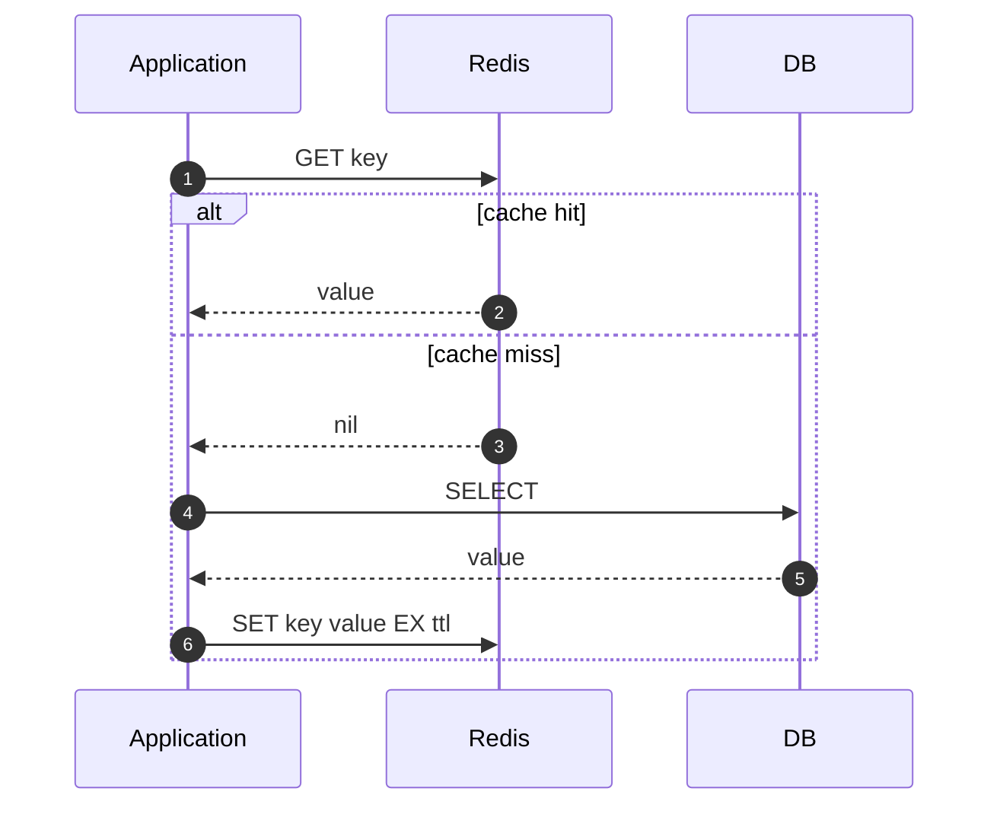

# Redis как кэш

Кэш — слой между приложением и медленным источником данных (БД, внешний API, тяжёлый компьют). Цель — сократить latency и нагрузку на источник. Redis — самый распространённый выбор для кэша в backend-сервисах.

## Содержание

- [Зачем кэш и когда он не нужен](#зачем-кэш-и-когда-он-не-нужен)
- [Cache-aside (lazy loading)](#cache-aside-lazy-loading)
- [Write-through и write-behind](#write-through-и-write-behind)
- [TTL: время жизни записи](#ttl-время-жизни-записи)
- [Инвалидация — самая сложная часть](#инвалидация-самая-сложная-часть)
- [Cache stampede и thundering herd](#cache-stampede-и-thundering-herd)
- [Прогрев кэша](#прогрев-кэша)
- [Сериализация значений](#сериализация-значений)
- [Ключевые паттерны именования](#ключевые-паттерны-именования)
- [Когда НЕ кэшировать](#когда-не-кэшировать)
- [Redis в Go: практика](#redis-в-go-практика)
- [Метрики кэша](#метрики-кэша)
- [Частые ошибки](#частые-ошибки)

---

## Зачем кэш и когда он не нужен

**Зачем:**
- БД-запрос 50ms → Redis lookup 0.5ms (×100 быстрее)
- БД упадёт под 10k QPS, Redis выдержит 100k+ QPS
- Тяжёлый компьют (рендер, ML inference) — посчитал один раз, отдаёшь многим

**Базовая аналогия.** БД — это библиотека: каждый запрос — пройти к стеллажу, найти книгу, выписать. Кэш — это стол перед тобой: книги, которые часто читают, лежат рядом. Ты сначала смотришь на стол, и только если там нет — идёшь в библиотеку.

**Когда не нужен:**
- данные меняются чаще чем читаются (TTL < latency запроса)
- источник и так быстрый (memory hit, простой SELECT по PK с индексом — 1-2ms)
- консистентность критична (банковский баланс)
- объём данных меньше работающего set'а (всё уже в memory у БД)

Кэш — это сложность: дополнительная инфраструктура, риск стейл-данных, потенциальные несоответствия. Не ставь "на всякий случай".

---

## Cache-aside (lazy loading)

Самый распространённый паттерн. Приложение само управляет кэшем.



```go
type UserCache struct {
    redis *redis.Client
    repo  UserRepository
    ttl   time.Duration
}

func (c *UserCache) Get(ctx context.Context, id string) (*User, error) {
    key := "user:" + id

    // 1. Cache lookup
    raw, err := c.redis.Get(ctx, key).Bytes()
    if err == nil {
        var u User
        if err := json.Unmarshal(raw, &u); err == nil {
            return &u, nil
        }
        // Поломанный JSON в кэше — игнорируем, пойдём в БД
    }
    if err != nil && !errors.Is(err, redis.Nil) {
        // Redis недоступен — не падаем, идём в БД (degrade gracefully)
        slog.WarnContext(ctx, "redis unavailable, falling back to DB", "err", err)
    }

    // 2. Cache miss → DB
    u, err := c.repo.GetByID(ctx, id)
    if err != nil {
        return nil, err
    }

    // 3. Сохранить в кэш (best-effort, не блокируем основной путь)
    if data, err := json.Marshal(u); err == nil {
        if err := c.redis.Set(ctx, key, data, c.ttl).Err(); err != nil {
            slog.WarnContext(ctx, "cache set failed", "err", err)
        }
    }

    return u, nil
}
```

**Ключевые свойства:**
- кэш не "знает" про БД — приложение явно управляет
- если Redis упал — degrade на БД, не падаем целиком
- если в кэше "битые" данные — игнорируем, перечитываем

---

## Write-through и write-behind

Альтернативные паттерны для случаев когда нужна гарантия что после записи кэш всегда актуален.

**Write-through:** запись синхронно идёт в БД и кэш одновременно. Чтение всегда из кэша.

```go
func (c *UserCache) Update(ctx context.Context, u *User) error {
    if err := c.repo.Update(ctx, u); err != nil {
        return err
    }
    // Кэш всегда актуален — нет момента когда в кэше старое
    data, _ := json.Marshal(u)
    return c.redis.Set(ctx, "user:"+u.ID, data, c.ttl).Err()
}
```

Минус — каждая запись медленнее на время Redis-операции. Если Redis упал — запись падает.

**Write-behind (write-back):** запись в кэш, в БД — асинхронно (батчами). Очень быстро, но риск потерять данные при падении Redis между записью и flush'ем. Используется редко, в основном для метрик и счётчиков.

**Вердикт:** в 95% случаев — cache-aside. Write-through имеет смысл когда чтения значительно превышают записи и нельзя терпеть стейл-кэш даже на TTL.

---

## TTL: время жизни записи

Каждая запись в кэше должна иметь TTL. Без TTL кэш растёт неограниченно и ломается.

**Как выбирать TTL:**

| Тип данных | Типичный TTL | Почему |
|---|---|---|
| Сессии пользователя | 24h–30d | Реальное время жизни сессии |
| Профиль пользователя | 5–15 минут | Меняется редко, но не должен быть слишком стейл |
| Список постов / feed | 30s–5 минут | Меняется часто, но небольшая задержка ОК |
| Курс валют | 1–5 минут | Внешний API, цена обновляется регулярно |
| Конфиг приложения | 1–5 минут | Смена должна применяться без рестарта |
| Тяжёлый агрегатный отчёт | 1h–24h | Дорого считать, медленно меняется |

**Не использовать одинаковый TTL для всего.** Если у тебя 10000 ключей с TTL=300s, и все они закэшировались примерно одновременно — они истекут одновременно, и приложение получит лавину запросов в БД (см. cache stampede).

**Jitter (случайный сдвиг TTL):**

```go
// Не: redis.Set(ctx, key, val, 5*time.Minute)
// А: с разбросом ±20%
ttl := 5*time.Minute + time.Duration(rand.Intn(120))*time.Second
redis.Set(ctx, key, val, ttl)
```

Это размазывает истечения по времени, никакая лавина не накатывает.

---

## Инвалидация — самая сложная часть

> "There are only two hard things in Computer Science: cache invalidation and naming things." — Phil Karlton

После того как данные в БД изменились, кэш надо либо обновить, либо удалить. Иначе пользователи будут видеть старые данные.

**Стратегии:**

### 1. TTL и забыть

Самая простая. Пишем в БД, кэш не трогаем — он сам истечёт через TTL.

```go
func (s *Service) UpdateUser(ctx context.Context, u *User) error {
    return s.repo.Update(ctx, u)
    // Кэш протухнет сам через 5 минут
}
```

**Плюс:** простота, нет race conditions.
**Минус:** до TTL читатели видят старые данные.

Подходит когда стейл-данные не критичны (профиль, список товаров).

### 2. Delete on write

После UPDATE удаляем ключ из кэша. Следующее чтение пойдёт в БД и положит свежее.

```go
func (s *Service) UpdateUser(ctx context.Context, u *User) error {
    if err := s.repo.Update(ctx, u); err != nil {
        return err
    }
    // Удаляем — следующее чтение перечитает из БД
    return s.redis.Del(ctx, "user:"+u.ID).Err()
}
```

**Почему DEL, а не SET с новым значением?** Если делаешь SET — есть race: между UPDATE в БД и SET в кэше другой запрос может прочитать старое значение из БД и записать его в кэш как "новое". DEL безопаснее — кэш всегда заполняется только из свежего чтения.

### 3. Inconsistency window

Между UPDATE в БД и DEL в кэше — окно (микросекунды), когда:
- БД уже новые данные
- кэш ещё старые
- параллельный читатель может прочитать старое из кэша

В большинстве случаев приемлемо. Если нет — нужен distributed lock или transactional outbox для invalidation events.

### 4. Pub/Sub инвалидация для нескольких инстансов

Если у тебя несколько инстансов сервиса и каждый держит локальный in-memory кэш (быстрее Redis) — Redis pub/sub для рассылки "invalidate":

```go
// Инстанс 1: после UPDATE
redis.Publish(ctx, "cache:invalidate", "user:"+u.ID)

// Все инстансы (subscriber):
sub := redis.Subscribe(ctx, "cache:invalidate")
for msg := range sub.Channel() {
    localCache.Delete(msg.Payload)
}
```

### 5. Tagged invalidation

Когда нужно инвалидировать группу ключей:

```go
// Хранить связи: tag → ключи
redis.SAdd(ctx, "tag:user:"+uid+":posts", "post:"+postID)

// При изменении пользователя — удалить все его посты
keys, _ := redis.SMembers(ctx, "tag:user:"+uid+":posts").Result()
if len(keys) > 0 {
    redis.Del(ctx, keys...)
}
redis.Del(ctx, "tag:user:"+uid+":posts")
```

---

## Cache stampede и thundering herd

**Cache stampede** — когда популярный ключ истёк, и одновременно 1000 запросов получают cache miss. Все идут в БД, БД ложится.

**Сценарий:**
```
t=0:    SET hot_key (TTL=60s)
t=60:   key expires
t=60.001: 1000 requests come in → all see miss → all hit DB
        → DB overload
```

**Решение 1: single-flight (мьютекс на ключ).**

Только первый запрос идёт в БД, остальные ждут результат:

```go
import "golang.org/x/sync/singleflight"

var sf singleflight.Group

func (c *UserCache) Get(ctx context.Context, id string) (*User, error) {
    key := "user:" + id

    if raw, err := c.redis.Get(ctx, key).Bytes(); err == nil {
        var u User
        json.Unmarshal(raw, &u)
        return &u, nil
    }

    // singleflight: только один поход в БД на ключ
    result, err, _ := sf.Do(key, func() (interface{}, error) {
        u, err := c.repo.GetByID(ctx, id)
        if err != nil {
            return nil, err
        }
        data, _ := json.Marshal(u)
        c.redis.Set(ctx, key, data, c.ttl)
        return u, nil
    })

    if err != nil {
        return nil, err
    }
    return result.(*User), nil
}
```

`singleflight` дедуплицирует одновременные вызовы по ключу в одном инстансе. Для распределённого случая — distributed lock (Redis SET NX).

**Решение 2: probabilistic early refresh.**

Не ждать истечения, а с вероятностью обновлять заранее. Чем ближе TTL к концу, тем выше шанс:

```go
// Сохраняем не только value, но и expiry
type cached struct {
    Value     []byte
    ExpiresAt time.Time
}

func shouldRefresh(c cached, beta float64) bool {
    delta := time.Until(c.ExpiresAt).Seconds()
    return -delta*beta*math.Log(rand.Float64()) > 0
}
```

XFetch алгоритм — статистически размазывает обновления, никакой синхронной лавины.

**Решение 3: stale-while-revalidate.**

Возвращаем стейл-значение немедленно, в фоне обновляем:

```go
if cached.IsStale() {
    go c.refreshAsync(ctx, key)  // обновим, не блокируя клиента
    return cached.Value, nil      // отдаём стейл прямо сейчас
}
```

---

## Прогрев кэша

Cold cache — после рестарта/деплоя кэш пуст. Все запросы идут в БД, latency взлетает, БД может не выдержать.

**Стратегии прогрева:**

**1. Lazy (естественный).** Ничего не делаем — кэш заполняется по мере запросов. Простейший, но первые минуты после деплоя — высокая нагрузка на БД.

**2. Active warming.** На старте сервис проактивно читает популярные ключи:

```go
func (s *Service) WarmupCache(ctx context.Context) error {
    // Топ-1000 пользователей по активности
    topUsers, err := s.repo.GetTopActiveUsers(ctx, 1000)
    if err != nil {
        return err
    }
    for _, u := range topUsers {
        data, _ := json.Marshal(u)
        s.redis.Set(ctx, "user:"+u.ID, data, s.ttl)
    }
    return nil
}
```

**3. Replicated cache.** Не сбрасывать кэш при деплое — Redis отдельно от приложения, переживает рестарты.

**4. Канареечный деплой + прогрев.** Канарейка получает 1% трафика, прогревает свой кэш до полного роллаута.

---

## Сериализация значений

Redis хранит bytes. Приложение должно сериализовать/десериализовать.

| Формат | Плюсы | Минусы |
|---|---|---|
| **JSON** | Читабельный, универсальный | Большой размер, парсинг медленнее |
| **MessagePack** | Компактный, быстрый | Не human-readable |
| **Protocol Buffers** | Типизированный, быстрый, schema evolution | Нужен .proto, не редактируется напрямую |
| **Gob** (Go-only) | Быстрый, нативный | Несовместим с другими языками |

**Дефолт — JSON.** Понятный для отладки, простой. Меняй на msgpack/proto только если профайлер показал что сериализация — bottleneck.

```go
// JSON
data, _ := json.Marshal(u)
redis.Set(ctx, key, data, ttl)

// MessagePack (vmihailenco/msgpack)
data, _ := msgpack.Marshal(u)
```

---

## Ключевые паттерны именования

Хороший ключ — самодокументируемый и легко чистится:

```
<entity>:<id>                       user:123
<entity>:<id>:<sub>                 user:123:posts
<entity>:<id>:<sub>:<filter>        user:123:posts:published
<feature>:v<version>:<id>           profile:v2:123
<tenant>:<entity>:<id>              org-456:user:123
```

**Версионирование схемы.** Если меняется формат значения (добавили поле, поменяли тип) — увеличь версию в ключе. Старые ключи протухнут по TTL, новые — с новой схемой. Без версии — ловишь panic при unmarshal старых значений после деплоя.

**Префиксы по типу:**

```go
const (
    KeyUser       = "user:"
    KeyUserPosts  = "user:%s:posts"
    KeySession    = "session:"
    KeyRateLimit  = "rl:%s:%s"  // rl:<user>:<endpoint>
)
```

Преимущество — `KEYS user:*` (только в DEBUG, на продакшне — `SCAN`), легко чистить группами.

---

## Когда НЕ кэшировать

Не каждые данные стоит кэшировать.

**1. Низкий hit rate.** Если 90% запросов идут к уникальным ключам (например, поиск по точному запросу пользователя) — кэш бесполезен, только overhead.

**2. Большой объём, мало повторов.** История запросов конкретного пользователя — кэшировать одного, остальные не нужны.

**3. Чувствительные данные с критичной консистентностью.** Банковский баланс — пользователь не должен видеть стейл. Платёжные операции, заказы в active state.

**4. Данные сессии конкретного пользователя в персональном UI.** Если запрос обслуживает только этого пользователя и тот же запрос больше никто не сделает — нет смысла кэшировать в Redis (можно в локальный in-memory кэш).

**5. Когда БД и так быстрая.** Простой SELECT по PK с индексом — 1ms. Redis lookup — 0.5ms. Сэкономили 0.5ms ценой инфраструктуры. Не стоит.

**6. Write-heavy workloads.** Если на одно чтение 10 записей — invalidation будет дороже самого кэша.

---

## Redis в Go: практика

```go
import "github.com/redis/go-redis/v9"

func newRedis() *redis.Client {
    return redis.NewClient(&redis.Options{
        Addr:         os.Getenv("REDIS_ADDR"),
        Password:     os.Getenv("REDIS_PASSWORD"),
        DB:           0,
        PoolSize:     10 * runtime.NumCPU(),
        MinIdleConns: 5,
        DialTimeout:  3 * time.Second,
        ReadTimeout:  500 * time.Millisecond,
        WriteTimeout: 500 * time.Millisecond,
    })
}
```

**Важные настройки:**
- `ReadTimeout` короткий — если Redis тормозит, не блокировать запрос пользователя надолго. Лучше cache miss и поход в БД, чем 5-секундный таймаут.
- `PoolSize` зависит от нагрузки — типично 10×NumCPU.
- `MinIdleConns` — держать прогретые соединения, чтобы не делать handshake под нагрузкой.

**Pipeline — батчевые операции:**

```go
// Без pipeline: 100 RTT
for _, key := range keys {
    redis.Get(ctx, key)
}

// С pipeline: 1 RTT
pipe := redis.Pipeline()
cmds := make([]*redis.StringCmd, len(keys))
for i, key := range keys {
    cmds[i] = pipe.Get(ctx, key)
}
pipe.Exec(ctx)
```

**MGET для множественного чтения:**

```go
values, _ := redis.MGet(ctx, "user:1", "user:2", "user:3").Result()
// [json1, json2, nil] — третий = miss
```

---

## Метрики кэша

Без метрик не понять, эффективен ли кэш.

**Hit rate:**
```
hit_rate = hits / (hits + misses)
```
Цель — обычно ≥80% для часто читаемых данных. Меньше 50% — задумайся, нужен ли кэш вообще или TTL слишком короткий.

```go
import "github.com/prometheus/client_golang/prometheus"

var (
    cacheHits = prometheus.NewCounterVec(
        prometheus.CounterOpts{Name: "cache_hits_total"},
        []string{"cache"},
    )
    cacheMisses = prometheus.NewCounterVec(
        prometheus.CounterOpts{Name: "cache_misses_total"},
        []string{"cache"},
    )
)

func (c *UserCache) Get(ctx context.Context, id string) (*User, error) {
    raw, err := c.redis.Get(ctx, "user:"+id).Bytes()
    if err == nil {
        cacheHits.WithLabelValues("user").Inc()
        // ...
    } else {
        cacheMisses.WithLabelValues("user").Inc()
        // ... go to DB
    }
}
```

**Latency:** распределение времени lookup'а. Если p99 > 50ms на Redis — что-то не так (сетевые проблемы, Redis перегружен).

**Memory:** `redis-cli INFO memory`. Если близко к лимиту — eviction policy сработает (см. ниже).

**Eviction count:** сколько ключей выбросили из-за нехватки памяти. Если высокий — Redis не справляется с нагрузкой.

---

## Частые ошибки

**1. Redis как primary store.**
Кэш — не источник правды. БД — источник, Redis — копия. Если Redis упал, данные не должны теряться. Применяй cache-aside, не write-behind для важных данных.

**2. Нет fallback на отказ Redis.**
```go
// Плохо — Redis упал → весь сервис лёг
val, err := redis.Get(ctx, key).Result()
if err != nil {
    return nil, err
}

// Правильно — degrade на БД
val, err := redis.Get(ctx, key).Result()
if err != nil && !errors.Is(err, redis.Nil) {
    slog.Warn("redis unavailable", "err", err)
    return repo.Get(ctx, key)
}
```

**3. Кэширование результатов SELECT *.**
Если в кэше лежит вся строка, и в БД добавили колонку — старые ключи в кэше будут без неё. Версионируй схему через ключ.

**4. Слишком длинный TTL.**
TTL=24h на профиль пользователя — пользователь поменял имя и ждёт сутки чтобы оно обновилось. Балансируй между нагрузкой на БД и свежестью данных.

**5. Слишком короткий TTL.**
TTL=10s, БД-запрос 50ms, время жизни кэшируемого окна < времени получения. hit rate ~20% — кэш бесполезен, только overhead.

**6. Кэширование пустых результатов без отметки.**
```go
// БД ответила "не найдено" → не кэшируем → каждый запрос идёт в БД
// = bypass кэша через несуществующие ID

// Правильно — кэшировать "negative result" с коротким TTL
if errors.Is(err, sql.ErrNoRows) {
    redis.Set(ctx, key, "NULL", 30*time.Second)
    return nil, ErrNotFound
}
```

**7. Не настроена eviction policy.**
По умолчанию Redis при достижении `maxmemory` отказывает в записях. Для кэша — поставь `allkeys-lru` или `allkeys-lfu`:

```
# redis.conf
maxmemory 2gb
maxmemory-policy allkeys-lru
```
- `allkeys-lru` — выбрасывать давно не используемые
- `allkeys-lfu` — выбрасывать редко используемые
- `volatile-ttl` — выбрасывать те, у которых ближе TTL

**8. Хранение огромных значений.**
Один ключ на 100MB — при чтении блокирует Redis (single-threaded). Большие значения — в S3, в Redis только ссылка/метаданные.

**9. Использование `KEYS *` на продакшне.**
`KEYS` блокирует Redis на время сканирования. На большой БД — секунды простоя. Только `SCAN`:

```go
iter := redis.Scan(ctx, 0, "user:*", 1000).Iterator()
for iter.Next(ctx) {
    fmt.Println(iter.Val())
}
```

**10. Кэш как способ "ускорить медленные запросы".**
Если БД-запрос 5 секунд, и ты кладёшь его в кэш — да, последующие быстрые. Но первый запрос (cache miss) всё равно 5 секунд. Решение — оптимизировать запрос или денормализовать. Кэш не лечит структурные проблемы.
