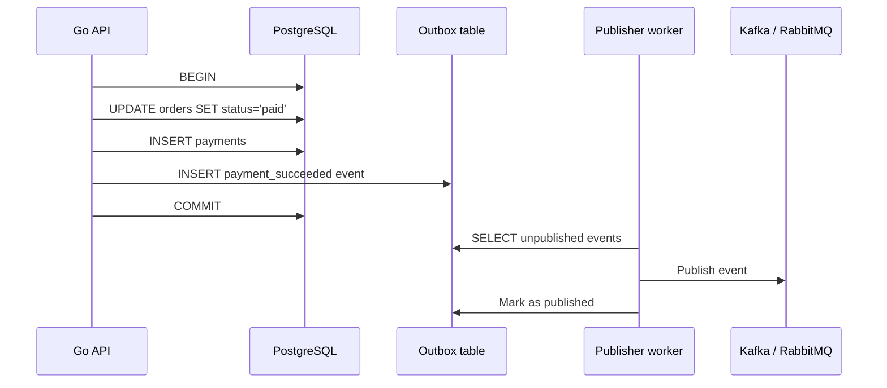

# ACID Transactions And Invariants

`ACID` описывает свойства транзакций: что должна гарантировать база данных, когда несколько операций объединены в одно логическое изменение.

## Содержание

- [Зачем backend-разработчику ACID](#зачем-backend-разработчику-acid)
- [ACID коротко](#acid-коротко)
- [Atomicity](#atomicity)
- [Consistency](#consistency)
- [Isolation](#isolation)
- [Durability](#durability)
- [ACID не отменяет проектирование](#acid-не-отменяет-проектирование)
- [Пример: перевод денег](#пример-перевод-денег)
- [Пример: резервирование товара](#пример-резервирование-товара)
- [Типичные ошибки](#типичные-ошибки)
- [Что говорить на собеседовании](#что-говорить-на-собеседовании)
- [Interview-ready answer](#interview-ready-answer)

## Зачем backend-разработчику ACID

На практике `ACID` нужен не для академического определения, а чтобы ответить на вопросы:
- какие данные нельзя частично записать;
- какие инварианты должны сохраняться всегда;
- где должны быть границы транзакции;
- какие гонки возможны при параллельных запросах;
- что будет после crash/restart;
- где нужны constraints, locks, isolation level или idempotency.

Инвариант - это правило, которое система обязана сохранять.

Примеры:
- баланс счета не должен уйти ниже нуля;
- у заказа не может быть два успешных платежа;
- username должен быть уникальным;
- нельзя продать больше единиц товара, чем есть на складе;
- событие в outbox должно появиться атомарно вместе с изменением заказа.

`ACID` помогает защищать такие правила внутри одной transactional boundary. Но он не решает все проблемы автоматически: границы транзакции, schema constraints и порядок операций проектирует разработчик.

## ACID коротко

| Свойство | Простыми словами | Практический вопрос |
| --- | --- | --- |
| `Atomicity` | Все операции транзакции применились или не применилось ничего | Может ли система увидеть половину изменения? |
| `Consistency` | После commit данные не нарушают правила схемы и бизнес-инварианты | Какие правила обязаны быть истинны после операции? |
| `Isolation` | Параллельные транзакции не должны некорректно влиять друг на друга | Какие гонки возможны при одновременных запросах? |
| `Durability` | После commit данные переживают обычный сбой | Что будет после crash процесса или рестарта БД? |

Важно: `Consistency` в `ACID` - это не то же самое, что `Consistency` в `CAP`.

В `ACID` речь про валидность данных после транзакции. В `CAP` речь про то, увидят ли разные узлы распределенной системы одно и то же актуальное значение.

## Atomicity

`Atomicity` означает: транзакция применяется как единое целое.

Пример без atomicity:
- списали деньги с покупателя;
- сервис упал до создания платежной записи;
- заказ остался в странном состоянии.

Пример с atomicity:

```sql
BEGIN;

UPDATE accounts
SET balance = balance - 100
WHERE id = 1 AND balance >= 100;

UPDATE accounts
SET balance = balance + 100
WHERE id = 2;

INSERT INTO ledger_entries(account_id, amount, operation)
VALUES (1, -100, 'transfer'), (2, 100, 'transfer');

COMMIT;
```

Если одна операция не прошла, транзакция откатывается:

```sql
ROLLBACK;
```

На интервью важно не просто сказать "all or nothing", а объяснить, где проходит граница этого "all".

Хорошая граница:
- изменить `orders.status`;
- создать `payments`;
- записать событие в `outbox`;
- сделать это в одной БД-транзакции.

Плохая граница:
- открыть транзакцию;
- вызвать внешний payment provider;
- ждать HTTP response;
- потом закоммитить.

Почему плохо:
- долго держится connection;
- могут держаться row locks;
- растет шанс deadlock;
- внешний вызов нельзя откатить через `ROLLBACK`.

## Consistency

`Consistency` в `ACID` означает: транзакция переводит базу из одного валидного состояния в другое.

Часть consistency обеспечивает сама БД:
- `PRIMARY KEY`;
- `UNIQUE`;
- `FOREIGN KEY`;
- `CHECK`;
- `NOT NULL`;
- transactional constraints.

Часть consistency обязан обеспечить application code:
- правильная state machine заказа;
- idempotency key для повторных запросов;
- запрет перехода `paid -> new`;
- проверка доступного остатка;
- outbox вместо "сначала commit, потом publish в Kafka".

Пример constraint:

```sql
CREATE TABLE payments (
    id BIGSERIAL PRIMARY KEY,
    order_id BIGINT NOT NULL,
    provider_payment_id TEXT NOT NULL,
    status TEXT NOT NULL,
    UNIQUE (order_id),
    UNIQUE (provider_payment_id)
);
```

`UNIQUE (order_id)` защищает от двух успешных payment rows на один order. Даже если два Go handler одновременно попытаются создать платеж, один insert проиграет.

Практическая мысль: если инвариант критичен, лучше зафиксировать его на уровне БД, а не только в application code.

## Isolation

`Isolation` отвечает за поведение параллельных транзакций.

Без нормальной isolation можно получить:
- lost update;
- dirty read;
- non-repeatable read;
- phantom read;
- write skew.

Коротко про частую путаницу:

| Аномалия | Что меняется | Пример |
| --- | --- | --- |
| `non-repeatable read` | Значение уже прочитанной строки | В транзакции два раза читаем `orders.id = 42`: сначала `status = 'new'`, потом `status = 'paid'` |
| `phantom read` | Набор строк, подходящих под условие | В транзакции два раза считаем `orders WHERE status = 'new'`: сначала `10`, потом `11`, потому что появилась новая строка |

То есть `non-repeatable read` - про изменение конкретной строки, а `phantom read` - про появление или исчезновение строк в результате запроса по условию.

Частые isolation levels:

| Level | Что примерно дает | Цена |
| --- | --- | --- |
| `READ UNCOMMITTED` | В SQL standard допускает dirty reads, но в PostgreSQL работает как `READ COMMITTED` | В PG почти не используют как отдельный режим |
| `READ COMMITTED` | Запрос видит только committed данные на момент выполнения statement | Обычно быстрый default, но не защищает от всех гонок |
| `REPEATABLE READ` | Транзакция видит стабильный snapshot | Меньше аномалий, но возможны конфликты и нюансы реализации |
| `SERIALIZABLE` | Результат как будто транзакции выполнились последовательно | Сильнее, дороже, нужны retries при serialization failures |

В PostgreSQL можно запросить все 4 стандартных уровня, но фактически реализовано 3 разных поведения: `READ UNCOMMITTED` работает как `READ COMMITTED`.

### `READ UNCOMMITTED` в PostgreSQL

В SQL standard этот уровень допускает dirty read: транзакция может увидеть данные, которые другая транзакция еще не закоммитила.

В PostgreSQL dirty read не происходит:

```sql
-- T1
BEGIN;

UPDATE accounts
SET balance = 0
WHERE id = 1;

-- COMMIT еще не было
```

```sql
-- T2
BEGIN ISOLATION LEVEL READ UNCOMMITTED;

SELECT balance
FROM accounts
WHERE id = 1;
```

Что увидит `T2` в PostgreSQL:
- не uncommitted `balance = 0`;
- а последнюю committed версию строки.

Практический вывод: если в PostgreSQL указать `READ UNCOMMITTED`, не стоит ожидать "грязных чтений"; PG поднимет поведение до `READ COMMITTED`.

### `READ COMMITTED`

`READ COMMITTED` - default в PostgreSQL. Каждый statement видит snapshot на начало этого statement.

```sql
-- T1
BEGIN ISOLATION LEVEL READ COMMITTED;

SELECT status
FROM orders
WHERE id = 42;
-- result: 'new'
```

```sql
-- T2
BEGIN;

UPDATE orders
SET status = 'paid'
WHERE id = 42;

COMMIT;
```

```sql
-- T1, та же транзакция, но новый statement
SELECT status
FROM orders
WHERE id = 42;
-- result: 'paid'

COMMIT;
```

Что важно:
- dirty read нет;
- non-repeatable read возможен;
- два `SELECT` внутри одной транзакции могут увидеть разные committed версии;
- для многих backend-сервисов это нормальный default, если критичные инварианты защищены constraints/locks/atomic updates.

### `REPEATABLE READ`

`REPEATABLE READ` в PostgreSQL держит стабильный snapshot на всю транзакцию: повторные чтения видят состояние на момент старта транзакции.

```sql
-- T1
BEGIN ISOLATION LEVEL REPEATABLE READ;

SELECT status
FROM orders
WHERE id = 42;
-- result: 'new'
```

```sql
-- T2
BEGIN;

UPDATE orders
SET status = 'paid'
WHERE id = 42;

COMMIT;
```

```sql
-- T1, та же транзакция
SELECT status
FROM orders
WHERE id = 42;
-- result: 'new'

COMMIT;
```

Еще пример с phantom-like чтением:

```sql
-- T1
BEGIN ISOLATION LEVEL REPEATABLE READ;

SELECT count(*)
FROM orders
WHERE status = 'new';
-- result: 10
```

```sql
-- T2
INSERT INTO orders(status)
VALUES ('new');

COMMIT;
```

```sql
-- T1
SELECT count(*)
FROM orders
WHERE status = 'new';
-- result в PostgreSQL: 10
```

Что важно:
- non-repeatable read нет;
- phantom reads в PostgreSQL `REPEATABLE READ` тоже не проявляются, потому что PG дает более сильное поведение, чем минимально требует SQL standard;
- serialization anomalies все еще возможны, поэтому это не полная замена `SERIALIZABLE`.

### `SERIALIZABLE`

`SERIALIZABLE` пытается дать результат, эквивалентный последовательному выполнению транзакций. Если PostgreSQL видит опасный pattern, одна транзакция падает с `serialization_failure`, и приложение должно retry.

Классический write skew:
- в больнице всегда должен быть хотя бы один doctor on call;
- два врача одновременно решают отключиться;
- каждый видит, что второй еще on call;
- оба обновляют разные строки.

```sql
-- T1
BEGIN ISOLATION LEVEL SERIALIZABLE;

SELECT count(*)
FROM doctors
WHERE on_call = true;
-- result: 2

UPDATE doctors
SET on_call = false
WHERE id = 1;
```

```sql
-- T2
BEGIN ISOLATION LEVEL SERIALIZABLE;

SELECT count(*)
FROM doctors
WHERE on_call = true;
-- result: 2

UPDATE doctors
SET on_call = false
WHERE id = 2;
```

```sql
-- T1
COMMIT;
-- ok

-- T2
COMMIT;
-- ERROR: could not serialize access due to read/write dependencies among transactions
```

Что важно:
- `SERIALIZABLE` защищает от write skew и serialization anomalies;
- это не значит "никогда нет ошибок" - наоборот, ошибки конфликтов становятся нормальной частью control flow;
- в Go-коде такие транзакции нужно оборачивать в retry с backoff;
- внешние side effects нельзя делать внутри retry-блока без idempotency.

Пример lost update:

```text
T1 читает balance = 100
T2 читает balance = 100
T1 пишет balance = 70
T2 пишет balance = 50
```

Ожидали `20`, получили `50`: update от T1 потерялся.

Что помогает:
- атомарный SQL update;
- row lock через `SELECT ... FOR UPDATE`;
- optimistic locking через `version`;
- `SERIALIZABLE` и retry;
- constraints.

Атомарный update:

```sql
UPDATE accounts
SET balance = balance - 30
WHERE id = 1 AND balance >= 30;
```

Если `rows affected = 0`, денег недостаточно или запись не найдена.

Row lock:

```sql
BEGIN;

SELECT balance
FROM accounts
WHERE id = 1
FOR UPDATE;

UPDATE accounts
SET balance = balance - 30
WHERE id = 1;

COMMIT;
```

## Durability

`Durability` означает: после успешного `COMMIT` база должна сохранить изменение при обычном сбое.

Обычно это обеспечивается через:
- write-ahead log;
- fsync/durable flush;
- replication;
- recovery process после restart.

Но durability тоже имеет trade-offs.

Примеры:
- synchronous commit надежнее, но увеличивает latency;
- asynchronous replication быстрее, но replica может отставать;
- если commit вернулся клиенту, но данные еще не попали на replica, read-after-write с replica может увидеть старое состояние;
- если использовать cache как источник истины без persistence, durability может быть слабее, чем ожидает бизнес.

В backend-разговоре полезно уточнять: durable где именно?
- на primary node;
- на quorum узлов;
- на replica в другом AZ;
- в object storage backup;
- в event log.

## ACID не отменяет проектирование

`ACID` не значит:
- можно игнорировать idempotency;
- можно держать транзакцию вокруг внешних API;
- можно не думать об isolation level;
- можно не ставить unique constraints;
- можно читать с replica и всегда ожидать свежие данные;
- можно решить distributed transaction между микросервисами обычным `BEGIN/COMMIT`.

Транзакция защищает только то, что находится внутри ее границы и поддерживается конкретной БД.

Для микросервисов часто нужны дополнительные паттерны:
- outbox;
- inbox;
- saga;
- idempotency keys;
- retry with backoff;
- дедупликация events;
- reconciliation jobs.

Упрощенная схема payment flow:



Здесь атомарность нужна между order/payment/outbox. Публикация во внешний broker идет после commit, но событие не теряется, потому что оно уже durable в outbox.

## Пример: перевод денег

Требования:
- нельзя списать больше доступного баланса;
- нельзя применить один transfer дважды;
- ledger должен совпадать с балансами;
- операция должна быть retry-safe.

Возможная модель:

```sql
CREATE TABLE transfers (
    idempotency_key TEXT PRIMARY KEY,
    from_account_id BIGINT NOT NULL,
    to_account_id BIGINT NOT NULL,
    amount BIGINT NOT NULL CHECK (amount > 0),
    status TEXT NOT NULL
);
```

Flow:
- принять `Idempotency-Key`;
- в транзакции создать `transfers` или найти существующий;
- атомарно списать деньги с `WHERE balance >= amount`;
- зачислить деньги получателю;
- записать ledger entries;
- commit.

Ключевой момент для интервью: retry должен возвращать тот же результат, а не создавать второй transfer.

Упрощенный псевдокод на Go:

```go
err := withTx(ctx, db, func(tx *sql.Tx) error {
    inserted, err := insertTransferIfNotExists(ctx, tx, key, fromID, toID, amount)
    if err != nil {
        return err
    }
    if !inserted {
        return ErrAlreadyProcessed
    }

    affected, err := debitIfEnoughBalance(ctx, tx, fromID, amount)
    if err != nil {
        return err
    }
    if affected == 0 {
        return ErrInsufficientFunds
    }

    if err := credit(ctx, tx, toID, amount); err != nil {
        return err
    }
    return insertLedgerEntries(ctx, tx, fromID, toID, amount)
})
```

## Пример: резервирование товара

Плохой вариант:
- прочитать `stock = 1`;
- в application code проверить `stock > 0`;
- потом сделать `UPDATE stock = stock - 1`;
- параллельный запрос делает то же самое.

Лучше:

```sql
UPDATE inventory
SET reserved = reserved + 1
WHERE sku = $1
  AND available - reserved >= 1;
```

Если `rows affected = 1`, резерв успешен. Если `0`, товара нет.

Trade-off:
- такой update прост и хорошо работает для одного SKU;
- если нужно резервировать много SKU в одном заказе, нужно думать о порядке locks, rollback и компенсациях;
- если склад распределен по регионам, ACID одной БД уже не покрывает весь домен.

## Типичные ошибки

Ошибка: "У нас Postgres, значит double payment невозможен".

Почему неверно:
- если нет unique constraint/idempotency/lock, два handler могут создать две записи;
- сама БД не знает бизнес-правило "один успешный payment на order", пока вы его не выразили.

Ошибка: "Serializable решит все".

Почему неполно:
- поможет от многих concurrency anomalies;
- но увеличит число retries;
- не откатит внешние side effects;
- не заменит idempotency и constraints.

Ошибка: "Транзакция должна оборачивать весь use case".

Почему опасно:
- use case может включать HTTP calls, очереди, long-running computation;
- транзакция должна быть короткой и покрывать только атомарные изменения в БД.

Ошибка: "После commit можно сразу читать с replica".

Почему опасно:
- replica lag может вернуть старое состояние;
- для read-after-write нужен primary read, session consistency или механизм ожидания replication position.

## Что говорить на собеседовании

Хороший ответ обычно строится так:
- назвать инвариант;
- показать transactional boundary;
- сказать, какие constraints/locks нужны;
- объяснить, какие операции нельзя делать внутри транзакции;
- упомянуть retries/idempotency для сетевых повторов;
- отдельно сказать про distributed boundary, если участвуют другие сервисы.

Пример:

```text
Для оплаты заказа я бы защищал инвариант "у заказа не больше одного успешного платежа".
В одной транзакции обновил бы order, создал payment и записал outbox event.
На payment поставил бы unique constraint по order_id или provider_payment_id.
Внешний вызов payment provider не держал бы внутри долгой DB transaction; сделал бы flow retry-safe через idempotency key.
```

## Interview-ready answer

`ACID` - это набор гарантий транзакции: atomicity защищает от частичных изменений, consistency сохраняет инварианты, isolation управляет конкурирующими транзакциями, durability сохраняет committed данные после сбоя. На практике важно не просто сказать определение, а правильно выбрать границы транзакции, выразить критичные инварианты через constraints/locks и не держать транзакцию вокруг внешних API. Для распределенных side effects обычно нужны outbox, idempotency и retries.
