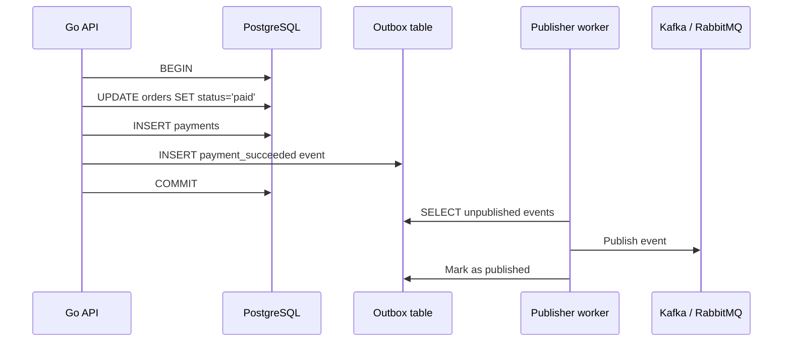

# ACID: транзакции и инварианты

`ACID` описывает свойства транзакций: что должна гарантировать база данных, когда несколько операций объединены в одно логическое изменение.

Здесь — концепты и инварианты. Пошаговая механика уровней изоляции и блокировок разобрана в [04-transactions-and-locking.md](../database-systems-catalog/postgresql/04-transactions-and-locking.md), внутренности PostgreSQL (MVCC, локи) — в [01-mvcc-and-vacuum.md](../database-systems-catalog/postgresql/01-mvcc-and-vacuum.md) и [04-transactions-and-locking.md](../database-systems-catalog/postgresql/04-transactions-and-locking.md).

## Содержание

- [Зачем backend-разработчику ACID](#зачем-backend-разработчику-acid)
- [ACID коротко](#acid-коротко)
- [Atomicity](#atomicity)
- [Consistency](#consistency)
- [Isolation: аномалии](#isolation-аномалии)
- [Isolation: уровни в PostgreSQL](#isolation-уровни-в-postgresql)
- [Durability](#durability)
- [ACID не отменяет проектирование](#acid-не-отменяет-проектирование)
- [Пример: перевод денег](#пример-перевод-денег)
- [Пример: резервирование товара](#пример-резервирование-товара)
- [Типичные ошибки](#типичные-ошибки)
- [Interview-ready answer](#interview-ready-answer)

## Зачем backend-разработчику ACID

На практике `ACID` нужен не для академического определения, а чтобы ответить на вопросы:

- какие данные нельзя частично записать;
- какие инварианты должны сохраняться всегда;
- где должны быть границы транзакции;
- какие гонки возможны при параллельных запросах;
- что будет после crash/restart;
- где нужны constraints, locks, isolation level или idempotency.

Инвариант — это правило, которое система обязана сохранять. Примеры: баланс счёта не уходит ниже нуля; у заказа не может быть двух успешных платежей; username уникален; нельзя продать больше единиц товара, чем есть на складе; событие в outbox появляется атомарно вместе с изменением заказа.

`ACID` помогает защищать такие правила внутри одной transactional boundary. Но он не решает все проблемы автоматически: границы транзакции, schema constraints и порядок операций проектирует разработчик.

## ACID коротко

| Свойство | Простыми словами | Практический вопрос |
| --- | --- | --- |
| `Atomicity` | Все операции транзакции применились или не применилось ничего | Может ли система увидеть половину изменения? |
| `Consistency` | После commit данные не нарушают правила схемы и бизнес-инварианты | Какие правила обязаны быть истинны после операции? |
| `Isolation` | Параллельные транзакции не должны некорректно влиять друг на друга | Какие гонки возможны при одновременных запросах? |
| `Durability` | После commit данные переживают обычный сбой | Что будет после crash процесса или рестарта БД? |

Важно: `Consistency` в `ACID` — это не то же самое, что `Consistency` в `CAP`. В `ACID` речь про валидность данных после транзакции. В `CAP` — про то, увидят ли разные узлы распределённой системы одно и то же актуальное значение (см. [02-cap-and-base.md](./02-cap-and-base.md)).

## Atomicity

`Atomicity` означает: транзакция применяется как единое целое.

Пример без atomicity: списали деньги с покупателя → сервис упал до создания платёжной записи → заказ остался в промежуточном состоянии, которого не должно существовать.

Пример с atomicity:

```sql
BEGIN;

UPDATE accounts
SET balance = balance - 100
WHERE id = 1 AND balance >= 100;

UPDATE accounts
SET balance = balance + 100
WHERE id = 2;

INSERT INTO ledger_entries(account_id, amount, operation)
VALUES (1, -100, 'transfer'), (2, 100, 'transfer');

COMMIT;
```

Если одна операция не прошла — `ROLLBACK`, и не применилось ничего.

На интервью важно не просто сказать «all or nothing», а объяснить, **где проходит граница этого «all»**.

Хорошая граница — только атомарные изменения в одной БД: изменить `orders.status`, создать `payments`, записать событие в `outbox` — всё в одной транзакции.

Плохая граница — внешний вызов внутри транзакции: открыть транзакцию → вызвать payment provider по HTTP → дождаться ответа → закоммитить. Пока транзакция ждёт сеть, она держит connection из пула и row locks, растёт шанс deadlock, а главное — внешний вызов нельзя откатить через `ROLLBACK`: HTTP-запрос уже ушёл.

## Consistency

`Consistency` в `ACID` означает: транзакция переводит базу из одного валидного состояния в другое.

Часть consistency обеспечивает сама БД — декларативные ограничения схемы: `PRIMARY KEY`, `UNIQUE`, `FOREIGN KEY`, `CHECK`, `NOT NULL`.

Часть consistency обязан обеспечить application code: корректная state machine заказа (запрет перехода `paid -> new`), idempotency key для повторных запросов, проверка доступного остатка, outbox вместо «сначала commit, потом publish в Kafka».

Пример constraint:

```sql
CREATE TABLE payments (
    id BIGSERIAL PRIMARY KEY,
    order_id BIGINT NOT NULL,
    provider_payment_id TEXT NOT NULL,
    status TEXT NOT NULL,
    UNIQUE (order_id),
    UNIQUE (provider_payment_id)
);
```

`UNIQUE (order_id)` защищает от двух успешных payment rows на один order. Даже если два Go-handler-а одновременно попытаются создать платёж, один insert проиграет.

Практическая мысль: если инвариант критичен, его стоит зафиксировать на уровне БД, а не только в application code — код обходится (второй сервис, миграция, ручной SQL), constraint — нет.

## Isolation: аномалии

`Isolation` отвечает за поведение параллельных транзакций. Без достаточной изоляции возможны аномалии:

| Аномалия | Что происходит | Исчезает (в PostgreSQL) |
| --- | --- | --- |
| `dirty read` | Транзакция видит незакоммиченные изменения другой | не воспроизводится ни на одном уровне: даже `READ UNCOMMITTED` в PG работает как `READ COMMITTED` |
| `lost update` | Два «прочитал → посчитал → записал» затирают друг друга | уровнем не решается на `READ COMMITTED`; нужен атомарный `UPDATE`/`FOR UPDATE`/optimistic locking; на `REPEATABLE READ`+ конкурентный `UPDATE` даёт ошибку сериализации |
| `non-repeatable read` | Повторное чтение той же строки даёт другое значение | `REPEATABLE READ` |
| `phantom read` | Меняется набор строк, подходящих под условие (появились/исчезли строки) | в PG — уже `REPEATABLE READ` (сильнее, чем требует стандарт) |
| `write skew` | Две транзакции читают пересекающееся условие и пишут в разные строки, вместе ломая инвариант | `SERIALIZABLE` |

`non-repeatable read` — про изменение конкретной строки, `phantom read` — про изменение набора строк по условию.

### Lost update

```text
T1 читает balance = 100
T2 читает balance = 100
T1 пишет balance = 70   (списал 30)
T2 пишет balance = 50   (списал 50)
```

Ожидали `20`, получили `50`: update от T1 потерялся. Защита — не «поднять уровень изоляции», а убрать паттерн «прочитал в код → записал обратно»:

Атомарный update (лучший вариант для простых случаев):

```sql
UPDATE accounts
SET balance = balance - 30
WHERE id = 1 AND balance >= 30;
```

Если `rows affected = 0` — денег недостаточно или запись не найдена.

Row lock, когда между чтением и записью нужна логика:

```sql
BEGIN;

SELECT balance
FROM accounts
WHERE id = 1
FOR UPDATE;

UPDATE accounts
SET balance = balance - 30
WHERE id = 1;

COMMIT;
```

Ещё варианты: optimistic locking через колонку `version` и `SERIALIZABLE` + retry.

### Write skew

Классический пример: в больнице всегда должен быть хотя бы один дежурный врач. Два врача одновременно снимают с себя дежурство; каждый видит, что второй ещё on call, и оба обновляют **разные** строки — по отдельности каждая транзакция корректна, вместе они ломают инвариант.

```sql
-- T1
BEGIN ISOLATION LEVEL SERIALIZABLE;

SELECT count(*)
FROM doctors
WHERE on_call = true;
-- result: 2

UPDATE doctors
SET on_call = false
WHERE id = 1;
```

```sql
-- T2
BEGIN ISOLATION LEVEL SERIALIZABLE;

SELECT count(*)
FROM doctors
WHERE on_call = true;
-- result: 2

UPDATE doctors
SET on_call = false
WHERE id = 2;
```

```sql
-- T1
COMMIT;
-- ok

-- T2
COMMIT;
-- ERROR: could not serialize access due to read/write dependencies among transactions
```

Ни `UNIQUE`, ни row lock здесь не помогут (строки разные) — это ровно тот случай, ради которого существует `SERIALIZABLE`.

## Isolation: уровни в PostgreSQL

| Level | Что даёт | Цена |
| --- | --- | --- |
| `READ UNCOMMITTED` | В SQL standard допускает dirty reads; в PostgreSQL фактически работает как `READ COMMITTED` | нет собственной цены — это алиас; «грязных чтений» в PG не бывает |
| `READ COMMITTED` | Каждый statement видит snapshot на начало этого statement | default; быстрый, но non-repeatable read и lost update возможны |
| `REPEATABLE READ` | Стабильный snapshot на всю транзакцию; в PG отсекает и фантомы | конкурентные `UPDATE` той же строки завершаются ошибкой сериализации — нужен retry |
| `SERIALIZABLE` | Результат эквивалентен последовательному выполнению (SSI) | ловит и write skew; больше ошибок `40001`, retry обязателен |

Ключевой контраст `READ COMMITTED` vs `REPEATABLE READ` — что видит транзакция T1, если между двумя её `SELECT` другая транзакция закоммитила `UPDATE orders SET status = 'paid' WHERE id = 42`:

```sql
-- T1, READ COMMITTED             -- T1, REPEATABLE READ
SELECT status ...;  -- 'new'      SELECT status ...;  -- 'new'
-- (T2 committed 'paid')          -- (T2 committed 'paid')
SELECT status ...;  -- 'paid'     SELECT status ...;  -- 'new' (snapshot транзакции)
```

Что важно на практике:

- `READ COMMITTED` — нормальный default для большинства backend-сервисов, **если** критичные инварианты защищены constraints, атомарными update или locks;
- `REPEATABLE READ` — для многошаговых чтений, которым нужна согласованная картина (отчёт в транзакции, read-modify-write с проверками);
- `SERIALIZABLE` — когда инвариант завязан на *результат чтения* (write skew); ошибки сериализации становятся нормальной частью control flow: в Go такие транзакции оборачиваются в retry с backoff, а внешние side effects нельзя делать внутри retry-блока без idempotency.

Пошаговые T1/T2-примеры всех уровней, локи и deadlock-и — в [04-transactions-and-locking.md](../database-systems-catalog/postgresql/04-transactions-and-locking.md).

## Durability

`Durability` означает: после успешного `COMMIT` база сохраняет изменение при обычном сбое. Обеспечивается через write-ahead log (WAL), fsync/durable flush, репликацию и recovery-процесс после рестарта.

Но durability тоже имеет trade-offs:

- synchronous commit надёжнее, но увеличивает latency каждой записи;
- asynchronous replication быстрее, но replica может отставать: если commit вернулся клиенту, а данные ещё не доехали до реплики, read-after-write с реплики увидит старое состояние (подробнее — [06-replication.md](../database-systems-catalog/postgresql/06-replication.md));
- cache как источник истины без persistence даёт durability слабее, чем обычно ожидает бизнес.

В backend-разговоре полезно уточнять: durable **где именно** — на primary node, на кворуме узлов, на реплике в другом AZ, в бэкапе object storage?

## ACID не отменяет проектирование

`ACID` не значит, что можно: игнорировать idempotency; держать транзакцию вокруг внешних API; не думать об isolation level; не ставить unique constraints; читать с реплики и ожидать свежие данные; решить distributed transaction между микросервисами обычным `BEGIN/COMMIT`.

Транзакция защищает только то, что находится внутри её границы и поддерживается конкретной БД. Для микросервисов нужны дополнительные паттерны: outbox/inbox, saga, idempotency keys, retry с backoff, дедупликация событий, reconciliation jobs. Разбор outbox и payment flow — [14-outbox-and-idempotency.md](../database-systems-catalog/postgresql/14-outbox-and-idempotency.md), идемпотентность — [06-idempotency.md](../../05-system-design/reliability-patterns/06-idempotency.md).

Упрощённая схема payment flow:


```mermaid
sequenceDiagram
    participant API as Go API
    participant DB as PostgreSQL
    participant Outbox as Outbox table
    participant Worker as Publisher worker
    participant Queue as Kafka / RabbitMQ

    API->>DB: BEGIN
    API->>DB: UPDATE orders SET status='paid'
    API->>DB: INSERT payments
    API->>Outbox: INSERT payment_succeeded event
    API->>DB: COMMIT
    Worker->>Outbox: SELECT unpublished events
    Worker->>Queue: Publish event
    Worker->>Outbox: Mark as published
```

Атомарность нужна между order/payment/outbox. Публикация во внешний broker идёт после commit, но событие не теряется — оно уже durable в outbox.

## Пример: перевод денег

Требования: нельзя списать больше доступного баланса; нельзя применить один transfer дважды; ledger должен совпадать с балансами; операция должна быть retry-safe.

Возможная модель:

```sql
CREATE TABLE transfers (
    idempotency_key TEXT PRIMARY KEY,
    from_account_id BIGINT NOT NULL,
    to_account_id BIGINT NOT NULL,
    amount BIGINT NOT NULL CHECK (amount > 0),
    status TEXT NOT NULL
);
```

Flow: принять `Idempotency-Key` → в транзакции создать `transfers` или найти существующий → атомарно списать с `WHERE balance >= amount` → зачислить получателю → записать ledger entries → commit.

Ключевой момент для интервью: retry должен возвращать тот же результат, а не создавать второй transfer.

Упрощённый псевдокод на Go:

```go
err := withTx(ctx, db, func(tx *sql.Tx) error {
    inserted, err := insertTransferIfNotExists(ctx, tx, key, fromID, toID, amount)
    if err != nil {
        return err
    }
    if !inserted {
        return ErrAlreadyProcessed
    }

    affected, err := debitIfEnoughBalance(ctx, tx, fromID, amount)
    if err != nil {
        return err
    }
    if affected == 0 {
        return ErrInsufficientFunds
    }

    if err := credit(ctx, tx, toID, amount); err != nil {
        return err
    }
    return insertLedgerEntries(ctx, tx, fromID, toID, amount)
})
```

## Пример: резервирование товара

Плохой вариант — проверка в коде: прочитать `stock = 1` → проверить `stock > 0` в приложении → сделать `UPDATE stock = stock - 1`. Параллельный запрос между чтением и записью делает то же самое — классический lost update.

Лучше — атомарный условный update:

```sql
UPDATE inventory
SET reserved = reserved + 1
WHERE sku = $1
  AND available - reserved >= 1;
```

Если `rows affected = 1` — резерв успешен, если `0` — товара нет.

Trade-off: такой update прост и хорошо работает для одного SKU. Если нужно резервировать много SKU в одном заказе — появляется порядок взятия локов, rollback и компенсации. Если склад распределён по регионам — ACID одной БД уже не покрывает весь домен, и начинаются trade-offs из `CAP` (см. [02-cap-and-base.md](./02-cap-and-base.md)).

## Типичные ошибки

**«У нас Postgres, значит double payment невозможен».** Если нет unique constraint/idempotency/lock, два handler-а создадут две записи: БД не знает бизнес-правило «один успешный payment на order», пока оно не выражено constraint-ом.

**«Serializable решит всё».** Поможет от concurrency-аномалий, но увеличит число retry, не откатит внешние side effects и не заменит idempotency и constraints.

**«Транзакция должна оборачивать весь use case».** Use case может включать HTTP-вызовы, очереди и долгие вычисления; транзакция должна быть короткой и покрывать только атомарные изменения в БД.

**«После commit можно сразу читать с реплики».** Replica lag вернёт старое состояние. Для read-after-write нужен primary read, session consistency или ожидание replication position — [06-replication.md](../database-systems-catalog/postgresql/06-replication.md).

## Interview-ready answer

Структура хорошего ответа: назвать инвариант → показать transactional boundary → сказать, какие constraints/locks нужны → объяснить, что нельзя делать внутри транзакции → упомянуть retries/idempotency → отдельно отметить distributed boundary, если участвуют другие сервисы.

Пример:

```text
Для оплаты заказа я бы защищал инвариант "у заказа не больше одного успешного платежа".
В одной транзакции обновил бы order, создал payment и записал outbox event.
На payment поставил бы unique constraint по order_id или provider_payment_id.
Внешний вызов payment provider не держал бы внутри DB-транзакции; сделал бы flow retry-safe через idempotency key.
```

**1. Что такое ACID?**

- Набор гарантий транзакции: atomicity защищает от частичных изменений, consistency сохраняет инварианты, isolation управляет конкурирующими транзакциями, durability сохраняет закоммиченные данные после сбоя. На практике важно не определение, а умение выбрать границы транзакции, выразить критичные инварианты через constraints/locks и не держать транзакцию вокруг внешних API.

**2. Чем Consistency в ACID отличается от Consistency в CAP?**

- В ACID — валидность данных после транзакции (constraints и бизнес-инварианты). В CAP — согласованность узлов распределённой системы: увидит ли чтение с другого узла последнюю запись.

**3. Какой уровень изоляции выбирать по умолчанию?**

- `READ COMMITTED` (default PostgreSQL) достаточен, если критичные инварианты защищены constraints, атомарными update или `FOR UPDATE`. `REPEATABLE READ` — для согласованных многошаговых чтений. `SERIALIZABLE` — когда инвариант зависит от результата чтения (write skew); тогда ошибки `40001` ретраятся, а внешние side effects выносятся за retry-блок.
