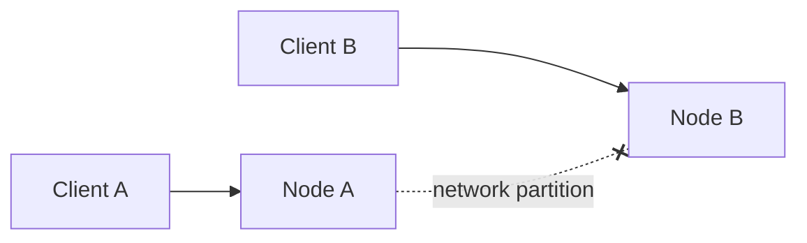
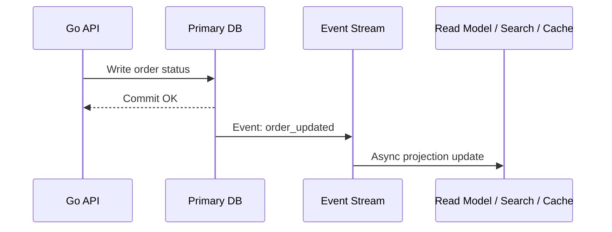

# CAP BASE And Distributed Consistency

`CAP` и `BASE` помогают обсуждать distributed storage и микросервисные системы, где данные живут на нескольких узлах, в нескольких регионах или между несколькими сервисами.

## Содержание

- [Главная идея](#главная-идея)
- [CAP простыми словами](#cap-простыми-словами)
- [Consistency в CAP](#consistency-в-cap)
- [Availability](#availability)
- [Partition tolerance](#partition-tolerance)
- [Почему нельзя выбрать все три](#почему-нельзя-выбрать-все-три)
- [CP и AP на практике](#cp-и-ap-на-практике)
- [BASE](#base)
- [Eventual consistency](#eventual-consistency)
- [Case: профиль пользователя](#case-профиль-пользователя)
- [Case: лайки и счетчики](#case-лайки-и-счетчики)
- [Case: платежи и заказы](#case-платежи-и-заказы)
- [Типичные ошибки](#типичные-ошибки)
- [Interview-ready answer](#interview-ready-answer)

## Главная идея

В одной БД на одном primary node проще рассуждать о транзакциях. В distributed system появляется проблема: узлы могут временно не видеть друг друга.

Причины:
- network partition;
- packet loss;
- restart node;
- overloaded node;
- межрегиональная latency;
- split-brain;
- replica lag.

Когда связь между узлами нарушена, система должна выбрать:
- продолжать отвечать, рискуя вернуть/принять не самое свежее состояние;
- отказать части запросов, сохранив строгую согласованность.

Это и есть практический смысл `CAP`.

## CAP простыми словами

| Буква | Что означает | Вопрос для backend-разработчика |
| --- | --- | --- |
| `C` - Consistency | Каждый read видит последнюю успешную write-операцию или ошибку | Можно ли показать пользователю старое значение? |
| `A` - Availability | Каждый запрос к живому узлу получает неошибочный ответ | Можно ли отказать запросу ради корректности? |
| `P` - Partition tolerance | Система продолжает жить при потере связи между узлами | Что делаем, когда узлы не могут синхронизироваться? |

В реальных распределенных системах `P` обычно нельзя "не выбрать": сеть ненадежна. Поэтому практический выбор чаще звучит как `CP` vs `AP` при partition.

## Consistency в CAP

`Consistency` в `CAP` - это не "данные валидны по constraints". Это ближе к linearizability: после успешной записи последующее чтение должно видеть эту запись, даже если запрос попал на другой узел.

Пример:
- пользователь изменил email;
- write прошел на узле A;
- следующий read попал на узел B;
- если B еще не получил update, он вернет старый email.

С точки зрения `CAP C` это нарушение strong consistency.

Важно не путать:

| Контекст | Consistency означает |
| --- | --- |
| `ACID` | Транзакция сохраняет инварианты и constraints |
| `CAP` | Узлы распределенной системы согласованы по видимому значению |

## Availability

`Availability` в CAP означает: если узел жив, он должен отвечать на запросы.

Но это не равно "99.99% uptime" из SLA. SLA availability - операционная метрика. CAP availability - свойство поведения при partition.

AP-система может принять запись локально, даже если не видит часть кластера.

Плюсы:
- меньше отказов для клиента;
- можно продолжать работу при деградации сети;
- хорошо для eventually consistent сценариев.

Минусы:
- возможны конфликты;
- разные клиенты временно видят разные данные;
- нужны reconciliation и conflict resolution.

## Partition tolerance

Partition tolerance означает: система учитывает, что связь между частями кластера может пропасть.

Пример partition:



Если `Client A` пишет `x=1` в `Node A`, а `Client B` читает `x` из `Node B`, система должна выбрать поведение.

CP-подход:
- `Node B` не уверен, что у него свежие данные;
- read/write может быть отклонен;
- consistency сохраняется, availability страдает.

AP-подход:
- `Node B` отвечает локальным состоянием;
- availability сохраняется;
- consistency временно страдает.

## Почему нельзя выбрать все три

Во время partition узел не может одновременно:
- гарантировать, что видит последнюю запись с другой стороны partition;
- отвечать на каждый запрос;
- продолжать работать несмотря на разрыв сети.

Мини-сценарий:
- `Node A` и `Node B` потеряли связь;
- клиент пишет `balance = 100` в `Node A`;
- другой клиент читает `balance` из `Node B`.

Чтобы сохранить consistency, `Node B` должен не отвечать или пойти к `Node A`, но сети нет. Значит availability нарушается.

Чтобы сохранить availability, `Node B` должен ответить, но он может вернуть старое значение. Значит consistency нарушается.

## CP и AP на практике

| Подход | Что выбирает при partition | Где подходит | Риск |
| --- | --- | --- | --- |
| `CP` | Лучше отказать, чем принять/показать некорректные данные | платежи, инвентарь, уникальные usernames, лидерство в кластере | выше latency и error rate при деградации |
| `AP` | Лучше ответить, даже если данные временно расходятся | лайки, просмотры, feed, presence, telemetry | stale reads, conflicts, reconciliation |

Примеры систем условно:
- PostgreSQL primary with sync replication ближе к CP для конкретной write path;
- Cassandra часто настраивают как AP/PA-EL style систему с tunable consistency;
- Dynamo-style key-value stores часто выбирают availability и eventual consistency;
- Redis replica reads дают latency, но могут быть stale.

Осторожно: нельзя навсегда приклеить ярлык `CP` или `AP` к продукту без конфигурации. Реальное поведение зависит от replication mode, quorum settings, read/write consistency level, topology и client routing.

## BASE

`BASE` часто противопоставляют `ACID`, но это не "анти-ACID". Это стиль проектирования систем, где допускается eventual consistency.

`BASE`:
- `Basically Available` - система старается отвечать даже при частичных сбоях;
- `Soft state` - состояние может временно меняться без прямого пользовательского write из-за replication/reconciliation;
- `Eventually consistent` - если новые writes прекратятся, replicas со временем сойдутся к одному состоянию.

BASE хорошо подходит, когда бизнес допускает временную рассинхронизацию.

Примеры:
- счетчик просмотров видео;
- количество лайков;
- recommendation feed;
- online presence;
- search index;
- read model для аналитики;
- cache.

BASE плохо подходит для инвариантов:
- "не списать деньги дважды";
- "не продать больше билетов, чем есть";
- "username уникален";
- "у заказа один финальный successful payment".

## Eventual consistency

Eventual consistency означает: система может временно показывать разные значения, но при отсутствии новых изменений должна сойтись.

Типичный flow:



После `Commit OK` primary уже содержит новое состояние. Но read model, search index или cache обновятся позже.

Вопрос не в том, "плохо ли это". Вопрос:
- сколько stale data допустимо;
- видит ли пользователь собственную запись сразу;
- есть ли reconciliation;
- что делать при потере event;
- есть ли idempotent consumers;
- какие операции требуют strong read.

Практические техники:
- read-your-writes: после write читать с primary или из session-local state;
- monotonic reads: пользователь не должен видеть откат во времени;
- idempotent event handlers;
- versioning;
- outbox;
- background reconciliation;
- TTL и invalidation для cache.

## Case: профиль пользователя

Сценарий:
- пользователь меняет имя профиля;
- имя показывается в профиле, комментариях, поиске и feed.

Решение:
- primary user record обновляется транзакционно;
- профиль пользователя читает primary или strongly consistent read model;
- feed/search обновляются async.

Trade-off:
- профиль должен показать новое имя сразу;
- старые комментарии/feed могут обновиться через секунды;
- это обычно приемлемо, потому что не нарушает финансовый или security-инвариант.

Interview answer:

```text
Я бы сделал source of truth для профиля strongly consistent, а денормализованные read models обновлял async через events. Для собственного профиля после update читал бы primary/read-your-writes, а для feed допустил бы небольшую eventual consistency.
```

## Case: лайки и счетчики

Счетчик лайков обычно не требует строгой согласованности на каждом read.

Возможный подход:
- write события `user_liked_post`;
- защитить уникальность `(user_id, post_id)`;
- счетчик обновлять async или батчами;
- периодически сверять счетчик с фактическими лайками.

Почему так:
- пользователю важнее быстро нажать like;
- счетчик `101` вместо `102` на пару секунд обычно приемлем;
- strong global counter может стать bottleneck.

Но есть нюанс:
- если like влияет на выдачу награды, оплату или лимит, это уже не просто счетчик;
- тогда нужен более строгий источник истины.

## Case: платежи и заказы

Платежи почти всегда требуют сильных гарантий на write path.

Критичные инварианты:
- не создать два successful payment на один order;
- не потерять событие об успешной оплате;
- retry от клиента/provider не должен удвоить списание;
- состояние заказа должно быть восстановимо.

Здесь нельзя просто сказать "eventual consistency норм".

Практический подход:
- idempotency key для provider/client requests;
- unique constraints;
- DB transaction для order/payment/outbox;
- async publish после commit;
- consumers должны быть idempotent;
- reconciliation job сверяет provider и локальные payments.

Это сочетание:
- strong consistency внутри bounded context платежа;
- eventual consistency между сервисами и read models.

## Типичные ошибки

Ошибка: "CAP говорит, что можно выбрать только две буквы всегда".

Точнее:
- trade-off проявляется при partition;
- в отсутствие partition система может давать и consistency, и availability;
- но дизайн должен иметь поведение на случай partition.

Ошибка: "Eventual consistency значит данные когда-нибудь сами исправятся".

Нет:
- нужны reliable events;
- нужны retries;
- нужны idempotent consumers;
- нужен reconciliation;
- нужна стратегия conflict resolution.

Ошибка: "AP всегда лучше для high availability".

Не всегда:
- для денег, лимитов, уникальности и inventory AP может принять конфликтующие writes;
- потом conflict resolution может быть бизнес-невозможным.

Ошибка: "CP всегда безопаснее".

Не всегда:
- если сценарий допускает stale data, CP может дать лишние отказы и ухудшить UX;
- для counters/feed/search часто лучше eventual consistency.

## Interview-ready answer

`CAP` описывает выбор распределенной системы при network partition: либо сохранять strong consistency и иногда отказывать запросам, либо сохранять availability и временно принимать stale/conflicting state. `BASE` - это подход, где система остается basically available, допускает soft state и сходится eventually. На практике я сначала определяю инвариант: платежи, уникальность и inventory требуют CP-like поведения на write path, а лайки, feed, search и аналитические read models обычно можно делать eventually consistent с retries, idempotency и reconciliation.
