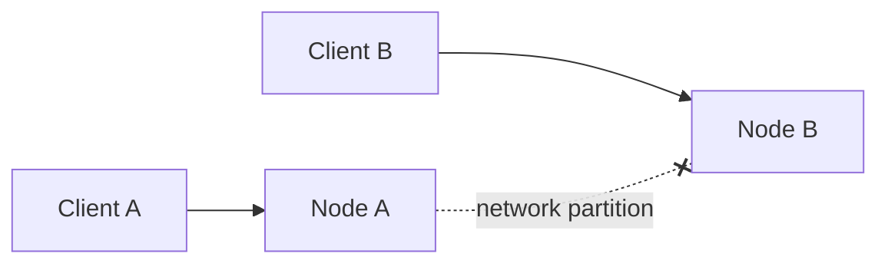
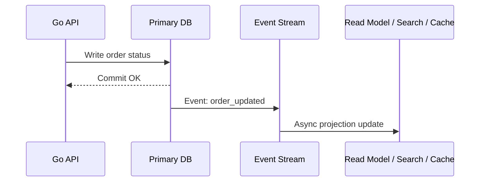

# CAP, BASE и распределённая консистентность

`CAP` и `BASE` помогают обсуждать distributed storage и микросервисные системы, где данные живут на нескольких узлах, в нескольких регионах или между несколькими сервисами.

## Содержание

- [Главная идея](#главная-идея)
- [CAP простыми словами](#cap-простыми-словами)
- [Consistency в CAP](#consistency-в-cap)
- [Availability](#availability)
- [Partition tolerance](#partition-tolerance)
- [Почему нельзя выбрать все три](#почему-нельзя-выбрать-все-три)
- [CP и AP на практике](#cp-и-ap-на-практике)
- [PACELC: что происходит без partition](#pacelc-что-происходит-без-partition)
- [BASE](#base)
- [Eventual consistency](#eventual-consistency)
- [Case: профиль пользователя](#case-профиль-пользователя)
- [Case: лайки и счетчики](#case-лайки-и-счетчики)
- [Case: платежи и заказы](#case-платежи-и-заказы)
- [Типичные ошибки](#типичные-ошибки)
- [Interview-ready answer](#interview-ready-answer)

## Главная идея

В одной БД на одном primary node проще рассуждать о транзакциях. В распределённой системе появляется проблема: узлы могут временно не видеть друг друга — network partition. Причины: сеть рвётся физически, теряются пакеты, узел перезагружается, или узел настолько перегружен, что не отвечает вовремя — для остальных это неотличимо от разрыва сети. Крайний случай — split-brain: кластер распадается на две части, каждая из которых считает себя рабочей.

(Replica lag — не partition: это штатное отставание асинхронной реплики. Но для читателя эффект похож — старые данные, поэтому обсуждается рядом.)

Когда связь между узлами нарушена, система должна выбрать:

- продолжать отвечать, рискуя вернуть/принять не самое свежее состояние;
- отказать части запросов, сохранив строгую согласованность.

Это и есть практический смысл `CAP`.

## CAP простыми словами

| Буква | Что означает | Вопрос для backend-разработчика |
| --- | --- | --- |
| `C` — Consistency | Каждый read видит последнюю успешную write-операцию или ошибку | Можно ли показать пользователю старое значение? |
| `A` — Availability | Каждый запрос к живому узлу получает неошибочный ответ | Можно ли отказать запросу ради корректности? |
| `P` — Partition tolerance | Система продолжает жить при потере связи между узлами | Что делаем, когда узлы не могут синхронизироваться? |

В реальных распределённых системах `P` нельзя «не выбрать»: сеть ненадёжна. Поэтому практический выбор звучит как `CP` vs `AP` **при partition**.

## Consistency в CAP

`Consistency` в `CAP` — это не «данные валидны по constraints». Это **linearizability** (линеаризуемость): после того как запись завершилась, любое последующее чтение — по реальному времени, на любом узле — обязано вернуть это или более новое значение. Система ведёт себя так, как будто копия данных одна, а все операции происходят мгновенно в какой-то момент между началом и концом вызова.

Пример нарушения: пользователь изменил email → write прошёл на узле A → следующий read попал на узел B → B ещё не получил update и вернул старый email.

Важно не путать:

| Контекст | Consistency означает |
| --- | --- |
| `ACID` | Транзакция сохраняет инварианты и constraints (см. [01-acid.md](./01-acid.md)) |
| `CAP` | Узлы распределённой системы согласованы по видимому значению |

## Availability

`Availability` в CAP означает: если узел жив, он должен отвечать на запросы.

Это не равно «99.99% uptime» из SLA: SLA availability — операционная метрика, CAP availability — свойство поведения при partition.

AP-система может принять запись локально, даже если не видит часть кластера. Клиент получает меньше отказов и работа продолжается при деградации сети — но возможны конфликты записей, разные клиенты временно видят разные данные, и нужны reconciliation и conflict resolution.

## Partition tolerance

Partition tolerance означает: система учитывает, что связь между частями кластера может пропасть.


```mermaid
flowchart LR
    ClientA[Client A] --> NodeA[Node A]
    ClientB[Client B] --> NodeB[Node B]
    NodeA -. network partition .-x NodeB
```

Если `Client A` пишет `x=1` в `Node A`, а `Client B` читает `x` из `Node B`, система должна выбрать поведение:

- **CP-подход**: `Node B` не уверен, что у него свежие данные → read/write отклоняется; consistency сохраняется, availability страдает.
- **AP-подход**: `Node B` отвечает локальным состоянием; availability сохраняется, consistency временно страдает.

## Почему нельзя выбрать все три

Во время partition узел не может одновременно: гарантировать, что видит последнюю запись с другой стороны partition; отвечать на каждый запрос; продолжать работать несмотря на разрыв сети.

Мини-сценарий: `Node A` и `Node B` потеряли связь; клиент пишет `balance = 100` в `Node A`; другой клиент читает `balance` из `Node B`.

Чтобы сохранить consistency, `Node B` должен не отвечать или сходить к `Node A` — но сети нет. Значит, страдает availability. Чтобы сохранить availability, `Node B` должен ответить — но, возможно, старым значением. Значит, страдает consistency.

## CP и AP на практике

| Подход | Что выбирает при partition | Где подходит | Риск |
| --- | --- | --- | --- |
| `CP` | Лучше отказать, чем принять/показать некорректные данные | платежи, инвентарь, уникальные usernames, лидерство в кластере | выше latency и error rate при деградации |
| `AP` | Лучше ответить, даже если данные временно расходятся | лайки, просмотры, feed, presence, telemetry | stale reads, conflicts, reconciliation |

Примеры систем (условно):

- PostgreSQL primary с синхронной репликацией ближе к CP для конкретного write path ([06-replication.md](../database-systems-catalog/postgresql/06-replication.md));
- [Cassandra](../database-systems-catalog/05-cassandra.md) обычно настраивают в сторону availability с tunable consistency (кворумы на чтение/запись);
- Dynamo-style key-value stores выбирают availability и eventual consistency;
- чтение с Redis-реплик быстрое, но может быть stale.

Осторожно: нельзя навсегда приклеить ярлык `CP` или `AP` к продукту без учёта конфигурации. Реальное поведение зависит от replication mode, quorum settings, consistency level на чтение/запись, топологии и client routing.

## PACELC: что происходит без partition

`CAP` описывает только момент partition, но trade-off существует и в спокойное время. Это фиксирует **PACELC**: **P**artition → выбор **A**vailability vs **C**onsistency; **E**lse (сети всё хорошо) → выбор **L**atency vs **C**onsistency.

Смысл второй половины: строгая согласованность стоит latency даже без сбоев — синхронная репликация задерживает каждый commit до подтверждения репликами, кворумное чтение ходит на несколько узлов. Поэтому системы описывают парой:

| Система (типичная конфигурация) | При partition | Без partition |
| --- | --- | --- |
| Dynamo-style, Cassandra | PA — отвечаем | EL — быстрее, допускаем stale |
| PostgreSQL с sync-репликацией, etcd/ZooKeeper | PC — отказываем | EC — платим latency за согласованность |

На собеседовании PACELC полезен как ответ на «а что, если partition нет?»: выбор между скоростью и согласованностью никуда не исчезает, он просто меняет форму.

## BASE

`BASE` часто противопоставляют `ACID`, но это не «анти-ACID», а стиль проектирования систем, где допускается eventual consistency:

- `Basically Available` — система старается отвечать даже при частичных сбоях;
- `Soft state` — состояние может временно меняться без прямого пользовательского write, из-за replication/reconciliation;
- `Eventually consistent` — если новые writes прекратятся, реплики со временем сойдутся к одному состоянию.

BASE подходит, когда бизнес допускает временную рассинхронизацию: счётчик просмотров, лайки, recommendation feed, online presence, search index, аналитические read models, кэши.

BASE не подходит для инвариантов: «не списать деньги дважды», «не продать больше билетов, чем есть», «username уникален», «у заказа один финальный successful payment».

## Eventual consistency

Eventual consistency означает: система может временно показывать разные значения, но при отсутствии новых изменений должна сойтись.

Типичный flow:


```mermaid
sequenceDiagram
    participant API as Go API
    participant Primary as Primary DB
    participant Queue as Event Stream
    participant ReadModel as Read Model / Search / Cache

    API->>Primary: Write order status
    Primary-->>API: Commit OK
    Primary->>Queue: Event: order_updated
    Queue->>ReadModel: Async projection update
```

После `Commit OK` primary уже содержит новое состояние, но read model, search index или cache обновятся позже.

Вопрос не в том, «плохо ли это», а в конкретике: сколько stale data допустимо; видит ли пользователь собственную запись сразу; есть ли reconciliation; что происходит при потере события; идемпотентны ли consumers; какие операции требуют strong read.

Практические техники:

- **read-your-writes** — после write читать с primary или из session-local state;
- **monotonic reads** — пользователь не должен видеть «откат во времени» между запросами;
- идемпотентные event handlers ([06-idempotency.md](../../05-system-design/reliability-patterns/06-idempotency.md));
- outbox для надёжной публикации событий ([06-outbox-idempotency-and-payment-flow.md](../relational-databases-and-sql/06-outbox-idempotency-and-payment-flow.md));
- versioning, background reconciliation, TTL и invalidation для кэшей.

## Case: профиль пользователя

Сценарий: пользователь меняет имя профиля; имя показывается в профиле, комментариях, поиске и feed.

Решение: primary user record обновляется транзакционно; собственный профиль читает primary или strongly consistent read model; feed/search обновляются асинхронно.

Trade-off: профиль должен показать новое имя сразу; старые комментарии и feed могут обновиться через секунды — это приемлемо, потому что не нарушает финансовый или security-инвариант.

Interview answer:

```text
Я бы сделал source of truth для профиля strongly consistent, а денормализованные read models обновлял async через events. Для собственного профиля после update читал бы primary/read-your-writes, а для feed допустил бы небольшую eventual consistency.
```

## Case: лайки и счетчики

Счётчик лайков обычно не требует строгой согласованности на каждый read.

Подход: писать событие `user_liked_post`; защитить уникальность `(user_id, post_id)`; счётчик обновлять async или батчами; периодически сверять счётчик с фактическими лайками.

Почему так: пользователю важнее быстро нажать like; счётчик `101` вместо `102` на пару секунд приемлем; строгий глобальный counter на горячем посте становится bottleneck-ом.

Нюанс: если like влияет на выплату, награду или лимит — это уже не просто счётчик, нужен строгий источник истины и audit trail.

## Case: платежи и заказы

Платежи почти всегда требуют сильных гарантий на write path. Критичные инварианты: не создать два successful payment на один order; не потерять событие об успешной оплате; retry от клиента/provider не должен удвоить списание; состояние заказа должно быть восстановимо.

Здесь нельзя сказать «eventual consistency норм». Практический подход:

- idempotency key для provider/client requests;
- unique constraints;
- DB-транзакция для order/payment/outbox;
- async publish после commit; consumers идемпотентны;
- reconciliation job сверяет provider и локальные payments.

Это сочетание: **strong consistency внутри bounded context платежа + eventual consistency между сервисами и read models**. Подробный разбор — [06-outbox-idempotency-and-payment-flow.md](../relational-databases-and-sql/06-outbox-idempotency-and-payment-flow.md).

## Типичные ошибки

**«CAP говорит, что всегда можно выбрать только две буквы».** Точнее: trade-off проявляется при partition. Без partition система может давать и consistency, и availability (а платит latency — см. PACELC), но дизайн обязан определить поведение на случай partition.

**«Eventual consistency значит, данные когда-нибудь сами исправятся».** Нет: нужны надёжная доставка событий, retries, идемпотентные consumers, reconciliation и стратегия conflict resolution. «Сами» данные не сходятся.

**«AP всегда лучше для high availability».** Для денег, лимитов, уникальности и inventory AP может принять конфликтующие writes, и conflict resolution потом окажется бизнес-невозможным («кому из двоих продали последний билет?»).

**«CP всегда безопаснее».** Если сценарий допускает stale data, CP даёт лишние отказы и ухудшает UX; для counters/feed/search обычно лучше eventual consistency.

## Interview-ready answer

**1. Что такое CAP?**

- Выбор распределённой системы при network partition: либо сохранять strong consistency и иногда отказывать запросам (CP), либо сохранять availability и временно принимать stale/conflicting state (AP). Вне partition trade-off не исчезает — см. PACELC.

**2. Что такое BASE?**

- Подход, где система остаётся basically available, допускает soft state и сходится eventually. Это не «анти-ACID», а осознанное ослабление согласованности для сценариев, где бизнес его допускает: счётчики, feed, search, read models.

**3. Что добавляет PACELC?**

- При partition — выбор availability vs consistency; else (без partition) — выбор latency vs consistency: синхронная репликация и кворумы стоят времени на каждом запросе. Dynamo/Cassandra — PA/EL, PostgreSQL с sync-репликацией и etcd — PC/EC.

**4. Как выбирать между strong и eventual consistency?**

- От инварианта: платежи, уникальность, inventory требуют CP-like поведения на write path; лайки, feed, search и аналитические read models можно делать eventually consistent с retries, idempotency и reconciliation.
