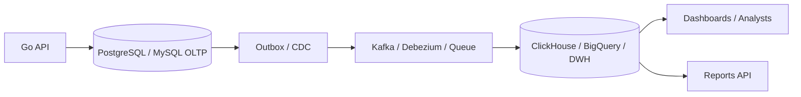

# OLTP OLAP And Workload Patterns

`OLTP` и `OLAP` описывают разные типы нагрузки на данные. Для backend-разработчика это важно, потому что одна и та же база редко одинаково хороша для транзакций, пользовательских запросов и тяжелой аналитики.

## Содержание

- [Коротко](#коротко)
- [OLTP](#oltp)
- [OLAP](#olap)
- [Сравнение OLTP и OLAP](#сравнение-oltp-и-olap)
- [Row-oriented vs column-oriented storage](#row-oriented-vs-column-oriented-storage)
- [Почему тяжелая аналитика мешает production OLTP](#почему-тяжелая-аналитика-мешает-production-oltp)
- [Типовая архитектура](#типовая-архитектура)
- [Case: отчет по заказам](#case-отчет-по-заказам)
- [Case: продуктовая аналитика](#case-продуктовая-аналитика)
- [HTAP](#htap)
- [Что выбирать](#что-выбирать)
- [Типичные ошибки](#типичные-ошибки)
- [Interview-ready answer](#interview-ready-answer)

## Коротко

`OLTP` - online transaction processing. Это нагрузка от пользовательских операций: создать заказ, оплатить, изменить профиль, забронировать товар.

`OLAP` - online analytical processing. Это нагрузка от аналитики: агрегировать продажи по дням, считать retention, строить dashboard, искать anomalies по миллиардам событий.

Главная разница: `OLTP` оптимизирован для большого числа коротких точечных операций, а `OLAP` - для тяжелых чтений, сканов и агрегаций по большим объемам.

## OLTP

Типичные свойства:
- много коротких reads/writes;
- низкая latency;
- строгие constraints;
- транзакции;
- частые point lookups по primary key/index;
- небольшие result sets;
- важна конкуренция и isolation;
- schema часто нормализована.

Примеры:
- API заказов;
- платежи;
- аккаунты пользователей;
- корзина;
- inventory;
- биллинг;
- internal admin operations, которые меняют состояние.

Пример запроса:

```sql
SELECT id, status, total_amount
FROM orders
WHERE id = $1 AND user_id = $2;
```

Пример write path:

```sql
BEGIN;

UPDATE inventory
SET reserved = reserved + 1
WHERE sku = $1 AND available - reserved >= 1;

INSERT INTO orders(user_id, status, total_amount)
VALUES ($2, 'created', $3);

COMMIT;
```

Для OLTP обычно важнее:
- правильные индексы;
- короткие транзакции;
- connection pool sizing;
- lock contention;
- predictable latency;
- backup/recovery;
- migration safety.

## OLAP

Типичные свойства:
- большие scans;
- агрегаты;
- группировки;
- фильтрация по времени/измерениям;
- меньше writes, но writes могут идти батчами или streaming ingestion;
- result может быть небольшим, но обработанный объем огромный;
- schema часто денормализована;
- допустима задержка доставки данных.

Примеры:
- dashboard продаж;
- fraud analytics;
- product metrics;
- observability events;
- cohort analysis;
- BI reports;
- ad-hoc queries аналитиков.

Пример запроса:

```sql
SELECT
    toDate(created_at) AS day,
    country,
    count(*) AS orders,
    sum(total_amount) AS revenue
FROM orders_events
WHERE created_at >= now() - INTERVAL 30 DAY
GROUP BY day, country
ORDER BY day, country;
```

Для OLAP обычно важнее:
- columnar storage;
- compression;
- partitioning by time;
- distributed scans;
- materialized views;
- ingestion pipeline;
- data freshness SLA;
- cost control.

## Сравнение OLTP и OLAP

| Критерий | OLTP | OLAP |
| --- | --- | --- |
| Основная цель | Обслуживать бизнес-операции | Анализировать большие объемы данных |
| Запросы | Короткие, точечные | Длинные, агрегирующие |
| Writes | Частые, маленькие | Батчи или поток событий |
| Reads | По ключам и индексам | Сканы по колонкам и периодам |
| Latency | Миллисекунды-десятки мс | Секунды иногда приемлемы |
| Consistency | Обычно строгая | Часто eventual freshness |
| Schema | Нормализованная | Денормализованная/star schema/event tables |
| Storage | Row-oriented часто удобнее | Column-oriented часто эффективнее |
| Примеры БД | PostgreSQL, MySQL | ClickHouse, BigQuery, Snowflake, Redshift |
| Риск | Locks, pool exhaustion, deadlocks | Дорогие scans, ingestion lag, неверные агрегаты |

## Row-oriented vs column-oriented storage

Row-oriented storage хранит строки рядом.

Условная таблица:

```text
order_id | user_id | country | amount | created_at
1        | 10      | GE      | 100    | 2026-04-01
2        | 11      | US      | 200    | 2026-04-01
```

Row-oriented удобно, когда нужно быстро получить всю строку по ключу:

```sql
SELECT *
FROM orders
WHERE id = $1;
```

Column-oriented storage хранит значения одной колонки рядом. Это удобно, когда запрос читает несколько колонок из огромной таблицы:

```sql
SELECT country, sum(amount)
FROM orders_events
WHERE created_at >= '2026-04-01'
GROUP BY country;
```

Почему columnar быстрее для аналитики:
- читает только нужные колонки;
- лучше сжимает однотипные значения;
- эффективнее векторизует агрегации;
- хорошо работает с partition pruning.

Почему columnar не всегда хорош для OLTP:
- point update одной строки может быть дорогим;
- транзакционные гарантии могут быть слабее или дороже;
- частые маленькие writes хуже, чем батчи;
- constraints и foreign keys могут быть не такими удобными.

## Почему тяжелая аналитика мешает production OLTP

Если BI dashboard запускает тяжелый запрос в production PostgreSQL:

```sql
SELECT customer_id, sum(total_amount)
FROM orders
WHERE created_at >= now() - interval '1 year'
GROUP BY customer_id
ORDER BY sum(total_amount) DESC
LIMIT 100;
```

Проблемы:
- запрос читает много страниц;
- давит на disk IO и buffer cache;
- конкурирует за CPU;
- может создавать temp files;
- может держать snapshots и мешать vacuum;
- может занять connections;
- p95/p99 latency API растет.

Даже если запрос только читает, он не бесплатный.

Практические варианты:
- replica для тяжелых reads;
- отдельное DWH/OLAP хранилище;
- precomputed aggregates;
- materialized views;
- ETL/ELT pipeline;
- лимиты и query timeouts;
- отдельный pool/user для аналитики.

## Типовая архитектура



Идея:
- OLTP остается source of truth для бизнес-операций;
- изменения уходят через outbox/CDC/events;
- OLAP получает денормализованные события или факты;
- dashboard и тяжелые отчеты не нагружают production transaction DB.

Trade-off:
- OLTP path остается быстрым и надежным;
- OLAP данные обновляются с задержкой;
- появляется pipeline, который надо мониторить;
- нужны схемы событий, backfill и reconciliation.

## Case: отчет по заказам

Требование:
- в админке показать revenue by day за последние 12 месяцев;
- фильтры: страна, payment method, product category;
- данные могут отставать на 5 минут.

Плохое решение:
- каждый раз агрегировать production `orders` и `order_items` в OLTP БД;
- дать аналитикам доступ к primary;
- не ограничить query timeout.

Лучшее решение:
- сохранять order facts в OLAP;
- partition by date;
- делать materialized aggregate для частых dashboard queries;
- показывать freshness timestamp;
- держать source of truth в OLTP.

Interview answer:

```text
Для такого отчета я бы не нагружал primary OLTP. Если допустима задержка 5 минут, отправлял бы order events через outbox/CDC в OLAP, например ClickHouse, и строил dashboard по денормализованной fact table. OLTP остается для транзакций, OLAP - для тяжелых агрегатов.
```

## Case: продуктовая аналитика

Требование:
- считать funnel: opened_app -> viewed_product -> added_to_cart -> paid;
- событий много;
- часть событий приходит с мобильных клиентов с задержкой;
- аналитика нужна по дням, странам, версиям приложения.

Подход:
- события писать в event pipeline;
- в OLAP хранить append-only event table;
- использовать event time и ingestion time;
- учитывать late events;
- строить агрегаты отдельно от user-facing transaction tables.

Важный нюанс:
- продуктовая аналитика может быть eventually consistent;
- но если на этих событиях строится биллинг партнера, требования к точности и reconciliation становятся жестче.

## HTAP

`HTAP` - hybrid transaction/analytical processing. Идея: одна платформа пытается обслуживать и transaction workload, и analytics workload.

Плюсы:
- меньше pipeline complexity;
- свежее аналитическое представление;
- проще стартовать.

Минусы:
- сложнее предсказать latency;
- может быть дороже;
- не всегда заменяет специализированный DWH;
- operational модель зависит от конкретного продукта.

Практический взгляд:
- для небольшого проекта PostgreSQL с read replica/materialized views может быть достаточно;
- при росте объема событий и ad-hoc аналитики обычно появляется отдельный OLAP контур;
- HTAP стоит оценивать через реальные query patterns, freshness SLA и стоимость эксплуатации.

## Что выбирать

Выбор зависит от вопросов:
- это user-facing write path или отчет?
- нужен ли strict transaction invariant?
- какой объем данных читает запрос?
- сколько stale data допустимо?
- какая p95/p99 latency нужна?
- кто будет писать запросы: backend, analysts, BI users?
- сколько стоит отдельный pipeline?
- есть ли команда, которая умеет сопровождать OLAP?

Простое правило:
- если операция меняет критичное бизнес-состояние - думать как OLTP;
- если операция агрегирует много исторических данных - думать как OLAP;
- если нужно и то и другое - разделить source of truth и read/analytics model.

## Типичные ошибки

Ошибка: "PostgreSQL умеет SQL, значит OLAP не нужен".

Почему неполно:
- PostgreSQL отлично подходит для многих отчетов на умеренных объемах;
- но тяжелые аналитические scans могут конкурировать с user-facing OLTP;
- columnar OLAP часто дешевле и быстрее на больших агрегатах.

Ошибка: "ClickHouse быстрый, значит можно заменить им основную БД заказов".

Почему опасно:
- ClickHouse хорош для аналитики и append-heavy workloads;
- но для классических транзакций, row-level constraints и частых маленьких updates обычно лучше OLTP БД.

Ошибка: "Данные в dashboard должны быть абсолютно свежими".

Нужно уточнить:
- какой freshness SLA реально нужен;
- что случится, если dashboard отстанет на 1-5 минут;
- какие метрики являются операционными и требуют near-real-time;
- какие являются аналитическими и терпят задержку.

## Interview-ready answer

`OLTP` - это короткие транзакционные операции с низкой latency и строгими инвариантами: заказы, платежи, пользователи, inventory. `OLAP` - это тяжелые аналитические запросы, scans и агрегаты по большим объемам данных. Для senior backend важно не смешивать эти нагрузки бездумно: production OLTP должен оставаться быстрым source of truth, а отчеты и dashboards часто лучше выносить в replica, materialized views или отдельное columnar OLAP хранилище через outbox/CDC/event pipeline.
