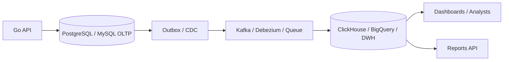

# OLTP vs OLAP

`OLTP` и `OLAP` описывают разные типы нагрузки на данные. Для backend-разработчика это важно, потому что одна и та же база редко одинаково хороша для транзакций, пользовательских запросов и тяжёлой аналитики.

## Содержание

- [Коротко](#коротко)
- [OLTP](#oltp)
- [OLAP](#olap)
- [Сравнение OLTP и OLAP](#сравнение-oltp-и-olap)
- [Row-oriented vs column-oriented storage](#row-oriented-vs-column-oriented-storage)
- [Почему тяжелая аналитика мешает production OLTP](#почему-тяжелая-аналитика-мешает-production-oltp)
- [Типовая архитектура](#типовая-архитектура)
- [Case: отчет по заказам](#case-отчет-по-заказам)
- [Case: продуктовая аналитика](#case-продуктовая-аналитика)
- [HTAP](#htap)
- [Что выбирать](#что-выбирать)
- [Типичные ошибки](#типичные-ошибки)
- [Interview-ready answer](#interview-ready-answer)

## Коротко

`OLTP` — online transaction processing: нагрузка от пользовательских операций. Создать заказ, оплатить, изменить профиль, забронировать товар.

`OLAP` — online analytical processing: нагрузка от аналитики. Агрегировать продажи по дням, считать retention, строить dashboard, искать аномалии по миллиардам событий.

Главная разница: `OLTP` оптимизирован для большого числа коротких точечных операций, `OLAP` — для тяжёлых чтений, сканов и агрегаций по большим объёмам.

## OLTP

Типичные свойства: много коротких reads/writes с низкой latency; строгие constraints и транзакции; частые point lookups по primary key/индексу; небольшие result sets; важна конкуренция и isolation; схема обычно нормализована.

Примеры: API заказов, платежи, аккаунты пользователей, корзина, inventory, биллинг.

Пример запроса:

```sql
SELECT id, status, total_amount
FROM orders
WHERE id = $1 AND user_id = $2;
```

Пример write path:

```sql
BEGIN;

UPDATE inventory
SET reserved = reserved + 1
WHERE sku = $1 AND available - reserved >= 1;

INSERT INTO orders(user_id, status, total_amount)
VALUES ($2, 'created', $3);

COMMIT;
```

Что обычно определяет качество OLTP-эксплуатации: правильные индексы, короткие транзакции, connection pool sizing ([09-connection-pooling.md](../database-systems-catalog/postgresql/09-connection-pooling.md)), lock contention, предсказуемая latency, backup/recovery и безопасные миграции ([migrations-in-go.md](../migrations/migrations-in-go.md)).

## OLAP

Типичные свойства: большие сканы, агрегаты, группировки, фильтрация по времени и измерениям; writes идут батчами или streaming ingestion; result может быть маленьким, но обработанный объём огромный; схема денормализована; допустима задержка доставки данных.

Примеры: dashboard продаж, fraud analytics, product metrics, observability events, cohort analysis, BI-отчёты, ad-hoc запросы аналитиков.

Пример запроса (ClickHouse):

```sql
SELECT
    toDate(created_at) AS day,
    country,
    count(*) AS orders,
    sum(total_amount) AS revenue
FROM orders_events
WHERE created_at >= now() - INTERVAL 30 DAY
GROUP BY day, country
ORDER BY day, country;
```

Что обычно определяет качество OLAP-контура: columnar storage и compression, партиционирование по времени, распределённые сканы, materialized views, ingestion pipeline, freshness SLA и контроль стоимости.

## Сравнение OLTP и OLAP

| Критерий | OLTP | OLAP |
| --- | --- | --- |
| Основная цель | Обслуживать бизнес-операции | Анализировать большие объёмы данных |
| Запросы | Короткие, точечные | Длинные, агрегирующие |
| Writes | Частые, маленькие | Батчи или поток событий |
| Reads | По ключам и индексам | Сканы по колонкам и периодам |
| Latency | Миллисекунды — десятки мс | Секунды иногда приемлемы |
| Consistency | Обычно строгая | Часто eventual freshness |
| Schema | Нормализованная | Денормализованная / star schema / event tables |
| Storage | Row-oriented чаще удобнее | Column-oriented чаще эффективнее |
| Примеры БД | PostgreSQL, MySQL | [ClickHouse](../database-systems-catalog/06-clickhouse.md), BigQuery, Snowflake, Redshift |
| Риск | Locks, pool exhaustion, deadlocks | Дорогие сканы, ingestion lag, неверные агрегаты |

Сводное сравнение конкретных СУБД — [01-comparison-table.md](../database-systems-catalog/01-comparison-table.md).

## Row-oriented vs column-oriented storage

Условная таблица:

```text
order_id | user_id | country | amount | created_at
1        | 10      | GE      | 100    | 2026-04-01
2        | 11      | US      | 200    | 2026-04-01
```

Физически на диске она может лежать двумя способами:

```text
Row-oriented: строки целиком, одна за другой
[1 | 10 | GE | 100 | 2026-04-01] [2 | 11 | US | 200 | 2026-04-01] ...

Column-oriented: каждая колонка — отдельный блок/файл
order_id:   1, 2, ...
user_id:    10, 11, ...
country:    GE, US, ...
amount:     100, 200, ...
created_at: 2026-04-01, 2026-04-01, ...
```

Row-oriented удобен, когда нужна вся строка по ключу — она читается одним обращением:

```sql
SELECT *
FROM orders
WHERE id = $1;
```

Column-oriented удобен, когда запрос читает пару колонок из огромной таблицы — из пяти колонок читаются только две, остальные не трогаются вовсе:

```sql
SELECT country, sum(amount)
FROM orders_events
WHERE created_at >= '2026-04-01'
GROUP BY country;
```

Почему columnar быстрее для аналитики: читает только нужные колонки; однотипные значения рядом отлично сжимаются (колонка `country` из миллионов повторяющихся кодов стран сожмётся в разы сильнее, чем пёстрые строки); агрегации векторизуются; хорошо работает partition pruning.

Почему columnar плох для OLTP: point update одной строки требует трогать все колоночные блоки; транзакционные гарантии слабее или дороже; частые маленькие writes хуже батчей; constraints и foreign keys обычно урезаны.

## Почему тяжелая аналитика мешает production OLTP

Если BI dashboard запускает тяжёлый запрос в production PostgreSQL:

```sql
SELECT customer_id, sum(total_amount)
FROM orders
WHERE created_at >= now() - interval '1 year'
GROUP BY customer_id
ORDER BY sum(total_amount) DESC
LIMIT 100;
```

Даже «только читающий» запрос не бесплатен: он вычитывает много страниц и вымывает buffer cache, конкурирует за CPU и disk I/O, может создавать temp files, держит snapshot и мешает vacuum ([01-mvcc-and-vacuum.md](../database-systems-catalog/postgresql/01-mvcc-and-vacuum.md)), занимает connections из пула — в итоге растёт p95/p99 latency пользовательского API.

Практические варианты: реплика для тяжёлых reads ([06-replication.md](../database-systems-catalog/postgresql/06-replication.md)), отдельное DWH/OLAP-хранилище, precomputed aggregates и materialized views, ETL/ELT pipeline, лимиты и query timeouts, отдельный pool/user для аналитики.

## Типовая архитектура


```mermaid
flowchart LR
    API[Go API] --> OLTP[(PostgreSQL / MySQL OLTP)]
    OLTP --> Outbox[Outbox / CDC]
    Outbox --> Stream[Kafka / Debezium / Queue]
    Stream --> OLAP[(ClickHouse / BigQuery / DWH)]
    OLAP --> BI[Dashboards / Analysts]
    OLAP --> Reports[Reports API]
```

Идея: OLTP остаётся source of truth для бизнес-операций; изменения уходят через outbox/CDC/events ([14-outbox-and-idempotency.md](../database-systems-catalog/postgresql/14-outbox-and-idempotency.md)); OLAP получает денормализованные события или факты; dashboards и тяжёлые отчёты не нагружают production transaction DB.

Trade-off: OLTP path остаётся быстрым и надёжным, но OLAP-данные обновляются с задержкой, появляется pipeline, который надо мониторить, и нужны схемы событий, backfill и reconciliation.

## Case: отчет по заказам

Требование: в админке показать revenue by day за последние 12 месяцев; фильтры — страна, payment method, product category; данные могут отставать на 5 минут.

Плохое решение: каждый раз агрегировать production `orders` и `order_items` в OLTP БД, дать аналитикам доступ к primary, не ограничить query timeout.

Лучшее решение: сохранять order facts в OLAP; партиционировать по дате; собрать materialized aggregate для частых dashboard-запросов; показывать freshness timestamp; source of truth остаётся в OLTP.

Interview answer:

```text
Для такого отчета я бы не нагружал primary OLTP. Если допустима задержка 5 минут, отправлял бы order events через outbox/CDC в OLAP, например ClickHouse, и строил dashboard по денормализованной fact table. OLTP остается для транзакций, OLAP — для тяжелых агрегатов.
```

## Case: продуктовая аналитика

Требование: считать funnel `opened_app -> viewed_product -> added_to_cart -> paid`; событий много; часть приходит с мобильных клиентов с задержкой; аналитика нужна по дням, странам, версиям приложения.

Подход: события писать в event pipeline; в OLAP хранить append-only event table; различать event time и ingestion time; учитывать late events; строить агрегаты отдельно от user-facing transaction tables.

Важный нюанс: продуктовая аналитика может быть eventually consistent, но если на этих же событиях строится биллинг партнёра — требования к точности и reconciliation становятся жёстче.

## HTAP

`HTAP` — hybrid transaction/analytical processing: одна платформа пытается обслуживать и transaction workload, и analytics workload. Примеры: TiDB (TiKV для транзакций + TiFlash с колоночными репликами), SingleStore, AlloyDB (row store + columnar engine); в экосистеме PostgreSQL похожую роль играют расширения вроде Citus columnar и TimescaleDB.

Плюсы: меньше pipeline complexity, свежее аналитическое представление, проще стартовать. Минусы: сложнее предсказать latency, может быть дороже, не всегда заменяет специализированный DWH, operational-модель зависит от конкретного продукта.

Практический взгляд: для небольшого проекта PostgreSQL с read replica и materialized views достаточно; при росте объёма событий и ad-hoc аналитики обычно появляется отдельный OLAP-контур; HTAP оценивается через реальные query patterns, freshness SLA и стоимость эксплуатации.

## Что выбирать

Выбор зависит от вопросов: это user-facing write path или отчёт? нужен ли строгий транзакционный инвариант? какой объём данных читает запрос? сколько stale data допустимо? какая p95/p99 latency нужна? кто пишет запросы — backend, аналитики, BI-пользователи? сколько стоит отдельный pipeline и есть ли команда его сопровождать?

Простое правило:

- операция меняет критичное бизнес-состояние → думать как OLTP;
- операция агрегирует много исторических данных → думать как OLAP;
- нужно и то и другое → разделить source of truth и read/analytics model.

## Типичные ошибки

**«PostgreSQL умеет SQL, значит OLAP не нужен».** PostgreSQL отлично подходит для многих отчётов на умеренных объёмах, но тяжёлые аналитические сканы конкурируют с user-facing OLTP, а columnar OLAP на больших агрегатах дешевле и быстрее.

**«ClickHouse быстрый, значит можно заменить им основную БД заказов».** ClickHouse хорош для аналитики и append-heavy workloads, но для классических транзакций, row-level constraints и частых маленьких updates нужна OLTP БД.

**«Данные в dashboard должны быть абсолютно свежими».** Сначала уточнить: какой freshness SLA реально нужен; что случится, если dashboard отстанет на 1–5 минут; какие метрики операционные (near-real-time), а какие аналитические (терпят задержку).

## Interview-ready answer

**1. Чем OLTP отличается от OLAP?**

- `OLTP` — короткие транзакционные операции с низкой latency и строгими инвариантами: заказы, платежи, пользователи, inventory. `OLAP` — тяжёлые аналитические запросы, сканы и агрегаты по большим объёмам. Разные нагрузки → разное хранение: row-oriented для точечных операций, column-oriented для агрегаций.

**2. Почему аналитику не гоняют в production OLTP?**

- Тяжёлые сканы конкурируют с пользовательскими запросами за CPU, disk I/O, buffer cache и connections, держат snapshot и мешают vacuum — растёт p95/p99 latency API. Отчёты выносятся в реплику, materialized views или отдельное columnar-хранилище через outbox/CDC/event pipeline; OLTP остаётся быстрым source of truth.

**3. Почему columnar быстрее для аналитики?**

- Читаются только нужные колонки, однотипные значения рядом сильно сжимаются, агрегации векторизуются. Обратная сторона: point update и частые маленькие writes дороги — поэтому columnar не заменяет OLTP БД.
