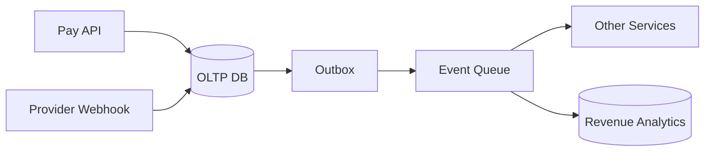

# Interview Cases And Trade Offs

Этот файл помогает тренироваться отвечать на вопросы, где нужно применить `ACID`, `CAP`, `BASE`, `OLTP` и `OLAP` к конкретным backend-сценариям.

## Содержание

- [Как разбирать кейс](#как-разбирать-кейс)
- [Case 1: оплата заказа](#case-1-оплата-заказа)
- [Case 2: бронирование последнего билета](#case-2-бронирование-последнего-билета)
- [Case 3: username uniqueness](#case-3-username-uniqueness)
- [Case 4: корзина интернет-магазина](#case-4-корзина-интернет-магазина)
- [Case 5: лента и лайки](#case-5-лента-и-лайки)
- [Case 6: search index](#case-6-search-index)
- [Case 7: аналитический dashboard](#case-7-аналитический-dashboard)
- [Case 8: multi-region read latency](#case-8-multi-region-read-latency)
- [Сводная таблица решений](#сводная-таблица-решений)
- [Короткие interview drills](#короткие-interview-drills)
- [Interview-ready answer](#interview-ready-answer)

## Как разбирать кейс

Хорошая структура ответа:

1. Назвать инвариант.
2. Определить source of truth.
3. Выбрать transactional boundary.
4. Сказать, где допустима eventual consistency.
5. Назвать риски: race conditions, stale reads, duplicate requests, replica lag.
6. Назвать защиту: constraints, locks, idempotency, retries, outbox, reconciliation.
7. Отдельно объяснить read path и analytics path.

Мини-шаблон:

```text
Для этого кейса критичный инвариант - ...
Source of truth я бы держал в ...
Write path должен быть strong/transactional, потому что ...
Read model/search/dashboard может быть eventually consistent, потому что ...
Для надежности нужны ...
```

## Case 1: оплата заказа

Сценарий:
- пользователь нажимает "Pay";
- запрос может повториться из-за retry;
- payment provider может прислать webhook дважды;
- после успешной оплаты нужно отправить событие другим сервисам.

Критичные инварианты:
- один order не должен иметь два successful payment;
- повторный webhook не должен повторно менять состояние;
- событие `payment_succeeded` не должно потеряться после commit.

Выбор:
- `ACID` внутри payment/order boundary;
- `CP-like` write path для финального состояния платежа;
- `BASE/eventual consistency` для доставки события в другие сервисы;
- `OLTP` для orders/payments;
- `OLAP` только для отчетов по revenue.

Практическая защита:
- `UNIQUE (order_id)` для successful payment или partial unique index;
- `UNIQUE (provider_payment_id)`;
- idempotency key;
- транзакция `order + payment + outbox`;
- idempotent consumers;
- reconciliation с provider API.

Упрощенная схема:



Interview-ready:

```text
Оплата - это strong consistency на write path. Я бы защищал инвариант "один успешный платеж на заказ" через unique constraint и idempotency key. В одной транзакции обновил бы order, payment и outbox. Публикацию события сделал бы async через outbox, поэтому другие сервисы могут увидеть оплату с задержкой, но событие не потеряется.
```

## Case 2: бронирование последнего билета

Сценарий:
- осталось 1 место;
- два пользователя одновременно пытаются купить билет;
- нельзя продать 2 билета.

Критичный инвариант:
- количество проданных/зарезервированных билетов не может превысить capacity.

Выбор:
- `ACID` transaction;
- atomic conditional update или row lock;
- `CP-like` поведение: лучше отказать, чем oversell;
- `OLTP`.

Пример atomic update:

```sql
UPDATE events
SET reserved = reserved + 1
WHERE id = $1
  AND reserved < capacity;
```

Если `rows affected = 0`, мест нет.

Trade-offs:
- atomic update простой и быстрый;
- row lock удобен, если нужно проверить больше условий;
- при высокой конкуренции один hot row может стать bottleneck;
- можно разделить inventory на buckets, но усложнится точность;
- waitlist может улучшить UX без нарушения инварианта.

Interview-ready:

```text
Для последнего билета eventual consistency недопустима на write path, потому что oversell потом трудно компенсировать. Я бы делал conditional update в OLTP БД или lock строки события в короткой транзакции. При высокой конкуренции думал бы о sharded counters/buckets, но финальный commit все равно должен защищать capacity.
```

## Case 3: username uniqueness

Сценарий:
- usernames должны быть уникальны;
- два пользователя одновременно выбирают одно имя;
- UI может заранее показать "available".

Критичный инвариант:
- в source of truth не может быть двух одинаковых usernames.

Выбор:
- `UNIQUE` constraint в OLTP БД;
- UI availability check только предварительный;
- финальное решение принимает insert/update;
- при конфликте возвращаем понятную ошибку.

Пример:

```sql
CREATE UNIQUE INDEX users_username_lower_uq
ON users (lower(username));
```

Trade-offs:
- strong uniqueness может требовать routing на single authority или consensus в multi-region;
- локальные региональные writes без координации могут создать конфликт;
- если username критичен глобально, AP-подход опасен.

Interview-ready:

```text
Проверка "username available" в UI не гарантирует уникальность, это только hint. Инвариант должен защищаться unique index в source of truth. В multi-region системе нужно решить, где находится authority для username, иначе AP writes в разных регионах могут принять один и тот же username.
```

## Case 4: корзина интернет-магазина

Сценарий:
- пользователь добавляет товары в корзину;
- корзина должна быстро открываться;
- потеря одной промежуточной версии неприятна, но не всегда критична;
- цена и наличие должны проверяться на checkout.

Инварианты:
- cart item quantity не должна быть отрицательной;
- checkout не должен опираться только на старую корзину;
- финальная цена/stock проверяются в order transaction.

Выбор:
- корзина может быть в Redis/document DB/SQL в зависимости от продукта;
- eventual consistency иногда допустима для read model;
- checkout должен перейти в strong OLTP flow;
- inventory reservation защищается отдельно.

Trade-offs:
- Redis быстрый, но нужно думать о persistence/TTL;
- SQL проще для consistency и history;
- document model удобен для изменяемого cart shape;
- если корзина влияет на legal price guarantee, требования становятся строже.

Interview-ready:

```text
Корзина обычно менее критична, чем checkout. Я могу хранить ее в быстром key-value/document storage, но на checkout заново проверю цену, доступность и создам заказ в OLTP транзакции. То есть cart read path может быть relaxed, а order creation и inventory reservation - strong.
```

## Case 5: лента и лайки

Сценарий:
- пользователь ставит лайк;
- счетчик должен обновиться быстро;
- лента денормализована;
- небольшая задержка счетчика допустима.

Инварианты:
- один пользователь не должен лайкнуть один пост дважды;
- счетчик должен со временем сходиться с фактическими лайками.

Выбор:
- source of truth для like relation с unique `(user_id, post_id)`;
- счетчики и feed projections eventually consistent;
- async events;
- periodic reconciliation.

Пример:

```sql
CREATE TABLE post_likes (
    post_id BIGINT NOT NULL,
    user_id BIGINT NOT NULL,
    created_at TIMESTAMPTZ NOT NULL DEFAULT now(),
    PRIMARY KEY (post_id, user_id)
);
```

Trade-offs:
- strong counter на hot post может стать bottleneck;
- approximate/eventual counter обычно приемлем;
- если лайки влияют на выплату денег, нужен audit trail и строгая сверка.

Interview-ready:

```text
Для лайков я бы строго защищал только отношение user-post через unique key. Счетчики и feed можно обновлять eventually consistent через события, потому что временно устаревшее число лайков обычно приемлемо. Нужны idempotent consumers и reconciliation, чтобы счетчик сходился.
```

## Case 6: search index

Сценарий:
- пользователь обновил товар;
- товар должен находиться в поиске;
- search index обновляется отдельно от primary DB.

Критичный вопрос:
- search - это source of truth или read model?

Обычно:
- source of truth в OLTP/document DB;
- search index - eventually consistent projection;
- update идет через CDC/outbox/events;
- при рассинхронизации можно reindex.

Trade-offs:
- search index дает быстрый full-text/faceted search;
- данные могут отставать;
- удаление/скрытие sensitive content может требовать более строгого SLA;
- нужен backfill и monitoring lag.

Interview-ready:

```text
Search index я обычно считаю read model, а не source of truth. Primary DB хранит товар, а Elasticsearch/OpenSearch обновляется async через события или CDC. Нужно принять freshness SLA, мониторить lag и иметь reindex/backfill. Для sensitive deletes требования строже: возможно, нужен synchronous delete или блокировка показа на primary side.
```

## Case 7: аналитический dashboard

Сценарий:
- бизнес хочет revenue, conversion, active users;
- запросы тяжелые;
- dashboard открывают менеджеры и аналитики;
- задержка 5-15 минут допустима.

Выбор:
- OLTP primary не должен обслуживать тяжелую аналитику;
- events/CDC в OLAP;
- materialized aggregates для популярных графиков;
- freshness indicator;
- отдельные quotas/timeouts для ad-hoc queries.

Trade-offs:
- отдельный OLAP контур усложняет инфраструктуру;
- зато защищает production API latency;
- данные могут отставать;
- нужно следить за pipeline lag и quality checks.

Interview-ready:

```text
Если dashboard допускает задержку, я бы вынес его из primary OLTP. Через outbox/CDC отправлял бы факты в OLAP, строил агрегаты и показывал freshness. Так production транзакции не конкурируют с тяжелыми scans, а аналитика получает подходящую columnar модель.
```

## Case 8: multi-region read latency

Сценарий:
- пользователи в Европе и США;
- нужно быстро читать профиль;
- writes редкие;
- после изменения профиля пользователь ожидает увидеть новое значение.

Варианты:
- single primary region + read replicas;
- multi-primary;
- regional cache;
- global database with tunable consistency.

Trade-offs:
- read replicas снижают latency, но дают replica lag;
- single primary проще для conflicts, но writes из дальнего региона медленнее;
- multi-primary улучшает локальные writes, но усложняет conflict resolution;
- для read-your-writes можно читать primary после update или хранить session marker/version.

Interview-ready:

```text
Для профиля я бы разделил обычные reads и read-after-write. Глобальные read replicas/caches дают низкую latency, но после update пользователя нужно обеспечить read-your-writes: читать primary, ждать replication position или использовать session version. Multi-primary стоит брать только если команда готова к conflict resolution.
```

## Сводная таблица решений

| Кейс | Strong consistency нужна где | Eventual consistency допустима где | Частые техники |
| --- | --- | --- | --- |
| Оплата | order/payment write path | уведомления, аналитика, read models | transaction, unique, idempotency, outbox |
| Последний билет | inventory reservation | dashboard availability | conditional update, locks, retries |
| Username | final username claim | UI availability hint, search | unique index, authority region |
| Корзина | checkout/order creation | cart read sync, recommendations | TTL/cache, validation on checkout |
| Лайки | user-post uniqueness | counters, feed | unique key, events, reconciliation |
| Search | primary DB write | search index | outbox/CDC, reindex, lag monitoring |
| Dashboard | source facts correctness | aggregates freshness | OLAP, materialized views, backfill |
| Multi-region profile | source profile update | remote replicas/cache | primary read, session consistency |

## Короткие interview drills

Вопрос: "Можно ли использовать eventual consistency для платежей?"

Ответ:

```text
Для финального состояния платежа - нет, нужен strong write path: idempotency, unique constraints, transaction. Но распространение события об оплате в другие сервисы может быть eventually consistent через outbox и idempotent consumers.
```

Вопрос: "Почему нельзя просто читать отчеты из production PostgreSQL?"

Ответ:

```text
Можно на малых объемах и с лимитами, но тяжелые агрегаты конкурируют с OLTP за CPU, IO, cache и connections. Если отчеты регулярные и большие, лучше replica/materialized views или отдельный OLAP pipeline.
```

Вопрос: "Что делать, если replica вернула старые данные после записи?"

Ответ:

```text
Это replica lag. Для read-after-write нужно читать primary, использовать session consistency, ждать replication position или временно направлять пользователя на consistent read path после write.
```

Вопрос: "CAP значит, что PostgreSQL не может быть consistent и available?"

Ответ:

```text
CAP обсуждает distributed behavior при partition. Обычный single-primary PostgreSQL может быть consistent и available пока нет partition/сбоя, но если replicas или multi-region writes участвуют в запросах, нужно явно выбрать поведение при сетевых проблемах.
```

## Interview-ready answer

На собеседовании я бы не отвечал аббревиатурами отдельно. Я бы начал с инварианта и workload: платежи, inventory и username требуют strong consistency на OLTP write path; ленты, лайки, search и dashboards часто можно строить как eventually consistent read models. `ACID` помогает внутри транзакционной границы, `CAP` объясняет выбор при partition, `BASE` описывает relaxed/read-model подход, а `OLTP` и `OLAP` помогают не смешивать транзакционные операции с тяжелой аналитикой.
