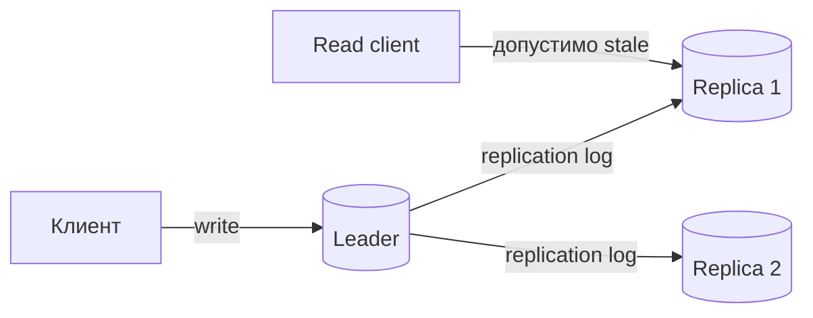
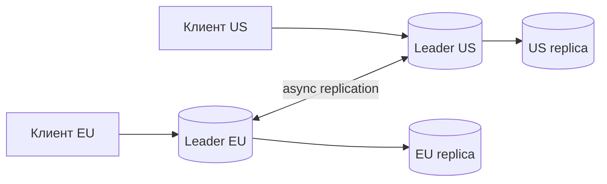

# Модели репликации: single-leader, multi-leader и leaderless

## Содержание

- [Зачем нужна репликация](#зачем-нужна-репликация)
- [Ментальная модель](#ментальная-модель)
- [Single-leader replication](#single-leader-replication)
- [Синхронная и асинхронная доставка](#синхронная-и-асинхронная-доставка)
- [Чтение с реплик и аномалии](#чтение-с-реплик-и-аномалии)
- [Failover, split-brain и fencing](#failover-split-brain-и-fencing)
- [Multi-leader replication](#multi-leader-replication)
- [Топологии multi-leader](#топологии-multi-leader)
- [Leaderless replication и кворумы](#leaderless-replication-и-кворумы)
- [Восстановление расхождений](#восстановление-расхождений)
- [Разрешение конфликтов](#разрешение-конфликтов)
- [Как выбирать модель](#как-выбирать-модель)
- [Наблюдаемость и эксплуатация](#наблюдаемость-и-эксплуатация)
- [Типичные ошибки](#типичные-ошибки)
- [Interview-ready answer](#interview-ready-answer)
- [Связанные материалы](#связанные-материалы)

Репликация хранит несколько копий данных на разных узлах. Она помогает переживать
отказы, приближать чтения к пользователям и распределять read-нагрузку, но сама по
себе не отвечает на главный вопрос: какая копия считается актуальной, когда узлы
временно не могут договориться.

Три базовые модели дают разные ответы:

- `single-leader` — все записи упорядочивает один лидер;
- `multi-leader` — запись принимают несколько лидеров, а конфликты разрешаются
  при обмене изменениями;
- `leaderless` — клиент или координатор обращается сразу к нескольким репликам и
  использует кворумы и версии.

---

## Зачем нужна репликация

Репликация решает четыре практические задачи:

- **Надёжность.** После отказа диска или узла данные остаются на других узлах.
- **Доступность.** Другой узел продолжает обслуживать запросы, если это допускает
  выбранная модель согласованности.
- **Задержка.** Географически близкая реплика быстрее отвечает пользователю.
- **Пропускная способность чтения.** Read-only запросы можно распределить по
  нескольким копиям.

Она не умножает производительность записи автоматически. Если каждое изменение
должно попасть на три узла, суммарная работа хранилища, сети и дисков, наоборот,
возрастает. В single-leader системе один логический ключ всё равно проходит через
один лидер. В multi-leader и leaderless системах параллельные записи возможны, но
появляется цена разрешения конфликтов.

Перед выбором модели формулируют требования конкретно:

- можно ли после успешной записи временно увидеть старое значение;
- допустима ли потеря последних подтверждённых записей при аварии;
- что важнее во время сетевого разделения: ответить или не допустить расхождение;
- записывают ли один объект одновременно в нескольких регионах;
- можно ли автоматически объединить два изменения;
- какое время восстановления и какой объём потери данных допустимы.

Последний пункт удобно разделить на два показателя:

- `RTO` (`Recovery Time Objective`) — сколько времени сервис может
  восстанавливаться;
- `RPO` (`Recovery Point Objective`) — сколько последних данных допустимо
  потерять.

---

## Ментальная модель

Полезно разделять три события одной записи:

1. лидер или координатор принимает команду;
2. выбранное число реплик сохраняет изменение;
3. клиент получает успешный ответ.

Именно правило шага 2 определяет гарантии успешного ответа. Если лидер отвечает
до доставки на другие узлы, failover может потерять уже подтверждённую запись.
Если ответ ждёт удалённый кворум, растёт задержка, а потеря связи может сделать
запись недоступной.

```text
Client -> node A: SET balance = 900

node A: сохранено
node B: сохранено
node C: ещё не получил изменение

Вопрос: достаточно ли A, нужны A+B или нужны все A+B+C?
```

Кроме числа копий важен порядок версий. Реплики могут получить сообщения позже,
повторно или в другом порядке. Поэтому у записи обычно есть позиция в журнале,
версия, логические часы или другой маркер причинности.

**Репликация и партиционирование решают разные задачи.** Партиционирование
раскладывает разные ключи по узлам для capacity. Репликация создаёт несколько
копий одной партиции для надёжности и чтения. У шардированной БД обычно есть оба
уровня:

```text
shard 1: leader + replicas
shard 2: leader + replicas
shard 3: leader + replicas
```

---

## Single-leader replication

В модели с одним лидером (`single-leader`) все изменения конкретного набора
данных проходят через один узел. Последователи (`followers`, read replicas)
воспроизводят журнал лидера.



Главное преимущество — одно место задаёт порядок конкурирующих записей. Если два
клиента меняют один ключ, лидер сериализует операции согласно правилам БД. На
репликах не нужно объединять две независимо принятые версии.

Типичный write path выглядит так:

1. клиент направляет запись лидеру;
2. лидер добавляет изменение в локальный журнал;
3. журнал передаётся репликам;
4. лидер ждёт подтверждения по выбранной durability policy и фиксирует позицию;
5. лидер и реплики последовательно применяют журнал, а клиент получает ответ в
   определённый контрактом момент.

Конкретный порядок локального apply, отправки репликам и ответа зависит от
продукта. Важно не название режима, а после какого durable-события запись считается
успешной.

Модель хорошо подходит для OLTP, где большая часть изменений идёт в одном
регионе, а инварианты удобнее защищать транзакциями и ограничениями одной БД.

Цена выбора:

- запись зависит от доступности лидера;
- failover требует выбрать ровно одного нового лидера;
- удалённые writers платят межрегиональной задержкой;
- read replicas могут отставать;
- один горячий ключ не масштабируется добавлением read replicas.

---

## Синхронная и асинхронная доставка

**Асинхронная репликация** подтверждает запись после локальной фиксации на лидере,
не дожидаясь обязательного подтверждения реплики.

Преимущества:

- задержка записи близка к задержке лидера;
- временно медленная реплика не останавливает write path;
- удалённые регионы не добавляют межрегиональный RTT к каждому commit.

Недостаток — окно возможной потери. Пусть лидер подтвердил позиции журнала до
`105`, а реплика успела получить только до `102`. Если лидер безвозвратно потерян
и реплику повысили, записи `103..105` исчезают из нового состояния, хотя клиенты
видели успешный ответ.

**Синхронная репликация** отвечает после сохранения изменения требуемым числом
реплик. Это уменьшает RPO, но добавляет задержку и связывает доступность записи с
доступностью подтверждающих узлов.

```text
local fsync:                 3 ms
RTT до синхронной реплики:  20 ms
fsync реплики:               3 ms

упрощённая последовательная оценка commit latency:
3 + 20 + 3 = 26 ms
```

Эта сумма предполагает, что три шага лежат на критическом пути последовательно.
Это учебная модель, а не универсальный benchmark: протокол может передавать WAL
параллельно локальному fsync, group commit амортизирует часть работы, а RTT и
дисковая задержка имеют распределение. Практический вывод остаётся: удалённое
подтверждение попадает в latency write path.

Термин `semi-synchronous` у разных продуктов означает разное: подтверждение
получения в память, записи на диск или применения изменения. Поэтому на дизайне
нужно назвать конкретный момент durability, а не ограничиваться названием режима.

---

## Чтение с реплик и аномалии

Распределение чтений по followers помогает только запросам, которым допустима
задержка репликации. Для проверки остатка перед резервом, уникальности имени или
нового статуса платежа stale read может нарушить бизнес-решение.

### Read-after-write

Пользователь меняет имя на `Мария`, затем следующий запрос попадает на отстающую
реплику и видит старое имя `Маша`. Нарушается гарантия чтения своей записи
(`read-your-writes`).

Варианты защиты:

- после записи некоторое время направлять этого пользователя на leader;
- вернуть клиенту позицию журнала и читать с реплики только после того, как она
  достигла этой позиции;
- показать записанное значение из ответа, пока проекция догоняет;
- всегда читать критичный объект с leader.

### Monotonic reads

Первый запрос попал на replica A с позицией `120`, второй — на replica B с
позицией `117`. Пользователь сначала увидел новый статус, а затем старый, то есть
как будто вернулся во времени.

Защита — session affinity к одной реплике или передача минимально допустимой
позиции `>= 120` в следующий запрос.

### Consistent prefix

Если операция `B` причинно зависит от `A`, клиент не должен увидеть `B`, не увидев
`A`. Например, сначала создана тема, затем в неё добавлен комментарий. Разные
независимые журналы или проекции могут показать комментарий раньше темы.

Защита требует сохранять причинный порядок там, где он важен: держать связанные
события в одной партиции журнала, передавать версии зависимостей или строить
проекцию строго по позиции источника.

### Stale decision

Самая опасная аномалия возникает, когда старое чтение используется не для
отображения, а для изменения данных:

```text
replica показывает available = 1
клиент решает зарезервировать товар
leader уже хранит available = 0
```

Финальный conditional update на лидере обязан повторно проверить инвариант.
Replica read может быть подсказкой для интерфейса, но не доказательством права на
запись.

Метрика `replica lag = 2 seconds` тоже неоднозначна. Полезно наблюдать как минимум
две величины:

- отставание по времени или позиции журнала;
- объём неприменённого журнала в байтах.

Реплика может быть всего на секунду позади, но при всплеске записей эта секунда
содержит миллионы изменений.

---

## Failover, split-brain и fencing

Failover состоит не только из команды «повысить реплику». Система должна:

1. решить, что старый лидер больше не может безопасно писать;
2. выбрать кандидата с достаточно свежими данными;
3. выдать ему новый `epoch` или `term`;
4. переключить маршрутизацию клиентов;
5. не позволить старому лидеру продолжить внешние изменения.

**Split-brain** — ситуация, когда две стороны одновременно считают себя лидером.
Например, старый leader жив, но потерял связь с control plane. Новый leader уже
выбран, а старый всё ещё принимает трафик через устаревший маршрут.

Одного lease недостаточно, если старый процесс завис, проснулся после истечения
lease и успел обратиться к внешнему ресурсу. Нужен **fencing token** — монотонно
растущий номер эпохи, который проверяет сам защищаемый ресурс.

```text
leader A получил token = 41
leader B получил token = 42

storage принимает write(token = 42)
storage отвергает поздний write(token = 41)
```

Если downstream не проверяет token, это лишь диагностическое поле, а не fencing.
Для SQL роль эпохи может выполнять условие `WHERE owner_epoch < :new_epoch`, для
очереди или object storage понадобится собственный механизм авторизации записи.

В single-leader БД выборы обычно опираются на кворум или внешний consensus. Без
большинства автоматический failover опасен: две изолированные половины могут
независимо повысить реплики.

---

## Multi-leader replication

В модели `multi-leader` несколько узлов принимают записи, обычно по одному в
каждом регионе или дата-центре. Между лидерами изменения доставляются
асинхронно.



Модель полезна, когда:

- запись должна иметь локальную межрегиональную задержку;
- каждый регион должен продолжать ограниченную работу во время partition;
- источники естественно разделены, например отдельный магазин обновляет только
  собственный каталог;
- устройства работают offline и синхронизируются позже.

Два лидера могут принять изменения одной версии:

```text
исходное имя: "Анна"

EU leader: имя = "Anna"
US leader: имя = "Анна П."
```

После восстановления связи нельзя применить оба значения обычным порядком:
изменения конкурентны. Система должна предотвратить конфликт, сохранить обе
версии для merge или выбрать победителя.

Лучший конфликт — тот, который не создан. Практические способы:

- закрепить `user_id`, tenant или объект за домашним регионом для write;
- разрешить разные поля разным владельцам;
- использовать globally unique ID вместо локального auto-increment;
- сериализовать операции с жёстким инвариантом через один authority;
- моделировать действие как коммутативную операцию, например «добавить элемент»,
  а не «заменить весь список».

Multi-leader плохо подходит для глобальной уникальности, строгого неотрицательного
баланса и продажи последнего экземпляра без дополнительной координации. Два
региона не могут независимо гарантировать один глобальный остаток, если каждый не
имеет заранее выделенной квоты.

---

## Топологии multi-leader

Топология определяет путь изменения и способ пережить отказ.

| Топология | Механика | Преимущество | Цена |
| --- | --- | --- | --- |
| All-to-all | Каждый лидер отправляет изменения всем остальным | Короткий путь, нет промежуточного лидера | Число направленных связей растёт как `L × (L - 1)` |
| Кольцо | Каждый лидер передаёт следующему | Мало связей | Отказ или lag одного звена задерживает путь; нужен обход и дедупликация |
| Звезда | Локальные лидеры синхронизируются через центральный hub | Проще контролировать обмен | Hub становится bottleneck и доменом отказа |
| Дерево | Изменения идут через иерархию регионов | Удобно для большой географии | Больше задержка и сложнее поиск места расхождения |

Для `L = 5` лидеров all-to-all требует:

```text
направленных потоков = L × (L - 1)
                     = 5 × 4
                     = 20
```

Если считать недиректированные пары, их `L × (L - 1) / 2 = 10`. В эксплуатации
важны именно направленные потоки, потому что lag и ошибки наблюдаются отдельно в
каждую сторону.

При цепочке или кольце одно изменение может прийти к узлу несколькими путями.
Каждой операции нужен глобально уникальный ID, а consumer должен дедуплицировать
повтор. Иначе ретрансляция создаёт цикл.

Схема DDL и версия приложения требуют отдельного rollout-плана. Пока старый и
новый лидеры работают одновременно, каждый должен понимать формат реплицируемых
изменений. Multi-leader усложняет не только merge данных, но и миграции.

---

## Leaderless replication и кворумы

В leaderless-модели постоянного лидера нет. Координатор запроса отправляет
операцию нескольким репликам ключа и ждёт заданное число ответов.

Используют обозначения:

- `N` — число реплик ключа;
- `W` — сколько реплик должны подтвердить write;
- `R` — со скольких реплик нужно получить read.

Для `N = 3`, `W = 2`, `R = 2`:

```text
W + R = 2 + 2 = 4
N = 3
4 > 3
```

Любое множество из двух записавших и любое множество из двух прочитанных реплик
среди фиксированных трёх узлов пересекаются хотя бы в одной реплике.

```text
write acknowledgements: A, B
read responses:         B, C
intersection:           B
```

Два условия отвечают на разные вопросы:

- `W + R > N` заставляет обычный read quorum пересечься с обычным successful
  write quorum;
- `W > N / 2` заставляет два successful write quorums пересечься хотя бы на одной
  реплике.

В примере `W = 2`, а `N / 2 = 1.5`, поэтому выполнены оба условия. Пересечение
write quorums всё равно не сериализует два параллельных coordinator: общая
реплика может сохранить обе конкурентные версии, которые затем требуется
сравнить и разрешить.

Но формула `W + R > N` сама по себе не обещает линеаризуемость. Пересечение
помогает найти свежую версию, если одновременно выполняются дополнительные
условия:

- используется один фиксированный набор `N` реплик, а не `sloppy quorum` с
  временными заменами;
- read действительно сравнивает версии всех `R` ответов;
- версия позволяет отличить более новую запись от конкурентной;
- незавершённые конкурентные записи разрешаются по определённому правилу;
- изменения membership не создают непересекающиеся конфигурации;
- часы не используются как ненадёжное доказательство причинного порядка.

Например, при `sloppy quorum` запись во время отказа могла попасть на временные
узлы `D` и `E`, хотя домашние реплики ключа — `A`, `B`, `C`. Read с `A` и `B`
формально собирает `R = 2`, но не пересекается с фактическими подтверждениями.

Настройки показывают trade-off:

| `N/W/R` | Поведение | Основной риск |
| --- | --- | --- |
| `3/1/1` | Минимальная задержка, высокая доступность | Stale reads и потеря версии при отказе |
| `3/2/2` | Пересекающиеся обычные кворумы | Выше latency, без двух узлов операции недоступны |
| `3/3/1` | Write ждёт все копии, read дешёвый | Один недоступный узел блокирует write |
| `3/1/3` | Write дешёвый, read опрашивает все копии | Один недоступный узел блокирует read |

Кворум не обязан ждать самые быстрые узлы навсегда. Coordinator задаёт timeout;
медленные ответы становятся частью tail latency и могут привести к ошибке даже
при живых узлах.

---

## Восстановление расхождений

Leaderless-хранилище должно не только принять запрос, но и со временем вернуть
пропущенные копии в согласованное состояние.

### Hinted handoff

Если домашняя реплика недоступна, координатор временно хранит для неё подсказку
(`hint`) и позже пересылает изменение. Это повышает доступность кратковременных
сбоев, но hint имеет срок жизни и не заменяет полную сверку.

### Read repair

Во время read координатор получает версии `v7`, `v7`, `v5`, возвращает клиенту
`v7` и фоново обновляет отставшую реплику. Редко читаемые ключи могут оставаться
рассогласованными долго, поэтому одного read repair недостаточно.

### Anti-entropy

Фоновый процесс сравнивает диапазоны ключей, часто через дерево хешей, и передаёт
только различающиеся части. Это исправляет старые расхождения без полного обмена
всем набором данных.

### Tombstones

Удаление нельзя немедленно забыть. Если одна реплика была offline, физическое
исчезновение записи на доступных узлах выглядит для неё как отсутствие новой
версии. Старая копия после восстановления может «воскреснуть».

Поэтому удаление сначала записывается как версионированный tombstone. Его можно
собирать только после окна, в котором все реплики гарантированно получили delete
или прошли repair. Слишком ранний garbage collection создаёт zombie records;
слишком поздний увеличивает объём данных и стоимость compaction.

---

## Разрешение конфликтов

Конфликт — две версии, ни одна из которых не является известным продолжением
другой. Это отличается от обычного lag: отставшую версию заменяют известной более
новой, а две конкурентные версии требуют решения.

### Last-write-wins

`Last-write-wins` (`LWW`) выбирает версию с наибольшей меткой времени или другим
полным порядком.

Преимущества:

- хранится одно итоговое значение;
- merge дешёвый и детерминированный;
- подходит для данных, где потеря одного конкурентного изменения приемлема.

Недостатки:

- рассинхрон часов может сделать старую запись победителем;
- равные timestamp требуют дополнительного tie-breaker;
- одно из корректных параллельных действий тихо теряется;
- wall-clock timestamp не доказывает причинность.

LWW приемлем для «последнего выбранного цвета темы», но опасен для корзины, где
два устройства добавили разные товары.

### Vector clocks и version vectors

Термины близки, но не полностью взаимозаменяемы. Vector clock отслеживает
причинный контекст событий по участникам, а version vector обычно описывает
известные версии реплик конкретного объекта. В обоих случаях базовая идея видна
на одном примере: хранить, сколько изменений известно от каждого участника.

```text
начало:       {A: 1, B: 1}
A обновил:    {A: 2, B: 1}
B независимо: {A: 1, B: 2}
```

Ни один из двух последних векторов не покомпонентно больше другого, значит версии
конкурентны. После merge получится контекст `{A: 2, B: 2}`.

Вектор обнаруживает причинность, но не решает бизнес-конфликт. Система всё равно
должна сохранить siblings, вызвать application merge или применить структуру с
определённым правилом слияния. Кроме того, metadata растёт с числом участников;
на практике используют ограниченные контексты и специальные варианты версий.

### CRDT

`CRDT` (`Conflict-free Replicated Data Type`) задаёт операции или состояния,
которые сходятся без централизованного выбора победителя при выполнении условий
конкретного типа. У state-based CRDT merge должен быть ассоциативным,
коммутативным и идемпотентным. У operation-based CRDT требования переносятся на
доставку и представление операций: конкретному типу могут понадобиться причинный
порядок и дедупликация.

Примеры:

- grow-only counter — только увеличиваемый счётчик;
- PN-counter — отдельные компоненты увеличений и уменьшений;
- grow-only set — множество только с добавлением;
- observed-remove set — множество, где add/remove учитывают наблюдавшиеся теги;
- register — значение с явно выбранным правилом победителя.

CRDT не делает произвольную бизнес-модель бесконфликтной. Для инварианта
`balance >= 0` независимые уменьшения в двух регионах могут вместе уйти ниже
нуля. Нужна координация или заранее распределённые права расходования — escrow.

### Application-level merge

Приложение получает обе версии и объединяет их с учётом предметной области:

- корзина объединяет позиции по `product_id`, но отдельно решает количество;
- документ показывает пользователю конфликт редактирования;
- расписание не сливает два бронирования автоматически, а отклоняет одно;
- профиль может независимо объединить изменения разных полей.

Это наиболее осмысленный вариант и одновременно самый дорогой: нужны сохранение
siblings, идемпотентность, интерфейс разрешения и тесты на все сочетания операций.

Сравнение подходов:

| Подход | Сохраняет оба намерения | Требует знания домена | Основное ограничение |
| --- | --- | --- | --- |
| LWW | Нет | Почти нет | Тихая потеря одного изменения |
| Vector/version vector | Обнаруживает, но не объединяет | Для финального merge | Растущая metadata и siblings |
| CRDT | Да, для поддерживаемой семантики | При выборе типа | Не выражает произвольный инвариант |
| Application merge | Может | Да | Сложность кода и UX |

---

## Как выбирать модель

| Требование | Single-leader | Multi-leader | Leaderless |
| --- | --- | --- | --- |
| Один понятный порядок записей | Естественно | Только внутри одного лидера | Требуются версии и resolution |
| Локальная запись в нескольких регионах | Нет, если лидер один | Да | Да |
| Конфликты одного объекта | Обычно предотвращаются | Возможны | Возможны |
| Строгие глобальные инварианты | Проще всего у authority | Требуют координации или escrow | Требуют LWT/consensus или escrow |
| Чтение при частичном отказе | Leader или stale replica | Локальный лидер может ответить | Настраивается через `R` |
| Операционная сложность | Ниже | Высокая | Высокая |

### Платёж и остаток товара

Для финального списания или продажи последней единицы нужен один authority на
ключ либо consensus/LWT. Single-leader OLTP обычно проще: транзакция и constraint
защищают инвариант. Реплики обслуживают некритичные проекции, но не принимают
решение о списании.

### Профиль пользователя

Если пользователь обычно пишет из одного домашнего региона, подходит
single-leader на шард или multi-leader с write affinity. Разные поля можно
объединять, а read-your-writes обеспечивать маршрутизацией по позиции версии.

### Лайки и реакции

Добавление реакции естественно моделируется как множество с уникальным ключом
`(user_id, object_id, reaction)`. Асинхронная репликация и eventual counter часто
допустимы, а точный счётчик периодически сверяется с отношениями.

### Offline-first документ

Изменения неизбежно создаются без связи. Нужны идентификаторы операций,
причинный контекст и доменный merge либо специализированный CRDT. Single-leader
не избавляет от конфликта: offline-клиент сам становится временным независимым
источником изменений.

### Multi-region каталог

Если каждый продавец владеет своими товарами, данные можно разделить по владельцу
и избежать конфликтов. Если два региона редактируют одну карточку, требуется
field-level merge или единый домашний регион карточки.

Самое простое решение следует выбирать до active-active. Если write latency между
регионами укладывается в SLO, один leader на shard часто надёжнее и дешевле, чем
постоянная обработка конфликтов.

---

## Наблюдаемость и эксплуатация

Для любой модели нужны метрики не только доступности узлов, но и качества данных.

**Single-leader:**

- позиция журнала на leader и каждой replica;
- lag в секундах и байтах;
- время fsync и подтверждения синхронных реплик;
- число failover, длительность выборов и ошибки смены маршрута;
- stale reads после write;
- объём WAL, удерживаемого отстающей репликой.

**Multi-leader:**

- lag по каждой направленной связи;
- возраст самого старого недоставленного события;
- частота и типы конфликтов;
- размер очереди на merge;
- число отброшенных LWW-версий;
- версия схемы на каждом лидере.

**Leaderless:**

- latency и timeout по consistency level;
- число недоступных домашних реплик;
- накопленные hints и их возраст;
- read repair и anti-entropy backlog;
- число siblings и tombstones;
- доля запросов, где вернулась конфликтующая версия.

Алерт только `node down` недостаточен. Кластер может быть зелёным по процессам,
но часами отдавать старые данные из-за остановленного apply loop или заполненного
диска.

Chaos-тесты должны проверять наблюдаемое поведение:

1. разорвать связь между зонами;
2. продолжить разрешённые чтения и записи;
3. вернуть связь;
4. проверить сходимость и отсутствие потерянных подтверждённых операций;
5. измерить фактические RTO, RPO и максимальный stale interval.

---

## Типичные ошибки

### «Есть три реплики, значит запись надёжна»

Три процесса на одном физическом хосте или в одной зоне не переживают отказ этого
домена. Нужно размещение по независимым failure domains и понятная политика
подтверждения.

### «Read replica разгружает все чтения»

Критичные read-modify-write операции нельзя бездумно переносить на followers.
Предварительный read может быть stale, а инвариант всё равно проверяет leader в
атомарной операции.

### «`W + R > N` означает strong consistency»

Формула гарантирует пересечение обычных кворумов фиксированного replica set. Она
не решает concurrent writes, sloppy quorum, membership changes, некорректный
version resolution и lost update.

### «Timestamp определяет настоящее последнее изменение»

Wall clock на узлах расходится, может перескочить после синхронизации и не кодирует
причинность. LWW — выбранное правило потери конфликта, а не восстановление истины.

### «CRDT решает любой конфликт»

CRDT гарантирует сходимость конкретного типа данных. Он не обеспечивает
произвольную уникальность, лимит бюджета или неотрицательный остаток.

### «Автоматический failover всегда повышает доступность»

Failover без кворума и fencing может создать двух лидеров и повреждение данных.
Иногда безопаснее временно отклонить запись, чем автоматически повысить
непроверенную реплику.

### «Backup больше не нужен»

Реплика быстро копирует и полезные изменения, и ошибочный `DELETE`, повреждение
данных или действие злоумышленника. Нужны независимые backup, point-in-time
recovery и проверка восстановления.

---

## Interview-ready answer

**1. Чем отличаются три модели репликации?**

- Single-leader — один узел упорядочивает записи, а followers копируют журнал.
- Multi-leader — несколько лидеров принимают writes локально и затем разрешают
  конкурентные версии.
- Leaderless — coordinator обращается к нескольким репликам и использует
  кворумы, версии и repair.

**2. Как синхронность репликации влияет на систему?**

- Синхронный режим — уменьшает потерю подтверждённых записей, но добавляет сеть и
  диск реплик в commit latency.
- Асинхронный режим — быстрее и доступнее для write, но оставляет окно RPO при
  failover.
- Решение — выбирается по бизнес-цене потери, latency SLO и failure domains, а не
  по числу реплик само по себе.

**3. Какие аномалии появляются при чтении с follower?**

- Read-your-writes — пользователь может не увидеть только что записанное значение.
- Monotonic reads — переход между репликами может вернуть пользователя к старой
  версии.
- Stale decision — старое значение опасно, если на его основе принимается
  бизнес-решение без повторной атомарной проверки на leader.

**4. Что означает `N/W/R`?**

- `N` — число реплик ключа, `W` — число write acknowledgements, `R` — число read
  responses.
- Пересечение — при `W + R > N` обычные кворумы фиксированного набора имеют общую
  реплику.
- Ограничение — пересечение не даёт линеаризуемость без корректных версий,
  resolution, membership и обработки concurrency.

**5. Как разрешаются concurrent writes?**

- LWW — выбирает одного победителя и может тихо потерять корректное изменение.
- Vector clocks — обнаруживают причинность и конфликт, но не выполняют доменный
  merge.
- CRDT — автоматически сходится для заранее определённой семантики операций.
- Application merge — сохраняет бизнес-смысл, но требует самого сложного кода и
  UX.

**6. Как защищаться от split-brain?**

- Election — новый лидер выбирается только стороной с требуемым кворумом.
- Epoch — каждое лидерство получает монотонно растущий номер.
- Fencing — конечный ресурс отвергает операции со старым epoch; без проверки на
  ресурсе token не защищает.

**7. Когда выбирать single-leader?**

- Инварианты — важны транзакции, уникальность и единый порядок на ключ.
- География — write можно направлять в один регион без нарушения latency SLO.
- Простота — цена active-active конфликтов выше пользы локальной записи.

**8. Когда multi-leader или leaderless оправданы?**

- Multi-leader — запись нужна в нескольких регионах или offline, а конфликты можно
  предотвратить ownership-моделью либо осмысленно объединить.
- Leaderless — важны доступность и распределение запросов, а домен допускает
  eventual consistency и repair.
- Граница — глобальные жёсткие инварианты всё равно требуют authority, consensus
  или заранее распределённых квот.

---

## Связанные материалы

- [CAP, BASE и распределённая консистентность](./02-cap-and-base.md)
- [Consensus: Raft и Paxos](./06-consensus-raft-and-paxos.md)
- [PostgreSQL: репликация](../database-systems-catalog/postgresql/06-replication.md)
- [Cassandra: consistency, repair и LWT](../database-systems-catalog/05-cassandra.md)
- [Highload Design Patterns](../../05-system-design/highload-design-patterns.md)
- [Raft paper](https://raft.github.io/raft.pdf)
- [Amazon Dynamo paper](https://www.allthingsdistributed.com/files/amazon-dynamo-sosp2007.pdf)
