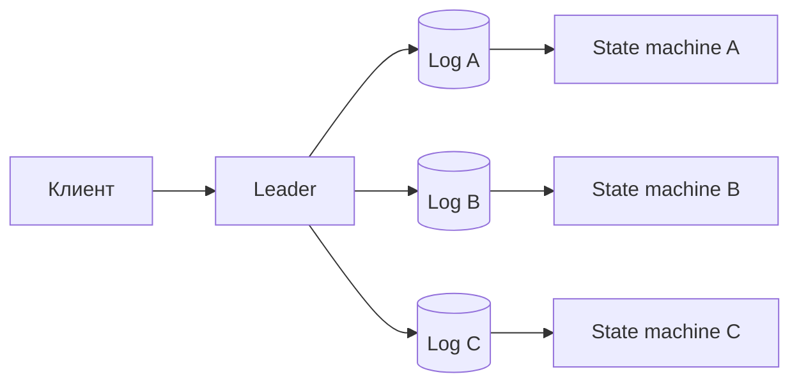
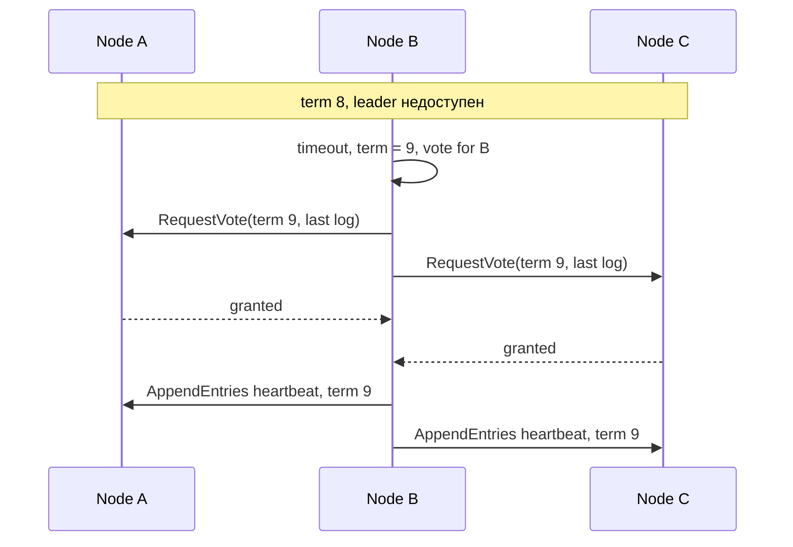

# Consensus: Raft и границы сравнения с Paxos

## Содержание

- [Какую проблему решает consensus](#какую-проблему-решает-consensus)
- [Модель replicated state machine](#модель-replicated-state-machine)
- [Предположения и границы гарантий](#предположения-и-границы-гарантий)
- [Роли и состояние Raft](#роли-и-состояние-raft)
- [Выборы лидера](#выборы-лидера)
- [Репликация журнала через AppendEntries](#репликация-журнала-через-appendentries)
- [Когда запись считается committed](#когда-запись-считается-committed)
- [Partition и старый лидер](#partition-и-старый-лидер)
- [Восстановление расходящегося журнала](#восстановление-расходящегося-журнала)
- [Linearizable reads](#linearizable-reads)
- [Snapshots и compaction](#snapshots-и-compaction)
- [Изменение состава кластера](#изменение-состава-кластера)
- [Paxos на уровне собеседования](#paxos-на-уровне-собеседования)
- [Consensus, replication, lock и Two-Phase Commit](#consensus-replication-lock-и-two-phase-commit)
- [Цена consensus и эксплуатация](#цена-consensus-и-эксплуатация)
- [Ошибки прикладного уровня](#ошибки-прикладного-уровня)
- [Типичные ошибки в объяснении](#типичные-ошибки-в-объяснении)
- [Interview-ready answer](#interview-ready-answer)
- [Связанные материалы](#связанные-материалы)

Consensus — это согласование одного решения или порядка решений между узлами,
которые могут падать и терять связь. Он нужен не для самого факта наличия копий,
а для ответа на более строгий вопрос: какое значение кластер считает выбранным,
если разные узлы видели разные сообщения.

Raft объясняет эту задачу через лидера и реплицируемый журнал. Paxos решает тот же
класс задачи через предложения и кворумы acceptors, но оставляет больше деталей
реализации за пределами базового алгоритма.

---

## Какую проблему решает consensus

Представим три узла конфигурационного хранилища. Нужно выбрать единственного
владельца задания:

```text
node A видит: worker-1
node B видит: worker-2
node C временно недоступен
```

Обычная асинхронная репликация не говорит, какое значение победило. Если A и B
оба выполнят задание, появится двойной внешний эффект. Consensus позволяет
выбрать одно решение так, чтобы два разных большинства не зафиксировали два
разных значения для одной позиции.

Практические применения:

- выбор leader;
- журнал метаданных распределённой БД;
- конфигурация и service discovery;
- распределённые lease и lock;
- назначение владельца партиции;
- согласование порядка транзакций внутри шарда;
- управление составом самого кластера.

Consensus не гарантирует, что клиент обязательно получит ответ. Во время потери
большинства безопасная система перестаёт фиксировать новые решения. Это разница
между:

- **safety** — два узла не решат взаимоисключающие значения;
- **liveness** — система со временем сможет принять новое решение.

Raft сохраняет safety при сетевых задержках и разделениях в своей модели отказов,
но liveness требует доступного большинства и периодов, когда сообщения между ним
доставляются достаточно стабильно.

---

## Модель replicated state machine

**Реплицируемая машина состояний** (`replicated state machine`) строится так:

1. consensus задаёт одинаковый упорядоченный журнал команд на узлах;
2. каждый узел применяет committed-команды в одном порядке;
3. детерминированная функция перехода создаёт одинаковое состояние.



Пусть начальное значение счётчика равно `10`, а committed-журнал содержит:

```text
index 21: add(3)
index 22: subtract(1)
```

Каждая машина последовательно получает:

```text
10 + 3 = 13
13 - 1 = 12
```

Если одна реализация внутри `add(3)` читает локальное время или случайное число,
узлы могут получить разное состояние при одинаковом журнале. Поэтому всё
недетерминированное — timestamp, случайный ID, решение внешнего API — вычисляется
до consensus и записывается в саму команду.

Журнал и состояние различаются:

- журнал хранит согласованный порядок команд;
- машина состояний хранит результат их применения;
- snapshot сжимает уже применённый префикс журнала;
- `commitIndex` говорит, какая позиция безопасно выбрана;
- `lastApplied` говорит, до какой позиции конкретный узел успел обновить состояние.

Если `commitIndex = 500`, а `lastApplied = 497`, узел знает ещё три committed
команды, но read из его state machine пока не должен утверждать состояние на
позиции `500`.

---

## Предположения и границы гарантий

Классические Raft и Paxos рассчитаны прежде всего на crash/recovery faults: узел
может остановиться, перезапуститься, потерять сообщения или работать с большой
задержкой, но не пытается сознательно отправлять разным участникам поддельные
ответы.

Это не Byzantine Fault Tolerance. Если процесс или диск произвольно фальсифицирует
протокол, нужны другие алгоритмы, подписи и иная модель кворума.

Для кластера из `n` voting members большинство равно:

```text
majority = floor(n / 2) + 1
```

Число одновременно недоступных узлов, которое можно пережить без потери
возможности commit:

```text
faults = floor((n - 1) / 2)
```

Примеры:

| Voting members | Majority | Переживаемые отказы с сохранением commit |
| ---: | ---: | ---: |
| 1 | 1 | 0 |
| 3 | 2 | 1 |
| 4 | 3 | 1 |
| 5 | 3 | 2 |
| 7 | 4 | 3 |

Четвёртый voting member не увеличивает fault tolerance по сравнению с тремя, но
увеличивает кворум с двух до трёх. Поэтому обычно используют нечётное число
голосующих узлов. Дополнительные non-voting learners могут получать журнал для
read, backup или будущего включения в кворум.

Большинство должно быть распределено по failure domains. Пять процессов на одном
хосте сохраняют возможность commit только при отказе максимум двух процессов и
теряют весь quorum при отказе самого хоста. При размещении `2 + 2 + 1` по трём
зонам потеря зоны с двумя узлами оставляет три голоса, а потеря зоны с одним —
четыре.

---

## Роли и состояние Raft

Узел Raft находится в одной из трёх ролей:

- **Follower.** Принимает сообщения текущего лидера и голосует на выборах.
- **Candidate.** Запускает выборы после election timeout и собирает голоса.
- **Leader.** Принимает клиентские команды и реплицирует журнал.

`Term` — монотонно растущий номер эпохи выборов. Он позволяет узнать, что сообщение
пришло от устаревшего лидера или кандидата.

На диске сохраняются как минимум:

- `currentTerm` — максимальный известный term;
- `votedFor` — кому узел уже отдал голос в этом term;
- журнал с `index`, `term` и командой.

Если `votedFor` потеряется при перезапуске, узел сможет проголосовать дважды в
одном term и нарушить безопасность выборов.

В оперативном состоянии узел держит:

- `commitIndex` — максимальный известный committed index;
- `lastApplied` — максимальный применённый index;
- leader дополнительно хранит `nextIndex` и `matchIndex` для каждого follower.

`nextIndex[B] = 51` означает, что leader попробует отправить узлу B запись с
позиции `51`. `matchIndex[B] = 50` означает, что лидер уже знает о совпадающем
журнале B до позиции `50` включительно.

---

## Выборы лидера

Follower ожидает heartbeat от leader. Если heartbeat не приходит до случайного
election timeout, узел:

1. становится candidate;
2. увеличивает `currentTerm`;
3. сохраняет term и голосует за себя;
4. отправляет `RequestVote` другим узлам;
5. становится leader после получения большинства голосов.



Узел даёт не больше одного голоса в term и только кандидату, чей журнал не менее
актуален. Сравнение выполняется сначала по term последней записи, затем по её
index. Это правило не позволяет выбрать кандидата, который потерял уже committed
префикс.

Случайные timeouts уменьшают вероятность split vote. Например, в кластере из пяти
узлов A и B могут одновременно стать candidates, получить по два голоса, а пятый
узел не ответит. Majority `3` нет, поэтому после нового случайного timeout
начинается следующий term.

Election timeout — не точный failure detector. Медленный leader и разрыв сети
неотличимы от упавшего процесса. Safety сохраняется через term и кворум, а неверно
подобранные timeouts ухудшают liveness:

- слишком короткий timeout создаёт лишние выборы при паузах диска или сети;
- слишком длинный увеличивает время failover;
- heartbeat interval должен оставлять запас до минимального election timeout;
- межрегиональный кластер требует учитывать p99 RTT, fsync и stop-the-world паузы.

---

## Репликация журнала через AppendEntries

Leader принимает команду, добавляет запись в локальный журнал и отправляет
followers RPC `AppendEntries`. Запрос содержит:

- текущий `term` лидера;
- `prevLogIndex` и `prevLogTerm` — точку, после которой продолжается журнал;
- новые entries;
- `leaderCommit` — известную лидеру committed-позицию.

Follower принимает продолжение только если запись в `prevLogIndex` имеет
ожидаемый `prevLogTerm`. Благодаря этому совпадающие `index + term` означают общий
префикс до этой точки.

```text
Leader:   (1,t1) (2,t1) (3,t2) (4,t4) (5,t4)
Follower: (1,t1) (2,t1) (3,t2) (4,t3)

AppendEntries(prev=4,t4) -> reject
AppendEntries(prev=3,t2, entries=(4,t4),(5,t4)) -> accept

Follower after repair:
          (1,t1) (2,t1) (3,t2) (4,t4) (5,t4)
```

После reject leader уменьшает `nextIndex` для follower и ищет последнюю общую
позицию. Реализации могут ускорять поиск, возвращая конфликтующий term и первый
index этого term, но это оптимизация, а не изменение базовой гарантии.

Heartbeat — это `AppendEntries` без новых записей. Он подтверждает term лидера,
помогает распространять `leaderCommit` и не даёт followers начать выборы.

Сообщения можно потерять или доставить повторно: пара `index + term` делает
повторное согласование журнала безопасным. При этом клиентская команда сама по
себе не становится exactly-once — это отдельная прикладная задача.

---

## Когда запись считается committed

Leader отслеживает `matchIndex` followers. Запись из текущего term считается
committed, когда она сохранена на большинстве voting members. После этого leader
увеличивает `commitIndex`, применяет команду к state machine и сообщает followers
новую committed-позицию.

Для пяти узлов:

```text
entry index = 90, term = 12

A leader: stored
B:        stored
C:        stored
D:        timeout
E:        timeout

stored copies = 3
majority(5)  = floor(5 / 2) + 1 = 3
entry can be committed
```

Commit не означает запись на всех узлах. Две отстающие реплики догонят позже.
Он также не означает, что клиент точно получил ответ: leader может зафиксировать
команду и упасть до отправки ответа.

У Raft есть важное ограничение: leader напрямую продвигает commit по majority
только для записи из своего текущего term. Записи прошлых terms становятся
committed косвенно, когда более новая запись текущего term зафиксирована поверх
них. Это защищает от редкой ситуации, где старую запись хранило большинство в
прошлом, но её committed-статус ещё не был безопасно установлен новым leader.

Продуктовая реализация должна определить момент ответа клиенту:

- после consensus commit;
- после применения к локальной state machine;
- после дополнительного внешнего durable effect.

Для обычной команды к replicated state machine ответ чаще формируется после
commit и применения на leader, иначе клиент может сразу прочитать состояние,
которое локально ещё не обновлено.

---

## Partition и старый лидер

Рассмотрим кластер из пяти узлов:

```text
partition 1: A, B
partition 2: C, D, E
```

A был leader, но остался только с B. Он может локально принять новую entry, однако
двух копий недостаточно для majority `3`, поэтому безопасно подтвердить commit
нельзя.

На стороне `C, D, E` один узел по timeout начинает выборы и получает три голоса в
новом term. Новый leader продолжает фиксировать команды. После восстановления
связи A увидит больший term и станет follower; его незакоммиченный хвост будет
заменён журналом нового лидера.

Это не потеря committed data: хвост A не был подтверждён большинством. Но клиент,
который получил timeout, находится в неопределённости — команда могла попасть в
majority перед сбоем, а ответ мог потеряться.

Старый leader особенно опасен для внешнего ресурса, который не входит в state
machine:

```text
Raft выбрал owner = worker B, term 22
старый worker A не знает о смене и пишет в shared storage
```

Для такого эффекта нужен fencing token, проверяемый shared storage. Сам факт
нового выбора в Raft не может остановить процесс A и отменить уже отправленный
HTTP-запрос.

---

## Восстановление расходящегося журнала

В журнале могут быть незакоммиченные хвосты от нескольких прошлых leaders. Это
нормальное промежуточное состояние, а не нарушение safety.

```text
Node A: 1/t1 2/t1 3/t2 4/t2 5/t4
Node B: 1/t1 2/t1 3/t2 4/t3
Node C: 1/t1 2/t1 3/t2 4/t3 5/t3
```

Если новый leader C выбран по правилам актуальности журнала, он не выполняет
произвольный merge. Он находит общий префикс с каждым follower и заставляет его
журнал совпасть со своим:

```text
after repair:
A: 1/t1 2/t1 3/t2 4/t3 5/t3
B: 1/t1 2/t1 3/t2 4/t3 5/t3
C: 1/t1 2/t1 3/t2 4/t3 5/t3
```

Перезаписывать можно только незакоммиченный конфликтующий хвост. Election
restriction и пересечение majorities не позволяют кандидату без committed entry
стать leader.

Поэтому «запись есть на двух узлах» и «запись committed» — разные утверждения.
В кластере из пяти узлов две копии могут позже исчезнуть; три копии достаточны
только при корректном protocol state и правиле commit.

---

## Linearizable reads

Запись через consensus ещё не делает любое чтение линеаризуемым. Read с follower
может вернуть старое применённое состояние. Даже бывший leader может не знать,
что изолирован и уже заменён.

Линеаризуемое чтение должно:

1. выполняться через узел, который подтвердил, что остаётся leader текущего term;
2. получить read barrier — позицию, до которой все более ранние операции уже
   упорядочены;
3. дождаться `lastApplied >= barrier`;
4. только после этого читать state machine.

Два распространённых подхода:

- **ReadIndex.** Leader подтверждает своё лидерство обменом с quorum и возвращает
  безопасный commit index для read.
- **Leader lease.** Leader считает себя действующим в ограниченном временном окне.
  Это быстрее, но корректность зависит от предположений о часах, паузах и сроках
  lease конкретной реализации.

Линеаризуемое follower read возможно только с дополнительным протоколом: follower
получает безопасный read index от leader/quorum и дожидается применения. Обычное
чтение локального snapshot follower даёт stale или bounded-staleness контракт, но
не linearizability.

Для нового leader важна запись текущего term, часто no-op. Она помогает установить
commit-позицию текущего leadership и косвенно зафиксировать безопасный префикс
прошлых terms до обслуживания строгих reads согласно реализации.

---

## Snapshots и compaction

Бесконечный журнал нельзя хранить и воспроизводить при каждом старте. После
применения длинного префикса узел создаёт snapshot state machine и удаляет
покрытые log entries.

Snapshot содержит как минимум:

- сериализованное состояние;
- `lastIncludedIndex`;
- `lastIncludedTerm`;
- метаданные конфигурации, нужные реализации.

Если follower отстал дальше начала доступного журнала, leader отправляет
`InstallSnapshot`, после чего реплика продолжает получать обычные entries.

```text
leader log starts at index 10 001
follower needs index 8 400

leader cannot send removed entries 8 400..10 000
leader -> follower: snapshot through index 10 000
leader -> follower: entries from 10 001
```

Практические риски snapshot:

- большая сериализация вызывает latency spike;
- snapshot может конкурировать с журналом за диск и сеть;
- повреждённый или несовместимый формат блокирует восстановление;
- установка snapshot должна быть атомарной;
- state machine не должна применять одну команду дважды на границе snapshot.

Snapshot не заменяет backup. Он отражает актуальное состояние кластера и так же
содержит логическую ошибку или ошибочное удаление. Backup нужен для восстановления
во времени и независимого failure domain.

---

## Изменение состава кластера

Нельзя безопасно одновременно заменить старый набор `A,B,C` на новый `D,E,F`
одной несогласованной настройкой. Старое большинство `A,B` и новое большинство
`D,E` не пересекаются, поэтому могут независимо выбрать разные решения.

Raft описывает совместную конфигурацию (`joint consensus`):

```text
C_old = {A, B, C}
C_new = {B, C, D}

phase 1: решение требует majority(C_old) и majority(C_new)
phase 2: после commit joint-конфигурации перейти на C_new
```

Пересечение правил не позволяет двум конфигурациям разойтись во время перехода.
Практический rollout нового узла обычно выглядит так:

1. добавить D как non-voting learner;
2. дождаться, пока он получит snapshot и догонит журнал;
3. выполнить поддерживаемое реализацией безопасное membership change;
4. убедиться, что новый quorum размещён по независимым зонам;
5. затем удалить старый member.

Точный протокол зависит от продукта: некоторые реализации используют joint
consensus, другие ограничивают изменение одним узлом и доказывают безопасность
своего варианта. Нельзя менять список voting members простым редактированием
конфигурационных файлов на каждом сервере.

---

## Paxos на уровне собеседования

Базовый Paxos выбирает одно значение для одного consensus instance. В нём есть
три логические роли:

- proposer предлагает значение с уникальным и возрастающим ballot number;
- acceptor обещает и принимает предложения;
- learner узнаёт выбранное значение.

Роли логические: один процесс может выполнять несколько ролей.

### Phase 1: prepare и promise

Proposer рассылает `Prepare(ballot=10)`. Acceptor обещает больше не принимать
предложения с ballot меньше `10` и возвращает уже принятое значение с наибольшим
известным ballot, если оно есть.

### Phase 2: accept

Получив promise от majority, proposer обязан предложить значение из ответа с
максимальным ранее принятым ballot. Если принятых значений не было, он предлагает
своё. Значение считается выбранным после принятия большинством acceptors.

Пересечение majority гарантирует: два разных значения не могут быть независимо
выбраны для одного instance. Новый proposer узнает о ранее принятом кандидате хотя
бы через общий acceptor.

### Multi-Paxos

Для журнала нужен не один instance, а последовательность slots. `Multi-Paxos`
использует стабильного лидера: после успешной подготовки он может предлагать
значения для следующих slots без полного prepare round на каждую команду, пока
лидерство не оспорено.

### Сравнение с Raft

| Аспект | Raft | Paxos / Multi-Paxos |
| --- | --- | --- |
| Базовое объяснение | Leader, term и единый replicated log | Ballots, proposers и acceptors |
| Лидер | Сильная leader-модель является частью дизайна | В базовом Paxos не обязателен; Multi-Paxos обычно вводит стабильного лидера |
| Журнал | Репликация журнала и repair описаны вместе | Строится как последовательность consensus instances с дополнительными правилами |
| Membership | В работе Raft описан joint consensus | Требует отдельного протокола reconfiguration |
| Цель | Crash-fault consensus и state machine replication | Тот же базовый класс agreement-задач |

Говорить, что Paxos «всегда медленнее» или Raft «сильнее», неверно. Производительность
зависит от реализации, batching, диска, сети и режима стабильного лидера. Raft
прежде всего делает полный путь replicated log более явным для понимания и
реализации.

Paxos не нужно выводить на собеседовании как математическое доказательство, если
это не отдельная distributed systems позиция. Достаточно объяснить majority
intersection, ballots, две фазы выбора значения и роль стабильного лидера в
Multi-Paxos.

---

## Consensus, replication, lock и Two-Phase Commit

Похожие термины решают разные задачи.

| Механизм | Что решает | Чего сам по себе не решает |
| --- | --- | --- |
| Репликация | Копирует данные на несколько узлов | Не обязательно выбирает единый порядок или актуальную копию |
| Consensus | Согласует значение или порядок команд при отказах | Не задаёт бизнес-транзакцию и exactly-once внешний эффект |
| Distributed lock | Временно назначает владельца ресурса | Без fencing не останавливает старого владельца |
| Two-Phase Commit | Атомарно решает commit/abort между участниками транзакции | Классический вариант может блокироваться при отказе coordinator |

**Consensus и репликация.** Raft использует репликацию журнала как часть
consensus, но асинхронная primary-replica БД может реплицировать данные без
кворумного agreement на каждый commit.

**Consensus и lock.** Lock service часто хранит lease через consensus, чтобы узлы
согласились, кто владелец. Однако клиент lock service всё равно может зависнуть.
Конечный ресурс должен проверять fencing token.

**Consensus и Two-Phase Commit.** Two-Phase Commit (`2PC`, двухфазная фиксация)
решает атомарный исход одной транзакции между несколькими participants:

1. coordinator спрашивает `prepare`;
2. после всех `yes` записывает решение `commit`, иначе `abort`;
3. сообщает решение participants.

Если coordinator потерян после prepare, классический 2PC может ждать его решения.
Consensus можно использовать для надёжного хранения coordinator state или внутри
каждого replicated participant, но agreement о журнале одного shard и атомарный
commit между несколькими shards остаются разными уровнями задачи.

**Consensus и Saga.** Saga не делает единый atomic commit. Она выполняет локальные
транзакции и при ошибке запускает компенсирующие бизнес-действия. Это выбор другой
семантики, а не упрощённый consensus.

---

## Цена consensus и эксплуатация

Consensus платит за безопасность координацией на critical path.

### Задержка записи

При стабильном leader новая команда обычно требует:

- локально сохранить log entry;
- доставить её followers;
- получить durable acknowledgements от majority;
- применить committed entry;
- ответить клиенту.

Упрощённая последовательная модель для трёх узлов, где leader уже учтён в
majority:

```text
leader fsync:             2 ms
быстрейший follower RTT:  8 ms
follower fsync:           3 ms
apply + response:         1 ms

оценка: 2 + 8 + 3 + 1 = 14 ms
```

Сумма `14 ms` предполагает, что перечисленные задержки последовательно лежат на
критическом пути. Реальный протокол перекрывает часть шагов, а group commit
объединяет несколько entries в один fsync, поэтому числа проверяют benchmark-ом.
Для p99 важен не средний follower, а тот узел, который замыкает требуемый quorum
в конкретном запросе.

### Пропускная способность

Стабильный leader упорядочивает поток журнала. Batching повышает throughput, но
один горячий consensus group остаётся одной последовательностью. Масштабирование
БД достигается несколькими независимыми groups по shards/ranges, а не добавлением
бесконечного числа followers в одну группу.

### География

Если три voting members размещены в Тбилиси, Франкфурте и Сингапуре, leader ждёт
один удалённый follower для majority. Размещение определяет commit latency и то,
какие потери региона сохраняют quorum. «Реплика в каждом регионе» без карты
majority не описывает поведение системы.

### Метрики

Наблюдают:

- term и число leader changes;
- длительность election и причины step-down;
- commit index и applied index каждого member;
- отставание `leader last index - follower matchIndex`;
- AppendEntries latency и reject rate;
- fsync latency журнала;
- snapshot duration, size и install failures;
- quorum loss duration;
- размер pending proposals и client timeouts;
- состояние membership change и learners.

Большое число elections не обязательно означает падение процессов. Причиной могут
быть disk stalls, паузы runtime, перегруженная сеть или слишком короткие timeouts.

---

## Ошибки прикладного уровня

Consensus защищает журнал, но приложение может нарушить собственную семантику.

### Неопределённый результат после timeout

Клиент отправил `charge(order-7)`. Команда committed, но response потерян. Retry
без идентификатора создаст второй charge в следующей позиции журнала.

Защита:

```text
command_id = client_id + monotonically_increasing_sequence
```

Если клиент держит не больше одной незавершённой команды, state machine может
хранить последний sequence и результат для него. При нескольких одновременных
командах нужен набор недавних `command_id` и результатов. Повтор возвращает
сохранённый результат. Consensus обеспечивает порядок, а дедупликация —
прикладную at-most-once семантику в выбранном окне хранения.

### Недетерминированная state machine

Команда `create_user()` не должна генерировать случайный ID отдельно на каждой
реплике. Leader генерирует `user_id` до append и записывает
`create_user(user_id=...)`.

### Внешний эффект при apply

Если каждая реплика при применении `send_email` вызывает SMTP, пользователь
получит несколько писем. В журнал записывают изменение состояния и outbox event,
а отдельный idempotent worker выполняет эффект.

### Медленная команда

Одна state machine команда не должна бесконечно ждать внешний API: следующие
entries не смогут примениться, хотя consensus log уже движется. Внешнее ожидание
разделяют с deterministic state transition.

### Слишком крупное значение

Consensus log — не место для видео и больших документов. Через него согласуют
metadata, checksum и ссылку на durable object storage. Иначе network amplification
и snapshot блокируют control plane.

---

## Типичные ошибки в объяснении

### «Raft выбирает leader и на этом заканчивается»

Выборы — только часть алгоритма. Без log matching, правила commit и ограничения
актуальности кандидата новый leader мог бы потерять committed entries.

### «Записали на majority — значит клиент точно знает результат»

Commit и доставка response — разные события. После timeout нужен status check или
idempotent retry.

### «Старый leader сразу понимает, что его заменили»

Изолированный узел может узнать новый term только после сообщения. Он не соберёт
quorum для commit, но внешний ресурс без fencing всё ещё может принять его write.

### «Follower read строгий, потому что follower входит в quorum»

Участие в прошлых commits не означает, что state machine уже применила последнюю
entry или что узел знает текущего leader. Нужен read barrier и ожидание
`lastApplied`.

### «Пять узлов переживают три отказа»

Majority для пяти равен трём, поэтому commit продолжается только при двух
одновременных отказах. При трёх остаётся два голоса.

### «Consensus устраняет split-brain во всей инфраструктуре»

Он устраняет два committed решения внутри consensus group при соблюдении модели.
DNS, старый worker и внешний storage остаются отдельными системами; для них нужны
маршрутизация, идемпотентность и fencing.

### «Paxos — это Two-Phase Commit»

Две фазы сообщений не делают задачи одинаковыми. Paxos выбирает значение через
пересекающиеся majority и переживает потерю proposer. Классический 2PC собирает
решение participants об atomic commit и может блокироваться после prepare при
потере coordinator.

---

## Interview-ready answer

**1. Что такое consensus?**

- Задача — согласовать одно значение или порядок команд между узлами при crash и
  сетевых сбоях.
- Safety — два большинства не фиксируют взаимоисключающие решения для одной
  позиции.
- Liveness — новые решения требуют доступного большинства и достаточно стабильной
  доставки сообщений.

**2. Как Raft организует кластер?**

- Роли — follower принимает журнал, candidate запускает выборы, leader
  упорядочивает клиентские команды.
- Term — номер эпохи, по которому устаревший leader или candidate обнаруживается
  и отступает.
- Журнал — entries сверяются по index и term, а leader приводит followers к своему
  безопасному префиксу.

**3. Как проходят выборы?**

- Timeout — follower после случайного election timeout увеличивает term и становится
  candidate.
- Голос — member голосует один раз в term и только за кандидата с не менее
  актуальным журналом.
- Победа — candidate получает majority; split vote запускает новый term после
  следующего timeout.

**4. Когда запись committed?**

- Majority — запись текущего term сохранена большинством voting members.
- Старые terms — их entries становятся committed через фиксацию более новой entry
  текущего leader.
- Ответ — commit не гарантирует доставку response, поэтому timeout требует
  идемпотентного retry или проверки статуса.

**5. Что происходит при network partition?**

- Minority — старый leader не может собрать quorum и фиксировать новые команды.
- Majority — выбирает leader в новом term и продолжает работу.
- Recovery — старый leader видит больший term, становится follower, а его
  незакоммиченный хвост заменяется.

**6. Как получить linearizable read?**

- Leadership — узел подтверждает, что остаётся leader текущего term через quorum
  или корректный lease-механизм.
- Barrier — read получает безопасный commit index.
- Apply — state machine должна догнать этот index до возврата значения.

**7. Зачем нужны snapshots и безопасная смена membership?**

- Snapshot — сжимает применённый префикс и помогает сильно отставшей реплике
  восстановиться без полного журнала.
- Joint consensus — требует пересекающихся majorities старой и новой конфигурации
  во время перехода.
- Learner — сначала догоняет данные без права голоса, затем безопасно включается в
  voting set.

**8. Чем Raft отличается от Paxos?**

- Raft — явно описывает сильного leader, выборы, единый log, repair и membership.
- Paxos — базово описывает выбор значения через ballots и majority acceptors;
  Multi-Paxos строит последовательность slots и обычно использует стабильного
  лидера.
- Граница — оба решают crash-fault consensus; ни один не является автоматически
  «быстрее» без конкретной реализации и topology.

**9. Чем consensus отличается от replication, lock и Two-Phase Commit?**

- Replication — копирует данные и не обязательно согласует единый порядок.
- Lock — назначает временного владельца и требует fencing для внешнего ресурса.
- Two-Phase Commit — согласует atomic commit участников транзакции и может
  блокироваться при отказе coordinator.
- Consensus — надёжно выбирает значение или порядок; он может быть основой этих
  сервисов, но не заменяет их прикладную семантику.

**10. Какова основная цена consensus?**

- Latency — запись ждёт durable majority, поэтому сеть и fsync попадают в critical
  path.
- Availability — сторона без majority не фиксирует новые команды.
- Capacity — один consensus group имеет упорядоченный leader path; масштабирование
  требует нескольких групп по shards или ranges.

---

## Связанные материалы

- [Модели репликации](./05-replication-models.md)
- [CAP, BASE и распределённая консистентность](./02-cap-and-base.md)
- [ACID: транзакции и инварианты](./01-acid.md)
- [Saga и Outbox](../../04-architecture-and-patterns/patterns/09-saga-and-outbox.md)
- [PostgreSQL: репликация](../database-systems-catalog/postgresql/06-replication.md)
- [Cassandra: Lightweight Transactions](../database-systems-catalog/05-cassandra.md)
- [Raft extended paper](https://raft.github.io/raft.pdf)
- [Paxos Made Simple](https://lamport.azurewebsites.net/pubs/paxos-simple.pdf)
