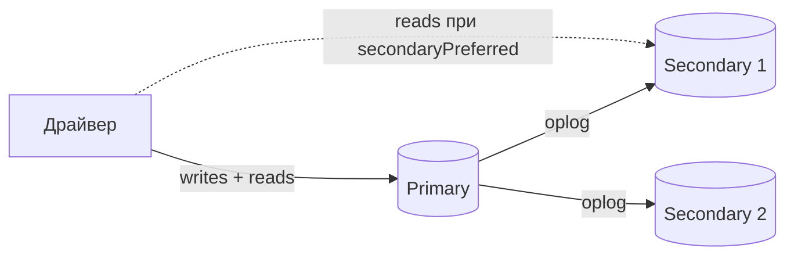
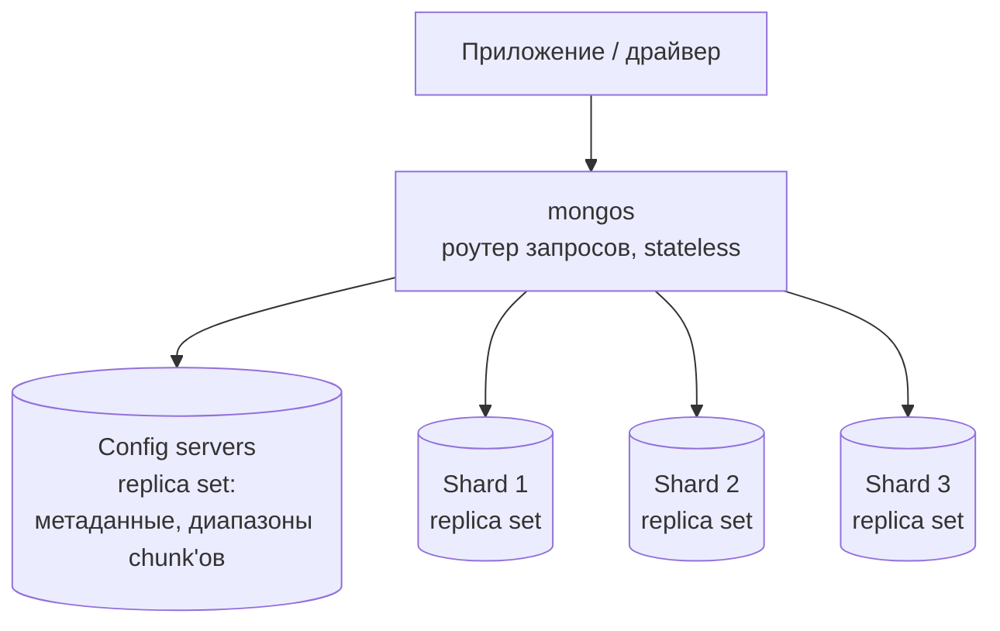

# MongoDB

MongoDB — document database, где данные хранятся как JSON-подобные документы в бинарном формате BSON. Единица хранения — не строка в таблице, а самодостаточный документ переменной структуры; связанные данные чаще **вкладывают** внутрь документа, а не раскладывают по таблицам и соединяют JOIN'ами.

Этот файл — про устройство и эксплуатацию: модель данных, storage engine, репликацию, шардирование и масштабирование. Конкретные production-сценарии выбора (product catalog, user profile, CMS, activity feed, multi-tenant) с готовыми схемами документов — в [04a-mongodb-real-scenarios.md](./04a-mongodb-real-scenarios.md).

Описание defaults и operational semantics ориентировано на MongoDB 8.x. Если поведение заметно менялось между версиями, это отмечено отдельно.

## Содержание

- [Где используется](#где-используется)
- [Модель данных: BSON и документы](#модель-данных-bson-и-документы)
- [Storage engine: WiredTiger](#storage-engine-wiredtiger)
- [Паттерны моделирования данных](#паттерны-моделирования-данных)
- [Aggregation pipeline](#aggregation-pipeline)
- [Индексы](#индексы)
- [Репликация и replica set](#репликация-и-replica-set)
- [Read/write concerns](#readwrite-concerns)
- [Транзакции](#транзакции)
- [Шардирование](#шардирование)
- [Масштабирование: чтение и запись](#масштабирование-чтение-и-запись)
- [Операционные возможности](#операционные-возможности)
- [Сильные стороны](#сильные-стороны)
- [Слабые стороны](#слабые-стороны)
- [Когда выбирать](#когда-выбирать)
- [Когда не выбирать](#когда-не-выбирать)
- [Типичные ошибки](#типичные-ошибки)
- [Query examples](#query-examples)
- [Interview-ready answer](#interview-ready-answer)
- [Официальная документация](#официальная-документация)

## Где используется

- product catalogs с разными атрибутами по категориям;
- user profiles с гибкими расширениями от разных команд;
- content management: статьи из разнородных блоков;
- activity feed и event log с гетерогенным payload;
- multi-tenant конфигурация;
- IoT / time series через native time series collections;
- системы, где схема быстро эволюционирует.

Разбор каждого сценария с обоснованием и схемами документов — в [04a-mongodb-real-scenarios.md](./04a-mongodb-real-scenarios.md).

## Модель данных: BSON и документы

**BSON (Binary JSON)** — бинарный формат хранения документов. Он расширяет JSON типами, которых в JSON нет: `ObjectId`, `Date`, `Decimal128` (точная десятичная арифметика для денег), `Binary`, `Int32/Int64`, `Timestamp`. Формат хранит тип и длину значения, поэтому сервер может эффективно обходить документ, но платит за это дополнительным объёмом: **имена полей хранятся в каждом документе**. Длинные ключи (`created_at_timestamp`) на миллионах документов реально раздувают базу.

Ключевые ограничения и свойства, которые формируют весь дизайн:

| Свойство | Значение | Следствие для дизайна |
| --- | --- | --- |
| Максимальный размер документа | **16 МБ** | нельзя бесконечно вкладывать массив (комментарии, события) — растущие коллекции выносят наружу |
| Атомарность | на уровне **одного документа** | обновление любого числа полей одного документа атомарно без транзакции; для общего инварианта между документами нужна транзакция |
| Глубина вложенности | до 100 уровней | практический предел, а не рабочий режим |
| `_id` | обязателен, уникален, неизменяем | первичный ключ; при отсутствии генерируется `ObjectId` |

**ObjectId** (12 байт) — дефолтный `_id`. Структура: 4 байта Unix-времени + 5 байт случайного значения (уникально на процесс) + 3 байта инкрементного счётчика. Практические следствия: ObjectId примерно **сортируется по времени создания** (первые 4 байта — timestamp), из него можно достать дату создания, и он генерируется на клиенте (драйвере) без обращения к серверу — не нужен `SELECT nextval` как для SQL-последовательности.

<details>
<summary>Пример: один документ вместо трёх таблиц</summary>

В SQL заказ с позициями — это `orders` + `order_items` + JOIN. В MongoDB позиции естественно вкладываются в заказ, потому что читаются и пишутся вместе с ним:

```javascript
{
  _id: ObjectId("6612a1f4c3b2a1e0f4a91b23"),  // _id хранит дату: 2024-04-07
  user_id: ObjectId("65f0d53b1f7c4a2e8b901234"),
  status: "pending",
  amount: Decimal128("150.00"),         // не float — точные деньги
  items: [
    { sku: "ITEM-1", qty: 2, price: Decimal128("50.00") },
    { sku: "ITEM-2", qty: 1, price: Decimal128("50.00") }
  ],
  shipping: {                            // вложенный объект, не отдельная таблица
    city: "Tbilisi",
    address: "Rustaveli 12",
    zip: "0108"
  },
  created_at: ISODate("2024-04-07T10:00:00Z")
}
```

Обновление статуса, суммы и позиций такого документа — **одна атомарная операция** без транзакции: всё живёт в одном документе.

</details>

## Storage engine: WiredTiger

**Storage engine** — компонент, отвечающий за то, как данные лежат на диске и в памяти. С MongoDB 3.2 дефолтный движок — **WiredTiger** (старый MMAPv1 удалён в 4.2). Его свойства объясняют большинство performance-вопросов на интервью:

- **Document-level concurrency** — WiredTiger использует optimistic concurrency control для записей ниже уровня коллекции. Две операции могут параллельно менять разные документы; при конфликте одной операции MongoDB делает transparent retry. На global/database/collection уровнях при этом остаются intent locks.
- **MVCC через snapshots** — как в PostgreSQL: читатели видят согласованный снимок на момент старта операции и не блокируют писателей. Основа для `readConcern: snapshot` и транзакций.
- **Сжатие** — коллекции по умолчанию сжимаются **snappy** (быстро, умеренно), опционально **zstd** (сильнее, обычно дороже по CPU); индексы используют prefix compression. Реальный коэффициент зависит от структуры данных и измеряется на своём workload.
- **Checkpoints** — раз в ~60 секунд WiredTiger сбрасывает согласованный снимок на диск. Между checkpoint'ами durability обеспечивает **journal (write-ahead log)**: при падении база восстанавливается из последнего checkpoint + повтор journal.
- **Кэш** — WiredTiger держит рабочий набор в собственном кэше (по умолчанию `max(50% (RAM − 1 ГБ), 256 МБ)`). Если рабочий набор + индексы не влезают в RAM — начинается активный I/O, и латентность растёт. Это главный ресурс, за которым следят в проде.

```javascript
// сжатие можно задать при создании коллекции
db.createCollection("events", {
  storageEngine: { wiredTiger: { configString: "block_compressor=zstd" } }
})
```

## Паттерны моделирования данных

Моделирование в MongoDB — это ответ на вопрос **«что вкладывать в документ, а что выносить наружу»**. Граница документа заранее определяет объём чтения, доступную атомарность и характер роста данных; индексами не всегда можно компенсировать неудачную модель.

**Embedding (вложение) vs referencing (ссылка):**

| | Embedding (вложить) | Referencing (ссылка на `_id`) |
| --- | --- | --- |
| Когда | данные читаются вместе, «принадлежат» родителю, ограничены по размеру | данные растут неограниченно, переиспользуются, читаются отдельно |
| Плюс | один запрос, атомарное обновление, нет JOIN | нет дублирования, документ не растёт |
| Минус | документ растёт (лимит 16 МБ), дублирование при переиспользовании | нужен `$lookup` или второй запрос, нет атомарности между документами |
| Пример | адрес и позиции внутри заказа | автор поста → отдельная коллекция users |

Правило первого приближения: **вкладывать «has-a / contains-a» с ограниченным размером, ссылаться на «растёт бесконечно» и «many-to-many»**. Комментарии к популярному посту — не вкладывают (растут без предела и упрутся в 16 МБ), а держат отдельной коллекцией со ссылкой на `post_id`.

Дальше — устоявшиеся design patterns MongoDB под конкретные проблемы:

<details>
<summary>Bucket pattern — time series и потоки измерений</summary>

Проблема: хранить каждое измерение сенсора отдельным документом — это миллиарды крошечных документов и раздутые индексы (имена полей в каждом). Решение — **группировать измерения в «корзины» (bucket)** по времени:

```javascript
// вместо 60 документов в час — один bucket на час на сенсор
{
  sensor_id: "temp-01",
  bucket_start: ISODate("2026-07-11T10:00:00Z"),
  count: 60,
  measurements: [
    { t: ISODate("2026-07-11T10:00:00Z"), v: 21.4 },
    { t: ISODate("2026-07-11T10:01:00Z"), v: 21.5 }
    // ... до 60 измерений за час
  ]
}
```

Меньше документов, меньше индексных записей, эффективнее сжатие. С MongoDB 5.0 для этого есть **native time series collections** — сервер делает bucketing автоматически, снаружи это обычная коллекция.

</details>

<details>
<summary>Subset pattern — держать «горячую» часть в документе</summary>

Проблема: у товара 5000 отзывов, но на странице показываются 10 последних. Вкладывать все 5000 — документ огромный и медленный. Решение — **вложить горячее подмножество, остальное вынести**:

```javascript
// коллекция products
{
  _id: productId,
  name: "Samsung 65 QLED",
  reviews_count: 5000,
  recent_reviews: [               // только 10 последних, для карточки товара
    { user: "anna", rating: 5, text: "..." },
    { user: "boris", rating: 4, text: "..." }
  ]
}
// полные отзывы — отдельная коллекция reviews со ссылкой product_id
```

Карточка товара читается одним запросом без `$lookup`; полный список отзывов подгружается отдельно только на своей странице.

</details>

<details>
<summary>Computed pattern — предпосчитать агрегаты</summary>

Проблема: считать сумму и средний рейтинг по 5000 отзывов на каждый показ товара — дорого. Решение — **держать предпосчитанные значения в документе** и обновлять при записи:

```javascript
{
  _id: productId,
  name: "Samsung 65 QLED",
  rating: { avg: 4.6, count: 5000, sum: 23000 }
}
// атомарно обновить count, sum и avg при добавлении отзыва
db.products.updateOne(
  { _id: productId },
  [
    { $set: {
        "rating.count": { $add: ["$rating.count", 1] },
        "rating.sum": { $add: ["$rating.sum", newRating] }
    }},
    { $set: {
        "rating.avg": { $divide: ["$rating.sum", "$rating.count"] }
    }}
  ]
)
```

Чтение — быстрое, цена — дисциплина обновления агрегата при каждой записи. Если отзыв и агрегат находятся в разных документах, их согласованность обеспечивают транзакцией либо принимают eventual consistency и чинят расхождения фоновым job'ом.

</details>

<details>
<summary>Outlier pattern — редкие гигантские документы</summary>

Проблема: у 99% пользователей 10 подписчиков, а у звезды — 10 миллионов. Модель под звезду ломает документ обычного пользователя. Решение — **обычный случай вкладывать, выброс (outlier) обрабатывать отдельно** через флаг:

```javascript
{
  _id: userId,
  username: "celebrity",
  followers_sample: [ /* первые N */ ],
  has_extras: true              // флаг: остальные подписчики в отдельной коллекции
}
```

Код при `has_extras: true` идёт в дополнительную коллекцию; для 99% пользователей overhead нулевой.

</details>

Общий принцип, отличающий MongoDB от реляционного мышления: **моделируют под access pattern (как данные читаются и пишутся), а не под нормализованную структуру сущностей**. Сначала — «какие запросы будут горячими», потом — форма документа.

## Aggregation pipeline

Aggregation pipeline — главный инструмент для сложных запросов. Данные проходят через последовательность стадий (`$match`, `$group`, `$project`, `$sort`, `$lookup` и др.), каждая получает на вход выход предыдущей — как Unix pipe.

```javascript
// подсчёт заказов по статусу за последние 30 дней
db.orders.aggregate([
  { $match: {
      created_at: { $gte: new Date(Date.now() - 30 * 24 * 3600 * 1000) }
  }},
  { $group: {
      _id: "$status",
      count: { $sum: 1 },
      total: { $sum: "$amount" }
  }},
  { $sort: { count: -1 } }
])
```

Порядок стадий важен и для результата, и для производительности. Независимый `$match` стараются поставить до тяжёлых стадий, чтобы сократить поток документов и использовать индекс. `$sort` может использовать индекс, когда стоит первым либо после начального `$match`, но переносить его раньше вычислений или `$group` можно только если семантика запроса не меняется. Итоговый план всегда проверяют через `explain()` — optimizer умеет самостоятельно переставлять часть стадий.

`$lookup` — аналог левого JOIN между коллекциями:

```javascript
db.orders.aggregate([
  { $match: { status: "pending" } },
  { $lookup: {
      from: "users",
      localField: "user_id",
      foreignField: "_id",
      as: "user"
  }},
  { $unwind: "$user" },
  { $project: { "user.email": 1, amount: 1 } }
])
```

`$lookup` поддерживает в том числе sharded `from` collection (с MongoDB 5.1), но его цена зависит от cardinality, объёма промежуточных данных, распределения по шардам и индекса на `foreignField`. Для горячего пути часто выгоднее денормализация, однако `$lookup` не является автоматически плохим решением — это проверяют по access pattern и `explain()`.

## Индексы

Без индекса запрос — это `COLLSCAN` (полный перебор коллекции). Индексы в MongoDB — B-tree, как в реляционных БД, и логика та же.

`Compound index` — по нескольким полям. Порядок полей важен: работает **leftmost prefix** (левый префикс).

```javascript
// покрывает запросы по (status), (status, created_at), но НЕ по (created_at) отдельно
db.orders.createIndex({ status: 1, created_at: -1 })
```

Порядок полей в compound-индексе часто подбирают по **правилу ESR (Equality, Sort, Range)**: сначала equality, затем sort, затем range. Это полезно, когда важно избежать in-memory sort. Если range очень селективный и сокращает почти весь набор, возможен порядок ERS — выбор подтверждают измерениями и `explain()`.

`Multikey index` — для массивов, создаётся автоматически при индексации поля-массива. Ограничение: **compound-индекс не может быть multikey по двум массивам одновременно**.

```javascript
db.products.createIndex({ tags: 1 })
db.products.find({ tags: "electronics" })  // matches any element
```

`Partial index` — индексирует только документы по условию (меньше размер, дешевле обслуживание):

```javascript
db.orders.createIndex(
  { user_id: 1, created_at: -1 },
  { partialFilterExpression: { status: "active" } }
)
```

`Text index` — full-text search внутри MongoDB (ограниченный, не заменяет Elasticsearch):

```javascript
db.articles.createIndex({ title: "text", body: "text" })
db.articles.find({ $text: { $search: "kubernetes deployment" } })
```

Ещё типы под конкретные задачи: **geospatial** (`2dsphere`) для координат и запросов «рядом»; **wildcard** (`{"attrs.$**": 1}`) для документов с непредсказуемым набором полей; **hashed** — основа для hashed sharding (см. ниже); **TTL** — для авто-удаления (см. раздел про TTL).

**Covered query** — запрос, который отвечается **целиком из индекса**, без чтения документов: когда все поля из фильтра и проекции есть в индексе. Самый быстрый вариант чтения. Проверяется через `explain()` — в плане не должно быть стадии `FETCH`.

```javascript
db.orders.find({ status: "pending" }, { _id: 0, status: 1, created_at: 1 })
  .explain("executionStats")  // ищем IXSCAN без FETCH → covered
```

## Репликация и replica set

**Replica set** — группа узлов с одинаковыми данными: один **primary** (принимает все записи) и несколько **secondary** (реплики). Это база для отказоустойчивости; типичная production-конфигурация — три data-bearing узла.



Как это работает внутри:

- **Oplog (operations log)** — capped-коллекция `local.oplog.rs` фиксированного размера, в которую primary пишет модификации в идемпотентной форме. Secondary выбирает sync source и применяет его oplog; при включённом по умолчанию chaining источником может быть как primary, так и другой secondary.
- **Размер oplog = окно восстановления.** Если secondary отставал дольше, чем oplog хранит историю, он выпадает из репликации и требует полного пересинка. Поэтому oplog sizing — важная эксплуатационная настройка.
- **Выборы (elections)** — при отказе primary secondary через Raft-подобный протокол выбирают нового. Узлы обмениваются heartbeat каждые 2 секунды; если primary недоступен дольше `electionTimeoutMillis` (по умолчанию 10 с), запускаются выборы. На время выборов кластер **не принимает записи** (несколько секунд недоступности записи — нормальный failover).
- **Роли узлов:** `priority` определяет предпочтительность при выборах; `hidden` не отдаёт обычные клиентские чтения и подходит для специальных задач; `delayed` намеренно отстаёт и помогает восстанавливаться после человеческих ошибок; `arbiter` голосует, но не хранит данные и не подтверждает записи. PSA-конфигурация экономит узел, но ухудшает доступность `w: "majority"`, если единственный secondary недоступен.

**Read preference** — куда драйвер направляет **чтения**:

| Режим | Куда читает | Когда |
| --- | --- | --- |
| `primary` (default) | только primary | нужна свежесть, read-your-writes |
| `primaryPreferred` | primary, при его отказе — secondary | доступность важнее свежести |
| `secondary` | только secondary | разгрузка primary, допустим stale read |
| `secondaryPreferred` | secondary, иначе primary | масштабирование чтений |
| `nearest` | наименьшая латентность | гео-распределённые чтения |

Важно: чтение с secondary может вернуть устаревшие данные из-за replication lag. Для read-your-writes обычно читают с primary. Альтернатива — causally consistent session с `readConcern: "majority"` и `writeConcern: "majority"`, но она требует поддержки сессии драйвером и добавляет ожидание репликации.

## Read/write concerns

**Write concern** — какое подтверждение должен получить клиент после записи:

- `w: 0` — fire and forget: клиент не ждёт подтверждения и не узнает об ошибке записи;
- `w: 1` — подтверждение только от primary; при failover запись может откатиться, если не успела реплицироваться;
- `w: "majority"` — durable commit на рассчитанном большинстве voting data-bearing members; это implicit default для большинства современных replica set конфигураций;
- `j: true` — явно требует journal flush. При стандартном `writeConcernMajorityJournalDefault: true` значение `w: "majority"` уже подразумевает journaling;
- `wtimeout` ограничивает ожидание write concern. Timeout не означает, что запись была отменена: она могла примениться и продолжить репликацию.

Конфигурации с arbiter — исключение: если число data-bearing voting members не больше voting majority, implicit default становится `{ w: 1 }`. Поэтому production-система должна задавать требуемый write concern явно, а не полагаться на default.

**Read concern** — какую согласованность и видимость данных требует чтение:

- `local` — читает доступные данные узла; они могут ещё не быть majority committed;
- `majority` — возвращает majority-committed данные;
- `linearizable` — линеаризуемое чтение только с primary; дороже по latency и используется точечно;
- `snapshot` — чтение из согласованного snapshot, в частности внутри транзакций.

Для критичных заказов или платежей типичная отправная точка — явный `w: "majority"` с разумным `wtimeout`. `readConcern` выбирают по операции: `majority` защищает от чтения rollback-able данных, но сам по себе не заменяет causal consistency, idempotency keys и бизнес-инварианты.

## Транзакции

С MongoDB 4.0 есть **multi-document ACID transactions** (с 4.2 — и на шардированных кластерах). Они дают атомарность между несколькими документами и коллекциями:

```javascript
const session = db.getMongo().startSession()
session.startTransaction({
  readConcern: { level: "snapshot" },
  writeConcern: { w: "majority" }
})

try {
  const accounts = session.getDatabase("bank").accounts
  accounts.updateOne({ _id: "A" }, { $inc: { balance: -100 } })
  accounts.updateOne({ _id: "B" }, { $inc: { balance: 100 } })
  session.commitTransaction()
} catch (e) {
  session.abortTransaction()
  throw e
}
```

Single-document операции остаются предпочтительными, когда инвариант естественно помещается в один документ: у них меньше coordination overhead. По умолчанию транзакция живёт меньше 60 секунд. Общего лимита 16 МБ на всю транзакцию больше нет, но каждая oplog entry должна помещаться в BSON-лимит, а слишком большая транзакция может быть прервана из-за давления на WiredTiger cache.

В production используют transaction helper драйвера (`withTransaction` или аналог), который корректно обрабатывает transient transaction errors и uncertain commit result. Постоянная необходимость в больших cross-document транзакциях — повод сравнить модель с PostgreSQL, но не автоматическое доказательство неправильного выбора MongoDB.

## Шардирование

**Sharding (шардирование)** — горизонтальное разбиение коллекции по нескольким replica set. Это способ масштабировать **запись** и объём; репликация сама по себе даёт HA и может разгружать часть чтений, но не делит write ownership и полный набор данных между узлами.

### Архитектура



- **Shard** — отдельный replica set, хранящий часть данных. Каждый шард сам по себе отказоустойчив.
- **Config servers** — отдельный replica set с метаданными кластера: какие диапазоны shard key на каком шарде. Мозг маршрутизации.
- **mongos** — stateless-роутер. Приложение подключается к нему, а не к шардам напрямую. Он маршрутизирует запросы по закэшированным метаданным, полученным от config servers.

### Shard key и chunks

**Shard key** — поле (или несколько), по которому данные распределяются. Пространство значений shard key делится на **chunks** — непрерывные диапазоны. Default target range size в современных версиях — 128 МБ (до MongoDB 6.0 было 64 МБ), но chunk может временно стать больше. Каждый chunk живёт на одном шарде; **balancer** фоново перемещает chunks и выравнивает распределение данных.

Два способа распределения:

| | Ranged sharding | Hashed sharding |
| --- | --- | --- |
| Как | chunks по непрерывным диапазонам значений | chunks по хешу значения shard key |
| Плюс | range-запрос затрагивает только chunks с пересекающимися диапазонами | равномернее распределяет монотонные значения при высокой cardinality |
| Минус | монотонный ключ (timestamp, ObjectId) направляет новые записи в крайний chunk → **hotspot** | range-запрос по исходному значению обычно становится broadcast |
| Когда | запросы по диапазонам, ключ не монотонный | ключ монотонный или нужна ровная запись |

### Targeted vs scatter-gather

Это ключевое для производительности различие:

- **Single-shard targeted query** — equality-фильтр задаёт полный shard key, поэтому `mongos` знает один целевой шард.
- **Multi-shard targeted query** — range или prefix compound shard key ограничивает запрос несколькими релевантными шардами, но не обязательно одним.
- **Scatter-gather (broadcast)** — роутер не может сузить набор и рассылает запрос на все шарды, затем сливает результаты.

Отсюда главный критерий: shard key должен позволять таргетировать большинство горячих запросов. Простого присутствия части compound key недостаточно — важны тип предиката и покрываемый диапазон.

### Выбор shard key

Хороший shard key — это одновременно:

1. **Высокая кардинальность (cardinality)** — много разных значений, чтобы было что делить. `status` с тремя значениями — плохой ключ.
2. **Низкая частота (frequency)** — ни одно значение не доминирует. Большой объём документов с одним значением может создать неделимый диапазон и hotspot на одном шарде.
3. **Немонотонность** — чтобы новые записи не лились в один chunk. Монотонный ключ (timestamp) при ranged sharding создаёт hotspot записи.

Частое решение — **compound shard key** (например, `{ tenant_id: 1, _id: 1 }`): `tenant_id` ограничивает маршрутизацию данными клиента, а `_id` добавляет cardinality внутри tenant. Запрос только по `tenant_id` может затронуть несколько chunks или shards — это зависит от распределения.

**Zone sharding (tag-aware)** — привязка диапазонов shard key к конкретным шардам: гео-локация (европейские клиенты на EU-шардах для data residency), либо tiered storage (свежие данные на быстрых NVMe-шардах, старые — на дешёвых).

### Resharding

Исторически смена shard key требовала отдельной коллекции и переноса данных. С **MongoDB 5.0** есть online resharding (`reshardCollection`): приложение продолжает читать и писать большую часть операции, но resharding создаёт высокую нагрузку, копирует данные и использует короткую critical section при переключении. Поэтому shard key всё равно проектируют заранее и проверяют на реальном workload.

<details>
<summary>Пример настройки шардирования коллекции</summary>

```javascript
// включить шардирование базы
sh.enableSharding("shop")

// hashed sharding — более равномерная запись при высокой cardinality user_id
sh.shardCollection("shop.events", { user_id: "hashed" })

// compound ranged — таргетинг по tenant + кардинальность по _id
sh.shardCollection("shop.orders", { tenant_id: 1, _id: 1 })

// zone sharding: европейские tenants на EU-шардах
sh.addShardToZone("shard-eu", "EU")
sh.updateZoneKeyRange("shop.orders",
  { tenant_id: "eu-", _id: MinKey },
  { tenant_id: "ev-", _id: MinKey },
  "EU")
```

</details>

## Масштабирование: чтение и запись

Разделение, которое часто путают на интервью:

| Что масштабируем | Механизм | Как |
| --- | --- | --- |
| **Чтение** | replica set + read preference | secondary'ы принимают чтения (`secondaryPreferred`); цена — eventual consistency |
| **Запись и объём** | sharding | запись распределяется по шардам; каждый шард держит свою долю |
| **Вертикально** | больше RAM/CPU/NVMe | до предела одного сервера; главное — рабочий набор в RAM (кэш WiredTiger) |

Порядок роста на практике: сначала оптимизировать модель и запросы, затем масштабировать узел вертикально; чтения выносить на secondary только там, где подходит их consistency model. Когда запись или объём упираются в один replica set, рассматривают sharding. Он добавляет `mongos`, config servers, migrations, выбор shard key и scatter-gather риски, поэтому его не берут «на всякий случай».

Сигналы, что пора шардировать: рабочий набор перестал влезать в RAM самого большого доступного сервера; write throughput упирается в один primary; объём данных превышает разумную ёмкость одного узла.

## Операционные возможности

### Change streams

**Change streams** — подписка на изменения коллекции в реальном времени, построенная поверх oplog. Stream можно продолжить по resume token, пока нужная история доступна в oplog. Это встроенный CDC (Change Data Capture) для реактивных обновлений, синхронизации кэша и отправки данных в поисковый индекс.

```javascript
const stream = db.orders.watch(
  [{ $match: {
    operationType: "update",
    "updateDescription.updatedFields.status": "paid"
  }}],
  { fullDocument: "updateLookup" }
)

stream.on("change", (change) => {
  // change.fullDocument содержит актуальную версию оплаченного заказа
})
```

Для update event поле `fullDocument` без `updateLookup` обычно отсутствует. Фильтрация по `updateDescription` ловит именно изменение статуса, а `updateLookup` догружает актуальный документ. Resume token следует хранить надёжно, но он не гарантирует бесконечный replay за пределами oplog window.

### TTL indexes

**TTL index** — авто-удаление документов по времени. TTL monitor работает асинхронно, поэтому документ удаляется не строго в момент истечения срока, а с задержкой. Подходит для сессий, кэшей, временных токенов и событий с retention:

```javascript
// удалять документы через 24 часа после created_at
db.sessions.createIndex({ created_at: 1 }, { expireAfterSeconds: 86400 })
```

### Schema validation

**Schema validation** — вопреки образу «schemaless», MongoDB умеет валидировать структуру на уровне коллекции через `$jsonSchema`. Это способ вернуть дисциплину без потери гибкости — обязательные поля и типы гарантируются сервером:

```javascript
db.createCollection("users", {
  validator: { $jsonSchema: {
    bsonType: "object",
    required: ["email", "created_at"],
    properties: {
      email:      { bsonType: "string", pattern: "^.+@.+$" },
      created_at: { bsonType: "date" }
    }
  }},
  validationLevel: "strict"   // отклонять невалидные записи
})
```

## Сильные стороны

- гибкая документная модель: вложенные структуры, массивы, разные атрибуты у разных документов;
- богатый язык запросов и aggregation pipeline;
- индексы: compound, multikey, partial, text, geospatial, wildcard, hashed, TTL;
- replica set для HA и чтений с secondary, когда допустима выбранная consistency model;
- горизонтальное sharding для масштабирования записи и объёма;
- change streams как встроенный CDC;
- быстрая эволюция формы документа без обязательной DDL-миграции для каждого добавленного поля.

## Слабые стороны

- сложные relational join'ы возможны (`$lookup`), но могут создавать большие intermediate results и fan-out по шардам;
- schema flexibility без дисциплины → коллекция документов в 10 форматах;
- cross-document transactions добавляют coordination overhead и давление на cache;
- денормализация требует дисциплины: копии данных нужно синхронно обновлять;
- неправильный shard key лечится дорогим resharding'ом;
- рабочий набор вне RAM → резкая деградация латентности.

## Когда выбирать

MongoDB подходит, если:

- данные естественно документные (объект читается и пишется целиком);
- атрибуты сущностей сильно различаются (per-category поля);
- схема активно меняется, а реляционных constraints мало;
- нужна горизонтальная масштабируемость записи из коробки;
- access pattern — «прочитать/записать документ целиком по ключу».

## Когда не выбирать

Лучше PostgreSQL, если:

- много связей many-to-many и нужны сложные ad-hoc join'ы;
- важны foreign keys и strict relational integrity;
- бизнес-инварианты естественно выражаются транзакциями между сущностями;
- flexible нужна только часть данных — тогда PostgreSQL + JSONB закрывает задачу без второй СУБД (сравнение — в [04a-mongodb-real-scenarios.md](./04a-mongodb-real-scenarios.md)).

## Типичные ошибки

- выбирать MongoDB, «чтобы не писать миграции» (schema discipline никуда не девается, а переезжает в код);
- моделировать коллекции как SQL-таблицы и страдать без join'ов;
- вкладывать неограниченно растущий массив в документ → упереться в лимит 16 МБ;
- явно использовать `w: 1` для критичных данных без осознанного риска rollback при failover;
- выбрать низкокардинальный или монотонный shard key → неделимые диапазоны или hotspot;
- строить горячие запросы без shard key → scatter-gather на всех шардах;
- не следить за рабочим набором vs RAM → тихая деградация под ростом данных;
- читать с secondary там, где нужен read-your-writes → «пропавшая» только что запись.

## Query examples

Для примеров ниже предполагается, что `userId` и `orderId` — валидные `ObjectId`, полученные из приложения или созданные через `ObjectId()`.

Вставить документ:

```javascript
const userId = ObjectId("65f0d53b1f7c4a2e8b901234")

db.orders.insertOne({
  user_id: userId,
  status: "pending",
  amount: Decimal128("150.00"),
  items: [
    { sku: "ITEM-1", qty: 2, price: Decimal128("50.00") },
    { sku: "ITEM-2", qty: 1, price: Decimal128("50.00") }
  ],
  created_at: new Date()
})
```

Найти с фильтром:

```javascript
db.orders
  .find({ status: "pending", amount: { $gte: Decimal128("100.00") } })
  .sort({ created_at: -1 })
  .limit(50)
```

Атомарно захватить заказ в обработку через conditional update:

```javascript
db.orders.findOneAndUpdate(
  { _id: orderId, status: "pending" },   // условие защищает от гонки
  { $set: { status: "processing", updated_at: new Date() } },
  { returnDocument: "after" }
)
```

Upsert — вставить или обновить. Поле из фильтра должно иметь unique index, если дубликаты недопустимы:

```javascript
db.users.createIndex({ email: 1 }, { unique: true })

db.users.updateOne(
  { email: "user@example.com" },
  { $set: { status: "active" }, $setOnInsert: { created_at: new Date() } },
  { upsert: true }
)
```

Проанализировать план запроса:

```javascript
db.orders.find({ status: "pending" }).explain("executionStats")
// смотрим: IXSCAN vs COLLSCAN, totalDocsExamined vs nReturned, наличие FETCH
```

## Interview-ready answer

**1. Когда MongoDB — правильный выбор?**

- Когда данные естественно образуют document aggregate: объект обычно читается и меняется целиком, его вложенные части ограничены по размеру, а разные документы могут иметь разные атрибуты. Решение принимают по access patterns; гибкая схема сама по себе недостаточна.

**2. Как устроена durability и зачем `w: "majority"`?**

- Primary записывает изменения в oplog, secondary применяют их от выбранного sync source. `w: 1` подтверждает запись только на primary, поэтому она может откатиться при failover. `w: "majority"` ждёт durable commit на рассчитанном большинстве data-bearing voting members. В стандартной конфигурации это также подразумевает journaling; в приложении дополнительно задают `wtimeout` и обрабатывают ambiguous result.

**3. Как MongoDB масштабируется горизонтально?**

- Replica set даёт HA и позволяет выполнять часть чтений на secondary с выбранной consistency model. Запись и объём масштабируются sharding'ом: `mongos` маршрутизирует запрос по shard key и метаданным config servers. Цена — выбор shard key, scatter-gather, migrations и более сложная эксплуатация.

**4. Как выбрать shard key?**

- Нужны высокая cardinality, отсутствие доминирующих значений и распределение новых записей без hotspot. Equality по полному shard key обычно даёт single-shard query; range или prefix могут затронуть несколько шардов; без подходящего предиката получится broadcast. Compound key вроде `{ tenant_id: 1, _id: 1 }` сочетает локальность tenant и cardinality, но проверяется на реальных запросах.

**5. Embedding или referencing?**

- Вкладывают данные, которые принадлежат родителю, читаются вместе с ним и ограничены по размеру: например, позиции заказа. Ссылки используют для переиспользуемых сущностей, many-to-many и неограниченно растущих наборов. Граница документа задаёт границу дешёвой атомарности; максимальный размер документа — 16 МБ.

**6. Когда использовать транзакции?**

- Multi-document ACID transactions нужны, когда один бизнес-инвариант действительно пересекает документы. Single-document модель дешевле, если она естественна, но не стоит искажать данные только ради отказа от транзакций. Учитывают runtime, cache pressure, retries и дополнительную стоимость distributed transaction на шардах.

## Официальная документация

- [MongoDB Manual](https://www.mongodb.com/docs/manual/)
- [Data Modeling](https://www.mongodb.com/docs/manual/data-modeling/)
- [WiredTiger storage engine](https://www.mongodb.com/docs/manual/core/wiredtiger/)
- [Replication](https://www.mongodb.com/docs/manual/replication/)
- [Default read and write concerns](https://www.mongodb.com/docs/manual/reference/mongodb-defaults/)
- [Sharding](https://www.mongodb.com/docs/manual/sharding/)
- [Transactions production considerations](https://www.mongodb.com/docs/manual/core/transactions-production-consideration/)
- [Change streams](https://www.mongodb.com/docs/manual/changestreams/)
