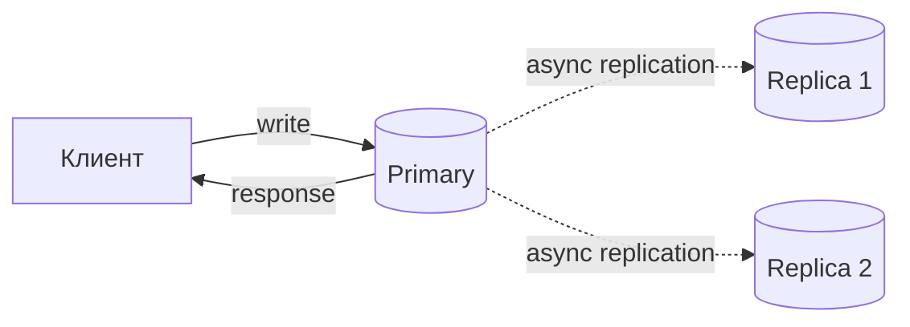

# Redis

Redis — in-memory data store: основной dataset живёт в RAM, поэтому простые операции выполняются с очень низкой latency. Redis полезен не только как key-value cache: он предоставляет структуры данных, TTL, атомарные команды, persistence, replication и sharding.

Главная mental model: Redis хранит `key → value`, где value имеет тип (`String`, `Hash`, `List`, `Set`, `Sorted Set`, `Stream`). Одна команда атомарна, но данные ограничены памятью, а durability и consistency зависят от выбранной конфигурации.

Version-sensitive детали в этом файле ориентированы на Redis Open Source 8.x. Внутренние кодировки и defaults могут отличаться в более старых версиях.

## Содержание

- [Где используется](#где-используется)
- [Как Redis исполняет команды](#как-redis-исполняет-команды)
- [Структуры данных: что выбирать](#структуры-данных-что-выбирать)
- [TTL: когда исчезает ключ](#ttl-когда-исчезает-ключ)
- [Что происходит при заполнении памяти](#что-происходит-при-заполнении-памяти)
- [Persistence: RDB vs AOF](#persistence-rdb-vs-aof)
- [Replication, Sentinel и Cluster](#replication-sentinel-и-cluster)
- [Redis Streams, List или Pub/Sub](#redis-streams-list-или-pubsub)
- [Атомарность: pipeline, MULTI/EXEC, Lua, WATCH](#атомарность-pipeline-multiexec-lua-watch)
- [Distributed lock: подводные камни](#distributed-lock-подводные-камни)
- [Производительность и работа под нагрузкой](#производительность-и-работа-под-нагрузкой)
- [Сильные стороны](#сильные-стороны)
- [Слабые стороны](#слабые-стороны)
- [Когда выбирать](#когда-выбирать)
- [Когда не выбирать](#когда-не-выбирать)
- [Типичные ошибки](#типичные-ошибки)
- [Go: go-redis](#go-go-redis)
- [Interview-ready answer](#interview-ready-answer)
- [Официальная документация](#официальная-документация)

## Где используется

| Сценарий | Почему Redis подходит |
| --- | --- |
| Cache и sessions | быстрый lookup по key и встроенный TTL |
| Counters и rate limiting | атомарные `INCR` и server-side scripts |
| Leaderboards | Sorted Set хранит порядок по score |
| Presence и temporary state | дешёвые Set/Hash и expiration |
| Лёгкие очереди и notifications | List, Stream или Pub/Sub под разные гарантии |
| Advisory locks | атомарный `SET NX PX`, если понятны ограничения lease |

Production-паттерны и Go-код вынесены в [08a-redis-real-scenarios.md](./08a-redis-real-scenarios.md), а алгоритмы rate limiting — в [08b-redis-rate-limiters.md](./08b-redis-rate-limiters.md).

## Как Redis исполняет команды

Основной путь исполнения команд Redis преимущественно однопоточный: event loop обрабатывает команды последовательно. При этом Redis использует дополнительные потоки и фоновые процессы для I/O и служебной работы, поэтому фразу «Redis полностью однопоточный» не стоит понимать буквально.

- **Одна команда атомарна.** `INCR`, `HSET`, `LPUSH` или `SET ... NX` не требуют client-side lock.
- **Долгая команда задерживает другие.** Стоимость зависит не только от имени команды, но и от размера value: `SMEMBERS` по десяти элементам безопасен, по миллиону — нет.
- **Hot key ограничивает масштабирование.** Cluster распределяет разные ключи, но один перегруженный ключ всё равно обслуживается одним shard.
- **Pipeline экономит сеть, а не CPU.** Он уменьшает число round trips, но не делает команды атомарными.

В application path избегают `KEYS *` и неограниченных `HGETALL`/`SMEMBERS`/`LRANGE`. Для постепенного обхода используют `SCAN`, `HSCAN`, `SSCAN`, `ZSCAN`; они не дают snapshot и при изменении коллекции могут возвращать элементы повторно.

## Структуры данных: что выбирать

Выбирать Redis type нужно по операции, которая должна быть дешёвой и атомарной:

| Задача | Тип | Основные команды |
| --- | --- | --- |
| Кэшировать blob, хранить token или counter | `String` | `GET`, `SET`, `INCR` |
| Хранить небольшой объект с полями | `Hash` | `HSET`, `HGET`, `HMGET` |
| Очередь или deque | `List` | `LPUSH`, `RPOP`, `BLMOVE` |
| Уникальные элементы и membership | `Set` | `SADD`, `SISMEMBER`, `SINTER` |
| Ranking или диапазон по score | `Sorted Set` | `ZADD`, `ZRANGE`, `ZRANK` |
| Retained event log с consumer groups | `Stream` | `XADD`, `XREADGROUP`, `XACK` |

**String** — кэш, сессия или атомарный счётчик:

```text
SET session:abc123 "user-42" EX 3600     # значение + TTL 1 час
GET session:abc123
INCR rate:user:42:2026-04-20-10:00       # атомарный счётчик окна
EXPIRE rate:user:42:2026-04-20-10:00 60
```

`INCR` и `EXPIRE` здесь две отдельные команды. Для корректного rate limiter их объединяют Lua/Function или другим атомарным паттерном из [08b](./08b-redis-rate-limiters.md).

**Hash** — объект с полями, когда не нужно каждый раз читать и перезаписывать весь JSON:

```text
HSET user:42 email user@example.com status active plan pro
HGET user:42 plan
HGETALL user:42
```

**List** — простая очередь или deque:

```text
LPUSH queue:jobs job-1                    # добавить в голову
BLMOVE queue:jobs queue:processing RIGHT LEFT 0
LRANGE feed:user:42 0 19                  # последние 20 элементов
```

`BLMOVE` помогает не потерять задачу между получением и переносом в processing list, но retry, acknowledgments и cleanup приложение реализует самостоятельно. Для готовой consumer-group модели обычно удобнее Stream.

**Set** — уникальные множества, теги и membership:

```text
SADD online:users 42 99 100
SISMEMBER online:users 42                 # состоит ли
SCARD online:users                        # размер множества
SINTER tag:go tag:senior                  # пересечение множеств
```

**Sorted Set** — leaderboard, приоритетная очередь или диапазон по score:

```text
ZADD leaderboard 1500 user:42 2000 user:99
ZRANGE leaderboard 0 9 REV WITHSCORES     # топ-10
ZREVRANK leaderboard user:42              # позиция от большего score к меньшему
```

**HyperLogLog** — приблизительный счётчик уникальных, когда точный `Set` слишком дорог по памяти:

```text
PFADD visitors:2026-04-20 user:1 user:2 user:3
PFCOUNT visitors:2026-04-20               # ≈ число уникальных
```

<details>
<summary>Deep dive: внутренние кодировки</summary>

Redis автоматически выбирает компактное представление для небольших values и меняет его при росте. Например, Hash и Sorted Set могут использовать `listpack`, Set из целых — `intset`, а крупные структуры переходят на hash table, quicklist или skiplist.

Это важно по двум причинам:

- множество маленьких Hash обычно экономнее множества отдельных keys, потому что у каждого key есть собственные метаданные;
- после перехода на другую encoding меняются потребление памяти и стоимость некоторых операций.

Конкретные thresholds зависят от версии и `redis.conf`; не стоит запоминать их как универсальные constants. Текущую encoding показывает:

```text
OBJECT ENCODING key
```

Для sizing используют `MEMORY USAGE`, `redis-cli --memkeys` и тест на данных, похожих на production.

</details>

## TTL: когда исчезает ключ

TTL задают вместе с записью (`SET ... EX/PX`) либо командами `EXPIRE`/`PEXPIRE`. `TTL key` показывает оставшееся время, `PERSIST` снимает expiration.

После deadline ключ логически считается отсутствующим, но физическое удаление асинхронно:

- **passive expiration** удаляет ключ при обращении;
- **active expiration** периодически выбирает keys с TTL и очищает просроченные.

Поэтому TTL не является точным scheduler: событие «удалить ровно в 12:00:00» нужно реализовывать отдельно. Просроченные, но ещё не очищенные keys могут временно учитываться в памяти. Primary синтезирует `DEL` и передаёт его в AOF и replicas, чтобы dataset не расходился.

## Что происходит при заполнении памяти

`maxmemory` задаёт предел, а `maxmemory-policy` — реакцию на его достижение:

| Режим | Когда подходит | Что происходит |
| --- | --- | --- |
| `noeviction` | данные нельзя автоматически удалять | команды, которым нужна новая память, получают error |
| `allkeys-lru` / `allkeys-lfu` | весь instance — cache | Redis приближённо вытесняет старые или редко используемые keys |
| `volatile-lru` / `volatile-lfu` | удалять разрешено только keys с TTL | keys без TTL сохраняются, но запись может упасть, если подходящих кандидатов нет |
| `volatile-ttl` | ближе к expiry — менее ценно | сначала вытесняются keys с меньшим оставшимся TTL |

Для cache обычно начинают с `allkeys-lru` или `allkeys-lfu`. Для mixed workload безопаснее разделить cache и non-evictable state по разным instances: одна policy на общей базе создаёт неочевидную зависимость между ними.

`maxmemory` оставляют ниже доступной RAM: replication buffers, client buffers, fork copy-on-write и allocator overhead могут потреблять память сверх dataset limit.

## Persistence: RDB vs AOF

Persistence отвечает за восстановление после restart, но не заменяет replication и backups.

| Режим | Что хранится | Возможная потеря при crash | Основной trade-off |
| --- | --- | --- | --- |
| без persistence | только RAM | весь dataset | минимум disk I/O; только для восстановимого cache |
| RDB | периодический snapshot | изменения после последнего snapshot | компактный backup и быстрый restart |
| AOF `everysec` | log write-команд | обычно до одной секунды | лучше durability, больше disk I/O |
| RDB + AOF | snapshots и command log | зависит от AOF policy | больше защиты и operational complexity |

Для AOF доступны `appendfsync always`, `everysec` и `no`. `everysec` — типичный компромисс; `always` повышает durability ценой latency, а `no` оставляет flush операционной системе. С Redis 7 AOF состоит из base и incremental files и периодически переписывается, чтобы не расти бесконечно.

<details>
<summary>Deep dive: fork и copy-on-write</summary>

RDB snapshot и фоновые persistence-операции могут использовать `fork()`. Child process пишет snapshot, а parent продолжает обслуживать команды. После fork они разделяют memory pages; изменённые страницы копируются по механизму copy-on-write.

На большом write-heavy dataset это означает:

- короткая pause на сам `fork`;
- дополнительную RAM на изменяемые pages;
- конкуренцию за disk I/O во время snapshot или rewrite.

Поэтому capacity планируют не только по `used_memory`, но и с запасом под fork и buffers. Состояние проверяют через `INFO persistence`.

</details>

## Replication, Sentinel и Cluster

Сначала разделим три понятия:

| Механизм | Что решает | Чего не решает |
| --- | --- | --- |
| Replication | копии dataset, read replicas | автоматический failover сам по себе |
| Sentinel | discovery и failover одного primary с replicas | горизонтальное распределение keys |
| Cluster | sharding по slots и failover каждого shard | cross-slot операции без ограничений |

Replication асинхронная: primary обычно отвечает клиенту до того, как replicas применили запись. Поэтому после failover небольшое окно подтверждённых записей может потеряться, а чтение с replica может быть stale.



После write на том же connection команда `WAIT 1 100` просит дождаться получения записи хотя бы одной replica или timeout 100 ms. Это уменьшает окно потери, но не превращает Redis в consensus database и не гарантирует fsync. `min-replicas-to-write` может ограничить запись при недостатке healthy replicas, меняя availability на меньший риск divergence.

**Sentinel** выбирают, когда dataset и throughput помещаются в один primary, но нужен автоматический failover и discovery нового primary.

**Cluster** выбирают, когда нужны sharding и aggregate throughput нескольких primaries. Key попадает в один из 16384 hash slots; cluster-aware client хранит карту `slot → node`. Multi-key command, transaction или script должны обращаться к keys одного slot. Hash tag делает это явно:

```text
{user:42}:session
{user:42}:profile
```

Обе записи используют hash tag `user:42` и попадают в один slot. Это помогает multi-key операциям, но может создать hot slot, если tag слишком популярный.

<details>
<summary>Deep dive: full/partial resync и MOVED/ASK</summary>

При первом подключении или большом отставании replica делает **full resync**: получает snapshot и накопившийся поток изменений. После короткого disconnect возможен **partial resync** из replication backlog по replication ID и offset. Если нужная часть backlog уже вытеснена, снова нужен full resync.

В Cluster:

- `MOVED` сообщает постоянного владельца slot и заставляет client обновить карту;
- `ASK` временно направляет одну команду на destination во время slot migration;
- gossip по cluster bus распространяет topology и участвует в failure detection.

Resharding перемещает keys slot за slot. Big keys увеличивают latency миграции, поэтому их контролируют ещё до масштабирования cluster.

</details>

## Redis Streams, List или Pub/Sub

Эти инструменты решают разные задачи:

| | Pub/Sub | List (`LPUSH`/`BRPOP`) | Stream |
| --- | --- | --- | --- |
| Модель | fan-out уведомлений | простая очередь/deque | retained log |
| Если consumer offline | сообщение теряется | задача остаётся до извлечения | запись остаётся до trimming/deletion |
| Acknowledgment | нет | приложение строит само | `XACK` и Pending Entries List |
| Recovery зависшей работы | нет | приложение строит само | `XPENDING`, `XCLAIM`, `XAUTOCLAIM` |
| Delivery | best effort | зависит от паттерна | at-least-once в consumer group |

Stream выбирают, когда workers должны делить сообщения, подтверждать обработку и забирать зависшие pending entries. Дубликаты возможны, поэтому consumer должен быть idempotent. Фактическая durability Stream определяется общей настройкой RDB/AOF и replication — слово retained не означает автоматический fsync каждого события.

Минимальный flow:

```text
XGROUP CREATE events workers $ MKSTREAM
XADD events MAXLEN ~ 100000 * type order_placed order_id ORD-1
XREADGROUP GROUP workers worker-1 COUNT 10 BLOCK 5000 STREAMS events >
XACK events workers 1698765432-0
```

`MAXLEN` или `XTRIM` ограничивает рост Stream. Без retention policy он становится unbounded key. Для большого retention, независимого partitioning, долгого replay и развитой broker-экосистемы обычно выбирают Kafka/Pulsar, а не Redis.

## Атомарность: pipeline, MULTI/EXEC, Lua, WATCH

Одна Redis-команда атомарна. Когда логика состоит из нескольких команд, выбирают инструмент по требуемой гарантии:

- **Pipeline — это НЕ про атомарность.** Это отправка нескольких команд за один RTT без ожидания ответа на каждую — экономия сети, и только. Между командами пайплайна вполне могут вклиниться команды других клиентов.
- **MULTI/EXEC (транзакции).** Команды между `MULTI` и `EXEC` ставятся в очередь и выполняются **атомарно подряд** — никто не вклинится. Но rollback нет: queue-time error отменяет `EXEC`, а runtime error вроде неверного типа не откатывает выполненные команды и не мешает остальным.
- **WATCH — оптимистичная блокировка (CAS).** `WATCH key` перед `MULTI`: если `key` изменился до `EXEC`, транзакция отменяется (`EXEC` вернёт nil) → повторить. Так делают безопасный read-modify-write без блокировок.
- **Lua script / Redis Function.** Выполняет server-side логику атомарно. Скрипт должен быть коротким: пока он работает, другие команды ждут. На Lua часто строят release lock и rate limiter ([08b](./08b-redis-rate-limiters.md)).

Транзакция `MULTI/EXEC` — несколько команд, выполненных одним атомарным блоком:

```text
MULTI                 # начать транзакцию — команды дальше копятся, не выполняясь
INCR  orders:count
LPUSH orders:queue 42
EXEC                  # выполнить всё разом, атомарно; вернёт массив результатов
                      # (DISCARD — отменить, не выполняя)
```

`WATCH` добавляет к транзакции оптимистичную блокировку — безопасный read-modify-write:

```text
WATCH balance:42      # следить за ключом
# читаем текущее значение в приложении, считаем новое
MULTI
SET balance:42 900
EXEC                  # если balance:42 изменился после WATCH — вернёт nil, транзакция НЕ применилась → повторить
```

В go-redis то же самое — `TxPipeline` (это и есть `MULTI/EXEC`) и `Watch`:

```go
// атомарный блок команд
pipe := rdb.TxPipeline()
pipe.Incr(ctx, "orders:count")
pipe.LPush(ctx, "orders:queue", 42)
_, err := pipe.Exec(ctx)

// WATCH не делает auto-retry: конфликт redis.TxFailedErr повторяет приложение
for attempt := 0; attempt < 3; attempt++ {
    err = rdb.Watch(ctx, func(tx *redis.Tx) error {
        n, err := tx.Get(ctx, "balance:42").Int()
        if err != nil {
            return err
        }
        if n < 100 {
            return ErrInsufficientFunds
        }
        _, err = tx.TxPipelined(ctx, func(p redis.Pipeliner) error {
            p.Set(ctx, "balance:42", n-100, 0)
            return nil
        })
        return err
    }, "balance:42")

    if !errors.Is(err, redis.TxFailedErr) {
        break
    }
}
```

Правило выбора: нужна скорость по сети — pipeline; нужна атомарная последовательность — `MULTI/EXEC`; нужен compare-and-set — `WATCH` с retry; нужна короткая атомарная логика с ветвлениями — Lua/Function.

## Distributed lock: подводные камни

Минимальный advisory lock захватывают одной командой с уникальным случайным token и TTL:

```text
SET lock:resource 550e8400-e29b-41d4-a716-446655440000 NX PX 5000
```

Освобождение должно атомарно сравнить token и удалить key, иначе клиент может снять уже чужой lock:

```lua
if redis.call("get", KEYS[1]) == ARGV[1] then
    return redis.call("del", KEYS[1])
else
    return 0
end
```

Но TTL не доказывает, что владелец всё ещё единственный: GC pause, network delay или slow syscall могут пережить lease, после чего два процесса одновременно продолжат работу. Продление lock уменьшает вероятность, но не устраняет эту модель отказа.

Поэтому Redis lock подходит для advisory-задач: не запустить одинаковый cron дважды, уменьшить duplicate work, координировать cache refresh. Если внешний ресурс требует строгой защиты от устаревшего владельца, используют **fencing token** — монотонный номер lease, который сам ресурс проверяет и отклоняет старые операции. Для финансового инварианта основная защита должна находиться в транзакционной БД или системе с подходящей consensus-моделью.

Redlock координирует несколько независимых Redis primaries, но вокруг его гарантий есть известная дискуссия. На собеседовании важнее не название алгоритма, а способность объяснить lease expiry, process pause и fencing.

## Производительность и работа под нагрузкой

Число operations/sec без hardware, payload size, pipeline depth, TLS и persistence policy почти ничего не говорит. Redis измеряют собственным workload и смотрят не только average, но и p95/p99.

Основные рычаги:

- **pipelining/batching** уменьшает network round trips;
- **connection pool** переиспользует TCP/TLS connections;
- **bounded values** не дают O(N)-операциям занять event loop надолго;
- **несколько shards** распределяют разные keys, но не исправляют один hot key;
- **headroom по RAM** нужен для buffers, fragmentation и fork.

Big key опасен не только памятью: его чтение, удаление или миграция может дать latency spike. Ищут большие values через `redis-cli --bigkeys`, `--memkeys`/`--keystats` и `MEMORY USAGE`. Для удаления большого key подходит `UNLINK`; для частичной обработки коллекций — `HSCAN`/`SSCAN`/`ZSCAN` с bounded batches.

Типичные причины latency spikes:

| Источник всплеска | Механизм | Что делать |
| --- | --- | --- |
| `fork` и persistence I/O | pause на fork, copy-on-write, конкуренция за disk | держать memory headroom, следить за `INFO persistence` |
| Swap | часть RAM ушла в своп → каждая операция ждёт диск | `maxmemory` ниже физической RAM, отключить swap для Redis |
| Transparent Huge Pages (THP) | ядро отдаёт huge pages → долгие copy-on-write при fork | отключить THP на хосте (официальная рекомендация Redis) |
| O(N)-команды и big keys | event loop занят одной командой | `SLOWLOG`, bounded commands, incremental scans |
| Штормовое истечение TTL | active-expire удаляет много ключей разом | размазать TTL джиттером, не ставить одинаковый expiry всем |

Минимальный набор диагностики: `SLOWLOG GET`, `LATENCY DOCTOR`, `INFO memory`, `INFO replication`, `INFO persistence`, `MEMORY USAGE key` и cache hit rate `keyspace_hits`/`keyspace_misses`.

## Сильные стороны

- **Очень низкая latency для bounded операций** — основной dataset находится в RAM, а простой execution model уменьшает coordination overhead.
- **Богатые структуры данных** — String, Hash, List, Set, Sorted Set, Stream, HyperLogLog, bitmap, geo: часто одна структура заменяет целый кусок логики (leaderboard = один Sorted Set).
- **TTL из коробки** — lifecycle временных keys управляется самим Redis.
- **Атомарность команд + Lua** — read-modify-write без гонок (счётчики, rate limiting, дедупликация) прямо на сервере.
- **Pipeline** — десятки команд за один RTT, когда сеть дороже самих операций.
- **Pub/Sub и Streams** — лёгкий messaging рядом с кэшем, без отдельного брокера для простых случаев.

## Слабые стороны

- **Основной dataset в RAM** — дорого по сравнению с disk-oriented storage и ограничено памятью shard.
- **Подтверждённые записи могут теряться** — replication асинхронная, а AOF `everysec` допускает потерю последних изменений при crash.
- **Hot key — потолок одного ядра** — из-за однопоточности вся нагрузка на один ключ упирается в один core, и шардирование по ключам не спасает.
- **Инвалидация кэша сложна** — рассинхрон с source of truth, cache stampede при массовом истечении (паттерны — [08a](./08a-redis-real-scenarios.md)).
- **Не для сложной логики хранения** — ни ad-hoc-запросов и джойнов, ни настоящих транзакций (`MULTI/EXEC` без rollback).

## Когда выбирать

Redis подходит, когда:

- **нужен быстрый кэш с TTL** перед медленным primary storage (cache-aside);
- **нужны счётчики и rate limiting** — атомарные `INCR`/Lua решают это дёшево;
- **надо хранить ephemeral state** — сессии, временные локи, feature-флаги, «кто онлайн»;
- **hot read path нельзя вешать на основную БД** — Redis снимает с неё пиковые чтения.

## Когда не выбирать

Redis — не лучший выбор, когда:

- **нужна сложная транзакционная модель** с изоляцией и rollback — это работа реляционной БД;
- **нельзя потерять ни одну подтверждённую запись** при failover или crash — стандартная replication/durability модель Redis этого не обещает;
- **объём данных больше доступной RAM** — Redis не рассчитан на «холодные» данные на диске;
- **нужны ad-hoc реляционные запросы** — фильтры, джойны, агрегации не его модель.

## Типичные ошибки

- **Относиться к Redis как к «просто быстрой БД»** — без продуманных persistence и eviction это ведёт к тихой потере данных или отказам в записи.
- **Хранить невосстановимые данные без persistence и replication** — restart или failover приводит к потере state.
- **Не ставить TTL на временные keys** — сессии, idempotency keys и rate-limit windows копятся бесконечно.
- **Unbounded key/коллекция** — бесконечно растущий Sorted Set, Stream или Hash превращается в big/hot key (см. [Структуры данных](#структуры-данных-что-выбирать)).
- **Игнорировать hot keys** — вся нагрузка на один ключ упирается в один поток команд.
- **`KEYS *` в application path** — O(N) по всей базе и блокирует другие команды; для incremental iteration используют `SCAN` с учётом его limited guarantees.
- **Небезопасный distributed lock** — неатомарное освобождение (`GET`+`DEL` вместо Lua) снимает чужой лок.

## Go: go-redis

```go
import "github.com/redis/go-redis/v9"

rdb := redis.NewClient(&redis.Options{
    Addr:     "localhost:6379",
    Password: "",
    DB:       0,
    PoolSize: 10,
})

// простая операция
err := rdb.Set(ctx, "key", "value", time.Hour).Err()
val, err := rdb.Get(ctx, "key").Result()

// pipeline — несколько команд за один RTT
pipe := rdb.Pipeline()
pipe.Set(ctx, "k1", "v1", time.Minute)
pipe.Set(ctx, "k2", "v2", time.Minute)
pipe.Incr(ctx, "counter")
_, err = pipe.Exec(ctx)

// distributed lock (простой)
ok, err := rdb.SetNX(ctx, "lock:resource", uniqueID, 5*time.Second).Result()
if !ok {
    return ErrLocked
}
defer releaseLock(ctx, rdb, "lock:resource", uniqueID)
```

Для Sentinel:

```go
rdb := redis.NewFailoverClient(&redis.FailoverOptions{
    MasterName:    "mymaster",
    SentinelAddrs: []string{"sentinel1:26379", "sentinel2:26379"},
})
```

## Interview-ready answer

**1. Когда выбирать Redis?**

- Когда нужен low-latency доступ по key, TTL, атомарный counter/rate limiter, leaderboard или временный distributed state. Redis особенно силён как cache перед source of truth. Не выбирают его только потому, что «он быстрый»: заранее определяют memory budget, eviction, durability и failover semantics.

**2. Что означает преимущественно однопоточное исполнение?**

- Одна команда атомарна, но долгая O(N)-операция или big key задерживает другие команды. Cluster распределяет разные keys, однако hot key остаётся ограничен одним shard. Pipeline уменьшает RTT, но атомарности не добавляет.

**3. Что произойдёт при заполнении памяти и при restart?**

- При `maxmemory` Redis либо вытесняет keys по policy, либо возвращает error при `noeviction`. После restart dataset восстанавливается только из RDB/AOF; без persistence cache пуст. RDB теряет изменения после snapshot, AOF `everysec` обычно допускает потерю примерно последней секунды при crash.

**4. Pipeline, MULTI/EXEC, WATCH и Lua — в чём разница?**

- Pipeline — batch ради сети. `MULTI/EXEC` выполняет queued commands подряд, но без rollback. `WATCH` добавляет optimistic CAS и требует retry при conflict. Lua/Redis Function подходит для короткой атомарной логики с ветвлениями; долгий script блокирует другие команды.

**5. Sentinel или Cluster?**

- Sentinel даёт discovery и failover для одного primary с replicas, но не делит dataset. Cluster распределяет keys по 16384 slots между primaries и даёт aggregate scale. Multi-key операции требуют одного slot, поэтому используют hash tags осознанно и следят за hot slots.

**6. Почему при failover может потеряться подтверждённая запись?**

- Replication асинхронная: primary обычно отвечает до применения записи replicas. `WAIT` уменьшает окно, но не даёт consensus/zero-loss guarantee и не означает fsync. Чтение с replica также может быть stale.

**7. Как выбрать Pub/Sub, List или Stream?**

- Pub/Sub — best-effort fan-out без хранения. List — простая очередь, где acknowledgment и recovery строит приложение. Stream — retained log с consumer groups, PEL, `XACK` и reclaim зависших messages; delivery at-least-once, поэтому consumer должен быть idempotent.

**8. Безопасен ли distributed lock в Redis?**

- `SET NX PX` с уникальным token и atomic compare-and-delete подходит как advisory lease. GC pause может пережить TTL, поэтому для строгой защиты внешнего ресурса нужен fencing token или транзакционная/consensus-система, которая отклоняет устаревшего владельца.

## Официальная документация

- [Redis data types](https://redis.io/docs/latest/develop/data-types/)
- [Key expiration](https://redis.io/docs/latest/commands/expire/)
- [Key eviction](https://redis.io/docs/latest/develop/reference/eviction/)
- [Redis persistence](https://redis.io/docs/latest/operate/oss_and_stack/management/persistence/)
- [Redis replication](https://redis.io/docs/latest/operate/oss_and_stack/management/replication/)
- [Redis Cluster specification](https://redis.io/docs/latest/operate/oss_and_stack/reference/cluster-spec/)
- [Redis Streams](https://redis.io/docs/latest/develop/data-types/streams/)
- [Transactions](https://redis.io/docs/latest/develop/using-commands/transactions/)
- [Pipelining](https://redis.io/docs/latest/develop/using-commands/pipelining/)
- [Distributed locks](https://redis.io/docs/latest/develop/clients/patterns/distributed-locks/)
- [go-redis](https://github.com/redis/go-redis)
