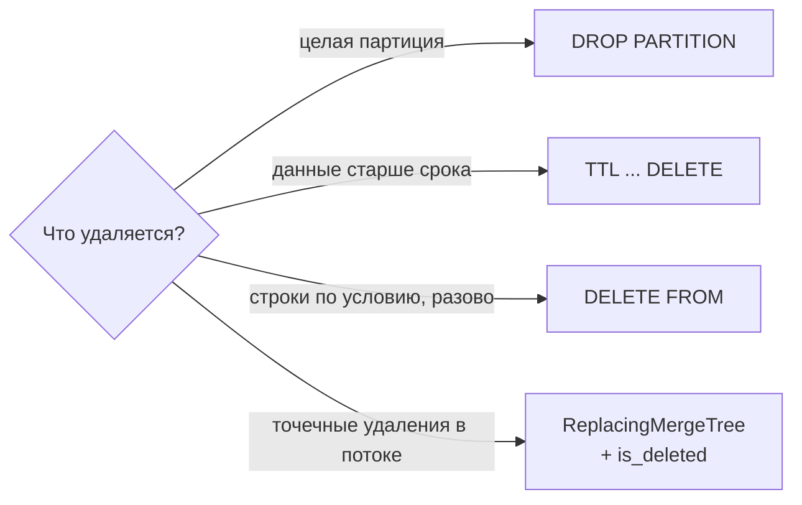

# UPDATE и DELETE

## Содержание

- [Почему изменение данных здесь особенное](#почему-изменение-данных-здесь-особенное)
- [UPDATE: мутации и patch parts](#update-мутации-и-patch-parts)
- [DELETE: маска, мутация, TTL, DROP PARTITION](#delete-маска-мутация-ttl-drop-partition)
- [Interview-ready answer](#interview-ready-answer)

Значения по умолчанию приведены по ветке 26.x; там, где поведение зависит от версии, она указана отдельно.

---

## Почему изменение данных здесь особенное

Кусок на диске неизменяем: файлы колонок пишутся один раз и после этого не правятся ([00-storage-model.md](./00-storage-model.md)). Значит, изменить строку на месте физически невозможно — доступны только три обходных пути.

- **Переписать затронутые колонки parts** с новым значением. Так работают мутации: честно, но дорого.
- **Дописать рядом поправку**, которую чтение накладывает на лету. Так работают лёгкие удаления и лёгкие обновления.
- **Вставить новую версию строки** и позволить движку схлопнуть старую при слиянии. Так работает `ReplacingMergeTree` — [04-deduplication.md](./04-deduplication.md).

Третий путь не выглядит как изменение данных, но остаётся основным для массового CDC/upsert-потока. Patch parts подходят для небольшой доли строк и не превращают ClickHouse в OLTP-базу; тяжёлые мутации оставляют для bulk-исправлений и backfill.

---

## UPDATE: мутации и patch parts

Столбцовое хранение с неизменяемыми parts плохо совместимо с точечным изменением строки. ClickHouse прошёл через три поколения механизмов, и на актуальных версиях доступны все три сразу.

| Механизм | Как работает | Задержка видимости | Когда уместен |
| --- | --- | --- | --- |
| `ALTER TABLE ... UPDATE` | мутация: перезапись изменяемых колонок в затронутых parts | асинхронно, минуты и часы | bulk-исправления данных |
| `UPDATE ... SET` (лёгкое обновление) | patch part только с изменёнными значениями | видно сразу | точечные правки до ~10% таблицы |
| Новая версия строки в `ReplacingMergeTree` | обычная вставка | видно сразу с `FINAL`/`argMax` | регулярные обновления как часть потока данных |

**Мутация.** `ALTER TABLE events UPDATE value = 0 WHERE user_id = 17` не изменяет строки на месте: движок находит затронутые parts и переписывает целиком изменяемые колонки в этих parts. Если в партиции объёмом 200 ГБ колонка `value` занимает 8 ГБ и условие задевает все её parts, порядок перезаписи — 8 ГБ плюс служебное чтение, а не автоматически все 200 ГБ. Для Compact parts и обновления многих колонок цена может приблизиться к полной перезаписи.

```sql
ALTER TABLE events UPDATE value = 0 WHERE user_id = 17;
```

- запрос возвращает управление сразу: `mutations_sync = 0` по умолчанию, работа идёт в фоне;
- очередь и прогресс видны в `system.mutations`;
- незавершённую мутацию можно снять через `KILL MUTATION`, но уже переписанные parts не откатываются;
- мутации упорядочены относительно вставок и других мутаций, но работа над разными parts может распараллеливаться; тяжёлая операция всё равно конкурирует за общий pool и способна задержать следующие;
- снимка данных нет: запрос, идущий параллельно с мутацией, может увидеть часть parts обновлёнными, а часть — нет.

```sql
SELECT database, table, mutation_id, command, parts_to_do, is_done, latest_fail_reason
FROM system.mutations
WHERE is_done = 0;

KILL MUTATION WHERE mutation_id = '0000000042';
```

**Лёгкое обновление.** Начиная с 25.7 доступен обычный синтаксис `UPDATE`, реализованный через patch parts: вместо перезаписи колонок пишется небольшой part с изменёнными значениями и координатами исходных строк. В актуальной реализации для адресации и версионирования используются `_part`, `_part_offset`, `_block_number`, `_block_offset` и `_data_version`; часть колонок нужна для быстрого пути, часть — чтобы найти строку после слияния исходных parts. Это деталь хранения, а не API для приложения. Накладные расходы на строку зависят от адресных колонок и обновлённых значений, поэтому фиксированного числа вроде «40 байт» для capacity planning нет. Значения видны в `SELECT` немедленно, а физически применяются при последующих слияниях или мутациях.

```sql
UPDATE orders SET status = 'refunded' WHERE order_id = 17;
```

Статус и ограничения:

- функция помечена как beta; в 25.7 patch parts включались через `allow_experimental_lightweight_update`, а с 25.8 `enable_lightweight_update = 1` по умолчанию;
- таблица должна материализовать `_block_number` и `_block_offset` через `enable_block_number_column = 1` и `enable_block_offset_column = 1`;
- обновлять колонки первичного ключа и ключа партиционирования нельзя;
- рассчитано на изменение примерно до 10% таблицы; частые мелкие обновления снова упираются в `Too many parts`;
- чтение платит за наложение патчей и дополнительно читает sorting key исходного part;
- индексы пропуска и проекции не используются для parts, у которых есть патчи;
- `update_parallel_mode` (по умолчанию `auto`) определяет поведение при конкурентных обновлениях, `update_sequential_consistency` — видимость чужих обновлений.

**Обновление через движок.** Для регулярных изменений правильный ответ — не `UPDATE` вообще. Новая версия строки вставляется как обычные данные, `ReplacingMergeTree` схлопывает старые версии в фоне, а запросы читают актуальную через `argMax` или `FINAL`. Вставка стоит столько же, сколько любая другая вставка, и не порождает очередь мутаций.

---

## DELETE: маска, мутация, TTL, DROP PARTITION



**`DROP PARTITION`** — самый дешёвый способ. Операция работает с метаданными: каталог партиции помечается неактивным и удаляется. Стоимость не зависит от объёма данных.

```sql
ALTER TABLE events DROP PARTITION '2026-03-01';
```

Именно ради этой операции таблицы событий партиционируют по дате: удержание данных за 90 дней превращается в ежедневный `DROP PARTITION`, а не в удаление миллиардов строк.

**`TTL`** делает то же самое по расписанию:

```sql
ALTER TABLE events MODIFY TTL event_date + INTERVAL 90 DAY DELETE;
```

Настройка таблицы `ttl_only_drop_parts` (по умолчанию `0`) определяет способ: при `1` part удаляется целиком, когда истёк срок у всех его строк — без перезаписи данных. При `0` истёкшие строки вычищаются перезаписью part при слиянии. Для таблиц, где `TTL` выражен через колонку из ключа партиционирования, значение `1` заметно дешевле.

**`DELETE FROM`** (лёгкое удаление) не удаляет данные, а ставит маску: скрытая колонка `_row_exists` помечает строку как невидимую. Последующие запросы автоматически превращаются в `SELECT ... PREWHERE _row_exists WHERE ...`, а гранулы, состоящие только из удалённых строк, пропускаются целиком.

```sql
DELETE FROM events WHERE user_id = 17;
```

- физически строки исчезают при подходящем слиянии; `min_age_to_force_merge_seconds` помогает форсировать старые partitions, но не является обещанием немедленной очистки;
- `lightweight_deletes_sync = 2` по умолчанию: запрос ждёт применения на всех репликах (в ClickHouse Cloud значение по умолчанию `1`);
- `lightweight_delete_mode` по умолчанию `alter_update` — внутри лёгкое удаление выполняется как мутация, ставящая маску; значение `lightweight_update` переводит его на механизм patch parts;
- на таблице с проекциями удаление по умолчанию отклоняется, поведение меняет `lightweight_mutation_projection_mode`;
- удаление большой доли таблицы через маску вредит чтению: маска читается при каждом запросе. Для полной очистки есть `TRUNCATE TABLE`.

**`ALTER TABLE ... DELETE`** — тяжёлая мутация с той же механикой, что и `ALTER TABLE ... UPDATE`: переписываются затронутые данные. Она уместна, когда необходимо физическое удаление, но по умолчанию асинхронна и не означает «прямо сейчас». Для compliance-процедуры задают подходящий `mutations_sync`, ждут `is_done = 1` на репликах, проверяют `latest_fail_reason` и учитывают retention резервных копий.

Порядок предпочтения при проектировании: `DROP PARTITION` → `TTL` → `DELETE FROM` → мутация. Чем ниже по списку, тем больше данных придётся перечитать и переписать.

---

## Interview-ready answer

**1. Почему UPDATE в ClickHouse дорогой?**

- Parts неизменяемы: классическая мутация `ALTER TABLE ... UPDATE` переписывает изменяемые колонки во всех затронутых parts.
- Объём работы определяется размером этих колонок и parts; из размера всей партиции его напрямую вывести нельзя.
- Мутация асинхронна (`mutations_sync = 0`), упорядочена с другими изменениями и не даёт атомарного снимка всей операции.

**2. Что такое лёгкое обновление и лёгкое удаление?**

- Лёгкое удаление `DELETE FROM` ставит скрытую маску `_row_exists`; строки физически исчезают при слиянии.
- Лёгкое обновление `UPDATE ... SET` пишет patch part с изменёнными значениями и координатами строк; overhead зависит от sorting key и значений.
- Значения видны сразу, физически применяются при слиянии; за это платит чтение, накладывающее патчи.
- Статус — beta, рассчитано примерно на 10% таблицы и требует материализованных `_block_number` / `_block_offset`.

**3. Как удалить данные дёшево?**

- `DROP PARTITION` работает с метаданными, стоимость не зависит от объёма.
- `TTL` делает то же по расписанию; с `ttl_only_drop_parts = 1` истёкший кусок удаляется целиком.
- Порядок предпочтения — `DROP PARTITION`, затем `TTL`, затем `DELETE FROM`, и только потом мутация.

**4. Как следить за мутацией и как её остановить?**

- Очередь и прогресс видны в `system.mutations`, поле `parts_to_do` показывает остаток, `latest_fail_reason` — причину сбоя.
- Снять незавершённую мутацию можно через `KILL MUTATION`.
- Ждать завершения — `mutations_sync = 1` или `2`, но только для заведомо коротких операций.

**5. Как правильно обновлять данные регулярно?**

- Не через `UPDATE`, а вставкой новой версии строки в `ReplacingMergeTree`.
- Вставка стоит столько же, сколько любая другая, и не порождает очередь мутаций.
- Читается актуальное состояние через `argMax` или `FINAL`.
