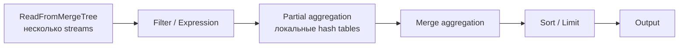

# Выполнение SELECT

## Содержание

- [SELECT: что делает запрос быстрым](#select-что-делает-запрос-быстрым)
- [Query pipeline, память и spill](#query-pipeline-память-и-spill)
- [Примеры запросов](#примеры-запросов)
- [Диагностика запроса](#диагностика-запроса)
- [Interview-ready answer](#interview-ready-answer)

Число строк в таблице само по себе мало говорит о стоимости запроса. Важны объём прочитанных колонок, CPU для выражений и агрегации, кардинальность `GROUP BY`, память для hash tables и сортировки, сеть между шардами и возможный spill на диск. Первый рычаг почти всегда один: не читать лишние данные.

---

## SELECT: что делает запрос быстрым

Стоимость запроса определяется объёмом прочитанных данных. Отсечения применяются последовательно, каждое следующее работает по остатку от предыдущего.

```text
Допущения: 1 млрд строк равномерно за 30 дней,
            24 000 покупок в выбранный день,
            фиксированные гранулы до 8192 строк,
            PARTITION BY event_date,
         ORDER BY (event_type, user_id, event_time)

шаг 1. отсечение партиций   WHERE event_date = '2026-04-15'
       30 партиций -> 1 партиция                        ~33 млн строк

шаг 2. разреженный индекс   AND event_type = 'purchase'
       purchase сгруппированы сортировкой в один диапазон
       24 000 / 8192 -> минимум 3 гранулы;
       из-за несовпадения с границами возможно 4         24 576–32 768 строк

шаг 3. чтение колонок       SELECT user_id, value
       читаются user_id и value; остальные data streams не нужны

шаг 4. PREWHERE             AND value > 100
       условие применяется к прочитанным гранулам
```

**Отсечение партиций** работает, когда условие наложено на колонку выражения `PARTITION BY` напрямую. Оборачивание колонки в функцию (`WHERE toDate(event_time) = ...` при `PARTITION BY event_date`) может лишить запрос отсечения — проверять нужно через `EXPLAIN indexes = 1`.

**Разреженный индекс** работает только по префиксу `ORDER BY`. При ключе `(event_type, user_id, event_time)` условие по одному `user_id` индексом не поддерживается: движок прочитает всю партицию. Лечится это не индексом, а либо перестановкой колонок ключа, либо второй таблицей с другим порядком, либо проекцией.

**`PREWHERE`** сначала читает только колонки дешёвого условия, строит маску выживших строк и лишь потом дочитывает остальные колонки для нужных диапазонов. Это не второй sparse index и не обещание пропустить целую granule: выигрыш возникает за счёт отложенного чтения широких колонок. Перенос условий в `PREWHERE` выполняется автоматически (`optimize_move_to_prewhere = 1`), явная запись нужна только когда измерения показывают неудачный выбор.

**Индексы пропуска данных** (`data skipping index`) хранят сводку на группу гранул: минимум и максимум, множество значений, фильтр Блума. Они не ускоряют чтение, а позволяют его не делать:

```sql
ALTER TABLE events
    ADD INDEX idx_user user_id TYPE minmax GRANULARITY 4;
```

`GRANULARITY 4` означает одну запись индекса на четыре гранулы: при фиксированном `index_granularity = 8192` это до 32 768 строк, а с адаптивной гранулярностью число может быть меньше. Индекс полезен, только если данные физически сгруппированы по индексируемой колонке; для равномерно разбросанных значений `minmax` каждой группы покроет почти весь диапазон и не отсечёт ничего.

**Проекции** хранят вторую копию данных с другим порядком сортировки или предагрегацией, и оптимизатор выбирает её сам:

```sql
ALTER TABLE events ADD PROJECTION by_user (
    SELECT * ORDER BY user_id, event_time
);
ALTER TABLE events MATERIALIZE PROJECTION by_user;
```

Плата — дисковое место и замедление вставки, потому что проекция обновляется вместе с основными данными.

**Согласованность чтения с реплик.** `select_sequential_consistency = 0` по умолчанию: запрос к реплике может не увидеть только что подтверждённую запись, если реплика ещё не догнала журнал. Значение `1` заставляет реплику дождаться актуального состояния, платя за это задержкой и отказами, когда реплика отстала. Для дашбордов первое почти всегда правильнее.

---

## Query pipeline, память и spill

После analyzer и оптимизатора ClickHouse превращает логический план в pipeline из processors. Чтение разбивается на несколько потоков, каждый поток фильтрует и частично агрегирует свой диапазон, затем промежуточные результаты объединяются. `max_threads` ограничивает параллелизм одного запроса, но больше threads не всегда быстрее: они увеличивают давление на CPU, память и соседние запросы.



Три частых потребителя памяти:

- `GROUP BY` держит ключи и состояния агрегатов; важнее числа входных строк бывает число различных ключей;
- hash `JOIN` строит в памяти структуру по build-side — [09-joins-and-dictionaries.md](./09-joins-and-dictionaries.md);
- `ORDER BY` без подходящего порядка хранения материализует и сортирует промежуточный набор.

`max_memory_usage` останавливает запрос, когда он превысил лимит. Для сортировки и агрегации можно разрешить external execution через `max_bytes_before_external_sort` и `max_bytes_before_external_group_by`: запрос продолжит работу со spill на диск, но latency резко вырастет. Это защита от OOM, а не оптимизация. Нужно измерить свободное место и производительность временного диска, иначе spill одного запроса превратится в деградацию всего узла.

Pipeline поддерживает backpressure: если downstream processor, сеть или клиент читают медленно, upstream не должен бесконечно производить blocks в память. Поэтому медленный клиент тоже способен удерживать ресурсы запроса; результат нужно читать до конца или отменять через context.

План и физический pipeline отвечают на разные вопросы:

```sql
EXPLAIN indexes = 1, actions = 1
SELECT event_type, count()
FROM events
WHERE event_date = today()
GROUP BY event_type;

EXPLAIN PIPELINE
SELECT event_type, count()
FROM events
WHERE event_date = today()
GROUP BY event_type;
```

Первый запрос показывает отсечения и выражения, второй — processors и число параллельных streams.

---

## Примеры запросов

Примеры используют таблицу `events`, схема которой разобрана в [02-schema-design.md](./02-schema-design.md).

Агрегация с фильтром по дате (отсечение партиций):

```sql
SELECT event_type, count() AS cnt, sum(value) AS total
FROM events
WHERE event_date >= '2026-04-01'
  AND event_date < '2026-05-01'
GROUP BY event_type
ORDER BY cnt DESC;
```

Временной ряд по часам:

```sql
SELECT
    toStartOfHour(event_time) AS hour,
    count()                   AS events
FROM events
WHERE event_date = today()
GROUP BY hour
ORDER BY hour;
```

Воронка `view → cart → purchase` в течение часа:

```sql
SELECT
    user_id,
    windowFunnel(3600)(
        event_time,
        event_type = 'view',
        event_type = 'cart',
        event_type = 'purchase'
    ) AS step
FROM events
WHERE event_date >= '2026-04-01'
GROUP BY user_id
HAVING step > 0;
```

`countIf` по типам событий не был бы воронкой: он не проверяет порядок. `windowFunnel` возвращает максимальный достигнутый шаг с учётом времени; при событиях с одинаковой меткой времени стоит использовать более точный `DateTime64` и заранее определить tie-break semantics.

---

## Диагностика запроса

Какие отсечения применил планировщик:

```sql
EXPLAIN indexes = 1
SELECT count() FROM events WHERE event_date = '2026-04-15' AND event_type = 'purchase';
```

Вывод показывает, сколько кусков и гранул осталось после каждого шага отбора. Если число гранул совпадает с общим числом в партиции, индекс не сработал — обычно потому, что условие наложено не на префикс `ORDER BY` или колонка обёрнута функцией.

Сколько кусков в партициях таблицы:

```sql
SELECT partition, count() AS parts, sum(rows) AS rows, formatReadableSize(sum(bytes_on_disk)) AS size
FROM system.parts
WHERE table = 'events' AND active
GROUP BY partition
ORDER BY parts DESC;
```

Сколько данных реально прочитал запрос:

```sql
SELECT
    query_duration_ms,
    formatReadableQuantity(read_rows)  AS rows,
    formatReadableSize(read_bytes)     AS bytes,
    formatReadableSize(memory_usage)   AS memory,
    result_rows,
    query
FROM system.query_log
WHERE type = 'QueryFinish' AND event_time > now() - INTERVAL 1 HOUR
ORDER BY query_duration_ms DESC
LIMIT 10;
```

`read_rows` и `read_bytes` показывают объём сканирования, но не объясняют всё. Маленькое чтение может быть медленным из-за дорогого выражения, высокой кардинальности `GROUP BY`, сортировки, `JOIN`, сетевого fan-out или медленного клиента. Для CPU и processor-level времени смотрят `ProfileEvents`, `system.query_thread_log` и при необходимости sampling profiler; для распределённого запроса отдельно проверяют дочерние запросы на шардах.

Практический порядок диагностики:

1. `EXPLAIN indexes = 1` — какие partitions, parts и granules отброшены.
2. `system.query_log` — сколько прочитано, сколько памяти использовано, был ли exception.
3. `EXPLAIN PIPELINE` — где параллелизм, агрегация, сортировка и обмен между узлами.
4. `system.parts`, `system.merges` и состояние диска — не конкурирует ли SELECT с backlog слияний.
5. Повторный замер на холодном и прогретом cache, потому что один запуск не отделяет схему от cache effect.

---

## Interview-ready answer

**1. Какие отсечения проходит запрос и в каком порядке?**

- Отсечение партиций по колонке из `PARTITION BY`; функция над колонкой может его отключить.
- Разреженный индекс по префиксу `ORDER BY`: остаются только гранулы, где значение может быть.
- `PREWHERE`: сначала читаются колонки условия, потом остальные для выживших строк.
- Индексы пропуска и проекции, если данные физически сгруппированы подходящим образом.

**2. Почему условие по средней колонке ключа не помогает?**

- Индекс работает по префиксу: при `ORDER BY (a, b, c)` условие только по `b` не отсекает гранулы.
- Лечится не индексом, а перестановкой колонок ключа, проекцией или второй таблицей с другим порядком.

**3. Что такое PREWHERE?**

- Оптимизация, при которой сначала читаются только колонки условия, а остальные дочитываются лишь для выживших строк.
- Применяется автоматически (`optimize_move_to_prewhere = 1`), явная запись нужна редко.
- Выгода тем больше, чем шире таблица и селективнее условие.

**4. Чем skip-индекс отличается от индекса в PostgreSQL?**

- Он не указывает, где лежит строка, а хранит сводку по группе гранул: минимум и максимум, множество значений, фильтр Блума.
- Помогает только когда данные физически сгруппированы по индексируемой колонке; на равномерно разбросанных значениях бесполезен.

**5. Как понять, почему запрос медленный?**

- `EXPLAIN indexes = 1` показывает, сколько гранул осталось после отбора.
- `system.query_log` показывает `read_rows`, `read_bytes`, память и ошибку: близкое к полному сканирование означает отсутствие отсечения.
- `EXPLAIN PIPELINE` показывает параллельные processors, агрегацию, сортировку и обмен данными.
- `system.parts` показывает число кусков — слишком большое замедляет любое чтение.
