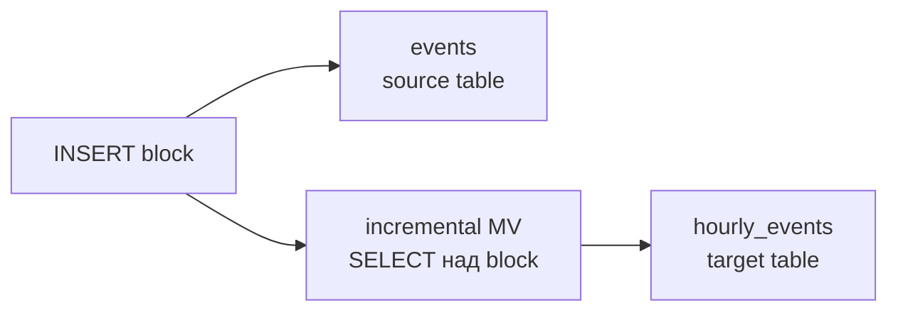

# Materialized views

## Содержание

- [Два вида materialized views](#два-вида-materialized-views)
- [Incremental materialized view](#incremental-materialized-view)
- [Состояния агрегатов](#состояния-агрегатов)
- [Границы incremental view](#границы-incremental-view)
- [Ошибки, retry и дедупликация](#ошибки-retry-и-дедупликация)
- [Безопасный backfill](#безопасный-backfill)
- [Refreshable materialized view](#refreshable-materialized-view)
- [Как выбрать](#как-выбрать)
- [Interview-ready answer](#interview-ready-answer)
- [Официальная документация](#официальная-документация)

Materialized view переносит вычисления из горячего `SELECT` в insert-time или в периодический refresh. Выигрыш не бесплатный: запись становится дороже, появляется target table со своим lifecycle, а ошибка между source и target требует понимания retry и дедупликации.

---

## Два вида materialized views

В современном ClickHouse есть две разные модели.

| Вид | Когда выполняется | Что читает | Freshness | Типичная задача |
| --- | --- | --- | --- | --- |
| incremental | на каждом `INSERT` в source | только новый insert block | почти real-time | предагрегация, фильтрация, fan-out |
| refreshable | по расписанию | полный результат запроса | равна интервалу refresh | сложный `JOIN`, периодический snapshot, rebuild |

Incremental view похож на insert trigger. Refreshable view ближе к materialized view в традиционной СУБД: запрос периодически выполняется заново, а результат атомарно заменяет target. Нельзя переносить ограничения одной модели на другую.

---

## Incremental materialized view

При вставке в `events` новый block проходит через запрос view, а результат записывается в отдельную target table.



Source table и target table создаются отдельно:

```sql
CREATE TABLE hourly_events
(
    hour        DateTime,
    event_type  LowCardinality(String),
    events      AggregateFunction(count)
)
ENGINE = AggregatingMergeTree
PARTITION BY toYYYYMM(hour)
ORDER BY (hour, event_type);

CREATE MATERIALIZED VIEW hourly_events_mv
TO hourly_events
AS
SELECT
    toStartOfHour(event_time) AS hour,
    event_type,
    countState()              AS events
FROM events
GROUP BY hour, event_type;
```

`TO hourly_events` важно: данные принадлежат target table, а view хранит transform и подписку на source. Backup, TTL, `ORDER BY`, replication и monitoring проектируются для обеих таблиц.

Стоимость transform входит в latency вставки. Пять views означают пять дополнительных pipeline. По умолчанию они обрабатываются последовательно; `parallel_view_processing = 1` может уменьшить latency fan-out, но увеличивает одновременное потребление CPU и памяти. Включать его следует после измерений.

---

## Состояния агрегатов

Готовое среднее нельзя корректно усреднить ещё раз: `avg(10, 20)` и `avg(1000)` имеют разный вес. Поэтому target для сложных агрегатов хранит промежуточное состояние через комбинатор `-State`, а запрос объединяет состояния через `-Merge`.

```sql
CREATE TABLE hourly_users
(
    hour         DateTime,
    event_type   LowCardinality(String),
    users_state  AggregateFunction(uniqCombined64, UInt64),
    value_state  AggregateFunction(avg, Float64)
)
ENGINE = AggregatingMergeTree
ORDER BY (hour, event_type);

CREATE MATERIALIZED VIEW hourly_users_mv
TO hourly_users
AS
SELECT
    toStartOfHour(event_time)    AS hour,
    event_type,
    uniqCombined64State(user_id) AS users_state,
    avgState(value)              AS value_state
FROM events
GROUP BY hour, event_type;
```

Чтение повторяет точные функции и типы:

```sql
SELECT
    hour,
    event_type,
    uniqCombined64Merge(users_state) AS users,
    avgMerge(value_state)            AS avg_value
FROM hourly_users
WHERE hour >= today()
GROUP BY hour, event_type
ORDER BY hour, event_type;
```

Колонки `GROUP BY` во view обычно должны совпадать с `ORDER BY` target table. Иначе parts не сходятся по ожидаемому ключу, а запросу приходится объединять лишние состояния. Имена и типы результата view нужно сверять со схемой target: не рассчитывать на неявные преобразования в production DDL.

---

## Границы incremental view

Incremental view видит только вставляемый block, а не «изменившуюся таблицу целиком». Из этого следуют ограничения.

- `ALTER ... UPDATE`, `DELETE`, `DROP PARTITION` и merge source table не переигрывают уже записанный target.
- Для `ReplacingMergeTree` каждая новая версия сущности является новой вставкой. Наивный `countState()` посчитает версии, а не текущее число сущностей.
- В `JOIN` только самая левая source table запускает view. Изменение правой dimension table не обновит старые target rows.
- Правая сторона `JOIN` читается при каждом source insert, поэтому большая таблица увеличивает insert latency. Для lookup чаще подходят dictionary или refreshable view — [09-joins-and-dictionaries.md](./09-joins-and-dictionaries.md).
- Cascading views получают blocks, записанные предыдущей view, а не её «окончательно слитое состояние». В цепочке используют агрегатные states и `-MergeState`, а не предполагают, что merge уже прошёл.

Пример опасной схемы: source — `ReplacingMergeTree` с заказами, view делает `sum(amount)` по дню. Каждое обновление заказа снова добавляет полную сумму, поэтому target завышен. Варианты решения:

- писать в source не состояния заказов, а аддитивные изменения суммы;
- хранить raw history и считать актуальное состояние через `argMax`;
- периодически пересобирать результат refreshable view;
- поддерживать отдельный корректирующий поток `+delta` / `-delta`.

---

## Ошибки, retry и дедупликация

По умолчанию ошибка incremental view возвращает ошибку всего `INSERT`. Однако это **не означает rollback** source и всех target tables: к моменту ошибки часть данных уже могла быть зафиксирована. `materialized_views_ignore_errors = 1` меняет reporting, но также не создаёт транзакцию.

```text
source записан -> target A записан -> target B вернул ошибку -> клиент видит ошибку

неизвестно без проверки:
  - какие таблицы уже получили block;
  - безопасен ли retry на текущей версии и с текущими settings;
  - не задвоит ли retry агрегатное состояние.
```

Правило retry:

1. Повторять тот же детерминированный batch с тем же стабильным `insert_deduplication_token`.
2. Не менять порядок строк, границы batch и настройки дедупликации между попытками.
3. На 25.8 явно тестировать `insert_deduplicate` и `deduplicate_blocks_in_dependent_materialized_views`; на 26.2+ учитывать приоритет `deduplicate_insert`.
4. Проверять source и targets по source batch ID, а не только факт успешного ответа последней попытки.

Для `AggregatingMergeTree` повтор transform создаёт дополнительное агрегатное state. Строки с одинаковым ключом позднее сольются, но `sumMerge`, `countMerge` и похожие функции объединят оба состояния — итог удвоится. Merge не исправляет логический дубль.

Подробнее о version matrix и окне — [04-deduplication.md](./04-deduplication.md).

---

## Безопасный backfill

`POPULATE` запускает чтение существующих данных при создании view, но не даёт удобной границы с конкурентными вставками: часть строк можно пропустить или обработать дважды. Для production backfill лучше использовать явный watermark.

Вариант с монотонным `source_offset`:

1. Зафиксировать watermark `W`, до которого источник уже стабилен.
2. Создать target и view с условием `WHERE source_offset > W`.
3. Загрузить историю напрямую в target тем же transform с `WHERE source_offset <= W`.
4. Сравнить контрольные суммы, ключи группировки и totals по обе стороны watermark.
5. Оставить фильтр, если offsets строго растут; иначе после backfill заменить query view и отдельно обработать late events.

```sql
INSERT INTO hourly_events
SELECT
    toStartOfHour(event_time) AS hour,
    event_type,
    countState()              AS events
FROM events
WHERE source_offset <= 9000000
GROUP BY hour, event_type;
```

Сам backfill обычно является `INSERT ... SELECT`, поэтому его retry тоже проектируют явно. В 26.7 режим `deduplicate_insert_select = 'enable_when_possible'` может отключить защиту, если план не доказывает стабильный результат; для повторяемого slice нужны детерминированный порядок/границы и стабильный token либо target, который можно безопасно пересобрать.

Если стабильного watermark нет, самый простой корректный путь — коротко остановить producers, создать view, выполнить backfill и возобновить запись. Операционно это иногда дешевле сложной reconciliation-процедуры.

---

## Refreshable materialized view

Refreshable view выполняет полный запрос по расписанию. Без `APPEND` новый результат атомарно заменяет прежний target, поэтому модель подходит для сложных `JOIN`, пересчёта текущего состояния и небольшой допустимой задержки.

```sql
CREATE TABLE daily_order_summary
(
    day       Date,
    orders    UInt64,
    revenue   Decimal(38, 2)
)
ENGINE = MergeTree
ORDER BY day;

CREATE MATERIALIZED VIEW daily_order_summary_mv
REFRESH EVERY 5 MINUTE TO daily_order_summary
AS
SELECT
    toDate(updated_at) AS day,
    count()             AS orders,
    sum(amount)         AS revenue
FROM orders FINAL
WHERE is_deleted = 0
GROUP BY day;
```

Цена refresh — полный запрос каждые пять минут. Если он длится четыре минуты и читает терабайты, расписание создаёт почти постоянную фоновую нагрузку. Интервал выбирают из двух требований: допустимая stale data и фактическая длительность refresh с запасом.

`APPEND` не заменяет target, а добавляет результат каждого запуска. Это удобно для snapshots:

```sql
CREATE MATERIALIZED VIEW queue_depth_snapshot_mv
REFRESH EVERY 1 MINUTE APPEND TO queue_depth_snapshots
AS
SELECT now() AS captured_at, queue, sum(depth) AS depth
FROM queue_metrics
GROUP BY queue;
```

Состояние и стоимость refresh видны в `system.view_refreshes`; принудительный запуск — `SYSTEM REFRESH VIEW view_name`. Для цепочек refreshable views можно задать dependencies, но это уже scheduler DAG: нужно мониторить длительность, failures и накопление задержки.

---

## Как выбрать

| Требование | Выбор | Почему |
| --- | --- | --- |
| секундная свежесть и аддитивный transform | incremental | обрабатывает только новый block |
| фильтрация или копия с другим `ORDER BY` | incremental | дешёвый fan-out на insert-time |
| сложный `JOIN`, обе стороны меняются | refreshable | полный запрос видит актуальные стороны |
| текущий snapshot поверх update/delete | refreshable | пересчёт исправляет старый результат |
| история периодических snapshots | refreshable + `APPEND` | каждый refresh добавляет срез |
| transform слишком тяжёлый для INSERT | refreshable или внешний pipeline | write latency не зависит от transform |

Не выбирать materialized view автоматически. Если исходный запрос и так читает мало данных и укладывается в SLO, дополнительная target table, backfill и reconciliation могут стоить дороже сохранённых миллисекунд.

---

## Interview-ready answer

**1. Какие materialized views есть в ClickHouse?**

- Incremental view запускается на каждом `INSERT` и видит только новый block.
- Refreshable view по расписанию выполняет полный запрос и заменяет target; с `APPEND` добавляет snapshots.
- Первая даёт минимальную задержку, вторая поддерживает сложный пересчёт ценой stale data и полной стоимости refresh.

**2. Зачем нужны AggregateFunction и комбинаторы State/Merge?**

- Target хранит промежуточное состояние агрегата, которое можно корректно объединить с состояниями следующих blocks.
- View пишет `countState`, `avgState`, `uniqState`; запрос читает через соответствующие `countMerge`, `avgMerge`, `uniqMerge`.
- Готовые averages и approximate distinct counts нельзя корректно складывать как обычные числа.

**3. Что incremental view не отслеживает?**

- UPDATE, DELETE, merge и DROP PARTITION source table не переигрывают target.
- Изменение правой таблицы `JOIN` не запускает view; trigger — только INSERT в левую source table.
- `ReplacingMergeTree` не превращает поток версий в аддитивный поток автоматически.

**4. Что происходит при ошибке view?**

- Клиент обычно получает ошибку INSERT, но общего rollback source и всех targets нет.
- Retry обязан повторять тот же batch и token с включённой end-to-end дедупликацией.
- Для агрегатов физическое слияние одинаковых ключей не исправляет дважды добавленное state.

**5. Как делать backfill?**

- Не полагаться на `POPULATE` при конкурентной записи.
- Разделить history и live поток стабильным watermark, загрузить историю напрямую в target тем же transform и сверить totals.
- Если watermark нет, краткая остановка producers может быть самым простым корректным решением.

---

## Официальная документация

- [Incremental materialized views](https://clickhouse.com/docs/concepts/features/materialized-views/incremental-materialized-view)
- [Refreshable materialized views](https://clickhouse.com/docs/concepts/features/materialized-views/refreshable-materialized-view)
- [Cascading materialized views](https://clickhouse.com/docs/guides/developer/cascading-materialized-views)
- [Deduplicating inserts on retries](https://clickhouse.com/docs/concepts/features/operations/insert/deduplicating-inserts-on-retries)
