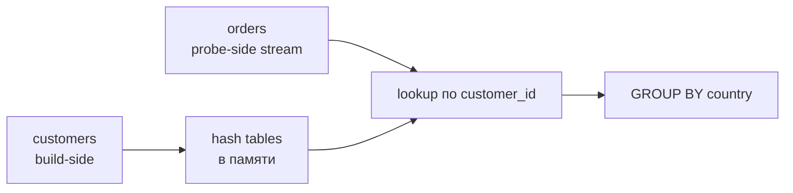

# JOIN и dictionaries

## Содержание

- [Нужно ли всегда денормализовать](#нужно-ли-всегда-денормализовать)
- [Как выполняется hash JOIN](#как-выполняется-hash-join)
- [JOIN strictness: ALL, ANY, SEMI и ANTI](#join-strictness-all-any-semi-и-anti)
- [Алгоритмы JOIN](#алгоритмы-join)
- [Как уменьшить стоимость JOIN](#как-уменьшить-стоимость-join)
- [ASOF JOIN](#asof-join)
- [Dictionaries и direct JOIN](#dictionaries-и-direct-join)
- [Как выбрать между JOIN, dictionary и денормализацией](#как-выбрать-между-join-dictionary-и-денормализацией)
- [Диагностика](#диагностика)
- [Interview-ready answer](#interview-ready-answer)
- [Официальная документация](#официальная-документация)

Совет «в ClickHouse любой JOIN плох, всегда денормализуйте» устарел. Современный optimizer умеет переставлять таблицы, проталкивать filters и выбирать между hash, sort-merge и direct algorithms. Но JOIN всё ещё имеет цену: build-side занимает память, промежуточные строки увеличивают CPU и network, а при высокой concurrency одна и та же dimension строится снова для каждого запроса.

---

## Нужно ли всегда денормализовать

Денормализация переносит стоимость соединения в ingestion pipeline.

| Подход | Сильная сторона | Цена |
| --- | --- | --- |
| широкая таблица | минимальная read latency | сложный backfill, повтор данных, stale dimensions |
| runtime JOIN | гибкая схема и актуальные dimensions | CPU/память на каждый запрос |
| dictionary | быстрый lookup по ключу | ограниченная join semantics, refresh lifecycle |
| materialized view | заранее подготовленный shape | write amplification и reconciliation |

Если dimension меняется редко, а один и тот же lookup выполняется тысячами запросов, dictionary или денормализация обычно выгоднее. Если аналитики постоянно меняют связи и фильтры, runtime JOIN может быть дешевле операционно.

Решение принимают по latency SLO, concurrency, размеру build-side, частоте изменения dimensions и стоимости backfill, а не по общему правилу «JOIN запрещён».

---

## Как выполняется hash JOIN

Для запроса:

```sql
SELECT c.country, sum(o.amount)
FROM orders AS o
INNER JOIN customers AS c ON o.customer_id = c.customer_id
GROUP BY c.country;
```

типичный parallel hash JOIN проходит две фазы:



Build-side загружается в hash table, probe-side проходит потоково. Поэтому размер правой стороны напрямую влияет на peak memory. Современный optimizer умеет менять порядок соединения на основе статистик, но хорошая схема всё равно должна уменьшать данные до JOIN.

Если в `customers` несколько строк на `customer_id`, обычный `ALL INNER JOIN` размножает order на число совпадений. Это может быть корректно, но часто означает незамеченный дубль dimension. Перед оптимизацией нужно определить cardinality отношения: one-to-one, many-to-one или many-to-many.

---

## JOIN strictness: ALL, ANY, SEMI и ANTI

ClickHouse явно отделяет вид JOIN от strictness.

| Конструкция | Результат |
| --- | --- |
| `ALL INNER JOIN` | все комбинации совпавших строк |
| `ANY LEFT JOIN` | не более одного совпадения справа |
| `LEFT SEMI JOIN` | только строки слева, для которых совпадение существует |
| `LEFT ANTI JOIN` | только строки слева без совпадения |

`ANY` уменьшает Cartesian multiplication, но не является лечением грязной dimension. Какая из нескольких строк справа победит, зависит от данных и настроек; если нужна «последняя версия», сначала детерминированно подготовьте dimension через `argMax`, `FINAL` или отдельную current-state table.

```sql
SELECT o.order_id
FROM orders AS o
LEFT ANTI JOIN refunds AS r ON o.order_id = r.order_id;
```

С `join_use_nulls = 0` отсутствующие значения outer JOIN заполняются значениями типа по умолчанию (`0`, пустая строка), а не `NULL`. Это быстро, но `customer_id = 0` можно перепутать с отсутствием строки. `join_use_nulls = 1` ближе к стандартному SQL, ценой `Nullable` и дополнительной обработки.

---

## Алгоритмы JOIN

| Алгоритм | Модель | Память | Когда уместен |
| --- | --- | --- | --- |
| `parallel_hash` | параллельно строит hash tables | build-side в памяти | обычный быстрый equi-join |
| `hash` | одна hash table | build-side в памяти | меньше overhead на небольших данных |
| `grace_hash` | разбивает данные на buckets и spill | ограниченная, использует диск | большая правая сторона |
| `full_sorting_merge` | сортирует обе стороны и сливает | низкая/средняя | обе стороны большие, ключи близки к sort order |
| `partial_merge` | сортирует правую сторону, левую blocks | низкая | memory-constrained сценарий |
| `direct` | lookup в key-value storage | без build hash table | dictionary/Join-engine/совместимый key-value source |

`join_algorithm = 'auto'` позволяет ClickHouse выбирать и менять стратегию при нехватке памяти. Начиная с 26.4 hash/parallel hash join умеет автоматически переходить к `grace_hash` и spill при настроенном `max_bytes_before_external_join`; в 26.6 появился относительный `max_bytes_ratio_before_external_join`. Spill спасает от OOM, но платит disk I/O и не превращает плохой many-to-many JOIN в хороший.

`full_sorting_merge` особенно интересен, когда физический порядок обеих таблиц совпадает с join key: часть сортировки можно пропустить. Это проверяют планом и измерением, а не только совпадением названий колонок.

---

## Как уменьшить стоимость JOIN

1. Отфильтровать и агрегировать обе стороны до соединения.
2. Не выбирать ненужные колонки build-side: широкие strings увеличивают hash table.
3. Привести ключи к одному физическому типу до hot query; runtime cast мешает оптимизациям и расходует CPU.
4. Проверить cardinality: неожиданный many-to-many взрывает число строк.
5. Собрать статистики и проверить, что optimizer поставил меньшую сторону в build phase.
6. Для повторяющегося lookup рассмотреть dictionary или target materialized view.

```sql
SELECT c.country, o.revenue
FROM
(
    SELECT customer_id, sum(amount) AS revenue
    FROM orders
    WHERE order_date >= today() - 7
    GROUP BY customer_id
) AS o
INNER JOIN
(
    SELECT customer_id, country
    FROM customers
    WHERE active = 1
) AS c USING customer_id;
```

Здесь build и probe получают меньше строк, чем JOIN сырых orders с полной customer history. Optimizer умеет pushdown многих filters, но подзапрос полезен как явная граница и как способ проверить intermediate cardinality.

---

## ASOF JOIN

`ASOF JOIN` ищет точное совпадение по equality key и ближайшую строку по времени. Типичная задача — сопоставить trade с последней известной quote.

```sql
SELECT
    t.symbol,
    t.trade_time,
    t.price AS trade_price,
    q.price AS quote_price
FROM trades AS t
ASOF LEFT JOIN quotes AS q
    ON t.symbol = q.symbol
   AND t.trade_time >= q.quote_time;
```

Для каждого trade выбирается quote того же symbol с максимальным `quote_time`, не превышающим `trade_time`. Качество схемы определяется сортировкой по `(symbol, time)`, объёмом временного диапазона и точностью timestamps.

ASOF не заменяет бизнес-правило допустимой давности quote. Если значение старше пяти минут уже невалидно, после JOIN добавляют проверку `trade_time - quote_time <= 300` и явно обрабатывают отсутствие подходящего значения.

---

## Dictionaries и direct JOIN

Dictionary загружает dimension как key-value structure и обновляет её по `LIFETIME` или invalidate query. Lookup выполняется функцией:

```sql
SELECT
    customer_id,
    dictGetOrNull('customer_country', 'country', customer_id) AS country,
    sum(amount) AS revenue
FROM orders
WHERE order_date = today()
GROUP BY customer_id, country;
```

Либо optimizer использует direct JOIN, если semantics и storage поддерживаются. В примере `customer_dictionary` — табличное представление dictionary (например, таблица с движком `Dictionary`), а не обычная `MergeTree`-таблица:

```sql
SELECT o.order_id, c.country
FROM orders AS o
LEFT ANY JOIN customer_dictionary AS c
    ON o.customer_id = c.customer_id
SETTINGS join_algorithm = 'direct';
```

Частые layouts:

| Layout | Поведение | Ограничение |
| --- | --- | --- |
| `FLAT` | массив по плотному UInt64 key | огромный sparse key расходует память |
| `HASHED` | hash table в памяти | весь dictionary должен помещаться |
| `COMPLEX_KEY_HASHED` | составной ключ | больше memory/CPU на key |
| `CACHE` / `SSD_CACHE` | загружает значения по запросу | miss обращается к source, latency нестабильна |

Dictionary даёт eventual freshness. Значение может быть старее source до следующего reload; reload может упасть, а старый dictionary продолжит обслуживать запросы. Нужно мониторить `system.dictionaries`, `status`, `last_exception`, размер и hit rate cache-layout.

`dictGet` возвращает настроенное значение по умолчанию для отсутствующего ключа; `dictGetOrNull` позволяет отличить miss. Нельзя молча превращать неизвестного клиента в страну `''` и затем считать это реальной категорией.

---

## Как выбрать между JOIN, dictionary и денормализацией

| Ситуация | Предпочтение |
| --- | --- |
| dimension мала, запросы исследовательские | runtime JOIN |
| lookup по одному ключу повторяется часто | dictionary/direct JOIN |
| жёсткий latency SLO, shape запроса стабилен | денормализация или materialized view |
| обе стороны часто меняются, допустим refresh lag | refreshable materialized view |
| many-to-many аналитика | runtime JOIN с ранним filter/aggregation |
| dimension должна быть историчной на момент события | записать атрибут в event или версионировать dimension |

Особенно важно последнее: dictionary обычно возвращает **текущее** значение. Если страна клиента изменилась, отчёт за прошлый месяц может измениться. Для event-time semantics атрибут фиксируют в событии либо делают temporal model, а не lookup current value.

---

## Диагностика

```sql
EXPLAIN actions = 1
SELECT ... FROM orders JOIN customers USING customer_id;

EXPLAIN PIPELINE
SELECT ... FROM orders JOIN customers USING customer_id;
```

Проверяют:

- какая сторона build и сколько строк в неё входит;
- сработали ли filter pushdown и join reordering;
- какой algorithm выбран и был ли spill;
- peak `memory_usage`, `read_rows` обеих сторон и число result rows;
- не вырос ли результат в десятки раз из-за many-to-many;
- для dictionary — freshness, status, memory и cache hit rate.

Тестировать JOIN следует под целевой concurrency. Один запрос может помещаться в 10 ГиБ, но 20 одновременных копий уже не помещаются в 128 ГиБ узла.

---

## Interview-ready answer

**1. Почему JOIN может быть дорогим?**

- Hash JOIN строит в памяти структуру по build-side и затем пропускает через неё probe-side.
- Цена определяется размером и шириной build-side, cardinality результата и concurrency.
- Ранние filters и aggregation часто важнее ручного выбора algorithm.

**2. Чем ANY JOIN отличается от ALL JOIN?**

- `ALL` возвращает все комбинации совпадений.
- `ANY` оставляет не более одного совпадения справа и защищает от размножения строк, но не определяет бизнес-правило выбора версии.

**3. Когда нужен grace_hash или sort-merge?**

- `grace_hash` использует partitions и spill, когда build-side не помещается в память.
- `full_sorting_merge` полезен для больших сторон и особенно при подходящем физическом порядке.
- Оба экономят память ценой I/O или сортировки.

**4. Когда dictionary лучше JOIN?**

- Когда нужен частый lookup небольшого набора атрибутов по ключу.
- Direct lookup не строит hash table заново для каждого запроса.
- Цена — отдельный refresh lifecycle и eventual freshness.

**5. Что делает ASOF JOIN?**

- Сочетает equality key с ближайшим значением по времени, например trade с последней quote.
- Бизнес-ограничение максимальной давности проверяется отдельно.

---

## Официальная документация

- [Using JOINs in ClickHouse](https://clickhouse.com/docs/guides/joining-tables)
- [JOIN clause](https://clickhouse.com/docs/sql-reference/statements/select/join)
- [Dictionaries](https://clickhouse.com/docs/dictionary)
- [Dictionary functions](https://clickhouse.com/docs/sql-reference/functions/ext-dict-functions)
- [Choosing a JOIN algorithm](https://clickhouse.com/docs/guides/joining-tables#choosing-a-join-algorithm)
