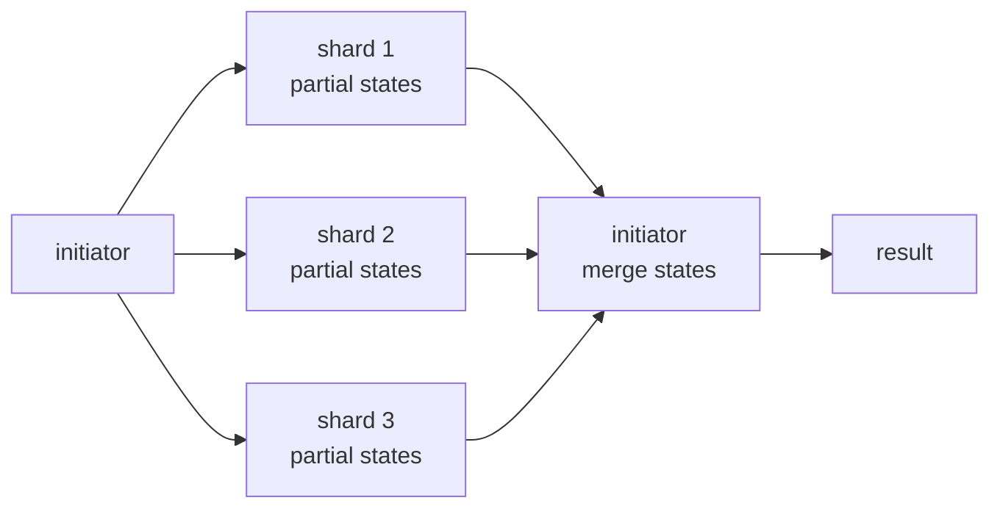

# Шардирование, репликация и Keeper

## Содержание

- [Шардирование и репликация решают разные задачи](#шардирование-и-репликация-решают-разные-задачи)
- [Топология кластера](#топология-кластера)
- [ReplicatedMergeTree и Keeper](#replicatedmergetree-и-keeper)
- [Distributed table](#distributed-table)
- [Как выбрать sharding key](#как-выбрать-sharding-key)
- [Чтение и агрегация по шардам](#чтение-и-агрегация-по-шардам)
- [IN, GLOBAL IN и distributed subquery](#in-global-in-и-distributed-subquery)
- [Quorum и read-after-write](#quorum-и-read-after-write)
- [Отказы и наблюдаемость](#отказы-и-наблюдаемость)
- [Interview-ready answer](#interview-ready-answer)
- [Официальная документация](#официальная-документация)

Распределённый ClickHouse — это не одна таблица, магически растянутая на серверы. На каждом узле лежит локальная MergeTree-таблица, репликация синхронизирует копии внутри shard, а `Distributed` table маршрутизирует inserts и queries между shards.

---

## Шардирование и репликация решают разные задачи

| Механизм | Что делает | Чего не делает |
| --- | --- | --- |
| sharding | делит данные между узлами | не создаёт копию данных |
| replication | хранит копии одного shard | не увеличивает объём уникальных данных |

Два shards без replicas удваивают capacity, но отказ одного узла теряет доступ к половине данных. Один shard с двумя replicas переживает отказ узла, но обе copies содержат тот же объём. Production-топология часто сочетает оба механизма.

```text
cluster analytics

  shard 1                         shard 2
  ├── replica 1a                  ├── replica 2a
  └── replica 1b                  └── replica 2b

  уникальные данные: shard 1 + shard 2
  copies каждого набора: две
```

Replication не является backup: ошибочный `DROP`, mutation или испорченные данные реплицируются на остальные copies. Backup имеет отдельный lifecycle — [12-operations.md](./12-operations.md).

---

## Топология кластера

Кластер описывается в `remote_servers` либо управляется облачной платформой. Для self-managed конфигурации важны:

- список shards и replicas;
- `internal_replication = true`, если локальные таблицы сами реплицируются;
- macros `{shard}` и `{replica}`, уникальные для узла;
- отдельный нечётный quorum Keeper, обычно три или пять узлов.

`internal_replication = true` означает: `Distributed` отправляет block одной replica выбранного shard, а `ReplicatedMergeTree` размножает его внутри shard. При неверной настройке initiator может отправлять block каждой replica сам, что меняет failure и deduplication semantics.

DDL с `ON CLUSTER` ставит задания узлам через distributed DDL queue. Это не одна транзакция: часть узлов может применить DDL, а часть временно отстать или вернуть ошибку. После миграции проверяют schema на всех replicas, а не только успешный ответ initiator.

---

## ReplicatedMergeTree и Keeper

Локальная таблица каждого shard:

```sql
CREATE TABLE events_local ON CLUSTER analytics
(
    event_date Date,
    event_time DateTime64(3, 'UTC'),
    tenant_id  UInt64,
    user_id    UInt64,
    event_type LowCardinality(String),
    value      Float64
)
ENGINE = ReplicatedMergeTree(
    '/clickhouse/tables/{shard}/analytics/events_local',
    '{replica}'
)
PARTITION BY toYYYYMM(event_date)
ORDER BY (tenant_id, event_type, event_time, user_id);
```

Keeper хранит coordination metadata: replicated log, очередь операций, имена parts и identifiers для дедупликации. Сами column files находятся на data nodes и передаются напрямую между replicas. Поэтому размер Keeper определяется количеством metadata operations, а не терабайтами таблиц; лавина маленьких inserts опасна и для data disks, и для Keeper.

Replicas равноправны: insert может принять любая. Остальные выполняют записи replicated log, локально строят/сливают parts либо скачивают готовый part. Фоновая репликация означает, что две replicas некоторое время могут иметь разную свежесть.

Для ClickHouse Cloud используется SharedMergeTree: compute replicas работают с общим object storage и shared metadata. Основные идеи shard/read fan-out сохраняются, но локальные очереди копирования parts и self-managed Keeper нельзя переносить на Cloud буквально.

---

## Distributed table

Поверх локальных таблиц создаётся stateless router:

```sql
CREATE TABLE events ON CLUSTER analytics
AS events_local
ENGINE = Distributed(
    analytics,
    analytics,
    events_local,
    cityHash64(tenant_id)
);
```

Аргументы: имя cluster, database, local table и sharding expression. `SELECT` из `events` отправляет subquery на shards; `INSERT` вычисляет shard для каждой строки.

По умолчанию обычный `Distributed` engine может сначала записать data в локальную очередь initiator и отправить её shards асинхронно. `insert_distributed_sync = 1` ждёт доставки remote shards, но не создаёт общую транзакцию: shard 1 может принять block, shard 2 — нет. Retry требует детерминированного sharding и дедупликации на local replicated tables.

Альтернатива — producer сам выбирает shard и пишет прямо в `events_local`. Это убирает queue initiator и даёт явный backpressure, но topology и failover становятся ответственностью клиента.

---

## Как выбрать sharding key

Хороший ключ решает три задачи:

1. **Равномерность.** Ни один shard не получает заметно больше bytes, rows или hot tenants.
2. **Локальность запросов.** Данные, которые часто анализируют вместе, по возможности находятся на одном shard.
3. **Стабильность.** Retry одной строки должен выбрать тот же shard.

`cityHash64(tenant_id)` сохраняет tenant на одном shard и позволяет tenant-scoped запросу идти на один узел, если optimizer знает sharding key. Цена — один крупный tenant создаёт hotspot. Hash по `user_id` распределит такого tenant равномернее, но tenant-wide запросы пойдут на все shards.

`rand()` хорошо балансирует независимые события, но retry может выбрать другой shard, а versions одной сущности разойдутся. Для `ReplacingMergeTree` это особенно опасно: background merge не пересекает ни partitions, ни shards. Все версии deduplication key обязаны маршрутизироваться одинаково.

Перед выбором считают не только число rows:

```text
допущение: 100 tenants, один даёт 45% traffic

hash(tenant_id) на 4 shards:
  среднее ожидание = 25%,
  но shard крупного tenant получит минимум 45% потока

вывод: формально hash равномерный по ключам, но не по нагрузке
```

Для такого случая применяют composite key, отдельный shard крупного tenant или bucket внутри tenant, если access patterns допускают fan-out.

---

## Чтение и агрегация по шардам

Распределённый `GROUP BY` обычно выполняется в два этапа:



В классическом плане `Distributed` ClickHouse отправляет между узлами промежуточные aggregate states, а не обязательно все raw rows. Но запрос с high-cardinality `GROUP BY`, global sort или many-to-many JOIN может вернуть initiator огромный промежуточный набор и сделать его bottleneck.

В ClickHouse Cloud 26.x развивается multi-stage distributed execution: exchange operators могут shuffle-ить данные по ключу между workers, поэтому финальная агрегация или build-side JOIN не обязательно остаются на одном initiator. Это отдельный Cloud execution path; переносить его свойства на обычный self-managed `Distributed` cluster нельзя без проверки фактического плана.

Практические правила:

- фильтровать по partition и sharding keys как можно раньше;
- агрегировать на shards до передачи;
- не использовать `SELECT *` в distributed query;
- лимитировать память и network bytes на initiator и remote queries;
- измерять skew: самый медленный shard определяет latency всего запроса;
- различать user query и дочерние queries по `initial_query_id` в `system.query_log`.

---

## IN, GLOBAL IN и distributed subquery

Обычный `IN (subquery)` в distributed query выполняет subquery на каждом shard. Если правая таблица также sharded, каждый shard видит только локальный fragment. Это корректно лишь когда связанные ключи colocated.

`GLOBAL IN` выполняет subquery на initiator, материализует набор и рассылает его shards:

```sql
SELECT count()
FROM events
WHERE user_id GLOBAL IN
(
    SELECT user_id
    FROM premium_users
    WHERE active = 1
);
```

Теперь каждый shard получает полный набор premium users. Цена — broadcast: миллион широких keys копируется на каждый shard. Перед `GLOBAL IN` правую сторону фильтруют, выбирают только key, применяют `DISTINCT` при необходимости и ограничивают `max_rows_in_set` / `max_bytes_in_set`.

`distributed_product_mode = 'deny'` по умолчанию защищает от случайного double-distributed subquery, который создаёт произведение shards. Обходить его настройкой `'allow'` без понимания плана — способ умножить число remote requests. Правильнее выбрать colocation, `GLOBAL`, local table в subquery или переписать pipeline.

---

## Quorum и read-after-write

Обычная successful insert подтверждает запись на принимающей replica; остальные догоняют асинхронно. `insert_quorum = 2` требует, чтобы block был записан на две replicas shard до ответа клиенту. Это повышает durability, но:

- не даёт atomicity между shards;
- увеличивает latency;
- снижает availability, если quorum недоступен;
- не заменяет idempotency при потерянном ответе.

`select_sequential_consistency = 1` даёт более сильную последовательную видимость для поддерживаемого replicated/quorum сценария, но может ждать или отклонить чтение с отставшей replica. Это не глобальная linearizability всего distributed cluster.

Для read-your-write есть несколько стратегий:

| Стратегия | Цена |
| --- | --- |
| читать с той же replica | client affinity и failover complexity |
| quorum insert + sequential consistency | выше latency, ниже availability |
| ждать ingestion watermark | задержка и отдельный progress protocol |
| читать свежий объект из OLTP source | две системы в read path |

Дашборду часто подходит eventual consistency. Подтверждению платежа — нет; такое состояние лучше читать из OLTP-базы.

---

## Отказы и наблюдаемость

Минимальный набор проверок:

```sql
SELECT
    database,
    table,
    is_readonly,
    is_session_expired,
    queue_size,
    inserts_in_queue,
    merges_in_queue,
    absolute_delay,
    total_replicas,
    active_replicas
FROM system.replicas
ORDER BY absolute_delay DESC;

SELECT database, table, type, create_time, num_tries, last_exception
FROM system.replication_queue
WHERE num_tries > 0
ORDER BY create_time;

SELECT database, table, data_path, error_count, last_exception
FROM system.distribution_queue
WHERE error_count > 0;
```

Сигналы:

- `is_readonly = 1` или expired Keeper session — replica не принимает обычную запись;
- растущие `absolute_delay` и queue — replica не успевает;
- inactive replicas уменьшают доступный quorum;
- ошибки distribution queue означают, что async insert принят initiator, но ещё не доставлен;
- schema mismatch после `ON CLUSTER` ломает replication или remote query.

Операционный runbook должен отдельно покрывать потерю data node, потерю quorum Keeper, заполнение диска, network partition и восстановление replica. «Есть две copies» без проверенного restore/rejoin процесса — не гарантия доступности.

---

## Interview-ready answer

**1. Чем shard отличается от replica?**

- Shard хранит уникальную часть данных и увеличивает capacity.
- Replica хранит copy shard и повышает availability/read capacity.
- Production cluster часто имеет несколько shards и несколько replicas каждого.

**2. Что хранит Keeper?**

- Coordination metadata: replicated log, очереди, имена parts и deduplication identifiers.
- Column files лежат на data nodes и передаются между replicas напрямую.
- Keeper deploy делают отдельным нечётным quorum, обычно три узла.

**3. Что делает Distributed engine?**

- Не хранит основные данные, а маршрутизирует INSERT и fan-out SELECT к local tables shards.
- По умолчанию remote delivery может идти через async queue; `insert_distributed_sync = 1` ждёт отправки, но не создаёт cluster-wide транзакцию.

**4. Как выбрать sharding key?**

- Балансировать реальную нагрузку, сохранять локальность частых запросов и детерминированность retry.
- Все versions одного Replacing key должны попадать на один shard.
- Hash равномерный по keys не гарантирует равномерность по traffic при крупных tenants.

**5. Чем GLOBAL IN отличается от IN?**

- Обычный subquery выполняется локально на shards и может видеть только fragment.
- `GLOBAL IN` строит полный set на initiator и broadcast-ит его shards.
- Корректность растёт ценой network и memory, поэтому set заранее уменьшают.

**6. Что даёт insert_quorum?**

- Подтверждает запись на нескольких replicas одного shard до ответа.
- Повышает durability, но увеличивает latency и снижает availability при отказах.
- Не даёт общей atomicity между shards и не отменяет deduplication retry.

---

## Официальная документация

- [Replication](https://clickhouse.com/docs/engines/table-engines/mergetree-family/replication)
- [Distributed table engine](https://clickhouse.com/docs/engines/table-engines/special/distributed)
- [ClickHouse Keeper](https://clickhouse.com/docs/guides/sre/keeper/clickhouse-keeper)
- [Distributed subqueries](https://clickhouse.com/docs/sql-reference/operators/in#distributed-subqueries)
- [system.replicas](https://clickhouse.com/docs/operations/system-tables/replicas)
