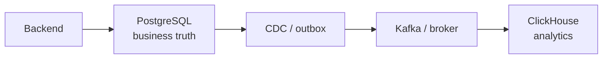

# ClickHouse и альтернативы

## Содержание

- [Сравнивать нужно workload, а не список функций](#сравнивать-нужно-workload-а-не-список-функций)
- [Краткая таблица](#краткая-таблица)
- [ClickHouse и PostgreSQL](#clickhouse-и-postgresql)
- [ClickHouse и TimescaleDB](#clickhouse-и-timescaledb)
- [ClickHouse и Elasticsearch](#clickhouse-и-elasticsearch)
- [ClickHouse и Apache Druid](#clickhouse-и-apache-druid)
- [ClickHouse и BigQuery](#clickhouse-и-bigquery)
- [ClickHouse и VictoriaMetrics](#clickhouse-и-victoriametrics)
- [Гибридные архитектуры](#гибридные-архитектуры)
- [Фреймворк выбора](#фреймворк-выбора)
- [Interview-ready answer](#interview-ready-answer)
- [Официальная документация](#официальная-документация)

Вопрос «какая база быстрее» поставлен неправильно. Система выигрывает на своём workload: PostgreSQL обязан поддерживать транзакции и ограничения, Elasticsearch строит search indexes, BigQuery снимает с команды управление cluster, VictoriaMetrics оптимизирует metric samples. Эти свойства имеют цену и не сравниваются одним benchmark.

---

## Сравнивать нужно workload, а не список функций

До выбора фиксируют:

- основной access pattern: lookup, full-text search, time range aggregation, ad-hoc scan;
- ingest: средний/пиковый rows per second, batch или streaming;
- latency SLO и concurrency;
- нужны ли update, delete, unique constraints и multi-row transactions;
- retention, raw volume, compression и tiering;
- freshness и consistency;
- размер команды и готовность эксплуатировать distributed state;
- модель стоимости: provisioned hardware, slots, bytes scanned, storage/egress.

Без этих чисел «ClickHouse против X» превращается в сравнение marketing pages.

---

## Краткая таблица

| Система | Основная ниша | Сильная сторона | Главный trade-off |
| --- | --- | --- | --- |
| ClickHouse | real-time OLAP по events | быстрые column scans, aggregation, compression | нет OLTP-инвариантов, нужно проектировать parts/merges |
| PostgreSQL | OLTP и универсальный SQL | transactions, constraints, indexes, ecosystem | большие analytical scans конкурируют с OLTP |
| TimescaleDB | time series внутри PostgreSQL | hypertables, continuous aggregates, PostgreSQL semantics | сохраняет часть стоимости row-oriented/OLTP architecture |
| Elasticsearch | full-text/search analytics | inverted index, relevance, search DSL | storage/write amplification и не SQL-first модель |
| Apache Druid | serving OLAP/time series | segment ingestion, rollup, low-latency slice-and-dice | отдельный distributed stack и ingestion model |
| BigQuery | serverless cloud warehouse | почти нет cluster operations, elastic scans | cost/latency зависят от scanned data и service model |
| VictoriaMetrics | monitoring metrics | PromQL/MetricsQL, compression, operational simplicity | не произвольная event analytics/relational SQL |

Таблица не определяет победителя. Например, «быстрый dashboard» может означать поиск текста, PromQL по метрике или `GROUP BY tenant_id` по событиям — это три разных системы.

---

## ClickHouse и PostgreSQL

PostgreSQL выбирают, когда данные являются бизнес-состоянием:

- заказ должен быть уникален;
- списание и ledger entry фиксируются одной transaction;
- foreign key и constraint защищают инвариант;
- нужен точечный lookup/update с предсказуемой latency;
- read-after-write является частью API contract.

ClickHouse выбирают, когда те же данные становятся аналитическим потоком:

- посчитать revenue по миллиардам order events;
- построить cohorts и funnels;
- хранить подробную историю изменений;
- обслуживать много агрегатных dashboards.

Типичная корректная архитектура — не замена, а связка:

Trade-off — eventual consistency и отдельный pipeline. Нужно определить watermark, deduplication, schema evolution и reconciliation. Dual-write из handler напрямую в две базы без outbox создаёт неустранимое окно частичного успеха.

PostgreSQL может выполнять аналитику на умеренном объёме, особенно с read replica, partitioning и подходящими indexes. Переезд в ClickHouse оправдан не самим наличием `GROUP BY`, а измеренным конфликтом OLTP/OLAP, объёмом scans или стоимостью масштабирования.

---

## ClickHouse и TimescaleDB

TimescaleDB расширяет PostgreSQL для time-series workloads: hypertables делят данные на chunks, continuous aggregates предвычисляют результаты, compression/columnar-возможности уменьшают storage. При этом приложение остаётся в PostgreSQL ecosystem и может сочетать time-series с transactions, relational joins и extensions.

TimescaleDB обычно удобнее, если:

- объём и throughput помещаются в выбранную PostgreSQL/Timescale topology;
- time-series тесно связаны с transactional tables;
- команда уже сильна в PostgreSQL;
- важна совместимость с PostgreSQL tools и semantics.

ClickHouse обычно выигрывает по профилю:

- append-only events очень большого объёма;
- широкие scans и high-cardinality aggregations;
- высокая ingest throughput и агрессивное columnar compression;
- distributed OLAP является основной, а не дополнительной нагрузкой.

Нельзя выбирать по слову «time series»: telemetry metrics, финансовые candles и история заказов имеют разные query patterns. Нагрузочный тест должен включать retention cleanup, ingest одновременно с queries и реальные cardinalities tags.

---

## ClickHouse и Elasticsearch

Elasticsearch — search-first система. Inverted index эффективно отвечает на:

- полнотекстовый поиск и relevance ranking;
- fuzzy/prefix/token queries;
- фильтрацию и агрегации по индексированным documents;
- поиск по logs, где оператор сначала вводит текст/поля, потом уточняет диапазон.

ClickHouse — analytics-first система. Он естественнее для:

- SQL aggregation по большому временному диапазону;
- joins, window functions, arrays и materialized aggregates;
- дешёвого хранения большого event history;
- точного контроля column types и compression.

У Elasticsearch есть column-oriented `doc_values` для aggregations, а у ClickHouse — text indexes и функции поиска. Пересечение возможностей не отменяет основной архитектуры. Если главный запрос — relevance search по тексту, Elasticsearch обычно проще. Если главный запрос — `GROUP BY` по сотням миллиардов structured events, ClickHouse обычно естественнее.

Частая связка: короткое searchable окно logs в Elasticsearch и длинная аналитическая история в ClickHouse/object storage. Цена — двойной ingest, разные query semantics и необходимость объяснить пользователю, почему результаты двух систем могут отличаться.

---

## ClickHouse и Apache Druid

Druid и ClickHouse оба обслуживают low-latency OLAP по events, но имеют разную operational/data model историю.

Druid строится вокруг immutable segments, ingestion tasks, deep storage и serving/query nodes. Rollup на ingestion уменьшает rows, если raw granularity не нужна. Система сильна в time-based slice-and-dice и streaming ingestion с явно управляемыми segments.

ClickHouse предлагает более общий SQL engine, MergeTree tables, богатые функции/joins и привычную модель database/table. Raw events часто сохраняются напрямую, а предагрегация добавляется materialized views.

Выбор проверяют по:

- нужен ли ingestion-time rollup или raw history;
- сложности joins и SQL;
- latency под target concurrency;
- операционной модели: набор ролей Druid против ClickHouse shards/replicas либо managed service;
- compaction/segment management против parts/merges;
- реальной стоимости compute, deep/object storage и network.

Нельзя переносить benchmark одной schema: Druid с rollup хранит меньше logical rows, чем ClickHouse с raw events, и это уже разные требования к данным.

---

## ClickHouse и BigQuery

BigQuery — managed/serverless warehouse: команда не управляет shards, replicas, merges и Keeper. Система хорошо подходит для больших ad-hoc scans, batch ELT, data lake/warehouse интеграций и переменной нагрузки.

ClickHouse чаще выбирают для serving layer:

- постоянно работающие dashboards с низкой latency;
- высокая concurrency коротких queries;
- real-time ingest и materialized aggregates;
- контроль deployment, hardware locality или predictable provisioned capacity.

BigQuery может принимать streaming data и обслуживать dashboards, а ClickHouse может выполнять огромные ad-hoc scans. Разница проявляется в economics и operations:

- в BigQuery важны bytes processed, partition/clustering pruning, slots/reservations и service quotas;
- в ClickHouse платят за постоянно выделенный compute/storage и работу по capacity/operations;
- egress между cloud services способен изменить результат сравнения;
- один дешёвый query не доказывает дешевизну тысячи одинаковых queries в секунду.

Частая архитектура: BigQuery как центральный warehouse и ClickHouse как low-latency serving copy для ограниченного набора продуктов. Она оправдана, только если выигрыш SLO покрывает двойное хранение и pipeline.

---

## ClickHouse и VictoriaMetrics

VictoriaMetrics специализирована под monitoring metrics: samples `(metric, labels, timestamp, value)`, PromQL/MetricsQL, recording rules, downsampling/retention и интеграцию с Prometheus ecosystem.

VictoriaMetrics обычно лучше, если:

- workload — scrape/remote write metrics;
- пользователи думают PromQL и label matchers;
- нужны готовые semantics rate/increase/staleness;
- важна простая интеграция с Grafana/Prometheus tooling.

ClickHouse лучше, если observability data рассматриваются как общие structured events:

- сложные SQL joins traces/logs/business data;
- произвольные dimensions и transformations;
- несколько access patterns поверх общей event platform;
- кастомная аналитика, не выражаемая естественно в PromQL.

Попытка самостоятельно воспроизвести Prometheus semantics в SQL дороже, чем кажется: counter resets, stale markers, label cardinality и range-vector functions — часть продукта, а не просто schema. Обратная попытка хранить произвольные JSON business events как metrics также быстро упирается в модель labels.

---

## Гибридные архитектуры

Несколько систем оправданы, когда у каждой есть чёткая роль:

| Источник истины | Производная система | Контракт |
| --- | --- | --- |
| PostgreSQL | ClickHouse | analytics eventually consistent по CDC watermark |
| object storage/warehouse | ClickHouse | serving copy rebuildable из history |
| event stream | Elasticsearch + ClickHouse | search window и analytical history имеют batch ID |
| Prometheus/VictoriaMetrics | ClickHouse | long-term/custom analytics, не alert source |

Плохой признак — обе базы считаются source of truth, а reconciliation не существует. Хороший признак — производную систему можно полностью перестроить из durable log/snapshot, известны RPO/freshness и ownership schema.

---

## Фреймворк выбора

1. Записать три главных queries с ожидаемыми filters, rows scanned и result size.
2. Зафиксировать средний и peak ingest, retention, updates/deletes.
3. Определить correctness: exact/approximate, stale tolerance, transaction boundaries.
4. Загрузить representative data минимум на несколько partitions/chunks/segments.
5. Измерить одновременно ingest, merges/compaction и queries под target concurrency.
6. Посчитать полную стоимость: storage copies, backup, egress, engineers, managed-service premium.
7. Проверить failure: retry, node loss, schema migration, restore и backfill.

Результатом должен быть не «ClickHouse быстрее», а утверждение вида: «при 300 тысячах events/s и 50 concurrent dashboard queries p95 укладывается в 400 ms, storage на 90 дней стоит X, восстановление проверено за Y часов».

---

## Interview-ready answer

**1. Когда ClickHouse не заменяет PostgreSQL?**

- Когда нужны transactions, unique/foreign-key constraints, точечные updates и business read-after-write.
- Типичный pattern — PostgreSQL как source of truth, ClickHouse как аналитическая projection через CDC/outbox.

**2. Чем ClickHouse отличается от Elasticsearch?**

- Elasticsearch оптимизирован под inverted-index search и relevance.
- ClickHouse — под typed columnar scans, SQL aggregation и большой structured event history.
- Пересечение функций есть, выбор определяет главный access pattern.

**3. Когда выбрать BigQuery?**

- Когда важнее serverless operations и elastic ad-hoc warehouse scans.
- ClickHouse чаще удобнее как постоянно горячий low-latency serving layer.
- Сравнивают total cost под concurrency, включая slots/bytes scanned, provisioned compute и egress.

**4. ClickHouse или VictoriaMetrics для метрик?**

- VictoriaMetrics — когда workload и интерфейс Prometheus/MetricsQL являются продуктовым contract.
- ClickHouse — когда нужны общая event analytics, SQL joins и кастомные dimensions.

**5. Как сравнивать системы честно?**

- Одинаковые correctness и retention requirements, representative data и target concurrency.
- Одновременно измерять ingest и background work, а не только один прогретый query.
- Включать operations, backup/restore и стоимость команды.

---

## Официальная документация

- [ClickHouse documentation](https://clickhouse.com/docs)
- [PostgreSQL documentation](https://www.postgresql.org/docs/)
- [Timescale documentation](https://docs.timescale.com/)
- [Elasticsearch documentation](https://www.elastic.co/docs)
- [Apache Druid documentation](https://druid.apache.org/docs/latest/)
- [BigQuery documentation](https://cloud.google.com/bigquery/docs)
- [VictoriaMetrics documentation](https://docs.victoriametrics.com/)
