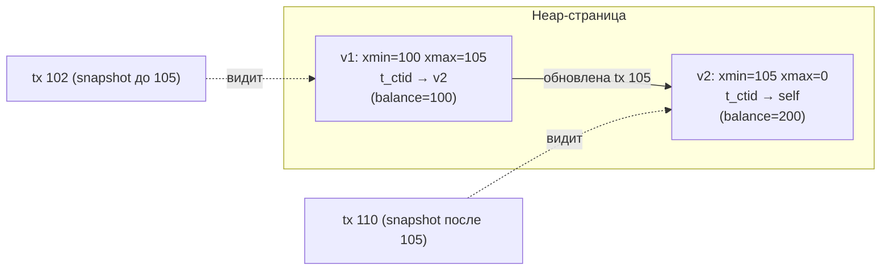

# MVCC и Vacuum

## Содержание

- [Как работает MVCC](#как-работает-mvcc)
- [Что лежит в заголовке кортежа](#что-лежит-в-заголовке-кортежа)
- [Видимость строк: xmin, xmax и snapshot](#видимость-строк-xmin-xmax-и-snapshot)
  - [Алгоритм проверки видимости](#алгоритм-проверки-видимости)
  - [CLOG и hint bits: где хранится «закоммичен ли xmin»](#clog-и-hint-bits-где-хранится-закоммичен-ли-xmin)
- [Dead tuples и table bloat](#dead-tuples-и-table-bloat)
- [VACUUM: что именно делает](#vacuum-что-именно-делает)
  - [Виды VACUUM и когда запускать](#виды-vacuum-и-когда-запускать)
  - [Visibility map и Index Only Scan](#visibility-map-и-index-only-scan)
- [Autovacuum: как настроить](#autovacuum-как-настроить)
- [Transaction ID Wraparound](#transaction-id-wraparound)
- [HOT updates](#hot-updates)
- [Мониторинг](#мониторинг)
- [Типичные ошибки](#типичные-ошибки)
- [Interview-ready answer](#interview-ready-answer)

---

## Как работает MVCC

MVCC (Multi-Version Concurrency Control) — механизм, который позволяет читателям не блокировать писателей и наоборот.

**Зачем.** Если бы `UPDATE` менял строку «на месте», то читатель, начавший `SELECT` до этого `UPDATE`, либо ждал бы блокировку, либо увидел недописанные данные. MVCC решает это так: каждая транзакция работает со **снимком (snapshot)** данных на момент своего старта, а писатель не трогает старые версии — он добавляет новую рядом. Поэтому read никогда не блокирует write и наоборот.

Принцип: вместо изменения строки «на месте» PostgreSQL создаёт **новую версию строки** (tuple), а старую лишь помечает «удалённой такой-то транзакцией». Какую версию увидит конкретный читатель — решает проверка видимости (ниже).

- `INSERT` — добавляется версия с `xmin = txid` (кто создал).
- `DELETE` — у версии проставляется `xmax = txid` (кто удалил); физически строка остаётся.
- `UPDATE` = `DELETE` + `INSERT` в одной операции: у старой версии `xmax = txid`, рядом кладётся новая версия с `xmin = txid`. Они связаны в **цепочку версий** через поле `t_ctid` (старая указывает на новую):



Итог: в таблице одновременно лежат несколько физических версий одной логической строки. Старые версии становятся мусором (**dead tuples**), когда ни одна живая транзакция их уже не видит, — и их забирает `VACUUM`.

---

## Что лежит в заголовке кортежа

Каждая физическая версия строки (heap tuple) предваряется 23-байтным заголовком `HeapTupleHeader`. Для MVCC важны эти поля:

```text
┌──────────────── HeapTupleHeader (23 B + выравнивание) ────────────────┐
│ t_xmin       (4 B) — txid транзакции, СОЗДАВШЕЙ эту версию             │
│ t_xmax       (4 B) — txid транзакции, УДАЛИВШЕЙ/обновившей (0 = живая) │
│ t_cid / t_xvac (4 B) — command id внутри транзакции (для self-видимости)│
│ t_ctid       (6 B) — указатель (page, offset) на СЛЕДУЮЩУЮ версию      │
│ t_infomask2  (2 B) — число атрибутов + флаги (HOT, keys-updated)       │
│ t_infomask   (2 B) — hint bits: XMIN_COMMITTED, XMAX_COMMITTED, ...    │
│ t_hoff       (1 B) — смещение до данных строки                         │
└───────────────────────────────────────────────────────────────────────┘
                        ↓ дальше идут сами колонки (null bitmap + значения)
```

- **`t_xmin` / `t_xmax`** — две границы «времени жизни» версии в единицах txid. На них держится вся проверка видимости.
- **`t_ctid`** — у последней версии указывает сам на себя; у обновлённой — на следующую версию (так образуется цепочка для HOT и `UPDATE`).
- **`t_infomask`** — набор **hint bits**, кеш результата «закоммичена ли создавшая/удалившая транзакция» (см. CLOG ниже).

```sql
-- увидеть скрытые системные колонки
SELECT xmin, xmax, ctid, id, email FROM users LIMIT 5;

-- расширение pageinspect показывает сырой заголовок кортежей страницы
CREATE EXTENSION IF NOT EXISTS pageinspect;
SELECT t_xmin, t_xmax, t_ctid, t_infomask::bit(16)
FROM heap_page_items(get_raw_page('users', 0));
```

---

## Видимость строк: xmin, xmax и snapshot

**Snapshot** — это «фотография» того, какие транзакции были видны на момент его взятия. Технически snapshot хранит: `xmin` (всё, что меньше — точно завершено), `xmax` (всё, что больше — ещё не началось) и список `xip` — транзакций, бывших *in-progress* в момент снимка.

- В `READ COMMITTED` новый snapshot берётся **на каждый statement** — поэтому видны чужие свежие коммиты.
- В `REPEATABLE READ`/`SERIALIZABLE` snapshot берётся один раз **на старте транзакции** и не меняется — отсюда стабильное чтение.

### Алгоритм проверки видимости

Видна ли версия строки текущему snapshot — решается по её `xmin`/`xmax`:

```text
func visible(tuple, snap):
    # 1. Создавшая транзакция должна быть видна (закоммичена и в прошлом snapshot)
    if not committedAndVisible(tuple.xmin, snap):
        return false                       # строку создала ещё-не-видимая tx
    # 2. Удаляющей транзакции либо нет, либо она нам не видна → строка ещё жива
    if tuple.xmax == 0:
        return true
    if not committedAndVisible(tuple.xmax, snap):
        return true                        # удаление сделала tx, которой мы не видим
    return false                           # версия удалена видимой нам транзакцией

func committedAndVisible(xid, snap):
    if xid >= snap.xmax:      return false # tx началась позже снимка
    if xid <  snap.xmin:      return isCommitted(xid)   # завершена до снимка
    if xid in snap.xip:       return false # была in-progress в момент снимка
    return isCommitted(xid)
```

Ключевая идея: одна и та же физическая строка может быть видна одной транзакции и невидима другой — всё зависит от их snapshot. Никакого «глобального удаления» нет, пока строку видит хоть кто-то.

### CLOG и hint bits: где хранится «закоммичен ли xmin»

`isCommitted(xid)` — не бесплатная операция: статус каждой транзакции (in-progress / committed / aborted) лежит в **CLOG** (commit log, каталог `pg_xact/`), по 2 бита на txid. Ходить в CLOG на каждую проверку каждой строки было бы дорого, поэтому PostgreSQL кеширует результат прямо в кортеже — это **hint bits** в `t_infomask`:

```text
первый, кто проверил видимость строки и сходил в CLOG:
    if CLOG говорит "xmin committed":
        tuple.t_infomask |= HEAP_XMIN_COMMITTED   # ← записали подсказку в саму строку
    ...
последующие проверки:
    if tuple.t_infomask & HEAP_XMIN_COMMITTED:     # CLOG уже не нужен
        return true
```

Практические следствия:
- **Первый `SELECT` после массовой вставки может «писать»** — он проставляет hint bits и грязнит страницы, которые потом сбросит на диск. Отсюда неожиданный write-I/O на чисто читающем запросе.
- Hint bits — это оптимизация, а не источник истины; настоящий статус всегда в CLOG.

---

## Dead tuples и table bloat

После `UPDATE` или `DELETE` старые версии строк ("мёртвые кортежи") остаются на страницах таблицы. Они занимают место и замедляют sequential scan.

Следствия накопления dead tuples:
- **Table bloat** — файл таблицы на диске растёт без реального роста данных.
- **Index bloat** — индексы тоже содержат указатели на dead tuples.
- **Деградация seq scan** — читаются лишние страницы.

Причины накопления:
- Долгие транзакции (vacuum не может зачистить, пока транзакция не закончится).
- Репликационные слоты без активных подписчиков (удерживают `xmin`).
- Autovacuum отключён или неправильно настроен.
- Высокая скорость `UPDATE`/`DELETE` превышает скорость vacuum.

---

## VACUUM: что именно делает

`VACUUM` проходит по страницам таблицы и освобождает место, занятое dead tuples. Но «удалить мёртвую строку» — это не одно действие, а несколько: на неё могут ссылаться индексы, поэтому порядок важен.

```text
func vacuumTable(rel):
    dead = []
    # фаза 1: собрать ctid мёртвых версий (тех, что не видны НИ ОДНОЙ живой tx)
    for page in rel.pages:
        if page.allVisible: continue            # visibility map → страницу можно пропустить
        for tuple in page:
            if tuple.xmax != 0 and committedBefore(tuple.xmax, oldestRunningXid()):
                dead.append(tuple.ctid)         # копим в TID store (см. ниже)

    # фаза 2: вычистить ССЫЛКИ на эти ctid из КАЖДОГО индекса
    for idx in rel.indexes:
        idx.removeEntriesPointingTo(dead)

    # фаза 3: освободить сами строки в heap, обновить free space map
    for ctid in dead:
        page(ctid).markFree(ctid)               # место переиспользуется будущими INSERT
    rel.updateFreeSpaceMap()
    rel.updateVisibilityMap()
```

Главное, что нужно понимать:
- **Порог зачистки — `oldestRunningXid()`**: версию можно убрать, только если её `xmax` старше самой старой ещё живой транзакции. Поэтому одна долгая транзакция замораживает зачистку для всей базы.
- **`VACUUM` не возвращает место ОС** — он помечает место свободным для *будущих* вставок в эту же таблицу. Файл на диске не сжимается (для этого нужен `VACUUM FULL`/`pg_repack`).
- **Индексная фаза — самая дорогая**: на каждый dead tuple нужно вычистить запись из каждого индекса. Чем больше индексов, тем дороже vacuum.

> **Свежее (PG 17).** Раньше список мёртвых `ctid` хранился в простом массиве, ограниченном `maintenance_work_mem` (≤ 1 GB), и при переполнении vacuum делал **несколько проходов по индексам** — медленно. PG 17 заменил его на компактную структуру **TID store** (radix tree): тот же объём памяти вмещает на порядок больше ctid, и индексы чаще обходятся за один проход.

### Виды VACUUM и когда запускать

#### `VACUUM` (обычный)

Помечает dead tuples как свободное пространство для повторного использования. **Не возвращает** место ОС. Не блокирует чтение/запись.

```sql
VACUUM users;
VACUUM VERBOSE users;  -- подробный вывод
```

#### `VACUUM ANALYZE`

Vacuum + обновление статистики планировщика. Запускать после массовых INSERT/UPDATE.

```sql
VACUUM ANALYZE users;
```

#### `VACUUM FULL`

Полная перестройка таблицы — возвращает место ОС. **Требует exclusive lock** — блокирует всю таблицу на время работы. Использовать только в maintenance window.

```sql
VACUUM FULL users;  -- блокирует таблицу!
```

Альтернатива без блокировки: расширение `pg_repack` (создаёт копию таблицы и атомарно подменяет, удерживая лишь короткий лок в конце).

#### `ANALYZE`

Только обновляет статистику — без зачистки. Нужен после bulk load.

```sql
ANALYZE users;
```

### Visibility map и Index Only Scan

У каждой таблицы есть **visibility map (VM)** — по 2 бита на heap-страницу: `all-visible` (все кортежи страницы видны всем) и `all-frozen`. `VACUUM` выставляет эти биты, когда зачистил страницу и на ней не осталось «спорных» версий.

VM нужен не только для ускорения самого vacuum (страницы с битом `all-visible` пропускаются), но и для **Index Only Scan**:

```text
Index Only Scan по covering-индексу:
    for entry in index.search(predicate):
        if VM[entry.page].allVisible:        # страница точно «чистая»
            return entry.indexedColumns      # heap НЕ читаем — все данные в индексе
        else:
            heapFetch(entry.ctid)            # иначе приходится идти в heap за видимостью
```

Практический вывод: Index Only Scan экономит обращения в heap **только если страница помечена `all-visible`**. Сразу после массовых изменений VM ещё не обновлён, и `EXPLAIN (ANALYZE)` покажет ненулевой `Heap Fetches` — лечится `VACUUM`. Связку с covering-индексами см. в [02-indexes.md](./02-indexes.md), раздел «Covering index (INCLUDE)».

---

## Autovacuum: как настроить

Autovacuum запускается автоматически, когда число dead tuples превышает порог:

```
autovacuum_vacuum_threshold + autovacuum_vacuum_scale_factor * n_live_tup
```

По умолчанию: 50 + 0.2 * размер_таблицы. Для большой таблицы (10M строк) это 2 000 050 — очень много.

Настройка на уровне таблицы (без перезагрузки PostgreSQL):

```sql
ALTER TABLE orders SET (
    autovacuum_vacuum_scale_factor = 0.01,   -- 1% вместо 20%
    autovacuum_vacuum_threshold = 1000,
    autovacuum_analyze_scale_factor = 0.005,
    autovacuum_vacuum_cost_delay = 2         -- ms, снизить throttling
);
```

Глобальные параметры в `postgresql.conf`:

```
autovacuum_max_workers = 5          # параллельных воркеров (default 3)
autovacuum_vacuum_cost_delay = 2ms  # throttling задержка
autovacuum_vacuum_cost_limit = 400  # budget за один цикл (default 200)
```

Проверить активность autovacuum:

```sql
SELECT schemaname, relname, last_vacuum, last_autovacuum,
       last_analyze, last_autoanalyze,
       n_dead_tup, n_live_tup,
       autovacuum_count
FROM pg_stat_user_tables
ORDER BY n_dead_tup DESC;
```

**Failsafe-режим (PG 14+).** Если таблица всё же подобралась к wraparound (см. ниже), autovacuum переключается в аварийный режим: при достижении `vacuum_failsafe_age` (по умолчанию 1.6 млрд) он **пропускает зачистку индексов и throttling** (`cost_delay`) и гонит только заморозку, лишь бы успеть до катастрофы. Это страховка, а не штатный режим — если она срабатывает, autovacuum настроен слишком вяло.

---

## Transaction ID Wraparound

PostgreSQL использует 32-битный `txid` (transaction ID). Максимум ~4.2 млрд значений, но они трактуются как **кольцо**: для любой транзакции половина пространства считается «в прошлом», половина — «в будущем». То есть реально видимый горизонт — ~2.1 млрд транзакций вперёд.

**Почему это проблема и при чём тут freeze.** Видимость строки (см. выше) зависит от сравнения `xmin` с текущим txid. Когда счётчик пройдёт полный круг, очень старый `xmin` вдруг окажется «в будущем» относительно нового txid — и давно видимая всем строка станет **невидимой**. Это и есть **wraparound catastrophe**.

Чтобы этого не случилось, `VACUUM` **замораживает** старые строки: версии старше `vacuum_freeze_min_age` помечаются специальным флагом «видна всем» (исторически — заменой `xmin` на `FrozenTransactionId`). Замороженная строка больше не зависит от арифметики txid, поэтому круг счётчика ей не страшен. Wraparound случается, только если autovacuum хронически **не успевает** заморозить старьё.

> **MultiXact.** Параллельные блокировки строк (`SELECT FOR SHARE`, FK-проверки) хранятся не в `xmax`, а в отдельном пространстве **MultiXactId** со *своим* счётчиком и *своим* wraparound. Мониторить нужно оба: `age(datfrozenxid)` и `mxid_age(...)` / `datminmxid`.

Признак приближения: warning в логах за ~11 млн транзакций до предела; ближе к краю срабатывает [failsafe-autovacuum](#autovacuum-как-настроить).

```sql
-- проверить расстояние до wraparound
SELECT datname,
       age(datfrozenxid) AS xid_age,
       2147483647 - age(datfrozenxid) AS remaining
FROM pg_database
ORDER BY xid_age DESC;
```

Если `age` близко к 2 млрд — нужен экстренный `VACUUM FREEZE`.

```sql
VACUUM FREEZE VERBOSE users;
```

Параметры заморозки:
- `vacuum_freeze_min_age` (default 50M) — возраст транзакции, с которого начинается заморозка.
- `autovacuum_freeze_max_age` (default 200M) — принудительно запускает autovacuum для заморозки.

---

## HOT updates

HOT (Heap Only Tuple) — оптимизация: если обновляемые поля **не входят в индексы** и новая версия строки помещается на той же странице, PostgreSQL создаёт chain в heap без обновления индекса.

Результат: быстрее UPDATE, меньше index bloat.

Условие: нужно свободное место на странице — влияет `fillfactor` (default 100%).

```sql
-- оставить 20% страницы свободным для HOT updates
ALTER TABLE users SET (fillfactor = 80);
```

Проверить HOT:
```sql
SELECT n_tup_hot_upd, n_tup_upd FROM pg_stat_user_tables WHERE relname = 'users';
-- высокое n_tup_hot_upd / n_tup_upd — HOT работает
```

---

## Мониторинг

Долгие транзакции (основная причина bloat):

```sql
SELECT pid,
       now() - xact_start AS duration,
       state,
       left(query, 100) AS query
FROM pg_stat_activity
WHERE xact_start IS NOT NULL
  AND state != 'idle'
ORDER BY duration DESC;
```

Таблицы с большим bloat:

```sql
SELECT relname,
       n_dead_tup,
       n_live_tup,
       round(n_dead_tup::numeric / NULLIF(n_live_tup, 0) * 100, 1) AS dead_ratio_pct,
       last_autovacuum
FROM pg_stat_user_tables
WHERE n_live_tup > 1000
ORDER BY dead_ratio_pct DESC NULLS LAST;
```

Репликационные слоты (могут удерживать xmin):

```sql
SELECT slot_name, active, xmin, catalog_xmin,
       pg_size_pretty(pg_wal_lsn_diff(pg_current_wal_lsn(), restart_lsn)) AS lag
FROM pg_replication_slots;
```

---

## Типичные ошибки

- Долгие транзакции в OLTP коде — vacuum не может зачистить мёртвые строки.
- Оставлять репликационные слоты без подписчиков — удерживают xmin и копят WAL.
- Запускать `VACUUM FULL` в production без maintenance window — exclusive lock.
- Игнорировать рост `n_dead_tup` пока не стало заметно в latency.
- Не снижать `autovacuum_vacuum_scale_factor` для больших таблиц.

---

## Interview-ready answer

**1. Что происходит при UPDATE в MVCC?**

- Создаётся новая версия строки (`xmin` = создатель), старая получает `xmax`; версии связаны цепочкой через `t_ctid`, а какую видно — решает snapshot, поэтому read не блокирует write.

**2. Как определяется видимость версии?**

- Сравнением `xmin`/`xmax` версии со снимком транзакции (его `xmin`/`xmax` и список in-progress); статус «закоммичена ли tx» лежит в CLOG.

**3. Что такое hint bits и при чём тут write на SELECT?**

- Кеш статуса коммита прямо в кортеже (`t_infomask`), чтобы не ходить в CLOG каждый раз; первый SELECT после bulk-insert проставляет их и грязнит страницы → неожиданный write-I/O.

**4. Что именно делает VACUUM?**

- Находит мёртвые версии (старше oldestXmin), чистит ссылки на них во всех индексах (самая дорогая фаза) и помечает место свободным для будущих вставок; ОС место не возвращает (для этого VACUUM FULL/pg_repack).

**5. Чем опасна длинная транзакция?**

- Держит `oldestXmin` → vacuum не может зачищать старые версии → table bloat и деградация.

**6. Что такое transaction ID wraparound и freeze?**

- txid 32-битный и кольцевой; без заморозки старых строк (freeze) давняя строка после круга счётчика станет «невидимой»; мониторить `age(datfrozenxid)` и MultiXact, у края срабатывает failsafe-autovacuum.

**7. Зачем нужен visibility map?**

- VACUUM ставит биты all-visible; без них Index Only Scan вынужден ходить в heap (`Heap Fetches > 0`), а сам vacuum не может пропускать «чистые» страницы.

**8. Что такое HOT update?**

- Если меняются неиндексированные поля и новая версия влезает на ту же страницу — обновление без правки индексов (heap-only); помогает `fillfactor < 100`.
