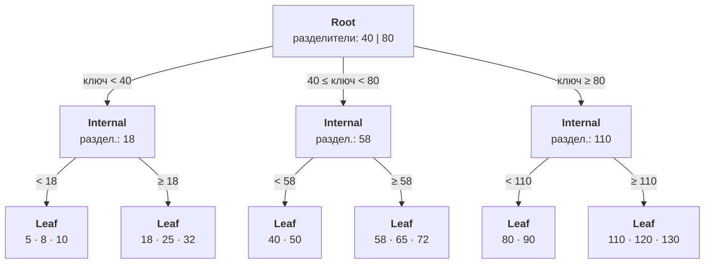
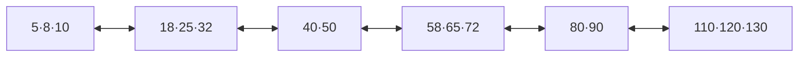
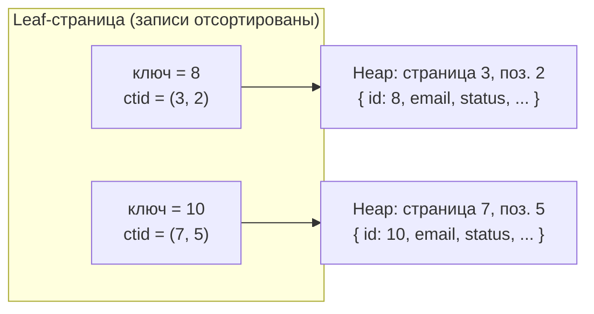
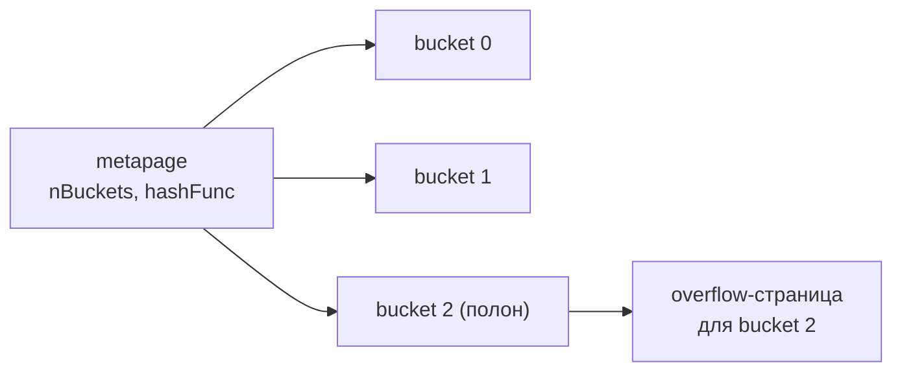
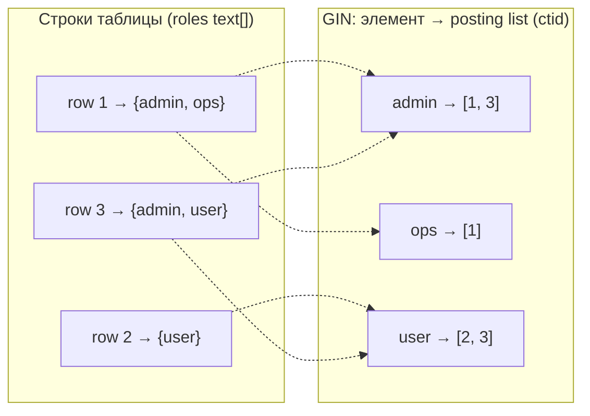
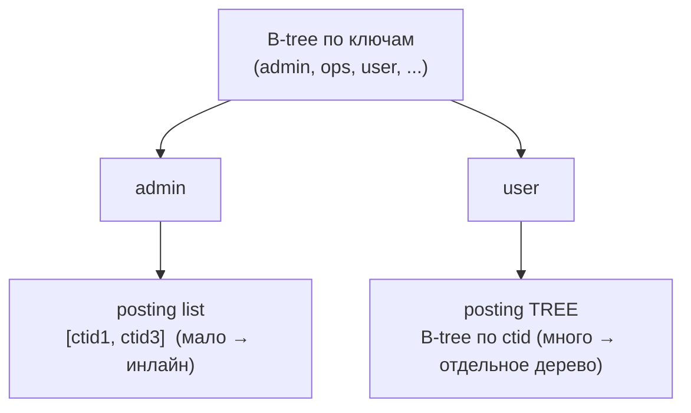
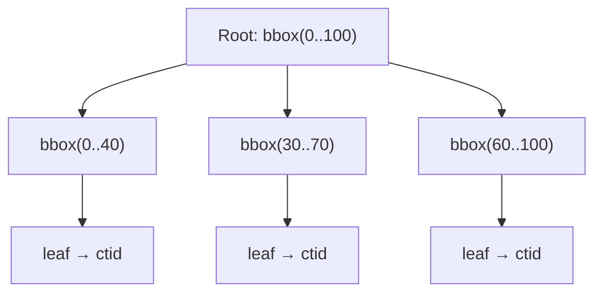
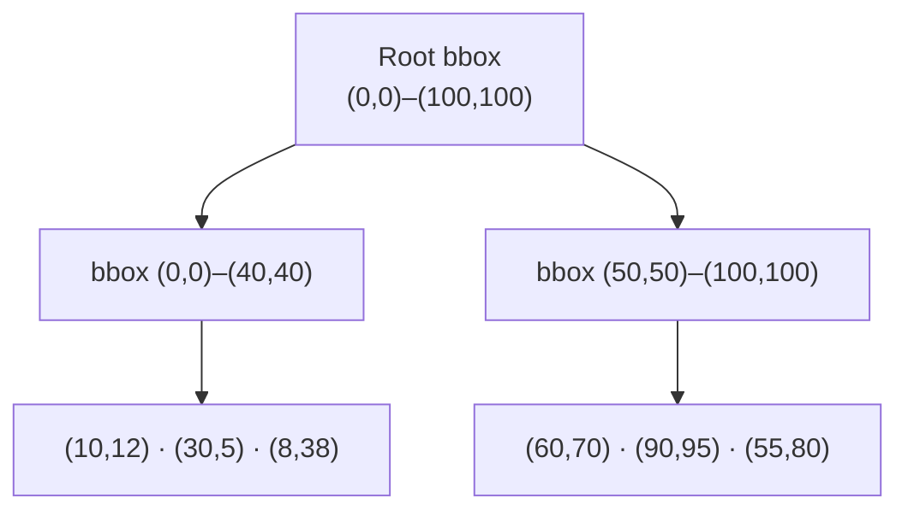
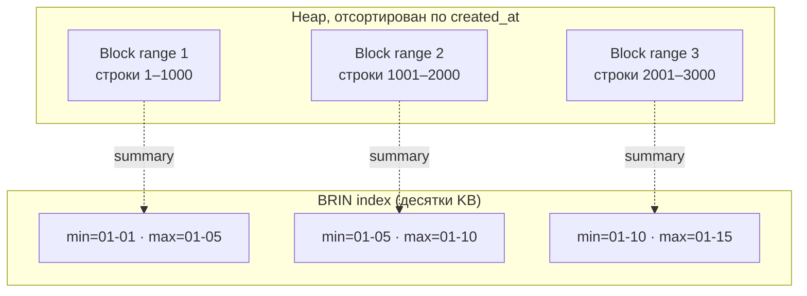
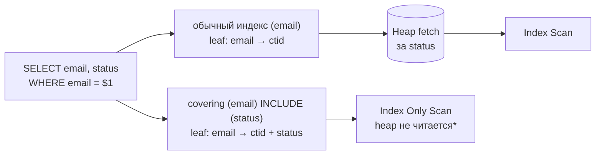

# Индексы в PostgreSQL

Схема типов индексов: [pg_indexes.png](./02a-pg_indexes.png)

## Содержание

- [Как работает B-tree индекс](#как-работает-b-tree-индекс)
- [Типы индексов](#типы-индексов)
- [Partial index](#partial-index)
- [Expression index](#expression-index)
- [Covering index (INCLUDE)](#covering-index-include)
- [Multi-column индексы](#multi-column-индексы)
- [Типы сканов: Index / Index Only / Bitmap / Seq](#типы-сканов-index--index-only--bitmap--seq)
- [Когда индекс не используется](#когда-индекс-не-используется)
- [Index bloat](#index-bloat)
- [Стратегия выбора индексов](#стратегия-выбора-индексов)
- [Concurrent index build](#concurrent-index-build)
- [Interview-ready answer](#interview-ready-answer)

---

## Как работает B-tree индекс

B-tree (Balanced Tree) — дефолтный тип. Хранит отсортированные значения в сбалансированном дереве страниц по 8KB.

Структура:
- **Root page** — одна страница верхнего уровня.
- **Internal pages** — промежуточные, хранят диапазоны ключей и указатели на дочерние страницы.
- **Leaf pages** — нижний уровень, хранят пары `(key_value, ctid)`, отсортированные по ключу.

Операции:
- Поиск по равенству: O(log n).
- Range scan: O(log n + k), где k — число найденных строк.
- ORDER BY без sort: индекс уже отсортирован, scan идёт по leaf pages последовательно.

Depth типичного B-tree:
- 1M строк → глубина ~3.
- 1B строк → глубина ~5.

**1. Форма дерева.** Запись в узле вида `40 | 80` — это **разделители (separator keys)**: они не данные, а границы. Два разделителя `40` и `80` делят диапазон на три ветки и дают три указателя на дочерние страницы: `ключ < 40`, `40 ≤ ключ < 80`, `ключ ≥ 80`. Поиск спускается сверху вниз, на каждой странице выбирая нужную ветку:



- **Root / Internal** хранят только разделители + указатели — это «маршрут», данных там нет. Каждый уровень сужает диапазон: root делит по `40 | 80`, а internal под ним — ещё раз (по `18`, `58`, `110`).
- **Leaf** хранят реальные пары `(ключ, ctid)`, отсортированные по ключу.
- Здесь дерево 3 уровня. С ростом данных листья переполняются, добавляются новые уровни Internal с такой же логикой — так глубина доходит до 3–5 (и почти не растёт дальше, см. fanout ниже).

Пример поиска `ключ = 58`: root → ветка `40 ≤ ключ < 80` → Internal `58` → ветка `≥ 58` → лист `58 · 65 · 72` → бинарным поиском в листе находим `58` и его `ctid`. Прочитано 3 страницы = глубина дерева.

Все leaf-страницы дополнительно связаны в **двусвязный список** по возрастанию ключа (sibling-указатели). Поэтому range scan и `ORDER BY` идут по листьям подряд слева направо, **без отдельной сортировки**:



**2. Что внутри leaf.** Каждая запись листа — это `(ключ, ctid)`. `ctid` — физический адрес строки в heap: `(номер_страницы, позиция_в_странице)`. По нему делается один прыжок в таблицу за остальными колонками:



> Технически индекс Postgres — это **B+tree** (вариант Lehman-Yao): реальные значения `(ключ, ctid)` лежат только в leaf, а root/internal — это чисто «маршрутизатор» из разделяющих ключей. Поэтому любой полезный результат всегда на дне дерева, и все листья — на одном уровне.

### Псевдокод поиска

Спуск по дереву — это бинарный поиск *внутри* каждой страницы плюс переход на дочернюю. Всего читается `depth` страниц:

```text
func search(key):
    page = root
    while page.isInternal:
        i    = binarySearch(page.keys, key)   # слот, чей диапазон покрывает key
        page = readPage(page.children[i])      # +1 чтение страницы
    # дошли до leaf
    pos = binarySearch(page.entries, key)
    return page.entries[pos]                    # (key, ctid) или "не найдено"

# range scan: нашли левую границу, дальше идём по sibling-указателям
func rangeScan(lo, hi):
    e = search(lo)
    while e != nil and e.key <= hi:
        yield e.ctid
        e = e.nextInLeafChain()                 # без возврата в корень
```

Стоимость: equality — `O(log n)` чтений страниц (= глубина), range — `O(log n + k)`, где `k` — число строк в диапазоне.

### От чего зависит глубина и как она саморегулируется

Глубину никто не задаёт — это производная двух величин:

```text
depth ≈ log_fanout(N)

N       = число проиндексированных строк
fanout  = сколько записей влезает в страницу 8 KB ≈ (8 KB − overhead) / размер_записи
```

`fanout` тем больше, чем **уже ключ** (страница фиксирована — 8 KB; запись = `ключ + указатель`). При `fanout ≈ 300` одна root-страница адресует `300³ ≈ 27M` строк, `300⁴ ≈ 8B` — поэтому глубина почти всегда 3–5, и удвоение данных её не двигает (логарифм).

| Ключ | примерный fanout | глубина при 1M | при 1B |
|------|------------------|----------------|--------|
| `int8` (8 байт) | несколько сотен | ~3 | ~4 |
| `uuid` (16 байт) | поменьше | ~3 | ~4–5 |
| длинный `text` / составной | десятки | растёт быстрее | 5–6 |

**Балансировка — через page split, и глубина растёт только при split корня.** Дерево достраивается *вверх*, а не вниз, поэтому остаётся идеально сбалансированным без ротаций (в отличие от AVL/red-black):

```text
func insert(leaf, entry):
    if leaf.hasSpace():
        leaf.put(entry)                 # обычный путь — страницы не делятся
        return
    # leaf переполнилась → делим пополам
    right, sepKey = leaf.splitInHalf()  # left остаётся на месте, right — новая страница
    insertIntoParent(leaf.parent, sepKey, right)

func insertIntoParent(parent, sepKey, newPage):
    if parent == nil:                   # делили КОРЕНЬ
        newRoot = allocatePage()
        newRoot.children = [oldRoot, newPage]
        tree.root  = newRoot
        tree.depth += 1                 # ← единственное место, где глубина +1
        return
    if parent.hasSpace():
        parent.put(sepKey, newPage)
    else:
        up, right = parent.splitInHalf()
        insertIntoParent(parent.parent, up, right)   # каскад split-ов вверх
```

Косвенно на глубину влияют:
- **Ширина ключа** — единственный реальный рычаг: узкий ключ → выше fanout → ниже дерево. Отсюда совет ставить узкие столбцы в ключ, а «довесок» выносить в `INCLUDE` (см. covering-индексы ниже).
- **`fillfactor`** (для B-tree по умолчанию 90) — насколько плотно набивать страницы при build. Ниже fillfactor → меньше будущих splits, но менее плотные страницы → чуть выше дерево.
- **Bloat** — dead-записи разрыхляют страницы, эффективный fanout падает. Лечится `REINDEX CONCURRENTLY` (см. [Index bloat](#index-bloat)).

```sql
-- создание B-tree (явно, default и так B-tree)
CREATE INDEX idx_users_email ON users USING btree (email);

-- DESC индекс для ORDER BY created_at DESC LIMIT N
CREATE INDEX idx_orders_created_desc ON orders (created_at DESC);

-- NULLS LAST/FIRST
CREATE INDEX idx_tasks_deadline ON tasks (deadline NULLS LAST);
```

### Что такое ключ индекса

**Ключ — это само значение поля (или выражения), не хэш и не трансформация.** Именно поэтому дерево хранит порядок и умеет range/sort (хэширование — это отдельный Hash-индекс). Что кладётся в ключ:

- обычный индекс `(email)` → значение колонки как есть;
- expression-индекс `(LOWER(email))` → результат выражения, вычисляется **при вставке/апдейте** и хранится готовым (запрос обязан использовать тот же `LOWER(email)`);
- лимит: ключ B-tree ≤ ~⅓ страницы (~2704 байта) — очень длинный `text` целиком в ключ не влезет.

**Как сравниваются ключи — operator class.** B-tree не знает конкретных типов; он вызывает функцию сравнения, которую тип предоставляет через операторный класс (для B-tree это `cmp(a, b) → -1 | 0 | +1`, из неё выводятся `< <= = >= >`). Отсюда:

- **Collation для `text` влияет на порядок** — индекс физически отсортирован по своей коллации, и запрос с другой коллацией его не использует. Для `LIKE 'foo%'` нужен класс `text_pattern_ops` (побайтовое сравнение вместо локали):
  ```sql
  CREATE INDEX idx_users_email_pat ON users (email text_pattern_ops);
  SELECT * FROM users WHERE email LIKE 'admin@%';   -- теперь индексируемо
  ```
- **NULL тоже индексируется** (в отличие от Oracle): позиция задаётся `NULLS FIRST/LAST`, доступен поиск `WHERE x IS NULL`.

**Составной ключ — это кортеж, сравнение лексикографическое.** Для `(user_id, created_at)` ключ каждой записи — пара `(user_id, created_at)`; сравнение как в словаре: сначала `user_id`, при равенстве — `created_at`. Так leaf-страницы отсортированы:

```text
(1, 10:00) → (1, 10:05) → (1, 11:00) → (2, 09:00) → (2, 09:30) → (3, ...)
└────── все строки user 1, внутри по времени ──────┘└─ user 2 ─┘
```

Из этой сортировки растут все правила [multi-column индексов](#multi-column-индексы):

- `WHERE user_id = 1 ORDER BY created_at` — бесплатно: строки одного `user_id` лежат подряд и уже отсортированы по времени.
- `WHERE user_id = 1 AND created_at > $2` — прыжок к user 1, затем range по времени внутри.
- `WHERE created_at > $1` **без** `user_id` — бесполезно: `created_at` отсортирован только *внутри* каждого `user_id`, а глобально разбросан.

Поэтому правило «первым — поле equality / наибольшей selectivity»: префикс кортежа должен быть зафиксирован, чтобы остаток оставался непрерывным отсортированным диапазоном.

---

## Типы индексов

### Hash

Только equality (`=`). Хранит не само значение, а его **32-битный хэш**, разложенный по бакетам. Поиск — без спуска по дереву: посчитали хэш → сразу нужный бакет → перебрали его записи. В среднем `O(1)` обращений вместо `O(log n)` у B-tree.

Устройство: `metapage` (служебная) → массив **bucket-страниц** → при переполнении бакета подцепляются **overflow-страницы**; `bitmap`-страницы учитывают свободные overflow:



```text
func hashLookup(key):
    h      = hash32(key)                 # хэш-функция типа данных
    bucket = h & (nBuckets - 1)          # маска: число бакетов — степень двойки
    for entry in bucketChain(bucket):    # bucket-страница + её overflow
        if entry.hash == h:              # сначала дешёвое сравнение хэшей
            if heapRow(entry.ctid).key == key:  # перепроверка из-за коллизий
                yield entry.ctid
```

Ключевая деталь — в индексе лежит только хэш, поэтому при **длинном ключе** (большой `text`, url, токен) hash-индекс заметно меньше B-tree и не теряет fanout. Это его единственная реальная ниша.

```sql
CREATE INDEX idx_sessions_token ON sessions USING hash (token);
SELECT * FROM sessions WHERE token = $1;   -- только '=', больше никак
```

**Подводные камни и почему почти не используют:**
- **Не поддерживает** range (`<`, `>`, `BETWEEN`), `ORDER BY`, `LIKE`, prefix — вообще ничего, кроме `=`.
- **Только один столбец** — multicolumn hash-индекса нет.
- **Нельзя сделать `UNIQUE`** и нельзя использовать под unique-constraint / PK.
- **До PostgreSQL 10 hash-индексы не писались в WAL** — не переживали краш и не реплицировались (после краша требовали `REINDEX`). Начиная с PG10 — полноценно WAL-logged и crash-safe. Если видишь совет «никогда не используй hash» — он родом из той эпохи.
- На практике B-tree для equality настолько хорош (и при этом умеет range/sort/unique), что выигрыш hash почти всегда не стоит потери гибкости. Бери hash осознанно — под equality по длинному ключу, где размер индекса критичен.

### GIN (Generalized Inverted Index)

Индексирует элементы внутри составных значений: JSONB, массивы, tsvector.

«Инвертированный» — потому что хранит не «строка → значения», а «значение → список строк» (posting list). Один запрос по элементу сразу даёт все строки, где он встречается:



`WHERE roles @> ARRAY['admin']` → читает один posting list `admin → [1, 3]`, heap трогает только две строки.

```sql
-- JSONB поиск по ключу/значению
CREATE INDEX idx_products_attrs ON products USING GIN (attributes);
SELECT * FROM products WHERE attributes @> '{"color": "red"}';

-- массив содержит элемент
CREATE INDEX idx_users_roles ON users USING GIN (roles);
SELECT * FROM users WHERE roles @> ARRAY['admin'];

-- полнотекстовый поиск
CREATE INDEX idx_articles_fts ON articles USING GIN (to_tsvector('russian', body));
SELECT * FROM articles WHERE to_tsvector('russian', body) @@ to_tsquery('russian', 'PostgreSQL');
```

**Внутреннее устройство.** GIN — это B-tree по *ключам-элементам* (а не по строкам). Под каждым ключом подвешен список `ctid`: маленький — **posting list** прямо в записи, большой — отдельное **posting tree** (тоже B-tree, но по `ctid`):



```text
func ginSearch(query):
    keys = extractKeys(query)            # @> '{a,b}' → [a, b];  to_tsquery('x & y') → [x, y]
    lists = [postingList(k) for k in keys]
    # consistent-функция решает логику по стратегии оператора:
    #   @> (массив содержит все) → ПЕРЕСЕЧЕНИЕ списков (AND)
    #   &&  (есть общий элемент) → ОБЪЕДИНЕНИЕ (OR)
    candidates = combine(lists, query.strategy)
    for ctid in candidates:
        if recheck(query, heapRow(ctid)):   # GIN бывает lossy → точная перепроверка по heap
            yield ctid
```

**Запись и `fastupdate` (главная боль GIN).** Одна строка с массивом из 50 элементов = 50 точечных вставок в инвертированный индекс → дорого. Поэтому по умолчанию включён `fastupdate`: новые записи сначала валятся в неупорядоченный **pending list** (быстро), а в основную структуру вливаются пачкой при `VACUUM` или когда pending list перерастёт `gin_pending_list_limit` (по умолчанию 4 MB).

```sql
-- цена: каждый SELECT вынужден ещё и линейно сканировать pending list
ALTER INDEX idx_products_attrs SET (fastupdate = off);   -- если важнее стабильное чтение
ALTER INDEX idx_products_attrs SET (gin_pending_list_limit = '16MB');
-- build GIN упирается в maintenance_work_mem — на больших таблицах поднять перед CREATE INDEX
```

**Операторные классы для JSONB** — важный выбор:

| opclass | размер | поддерживает | когда |
|---------|--------|--------------|-------|
| `jsonb_ops` (default) | больше | `@>`, `?`, `?|`, `?&`, путь | нужны проверки наличия ключей `?` |
| `jsonb_path_ops` | меньше и быстрее | только `@>` | если в запросах лишь containment `@>` |

```sql
-- компактный и быстрый вариант, если фильтруешь только через @>
CREATE INDEX idx_products_attrs ON products USING GIN (attributes jsonb_path_ops);

-- ускорение LIKE '%foo%' и регэкспов через триграммы (GIN, не GiST)
CREATE EXTENSION IF NOT EXISTS pg_trgm;
CREATE INDEX idx_products_name_trgm ON products USING GIN (name gin_trgm_ops);
SELECT * FROM products WHERE name LIKE '%postgres%';   -- теперь индексируемо
```

**Итого по GIN:** быстрый read (один проход по posting list), но дорогой и «отложенный» write; не умеет range/сортировку по самому значению; build тяжёлый. Идеален для JSONB, массивов, full-text и `LIKE '%...%'`.

### GiST (Generalized Search Tree)

Для геометрии (PostGIS), диапазонов (`tsrange`, `int4range`), similarity (`pg_trgm`), KNN и exclusion-constraint. Это не конкретный индекс, а **каркас сбалансированного дерева**: через support-функции задаётся, что значит «ключ» и «пересечение», — и получается индекс под конкретный тип данных.

**Как устроен.** Похож на B-tree, но в internal-узлах вместо разделяющих ключей лежат **предикаты** (например bounding box), покрывающие всех потомков. Предикаты приблизительны (lossy), поэтому при поиске можно зайти **в несколько веток сразу** — в отличие от B-tree, где ветка всегда одна:



```text
func gistSearch(query):
    stack = [root]
    while stack not empty:
        page = stack.pop()
        for entry in page:
            if consistent(entry.predicate, query):   # пересекается ли предикат с запросом?
                if page.isLeaf:
                    if recheck(query, heapRow(entry.ctid)):
                        yield entry.ctid
                else:
                    stack.push(entry.child)           # ← веток-кандидатов может быть НЕСКОЛЬКО
```

**Расширяемость** — GiST работает для любого типа, если реализованы support-функции: `consistent` (подходит ли предикат под запрос), `union` (предикат-родитель = объединение детей), `penalty` (во сколько обойдётся вставка в эту ветку — выбирается минимальная), `picksplit` (как делить переполненную страницу), `same`. На этом каркасе построены PostGIS (R-tree), range-типы и exclusion-constraints.

```sql
-- диапазоны: события, пересекающиеся с периодом
CREATE INDEX idx_events_period ON events USING GiST (period);
SELECT * FROM events WHERE period && '[2024-01-01, 2024-12-31]'::tsrange;

-- KNN / nearest-neighbour: GiST умеет ORDER BY по расстоянию <-> прямо из индекса
CREATE INDEX idx_places_geo ON places USING GiST (location);
SELECT * FROM places ORDER BY location <-> point(30.5, 50.4) LIMIT 5;

-- exclusion constraint: запретить пересекающиеся брони одной комнаты
ALTER TABLE bookings ADD CONSTRAINT no_overlap
EXCLUDE USING GiST (room_id WITH =, during WITH &&);

-- trigram similarity (для %похожих% строк и порога схожести)
CREATE EXTENSION IF NOT EXISTS pg_trgm;
CREATE INDEX idx_products_name_trgm ON products USING GiST (name gist_trgm_ops);
SELECT * FROM products WHERE name % 'Postgresq';   -- ~похожие названия
```

#### Пример: координатные данные (главный кейс GiST)

GiST для геометрии работает как **R-tree**: каждый internal-узел хранит bounding box (минимальный прямоугольник), охватывающий все точки потомков. Точки рядом в пространстве лежат рядом и в дереве:



Запрос «точки внутри `(20,0)–(45,45)`»: `consistent()` видит, что запрос **пересекает** bbox `N1`, но **не пересекает** `N2` → вся ветка `N2` отбрасывается, в heap идут только кандидаты из `N1`. Это и есть выигрыш — не сканировать всю таблицу.

Нативные геометрические типы (без расширений), `point = (x, y)`:

```sql
CREATE TABLE places (
    id    bigint PRIMARY KEY,
    name  text,
    geo   point                       -- (x, y); для настоящего гео см. PostGIS ниже
);
CREATE INDEX idx_places_geo ON places USING GiST (geo);

-- 1. KNN: 5 ближайших к точке — индекс отдаёт их СРАЗУ в порядке расстояния,
--    без сортировки всей таблицы (оператор <-> = дистанция)
SELECT id, name, geo <-> point(30.5, 50.4) AS dist
FROM places
ORDER BY geo <-> point(30.5, 50.4)
LIMIT 5;

-- 2. Bounding box / viewport карты: всё, что попадает в прямоугольник
SELECT id, name
FROM places
WHERE geo <@ box '((30.0,50.0),(31.0,51.0))';   -- <@ = «содержится в»
```

Полезные операторы геометрии под GiST: `<->` (расстояние, для KNN), `<@` / `@>` (содержится / содержит), `&&` (bounding box-ы пересекаются).

**Реальное гео (широта/долгота на сфере) — PostGIS.** Нативный `point` считает расстояние как на плоскости; для метров на земном шаре нужен тип `geography`:

```sql
CREATE EXTENSION postgis;
ALTER TABLE places ADD COLUMN geom geography(Point, 4326);   -- WGS84 (как GPS)
CREATE INDEX idx_places_geom ON places USING GiST (geom);

-- всё в радиусе 2 км от точки; ST_DWithin внутри использует bbox && → идёт через GiST
SELECT id, name
FROM places
WHERE ST_DWithin(geom, ST_MakePoint(30.5, 50.4)::geography, 2000);   -- 2000 метров

-- ближайшие к точке, по сферическому расстоянию (KNN через GiST)
SELECT id, name
FROM places
ORDER BY geom <-> ST_MakePoint(30.5, 50.4)::geography
LIMIT 5;
```

Ключевой момент: радиусный запрос (`ST_DWithin`) и «ближайшие» (`<->`) ускоряются именно GiST — без него это `Seq Scan` с расчётом расстояния до каждой строки.

**GIN vs GiST на одной задаче (триграммы / full-text):**

| | GIN | GiST |
|--|-----|------|
| Размер | больше | меньше |
| Скорость чтения | быстрее | медленнее (lossy, recheck) |
| Скорость записи | медленнее (pending list) | быстрее |
| KNN `ORDER BY <->` | нет | **да** |
| Exclusion constraint | нет | **да** |

Правило: **GIN — когда читаешь много и редко пишешь** (full-text, JSONB, `LIKE '%..%'`); **GiST — для геометрии/диапазонов, KNN и exclusion-constraint**, а также когда запись частая, а индекс хочется компактнее.

### BRIN (Block Range Index)

Хранит min/max значения для блоков страниц. Очень маленький, полезен для **натурально отсортированных** больших таблиц (события по времени, append-only логи).

Вместо записи на каждую строку BRIN хранит одну запись `(min, max)` на диапазон блоков. Поиск отбрасывает целые диапазоны, чьи min/max не пересекают условие:



`WHERE created_at = '01-12'` → range 1 и 2 отброшены по max, сканируется только block range 3. Если же таблица перемешана — каждый диапазон имеет широкий `[min, max]`, отбросить нельзя, и BRIN бесполезен (см. ниже).

```sql
-- для таблицы логов с монотонно растущим created_at
CREATE INDEX idx_logs_created_brin ON logs USING BRIN (created_at);
```

BRIN не подходит, если данные вставляются в случайном порядке — большие min/max диапазоны делают его бесполезным.

### SP-GiST (Space-Partitioned GiST)

Для непересекающихся пространств: IP-адреса (`inet`), точки, телефонные номера. Нишевый.

---

## Partial index

Индексирует только строки, удовлетворяющие условию. Меньше размер, быстрее build и scan.

```sql
-- индексировать только активные заказы (minority)
CREATE INDEX idx_orders_active ON orders (created_at)
WHERE status = 'pending';

-- запрос ДОЛЖЕН содержать то же условие, чтобы планировщик выбрал индекс
SELECT id, created_at FROM orders
WHERE status = 'pending' AND created_at > now() - interval '7 days';

-- partial unique: каждый пользователь может иметь один активный профиль
CREATE UNIQUE INDEX idx_profiles_active_user
ON profiles (user_id)
WHERE deleted_at IS NULL;
```

---

## Expression index

Индексирует результат выражения. Запрос должен использовать идентичное выражение.

```sql
-- case-insensitive поиск
CREATE INDEX idx_users_email_lower ON users (LOWER(email));
SELECT * FROM users WHERE LOWER(email) = 'user@example.com';

-- индекс по дате из timestamp
CREATE INDEX idx_orders_date ON orders (DATE(created_at));
SELECT * FROM orders WHERE DATE(created_at) = '2024-01-15';

-- индекс по JSONB полю
CREATE INDEX idx_users_country ON users ((metadata->>'country'));
SELECT * FROM users WHERE metadata->>'country' = 'RU';
```

---

## Covering index (INCLUDE)

`INCLUDE` добавляет дополнительные столбцы в leaf pages индекса без включения их в ключ сортировки. Позволяет выполнить **Index Only Scan** — без чтения heap.

Разница в том, лежат ли нужные SELECT-у столбцы прямо в leaf или за ними надо идти в heap:



\* при условии, что страница помечена visible в `visibility map` (иначе всё же будет heap-fetch для проверки видимости — потому свежие изменения требуют `VACUUM`).

```sql
-- запрос: SELECT email, status FROM users WHERE email = $1
-- обычный индекс требует heap fetch для status
CREATE INDEX idx_users_email ON users (email);

-- covering index: status включён в leaf, heap не нужен
CREATE INDEX idx_users_email_covering ON users (email) INCLUDE (status);
```

EXPLAIN покажет `Index Only Scan` вместо `Index Scan` — значит heap не читается.

```sql
EXPLAIN SELECT email, status FROM users WHERE email = 'user@example.com';
-- Index Only Scan using idx_users_email_covering on users
```

---

## Multi-column индексы

Порядок столбцов важен:

```sql
CREATE INDEX idx_orders_user_created ON orders (user_id, created_at DESC);
```

Этот индекс используется для:
- `WHERE user_id = $1` (prefix match).
- `WHERE user_id = $1 ORDER BY created_at DESC` (prefix + sort).
- `WHERE user_id = $1 AND created_at > $2`.

Не используется для:
- `WHERE created_at > $1` (нет prefix по user_id).

Правило: первым ставить поле с наибольшей selectivity или поле equality-предиката.

---

## Типы сканов: Index / Index Only / Bitmap / Seq

Наличие индекса ещё не значит, что он будет использован — планировщик выбирает **способ доступа** по оценке стоимости. Четыре основных:

| Скан | Когда выбирается | Что делает |
|------|------------------|------------|
| **Seq Scan** | мало строк в таблице, или предикат вернёт большую долю строк | читает всю таблицу подряд, индекс игнорирует |
| **Index Scan** | высокая selectivity, нужно мало строк | спуск по дереву → для каждого совпадения прыжок в heap по `ctid` |
| **Index Only Scan** | все нужные колонки есть в индексе (`INCLUDE`/ключ) + страница visible | результат целиком из индекса, heap не читается (см. [covering](#covering-index-include)) |
| **Bitmap Heap Scan** | строк среднее количество, или комбинируются несколько индексов | сначала собирает все `ctid` в битмап, сортирует по странице, потом читает heap последовательно |

### Почему Index Scan плох на «средней» доле строк

Index Scan ходит в heap **в порядке индекса** — то есть случайными прыжками по страницам (random I/O). Если совпадений много, одну и ту же heap-страницу можно прочитать несколько раз, а random чтения дороже последовательных. Здесь и включается **Bitmap**:

```text
# Bitmap Heap Scan — двухфазный
phase 1 (Bitmap Index Scan):
    bitmap = {}
    for ctid in index.search(predicate):
        bitmap.add(ctid.pageNo)          # копим НОМЕРА страниц, не читая heap
    # можно объединить битмапы нескольких индексов: BitmapAnd / BitmapOr

phase 2 (Bitmap Heap Scan):
    for pageNo in sorted(bitmap):        # по возрастанию → последовательное чтение
        page = readPage(pageNo)          # каждую страницу читаем максимум один раз
        for row in page.matching():
            yield row
```

Поэтому в `EXPLAIN` на запросе со средней selectivity видно `Bitmap Index Scan` + `Bitmap Heap Scan`, а не `Index Scan` — это нормально и обычно оптимально. `BitmapAnd`/`BitmapOr` позволяют скомбинировать **несколько** индексов под один `WHERE a = .. AND b = ..`, чего обычный Index Scan не умеет.

```sql
-- увидеть выбранный способ доступа и реальные чтения страниц
EXPLAIN (ANALYZE, BUFFERS)
SELECT * FROM orders WHERE status = 'pending' AND created_at > now() - interval '7 days';
-- ищем в плане: Seq Scan / Index Scan / Index Only Scan / Bitmap Heap Scan
```

> В PostgreSQL **нет** кластеризованного индекса (как PK в InnoDB MySQL): таблица — это неупорядоченный heap, а *все* индексы вторичные и указывают в него через `ctid`. Команда `CLUSTER table USING idx` физически переупорядочивает heap под индекс **разово** (порядок не поддерживается при последующих вставках).

---

## Когда индекс не используется

Планировщик может игнорировать индекс:
- **Маленькая таблица** — seq scan дешевле.
- **Низкая selectivity** — индекс по boolean с 90% true.
- **Функция над indexed column**: `WHERE UPPER(email) = ...` не использует индекс на `email` (нужен expression index).
- **Implicit cast**: `WHERE id = '123'` если `id` integer, может не использовать индекс.
- **LIKE с wildcard в начале**: `WHERE name LIKE '%foo'` — не использует B-tree.
- **Устаревшая статистика** — планировщик оценивает неправильно. Решение: `ANALYZE table`.

Проверить используется ли индекс:

```sql
EXPLAIN (ANALYZE, BUFFERS) SELECT * FROM users WHERE email = 'x@example.com';
```

Принудительно отключить seq scan для проверки:
```sql
SET enable_seqscan = off;
EXPLAIN SELECT * FROM users WHERE email = 'x@example.com';
SET enable_seqscan = on;
```

---

## Index bloat

Индексы накапливают bloat аналогично таблицам — dead versions остаются в leaf pages.

Диагностика (упрощённый запрос):

```sql
SELECT schemaname, tablename, indexname,
       pg_size_pretty(pg_relation_size(indexrelid)) AS index_size,
       idx_scan, idx_tup_read, idx_tup_fetch
FROM pg_stat_user_indexes
ORDER BY pg_relation_size(indexrelid) DESC;
```

Для точной оценки bloat использовать расширение `pgstattuple`:

```sql
CREATE EXTENSION pgstattuple;
SELECT * FROM pgstattuple('idx_users_email');
-- free_percent показывает долю "пустого" места
```

Пересборка индекса без блокировки:

```sql
REINDEX INDEX CONCURRENTLY idx_users_email;
```

---

## Стратегия выбора индексов

1. Начинать с EXPLAIN ANALYZE реальных медленных запросов — не угадывать.
2. Индексировать поля в WHERE, JOIN ON, ORDER BY, GROUP BY если selectivity высокая.
3. Partial index когда условие фильтрует большинство строк.
4. INCLUDE для Index Only Scan на часто читаемых полях.
5. GIN для JSONB и массивов.
6. BRIN для append-only таблиц событий/логов с монотонным timestamp.
7. Не создавать индекс на каждое поле — overhead на write и vacuum.
8. Удалять неиспользуемые индексы (idx_scan = 0 в pg_stat_user_indexes за длительный период).

```sql
-- найти неиспользуемые индексы
SELECT schemaname, tablename, indexname,
       idx_scan,
       pg_size_pretty(pg_relation_size(indexrelid)) AS size
FROM pg_stat_user_indexes
WHERE idx_scan = 0
  AND schemaname NOT IN ('pg_catalog', 'pg_toast')
ORDER BY pg_relation_size(indexrelid) DESC;
```

---

## Concurrent index build

`CREATE INDEX` по умолчанию блокирует запись на всё время build. Для production использовать `CONCURRENTLY`.

```sql
-- не блокирует DML, но дольше и требует больше ресурсов
CREATE INDEX CONCURRENTLY idx_orders_status ON orders (status);

-- пересборка
REINDEX INDEX CONCURRENTLY idx_orders_status;
```

Ограничения CONCURRENTLY:
- Нельзя внутри транзакции.
- При падении оставляет "INVALID" индекс — нужно дропнуть и пересоздать.

```sql
-- найти сломанные индексы
SELECT indexname FROM pg_indexes
JOIN pg_class ON pg_class.relname = pg_indexes.indexname
WHERE pg_class.relkind = 'i'
  AND NOT indisvalid
FROM pg_index JOIN pg_class ON pg_class.oid = pg_index.indexrelid;
```

---

## Interview-ready answer

**1. Какой индекс по умолчанию и что он умеет?**

- B-tree — сбалансированное дерево (B+tree): equality, range, `ORDER BY` без сортировки, поиск за O(log n); покрывает большинство случаев.

**2. Когда GIN, GiST, BRIN?**

- GIN — инвертированный индекс по элементам (JSONB/массивы/FTS/`LIKE '%..%'`); GiST — геометрия/диапазоны/KNN/exclusion; BRIN — append-only с монотонным ключом (min/max по блокам, очень маленький).

**3. Что такое partial и expression index?**

- Partial индексирует только подмножество строк по `WHERE` (меньше размер); expression — результат функции (`LOWER(email)`); запрос должен повторять то же условие/выражение.

**4. Что даёт covering index (INCLUDE)?**

- Кладёт дополнительные колонки в leaf без участия в ключе → Index Only Scan без чтения heap (если страница all-visible).

**5. Как выбрать порядок колонок в multi-column?**

- Первым — поле equality-предиката или наибольшей selectivity; индекс используется для prefix, но не для условия только по «хвостовой» колонке.

**6. Как строить индексы в production?**

- Только `CREATE INDEX CONCURRENTLY` (не блокирует DML); при падении остаётся INVALID-индекс — дропнуть и пересоздать.

**7. Как находить лишние индексы?**

- `idx_scan = 0` в `pg_stat_user_indexes` за длительный период — кандидаты на удаление (каждый индекс — overhead на write и vacuum).
