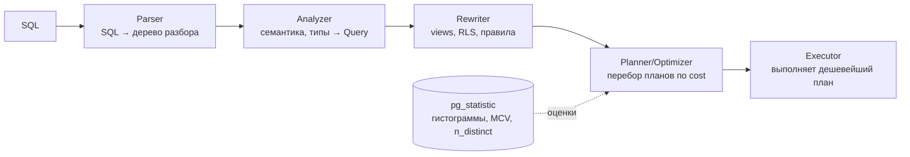

# Query Planning и EXPLAIN

## Содержание

- [Как работает планировщик](#как-работает-планировщик)
- [Статистика: pg_statistic и ANALYZE](#статистика-pg_statistic-и-analyze)
  - [Обновляется ли статистика сама](#обновляется-ли-статистика-сама)
- [Extended statistics: коррелированные колонки](#extended-statistics-коррелированные-колонки)
- [EXPLAIN: анатомия вывода](#explain-анатомия-вывода)
- [Опции EXPLAIN](#опции-explain)
- [EXPLAIN ANALYZE и EXPLAIN BUFFERS](#explain-analyze-и-explain-buffers)
- [Красные флаги: плохой план vs хороший](#красные-флаги-плохой-план-vs-хороший)
- [Узлы плана: шпаргалка](#узлы-плана-шпаргалка)
- [Типы сканов](#типы-сканов)
- [Стратегии соединения (JOIN)](#стратегии-соединения-join)
- [Современные узлы плана](#современные-узлы-плана)
- [Типичные проблемы планов](#типичные-проблемы-планов)
- [Управление планировщиком](#управление-планировщиком)
- [Interview-ready answer](#interview-ready-answer)

---

## Как работает планировщик

PostgreSQL использует **cost-based query planner**: он не выполняет «первый попавшийся» способ, а перебирает варианты (какой скан, какой порядок join, какой алгоритм соединения) и выбирает план с минимальной **расчётной** стоимостью. «Расчётной» — ключевое слово: планировщик не знает реальных данных, он оценивает их по статистике, и качество оценки напрямую определяет качество плана.



Стоимость (cost) — абстрактная единица, складывается из:
- числа страниц для чтения (`seq_page_cost` = 1.0, `random_page_cost` = 4.0 по умолчанию);
- числа обрабатываемых строк (`cpu_tuple_cost`);
- стоимости CPU-операций (`cpu_operator_cost`).

Оценка стоимости опирается на оценку **числа строк (cardinality)** на каждом шаге. Ошибся в cardinality — каскадно ошибся в выборе join, и вместо `Hash Join` за 50 мс получаешь `Nested Loop` на миллионы итераций. Поэтому диагностика плана = поиск шага, где `rows` (оценка) сильно разошлась с `actual rows`.

> Для очень большого числа join-ов (≥ `geqo_threshold`, по умолчанию 12 таблиц) полный перебор слишком дорог, и включается **GEQO** — генетический оптимизатор, который ищет «достаточно хороший» порядок join эвристикой.

---

## Статистика: pg_statistic и ANALYZE

Планировщик принимает решения на основе **статистики**, собранной командой `ANALYZE` (и автоматически — autovacuum'ом). Статистика — это сжатый портрет распределения значений в колонке.

Что хранится (на колонку):
- **n_distinct** — число различных значений (или его доля).
- **Гистограмма** — границы бакетов равной частоты, для оценки range-предикатов (`col > X`).
- **MCV (Most Common Values)** — список самых частых значений и их частот, для оценки equality (`col = X`).
- **correlation** — насколько физический порядок строк совпадает с порядком значений (важно для выбора Index vs Bitmap scan).

```sql
-- посмотреть статистику по столбцу
SELECT attname, n_distinct, correlation
FROM pg_stats
WHERE tablename = 'orders' AND attname = 'status';

-- MCV: наиболее частые значения
SELECT tablename, attname, most_common_vals, most_common_freqs
FROM pg_stats
WHERE tablename = 'orders' AND attname = 'status';
```

Параметр `default_statistics_target` (default 100) — сколько значений хранить в гистограмме/MCV. Для столбцов с неравномерным распределением, где планировщик ошибается, увеличить:

```sql
ALTER TABLE orders ALTER COLUMN status SET STATISTICS 500;
ANALYZE orders;
```

### Обновляется ли статистика сама

Да — её автоматически пересобирает **autoanalyze**, часть демона autovacuum. Но понимать механику важно, потому что «автоматически» ≠ «мгновенно».

**Что запускает autoanalyze.** У каждой таблицы PostgreSQL считает `n_mod_since_analyze` — сколько строк изменилось (insert + update + delete) с прошлого анализа. autoanalyze срабатывает, когда счётчик превысит порог:

```
порог = autovacuum_analyze_threshold        (default 50)
      + autovacuum_analyze_scale_factor × reltuples   (default 0.1 = 10%)
```

То есть по умолчанию таблица переанализируется примерно после **~10% изменений** (+50 строк). Сам анализ — это не полный скан, а **выборка** ~`300 × statistics_target` строк.

**Обновление асинхронно — статистика отстаёт от данных.** Статистика — это снимок распределения на момент последнего анализа. Когда данные меняются, снимок устаревает, а пересобирается не сразу: демон autovacuum просыпается раз в `autovacuum_naptime` (default 60 c), проверяет счётчики, и если таблица перешагнула порог — ставит ей воркер (их всего `autovacuum_max_workers`, по умолчанию 3, и они throttled). Пока воркер не отработает и не пересоберёт статистику, между «данные изменились» и «статистика обновилась» держится окно (секунды–минуты на нагруженном сервере), и всё это время планировщик считает по старому снимку.

Наглядно на массовой вставке:

```
t0  таблица пустая → статистика: "0 строк"
t1  COPY 5 000 000 строк          ← данные есть, статистика всё ещё "0 строк"
t1..t2  планировщик думает, что таблица пустая → выбирает Nested Loop,
        Seq Scan «дешёвого» пустого heap → планы разваливаются
t2  autoanalyze проснулся, отработал → статистика "5M строк, такое распределение"
t2+ планы снова адекватные
```

`ANALYZE table` вручную выполняется **синхронно, прямо сейчас** — окна отставания нет. Поэтому после bulk-загрузки/бэкфилла/`pg_restore` статистику освежают руками, не дожидаясь autoanalyze.

**Главная ловушка — большие таблицы.** 10% от 100 млн — это 10 млн изменений между анализами, поэтому на больших таблицах статистика подолгу устаревшая. Лечится снижением scale_factor **на конкретную таблицу**:

```sql
ALTER TABLE big_events SET (autovacuum_analyze_scale_factor = 0.02);  -- 2% вместо 10%
```

**Когда autoanalyze не поможет — нужен ручной `ANALYZE`:**
- сразу после массовой загрузки/миграции/бэкфилла (окно отставания выше);
- свежесозданная таблица — до первого анализа статистики нет вообще;
- **временные таблицы** — autovacuum их не видит, только `ANALYZE temp_table` вручную;
- **партиционированный родитель** — сводная статистика на нём не всегда обновляется из партиций автоматически;
- после `SET STATISTICS` или `CREATE STATISTICS` — чтобы новая точность/extended-статистика собралась.

**Как проверить, не протухла ли:**

```sql
SELECT relname, last_analyze, last_autoanalyze, n_mod_since_analyze, n_live_tup
FROM pg_stat_user_tables
WHERE relname = 'orders';
```

`n_mod_since_analyze`, большое относительно `n_live_tup` → статистика устарела, autoanalyze ещё не догнал (или порог для этой таблицы слишком высок).

---

## Extended statistics: коррелированные колонки

**Зачем.** Обычная статистика собирается **по каждой колонке отдельно**, и планировщик считает, что предикаты независимы: `selectivity(A AND B) = selectivity(A) × selectivity(B)`. Когда колонки **скоррелированы**, это даёт грубую недооценку.

Классический пример — `city` и `region` функционально зависимы (`Москва` всегда в регионе `Москва`):

```sql
-- по отдельности: city='Москва' → 5% строк, region='Москва' → 6% строк
-- планировщик: 0.05 × 0.06 = 0.3% → ОЖИДАЕТ ~30 строк из 10 000
SELECT * FROM addresses WHERE city = 'Москва' AND region = 'Москва';
-- реально: 500 строк (city уже определяет region) → недооценка в ~16x
-- → выбирает Nested Loop вместо Hash Join → план разваливается
```

Решение — **extended statistics** (`CREATE STATISTICS`): сказать планировщику собрать совместную статистику по группе колонок.

```sql
-- ndistinct: реальное число комбинаций (city, region) вместо произведения
-- dependencies: функциональные зависимости (city → region)
CREATE STATISTICS addr_stats (ndistinct, dependencies)
    ON city, region FROM addresses;
ANALYZE addresses;

-- mcv: совместные частые комбинации — самый точный, но дороже
CREATE STATISTICS addr_mcv (mcv) ON city, region FROM addresses;
ANALYZE addresses;
```

Три вида и что чинят:

| Вид | Что хранит | Чинит оценку |
|-----|------------|--------------|
| `dependencies` | функц. зависимости `A → B` | `WHERE A = x AND B = y` (коррелированные equality) |
| `ndistinct` | число различных комбинаций | `GROUP BY a, b`, число групп |
| `mcv` | частые комбинации значений | сложные `AND`/`OR` по нескольким колонкам |

Проверить, что собралось:

```sql
SELECT * FROM pg_stats_ext WHERE tablename = 'addresses';
```

Это один из немногих способов «объяснить» планировщику зависимость, которую он сам не выводит. Если в `EXPLAIN ANALYZE` видна большая недооценка строк именно на многоколоночном фильтре — кандидат на extended statistics.

---

## EXPLAIN: анатомия вывода

```sql
EXPLAIN SELECT id, email FROM users WHERE status = 'active' ORDER BY created_at DESC LIMIT 50;
```

Пример вывода:
```
Limit  (cost=0.43..10.28 rows=50 width=24)
  ->  Index Scan Backward using idx_users_created on users
        (cost=0.43..2847.43 rows=14482 width=24)
        Filter: ((status)::text = 'active'::text)
```

Как читать:
- `cost=start..total` — стоимость до первой строки и полная стоимость.
- `rows=N` — оценочное число строк.
- `width=N` — средняя ширина строки в байтах.
- `Filter:` — условие применяется ПОСЛЕ чтения (не индексный предикат).
- `Index Cond:` — условие используется индексом.

Дерево читается **снизу вверх** — нижние узлы выполняются первыми.

---

## Опции EXPLAIN

`EXPLAIN` принимает набор опций в скобках: `EXPLAIN (ANALYZE, BUFFERS) <query>`. Что каждая добавляет:

| Опция | Что добавляет | Когда нужна |
|---|---|---|
| `ANALYZE` | **реально выполняет** запрос → actual time/rows/loops | всегда для настоящей диагностики (осторожно с write-запросами!) |
| `BUFFERS` | учёт страниц: `shared/local/temp` `hit/read/dirtied/written` | понять, откуда идёт I/O; с PG 16 включается автоматически вместе с `ANALYZE` |
| `VERBOSE` | выходные колонки, имена схем, детали по каждому worker | увидеть, что именно тянется из каждого узла |
| `COSTS` (default on) | оценки `cost`/`rows`/`width` | `COSTS OFF` — для стабильного снапшота плана в тестах |
| `SETTINGS` | не-дефолтные параметры планировщика, повлиявшие на план | воспроизвести/объяснить, почему такой план |
| `WAL` | объём сгенерированного WAL | диагностика тяжёлых `INSERT`/`UPDATE`/`DELETE` |
| `TIMING` (default on с ANALYZE) | пер-узловое время | `TIMING OFF` снижает overhead замеров на очень быстрых запросах |
| `SUMMARY` | итоговые `Planning Time` / `Execution Time` | |
| `FORMAT TEXT\|JSON\|YAML\|XML` | формат вывода | `JSON` — для визуализаторов планов (explain.dalibo.com и т.п.) |
| `GENERIC_PLAN` | план параметризованного запроса **без выполнения** (плейсхолдеры `$1`), PG 16+ | посмотреть план prepared-запроса, не зная значений |

**Боевой набор — `EXPLAIN (ANALYZE, BUFFERS)`.** Он реально выполняет запрос, поэтому для `UPDATE`/`DELETE`/`INSERT` оборачивай в транзакцию и откатывай:

```sql
BEGIN;
EXPLAIN (ANALYZE, BUFFERS) UPDATE orders SET status = 'done' WHERE id = $1;
ROLLBACK;   -- план получили, данные не тронули
```

Посмотреть план параметризованного запроса, не подставляя значения:

```sql
EXPLAIN (GENERIC_PLAN) SELECT * FROM orders WHERE status = $1;
```

---

## EXPLAIN ANALYZE и EXPLAIN BUFFERS

`EXPLAIN ANALYZE` **реально выполняет** запрос и показывает фактические метрики:

```sql
EXPLAIN (ANALYZE, BUFFERS, FORMAT TEXT)
SELECT id, email FROM users WHERE status = 'active' ORDER BY created_at DESC LIMIT 50;
```

Пример с ANALYZE:
```
Index Scan Backward using idx_users_created on users
  (cost=0.43..2847.43 rows=14482 width=24)
  (actual time=0.082..1.432 rows=50 loops=1)
  Filter: ((status)::text = 'active'::text)
  Rows Removed by Filter: 312
Buffers: shared hit=58 read=12
Planning Time: 0.312 ms
Execution Time: 1.521 ms
```

Что смотреть:
- `actual rows` vs `rows` (estimate) — большое расхождение = плохая статистика.
- `loops` — сколько раз выполнялся узел (для Nested Loop). Внимание: `actual time` и `rows` в узле указаны **на один loop** — умножай на `loops`, чтобы получить суммарные.
- `Rows Removed by Filter` — сколько строк отброшено после чтения = нет подходящего индекса.
- `Planning Time` vs `Execution Time`.

Счётчики **Buffers** (в страницах по 8 KB) — что каждый значит:

| Счётчик | Смысл |
|---|---|
| `shared hit` | нашли в `shared_buffers` (кэш Postgres в RAM) — быстро, без диска |
| `shared read` | пришлось читать мимо кэша (из OS-кэша или с диска) — дорого |
| `dirtied` | страниц помечено «грязными» (изменены, потребуют записи) |
| `written` | страниц вытеснено на диск **прямо во время запроса** — плохой знак, кэша не хватило |
| `temp read/written` | временные файлы sort/hash, вышедшие за `work_mem` → spill на диск |

**Почему buffers важнее времени.** Время зависит от того, что уже в кэше: прогретый запрос быстрый, холодный — медленный, и `ms` скачут от запуска к запуску. Число прочитанных буферов — стабильная мера «сколько работы сделал запрос». Два запуска подряд: первый `read=1000`, второй `hit=1000` (данные уже в кэше) — время разное, работа одинаковая. Сравнивать запросы между собой надёжнее по `Buffers`, чем по `Execution Time`.

Для DELETE/UPDATE с риском использовать `EXPLAIN` без `ANALYZE`:
```sql
EXPLAIN UPDATE orders SET status = 'done' WHERE id = $1;
```

---

## Красные флаги: плохой план vs хороший

Как за несколько секунд понять, что план плохой — сигналы по убыванию важности:

| Красный флаг | Как выглядит в плане | О чём говорит |
|---|---|---|
| **Оценка ≠ реальность** | `rows=14000 ... (actual rows=3)` (или наоборот) | плохая/устаревшая статистика → каскадно неверный выбор join. `ANALYZE`, extended stats |
| **Много отброшено фильтром** | `Rows Removed by Filter: 999520` | нет подходящего индекса: прочитали кучу, оставили крохи |
| **Nested Loop с большими `loops`** | `Nested Loop ... (loops=100000)` | inner отработал 100k раз — обычно из-за недооценки outer; должен был быть Hash Join |
| **Spill на диск** | `Sort Method: external merge Disk: 24000kB`; в Hash — `Batches: 8` (не 1) | не хватило `work_mem`, sort/hash ушли на диск |
| **Index Only Scan с heap fetches** | `Heap Fetches: 88000` | visibility map неактуальна → фактически не «only»; нужен `VACUUM` |
| **Buffers read >> hit** | `Buffers: shared read=90000 hit=100` | запрос бьёт по диску, а не по кэшу — тянет слишком много или холодный |
| **Seq Scan под селективный фильтр** | `Seq Scan on orders (actual rows=5)` из миллиона | индекса нет или статистика врёт |

**Здоровый план — зеркально:** `rows ≈ actual` на каждом узле; доступ через `Index`/`Index Only Scan` там, где выбирается мало строк; `Rows Removed by Filter` близко к нулю; всё в `shared hit`; sort/hash в памяти (`Memory:`, а не `Disk:`); разумные `loops`.

**Метод чтения:** искать самый «тяжёлый» узел, а не первый попавшийся Seq Scan. `actual time` в узле — **накопительный** (включает детей), так что смотри, где время реально прирастает и где `rows` разошлись с оценкой; чини этот узел.

Мини-пример «до/после» — фильтр по неиндексированной колонке:

```
-- ПЛОХО
Seq Scan on orders  (cost=0..21500 rows=500)
                    (actual time=0.02..85.3 rows=480 loops=1)
  Filter: (status = 'pending')
  Rows Removed by Filter: 999520        -- прочитали ~1M строк ради 480
  Buffers: shared read=8130             -- 8130 страниц с диска

-- ХОРОШО (после CREATE INDEX ... (created_at) WHERE status='pending')
Index Scan using idx_orders_pending on orders
                    (actual time=0.03..0.51 rows=480 loops=1)
  Index Cond: ...
  Buffers: shared hit=12                -- 12 страниц из кэша вместо 8130 с диска
```

---

## Узлы плана: шпаргалка

Быстрый глоссарий узлов, которые встречаются в `EXPLAIN`. Подробности по ключевым — в секциях ниже.

**Сканы (как читаются данные):**

| Узел | Что делает | Когда ок / когда тревожно |
|---|---|---|
| `Seq Scan` | читает всю таблицу подряд | ок для малых таблиц и большой доли строк; тревожно под селективный фильтр на большой таблице |
| `Index Scan` | спуск по индексу → прыжок в heap за строкой | ок для точечных/малой доли; это random I/O |
| `Index Only Scan` | ответ целиком из индекса, heap не читается | лучший для covering; следи за `Heap Fetches` (должно быть ~0) |
| `Bitmap Index Scan` + `Bitmap Heap Scan` | собирает ctid в битмап, потом читает heap по порядку страниц | ок для средней доли строк и комбинации индексов (`BitmapAnd`/`BitmapOr`) |

**Соединения (JOIN):**

| Узел | Что делает | Когда ок / когда тревожно |
|---|---|---|
| `Nested Loop` | для каждой строки outer ищет совпадения в inner | ок: маленький outer + индекс на inner; тревожно: большие `loops` (недооценка outer) |
| `Hash Join` | строит хэш-таблицу из меньшего входа, проходит по большему | ок для средних/больших таблиц без индекса; тревожно `Batches > 1` (spill на диск) |
| `Merge Join` | сливает два **отсортированных** входа за один проход | ок когда оба уже отсортированы (индексы или после `Sort`) |

**Агрегация и сортировка:**

| Узел | Что делает | Заметки |
|---|---|---|
| `HashAggregate` | группирует через хэш-таблицу в памяти | `GROUP BY`/`DISTINCT`; тревожно spill при нехватке `work_mem` |
| `GroupAggregate` | группирует по уже отсортированному входу | требует `Sort` или индекс |
| `Sort` | полная сортировка входа | тревожно `Sort Method: external merge Disk:` (не влез в `work_mem`) |
| `Incremental Sort` | досортировывает внутри уже упорядоченных групп | дешевле полного `Sort` |
| `Unique` / `WindowAgg` | убирает дубли из отсортированного / оконные функции | |

**Прочие узлы:**

| Узел | Что делает | Заметки |
|---|---|---|
| `Limit` | обрывает выдачу после N строк | верхний узел `LIMIT` |
| `Append` / `Merge Append` | склеивает подпланы (партиции, `UNION ALL`) | `Merge Append` сохраняет отсортированность |
| `Gather` / `Gather Merge` | собирает результаты parallel-воркеров | `Gather Merge` сохраняет порядок |
| `Memoize` | кэширует inner-сторону `Nested Loop` | хорошо при дублях ключа; смотри `Hits/Misses` |
| `Materialize` | материализует подплан в память для повторного прохода | часто под `Nested Loop` |
| `Hash` | вспомогательный: строит хэш-таблицу для `Hash Join` | под ним — вход, который хэшируется |

---

## Типы сканов

### Sequential Scan (Seq Scan)

Читает всю таблицу страница за страницей. Эффективен когда нужна большая доля строк или таблица маленькая.

```
Seq Scan on users  (cost=0.00..1549.00 rows=100000 width=24)
```

### Index Scan

Читает индекс, потом для каждой строки идёт в heap за дополнительными полями. Random I/O.

```
Index Scan using idx_users_email on users  (cost=0.43..8.45 rows=1 width=24)
  Index Cond: (email = 'x@example.com')
```

### Index Only Scan

Читает только индекс, heap не нужен (все нужные данные есть в covering index). Самый быстрый для точечных запросов.

```
Index Only Scan using idx_users_email_covering on users
  Heap Fetches: 0
```

**Что такое `Heap Fetches` и почему он бывает не 0.** Индекс не хранит MVCC-видимость строки (видна ли версия твоей транзакции — это в heap-кортеже, `xmin`/`xmax`). Чтобы всё же не ходить в heap, PostgreSQL смотрит на **visibility map** — по 2 бита на страницу, которые `VACUUM` ставит, когда на странице все версии видны всем. Если страница помечена `all-visible` — heap не читается (`Heap Fetches: 0`); если нет (недавно менялась, VACUUM отстаёт) — приходится сходить в heap за проверкой видимости, и это отражается в `Heap Fetches > 0`. То есть «Index Only» экономит heap только там, где VM это подтвердил; большой `Heap Fetches` лечится `VACUUM`. Подробно (VM, псевдокод) — в [01-mvcc-and-vacuum.md](./01-mvcc-and-vacuum.md), раздел «Visibility map и Index Only Scan».

### Bitmap Index Scan + Bitmap Heap Scan

Используется когда нужно много строк через индекс. Строит bitmap страниц из индекса, потом читает страницы heap в порядке физического расположения.

```
Bitmap Heap Scan on orders
  Recheck Cond: (status = 'pending')
  ->  Bitmap Index Scan on idx_orders_status
        Index Cond: (status = 'pending')
```

Эффективнее Index Scan при большом числе строк (снижает random I/O).

---

## Стратегии соединения (JOIN)

### Nested Loop

Для каждой строки outer таблицы ищет совпадения в inner. O(N * M) в худшем случае. Эффективен с индексом на inner, для маленьких наборов.

```
Nested Loop
  ->  Seq Scan on orders (small table)
  ->  Index Scan on users using idx_users_id
        Index Cond: (users.id = orders.user_id)
```

### Hash Join

Строит hash table из меньшей таблицы, проходит по большей. O(N + M). Эффективен для средних и больших таблиц без подходящего индекса.

```
Hash Join
  Hash Cond: (orders.user_id = users.id)
  ->  Seq Scan on orders
  ->  Hash
        ->  Seq Scan on users
```

### Merge Join

Оба входа отсортированы (или индексы), соединяет за один проход. O(N + M). Эффективен когда оба набора уже отсортированы по ключу join.

```
Merge Join
  Merge Cond: (orders.user_id = users.id)
  ->  Index Scan using idx_orders_user on orders
  ->  Index Scan using idx_users_id on users
```

---

## Современные узлы плана

В `EXPLAIN` современных версий PostgreSQL встречаются узлы, которых не было в «классическом» наборе скан/join. Их полезно узнавать.

### Parallel query (Gather / Gather Merge)

Тяжёлый Seq Scan / агрегат может выполняться **несколькими worker-процессами** параллельно; узел `Gather` собирает их результаты. Включается, когда таблица крупнее `min_parallel_table_scan_size` и есть свободные `max_parallel_workers_per_gather`.

```
Gather  (workers planned: 2)
  ->  Parallel Seq Scan on orders
        Filter: (amount > 1000)
```

`Gather Merge` — то же, но сохраняет отсортированность входов (для parallel `ORDER BY`). Если параллелизм не включается на большой таблице — проверить `max_parallel_workers_per_gather` (часто = 0 в проде по ошибке).

### Memoize

Кеш результатов внутренней стороны `Nested Loop`: если outer часто подставляет одни и те же значения ключа, Memoize не выполняет inner-поиск повторно.

```
Nested Loop
  ->  Seq Scan on orders
  ->  Memoize                          -- кеш по orders.user_id
        Cache Key: orders.user_id
        Hits: 9500  Misses: 500        -- 95% попаданий → inner отработал 500 раз вместо 10000
        ->  Index Scan on users
```

Полезен, когда у outer много дубликатов ключа join. Управляется `enable_memoize`.

### Incremental Sort

Если данные уже частично отсортированы (есть индекс по префиксу ключа сортировки), PostgreSQL досортировывает только внутри групп, а не весь набор целиком.

```
Incremental Sort
  Sort Key: created_at, id
  Presorted Key: created_at           -- created_at уже из индекса, досортировка по id
```

### JIT-компиляция

Для запросов с высокой расчётной стоимостью PostgreSQL может **скомпилировать** выражения (фильтры, вычисления) в машинный код через LLVM — выгодно для аналитики по миллионам строк, но добавляет накладные расходы на саму компиляцию.

```
JIT:
  Functions: 6   Options: Inlining true, Optimization true
  Timing: Generation 1.2 ms, Inlining 5.0 ms, ... Emission 12.3 ms
```

Подвох: на коротком OLTP-запросе, который планировщик *переоценил*, JIT-компиляция может занять больше, чем само выполнение. Если в плане видно непропорционально большой `JIT Timing` — снизить порог `jit_above_cost` или выключить `SET jit = off` для таких запросов.

---

## Типичные проблемы планов

**Плохая оценка rows:**
```
rows=14482 (actual rows=1)
```
Причина: устаревшая или недостаточная статистика. Решение: `ANALYZE`, увеличить `statistics_target`.

**Filter вместо Index Cond:**
```
Filter: (status = 'active')
Rows Removed by Filter: 99500
```
Причина: нет подходящего индекса. Решение: добавить индекс или использовать partial/composite.

**Seq Scan вместо Index Scan:**
Планировщик решил, что seq scan дешевле. Варианты:
- Таблица маленькая — норма.
- Низкая selectivity — норма.
- Устаревшая статистика — `ANALYZE`.
- Неправильный `random_page_cost` для SSD — снизить до 1.1.

**Hash Join вместо Index Scan (unexpected):**
Может означать что `work_mem` слишком мал для hash table и идёт spill на диск:
```sql
SET work_mem = '64MB';
EXPLAIN ANALYZE <query>;
```

**Плохой план для параметризованных запросов:**
PostgreSQL кеширует план после 5 выполнений. Если распределение данных неоднородно — план может быть плохим. Решение: `SET plan_cache_mode = force_custom_plan;` (только для диагностики).

---

## Управление планировщиком

Включить/выключить типы планов (для диагностики, не для production):

```sql
SET enable_seqscan = off;
SET enable_hashjoin = off;
SET enable_nestloop = off;
```

Параметры, влияющие на выбор плана:

| Параметр | Default | Описание |
|---|---|---|
| `random_page_cost` | 4.0 | Стоимость random read. Для SSD: 1.1–2.0 |
| `seq_page_cost` | 1.0 | Стоимость seq read |
| `effective_cache_size` | 4GB | Оценка OS page cache для планировщика |
| `work_mem` | 4MB | Память для sort/hash per operation |
| `cpu_tuple_cost` | 0.01 | Стоимость обработки строки |

Рекомендации для SSD:
```sql
-- postgresql.conf
random_page_cost = 1.1
effective_cache_size = 12GB  # ~75% RAM
```

---

## Interview-ready answer

**1. Как планировщик выбирает план?**

- Cost-based: перебирает варианты и берёт с минимальной расчётной стоимостью; стоимость считается из оценки cardinality (числа строк) на каждом шаге.

**2. Откуда берётся cardinality?**

- Из статистики (гистограммы, MCV, n_distinct, correlation), собранной ANALYZE; плохая статистика → большое расхождение `rows` vs actual в EXPLAIN ANALYZE → плохой план.

**3. Статистика обновляется сама?**

- Да, autoanalyze (демон autovacuum) при ~10% изменений строк (`autovacuum_analyze_scale_factor` + threshold). Но асинхронно: между изменением данных и пересбором есть окно, когда планировщик считает по устаревшему снимку. На больших таблицах 10% — это миллионы строк, поэтому scale_factor снижают на таблицу; после bulk-загрузки, для temp-таблиц и свежих таблиц — `ANALYZE` вручную. Проверка свежести — `n_mod_since_analyze` в `pg_stat_user_tables`.

**4. Какие опции EXPLAIN знаешь и какой набор используешь?**

- Боевой — `EXPLAIN (ANALYZE, BUFFERS)`: `ANALYZE` реально выполняет и даёт actual time/rows/loops, `BUFFERS` — учёт страниц (с PG16 включён по умолчанию с ANALYZE). Ещё: `VERBOSE`, `SETTINGS`, `WAL`, `FORMAT JSON` (для визуализаторов), `GENERIC_PLAN` (план параметризованного запроса без выполнения, PG16). Для write-запросов — `BEGIN; EXPLAIN ANALYZE ...; ROLLBACK`.

**5. Как по плану отличить плохой запрос от хорошего?**

- Красные флаги: `rows` (оценка) сильно разошлась с `actual`; большой `Rows Removed by Filter`; `Nested Loop` с большими `loops`; sort/hash со spill на диск (`Disk:`, `Batches > 1`); `Heap Fetches` ≠ 0 у Index Only Scan; `Buffers read` >> `hit`. Здоровый план — `rows ≈ actual`, доступ индексом там, где мало строк, всё из `shared hit`, sort в памяти. Сравнивать запросы надёжнее по `Buffers`, чем по времени (время зависит от прогретости кэша).

**6. Что делать с коррелированными колонками?**

- Планировщик перемножает selectivity как независимые и недооценивает строки (city/region); лечится extended statistics — `CREATE STATISTICS ... (dependencies, ndistinct, mcv)`.

**7. Какие бывают типы сканов?**

- Seq Scan (вся таблица), Index Scan (random I/O через индекс), Index Only Scan (только индекс), Bitmap Scan (битмап страниц, для средней доли строк и комбинации индексов).

**8. Какие стратегии JOIN?**

- Nested Loop (inner с индексом, малые наборы), Hash Join (средние таблицы, hash в памяти), Merge Join (оба входа отсортированы).

**9. Какие современные узлы плана знать?**

- Parallel (Gather), Memoize (кеш inner у Nested Loop), Incremental Sort, JIT (вредит коротким OLTP-запросам).

**10. Что критично для SSD?**

- Снижать `random_page_cost` до 1.1 — иначе планировщик завышает стоимость Index Scan и уходит в Seq Scan.
