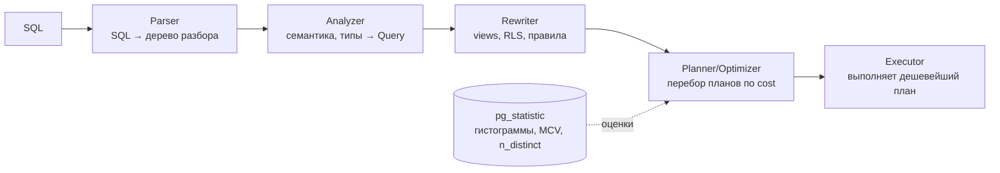

# Query Planning и EXPLAIN

## Содержание

- [Как работает планировщик](#как-работает-планировщик)
- [Статистика: pg_statistic и ANALYZE](#статистика-pg_statistic-и-analyze)
- [Extended statistics: коррелированные колонки](#extended-statistics-коррелированные-колонки)
- [EXPLAIN: анатомия вывода](#explain-анатомия-вывода)
- [EXPLAIN ANALYZE и EXPLAIN BUFFERS](#explain-analyze-и-explain-buffers)
- [Типы сканов](#типы-сканов)
- [Стратегии соединения (JOIN)](#стратегии-соединения-join)
- [Современные узлы плана](#современные-узлы-плана)
- [Типичные проблемы планов](#типичные-проблемы-планов)
- [Управление планировщиком](#управление-планировщиком)
- [Interview-ready answer](#interview-ready-answer)

---

## Как работает планировщик

PostgreSQL использует **cost-based query planner**: он не выполняет «первый попавшийся» способ, а перебирает варианты (какой скан, какой порядок join, какой алгоритм соединения) и выбирает план с минимальной **расчётной** стоимостью. «Расчётной» — ключевое слово: планировщик не знает реальных данных, он оценивает их по статистике, и качество оценки напрямую определяет качество плана.



Стоимость (cost) — абстрактная единица, складывается из:
- числа страниц для чтения (`seq_page_cost` = 1.0, `random_page_cost` = 4.0 по умолчанию);
- числа обрабатываемых строк (`cpu_tuple_cost`);
- стоимости CPU-операций (`cpu_operator_cost`).

Оценка стоимости опирается на оценку **числа строк (cardinality)** на каждом шаге. Ошибся в cardinality — каскадно ошибся в выборе join, и вместо `Hash Join` за 50 мс получаешь `Nested Loop` на миллионы итераций. Поэтому диагностика плана = поиск шага, где `rows` (оценка) сильно разошлась с `actual rows`.

> Для очень большого числа join-ов (≥ `geqo_threshold`, по умолчанию 12 таблиц) полный перебор слишком дорог, и включается **GEQO** — генетический оптимизатор, который ищет «достаточно хороший» порядок join эвристикой.

---

## Статистика: pg_statistic и ANALYZE

Планировщик принимает решения на основе **статистики**, собранной командой `ANALYZE` (и автоматически — autovacuum'ом). Статистика — это сжатый портрет распределения значений в колонке.

Что хранится (на колонку):
- **n_distinct** — число различных значений (или его доля).
- **Гистограмма** — границы бакетов равной частоты, для оценки range-предикатов (`col > X`).
- **MCV (Most Common Values)** — список самых частых значений и их частот, для оценки equality (`col = X`).
- **correlation** — насколько физический порядок строк совпадает с порядком значений (важно для выбора Index vs Bitmap scan).

```sql
-- посмотреть статистику по столбцу
SELECT attname, n_distinct, correlation
FROM pg_stats
WHERE tablename = 'orders' AND attname = 'status';

-- MCV: наиболее частые значения
SELECT tablename, attname, most_common_vals, most_common_freqs
FROM pg_stats
WHERE tablename = 'orders' AND attname = 'status';
```

Параметр `default_statistics_target` (default 100) — сколько значений хранить в гистограмме/MCV. Для столбцов с неравномерным распределением, где планировщик ошибается, увеличить:

```sql
ALTER TABLE orders ALTER COLUMN status SET STATISTICS 500;
ANALYZE orders;
```

---

## Extended statistics: коррелированные колонки

**Зачем.** Обычная статистика собирается **по каждой колонке отдельно**, и планировщик считает, что предикаты независимы: `selectivity(A AND B) = selectivity(A) × selectivity(B)`. Когда колонки **скоррелированы**, это даёт грубую недооценку.

Классический пример — `city` и `region` функционально зависимы (`Москва` всегда в регионе `Москва`):

```sql
-- по отдельности: city='Москва' → 5% строк, region='Москва' → 6% строк
-- планировщик: 0.05 × 0.06 = 0.3% → ОЖИДАЕТ ~30 строк из 10 000
SELECT * FROM addresses WHERE city = 'Москва' AND region = 'Москва';
-- реально: 500 строк (city уже определяет region) → недооценка в ~16x
-- → выбирает Nested Loop вместо Hash Join → план разваливается
```

Решение — **extended statistics** (`CREATE STATISTICS`, PG10+): сказать планировщику собрать совместную статистику по группе колонок.

```sql
-- ndistinct: реальное число комбинаций (city, region) вместо произведения
-- dependencies: функциональные зависимости (city → region)
CREATE STATISTICS addr_stats (ndistinct, dependencies)
    ON city, region FROM addresses;
ANALYZE addresses;

-- mcv: совместные частые комбинации (PG12+) — самый точный, но дороже
CREATE STATISTICS addr_mcv (mcv) ON city, region FROM addresses;
ANALYZE addresses;
```

Три вида и что чинят:

| Вид | Что хранит | Чинит оценку |
|-----|------------|--------------|
| `dependencies` | функц. зависимости `A → B` | `WHERE A = x AND B = y` (коррелированные equality) |
| `ndistinct` | число различных комбинаций | `GROUP BY a, b`, число групп |
| `mcv` | частые комбинации значений | сложные `AND`/`OR` по нескольким колонкам |

Проверить, что собралось:

```sql
SELECT * FROM pg_stats_ext WHERE tablename = 'addresses';
```

Это один из немногих способов «объяснить» планировщику зависимость, которую он сам не выводит. Если в `EXPLAIN ANALYZE` видна большая недооценка строк именно на многоколоночном фильтре — кандидат на extended statistics.

---

## EXPLAIN: анатомия вывода

```sql
EXPLAIN SELECT id, email FROM users WHERE status = 'active' ORDER BY created_at DESC LIMIT 50;
```

Пример вывода:
```
Limit  (cost=0.43..10.28 rows=50 width=24)
  ->  Index Scan Backward using idx_users_created on users
        (cost=0.43..2847.43 rows=14482 width=24)
        Filter: ((status)::text = 'active'::text)
```

Как читать:
- `cost=start..total` — стоимость до первой строки и полная стоимость.
- `rows=N` — оценочное число строк.
- `width=N` — средняя ширина строки в байтах.
- `Filter:` — условие применяется ПОСЛЕ чтения (не индексный предикат).
- `Index Cond:` — условие используется индексом.

Дерево читается **снизу вверх** — нижние узлы выполняются первыми.

---

## EXPLAIN ANALYZE и EXPLAIN BUFFERS

`EXPLAIN ANALYZE` **реально выполняет** запрос и показывает фактические метрики:

```sql
EXPLAIN (ANALYZE, BUFFERS, FORMAT TEXT)
SELECT id, email FROM users WHERE status = 'active' ORDER BY created_at DESC LIMIT 50;
```

Пример с ANALYZE:
```
Index Scan Backward using idx_users_created on users
  (cost=0.43..2847.43 rows=14482 width=24)
  (actual time=0.082..1.432 rows=50 loops=1)
  Filter: ((status)::text = 'active'::text)
  Rows Removed by Filter: 312
Buffers: shared hit=58 read=12
Planning Time: 0.312 ms
Execution Time: 1.521 ms
```

Что смотреть:
- `actual rows` vs `rows` (estimate) — большое расхождение = плохая статистика.
- `loops` — сколько раз выполнялся узел (для Nested Loop).
- `Rows Removed by Filter` — сколько строк отброшено после чтения = нет подходящего индекса.
- `Buffers: shared hit` — из cache, `read` — с диска.
- `Planning Time` vs `Execution Time`.

Для DELETE/UPDATE с риском использовать `EXPLAIN` без `ANALYZE`:
```sql
EXPLAIN UPDATE orders SET status = 'done' WHERE id = $1;
```

---

## Типы сканов

### Sequential Scan (Seq Scan)

Читает всю таблицу страница за страницей. Эффективен когда нужна большая доля строк или таблица маленькая.

```
Seq Scan on users  (cost=0.00..1549.00 rows=100000 width=24)
```

### Index Scan

Читает индекс, потом для каждой строки идёт в heap за дополнительными полями. Random I/O.

```
Index Scan using idx_users_email on users  (cost=0.43..8.45 rows=1 width=24)
  Index Cond: (email = 'x@example.com')
```

### Index Only Scan

Читает только индекс, heap не нужен (все нужные данные есть в covering index). Самый быстрый для точечных запросов.

```
Index Only Scan using idx_users_email_covering on users
  Heap Fetches: 0
```

### Bitmap Index Scan + Bitmap Heap Scan

Используется когда нужно много строк через индекс. Строит bitmap страниц из индекса, потом читает страницы heap в порядке физического расположения.

```
Bitmap Heap Scan on orders
  Recheck Cond: (status = 'pending')
  ->  Bitmap Index Scan on idx_orders_status
        Index Cond: (status = 'pending')
```

Эффективнее Index Scan при большом числе строк (снижает random I/O).

---

## Стратегии соединения (JOIN)

### Nested Loop

Для каждой строки outer таблицы ищет совпадения в inner. O(N * M) в худшем случае. Эффективен с индексом на inner, для маленьких наборов.

```
Nested Loop
  ->  Seq Scan on orders (small table)
  ->  Index Scan on users using idx_users_id
        Index Cond: (users.id = orders.user_id)
```

### Hash Join

Строит hash table из меньшей таблицы, проходит по большей. O(N + M). Эффективен для средних и больших таблиц без подходящего индекса.

```
Hash Join
  Hash Cond: (orders.user_id = users.id)
  ->  Seq Scan on orders
  ->  Hash
        ->  Seq Scan on users
```

### Merge Join

Оба входа отсортированы (или индексы), соединяет за один проход. O(N + M). Эффективен когда оба набора уже отсортированы по ключу join.

```
Merge Join
  Merge Cond: (orders.user_id = users.id)
  ->  Index Scan using idx_orders_user on orders
  ->  Index Scan using idx_users_id on users
```

---

## Современные узлы плана

В `EXPLAIN` современных версий PostgreSQL встречаются узлы, которых не было в «классическом» наборе скан/join. Их полезно узнавать.

### Parallel query (Gather / Gather Merge)

Тяжёлый Seq Scan / агрегат может выполняться **несколькими worker-процессами** параллельно; узел `Gather` собирает их результаты. Включается, когда таблица крупнее `min_parallel_table_scan_size` и есть свободные `max_parallel_workers_per_gather`.

```
Gather  (workers planned: 2)
  ->  Parallel Seq Scan on orders
        Filter: (amount > 1000)
```

`Gather Merge` — то же, но сохраняет отсортированность входов (для parallel `ORDER BY`). Если параллелизм не включается на большой таблице — проверить `max_parallel_workers_per_gather` (часто = 0 в проде по ошибке).

### Memoize (PG 14+)

Кеш результатов внутренней стороны `Nested Loop`: если outer часто подставляет одни и те же значения ключа, Memoize не выполняет inner-поиск повторно.

```
Nested Loop
  ->  Seq Scan on orders
  ->  Memoize                          -- кеш по orders.user_id
        Cache Key: orders.user_id
        Hits: 9500  Misses: 500        -- 95% попаданий → inner отработал 500 раз вместо 10000
        ->  Index Scan on users
```

Полезен, когда у outer много дубликатов ключа join. Управляется `enable_memoize`.

### Incremental Sort (PG 13+)

Если данные уже частично отсортированы (есть индекс по префиксу ключа сортировки), PostgreSQL досортировывает только внутри групп, а не весь набор целиком.

```
Incremental Sort
  Sort Key: created_at, id
  Presorted Key: created_at           -- created_at уже из индекса, досортировка по id
```

### JIT-компиляция (PG 11+)

Для запросов с высокой расчётной стоимостью PostgreSQL может **скомпилировать** выражения (фильтры, вычисления) в машинный код через LLVM — выгодно для аналитики по миллионам строк, но добавляет накладные расходы на саму компиляцию.

```
JIT:
  Functions: 6   Options: Inlining true, Optimization true
  Timing: Generation 1.2 ms, Inlining 5.0 ms, ... Emission 12.3 ms
```

Подвох: на коротком OLTP-запросе, который планировщик *переоценил*, JIT-компиляция может занять больше, чем само выполнение. Если в плане видно непропорционально большой `JIT Timing` — снизить порог `jit_above_cost` или выключить `SET jit = off` для таких запросов.

---

## Типичные проблемы планов

**Плохая оценка rows:**
```
rows=14482 (actual rows=1)
```
Причина: устаревшая или недостаточная статистика. Решение: `ANALYZE`, увеличить `statistics_target`.

**Filter вместо Index Cond:**
```
Filter: (status = 'active')
Rows Removed by Filter: 99500
```
Причина: нет подходящего индекса. Решение: добавить индекс или использовать partial/composite.

**Seq Scan вместо Index Scan:**
Планировщик решил, что seq scan дешевле. Варианты:
- Таблица маленькая — норма.
- Низкая selectivity — норма.
- Устаревшая статистика — `ANALYZE`.
- Неправильный `random_page_cost` для SSD — снизить до 1.1.

**Hash Join вместо Index Scan (unexpected):**
Может означать что `work_mem` слишком мал для hash table и идёт spill на диск:
```sql
SET work_mem = '64MB';
EXPLAIN ANALYZE <query>;
```

**Плохой план для параметризованных запросов:**
PostgreSQL кеширует план после 5 выполнений. Если распределение данных неоднородно — план может быть плохим. Решение: `SET plan_cache_mode = force_custom_plan;` (только для диагностики).

---

## Управление планировщиком

Включить/выключить типы планов (для диагностики, не для production):

```sql
SET enable_seqscan = off;
SET enable_hashjoin = off;
SET enable_nestloop = off;
```

Параметры, влияющие на выбор плана:

| Параметр | Default | Описание |
|---|---|---|
| `random_page_cost` | 4.0 | Стоимость random read. Для SSD: 1.1–2.0 |
| `seq_page_cost` | 1.0 | Стоимость seq read |
| `effective_cache_size` | 4GB | Оценка OS page cache для планировщика |
| `work_mem` | 4MB | Память для sort/hash per operation |
| `cpu_tuple_cost` | 0.01 | Стоимость обработки строки |

Рекомендации для SSD:
```sql
-- postgresql.conf
random_page_cost = 1.1
effective_cache_size = 12GB  # ~75% RAM
```

---

## Interview-ready answer

**1. Как планировщик выбирает план?**

- Cost-based: перебирает варианты и берёт с минимальной расчётной стоимостью; стоимость считается из оценки cardinality (числа строк) на каждом шаге.

**2. Откуда берётся cardinality?**

- Из статистики (гистограммы, MCV, n_distinct, correlation), собранной ANALYZE; плохая статистика → большое расхождение `rows` vs actual в EXPLAIN ANALYZE → плохой план.

**3. Что делать с коррелированными колонками?**

- Планировщик перемножает selectivity как независимые и недооценивает строки (city/region); лечится extended statistics — `CREATE STATISTICS ... (dependencies, ndistinct, mcv)`.

**4. Какие бывают типы сканов?**

- Seq Scan (вся таблица), Index Scan (random I/O через индекс), Index Only Scan (только индекс), Bitmap Scan (битмап страниц, для средней доли строк и комбинации индексов).

**5. Какие стратегии JOIN?**

- Nested Loop (inner с индексом, малые наборы), Hash Join (средние таблицы, hash в памяти), Merge Join (оба входа отсортированы).

**6. Какие современные узлы плана знать?**

- Parallel (Gather), Memoize (кеш inner у Nested Loop, PG14), Incremental Sort (PG13), JIT (PG11 — вредит коротким OLTP-запросам).

**7. Что критично для SSD?**

- Снижать `random_page_cost` до 1.1 — иначе планировщик завышает стоимость Index Scan и уходит в Seq Scan.
