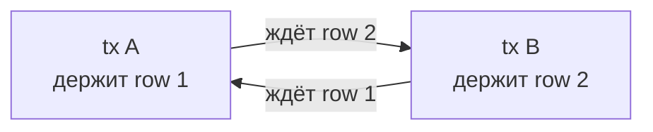

# Транзакции и блокировки

## Содержание

- [Isolation levels в PostgreSQL](#isolation-levels-в-postgresql)
- [Как выбирать isolation level в реальном проекте](#как-выбирать-isolation-level-в-реальном-проекте)
- [Аномалии и как PG их предотвращает](#аномалии-и-как-pg-их-предотвращает)
- [Типы блокировок таблиц](#типы-блокировок-таблиц)
- [Row-level locks](#row-level-locks)
- [SELECT FOR UPDATE / FOR SHARE](#select-for-update--for-share)
- [SKIP LOCKED — паттерн очереди](#skip-locked--паттерн-очереди)
- [Advisory locks](#advisory-locks)
- [Deadlock: как возникает и как лечить](#deadlock-как-возникает-и-как-лечить)
- [DDL и locks](#ddl-и-locks)
- [Мониторинг блокировок](#мониторинг-блокировок)
- [Interview-ready answer](#interview-ready-answer)

---

## Isolation levels в PostgreSQL

Стандарт SQL определяет **четыре** уровня изоляции, но PostgreSQL реально реализует только **три** — самый слабый, `READ UNCOMMITTED`, в PG отсутствует и работает как `READ COMMITTED`:

| Уровень | Dirty read | Non-repeatable read | Phantom read | Write skew |
|---|---|---|---|---|
| `READ UNCOMMITTED` (нет в PG\*) | да (по стандарту) | да | да | да |
| `READ COMMITTED` (default) | нет | возможен | возможен | возможен |
| `REPEATABLE READ` | нет | нет | нет\*\* | возможен |
| `SERIALIZABLE` | нет | нет | нет | нет |

\* `READ UNCOMMITTED` в PostgreSQL **не реализован**: если его запросить, движок молча поднимает изоляцию до `READ COMMITTED`, поэтому **грязного чтения в PG нет ни на одном уровне**. По стандарту SQL этот уровень разрешает dirty read (читать неподтверждённые чужие изменения) — и в ряде других СУБД (SQL Server, MySQL/InnoDB) он действительно так работает. В строке показано именно стандартное поведение, для полноты картины.

\*\* В PostgreSQL phantom read тоже предотвращается на REPEATABLE READ из-за snapshot.

Как задать:
```sql
BEGIN TRANSACTION ISOLATION LEVEL REPEATABLE READ;
-- или
BEGIN TRANSACTION ISOLATION LEVEL SERIALIZABLE;
```

### Как выбирать isolation level в реальном проекте

Начинать стоит не с вопроса «какой уровень строже», а с инварианта: что именно
нельзя нарушить при одновременных запросах. Более строгая изоляция уменьшает
число допустимых аномалий, но может увеличить число откатов с `40001` и
усложнить обработку ошибок. Поэтому `READ COMMITTED` — хороший default, пока инвариант можно
выразить одним атомарным SQL-выражением, `UNIQUE`/`CHECK`/foreign key либо
явной блокировкой строки.

| Уровень | Пример из реального сервиса | Почему подходит | Что обязательно учесть |
| --- | --- | --- | --- |
| `READ UNCOMMITTED` | Не выбирать: в PostgreSQL это псевдоним `READ COMMITTED`. | Отдельной, более слабой семантики и выигрыша в производительности нет. | Не рассчитывать на dirty read для аналитики или отладки: PostgreSQL их не показывает. |
| `READ COMMITTED` | Обычный CRUD: изменить профиль, перевести заказ из `new` в `paid`, добавить строку outbox в той же транзакции. | Каждый SQL-оператор видит свежий committed snapshot; для заранее известных строк этого обычно достаточно. | Защищать правила данных constraints и идемпотентностью. Повторный `SELECT` в той же транзакции может вернуть уже другое состояние. |
| `READ COMMITTED` | Списать остаток товара или лимит, не уходя в минус. | Проверка и изменение происходят одним атомарным `UPDATE`, поэтому не нужен более строгий снимок всей БД. | Не делать `SELECT available`, вычисление в Go и отдельный `UPDATE`: два запроса могут принять решение по одному остатку. Использовать `UPDATE ... WHERE available >= $1 ... RETURNING`. |
| `REPEATABLE READ` | Сформировать CSV/PDF-отчёт: прочитать настройки отчёта, строки заказов и агрегаты несколькими запросами. | Все запросы видят один снимок, поэтому итоговые строки и суммы относятся к одному моменту времени. | Держать транзакцию короткой: долгий экспорт удерживает старый snapshot. Если отчёт ещё и меняет строку, при конкурентном изменении нужен retry всей транзакции после `40001`. |
| `REPEATABLE READ` | Многошаговая операция над одной сущностью: прочитать заказ и его позиции, проверить состояние, затем обновить заказ. | Стабильное чтение упрощает логику: проверка не «переезжает» между запросами. | Не использовать как единственную защиту инварианта, зависящего от нескольких строк: возможен write skew. Для часто обновляемой сущности иногда проще `SELECT ... FOR UPDATE`. |
| `SERIALIZABLE` | Бронирование ресурса, когда правило зависит от запроса: «в этот интервал можно занять не больше N мест» или «в смене остаётся хотя бы один дежурный врач». | Предотвращает write skew: две транзакции не смогут одновременно принять несовместимые решения по разным строкам. | Любая транзакция должна корректно повторяться целиком при `40001`; внешнюю отправку письма, списание в платёжном провайдере и публикацию в брокер нельзя бездумно помещать внутрь retry-цикла. |
| `SERIALIZABLE` | Сложная бизнес-квота: один пользователь не может получить больше K активных промокодов, а проверка идёт по набору строк. | Позволяет сначала выразить правило в обычной последовательной транзакции, а PostgreSQL не даст конкурентным выполнением нарушить его. | На горячем ресурсе откатов может быть много. Сначала оценить более дешёвую модель: атомарный счётчик, `UNIQUE`/`EXCLUDE` constraint или лок на один агрегат. |

Например, резервирование остатка под `READ COMMITTED` безопасно, потому что
проверка и списание — одна операция:

```sql
UPDATE products
SET available = available - $1
WHERE id = $2
  AND available >= $1
RETURNING id, available;

-- Нет строки в результате: товара уже не хватает.
```

Здесь смена уровня изоляции не заменяет правильный SQL. Аналогично, уникальность
email должна обеспечиваться `UNIQUE (email)`, а не схемой «сначала SELECT,
потом INSERT» под `SERIALIZABLE`: constraint остаётся последней линией защиты
даже при строгой изоляции.

---

## Аномалии и как PG их предотвращает

### Dirty Read

**Определение:** транзакция читает изменения другой транзакции, которая ещё **не закоммитила** (и, возможно, откатится — тогда прочитанного «никогда не было»).

В PostgreSQL **никогда не происходит** — MVCC всегда показывает только закоммиченные данные, поэтому dirty read невозможен ни на одном уровне.

### Non-repeatable Read

**Определение:** одна и та же **строка**, прочитанная в транзакции дважды, во второй раз возвращает другое значение — между чтениями другая транзакция закоммитила `UPDATE`/`DELETE` этой строки. «Non-repeatable» = повторное чтение не воспроизводит первое.

```sql
-- Транзакция A (READ COMMITTED):
BEGIN;
SELECT balance FROM accounts WHERE id = 1;  -- получили 100

-- Транзакция B коммитит UPDATE: balance = 200

SELECT balance FROM accounts WHERE id = 1;  -- получили 200 (!)
COMMIT;
```

На `REPEATABLE READ` второй SELECT возвращает 100 — снапшот зафиксирован в начале транзакции.

### Phantom Read

**Определение:** повторный запрос **по условию** (`WHERE`, агрегат) возвращает другой **набор** строк — между чтениями другая транзакция закоммитила `INSERT`/`DELETE` строк, подходящих под условие. Отличие от non-repeatable read: там менялось значение в уже существующей строке, здесь меняется **состав** результата (появляются или исчезают «строки-призраки»).

```sql
-- Транзакция A (READ COMMITTED):
BEGIN;
SELECT COUNT(*) FROM orders WHERE user_id = 5;  -- 3

-- Транзакция B коммитит INSERT нового заказа

SELECT COUNT(*) FROM orders WHERE user_id = 5;  -- 4 (!)
COMMIT;
```

На `REPEATABLE READ` в PostgreSQL оба COUNT вернут 3.

### Write Skew

**Определение:** две транзакции читают **пересекающийся** набор данных, каждая по нему принимает решение и пишет в **свои, разные** строки. Прямого конфликта записи нет (пишут в разное), поэтому snapshot isolation (`REPEATABLE READ`) обе пропускает — но вместе они нарушают инвариант, который каждая по отдельности соблюдала. Не путать с lost update: там обе транзакции пишут в **одну** строку. Термин не из ANSI SQL — из статьи о snapshot isolation, отсюда и незнакомость.

```sql
-- Инвариант: в смене должен быть хотя бы один врач дежурный
-- Транзакция A: доктор Иванов видит дежурит Петров → снимает себя
-- Транзакция B: доктор Петров видит дежурит Иванов → снимает себя
-- Оба закоммитили → никто не дежурит
```

Решения:
- `SERIALIZABLE` — SSI обнаружит конфликт и откатит одну из транзакций.
- `SELECT FOR UPDATE` — явная блокировка строк.
- Пессимистическая блокировка через advisory lock.

### Serialization anomaly (SSI)

`SERIALIZABLE` в PostgreSQL реализован через **SSI (Serializable Snapshot Isolation)** — он не блокирует читателей (в отличие от классического strict-2PL с блокировками на чтение), а строит граф зависимостей между транзакциями и откатывает одну, если видит, что результат не эквивалентен ни одному последовательному порядку.

**Как это работает под капотом.** SSI отслеживает **rw-зависимости** (read-write antidependency): транзакция T1 *прочитала* данные, которые T2 затем *изменила*. Опасный паттерн — «дуга на вход и дуга на выход» у одной транзакции:

```text
T1 --rw--> T2 --rw--> T3
```

Если у транзекции есть и входящая, и исходящая rw-дуга (pivot), возможна аномалия (write skew). PostgreSQL обнаруживает такой «опасный треугольник» и откатывает pivot с ошибкой `40001`.

Чтобы засечь, что T1 прочитала, а T2 пишет, нужны **predicate locks** (SIREAD-локи): не настоящие блокировки, а **пометки «эта транзакция читала вот эти строки/диапазон»**. Они:
- не блокируют чужие операции (читатель не мешает писателю);
- укрупняются при нехватке памяти: строка → страница → таблица. Грубое укрупнение даёт больше «ложных» конфликтов → больше откатов `40001` под нагрузкой.

```sql
-- predicate-локи SSI видны как mode = 'SIReadLock' в pg_locks
SELECT pid, relation::regclass, page, tuple, mode
FROM pg_locks WHERE mode = 'SIReadLock';
```

Практические следствия:
- SERIALIZABLE на чтении тоже может упасть с `40001` — даже у read-only транзакции (если она оказалась pivot). **Любая** транзакция под SERIALIZABLE обязана иметь retry-петлю.
- Чем короче транзакции и точнее предикаты (есть индекс — лочится диапазон, нет — лочится больше), тем меньше ложных откатов.

```go
for {
    err := doSerializableTransaction(ctx, pool)
    if isSerializationFailure(err) {
        continue // retry — обязателен под SERIALIZABLE
    }
    break
}

func isSerializationFailure(err error) bool {
    var pgErr *pgconn.PgError
    return errors.As(err, &pgErr) && pgErr.Code == "40001"
}
```

---

## Типы блокировок таблиц

PostgreSQL использует таблицу `pg_locks` для отслеживания. Для таблиц — 8 уровней (от слабого к сильному):

| Lock Mode | Совместим с | Получается при |
|---|---|---|
| `ACCESS SHARE` | всеми, кроме ACCESS EXCLUSIVE | SELECT |
| `ROW SHARE` | всеми, кроме EXCLUSIVE, ACCESS EXCLUSIVE | SELECT FOR UPDATE/SHARE |
| `ROW EXCLUSIVE` | ACCESS SHARE, ROW SHARE | INSERT, UPDATE, DELETE |
| `SHARE UPDATE EXCLUSIVE` | ACCESS SHARE, ROW SHARE, ROW EXCLUSIVE | VACUUM, CREATE INDEX CONCURRENTLY |
| `SHARE` | ACCESS SHARE, ROW SHARE, SHARE | CREATE INDEX (без CONCURRENTLY) |
| `SHARE ROW EXCLUSIVE` | ACCESS SHARE, ROW SHARE | некоторые DDL |
| `EXCLUSIVE` | ACCESS SHARE | редко в MVCC |
| `ACCESS EXCLUSIVE` | никем | ALTER TABLE, DROP TABLE, TRUNCATE, LOCK TABLE |

Практический вывод: обычные DML (SELECT/INSERT/UPDATE/DELETE) совместимы друг с другом. `ALTER TABLE` блокирует всё.

---

## Row-level locks

PostgreSQL поддерживает 4 режима блокировки строк:

| Режим | Конфликтует с | Когда используется |
|---|---|---|
| `FOR KEY SHARE` | FOR UPDATE, FOR NO KEY UPDATE | Foreign key checks |
| `FOR SHARE` | FOR UPDATE, FOR NO KEY UPDATE | Чтение с защитой от UPDATE |
| `FOR NO KEY UPDATE` | FOR UPDATE, FOR NO KEY UPDATE, FOR SHARE | UPDATE без изменения PK |
| `FOR UPDATE` | всеми | Явная блокировка для update |

---

## SELECT FOR UPDATE / FOR SHARE

`SELECT FOR UPDATE` — захватить строку как "буду обновлять". Блокирует другие `FOR UPDATE` до COMMIT/ROLLBACK.

```sql
BEGIN;
SELECT balance FROM accounts WHERE id = $1 FOR UPDATE;
-- другие транзакции с FOR UPDATE на ту же строку ждут
UPDATE accounts SET balance = balance - $2 WHERE id = $1;
COMMIT;
```

**Время жизни блокировки — до конца транзакции, а не до конца SELECT-а.** Лок держится, пока транзакция не завершится:
- `COMMIT` / `ROLLBACK` — освобождает;
- **обрыв сессии** — сервер замечает мёртвый backend, откатывает его транзакцию и снимает лок (не всегда мгновенно — зависит от TCP keepalive).

Механически это не запись в lock-таблице, а пометка в самой строке (`xmax` блокирующей транзакции; при нескольких блокировщиках — через multixact), поэтому лок живёт ровно столько же, сколько транзакция. Отсюда две ловушки:

- **`FOR UPDATE` без явной транзакции бесполезен.** В autocommit-режиме одиночный `SELECT ... FOR UPDATE` — это своя транзакция, коммитящаяся **сразу** после стейтмента → лок снимается через миллисекунды и никого не удерживает. Смысл есть только внутри `BEGIN … <работа> … COMMIT`.
- **Idle in transaction = лок висит.** Если после `FOR UPDATE` приложение «задумалось» (ждёт внешний сервис, зависло) и не коммитит — строки заблокированы всё это время, на них копится очередь. Держи такие транзакции короткими и ставь `idle_in_transaction_session_timeout`, чтобы сервер сам прибивал зависшие.

`FOR UPDATE OF table` — в join блокировать строки только из конкретной таблицы:

```sql
SELECT o.id, u.email
FROM orders o
JOIN users u ON u.id = o.user_id
WHERE o.id = $1
FOR UPDATE OF o;  -- блокируем только orders, не users
```

`FOR SHARE` — "буду читать, не удаляйте". Блокирует `DELETE`/`UPDATE` этой строки, но **не** другие `FOR SHARE` — то есть несколько транзакций могут держать shared-лок на одну строку одновременно (в отличие от эксклюзивного `FOR UPDATE`).

Типичный кейс — гарантировать, что нужная строка не исчезнет до конца транзакции, но не мешать другим её тоже читать. Например, убедиться, что пользователь существует и не будет удалён, пока создаём заказ:

```sql
BEGIN;
-- держим users(id) от DELETE/UPDATE до COMMIT; другие транзакции
-- могут взять FOR SHARE на ту же строку, но удалить её не смогут
SELECT id FROM users WHERE id = $1 FOR SHARE;
INSERT INTO orders (user_id, total) VALUES ($1, $2);
COMMIT;
```

Это ровно то, что PostgreSQL делает под капотом при проверке внешних ключей (`FOR KEY SHARE`): не даёт удалить родителя, пока вставляется ссылающийся на него ребёнок.

### Ограничить ожидание блокировки: `lock_timeout`

Если строка уже занята другой транзакцией, `SELECT ... FOR UPDATE` **блокируется** — встаёт в очередь и ждёт, пока та закоммитит. По умолчанию это ожидание **бесконечное**. `lock_timeout` ограничивает, сколько ждать *получения* лока, прежде чем упасть с ошибкой (лучше упасть и отпустить, чем висеть и копить очередь за собой):

```sql
SET lock_timeout = '5s';
SELECT * FROM orders WHERE id = $1 FOR UPDATE;
-- ERROR: canceling statement due to lock timeout   (если за 5с лок не получен)
```

Это один из четырёх похожих таймаутов, которые часто путают — важно не смешивать «ждать лок» и «выполняться»:

| Параметр | Что ограничивает | Что делает по истечении |
|---|---|---|
| `lock_timeout` | сколько **ждать получения** блокировки | ошибка `canceling statement due to lock timeout` |
| `statement_timeout` | сколько запрос **выполняется** целиком | отмена запроса |
| `deadlock_timeout` | через сколько **проверить на дедлок** (не отмена — задержка детекта, default 1s) | запуск проверки wait-for графа |
| `idle_in_transaction_session_timeout` | сколько транзакция **висит открытой без работы** | обрыв транзакции (см. [FOR UPDATE](#select-for-update--for-share) выше) |

Практический пример из миграций: `SET lock_timeout = '2s'` перед `ALTER TABLE` не даёт «мгновенному» DDL, ждущему чужой долгий запрос, заморозить весь трафик за собой (разбор — [highload: онлайн-миграция](./highload-scenarios/05-online-schema-migration.md)).

---

## SKIP LOCKED — паттерн очереди

`SKIP LOCKED` — пропустить заблокированные строки вместо ожидания. Идеален для очередей задач с несколькими воркерами.

```sql
-- воркер берёт одну задачу из очереди
BEGIN;
SELECT id, payload
FROM tasks
WHERE status = 'pending'
ORDER BY created_at
LIMIT 1
FOR UPDATE SKIP LOCKED;

-- если нашли — обрабатываем
UPDATE tasks SET status = 'processing', worker_id = $1 WHERE id = $2;
COMMIT;
```

Несколько воркеров могут параллельно забирать задачи — SKIP LOCKED гарантирует, что разные воркеры получат разные строки.

```sql
-- взять батч из 10 задач
SELECT id FROM tasks
WHERE status = 'pending'
ORDER BY priority DESC, created_at
LIMIT 10
FOR UPDATE SKIP LOCKED;
```

---

## Advisory locks

Advisory locks — приложение само управляет захватом/освобождением. PostgreSQL только хранит состояние. Полезны для распределённых mutex'ов.

```sql
-- захватить блокировку (блокирующий вариант)
SELECT pg_advisory_lock(12345);

-- попробовать захватить (неблокирующий)
SELECT pg_try_advisory_lock(12345);  -- TRUE если захвачено

-- освободить
SELECT pg_advisory_unlock(12345);

-- session-level: держится до конца сессии или явного unlock
-- transaction-level: освобождается при COMMIT/ROLLBACK
SELECT pg_advisory_xact_lock(12345);  -- transaction-level
```

Пример в Go — глобальный mutex для cron-задачи:

```go
const lockKey = 42

func runOnce(ctx context.Context, pool *pgxpool.Pool) error {
    conn, err := pool.Acquire(ctx)
    if err != nil {
        return err
    }
    defer conn.Release()

    var locked bool
    err = conn.QueryRow(ctx, "SELECT pg_try_advisory_lock($1)", lockKey).Scan(&locked)
    if err != nil {
        return err
    }
    if !locked {
        return nil // другой инстанс выполняет
    }
    defer conn.Exec(ctx, "SELECT pg_advisory_unlock($1)", lockKey)

    return doWork(ctx)
}
```

---

## Deadlock: как возникает и как лечить

Deadlock — A ждёт B, B ждёт A. Каждая держит ресурс, нужный другой, и ни одна не отпустит, пока не получит свой, — взаимная блокировка по циклу:



```sql
-- Транзакция A:
BEGIN;
UPDATE accounts SET balance = balance - 100 WHERE id = 1;  -- блокирует строку 1
UPDATE accounts SET balance = balance + 100 WHERE id = 2;  -- ждёт строку 2

-- Транзакция B (одновременно):
BEGIN;
UPDATE accounts SET balance = balance - 100 WHERE id = 2;  -- блокирует строку 2
UPDATE accounts SET balance = balance + 100 WHERE id = 1;  -- ждёт строку 1 → DEADLOCK
```

PostgreSQL не предотвращает deadlock заранее, а **обнаруживает** его: транзакция, прождавшая блокировку дольше `deadlock_timeout` (default 1s), запускает поиск цикла в графе ожиданий (wait-for graph). Если цикл найден — одна из транзакций (обычно дешевле откатываемая) получает ошибку `40P01 deadlock_detected` и откатывается, разрывая цикл.

Как избежать:
1. **Фиксированный порядок блокировки** — всегда обновлять строки в одном порядке (по id).
2. **SELECT FOR UPDATE** в начале транзакции — зафиксировать все нужные строки до обработки.
3. **Короткие транзакции** — меньше времени держат блокировки.

```go
func transfer(ctx context.Context, tx pgx.Tx, fromID, toID int64, amount int) error {
    // всегда блокировать в порядке возрастания id
    ids := []int64{fromID, toID}
    sort.Slice(ids, func(i, j int) bool { return ids[i] < ids[j] })

    for _, id := range ids {
        _, err := tx.Exec(ctx, "SELECT 1 FROM accounts WHERE id = $1 FOR UPDATE", id)
        if err != nil {
            return err
        }
    }
    // теперь оба ряда заблокированы безопасно
    _, err := tx.Exec(ctx, "UPDATE accounts SET balance = balance - $1 WHERE id = $2", amount, fromID)
    if err != nil {
        return err
    }
    _, err = tx.Exec(ctx, "UPDATE accounts SET balance = balance + $1 WHERE id = $2", amount, toID)
    return err
}
```

---

## DDL и locks

ALTER TABLE требует `ACCESS EXCLUSIVE` — блокирует все запросы до завершения.

Безопасные DDL без долгих блокировок:
- `ADD COLUMN` с nullable и без default — мгновенно (только каталог).
- `ADD COLUMN` с DEFAULT — мгновенно (default сохраняется в каталоге).
- `CREATE INDEX CONCURRENTLY` — не блокирует DML.
- `ADD CONSTRAINT ... NOT VALID` + отдельный `VALIDATE CONSTRAINT` — минимальная блокировка.

Опасные операции:
- `ADD COLUMN ... NOT NULL DEFAULT expr` (PG < 11) — перезаписывает все строки.
- `ALTER COLUMN TYPE` — перезаписывает таблицу.
- `ADD CONSTRAINT FOREIGN KEY` (без `NOT VALID`) — долгий scan + lock.

```sql
-- безопасное добавление NOT NULL с default
-- шаг 1: nullable column — мгновенно
ALTER TABLE users ADD COLUMN phone TEXT;

-- шаг 2: заполнить данные батчами
UPDATE users SET phone = '' WHERE phone IS NULL AND id BETWEEN 1 AND 10000;
-- ... батчи

-- шаг 3: SET NOT NULL с проверкой constraint (fast если все ненулевые)
ALTER TABLE users ALTER COLUMN phone SET NOT NULL;
```

```sql
-- безопасное добавление FK
ALTER TABLE orders ADD CONSTRAINT fk_orders_user
    FOREIGN KEY (user_id) REFERENCES users(id) NOT VALID;

-- отдельно: VALIDATE берёт ShareUpdateExclusiveLock (не блокирует DML)
ALTER TABLE orders VALIDATE CONSTRAINT fk_orders_user;
```

---

## Мониторинг блокировок

Текущие ожидающие блокировки:

```sql
SELECT
    blocked.pid AS blocked_pid,
    blocked.query AS blocked_query,
    blocking.pid AS blocking_pid,
    blocking.query AS blocking_query,
    now() - blocked.query_start AS wait_duration
FROM pg_stat_activity AS blocked
JOIN pg_stat_activity AS blocking
    ON blocking.pid = ANY(pg_blocking_pids(blocked.pid))
WHERE blocked.wait_event_type = 'Lock';
```

Детальный просмотр pg_locks:

```sql
SELECT
    l.pid, l.mode, l.granted, l.relation::regclass AS table,
    a.query, a.state
FROM pg_locks l
JOIN pg_stat_activity a ON a.pid = l.pid
WHERE NOT l.granted
ORDER BY l.pid;
```

---

## Interview-ready answer

**1. Какие isolation levels в PostgreSQL?**

- READ COMMITTED (снапшот per-statement), REPEATABLE READ (снапшот per-transaction, нет non-repeatable и phantom read), SERIALIZABLE (SSI, нет write skew).

**2. Как устроен SERIALIZABLE (SSI)?**

- Не блокирует читателей: ставит predicate-локи (SIReadLock), отслеживает rw-antidependency и откатывает «опасную» транзакцию-pivot с `40001` → retry обязателен даже для read-only, а грубое укрупнение локов (нет индекса) повышает число ложных откатов.

**3. Чем FOR UPDATE отличается от SKIP LOCKED?**

- FOR UPDATE блокирует строку и заставляет конкурентов ждать; `FOR UPDATE SKIP LOCKED` пропускает занятые строки — стандартный паттерн очереди задач на нескольких воркерах.

**4. Как избежать deadlock?**

- Фиксированный порядок блокировки строк (по id), короткие транзакции, ранний `SELECT FOR UPDATE`; PostgreSQL сам находит цикл за `deadlock_timeout` (1s) и откатывает одну tx с `40P01`.

**5. Как делать DDL без долгих блокировок?**

- `ALTER TABLE` берёт ACCESS EXCLUSIVE; в production — `ADD COLUMN` без волатильного DEFAULT, `CREATE INDEX CONCURRENTLY`, `ADD CONSTRAINT ... NOT VALID` + отдельный `VALIDATE`.

**6. Зачем advisory locks?**

- Distributed mutex средствами самой БД (`pg_advisory_lock`/`pg_try_advisory_lock`) — например, чтобы только один инстанс выполнял cron-задачу.
