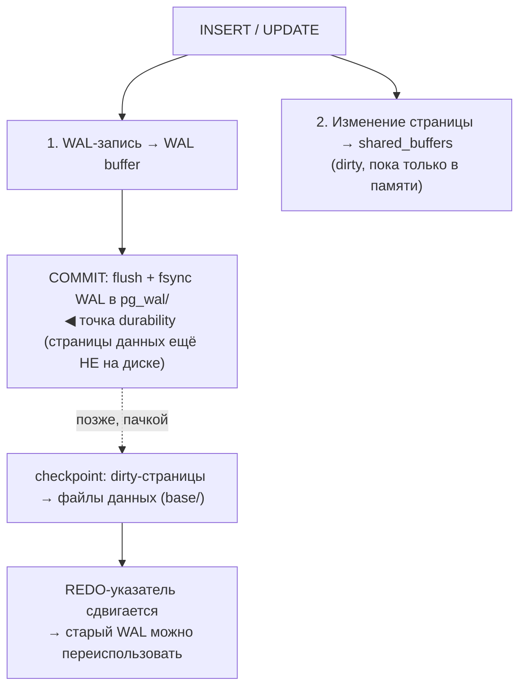

# Репликация в PostgreSQL

## Содержание

- [WAL: основа репликации](#wal-основа-репликации)
  - [Принцип write-ahead](#принцип-write-ahead-зачем-вообще-журнал)
  - [WAL-запись и LSN](#wal-запись-и-lsn)
  - [WAL-сегменты и pg_wal](#wal-сегменты-и-pg_wal)
  - [Checkpoint](#checkpoint-сброс-грязных-страниц)
  - [Full Page Writes и torn pages](#full-page-writes-и-torn-pages)
  - [Crash recovery (REDO)](#crash-recovery-redo)
  - [wal_level](#wal_level-детализация-журнала)
  - [PITR и архивация WAL](#pitr-и-архивация-wal)
- [Streaming Replication (физическая)](#streaming-replication-физическая)
- [Logical Replication](#logical-replication)
- [Synchronous vs Asynchronous](#synchronous-vs-asynchronous)
- [Read Replicas](#read-replicas)
- [Replication Slots](#replication-slots)
- [HA и Failover: Patroni](#ha-и-failover-patroni)
- [Типичные проблемы](#типичные-проблемы)
- [Interview-ready answer](#interview-ready-answer)

---

## WAL: основа репликации

WAL (Write-Ahead Log) — журнал всех изменений. Любая модификация (INSERT, UPDATE, DELETE, DDL) сначала пишется в WAL и только потом отражается в файлах данных. На этом одном механизме держатся сразу три вещи:

- **Durability** (буква D в ACID) — гарантия, что закоммиченное переживёт краш.
- **Crash recovery** — восстановление согласованного состояния после падения.
- **Репликация** и **PITR** (Point-in-Time Recovery) — реплика/бэкап проигрывают тот же WAL.

Репликация — это, по сути, «переиграть чужой WAL на другом сервере», поэтому разбираться в репликации без понимания WAL бессмысленно.

### Принцип write-ahead: зачем вообще журнал

Наивная durability — на каждый commit сбрасывать (`fsync`) изменённые страницы таблиц на диск. Это дорого: страницы разбросаны по файлам → случайный I/O, и одна транзакция может задеть страницы в разных таблицах и индексах.

Идея WAL: вместо дорогого случайного I/O по файлам данных — дешёвая **последовательная дозапись** в один журнал. На commit fsync-ается только «хвост» WAL. Сами страницы данных остаются «грязными» (dirty) в `shared_buffers` (в памяти) и сбрасываются на диск позже и пачкой — фоновым checkpoint'ом.

Правило write-ahead: **WAL-запись изменения обязана попасть на диск раньше, чем на диск попадёт сама изменённая страница данных.** Иначе после краша была бы страница с изменением, которого нет в журнале, — и recovery не смог бы её проверить/откатить.



Отсюда контринтуитивный факт для собеса: **после `COMMIT` данных в файлах таблиц ещё нет** — на диске только WAL-запись. И этого достаточно: если сервер упадёт, recovery доиграет WAL и воссоздаст страницы.

### WAL-запись и LSN

WAL — это поток **записей** (WAL records): «на странице X в позиции Y такое-то изменение», плюс записи commit/abort, checkpoint и т.д. Позиция в этом потоке — **LSN (Log Sequence Number)**, монотонно растущий 64-битный байтовый адрес, печатается как два hex-числа через слэш:

```sql
SELECT pg_current_wal_lsn();      -- напр. 3A/7C4F1918 — текущая позиция записи на primary
```

LSN — сквозная «валюта» всего PostgreSQL: по нему меряют отставание реплик, точку recovery, и он же штампуется в заголовок каждой страницы данных (`pd_lsn`) — что делает recovery идемпотентным (см. ниже). Разницу двух LSN в байтах даёт `pg_wal_lsn_diff` — именно так считают lag.

```sql
-- на реплике: до какого LSN получен и до какого применён WAL
SELECT pg_last_wal_receive_lsn(), pg_last_wal_replay_lsn();
```

### WAL-сегменты и pg_wal

Физически WAL лежит в `$PGDATA/pg_wal/` файлами-**сегментами** по 16 MB (размер задаётся при `initdb`, `--wal-segsize`). Имя сегмента — 24 hex-символа (timeline + номер). Когда сегмент больше не нужен для recovery/репликации, PostgreSQL его **переименовывает и переиспользует** (recycle), а не удаляет — чтобы не платить за создание файла заново.

Сегмент перестаёт быть нужным после checkpoint'а — **если** его уже не удерживают: replication slot, `wal_keep_size`, незавершённая архивация (`archive_command`). Именно поэтому брошенный слот переполняет `pg_wal` (см. [Replication Slots](#replication-slots)).

### Checkpoint: сброс грязных страниц

Checkpoint — это операция, которая **сбрасывает все грязные страницы `shared_buffers` в файлы данных** и записывает в WAL точку REDO. Смысл двойной:

- после checkpoint'а WAL **до** точки REDO больше не нужен для recovery → его можно переиспользовать (иначе WAL рос бы вечно);
- checkpoint **ограничивает время recovery**: восстановление начинается с последней точки REDO, а не с начала времён.

Триггеры checkpoint'а:
- по времени — `checkpoint_timeout` (дефолт 5 мин);
- по объёму — накоплено WAL больше `max_wal_size`;
- вручную `CHECKPOINT`, а также перед shutdown/бэкапом.

Компромисс: **редкие** checkpoint'ы → меньше повторных записей одной страницы и меньше full-page-writes (ниже), но дольше recovery и больше пик I/O в момент сброса. `checkpoint_completion_target` размазывает запись грязных страниц по интервалу, сглаживая всплеск. Конкретные значения параметров — в [08-performance-tuning.md](./08-performance-tuning.md), раздел «WAL и checkpoint параметры».

### Full Page Writes и torn pages

Один из самых частых «глубоких» вопросов. Страница PostgreSQL — 8 KB, а атомарность записи железо гарантирует лишь на уровне сектора (512 B / 4 KB). Если сервер упадёт **посреди** записи 8 KB-страницы на диск, получится **torn page** — наполовину старая, наполовину новая, физически битая. Обычная дельта-WAL-запись («меняем байты в позиции Y») к такой странице неприменима — накладывать дельту не на что.

Решение — **full page writes**: при **первом** изменении страницы после каждого checkpoint'а в WAL пишется не дельта, а **полный образ страницы** (Full Page Image). При recovery этот образ целиком перезатирает возможно-битую страницу, и дальше уже накладываются дельты.

Следствия:
- сразу **после checkpoint'а объём WAL резко растёт** — все первые касания страниц пишут по 8 KB. Отсюда пила в графике WAL-трафика;
- отсюда же связь: частые checkpoint'ы → больше FPI → больше WAL и нагрузка на реплики/архив;
- смягчение — `wal_compression` (сжимает именно FPI, `lz4`/`zstd` — PG 15+);
- отключать `full_page_writes` (дефолт `on`) можно только если хранилище само гарантирует атомарную запись 8 KB (редкость) — иначе краш = порча данных.

### Crash recovery (REDO)

При старте после краша PostgreSQL читает из control-файла последнюю точку REDO и **проигрывает WAL вперёд** от неё, применяя каждую запись. Процесс идемпотентен: у каждой страницы в заголовке есть `pd_lsn`, и WAL-запись применяется, только если `pd_lsn страницы < LSN записи`. Поэтому повторный проигрыш уже применённых изменений безопасен (это же свойство защищает реплику). Первым делом каждой битой страницы recovery накладывает её Full Page Image — и дальше дельты ложатся уже на целую страницу.

Незакоммиченные транзакции при этом не «откатываются» специально: их изменения просто не имеют commit-записи в WAL и потому невидимы (MVCC), а место потом чистит vacuum — см. [01-mvcc-and-vacuum.md](./01-mvcc-and-vacuum.md).

### wal_level: детализация журнала

`wal_level` определяет, сколько информации писать в WAL — минимум для recovery или ещё и для репликации:

| wal_level | Что пишется дополнительно | Для чего |
|---|---|---|
| `minimal` | только для crash recovery; при этом ряд операций (напр. `COPY` в только что созданную таблицу) вообще минует WAL | нельзя реплицировать и делать PITR; максимальная скорость bulk-загрузки |
| `replica` (default) | достаточно для проигрывания на физической реплике и для архивного PITR | streaming standby, PITR |
| `logical` | плюс информация для логического декодирования (в т.ч. identity старой строки для UPDATE/DELETE по `REPLICA IDENTITY`) | logical replication, CDC |

```sql
SHOW wal_level;
```

Повышение уровня увеличивает объём WAL — `logical` тяжелее `replica`, поэтому включают его только если реально нужна логическая репликация/CDC.

### PITR и архивация WAL

Тот же WAL даёт **Point-in-Time Recovery**: базовый бэкап (`pg_basebackup`) + непрерывный архив WAL (`archive_command` складывает готовые сегменты в надёжное хранилище) позволяют развернуться и доиграть WAL до **любого момента** — `recovery_target_time`/`_lsn`/`_xid`. Это спасает от логической ошибки («выполнили `DELETE` без `WHERE`»): откатываемся ровно на момент перед ней. Механика и инструменты (pgBackRest, WAL-G) — тема бэкапов; здесь важно, что PITR — прямое следствие того же журнала, что и репликация.

---

## Streaming Replication (физическая)

Физическая репликация передаёт WAL-байты. Реплика является точной копией primary на уровне блоков.

Характеристики:
- Реплицирует весь инстанс целиком (нельзя реплицировать отдельную таблицу).
- Реплика read-only (hot standby).
- Минимальная задержка (обычно миллисекунды).
- Версия PostgreSQL на реплике ≥ версия на primary.

Настройка primary (`postgresql.conf`):

```
wal_level = replica
max_wal_senders = 5        # максимум одновременных реплик
wal_keep_size = 1GB        # хранить WAL для реплик без слотов
```

`pg_hba.conf`:
```
host  replication  replicator  replica_ip/32  md5
```

Настройка replica (`postgresql.conf`):
```
hot_standby = on           # read-only запросы пока replication идёт
primary_conninfo = 'host=primary_ip port=5432 user=replicator password=...'
```

Инициализация реплики через `pg_basebackup`:

```bash
pg_basebackup -h primary_host -U replicator -D /var/lib/postgresql/data \
  --wal-method=stream --checkpoint=fast --progress
```

---

## Logical Replication

Логическая репликация передаёт изменения на уровне строк (не байтов WAL). Позволяет:
- Реплицировать отдельные таблицы.
- Между разными мажорными версиями PostgreSQL.
- В разные схемы / с трансформацией данных.
- Bi-directional репликация (осторожно).

Модель: **Publication** (что публикуем) + **Subscription** (кто подписан).

На primary:
```sql
-- публиковать изменения таблицы orders
CREATE PUBLICATION orders_pub FOR TABLE orders;

-- или все таблицы
CREATE PUBLICATION all_pub FOR ALL TABLES;
```

На replica (subscriber):
```sql
CREATE SUBSCRIPTION orders_sub
    CONNECTION 'host=primary_host port=5432 dbname=mydb user=replicator password=...'
    PUBLICATION orders_pub;
```

Мониторинг:
```sql
-- на primary
SELECT * FROM pg_stat_replication;

-- на subscriber
SELECT * FROM pg_stat_subscription;
```

Ограничения logical replication:
- DDL не реплицируется — нужно применять вручную на обоих сторонах.
- Sequences не реплицируются (значение последовательности на подписчике не двигается).
- Нельзя реплицировать таблицы без PRIMARY KEY (по умолчанию) — либо задать `REPLICA IDENTITY FULL`.

**Свежие улучшения (важно для собеса «что нового»):**
- **Параллельное применение** (`streaming = parallel`, PG16) — большие транзакции применяются на подписчике несколькими worker'ами, а не одним, что снимает узкое место apply при write-heavy нагрузке.
- **Логическая репликация со standby** (PG16) — слоты можно создавать на физической реплике, разгружая primary.
- **`pg_createsubscriber`** (PG17) — превращает физическую реплику в логического подписчика без полного начального копирования данных: быстрый способ поднять logical-подписчика на больших БД и удобный путь мажорного апгрейда с минимальным downtime.
- **Failover-слоты** (PG17) — логические слоты переживают failover на новый primary (`synced` через `pg_sync_replication_slots`), раньше подписка после failover ломалась.

---

## Synchronous vs Asynchronous

### Asynchronous (default)

Primary коммитит транзакцию сразу после записи в локальный WAL. Реплика применяет изменения с небольшой задержкой (lag).

Риск: при failover возможна потеря последних транзакций (не отреплицированных).

### Synchronous

Primary ждёт подтверждения от реплики перед возвратом commit клиенту. Нулевая потеря данных, но дополнительная latency.

```
synchronous_commit = on
synchronous_standby_names = 'FIRST 1 (replica1, replica2)'
```

Режимы `synchronous_commit`:
| Значение | Гарантия |
|---|---|
| `off` | Не ждём даже локального WAL flush |
| `local` | Локальный WAL flush, не ждём реплику |
| `remote_write` | Реплика записала в буфер (не fsync) |
| `on` (default sync) | Реплика сделала WAL flush |
| `remote_apply` | Реплика применила транзакцию |

Компромисс — `remote_write`: меньше latency чем `on`, но небольшой риск потери при сбое реплики.

На уровне транзакции:
```sql
-- эта транзакция без синхронной репликации
SET LOCAL synchronous_commit = off;
INSERT INTO logs ...;
```

---

## Read Replicas

Типичная архитектура: primary для записи, одна-две реплики для чтения.

Что нужно учитывать:
- **Replication lag** — данные на реплике могут быть несвежими (обычно < 100ms, но при нагрузке может быть секунды).
- **Нельзя читать сразу после записи с реплики** — после INSERT на primary, SELECT на реплике может не увидеть данные.
- **Транзакции на реплике** — BEGIN/COMMIT работают, но только для read-only.

Паттерн в Go с pgx — два пула:

```go
type DB struct {
    primary *pgxpool.Pool
    replica *pgxpool.Pool
}

func (db *DB) Write(ctx context.Context) pgx.Tx {
    tx, _ := db.primary.Begin(ctx)
    return tx
}

func (db *DB) ReadReplica(ctx context.Context) *pgxpool.Pool {
    return db.replica  // приложение само решает что читать с реплики
}
```

Проверить lag реплики:

```sql
-- на primary: отставание каждой реплики
SELECT client_addr, state, sent_lsn, write_lsn, flush_lsn, replay_lsn,
       pg_size_pretty(pg_wal_lsn_diff(sent_lsn, replay_lsn)) AS replay_lag
FROM pg_stat_replication;
```

---

## Replication Slots

Слот гарантирует, что WAL не будет удалён, пока реплика не применила его. Нужен когда реплика может временно отключиться.

```sql
-- создать физический слот
SELECT pg_create_physical_replication_slot('replica1_slot');

-- создать логический слот
SELECT pg_create_logical_replication_slot('my_slot', 'pgoutput');

-- посмотреть слоты и их lag
SELECT slot_name, active, xmin, catalog_xmin,
       pg_size_pretty(pg_wal_lsn_diff(pg_current_wal_lsn(), restart_lsn)) AS wal_lag
FROM pg_replication_slots;
```

**Опасность**: неактивный слот удерживает WAL-файлы — диск может переполниться.

Мониторинг: алертить если lag > порог (например, 10GB):

```sql
SELECT slot_name, 
       pg_wal_lsn_diff(pg_current_wal_lsn(), restart_lsn) AS lag_bytes
FROM pg_replication_slots
WHERE active = false;
```

Удалить брошенный слот:
```sql
SELECT pg_drop_replication_slot('old_slot');
```

---

## HA и Failover: Patroni

Patroni — стандартный инструмент для High Availability PostgreSQL. Использует Etcd/Consul/ZooKeeper для distributed consensus.

Что делает Patroni:
- Автоматический failover: при падении primary выбирает новый primary из реплик.
- Fencing: предотвращает "split-brain" — старый primary не может писать после failover.
- REST API для управления кластером.

Архитектура:
```
[Etcd cluster]
      |
[Patroni] -- [PostgreSQL primary] -- [Patroni] -- [PostgreSQL replica]
```

Базовый конфиг (`patroni.yml`):

```yaml
scope: postgres-cluster
name: node1

etcd3:
  hosts: etcd1:2379,etcd2:2379,etcd3:2379

bootstrap:
  dcs:
    ttl: 30
    loop_wait: 10
    retry_timeout: 10
    maximum_lag_on_failover: 1048576  # 1MB — реплика не становится primary если отстала

postgresql:
  listen: 0.0.0.0:5432
  data_dir: /var/lib/postgresql/data
  parameters:
    max_connections: 200
    wal_level: replica
    max_wal_senders: 10
```

Управление через `patronictl`:
```bash
patronictl -c patroni.yml list           # статус кластера
patronictl -c patroni.yml switchover     # ручной переключатель
patronictl -c patroni.yml failover       # принудительный failover
```

Перед primary обычно ставят HAProxy или pgbouncer, который по health check направляет трафик на текущего primary.

---

## Типичные проблемы

**Replication lag растёт:**
- Тяжёлые запросы на primary конкурируют с WAL sender.
- Тяжёлые запросы на реплике (hot standby query conflicts): `max_standby_streaming_delay`.
- Сеть между primary и replica.

**Replica conflict (query cancellation):**
```sql
-- на реплике, запрос отменяется из-за конфликта с vacuum на primary
ERROR: canceling statement due to conflict with recovery

-- увеличить timeout
hot_standby_feedback = on  -- replica сообщает primary о своём xmin
max_standby_streaming_delay = 30s
```

**WAL накапливается на primary:**
- Неактивный replication slot.
- Синхронная реплика недоступна (primary ждёт).
- `wal_keep_size` слишком большой.

---

## Interview-ready answer

**1. На чём строится репликация?**

- На WAL (журнал всех изменений): реплика получает WAL и применяет его; тот же механизм даёт durability, crash recovery и PITR.

**1a. Зачем нужен WAL / что такое write-ahead?**

- Вместо дорогого случайного fsync страниц данных на каждый commit — дешёвая последовательная дозапись в журнал; страницы данных остаются грязными в памяти и сбрасываются позже checkpoint'ом. Правило: WAL-запись изменения на диске раньше самой страницы. После `COMMIT` данных в файлах ещё нет — durability обеспечивает именно WAL.

**1b. Что такое full page writes / torn pages?**

- Страница 8 KB, атомарность записи железо гарантирует лишь на сектор → краш посреди записи даёт «рваную» страницу. Поэтому при первом изменении страницы после checkpoint'а в WAL пишется её полный образ (FPI), который при recovery перезатирает битую страницу. Цена — всплеск WAL после каждого checkpoint'а; смягчается `wal_compression`.

**1c. Что такое checkpoint и LSN?**

- Checkpoint сбрасывает грязные страницы в файлы данных и двигает точку REDO → старый WAL можно переиспользовать, а recovery стартует не с начала. LSN — монотонный байтовый адрес позиции в WAL; по нему меряют lag реплик и точку восстановления.

**2. Физическая vs логическая репликация?**

- Физическая (streaming) — точная копия инстанса на уровне байтов, реплика read-only, минимальный lag; логическая — на уровне строк, можно отдельные таблицы и между мажорными версиями, но DDL и sequences не реплицируются.

**3. Synchronous vs asynchronous commit?**

- Async (default) — primary коммитит сразу, риск потери последних транзакций при failover; sync — ждёт подтверждения реплики, нулевая потеря, но выше latency (режимы от `remote_write` до `remote_apply`).

**4. В чём подвох read replicas?**

- Replication lag: нельзя читать с реплики сразу после записи на primary — данные могут ещё не доехать.

**5. Чем опасны replication slots?**

- Гарантируют сохранение WAL для реплики, но неактивный слот удерживает WAL и переполняет диск — обязателен мониторинг lag.

**6. Что нового в логической репликации?**

- Параллельный apply и слоты на standby (PG16), `pg_createsubscriber` и failover-слоты (PG17).

**7. Как сделать HA?**

- Patroni + Etcd/Consul: автоматический failover, fencing против split-brain, перед primary — HAProxy/PgBouncer по health-check.
