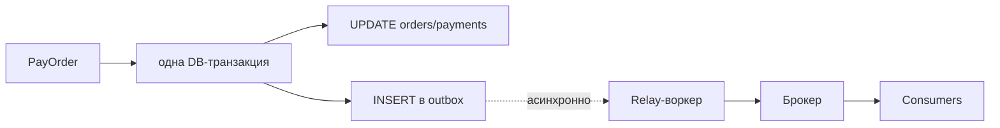

# Transactional Outbox и идемпотентность

Типовой senior-сценарий: сервис меняет данные в БД **и** должен послать событие в брокер (Kafka/RabbitMQ) — «заказ оплачен», «пользователь создан». Проблема в том, что запись в БД и публикация в брокер — **два разных хранилища**, и атомарно их не закоммитить. Outbox решает это, идемпотентность — прибирает последствия.

Смежное: [saga и outbox](../../../04-architecture-and-patterns/patterns/09-saga-and-outbox.md), delivery semantics брокеров — [Kafka](../../../07-message-brokers-and-streaming/01-kafka.md) / [RabbitMQ](../../../07-message-brokers-and-streaming/02-rabbitmq.md).

## Содержание

- [Проблема dual-write](#проблема-dual-write)
- [Паттерн Transactional Outbox](#паттерн-transactional-outbox)
- [Дизайн таблицы outbox](#дизайн-таблицы-outbox)
- [Relay-воркер: чтение и публикация](#relay-воркер-чтение-и-публикация)
- [Порядок событий](#порядок-событий)
- [Идемпотентность на стороне consumer](#идемпотентность-на-стороне-consumer)
- [Защита от double-processing на стороне producer](#защита-от-double-processing-на-стороне-producer)
- [Альтернатива: CDC вместо polling](#альтернатива-cdc-вместо-polling)
- [Подводные камни](#подводные-камни)
- [Interview-ready answer](#interview-ready-answer)

---

## Проблема dual-write

Наивный flow:

```text
1. BEGIN; UPDATE orders SET status='paid'; COMMIT;   -- записали в БД
2. broker.Publish("OrderPaid", ...)                  -- послали событие
```

Между шагами 1 и 2 приложение может упасть (или брокер быть недоступен). Тогда **БД уже изменена, а событие не ушло** — downstream-системы не узнают об оплате. Обратный порядок (сначала publish, потом commit) не лучше: событие уйдёт, а транзакция откатится → «фантомное» событие о том, чего не произошло.

Публиковать в фоне тоже нельзя наивно:

```go
go broker.Publish(ctx, event)   // ❌ ctx запроса отменится после ответа хендлеру → publish оборвётся
```

Корень: **нет распределённой транзакции** между БД и брокером (а 2PC дорог и хрупок). Outbox превращает «две записи в два хранилища» в «одну запись в БД».

---

## Паттерн Transactional Outbox

Идея: событие пишется в **ту же БД, в той же транзакции**, что и бизнес-изменение — в таблицу `outbox`. Раз это одна транзакция, событие и изменение атомарны: либо оба закоммитились, либо оба откатились. Отдельный **relay-воркер** асинхронно читает `outbox` и публикует события в брокер.



Гарантия доставки при этом — **at-least-once**: воркер может опубликовать событие, упасть до отметки «отправлено» и переслать его снова. Значит consumer обязан быть идемпотентным (ниже).

---

## Дизайн таблицы outbox

Главное в паттерне — правильная схема. Каждое поле здесь неслучайно:

```sql
CREATE TABLE outbox (
    id             bigint GENERATED ALWAYS AS IDENTITY PRIMARY KEY,  -- монотонный → порядок и курсор для воркера
    aggregate_type text        NOT NULL,        -- 'order' — тип сущности (удобно для маршрутизации/топиков)
    aggregate_id   text        NOT NULL,        -- '42' — id сущности; по нему держат порядок событий сущности
    event_type     text        NOT NULL,        -- 'OrderPaid' — что произошло
    payload        jsonb       NOT NULL,        -- тело события (сериализованный контракт)
    headers        jsonb,                       -- трейс/метаданные (trace_id, версия схемы)
    created_at     timestamptz NOT NULL DEFAULT now(),
    published_at   timestamptz,                 -- NULL = ещё не отправлено; ставится после ack брокера
    attempts       int         NOT NULL DEFAULT 0  -- счётчик попыток → backoff и отлов «ядовитых» событий
);

-- индекс для воркера: быстро находить неотправленные в порядке появления
CREATE INDEX idx_outbox_unpublished
    ON outbox (id) WHERE published_at IS NULL;   -- partial: индекс только по «хвосту» неотправленных
```

Почему именно так:

- **`id` монотонный** (identity/bigserial) — задаёт **порядок** публикации и служит курсором воркера; UUIDv4 тут хуже (нет порядка).
- **`aggregate_id`** — ключ, по которому держат порядок событий одной сущности (и по нему же партиционируют в Kafka, чтобы события одного заказа шли в одну партицию).
- **`payload jsonb`** — само событие; JSONB, потому что схемы разных событий различаются, и его удобно читать/дебажить.
- **`published_at IS NULL`** как маркер неотправленного + **partial-индекс** по этому условию: индекс крошечный (только неопубликованный хвост), воркер по нему мгновенно берёт следующую пачку. Альтернатива — `status` enum (`pending`/`published`).
- **`attempts`** — для экспоненциального backoff и чтобы после N неудач увести событие в «карантин» (poison event), а не долбить брокер вечно.

**Вставка события — в той же транзакции, что и бизнес-логика:**

```sql
BEGIN;
  UPDATE orders SET status = 'paid' WHERE id = $1 AND status = 'new';
  INSERT INTO outbox (aggregate_type, aggregate_id, event_type, payload)
  VALUES ('order', $1, 'OrderPaid', $2);
COMMIT;
```

---

## Relay-воркер: чтение и публикация

Отдельный процесс с собственным lifecycle (не привязан к контексту HTTP-запроса) периодически забирает неотправленные события, публикует и помечает. Ключ — `FOR UPDATE SKIP LOCKED`, чтобы **несколько инстансов воркера** не брали одни и те же строки (см. [04-transactions-and-locking.md](./04-transactions-and-locking.md), SKIP LOCKED):

```sql
-- взять пачку неотправленных, залочив их от других воркеров
SELECT id, aggregate_id, event_type, payload
FROM outbox
WHERE published_at IS NULL
ORDER BY id
LIMIT 100
FOR UPDATE SKIP LOCKED;

-- после успешной публикации каждого (или пачки) в брокер:
UPDATE outbox SET published_at = now() WHERE id = ANY($1);
```

Цикл воркера: `SELECT ... SKIP LOCKED` → `publish` в брокер → дождаться ack → `UPDATE published_at` → `COMMIT`. Если упал между publish и update — событие останется неотправленным и уйдёт повторно (отсюда at-least-once).

**Ретеншн.** Таблица `outbox` растёт вечно, если не чистить. Опубликованные события удаляют по расписанию (или партиционируют по времени и дропают старые партиции — см. [05-partitioning.md](./05-partitioning.md)):

```sql
DELETE FROM outbox WHERE published_at < now() - interval '7 days';
```

---

## Порядок событий

Строгий глобальный порядок обычно не нужен и дорог; нужен порядок **в пределах одной сущности** (события заказа №42 — по порядку). Обеспечивается:
- монотонным `id` + `ORDER BY id` в воркере;
- публикацией с ключом = `aggregate_id` → в Kafka все события одного заказа попадают в одну партицию и читаются по порядку (см. [Kafka: партиционирование](../../../07-message-brokers-and-streaming/01-kafka.md)).

Подвох: несколько параллельных воркеров + `SKIP LOCKED` могут **переставить** порядок между собой. Если порядок критичен — воркер один (или шардирование по `aggregate_id`, где каждый воркер владеет своим диапазоном).

---

## Идемпотентность на стороне consumer

Раз доставка at-least-once, **дубликаты неизбежны**, и consumer обязан быть идемпотентным. Каждое событие несёт стабильный `event_id`; consumer его запоминает:

```sql
-- обработать событие ровно один раз: вставка event_id = «замок»
INSERT INTO processed_events (event_id) VALUES ($1)
ON CONFLICT (event_id) DO NOTHING;
-- если RowsAffected = 0 → уже обрабатывали, пропустить (событие-дубль)
```

Варианты идемпотентности:
- **таблица обработанных** `processed_events (event_id PRIMARY KEY, processed_at)` — дедупликация по id;
- **естественная идемпотентность**: `UPDATE ... SET status='shipped' WHERE status='paid'` — повторное применение ничего не меняет (state machine «применить, если состояние позволяет»);
- **unique constraint** на побочный эффект (напр. `payments(idempotency_key)`), чтобы повтор не создал вторую запись.

---

## Защита от double-processing на стороне producer

Отдельная проблема — не дубликаты события, а **двойное действие**: два запроса одновременно оплачивают один заказ. Оба видят `status='new'`, оба создают платёж. Защита — комбинация:

```sql
BEGIN;
  SELECT * FROM orders WHERE id = $1 FOR UPDATE;            -- 1. сериализуем доступ к заказу
  UPDATE orders SET status='paid' WHERE id=$1 AND status='new';  -- 2. state machine: только из 'new'
  INSERT INTO payments (order_id, idempotency_key, amount)
  VALUES ($1, $2, $3) ON CONFLICT (idempotency_key) DO NOTHING;  -- 3. unique-ключ идемпотентности
  INSERT INTO outbox (...) VALUES (...);
COMMIT;
```

- `FOR UPDATE` — второй запрос ждёт первого;
- условие `AND status='new'` — второй `UPDATE` затронет 0 строк (state machine);
- `ON CONFLICT (idempotency_key)` — повторная попытка не создаёт второй платёж.

---

## Альтернатива: CDC вместо polling

Relay-воркер, опрашивающий таблицу (polling), прост, но создаёт постоянную нагрузку и небольшую задержку. Альтернатива — **CDC (Change Data Capture)**: читать WAL PostgreSQL через logical replication и публиковать изменения в брокер (Debezium). Тогда отдельная таблица `outbox` может и не понадобиться — или её пишут именно чтобы CDC отдавал чистые бизнес-события (Debezium Outbox Event Router).

| | Polling-воркер | CDC (Debezium) |
|---|---|---|
| Сложность инфраструктуры | низкая (свой воркер) | выше (Kafka Connect / Debezium) |
| Задержка | как период опроса | почти realtime (из WAL) |
| Нагрузка на БД | периодические запросы | чтение WAL, без запросов к таблице |
| Когда | небольшие/средние сервисы | высоконагруженные, уже есть Debezium |

---

## Подводные камни

- **Публикация в фоне на контексте запроса** (`go publish(ctx, …)`) — `ctx` отменится после ответа хендлеру. Воркер должен иметь собственный runtime-контекст.
- **Забыли ретеншн** — `outbox` растёт бесконечно; чистить/партиционировать.
- **Poison event** — событие, которое брокер стабильно не принимает: без лимита `attempts` воркер зациклится. Считать попытки, уводить в карантин/DLQ.
- **Порядок при нескольких воркерах** — `SKIP LOCKED` перемешивает; для строгого порядка — один воркер или шардирование по `aggregate_id`.
- **Версионирование payload** — контракт события меняется; класть версию схемы в `headers`, consumer'ы должны переживать старые и новые.
- **Только producer идемпотентен, а consumer нет** (или наоборот) — нужны обе стороны: at-least-once means дубликаты и на публикации, и на потреблении.

---

## Interview-ready answer

**1. Почему нельзя просто закоммитить в БД и потом опубликовать в брокер?**

- Это dual-write в два разных хранилища без общей транзакции: упадёшь между commit и publish — БД изменена, событие потеряно; обратный порядок даёт фантомные события при откате. Атомарности нет.

**2. Как решает transactional outbox?**

- Событие пишется в таблицу `outbox` **в той же транзакции**, что и бизнес-изменение → они атомарны. Отдельный relay-воркер асинхронно читает outbox и публикует в брокер. Гарантия — at-least-once.

**3. Какие поля в таблице outbox и зачем?**

- Монотонный `id` (порядок + курсор), `aggregate_type`/`aggregate_id` (маршрутизация и порядок в пределах сущности), `event_type`, `payload jsonb`, `published_at` (NULL = не отправлено) + partial-индекс по неотправленным, `attempts` (backoff/poison). Воркер берёт неотправленные `FOR UPDATE SKIP LOCKED`.

**4. Почему consumer должен быть идемпотентным?**

- Доставка at-least-once → дубликаты неизбежны (воркер мог опубликовать и упасть до отметки). Дедупликация по `event_id` (`processed_events` + `ON CONFLICT DO NOTHING`) или естественно-идемпотентные апдейты (state machine).

**5. Как защититься от double-pay?**

- `SELECT FOR UPDATE` на заказе + state-machine-условие (`WHERE status='new'`) + unique-constraint на `idempotency_key` платежа. Три слоя: сериализация, проверка состояния, защита от дубля побочного эффекта.
