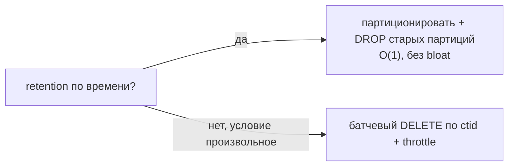

# Сценарий: bulk UPDATE/DELETE без bloat и долгих локов

**Проблема**: нужно обновить или удалить миллионы строк — бэкфилл новой колонки, чистка по retention, разовая коррекция. Наивный `UPDATE table SET ...` или `DELETE FROM table WHERE ...` одним оператором на 10M строк:

- держит **одну гигантскую транзакцию** — все блокировки до конца, vacuum не может зачищать (растёт горизонт `oldestXmin`);
- из-за MVCC каждый `UPDATE` создаёт новую версию строки → таблица и индексы **раздуваются вдвое** (bloat);
- `DELETE` оставляет миллионы dead tuples, которые потом долго вычищает vacuum;
- при откате (упало на 9M-й строке) вся работа потеряна.

Здесь — как делать это батчами с контролем локов и bloat. Механика MVCC/dead tuples — в [01-mvcc-and-vacuum.md](../01-mvcc-and-vacuum.md).

## Содержание

- [Базовый приём: батчи по ключу](#базовый-приём-батчи-по-ключу)
- [Батч по ctid, когда нет удобного ключа](#батч-по-ctid-когда-нет-удобного-ключа)
- [Throttle: не задушить прод и реплики](#throttle-не-задушить-прод-и-реплики)
- [DELETE: партиция вместо строк](#delete-партиция-вместо-строк)
- [Бэкфилл новой колонки](#бэкфилл-новой-колонки)
- [Подводные камни](#подводные-камни)
- [Interview-ready answer](#interview-ready-answer)

---

## Базовый приём: батчи по ключу

Идея: вместо одного оператора — много маленьких транзакций по N строк. Каждая быстро коммитится → блокировки короткие, vacuum успевает зачищать между батчами, откат стоит один батч, а не всё.

```go
// updateInBatches обновляет статус пачками по batchSize, двигаясь по PK.
func updateInBatches(ctx context.Context, pool *pgxpool.Pool, batchSize int) error {
    var lastID int64 = 0
    for {
        // обновляем следующую пачку строк с id > lastID; RETURNING даёт границу для следующего шага
        rows, err := pool.Query(ctx, `
            WITH batch AS (
                SELECT id FROM orders
                WHERE id > $1 AND status = 'legacy'
                ORDER BY id
                LIMIT $2
                FOR UPDATE SKIP LOCKED          -- не ждём строки, занятые другими
            )
            UPDATE orders o SET status = 'archived'
            FROM batch WHERE o.id = batch.id
            RETURNING o.id`,
            lastID, batchSize)
        if err != nil {
            return err
        }
        ids, err := pgx.CollectRows(rows, pgx.RowTo[int64])
        if err != nil {
            return err
        }
        if len(ids) == 0 {
            return nil                          // дошли до конца
        }
        lastID = ids[len(ids)-1]                // граница для следующего батча

        time.Sleep(50 * time.Millisecond)       // throttle (см. ниже)
    }
}
```

Почему так, а не `LIMIT` без курсора по id: повторный `WHERE status='legacy' LIMIT N` каждый раз сканирует таблицу заново (и пересекается с уже обновлёнными при некоторых условиях). Движение по возрастающему `id` (keyset) — каждый батч стартует с того места, где кончился прошлый.

---

## Батч по ctid, когда нет удобного ключа

Если нет монотонного ключа (или удаляем по широкому условию), батч можно резать по `ctid` — физическому адресу строки. Удобно для `DELETE`:

```sql
-- удалить старые логи пачками по 10k, не одним DELETE на миллионы
DELETE FROM logs
WHERE ctid IN (
    SELECT ctid FROM logs
    WHERE created_at < now() - interval '90 days'
    LIMIT 10000
);
-- повторять, пока RowsAffected > 0
```

```go
func deleteOldLogs(ctx context.Context, pool *pgxpool.Pool) error {
    for {
        tag, err := pool.Exec(ctx, `
            DELETE FROM logs
            WHERE ctid IN (
                SELECT ctid FROM logs
                WHERE created_at < now() - interval '90 days'
                LIMIT 10000
            )`)
        if err != nil {
            return err
        }
        if tag.RowsAffected() == 0 {
            return nil
        }
        time.Sleep(100 * time.Millisecond)
    }
}
```

---

## Throttle: не задушить прод и реплики

Батчи без пауз всё равно создают непрерывную нагрузку: I/O на запись новых версий, поток WAL → лаг реплик, давление на autovacuum. Поэтому между батчами:

- **`time.Sleep`** между транзакциями — простейший throttle, даёт vacuum и репликам «выдохнуть»;
- **смотреть лаг реплик** и притормаживать, если растёт (адаптивный throttle):

```go
// притормозить, если реплика отстала больше порога
func waitReplica(ctx context.Context, pool *pgxpool.Pool, maxLag time.Duration) error {
    for {
        var lag time.Duration
        err := pool.QueryRow(ctx, `
            SELECT coalesce(now() - pg_last_xact_replay_timestamp(), '0')
            FROM pg_stat_replication LIMIT 1`).Scan(&lag)
        if err != nil || lag < maxLag {
            return err
        }
        time.Sleep(time.Second)                  // реплика догоняет — ждём
    }
}
```

Это прямой аналог `vacuum_cost_delay` для autovacuum, только на стороне приложения: размазываем работу во времени, чтобы не выбить latency живого трафика.

---

## DELETE: партиция вместо строк

Самый дешёвый «массовый DELETE» — это его отсутствие. Если данные удаляются по времени (retention), партиционирование превращает «`DELETE` миллионов строк + vacuum» в **мгновенный `DROP`/`DETACH` партиции** без bloat и без dead tuples:

```sql
-- вместо DELETE FROM events WHERE created_at < '2024-01-01'
DROP TABLE events_2023_12;                       -- O(1), никаких dead tuples
```

Поэтому для таблиц логов/событий retention закладывают через monthly-партиции и дроп старых (механика — в [05-partitioning.md](../05-partitioning.md), управление из Go — в [11-go-patterns.md](../11-go-patterns.md)).



---

## Бэкфилл новой колонки

Частный, но очень частый кейс: добавили колонку, нужно заполнить её для всех строк. Безопасная последовательность (без долгого `ACCESS EXCLUSIVE` и без перезаписи всей таблицы разом):

```sql
-- 1. добавить nullable-колонку — мгновенно (только каталог, без перезаписи)
ALTER TABLE users ADD COLUMN normalized_email TEXT;
```

```go
// 2. заполнить батчами (как updateInBatches выше), новые вставки заполняет приложение/DEFAULT
// 3. когда всё заполнено — при необходимости навесить NOT NULL
//    (PG12+: SET NOT NULL быстрый, если предварительно есть валидный CHECK)
```

Подвох: `ADD COLUMN ... NOT NULL DEFAULT <volatile>` на старых версиях переписывает всю таблицу под `ACCESS EXCLUSIVE`. Безопасная схема — nullable-колонка + батчевый бэкфилл + отдельный `SET NOT NULL` (см. [04-transactions-and-locking.md](../04-transactions-and-locking.md), раздел «DDL и locks»).

---

## Подводные камни

- **Один большой UPDATE/DELETE = bloat + долгий лок + потеря работы при откате.** Всегда батчи для больших объёмов.
- **`LIMIT` без курсора по ключу** заставляет каждый батч сканировать заново — двигаться по возрастающему `id`/`ctid`.
- **`FOR UPDATE SKIP LOCKED`** в батче избегает ожидания строк, занятых живым трафиком.
- **Bloat всё равно копится** при UPDATE (новые версии) — после крупного бэкфилла полезен `VACUUM`/`pg_repack`, а лучше `fillfactor < 100` заранее (HOT updates, см. [01-mvcc-and-vacuum.md](../01-mvcc-and-vacuum.md)).
- **Поток WAL и лаг реплик** — крупная модификация может «утопить» реплики; throttle + мониторинг лага.
- **Триггеры на UPDATE/DELETE** выполняются на каждую строку — учитывать в стоимости.
- **Индексы по обновляемой колонке** обновляются каждым UPDATE — это и есть основная цена; если колонка не в индексах, срабатывает HOT-оптимизация.

---

## Interview-ready answer

**1. Почему нельзя обновить/удалить миллионы строк одним оператором?**

- Гигантская транзакция держит локи и горизонт vacuum до конца, MVCC раздувает таблицу/индексы вдвое (bloat), а откат теряет всю работу.

**2. Как делать bulk UPDATE/DELETE правильно?**

- Батчами по N строк в отдельных транзакциях, двигаясь по возрастающему ключу (keyset) или по `ctid`; `FOR UPDATE SKIP LOCKED`, чтобы не ждать занятые строки; пауза/throttle между батчами.

**3. Как не уронить прод и реплики во время бэкфилла?**

- Throttle между батчами (`time.Sleep`) + адаптивно ждать, если лаг реплик растёт (`pg_last_xact_replay_timestamp`); это приложенческий аналог `vacuum_cost_delay`.

**4. Самый дешёвый массовый DELETE?**

- Его отсутствие: для retention по времени — партиционирование и `DROP`/`DETACH` старой партиции (O(1), без dead tuples) вместо `DELETE`.

**5. Как безопасно бэкфиллить новую колонку?**

- Добавить nullable-колонку (мгновенно), заполнить батчами, затем при необходимости `SET NOT NULL` — не `ADD COLUMN NOT NULL DEFAULT <volatile>`, который переписывает всю таблицу под ACCESS EXCLUSIVE.
