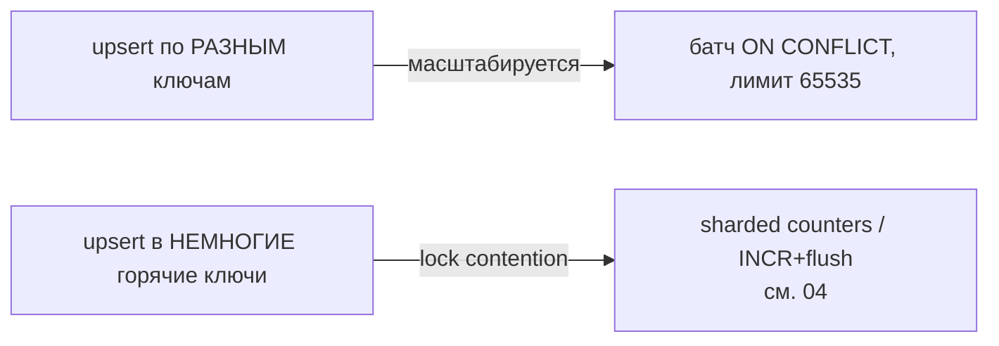

# Сценарий: upsert под нагрузкой

**Проблема**: «вставить или обновить» — обновить остаток товара, записать last_seen пользователя, импортировать данные, которые могут уже существовать. Наивный паттерн `SELECT → если нет INSERT, иначе UPDATE` под конкурентной нагрузкой даёт **гонку**: две транзакции одновременно не нашли строку, обе делают INSERT → дубликат или ошибка уникальности.

PostgreSQL решает это атомарно через `INSERT ... ON CONFLICT`. Здесь — как применять upsert на потоке и где он становится узким местом.

## Содержание

- [ON CONFLICT: атомарный upsert](#on-conflict-атомарный-upsert)
- [DO NOTHING vs DO UPDATE](#do-nothing-vs-do-update)
- [Батч-upsert](#батч-upsert)
- [Дедупликация внутри одного оператора](#дедупликация-внутри-одного-оператора)
- [Когда upsert становится узким местом](#когда-upsert-становится-узким-местом)
- [Подводные камни](#подводные-камни)
- [Interview-ready answer](#interview-ready-answer)

---

## ON CONFLICT: атомарный upsert

`INSERT ... ON CONFLICT` выполняет вставку, а при нарушении указанного уникального ограничения — заданное действие, всё в одной атомарной операции. Никакой гонки между «проверить» и «вставить» нет.

```sql
INSERT INTO inventory (sku, qty, updated_at)
VALUES ($1, $2, now())
ON CONFLICT (sku) DO UPDATE
SET qty        = EXCLUDED.qty,        -- EXCLUDED = строка, которую пытались вставить
    updated_at = now();
```

`EXCLUDED` — псевдотаблица со значениями из `VALUES`. Конфликт определяется по **конкретному** уникальному индексу/констрейнту (`ON CONFLICT (sku)` или `ON CONFLICT ON CONSTRAINT name`) — он обязан существовать.

```go
func upsertInventory(ctx context.Context, pool *pgxpool.Pool, sku string, qty int) error {
    _, err := pool.Exec(ctx, `
        INSERT INTO inventory (sku, qty, updated_at)
        VALUES ($1, $2, now())
        ON CONFLICT (sku) DO UPDATE
        SET qty = EXCLUDED.qty, updated_at = now()`,
        sku, qty)
    return err
}
```

---

## DO NOTHING vs DO UPDATE

| Действие | Что делает | Когда |
|----------|------------|-------|
| `DO NOTHING` | при конфликте просто пропустить строку | идемпотентная вставка, дедуп при повторной загрузке |
| `DO UPDATE SET ...` | при конфликте обновить существующую | «вставить или обновить» (остатки, счётчики, last_seen) |

```sql
-- идемпотентный импорт: повторный прогон не задвоит и не упадёт
INSERT INTO events (event_id, payload)
VALUES ($1, $2)
ON CONFLICT (event_id) DO NOTHING;
```

`DO NOTHING` — основа идемпотентной загрузки (cм. перезапуск bulk-load в [01-bulk-insert.md](./01-bulk-insert.md)) и dedup-приёмников.

> Чтобы узнать, вставили или пропустили: `RETURNING` возвращает строку **только если она реально вставлена/обновлена**. При `DO NOTHING` на конфликте `RETURNING` не вернёт строку — удобно отличать «новая» от «уже была».

---

## Батч-upsert

Upsert по одной строке = round-trip на строку. Под нагрузкой собирают **много строк в один** `INSERT ... ON CONFLICT` — один оператор, одна транзакция:

```go
// батч-upsert: один INSERT с N группами VALUES + ON CONFLICT
func upsertInventoryBatch(ctx context.Context, pool *pgxpool.Pool, items []Item) error {
    const cols = 2
    args := make([]any, 0, len(items)*cols)
    var b strings.Builder
    b.WriteString("INSERT INTO inventory (sku, qty) VALUES ")
    for i, it := range items {
        if i > 0 {
            b.WriteByte(',')
        }
        fmt.Fprintf(&b, "($%d,$%d)", i*cols+1, i*cols+2)
        args = append(args, it.SKU, it.Qty)
    }
    b.WriteString(`
        ON CONFLICT (sku) DO UPDATE
        SET qty = EXCLUDED.qty, updated_at = now()`)
    _, err := pool.Exec(ctx, b.String(), args...)
    return err
}
```

Лимит — те же **65535 параметров** на оператор (см. [01-bulk-insert.md](./01-bulk-insert.md)); чанк держать ниже.

---

## Дедупликация внутри одного оператора

Подвох батч-upsert: PostgreSQL не даёт обновить **одну и ту же** строку дважды в одном `INSERT ... ON CONFLICT` — если в пачке два `VALUES` с одинаковым `sku`, будет ошибка `ON CONFLICT DO UPDATE command cannot affect row a second time`. Поэтому дубликаты в пачке схлопывают **до** отправки:

```go
// схлопнуть дубли по ключу, оставив последнее значение
func dedupLast(items []Item) []Item {
    seen := make(map[string]Item, len(items))
    order := make([]string, 0, len(items))
    for _, it := range items {
        if _, ok := seen[it.SKU]; !ok {
            order = append(order, it.SKU)
        }
        seen[it.SKU] = it          // последнее значение выигрывает
    }
    out := make([]Item, 0, len(order))
    for _, k := range order {
        out = append(out, seen[k])
    }
    return out
}
```

Альтернатива на стороне SQL — `DISTINCT ON` в подзапросе-источнике:

```sql
INSERT INTO inventory (sku, qty)
SELECT DISTINCT ON (sku) sku, qty
FROM unnest($1::text[], $2::int[]) AS t(sku, qty)
ORDER BY sku, <критерий «последней»>          -- какую из дублей считать актуальной
ON CONFLICT (sku) DO UPDATE SET qty = EXCLUDED.qty;
```

---

## Когда upsert становится узким местом

`ON CONFLICT DO UPDATE` на конкурентную **одну и ту же** строку = сериализация: все транзакции выстраиваются в очередь за row lock. Если все пишут в немногие «горячие» ключи (счётчик популярного товара, глобальный агрегат), upsert упрётся в lock contention независимо от батчей.

Это уже не про upsert, а про горячие строки — разнесение нагрузки (sharded counters, INCR+flush) разобрано в [04-hot-rows-and-counters.md](./04-hot-rows-and-counters.md).



---

## Подводные камни

- **Нужен уникальный индекс/констрейнт** под `ON CONFLICT (col)` — без него оператор не скомпилируется.
- **Дубликаты в одной пачке** ломают `DO UPDATE` (`cannot affect row a second time`) — дедупить до отправки или `DISTINCT ON`.
- **`DO UPDATE` всё равно создаёт новую версию строки** (MVCC) даже если значение не изменилось → bloat на горячих строках; можно добавить `WHERE` в `DO UPDATE`, чтобы не писать при отсутствии изменений: `... DO UPDATE SET qty = EXCLUDED.qty WHERE inventory.qty <> EXCLUDED.qty`.
- **Горячий ключ** превращает upsert в точку сериализации — см. сценарий 04.
- **`ON CONFLICT` в партиционированной таблице** требует, чтобы ключ конфликта включал ключ партиционирования (см. [05-partitioning.md](../05-partitioning.md)).
- **Триггеры BEFORE INSERT** срабатывают и для строк, которые уйдут в `DO UPDATE`/`DO NOTHING`.

---

## Interview-ready answer

**1. Как сделать «вставить или обновить» без гонки?**

- `INSERT ... ON CONFLICT (key) DO UPDATE SET ...` — атомарно, без гонки между SELECT и INSERT; `EXCLUDED` ссылается на значения из VALUES.

**2. DO NOTHING или DO UPDATE?**

- `DO NOTHING` — идемпотентная вставка/дедуп (повторный прогон не задвоит и не упадёт); `DO UPDATE` — собственно upsert; `RETURNING` отличает вставленную строку от пропущенной.

**3. Как масштабировать upsert?**

- Батч: один `INSERT ... ON CONFLICT` с множеством VALUES (лимит 65535 параметров), предварительно схлопнув дубли по ключу в пачке (иначе `cannot affect row a second time`).

**4. Почему DO UPDATE может раздувать таблицу?**

- Каждый upsert создаёт новую версию строки даже без изменения значения (MVCC); добавляют `WHERE` в `DO UPDATE`, чтобы не писать при равных значениях.

**5. Когда upsert упирается в стену?**

- Когда все пишут в немногие горячие ключи — `DO UPDATE` сериализуется на row lock; решается разнесением (sharded counters, INCR+flush), а не батчами.
