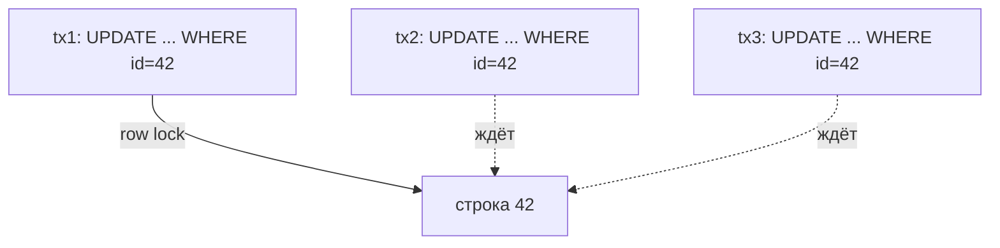

# Сценарий: горячие строки и счётчики

**Проблема**: множество транзакций пишут в **одну и ту же строку** — счётчик просмотров популярного поста, остаток ходового товара, баланс общего кошелька, глобальный агрегат. В MVCC писатель берёт row lock на строку до конца транзакции, поэтому конкурентные `UPDATE counter SET n = n + 1 WHERE id = $hot` **сериализуются**: вторая ждёт первую, третья — вторую. Пропускная способность падает до «1 / время одной транзакции» независимо от числа ядер и реплик.

Это классическая стена write-contention: индексы, пул, шардинг по таблицам не помогают — упор в одну строку.

## Содержание

- [Почему одна строка — это потолок](#почему-одна-строка--это-потолок)
- [Приём 1: sharded counters (разнести строку на N)](#приём-1-sharded-counters-разнести-строку-на-n)
- [Приём 2: INCR в Redis + периодический flush](#приём-2-incr-в-redis--периодический-flush)
- [Приём 3: insert-only + агрегация](#приём-3-insert-only--агрегация)
- [Что выбрать](#что-выбрать)
- [Подводные камни](#подводные-камни)
- [Interview-ready answer](#interview-ready-answer)

---

## Почему одна строка — это потолок



Пока tx1 не закоммитится, tx2 и tx3 стоят. Дополнительно каждый `UPDATE` создаёт новую версию строки → на горячем счётчике быстро копятся dead tuples и растёт bloat (см. [01-mvcc-and-vacuum.md](../01-mvcc-and-vacuum.md)). Решение всегда одно по сути: **перестать писать все апдейты в одну точку**.

---

## Приём 1: sharded counters (разнести строку на N)

Вместо одной строки-счётчика держим N строк-«осколков». Каждая запись инкрементит **случайный** осколок → конкуренция размазывается по N строкам, contention падает в ~N раз. Итоговое значение — `SUM` по осколкам.

```sql
CREATE TABLE counter_shards (
    counter_id BIGINT  NOT NULL,
    shard      SMALLINT NOT NULL,        -- 0..N-1
    value      BIGINT  NOT NULL DEFAULT 0,
    PRIMARY KEY (counter_id, shard)
);
```

```go
const numShards = 16

// инкремент пишет в случайный осколок — конкуренция делится на numShards
func incr(ctx context.Context, pool *pgxpool.Pool, counterID int64, delta int64) error {
    shard := rand.IntN(numShards)
    _, err := pool.Exec(ctx, `
        INSERT INTO counter_shards (counter_id, shard, value)
        VALUES ($1, $2, $3)
        ON CONFLICT (counter_id, shard) DO UPDATE
        SET value = counter_shards.value + EXCLUDED.value`,
        counterID, shard, delta)
    return err
}

// чтение — сумма по всем осколкам (можно кешировать)
func total(ctx context.Context, pool *pgxpool.Pool, counterID int64) (int64, error) {
    var sum int64
    err := pool.QueryRow(ctx,
        "SELECT coalesce(sum(value),0) FROM counter_shards WHERE counter_id = $1",
        counterID).Scan(&sum)
    return sum, err
}
```

Trade-off: запись дёшево масштабируется, **чтение дороже** (агрегация по N строк). Подходит, когда инкрементов много, а точное значение читают редко (лайки, просмотры). N подбирают под уровень конкуренции (16–128).

---

## Приём 2: INCR в Redis + периодический flush

Если строгая транзакционность счётчика не нужна (просмотры, метрики), инкремент уводят в Redis (`INCR` — атомарно и быстро в памяти), а в PostgreSQL сбрасывают агрегатом раз в N секунд. БД видит не миллион `UPDATE`, а один на флаш.

```go
// горячий путь — только Redis, без БД
func incrView(ctx context.Context, rdb *redis.Client, postID string) error {
    return rdb.Incr(ctx, "views:"+postID).Err()
}

// фоновый flush раз в интервал: переносим накопленное в PostgreSQL
func flushViews(ctx context.Context, rdb *redis.Client, pool *pgxpool.Pool, postID string) error {
    // GETDEL — атомарно прочитать и обнулить (не потеряв инкременты между read и delete)
    delta, err := rdb.GetDel(ctx, "views:"+postID).Int64()
    if err != nil || delta == 0 {
        return err
    }
    _, err = pool.Exec(ctx, `
        INSERT INTO post_views (post_id, views) VALUES ($1, $2)
        ON CONFLICT (post_id) DO UPDATE SET views = post_views.views + EXCLUDED.views`,
        postID, delta)
    return err
}
```

Ключевая деталь — `GETDEL` (атомарно прочитать и сбросить), иначе инкременты между «прочитали» и «обнулили» потеряются. Подробнее про счётчики в Redis — [08a-redis-real-scenarios.md](../../08a-redis-real-scenarios.md), раздел «Счётчики и аналитика». Trade-off: теряется durability на окне между флашами (упал Redis — потеряли несекундный хвост).

---

## Приём 3: insert-only + агрегация

Вместо изменения общей строки — **только вставки** в журнал событий (вставки в разные места не конфликтуют между собой), а значение считают агрегацией или материализуют отдельно.

```sql
-- вместо UPDATE balance — append движений (никакого row lock на общую строку)
INSERT INTO ledger (account_id, delta, ts) VALUES ($1, $2, now());

-- баланс = сумма движений (для горячих счетов — периодически материализовать в snapshot)
SELECT coalesce(sum(delta), 0) FROM ledger WHERE account_id = $1;
```

Это event-sourcing-подход: запись всегда быстрая (append), цена — чтение требует агрегации, поэтому для часто читаемых значений держат периодический snapshot. Хорошо ложится на партиционирование по времени и retention через `DROP` партиции (см. [02-bulk-update-delete.md](./02-bulk-update-delete.md)).

> Для денег (баланс) insert-only ledger ещё и аудируемее, чем `UPDATE balance`: видна вся история движений. Но «достаточно ли средств» требует чтения текущей суммы под нужной изоляцией — см. [04-transactions-and-locking.md](../04-transactions-and-locking.md).

---

## Что выбрать

| Приём | Запись | Чтение | Durability | Когда |
|-------|--------|--------|------------|-------|
| Sharded counters | масштабируется ×N | дороже (SUM по N) | полная (в PG) | много инкрементов, точность нужна, читают редко |
| Redis INCR + flush | максимально дёшево | мгновенно (из Redis) | теряется хвост между флашами | метрики/просмотры, точность не критична |
| Insert-only + агрегация | дёшево (append) | дороже (агрегация/snapshot) | полная + аудит | деньги, события, нужна история |

Общий принцип одинаков во всех трёх: **убрать сериализацию на одной строке** — либо размазав по многим строкам, либо вынеся горячий путь из транзакционной БД, либо заменив `UPDATE` на неконфликтующий `INSERT`.

---

## Подводные камни

- **Sharded counters удорожают чтение** — не для значений, которые читают на каждый запрос (или кешировать сумму).
- **Redis-flush теряет durability** на окне между флашами — нельзя для денег/инвентаря, где важна каждая единица.
- **`GETDEL` обязателен** вместо `GET` + `DEL` — иначе гонка теряет инкременты.
- **Insert-only раздувает таблицу движений** — нужен retention/партиционирование и периодический snapshot для чтения.
- **`UPDATE ... WHERE` всё равно блокирует строку**: даже `SELECT FOR UPDATE` на горячей строке сериализует — проблема не в синтаксисе, а в одной точке записи.
- **Не путать с lock contention на таблицу**: тут конкуренция за конкретную **строку**; распределение по таблицам/шардам её не лечит, помогает только разнесение самой записи.

---

## Interview-ready answer

**1. Почему запись в одну строку не масштабируется?**

- Писатель держит row lock до конца транзакции, конкурентные `UPDATE` той же строки сериализуются → потолок «1 / длительность транзакции», плюс bloat от новых версий; ядра и реплики не помогают.

**2. Как разнести горячий счётчик в самом PostgreSQL?**

- Sharded counters: N строк-осколков на счётчик, инкремент в случайный осколок (contention ÷ N), значение = `SUM` по осколкам; цена — дороже чтение.

**3. Как убрать горячую запись из БД совсем?**

- `INCR` в Redis на горячем пути + периодический flush агрегата в PostgreSQL через `GETDEL`; durability теряется на окне между флашами — годится для метрик, не для денег.

**4. Какой приём для денег/баланса?**

- Insert-only ledger (append движений не конфликтует) + периодический snapshot для чтения; даёт полную durability и аудит истории.

**5. В чём общий принцип всех решений?**

- Убрать сериализацию на одной строке: размазать по многим строкам, вынести горячий путь из транзакционной БД или заменить `UPDATE` неконфликтующим `INSERT`.
