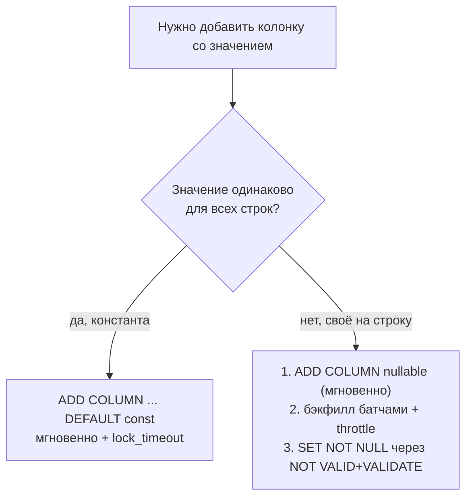

# Сценарий: добавить колонку со значением на таблице в десятки млн строк

**Проблема**: миграция добавляет колонку и должна проставить значение для всех
существующих строк, а в таблице 10–100M записей и живой трафик. Наивное
`ALTER TABLE users ADD COLUMN plan text NOT NULL DEFAULT 'free'` кажется безобидным, но:

- мгновенным будет только **константный** дефолт; **волатильный** (`now()`,
  `gen_random_uuid()`, `nextval`, вычисляемый на строку) **переписывает всю таблицу**
  под `ACCESS EXCLUSIVE` — на 50M строк это минуты-часы полной блокировки (даже `SELECT`
  не пройдёт);
- даже мгновенный ALTER берёт `ACCESS EXCLUSIVE` на миг — и если таблицу держит
  долгий запрос, ALTER встаёт в очередь **и блокирует всё, что за ним** (lock queue
  pile-up), останавливая трафик.

Здесь — как делать это онлайн, без переписывания таблицы и без остановки прода.
Механика DDL-локов — в [04-transactions-and-locking.md](../04-transactions-and-locking.md)
(раздел «DDL и locks»), батчевый бэкфилл данных — в
[02-bulk-update-delete.md](./02-bulk-update-delete.md). Этот кейс — №3 в общем каталоге
из 15 zero-downtime изменений схемы (rename, смена типа, UNIQUE/FK, INT→UUID,
партиционирование, переезд на новую БД): [06-zero-downtime-patterns.md](./06-zero-downtime-patterns.md).

## Содержание

- [Ключевая развилка: константа или нет](#ключевая-развилка-константа-или-нет)
- [Почему константный DEFAULT мгновенный](#почему-константный-default-мгновенный)
- [Безопасная схема для вычисляемого значения](#безопасная-схема-для-вычисляемого-значения)
- [Быстрый SET NOT NULL без полного скана](#быстрый-set-not-null-без-полного-скана)
- [Lock queue: обезопасить сам ALTER](#lock-queue-обезопасить-сам-alter)
- [Схема миграции и tooling](#схема-миграции-и-tooling)
- [Дерево решений](#дерево-решений)
- [Подводные камни](#подводные-камни)
- [Interview-ready answer](#interview-ready-answer)

---

## Ключевая развилка: константа или нет

Всё сводится к одному вопросу: **значение одинаковое для всех строк (константа) или
своё на каждую строку (волатильное/вычисляемое)?**

| Что делаем | Результат |
| --- | --- |
| `ADD COLUMN col int` (без default, nullable) | мгновенно (каталог) |
| `ADD COLUMN col int DEFAULT 0` (константа) | **мгновенно** (missing value) |
| `ADD COLUMN col int NOT NULL DEFAULT 0` (константа) | **мгновенно** |
| `ADD COLUMN id uuid DEFAULT gen_random_uuid()` (волатильно) | переписывает таблицу |
| `ADD COLUMN ts timestamptz DEFAULT now()` (волатильно) | переписывает таблицу |
| `ADD COLUMN x int GENERATED ALWAYS AS (...) STORED` | переписывает таблицу |

Вывод: **константное значение — безопасно и мгновенно даже на 100M строк.**
Проблема только с per-row (волатильным) значением.

---

## Почему константный DEFAULT мгновенный

`ADD COLUMN ... DEFAULT <константа>` не трогает строки: значение
записывается в системный каталог (`pg_attribute.atthasmissing = true` +
`attmissingval`). Старые строки на диске колонки не имеют — при чтении PG «подставляет»
missing value виртуально. Новые вставки получают default обычным путём. Перезаписи heap
нет → `ACCESS EXCLUSIVE` только на обновление каталога (миллисекунды).

Волатильное значение так закодировать нельзя (у каждой строки оно своё) — поэтому PG
вынужден физически переписать все строки, и это полный rewrite под долгим локом.

---

## Безопасная схема для вычисляемого значения

Когда значение нужно вычислять на строку (или нужен `NOT NULL` с per-row значением) —
разбиваем на шаги, ни один из которых не держит долгий лок:

```sql
-- 1. добавить nullable-колонку без дефолта — мгновенно (только каталог)
ALTER TABLE users ADD COLUMN normalized_email text;

-- 3. (опционально) дефолт для БУДУЩИХ вставок — тоже мгновенно, старые строки не трогает
ALTER TABLE users ALTER COLUMN normalized_email SET DEFAULT '';
```

Шаг 2 — **бэкфилл батчами** (отдельные транзакции, keyset по PK, throttle, чтобы не
раздувать WAL и не топить реплики). Полный разбор и Go-код —
[02-bulk-update-delete.md](./02-bulk-update-delete.md), раздел «Бэкфилл новой колонки».
Кратко:

```go
// двигаемся по возрастающему id, каждый батч — своя транзакция + пауза
for {
    tag, err := pool.Exec(ctx, `
        WITH batch AS (
            SELECT id FROM users
            WHERE id > $1 AND normalized_email IS NULL
            ORDER BY id LIMIT $2
        )
        UPDATE users u SET normalized_email = lower(u.email)
        FROM batch WHERE u.id = batch.id`, lastID, batchSize)
    // ... обновить lastID, выйти при RowsAffected == 0, time.Sleep между батчами
}
```

---

## Быстрый SET NOT NULL без полного скана

Прямой `ALTER TABLE ... ALTER COLUMN col SET NOT NULL` сканирует **всю таблицу** под
`ACCESS EXCLUSIVE`, проверяя, что нет `NULL` — на 50M строк это долгая блокировка.
Обход: сначала добавить `CHECK ... NOT VALID`, провалидировать под слабым
локом, и тогда `SET NOT NULL` использует уже проверенный constraint и **пропускает
скан**:

```sql
-- NOT VALID: constraint появляется мгновенно, старые строки не проверяются
ALTER TABLE users ADD CONSTRAINT users_email_nn CHECK (normalized_email IS NOT NULL) NOT VALID;

-- VALIDATE берёт SHARE UPDATE EXCLUSIVE (не блокирует SELECT/INSERT/UPDATE), сканирует без эксклюзива
ALTER TABLE users VALIDATE CONSTRAINT users_email_nn;

-- теперь SET NOT NULL видит валидный CHECK и НЕ сканирует таблицу заново — лок краткий
ALTER TABLE users ALTER COLUMN normalized_email SET NOT NULL;

-- CHECK больше не нужен (его роль выполняет NOT NULL)
ALTER TABLE users DROP CONSTRAINT users_email_nn;
```

Тот же приём `NOT VALID` + `VALIDATE` — для добавления FK на большую таблицу без долгого
лока (см. [04-transactions-and-locking.md](../04-transactions-and-locking.md)).

---

## Lock queue: обезопасить сам ALTER

Даже мгновенный `ADD COLUMN` берёт `ACCESS EXCLUSIVE`. Если таблицу держит долгий
`SELECT`/транзакция, ALTER ждёт — а за ним в очереди копятся **все** новые запросы к
таблице (они не могут обойти ждущий эксклюзивный лок). Итог: «мгновенная» миграция
замораживает трафик на время чужого долгого запроса.

Защита — ограничить ожидание и ретраить с backoff, чтобы заблокированный ALTER быстро
отступал и не копил очередь:

```go
func addColumnWithRetry(ctx context.Context, pool *pgxpool.Pool) error {
    conn, err := pool.Acquire(ctx)
    if err != nil {
        return err
    }
    defer conn.Release()

    // не ждать лок дольше 2с — иначе за нами выстроится очередь всего трафика
    if _, err := conn.Exec(ctx, `SET lock_timeout = '2s'`); err != nil {
        return err
    }

    const ddl = `ALTER TABLE users ADD COLUMN plan text NOT NULL DEFAULT 'free'`
    for attempt := 1; ; attempt++ {
        if _, err := conn.Exec(ctx, ddl); err == nil {
            return nil
        } else {
            var pgErr *pgconn.PgError
            // 55P03 = lock_not_available: не смогли взять лок за 2с
            if errors.As(err, &pgErr) && pgErr.Code == "55P03" && attempt < 10 {
                time.Sleep(time.Duration(attempt) * time.Second) // дать долгим запросам добежать
                continue
            }
            return err
        }
    }
}
```

Многие миграторы (goose/atlas) позволяют выставить `lock_timeout` в самой миграции —
это дешёвая страховка, ставить её стоит всегда для DDL на больших таблицах.

---

## Схема миграции и tooling

Ключевое правило: **не смешивать быстрый schema change и тяжёлый data backfill в одну
миграцию**. Операционная обвязка — где запускать миграции (CI step / init container /
Helm hook, а **не** autoMigrate на старте поды), forward-only откаты, dirty-state
recovery — в [migrations-in-go.md](../../../migrations/migrations-in-go.md).

1. **Миграция A** (быстрая, в релиз): `ADD COLUMN` nullable / с константным дефолтом +
   `lock_timeout`. Проходит за миллисекунды.
2. **Бэкфилл** (отдельно): батчевый job — отдельная миграция-«data», разовый скрипт или
   фоновая задача приложения. Долгий, throttled, идемпотентно перезапускаемый.
3. **Миграция B** (поздняя, после того как бэкфилл завершён и приложение уже пишет новую
   колонку): `SET NOT NULL` через `NOT VALID`+`VALIDATE`, снятие временного дефолта и т.п.

Так откат/повтор каждого шага дешёвый, а тяжёлый бэкфилл не держит транзакцию миграции
открытой (иначе он блокирует накат следующих миграций и тормозит vacuum на всей БД).

---

## Дерево решений



---

## Подводные камни

- **Волатильный дефолт переписывает таблицу** — `now()`,
  `gen_random_uuid()`, `nextval`, `GENERATED ... STORED`. Мгновенный только
  **константный** дефолт.
- **PG < 11: любой дефолт = full rewrite.** На старой версии даже константу добавляют
  как nullable + бэкфилл.
- **`SET NOT NULL` сканирует всю таблицу** под `ACCESS EXCLUSIVE` — обходить через
  `CHECK ... NOT VALID` → `VALIDATE` → `SET NOT NULL`.
- **Lock queue pile-up**: «мгновенный» ALTER, ждущий чужой долгий запрос, блокирует весь
  трафик за собой. Всегда `lock_timeout` + ретрай.
- **Тяжёлый бэкфилл внутри миграции** держит длинную транзакцию → блокирует следующие
  миграции и мешает vacuum. Выносить в отдельный шаг.
- **Новые вставки во время бэкфилла** должны уже писать колонку (дефолт или код), иначе
  останутся `NULL` и последующий `SET NOT NULL` упадёт.
- **Индекс по новой колонке** — только `CREATE INDEX CONCURRENTLY` (обычный `CREATE
  INDEX` блокирует запись), см. [02-indexes.md](../02-indexes.md).

---

## Interview-ready answer

**1. Что не так с `ADD COLUMN ... NOT NULL DEFAULT ...` на 50M строк?**

- На PG < 11 (и на любой версии при волатильном дефолте) это переписывает всю таблицу
  под `ACCESS EXCLUSIVE` — долгий полный простой.

**2. Когда добавление колонки мгновенное?**

- **Константный** дефолт: значение кладётся в каталог (`attmissingval`), строки
  не переписываются. Волатильный дефолт (`now()`, `uuid`, `nextval`) — всё равно rewrite.

**3. Как добавить колонку с вычисляемым значением онлайн?**

- Добавить nullable-колонку (мгновенно) → заполнить батчами с throttle → навесить
  `NOT NULL` через `CHECK ... NOT VALID` + `VALIDATE` + `SET NOT NULL` (без полного
  скана).

**4. Почему даже мгновенный ALTER опасен на проде?**

- Он берёт `ACCESS EXCLUSIVE`; если таблицу держит долгий запрос, ALTER ждёт, а за ним
  копится очередь всего трафика. Лечится `lock_timeout` + ретрай с backoff.

**5. Как организовать миграцию?**

- Разделить: быстрый schema change одной миграцией, тяжёлый backfill — отдельным
  батчевым шагом, финальные ограничения (`NOT NULL`, индексы) — поздней миграцией после
  бэкфилла.
