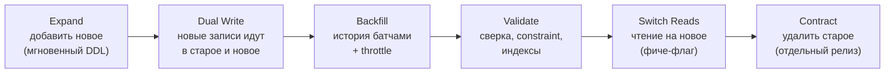

# Сценарий: zero-downtime изменения схемы — 15 кейсов

**Проблема**: таблица на десятки-сотни миллионов строк, живой трафик, rolling deploy —
и нужно поменять схему: переименовать колонку, сменить тип, перевести PK на UUID,
партиционировать, переехать на новую БД. Прямые `ALTER`/`UPDATE` здесь либо берут
`ACCESS EXCLUSIVE` на часы, либо ломают старую версию кода, которая ещё крутится
во время раскатки.

Хорошая новость: все 15 кейсов решаются комбинацией **пяти паттернов**. Понимание
паттернов важнее заучивания рецептов — на собеседовании проверяют именно это.

## Пять паттернов

| Паттерн | Суть | Ключевая идея |
| --- | --- | --- |
| **Expand / Contract** | добавить новое → мигрировать → удалить старое | никогда не менять на месте; старое и новое сосуществуют |
| **Dual Write / Dual Read** | писать в оба места, читать по фиче-флагу | данные не расходятся, переключение обратимо |
| **Backfill батчами** | заполнять историю малыми транзакциями с throttle | без bloat, без долгих локов, без лага реплик |
| **Параллельная схема** | строить новое рядом, не трогая живое (`CONCURRENTLY`, `NOT VALID`) | тяжёлая работа — без эксклюзивных локов, финальный swap — мгновенный |
| **Постепенное переключение** | канарейка/процент трафика, обратимый cutover | в любой момент можно откатиться без потери данных |

Почти каждый кейс — это конвейер: **expand → dual write → backfill → validate →
switch reads → contract**. Отличается только «что именно расширяем».



## Карта кейсов

| # | Кейс | Паттерны |
| --- | --- | --- |
| 1 | [Переименовать колонку](#1-переименовать-колонку) | Expand/Contract |
| 2 | [Изменить тип колонки](#2-изменить-тип-колонки) | Expand/Contract + Dual Write + Backfill |
| 3 | [Добавить NOT NULL колонку](#3-добавить-not-null-колонку) | Expand + Backfill + Validate |
| 4 | [Добавить UNIQUE constraint](#4-добавить-unique-constraint) | Параллельная схема |
| 5 | [Добавить FOREIGN KEY](#5-добавить-foreign-key) | Параллельная схема (NOT VALID → VALIDATE) |
| 6 | [Добавить индекс](#6-добавить-индекс) | Параллельная схема (CONCURRENTLY) |
| 7 | [INT PK → UUID](#7-int-pk--uuid) | все пять |
| 8 | [Разделить колонку на две](#8-разделить-колонку-на-две) | Expand/Contract + Dual Write + Backfill |
| 9 | [Объединить колонки в одну](#9-объединить-колонки-в-одну) | Expand/Contract + Dual Write + Backfill |
| 10 | [Перенести данные в другую таблицу](#10-перенести-данные-в-другую-таблицу) | Dual Write + Backfill + переключение |
| 11 | [Backfill сотен миллионов строк](#11-backfill-сотен-миллионов-строк) | Backfill батчами |
| 12 | [Партиционировать существующую таблицу](#12-партиционировать-существующую-таблицу) | Параллельная схема + Dual Write + Backfill |
| 13 | [Очистить миллиарды строк](#13-очистить-миллиарды-строк) | Backfill батчами / партиции |
| 14 | [Переключиться на новую БД](#14-переключиться-на-новую-бд) | Dual Write / CDC + постепенное переключение |
| 15 | [Обновить PostgreSQL / failover](#15-обновить-postgresql--failover) | Параллельная схема + постепенное переключение |

Механика, на которую всё опирается:

- DDL-локи — [04-transactions-and-locking.md](../04-transactions-and-locking.md);
- батчи и throttle — [02-bulk-update-delete.md](./02-bulk-update-delete.md);
- мгновенный `ADD COLUMN` и быстрый `SET NOT NULL` — [05-online-schema-migration.md](./05-online-schema-migration.md);
- операционка миграций — [migrations-in-go.md](../../../migrations/migrations-in-go.md);
- «backfill батчами» встречается ниже почти в каждом кейсе — что это такое и как
  устроен цикл, разобрано в [кейсе 11](#11-backfill-сотен-миллионов-строк).

---

## 1. Переименовать колонку

Сам `ALTER TABLE ... RENAME COLUMN` — мгновенный (только каталог). Проблема не в локе,
а в **rolling deploy**: пока катится новый код, старые pod-ы ещё пишут в старое имя —
атомарно переключить схему и все реплики приложения нельзя.

Expand/Contract на два релиза:

1. **Expand**: `ADD COLUMN full_name` (мгновенно) + синхронизация: либо приложение пишет
   в обе, либо триггер копирует `name → full_name`.
2. **Backfill** истории батчами.
3. **Релиз 1**: код читает `full_name` (fallback на `name`), пишет в обе.
4. **Релиз 2 (contract)**: код работает только с `full_name`; после — `DROP COLUMN name`
   отдельной поздней миграцией.

Подводный камень: `DROP COLUMN` в том же релизе, что переключает код — если релиз
откатят, старый код упадёт на отсутствующей колонке. Contract всегда отстаёт на релиз.

## 2. Изменить тип колонки

Сначала проверить, не бесплатен ли случай: `varchar(50) → varchar(100)`,
`varchar → text` — только каталог, без rewrite. Опасные (`int → bigint`,
`text → jsonb`, смена семантики) — полный конвейер:

1. `ADD COLUMN amount_v2 bigint` — мгновенно.
2. **Dual write**: приложение (или триггер) пишет в обе колонки.
3. **Backfill** батчами: `SET amount_v2 = amount::bigint WHERE amount_v2 IS NULL`.
4. Переключить чтение на `amount_v2` (фиче-флаг), убедиться в консистентности.
5. **Contract**: перестать писать в старую, `DROP COLUMN amount`.

Про финальное имя: переименовать `amount_v2 → amount` «в конце» бесшовно нельзя — сам
`RENAME` мгновенный, но это снова проблема кейса 1 (rolling deploy: старые pod-ы с
`amount_v2` в SQL упадут). Читающие запросы можно писать как
`SELECT amount_v2 AS amount` (код и DTO уже живут с финальным именем), но для
`INSERT`/`UPDATE` алиасов не существует. Поэтому лучший ход — **сразу дать новой колонке
хорошее финальное имя** (меняем тип на «центы» → `amount_cents`), чтобы rename не
понадобился вовсе; иначе — либо оставить `_v2` навсегда, либо честный второй
expand/contract ради косметики.

Подводный камень: `ALTER COLUMN ... TYPE` напрямую = **full table rewrite + rewrite всех
индексов** под `ACCESS EXCLUSIVE`. Особый случай `int → bigint` у PK — это кейс 7 в
миниатюре (PK, FK, sequence).

## 3. Добавить NOT NULL колонку

Полный разбор — [05-online-schema-migration.md](./05-online-schema-migration.md). Скелет:

1. Значение-константа: `ADD COLUMN ... NOT NULL DEFAULT 'free'` — мгновенно
   (missing value в каталоге), готово.
2. Значение per-row: `ADD COLUMN` nullable → backfill батчами →
   `CHECK (col IS NOT NULL) NOT VALID` → `VALIDATE CONSTRAINT` (без блокировки записи) →
   `SET NOT NULL` (пропускает скан благодаря валидному CHECK) → `DROP CONSTRAINT`.

## 4. Добавить UNIQUE constraint

Типичная история: в `users.email` завелись дубли, хотим гарантию уникальности на уровне
схемы (и `ON CONFLICT` для идемпотентных вставок).

**Почему наивный путь плох.** UNIQUE constraint в PostgreSQL физически — это
**уникальный индекс** плюс запись в каталоге. `ALTER TABLE ... ADD CONSTRAINT ... UNIQUE`
делает обе части сразу: берёт `ACCESS EXCLUSIVE` и строит индекс **под этим локом** —
на 100M строк таблица недоступна даже на чтение всё время build (десятки минут).

**Идея решения** — разделить тяжёлое и лёгкое:
- тяжёлое (построить уникальный индекс) → `CREATE UNIQUE INDEX CONCURRENTLY`, без
  блокировки записи;
- лёгкое (объявить constraint) → `ADD CONSTRAINT ... USING INDEX` на **уже готовый**
  индекс — чистая запись в каталог, мгновенно.

Шаги:

1. **Закрыть источник дублей.** Пока приложение может вставить дубль, любая чистка —
   бег по кругу. До появления индекса `ON CONFLICT` недоступен (ему нужен уникальный
   индекс!), поэтому дедупликация на этом шаге — на стороне приложения (проверка перед
   вставкой, advisory lock по ключу — неидеально, но временно).
2. **Найти и удалить существующие дубли** — батчами, не одним DELETE. Разбор приёмов
   (`GROUP BY/HAVING`, оконный `ROW_NUMBER`, `ctid`) —
   [sql-tasks: find-and-delete-duplicates](../sql-tasks/find-and-delete-duplicates.md).
3. **Построить индекс без блокировки записи:**
   ```sql
   CREATE UNIQUE INDEX CONCURRENTLY idx_users_email_uniq ON users (email);
   ```
   Если build встретил дубль (пропущенный или свежевставленный) — упадёт и оставит
   **INVALID** индекс: он не работает, но замедляет запись. Runbook: `DROP INDEX`,
   дочистить, повторить.
4. **Навесить constraint на готовый индекс — мгновенно:**
   ```sql
   ALTER TABLE users ADD CONSTRAINT users_email_uniq UNIQUE USING INDEX idx_users_email_uniq;
   ```
   Индекс «усыновляется» constraint-ом (и переименовывается в его имя). Лок —
   `ACCESS EXCLUSIVE`, но на миллисекунды (только каталог), поэтому — с `lock_timeout`.
5. Теперь доступен `INSERT ... ON CONFLICT (email) DO NOTHING/UPDATE` — источник дублей
   закрывается уже на уровне БД.

Чем constraint лучше «просто уникального индекса»: функционально они почти одинаковы
(уникальность обеспечивает индекс в обоих случаях), но constraint — это формальный
контракт схемы: виден в `information_schema` и ORM/инструментам, может быть
`DEFERRABLE`. Если ничего из этого не нужно — можно остановиться на шаге 3.

## 5. Добавить FOREIGN KEY

Типичная история: `orders.user_id` исторически без FK, хотим гарантию ссылочной
целостности на уровне схемы.

**Почему наивный путь плох.** У FK две разные по стоимости обязанности:
- проверять **новые** строки — дёшево: по одной проверке на INSERT/UPDATE;
- проверить **всю историю** при создании — дорого: полный скан `orders` с
  проверкой каждой строки против `users`, и всё это под локами **обеих** таблиц
  (пишущие запросы и в orders, и в users встают).

Прямой `ADD CONSTRAINT ... FOREIGN KEY` делает обе обязанности одним оператором —
на 100M строк это минуты блокировки двух таблиц сразу.

**Идея решения** — разделить их: `NOT VALID` включает только дешёвую часть (проверку
новых строк) и потому мгновенен; дорогую проверку истории выносим в отдельный
`VALIDATE`, который работает под слабым локом, не блокируя запись.

Шаги:

1. **Найти и разобраться с «сиротами»** — строками, которые не пройдут проверку:
   ```sql
   SELECT o.id FROM orders o
   LEFT JOIN users u ON u.id = o.user_id
   WHERE u.id IS NULL;
   ```
   Что с ними делать — вопрос бизнеса (удалить батчами / привязать к «архивному»
   пользователю / занулить `user_id`). Если их не вычистить, `VALIDATE` на шаге 3 упадёт.
2. **Включить constraint для новых строк — мгновенно:**
   ```sql
   ALTER TABLE orders ADD CONSTRAINT fk_orders_user
       FOREIGN KEY (user_id) REFERENCES users(id) NOT VALID;
   ```
   С этого момента новые «сироты» появиться не могут — источник закрыт, чистка из
   шага 1 не превратится в бег по кругу (если сироты ещё лезут — сначала чинить код).
3. **Проверить историю — без блокировки записи:**
   ```sql
   ALTER TABLE orders VALIDATE CONSTRAINT fk_orders_user;
   ```
   `VALIDATE` берёт `SHARE UPDATE EXCLUSIVE` на `orders` — обычные
   INSERT/UPDATE/DELETE и SELECT идут своим чередом, скан истории крутится в фоне.

Подводные камни:
- у колонки `orders.user_id` должен быть **индекс** — PG его для FK не создаёт
  автоматически, а без него каждый `DELETE`/`UPDATE id` в `users` будет seq scan-ом
  искать ссылающиеся заказы (строить — `CONCURRENTLY`, кейс 6);
- порядок важен: сначала `NOT VALID` (закрыть источник), потом дочистить сирот, потом
  `VALIDATE` — иначе гонка между чисткой и новыми сиротами.

## 6. Добавить индекс

Только `CREATE INDEX CONCURRENTLY` (обычный блокирует запись на всё время build).
Механика, ограничения (нельзя в транзакции, INVALID при падении) —
[02-indexes.md](../02-indexes.md), раздел «Concurrent index build». В контексте миграций:
файл миграции должен быть помечен как не-транзакционный (`-- +goose NO TRANSACTION`),
а runbook — предусматривать `DROP INDEX` + retry для INVALID.

## 7. INT PK → UUID

Самый составной кейс — здесь все пять паттернов. Мотивация обычно: шардирование,
скрытие бизнес-объёмов, merge данных из нескольких источников.

1. **Expand**: `ADD COLUMN uuid_id uuid` — **nullable, без DEFAULT** (волатильный
   `gen_random_uuid()` в `ADD COLUMN` вызвал бы table rewrite, см.
   [05-online-schema-migration.md](./05-online-schema-migration.md)).
2. **Dual write**: новые строки получают UUID от приложения (или `DEFAULT` навешивается
   отдельным `ALTER COLUMN ... SET DEFAULT` — он мгновенный и действует только на новые).
3. **Backfill** истории батчами: `SET uuid_id = gen_random_uuid() WHERE uuid_id IS NULL`.
4. `CREATE UNIQUE INDEX CONCURRENTLY` по `uuid_id` + `SET NOT NULL` через `NOT VALID`-CHECK.
5. **Дочерние таблицы**: в каждую — `ADD COLUMN user_uuid uuid`, backfill JOIN-ом по
   старому FK, свои индексы CONCURRENTLY, FK `NOT VALID` → `VALIDATE`.
6. **Dual read / API**: наружу отдаётся UUID; внутренние JOIN-ы переключаются постепенно.
7. **Подготовка к swap PK** — два условия, без которых шаг 8 не пройдёт или навредит:
   - **снять старые FK детей** на `users(id)`: пока хоть один FK ссылается на PK,
     `DROP CONSTRAINT users_pkey` упадёт с ошибкой зависимости. Дети к этому моменту
     уже переведены на uuid-FK (шаг 5), так что старые FK дропаются безболезненно;
   - **сохранить индекс по `id`**: удаление PK удаляет и его индекс, а старый `id` ещё
     живёт (шаг 9) — без индекса поиски по нему станут seq scan-ами. Заранее:
     ```sql
     CREATE UNIQUE INDEX CONCURRENTLY idx_users_old_id ON users (id);
     ```
8. **Swap PK** (короткий `ACCESS EXCLUSIVE`, миллисекунды — всё уже построено):
   ```sql
   ALTER TABLE users DROP CONSTRAINT users_pkey,
                     ADD CONSTRAINT users_pkey PRIMARY KEY USING INDEX idx_users_uuid;
   ```
9. **Contract**: старый `int id` какое-то время живёт (для отката и старых ссылок),
   потом дропается вместе со своим индексом и sequence.

Подводные камни:
- **UUIDv4 разрушает локальность B-tree** — случайные вставки по всему дереву: page
  splits, раздутый индекс, холодный кэш. На write-heavy таблицах — **UUIDv7**
  (time-ordered), вставки идут в «правый край» как у serial;
- размер: uuid = 16 байт против 8 у bigint — все индексы и FK толще;
- иногда правильный ответ — **не менять PK**: добавить `uuid` как `UNIQUE`
  «внешний идентификатор», а внутренние JOIN-ы оставить на int.

## 8. Разделить колонку на две

`name → first_name + last_name`. Конвейер тот же, что в кейсе 2:

1. `ADD COLUMN first_name text, ADD COLUMN last_name text` — мгновенно.
2. Dual write: приложение пишет и `name`, и пару (или триггер разбирает `name`).
3. Backfill батчами с парсингом: `SET first_name = split_part(name, ' ', 1), ...`.
4. Switch reads → contract (`DROP COLUMN name` поздним релизом).

Подводный камень — сам парсинг: «Иван Петров-Водкин», одинарные имена, лишние пробелы.
Backfill-скрипт должен логировать строки, которые не удалось разобрать, а не падать —
и это аргумент делать backfill кодом приложения, а не голым SQL.

## 9. Объединить колонки в одну

Обратная к кейсу 8 задача: `first_name + last_name → full_name`. Конвейер зеркальный,
и он проще: конкатенация детерминирована, парсить и разбирать edge-случаи не нужно.

1. **Expand**: `ADD COLUMN full_name text` — мгновенно (nullable, без DEFAULT).
2. **Dual write**: приложение при INSERT/UPDATE заполняет и старую пару, и `full_name`
   (или триггер собирает: `NEW.full_name := concat_ws(' ', NEW.first_name, NEW.last_name)`).
3. **Backfill** истории батчами:
   ```sql
   UPDATE users
   SET full_name = concat_ws(' ', first_name, last_name)
   WHERE id > $1 AND full_name IS NULL
   -- батчами по PK, throttle — как в кейсе 11
   ```
   `concat_ws` удобен тем, что молча пропускает NULL-части: `(NULL, 'Petrov')` даст
   `'Petrov'`, а не `NULL` и не `' Petrov'` с пробелом.
4. **Switch reads**: код читает `full_name` (фиче-флаг), сверка на выборке.
5. **Contract** поздним релизом: перестать писать в старые →
   `DROP COLUMN first_name, DROP COLUMN last_name`.

Подводные камни:
- **пока живёт dual write, старые колонки — источник правды**: если какой-то код
  обновит только `first_name`, триггер пересоберёт `full_name`, а вот запись только
  в `full_name` потеряется при пересборке — до contract все записи должны идти через
  старую пару (или триггер должен различать, что изменилось);
- если по старым колонкам были **индексы** (поиск по фамилии) — заранее решить, чем
  их заменить на `full_name` (обычный B-tree по префиксу уже не поможет, может
  понадобиться `gin_trgm_ops`, см. [02-indexes.md](../02-indexes.md));
- `NOT NULL` на `full_name` — после backfill, через `CHECK ... NOT VALID` → `VALIDATE`
  (кейс 3).

## 10. Перенести данные в другую таблицу

Например, вынести «тяжёлые» JSONB-поля из `users` в `user_profiles`, или наоборот
слить. Таблица-приёмник — новая, поэтому вся тяжёлая работа не трогает живую:

1. Создать новую таблицу (+индексы можно сразу — она пустая).
2. **Dual write**: приложение пишет в обе (или триггер на INSERT/UPDATE источника).
3. **Backfill** истории батчами `INSERT ... SELECT ... ON CONFLICT DO NOTHING`
   (идемпотентно, перезапускаемо).
4. **Сверка**: count, выборочные checksum-ы, сравнение свежих строк.
5. **Switch reads** по фиче-флагу, наблюдение.
6. **Contract**: убрать dual write, потом удалить старые данные (кейс 13, батчами
   или партициями).

Подводный камень: гонка между backfill и dual write — backfill должен быть
идемпотентным (`ON CONFLICT DO NOTHING`/`DO UPDATE` с проверкой версии), иначе
затрёт более свежую запись, пришедшую через dual write.

## 11. Backfill сотен миллионов строк

**Что такое backfill.** После expand-шага новые строки получают значение сразу (их
пишет приложение или DEFAULT), а у миллионов **исторических** строк новая
колонка/таблица пуста. Дозаполнение этой истории и есть backfill («засыпать назад»).
Он — ядро кейсов 2, 3, 7, 8, 9, 10, 12: везде, где написано «backfill батчами»,
происходит ровно то, что описано ниже.

**Почему не одним `UPDATE table SET ...`:**

- одна транзакция на 100M строк держит row-локи и горизонт vacuum **часами**;
- MVCC: каждый UPDATE создаёт новую версию строки → таблица и индексы раздуваются
  вдвое (bloat);
- WAL-шторм → лаг реплик;
- упало на 90-миллионной строке → откат **всей** работы.

**Как: цикл маленьких транзакций, движение по возрастающему PK (keyset).** Один шаг:

```sql
WITH batch AS (
    SELECT id FROM users
    WHERE id > $last_id            -- продолжаем с места остановки, НЕ OFFSET
      AND full_name IS NULL        -- условие «ещё не заполнено» = идемпотентность
    ORDER BY id
    LIMIT 5000
    FOR UPDATE SKIP LOCKED         -- не воевать за строки с живым трафиком
)
UPDATE users u
SET    full_name = concat_ws(' ', u.first_name, u.last_name)
FROM   batch
WHERE  u.id = batch.id
RETURNING u.id;                    -- max(id) станет $last_id следующего шага
```

Псевдокод обвязки:

```text
last_id = прочитать прогресс (таблица backfill_progress / 0)
loop:
    ids = exec(шаг выше, last_id)      # отдельная короткая транзакция
    if len(ids) == 0: break            # история закончилась
    last_id = max(ids)
    сохранить last_id                  # перезапуск продолжит, а не начнёт сначала
    sleep(50–200ms)                    # throttle; больше — если лаг реплик растёт
```

Каждая итерация коммитится за миллисекунды: локи короткие, vacuum успевает чистить
между батчами, откат стоит один батч.

**Правила, которые делают это безопасным:**

- батчи по 1–10k строк; размер подбирается по нагрузке (латентность прода не должна
  дрожать);
- throttle между батчами + **адаптивная пауза по лагу реплик**
  (`pg_last_xact_replay_timestamp` — код в [02-bulk-update-delete.md](./02-bulk-update-delete.md));
- идемпотентность через условие `IS NULL` / `ON CONFLICT` — безопасный перезапуск
  с любого места;
- backfill — **не в файле миграции**: отдельный job/скрипт, иначе миграция держит
  транзакцию часами и блокирует пайплайн (см.
  [migrations-in-go.md](../../../migrations/migrations-in-go.md));
- после большого backfill — bloat всё равно накопился: `VACUUM`, при необходимости
  `pg_repack`.

Полный разбор с production-Go-кодом (батчи по `ctid`, throttle по репликам) —
[02-bulk-update-delete.md](./02-bulk-update-delete.md).

## 12. Партиционировать существующую таблицу

PostgreSQL **не умеет** партиционировать таблицу «на месте» — только построить
партиционированную рядом и переключиться:

1. Создать `events_new` — партиционированную (`PARTITION BY RANGE (created_at)`) +
   партиции + индексы.
2. **Dual write** в обе (приложение или триггер на `events`).
3. **Backfill** истории батчами в `events_new` (строки лягут по партициям сами).
4. Сверка → **swap** в одной транзакции (мгновенный, обе `RENAME` — только каталог);
   в этой же транзакции снять dual-write триггер — иначе после переименования он
   продолжит работать на `events_old` (триггер привязан к таблице, не к имени)
   и будет дублировать записи в новую:
   ```sql
   BEGIN;
   DROP TRIGGER trg_events_dual_write ON events;
   ALTER TABLE events RENAME TO events_old;
   ALTER TABLE events_new RENAME TO events;
   COMMIT;
   ```
5. Наблюдение → `DROP TABLE events_old` (или оставить как архив).

Альтернатива без полного копирования: сделать старую таблицу **DEFAULT-партицией**
новой (`ATTACH PARTITION ... DEFAULT`) и постепенно «выдавливать» данные в нормальные
партиции. Меньше разовой работы, но DEFAULT-партиция ослабляет partition pruning.
Механика партиций — [05-partitioning.md](../05-partitioning.md).

Подводный камень: PK/UNIQUE партиционированной таблицы обязан включать ключ
партиционирования — это может потребовать пересмотра PK (и это надо узнать **до**
начала, а не на шаге swap).

## 13. Очистить миллиарды строк

Иерархия решений (от лучшего к худшему):

1. **Если чистка по времени/тенанту и таблица партиционирована** — `DROP`/`DETACH`
   партиции: O(1), без dead tuples, без WAL-шторма.
2. **Если нужна регулярная чистка, а партиций нет** — сначала кейс 12
   (партиционировать), потом п.1. Разовая боль вместо вечной.
3. **Разовая чистка по произвольному условию** — батчевый `DELETE` по `ctid`/PK
   с throttle ([02-bulk-update-delete.md](./02-bulk-update-delete.md)); после — bloat
   останется, вернуть место — `pg_repack` (онлайн) или смириться (место переиспользуется).
4. **Если удаляется бОльшая часть таблицы** — дешевле наоборот: `INSERT ... SELECT`
   выживших в новую таблицу + swap rename (как в кейсе 12), чем `DELETE` 80% строк.

## 14. Переключиться на новую БД

Переезд на другой инстанс/кластер (новое железо, другой регион, распил монолита).
Два транспорта данных:

- **Logical replication / CDC** (предпочтительно): новая БД — подписчик, догоняет и
  держит лаг ≈ 0. Приложение не меняется до cutover.
- **Dual write из приложения** — когда логическая репликация невозможна (другая СУБД,
  сильно другая схема). Дороже: нужна идемпотентность, обработка частичных отказов,
  сверка.

Cutover (единственное место, где допускается пауза записи в секунды):

1. Остановить запись (флаг/maintenance на запись, чтение живёт).
2. Дождаться lag = 0, **синхронизировать sequences** (logical replication их
   не переносит!).
3. Переключить DSN (feature flag / PgBouncer / service discovery).
4. Наблюдение; старая БД остаётся в режиме «тёплый откат» (можно развернуть обратную
   репликацию new → old, тогда откат тоже без потери данных).

Подводные камни: sequences (классика — «duplicate key» после переезда), незаметные
клиенты, ходящие мимо общего DSN (кроны, аналитика), большие объекты и DDL, которые
logical replication не реплицирует.

## 15. Обновить PostgreSQL / failover

**Failover / switchover primary → replica** (то же железо, та же версия):
streaming-реплика + управляемый switchover (Patroni). Даунтайм — секунды на
переключение VIP/DNS/PgBouncer; приложение обязано уметь ретраить оборванные
транзакции. Механика — [06-replication.md](../06-replication.md).

**Major upgrade** (например 14 → 16), по возрастанию простоя:

1. **Logical replication на новую версию**: поднять кластер новой версии, подписать на
   старый, догнать, cutover как в кейсе 14. Даунтайм — секунды; цена — место под второй
   кластер и ограничения logical (sequences, DDL).
2. **`pg_upgrade --link`**: минуты даунтайма, in-place, без второго комплекта данных;
   после — `ANALYZE` (статистика не переносится), иначе первые часы планы будут плохими.
3. **Dump/restore** — часы, только для маленьких баз.

Подводный камень «обновились и стало медленно» — это почти всегда пустая статистика
после `pg_upgrade`: `vacuumdb --all --analyze-in-stages` сразу после апгрейда.

---

## Общий чек-лист для любого кейса

- [ ] `lock_timeout` (+ retry) на каждый DDL — даже «мгновенный» (lock queue!).
- [ ] Тяжёлое строится рядом (`CONCURRENTLY`, `NOT VALID`, новая таблица), финальный
      swap — мгновенный.
- [ ] Backfill — батчами, идемпотентно, с прогрессом и throttle по лагу реплик.
- [ ] Каждый шаг обратим; contract (удаление старого) — минимум на релиз позже.
- [ ] Сверка данных до переключения чтения (count / checksum / выборочное сравнение).
- [ ] План отката написан **до** начала, а не во время инцидента.

## Interview-ready answer

**1. Как безопасно менять схему большой таблицы под нагрузкой?**

- Универсальный конвейер: expand (мгновенный DDL: nullable-колонка, новая таблица) →
  dual write → backfill батчами с throttle → validate (`NOT VALID`→`VALIDATE`,
  `CONCURRENTLY`) → переключение чтения по флагу → contract отдельным поздним релизом.
  Прямые `ALTER ... TYPE`/`RENAME`/`ADD CONSTRAINT` на месте — это либо table rewrite
  под `ACCESS EXCLUSIVE`, либо несовместимость со старым кодом при rolling deploy.

**2. UNIQUE / FK / индекс на большую таблицу?**

- Индекс — только `CREATE INDEX CONCURRENTLY`; UNIQUE — уникальный индекс CONCURRENTLY +
  `ADD CONSTRAINT ... USING INDEX`; FK — `NOT VALID` (мгновенно, проверяет только новые)
  + `VALIDATE CONSTRAINT` (без блокировки записи).

**3. INT → UUID?**

- Не одним ALTER: uuid-колонка nullable → dual write → backfill → уникальный индекс
  CONCURRENTLY → перевод дочерних FK тем же конвейером → swap PK через
  `PRIMARY KEY USING INDEX` (миллисекундный лок). UUIDv7 вместо v4, чтобы не убить
  локальность B-tree. И честный вопрос «а нужно ли менять PK» — часто хватает UNIQUE
  uuid рядом.

**4. Партиционировать / почистить миллиарды строк?**

- Партиционировать на месте нельзя: новая партиционированная таблица + dual write +
  backfill + мгновенный swap rename (или ATTACH старой как DEFAULT-партиции). Чистка —
  в идеале `DROP PARTITION` (O(1)); без партиций — батчевый DELETE с throttle, а если
  удаляется большинство — скопировать выживших и swap.

**5. Переезд на новую БД / major upgrade?**

- Logical replication + короткий cutover (пауза записи, lag=0, sync sequences,
  переключение DSN, обратная репликация для отката). Upgrade: logical на новую версию
  (секунды простоя) или `pg_upgrade --link` (минуты) + обязательный `ANALYZE`.
