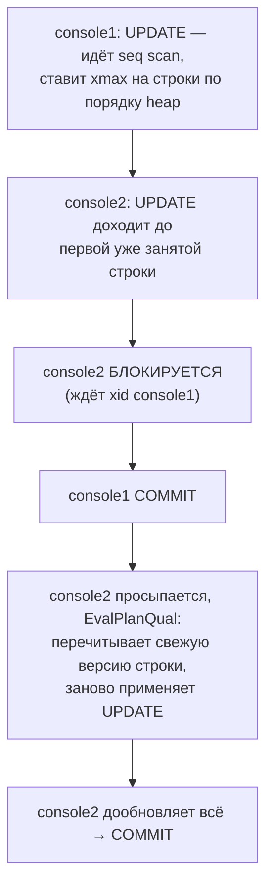

# Concurrent Full-Table Update (Hard)

> Практическая задача с собеседования.
> Тема: MVCC, снапшоты, row-level locking, порядок захвата локов, deadlock,
> bloat/WAL при массовом UPDATE. Теория рядом:
> [MVCC и VACUUM](../01-mvcc-and-vacuum.md),
> [транзакции и блокировки](../04-transactions-and-locking.md).

## Условие

PostgreSQL, стандартные параметры подключения (isolation по умолчанию —
**READ COMMITTED**). Три консоли запускаются **одновременно**:

```sql
-- console1  (без BEGIN → autocommit)
UPDATE dog SET name = 'jack';

-- console2
BEGIN;
UPDATE dog SET name = 'john';
COMMIT;

-- console3
SELECT name FROM dog;
```

Оба `UPDATE` — **без `WHERE`**, то есть трогают все строки таблицы.

Вопросы:
1. Что выведет `SELECT`? Доп. условий никаких нет.
2. Что будет, если в таблице ~100 млн записей — какие нюансы при трёх одновременных
   вызовах, как это внутри обрабатывает PG (row lock), возможны ли дедлоки?

---

## Вопрос 1: что выведет SELECT

**Короткий ответ: результат недетерминирован (гонка), но всегда однороден** — либо все
строки со старым именем, либо все `'jack'`, либо все `'john'`. Смешанного результата
(часть `jack`, часть `john`) быть не может.

Почему так — три факта MVCC:

1. **Обычный `SELECT` не берёт row lock и никогда не блокируется** на пишущих
   транзакциях. Читатели не блокируют писателей и наоборот — это база MVCC. `console3`
   не будет ждать `console1`/`console2`.
2. **`SELECT` видит снапшот.** В READ COMMITTED снапшот берётся на **начало
   выражения** и содержит только **закоммиченные** данные. Грязного чтения
   (uncommitted `jack`/`john`) не бывает.
3. **Каждый `UPDATE` атомарен** — коммитит либо все 100% строк, либо ни одной. Поэтому
   закоммиченные состояния таблицы бывают только такие: `исходное → (jack) → (john)`
   или `исходное → (john) → (jack)`. Промежуточного «половина обновлена» в чужом
   снапшоте нет.

Что именно увидит `console3` — зависит от того, в какой момент взят его снапшот:

| Снапшот `SELECT` взят… | Результат |
| --- | --- |
| до коммита обоих UPDATE | старые имена |
| после коммита одного | все `'jack'` **или** все `'john'` |
| после коммита обоих | значение того, кто закоммитил **последним** |

Ключевой вывод для собеса: **последний закоммитивший «выигрывает»** и переписывает
всё; итоговое состояние таблицы однородно. Порядок коммита `console1`/`console2`
недетерминирован, поэтому и итог недетерминирован — но он всегда «всё одинаковое».

---

## Вопрос 2: 100 млн строк, локи и дедлоки

### Как PG хранит row lock — на самой строке, не в lock-таблице

Row lock в PostgreSQL — это **не запись в менеджере блокировок**, а поле в заголовке
версии строки. `UPDATE`:

1. создаёт новую версию строки (MVCC: старую не перезаписывает);
2. в старой версии проставляет `xmax = свой xid` — вот это и есть «строка заблокирована
   транзакцией X».

Следствия, важные именно на 100 млн строк:

- **Локи не занимают память и не эскалируются.** Нет «row lock → page lock → table
  lock» и нет «закончились локи», как в SQL Server / DB2. Заблокировать хоть все 100
  млн строк — бесплатно по памяти. В общей lock-таблице живут только «тяжёлые» локи
  (table-level, advisory).
- Цена массового `UPDATE` не в локах, а в **MVCC-мусоре и WAL** (см. ниже).

### Как сериализуются два full-table UPDATE

`console2` (или тот, кто вторым дойдёт до строки) на первой же занятой строке видит
`xmax` живой транзакции и **встаёт в ожидание** этой транзакции (ждёт её xid), пока та
не закоммитится/откатится:



- **EvalPlanQual** — механизм READ COMMITTED: разблокировавшись, `UPDATE` перечитывает
  уже закоммиченную версию строки и заново проверяет `WHERE` (здесь он пустой → строка
  всегда подходит) и применяет изменение поверх. Поэтому «потерянного обновления» на
  уровне строки нет — просто второй переписывает результат первого.
- На 100 млн строк это значит: второй `UPDATE` может **простоять всё время работы
  первого** (минуты), локи держатся до `COMMIT`.

### Возможен ли deadlock

Между **двумя одинаковыми** `UPDATE ... (без WHERE)` — обычно **нет**: оба идут `Seq
Scan` в одном физическом порядке heap, лочат строки в одном порядке → один лидирует,
второй просто стоит в очереди. Это блокировка, но не взаимоблокировка.

Deadlock появляется, когда две транзакции захватывают локи в **разном порядке**. На
большой таблице это реально:

- **`synchronize_seqscans = on` (дефолт!)** — второй большой seq scan может
  «подсесть» к уже идущему сканированию **с середины таблицы и завернуться по кругу**.
  Тогда две транзакции лочат строки в разном абсолютном порядке → цикл ожиданий →
  **deadlock**.
- один запрос пошёл по индексу, другой `Seq Scan` → разный порядок;
- параллельные воркеры, разный `ORDER BY`, разные `WHERE`.

Классический цикл:


PG находит цикл по wait-for графу через `deadlock_timeout` (по умолчанию **1s**),
выбирает жертву и **откатывает одну транзакцию** с ошибкой `SQLSTATE 40P01
deadlock detected`. Вторая после этого проходит. То есть дедлок здесь не «повисание», а
внезапная ошибка у одного из клиентов — приложение должно её ловить и ретраить.

### Что с console3 (SELECT) на 100 млн

Не блокируется по-прежнему, но сам по себе это **долгий seq scan** на 100 млн строк.
Отдаст консистентный снапшот на момент старта выражения — то есть одно из состояний из
таблицы Вопроса 1.

### Настоящая проблема массового UPDATE — bloat и WAL

Даже без дедлоков full-table `UPDATE` на 100 млн строк — антипаттерн:

- каждый `UPDATE` создаёт **100 млн новых версий** строк и оставляет 100 млн мёртвых;
  два апдейта → до ~200 млн dead tuples, таблица раздувается в 2–3 раза;
- гигантский объём **WAL** → нагрузка на диск и **лаг репликации**;
- после — «шторм» autovacuum, чтобы вычистить мусор;
- длинная транзакция держит `xmin` и **мешает vacuum** чистить мусор во всей БД.

Правильно — **батчами** по диапазону PK, с throttling, а не одним оператором. Разбор:
[highload: bulk update/delete](../highload-scenarios/02-bulk-update-delete.md).

### Как обезопаситься

```sql
-- ограничить ожидание лока, чтобы не висеть вечно
SET lock_timeout = '5s';

-- ограничить общее время оператора
SET statement_timeout = '30s';

-- на «горячих» строках — детерминированный порядок захвата, чтобы не ловить deadlock
-- (например всегда ORDER BY id в блокирующих запросах)
SELECT * FROM dog WHERE id = ANY($1) ORDER BY id FOR UPDATE;
```

---

## Подводные камни

- **«SELECT покажет смешанные имена»** — нет: снапшот + атомарность `UPDATE` дают
  однородный результат. Частая ошибка на собесе.
- **«SELECT будет ждать UPDATE»** — нет, обычный read в MVCC не блокируется. Ждал бы
  только `SELECT ... FOR UPDATE/SHARE`.
- **`console1` без `BEGIN`** — это не «нет транзакции», а autocommit: один оператор =
  одна неявная транзакция, коммит сразу после `UPDATE`.
- **«Row lock съест память / эскалируется»** — нет, лок лежит в `xmax` строки; в PG нет
  lock escalation.
- **Deadlock между двумя одинаковыми full-scan UPDATE** — маловероятен из-за общего
  порядка heap, но `synchronize_seqscans` может его спровоцировать. Не «никогда».
- **Лечим не локи, а bloat/WAL** — на 100 млн главная боль не блокировка, а MVCC-мусор
  и WAL; массовые изменения делаем батчами.

## Что проверяет на собесе

Понимание MVCC (снапшот, отсутствие грязного чтения, читатели не блокируют писателей),
атомарности `UPDATE` (→ однородный результат), row-level locking через `xmax` (локи «на
строке», без эскалации), поведения READ COMMITTED при конфликте (ожидание +
EvalPlanQual, «последний коммит побеждает»), условий возникновения deadlock (разный
порядок захвата, роль `synchronize_seqscans`, `deadlock_timeout` + `40P01`) и того, что
массовый `UPDATE` — это в первую очередь проблема bloat/WAL, решаемая батчами.

Смежное: [isolation levels и локи](../../../relational-databases-and-sql/02-transactions-isolation-and-locks.md),
[hot rows и счётчики](../highload-scenarios/04-hot-rows-and-counters.md).
