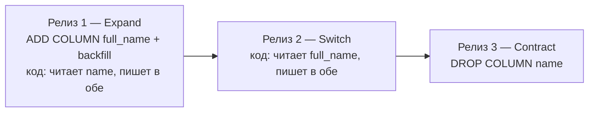

# Migrations in Go

Как менять схему БД в Go-проекте: выбор инструмента и — главное — операционная обвязка вокруг него. Сам раннер миграций (`goose`, `golang-migrate`, `Atlas`) — это ~20% задачи. Остальные 80% — процесс: кто и когда применяет миграции, forward-only политика, zero-downtime паттерны, поведение при падении на середине. Разница между `goose` и `golang-migrate` — единицы процентов производственной зрелости; всё остальное — то, что построено вокруг любого из них.

## Содержание

- [Короткий ответ](#короткий-ответ)
- [Сравнение инструментов](#сравнение-инструментов)
- [Кто и где запускает миграции](#кто-и-где-запускает-миграции)
- [Forward-only в production](#forward-only-в-production)
- [Schema source of truth](#schema-source-of-truth)
- [Zero-downtime: expand-contract](#zero-downtime-expand-contract)
- [Locks, timeouts и DDL safety](#locks-timeouts-и-ddl-safety)
- [Dirty state recovery](#dirty-state-recovery)
- [Конкурентное применение и advisory locks](#конкурентное-применение-и-advisory-locks)
- [Schema review и lint](#schema-review-и-lint)
- [Production checklist](#production-checklist)
- [Interview-ready answer](#interview-ready-answer)

## Короткий ответ

Инструмент выбирается по workflow команды и стеку доступа к БД, а не по количеству звёзд на GitHub:

| Стек | Инструмент | Почему |
| --- | --- | --- |
| `pgx` / `database/sql` / `sqlc` | **goose** | SQL-first, удобный DX, предсказуемый production-путь |
| GORM | **Atlas** | официальная интеграция с GORM, versioned migrations вместо `AutoMigrate` |
| Legacy с готовой папкой `migrations/*.sql` | **golang-migrate** | простой раннер, без дополнительной экосистемы вокруг схемы |

`GORM AutoMigrate` в качестве основного production-подхода не годится: документация GORM сама рекомендует со временем переходить на versioned migrations и указывает на официальную интеграцию с Atlas. `AutoMigrate` уместен максимум для раннего прототипа или dev-окружения.

Источники: [GORM Migration](https://gorm.io/docs/migration.html), [Atlas Versioned Migrations](https://atlasgo.io/versioned/intro).

## Сравнение инструментов

| Инструмент | Что это | Сильные стороны | Ограничения | Когда брать |
| --- | --- | --- | --- | --- |
| [golang-migrate](https://github.com/golang-migrate/migrate) | CLI + Go-библиотека, раннер `up/down` SQL-файлов | простой, много драйверов, легко встроить в CI/CD | только исполнитель: нет diff, lint и планирования изменений | legacy-проект с готовой папкой SQL-миграций |
| [goose](https://github.com/pressly/goose) | CLI + Go-библиотека, SQL- и Go-миграции | embedded migrations, `validate`, `fix`, out-of-order; лучший DX для Go-команд | тоже только раннер: diff/lint дополняются отдельно | boring default для Go-сервиса с ручным SQL |
| [Atlas](https://atlasgo.io/docs) | schema management: diff, lint, inspect, versioned workflow | планирование и safety-анализ изменений, CI-интеграции, официальная связка с GORM | тяжелее по процессу, избыточен для маленьких проектов | GORM или зрелый командный workflow вокруг схемы |
| [gormigrate](https://github.com/go-gormigrate/gormigrate) | минималистичный helper для миграций кодом внутри GORM API | низкий порог входа, всё в одном API | логика привязана к ORM; ревьюить сложнее, чем явный SQL | маленький проект целиком на GORM, осознанный trade-off |
| [dbmate](https://github.com/amacneil/dbmate) | лёгкий framework-agnostic SQL-раннер | простой, не привязывает к ORM и языку | в Go-экосистеме нишевый: ту же роль обычно закрывает goose | нужен предельно лёгкий раннер вне Go-специфики |

Ключевое различие — **раннер против planner-а**. `golang-migrate`, `goose` и `dbmate` только применяют написанный руками SQL. `Atlas` дополнительно помогает изменения **спланировать и проверить**:

- `atlas migrate lint` — встроенные правила безопасности (data loss, `DROP COLUMN`, индекс без `CONCURRENTLY`);
- `atlas migrate hash` — контрольная сумма истории: уже применённую миграцию нельзя незаметно отредактировать;
- `atlas schema diff` — сравнение текущей базы с целевой схемой, drift detection из коробки;
- `atlas migrate apply --baseline` — подключение к legacy-базе без применения существующей истории;
- CI-плагины для GitHub Actions и GitLab.

Если такой workflow нужен, а собирать его руками вокруг `golang-migrate` дорого — переход на Atlas оправдан. Если `goose` + `goose validate` закрывают потребности — достаточно их.

## Кто и где запускает миграции

В production миграции не запускает человек руками и не запускает приложение при старте. Типовые паттерны:

| Способ | Когда запускается | Плюсы | Минусы |
| --- | --- | --- | --- |
| **CI/CD step** | отдельным шагом между `test` и `deploy` | один источник правды, audit trail в CI, нельзя «забыть применить» | CI нужен сетевой доступ к prod-БД |
| **k8s init container** | до старта основного контейнера каждого pod | pod не стартует при падении миграции, дружит с rolling update | запускается на каждой реплике (см. [advisory locks](#конкурентное-применение-и-advisory-locks)), шум в логах |
| **Helm/ArgoCD pre-upgrade hook** | Job ровно один раз перед upgrade релиза | k8s-native, отделено от приложения, статус виден в Helm/ArgoCD | привязка к Helm/ArgoCD |
| **Standalone admin job** | отдельный CI job с manual approval | прозрачно, легко контролировать | менее автоматизировано |
| ~~**Приложение на старте (`AutoMigrate`)**~~ | при запуске каждого pod | «просто работает» в pet-проекте | гонка реплик, миграция смешана со стартом, нет audit/approval, откат кода ≠ откат схемы — **антипаттерн для прода** |

Последовательность в pipeline:

```
build → test → migrate → deploy → smoke test
```

Если шаг `migrate` падает — деплой не продолжается, старый код продолжает работать со старой схемой.

В GitHub Actions это отдельная job между `test` и `deploy`; `environment: production` даёт и секреты окружения, и manual approval через required reviewers:

```yaml
jobs:
  migrate:
    runs-on: ubuntu-latest
    needs: test
    environment: production      # секреты + required reviewers = manual approval
    steps:
      - uses: actions/checkout@v4
      - name: Apply migrations
        env:
          DB_DSN: ${{ secrets.DB_DSN }}
        run: |
          docker run --rm -v "$PWD/db/migrations:/migrations" \
            migrate/migrate:v4.18.3 \
            -path=/migrations -database "$DB_DSN" up

  deploy:
    needs: migrate               # deploy не начнётся, пока миграции не применились
```

В GitLab CI — отдельная stage. Две неочевидные детали: у образа `migrate/migrate` entrypoint — сам бинарь, поэтому для `script:` нужен `entrypoint: [""]`; а у manual-джобы по умолчанию `allow_failure: true` — без явного `allow_failure: false` pipeline уедет в `deploy`, не дождавшись миграций:

```yaml
stages: [test, migrate, deploy]

migrate:
  stage: migrate
  image:
    name: migrate/migrate:v4.18.3
    entrypoint: [""]
  script:
    - migrate -path db/migrations -database "$DB_DSN" up
  environment: production
  rules:
    - if: $CI_COMMIT_BRANCH == $CI_DEFAULT_BRANCH
      when: manual               # или on_success — полностью автоматически
      allow_failure: false       # pipeline ждёт этот шаг
```

`DB_DSN` хранится в CI/CD variables (masked + protected в GitLab, environment secrets в GitHub). Runner-у нужен сетевой доступ к prod-БД — это главный минус варианта: либо self-hosted runner в приватной сети, либо сетевые исключения для облачных.

Init container (фрагмент Deployment manifest):

```yaml
spec:
  template:
    spec:
      initContainers:
        - name: migrate
          image: migrate/migrate:v4.18.3
          args:
            - "-path=/migrations"
            - "-database=$(DB_DSN)"
            - "up"
```

Helm pre-upgrade hook (Job запускается один раз перед релизом):

```yaml
metadata:
  annotations:
    "helm.sh/hook": pre-upgrade,pre-install
    "helm.sh/hook-weight": "-5"
    "helm.sh/hook-delete-policy": before-hook-creation
```

## Forward-only в production

В dev-окружении `migrate down` — нормальный рабочий инструмент. В production откатывать миграции нельзя.

Почему:

- `down`-миграции почти никогда не тестируются на реальных данных;
- если миграция применилась и приложение уже записало данные в новую схему, `down` эти данные потеряет;
- rollback кода и rollback схемы — разные вещи: код откатывается заменой образа, схему с данными «назад» безопасно откатить обычно невозможно;
- даже если `down` технически отработает, состояние БД после него может не соответствовать ни старой, ни новой версии кода.

Правило: **в production только вперёд**. Плохая миграция исправляется новой forward-миграцией, которая откатывает изменения как следующий шаг истории (revert PR). `down`-файлы существуют только для локальной разработки и тестов.

В Makefile это стоит подписать явно:

```makefile
migrate-down: ## roll back the last migration (DEV ONLY — never run in prod)
	migrate -path $(MIGRATE_PATH) -database "$(DB_DSN)" down 1
```

## Schema source of truth

Одних миграционных файлов недостаточно — по 200 файлам сложно понять текущее состояние схемы и ревьюить его. В production принято дополнительно держать **schema dump**:

```bash
pg_dump --schema-only --no-owner --no-privileges mydb > db/schema.sql
```

Файл `schema.sql` коммитится в репозиторий рядом с миграциями. Это даёт:

- **обзор всей текущей схемы** в одном месте — проще ревьюить и обсуждать;
- **drift detection в CI** (drift — расхождение реальной схемы с ожидаемой): джоба прогоняет миграции на чистой базе, делает dump, сравнивает с закоммиченным `schema.sql`; непустой diff валит сборку. Ловит и «миграцию написали, schema.sql забыли», и ручной `ALTER` в живой базе;
- **быстрый bootstrap тестов** — загрузить `schema.sql` одним файлом вместо прогона всей истории миграций.

Типичный CI-шаг:

```yaml
- name: Verify schema dump
  run: |
    make migrate-up
    pg_dump --schema-only ... > /tmp/actual.sql
    diff -u db/schema.sql /tmp/actual.sql
```

## Zero-downtime: expand-contract

Самая частая ошибка — destructive-изменение схемы в один шаг, пока старая версия кода ещё работает. При rolling deploy в кластере одновременно живут pod-ы со старым и новым кодом, и схема должна быть совместима с обоими. Решение — паттерн **expand / contract** (он же two-phase migration): сначала схема расширяется, код мигрирует, и только потом старое удаляется.



### Пример: переименовать колонку `name → full_name`

Неправильно (одна миграция):

```sql
ALTER TABLE users RENAME COLUMN name TO full_name;
```

Старые pod-ы сразу после применения упадут с ошибкой `column "name" does not exist`.

Правильно — три релиза:

1. **Expand.** Миграция добавляет новую колонку и синхронизирует данные:

   ```sql
   ALTER TABLE users ADD COLUMN full_name TEXT;
   UPDATE users SET full_name = name WHERE full_name IS NULL;
   ```

   Приложение читает старую колонку, пишет в обе. Старые pod-ы продолжают работать.

2. **Switch.** Приложение переключается на чтение из новой колонки, для безопасности всё ещё пишет в обе.

3. **Contract.** Когда все pod-ы обновлены и данные в `full_name` гарантированно консистентны:

   ```sql
   ALTER TABLE users DROP COLUMN name;
   ```

### Правила expand/contract

- **`DROP COLUMN` не выполняется в том же релизе**, где выкатывается код, переставший её использовать, — только следующим релизом.
- **Переименование и смена типа колонки** — всегда через «добавить новую → перенести данные → удалить старую», а не прямым `RENAME`/`ALTER TYPE`.
- **`NOT NULL` на новой колонке — не в один шаг**: `ADD COLUMN` (nullable) → backfill → `SET NOT NULL` отдельной миграцией. Прямой `ADD COLUMN ... NOT NULL` без `DEFAULT` на непустой таблице сразу падает с ошибкой; `SET NOT NULL` требует полного скана таблицы под `ACCESS EXCLUSIVE` (быстрый путь через `CHECK ... NOT VALID` — по ссылке ниже).
- **`ADD COLUMN ... DEFAULT`**: с PostgreSQL 11 константный `DEFAULT` дёшев (missing value в метаданных, без перезаписи таблицы); волатильный (`now()`, `gen_random_uuid()`) — по-прежнему full table rewrite.
- **Backfill больших таблиц — батчами**, не одним `UPDATE`; часто это отдельный background job, а не миграция.

Развёрнутый разбор тяжёлого DDL — добавления колонки со значением на таблице в десятки миллионов строк (константный vs волатильный `DEFAULT`, missing value на PG 11+, быстрый `SET NOT NULL` через `NOT VALID`, lock queue) — в [PostgreSQL highload: онлайн-миграция колонки](../database-systems-catalog/postgresql/highload-scenarios/05-online-schema-migration.md).

## Locks, timeouts и DDL safety

Большинство DDL-команд (DDL — Data Definition Language: `ALTER`, `CREATE`, `DROP`) в PostgreSQL берут `ACCESS EXCLUSIVE LOCK`. Опасен не сам лок, а **очередь за ним**: если миграция ждёт лок, который держит долгая транзакция, все последующие запросы к таблице выстраиваются в очередь за миграцией — это классический self-inflicted outage. Подробнее про DDL-локи: [04-transactions-and-locking.md](../database-systems-catalog/postgresql/04-transactions-and-locking.md).

Обязательные настройки в каждой миграции:

```sql
SET lock_timeout = '5s';
SET statement_timeout = '60s';

ALTER TABLE links ADD COLUMN ...;
```

- `lock_timeout` — если лок не получен за 5 секунд, миграция падает с ошибкой вместо того, чтобы блокировать production-трафик. Упавшая миграция дешевле пяти минут downtime.
- `statement_timeout` — защита от случайно бесконечного `UPDATE`.

### `CREATE INDEX CONCURRENTLY`

Обычный `CREATE INDEX` берёт `SHARE LOCK` и блокирует запись в таблицу на всё время построения — на таблице в 100M строк это часы без записи.

```sql
CREATE INDEX CONCURRENTLY idx_links_created_at ON links (created_at DESC);
```

`CONCURRENTLY` строит индекс без блокировки записи. Цена:

- **не выполняется внутри транзакции** (индекс строится в несколько снапшотов). `goose` по умолчанию оборачивает SQL-миграцию в транзакцию — нужна директива `-- +goose NO TRANSACTION`. `golang-migrate` миграции в транзакцию не оборачивает — достаточно не писать `BEGIN/COMMIT` в файле и держать такой DDL отдельной миграцией;
- **при падении остаётся invalid index** — нужен мониторинг и runbook: `DROP INDEX CONCURRENTLY` + повтор.

### Чек-лист для каждой миграции

- [ ] установлен `lock_timeout`?
- [ ] установлен `statement_timeout`?
- [ ] индексы создаются `CONCURRENTLY`?
- [ ] нет `DROP COLUMN`/`RENAME` без expand/contract?
- [ ] `NOT NULL`/backfill разнесены на отдельные шаги?
- [ ] нет полного `UPDATE` без батчей?
- [ ] есть план действий, если миграция упадёт на середине?

## Dirty state recovery

Когда миграция падает посередине, `golang-migrate` помечает её в служебной таблице `schema_migrations` флагом `dirty = true`. После этого любая попытка применить миграции упирается в:

```
error: Dirty database version N. Fix and force version.
```

Это намеренное поведение — инструмент не знает, в каком состоянии база, и отказывается продолжать. Runbook:

1. **Не запускать** `migrate up` повторно и не запускать `migrate down`.
2. **Понять, что упало**: найти миграцию версии N, прочитать SQL, определить, какие операторы успели примениться.
3. **Привести базу руками** в одно из двух состояний:
   - доприменить оставшиеся операторы вручную, затем `migrate force N`;
   - откатить применившиеся изменения вручную, затем `migrate force N-1`.
4. **Поправить SQL** в файле миграции, чтобы он был идемпотентным или хотя бы безопасным при повторном запуске.
5. Запустить `migrate up` заново.

`migrate force` не меняет данные — он только перезаписывает `version` и `dirty` в служебной таблице. Использовать его как «магическую кнопку, чтобы прошло», нельзя.

У `goose` dirty-флага нет: его служебная таблица — `goose_db_version`, а SQL-миграция по умолчанию идёт в транзакции, и при падении изменения откатываются целиком. Но миграция с `-- +goose NO TRANSACTION` при падении точно так же оставляет базу частично изменённой — чинить её придётся руками по той же схеме.

В production нужен алерт на `schema_migrations.dirty = true` — это всегда инцидент.

## Конкурентное применение и advisory locks

Advisory lock — пользовательская блокировка PostgreSQL, не привязанная к таблицам: приложение само договаривается о смысле ключа.

- **golang-migrate** берёт `pg_advisory_lock` на время применения: две параллельные `migrate up` против одной базы не побегут одновременно — вторая ждёт. Поэтому init container на нескольких репликах работает корректно: миграции реально применяет один pod, остальные дожидаются и видят «no change».
- **goose** по умолчанию advisory lock **не берёт**: session locking появился в goose v3 как опция library API (`goose.NewProvider` + `WithSessionLocker`) и в CLI по умолчанию выключен. С goose параллельный запуск нескольких реплик защищён не будет — применение должно быть одноразовым шагом (CI step, Helm hook).
- Повисший advisory lock после упавшего pipeline ищется в `pg_locks` (`locktype = 'advisory'`); снять его можно только завершив сессию держателя: `SELECT pg_terminate_backend(pid)`. `pg_advisory_unlock_all()` здесь не поможет — она снимает локи только собственной сессии.

## Schema review и lint

Миграции ревьюятся отдельно от обычного кода — у них другой профиль рисков. Зрелый процесс включает:

- **PR template** для schema changes с чек-листом из секций выше; в review обсуждается не только SQL, но и rollout plan;
- **обязательный апрувер** от platform-команды или DBA на любую миграцию, изменяющую существующие таблицы;
- **lint в CI** — `atlas migrate lint` или [squawk](https://github.com/sbdchd/squawk) для Postgres: детектят опасные паттерны (`DROP COLUMN`, `ALTER TYPE`, `CREATE INDEX` без `CONCURRENTLY`);
- **testing matrix** — миграция прогоняется на пустой базе, на базе после предыдущих миграций и на базе с production-like данными (sanitized snapshot).

## Production checklist

«Production-grade миграции» означает, что есть:

- [ ] forward-only правило задокументировано и enforced;
- [ ] миграции запускаются автоматически из CI/CD или через init container, а не руками;
- [ ] `schema.sql` дамп в репозитории и drift-check в CI;
- [ ] PR template с expand/contract чек-листом;
- [ ] `lock_timeout` и `statement_timeout` в каждой миграции;
- [ ] `CREATE INDEX` на больших таблицах — всегда `CONCURRENTLY`;
- [ ] runbook для dirty state recovery;
- [ ] алерт на `schema_migrations.dirty = true`;
- [ ] lint миграций в CI (Atlas / squawk);
- [ ] backup или PITR (point-in-time recovery) подтверждён перед apply в production;
- [ ] тестовая база с production-like данными для прогона миграций;
- [ ] `migrate down` против production невозможен технически (роли БД, IAM) или процессно (нет команды в runbook).

8+ пунктов — зрелая практика; 3 и меньше — уровень «есть Makefile target», и первый же инцидент это покажет.

## Interview-ready answer

**1. Чем отличаются goose, golang-migrate и Atlas?**

- Первые два — раннеры SQL-миграций (goose удобнее для Go-команд, migrate — минималистичный универсал), Atlas — schema management с diff, lint и контролем истории. Выбор: pgx/sqlc → goose, GORM → Atlas, legacy SQL → golang-migrate.

**2. Почему нельзя `migrate down` в production?**

- Down-миграции не тестируются на реальных данных и теряют данные, записанные в новую схему. Откат делается новой forward-миграцией.

**3. Как переименовать колонку без даунтайма?**

- Expand/contract в три релиза: добавить новую колонку + dual write → переключить чтение → удалить старую. Прямой `RENAME` роняет старые pod-ы при rolling deploy.

**4. Почему `CREATE INDEX CONCURRENTLY` нельзя в транзакции?**

- Он строит индекс в несколько снапшотов и не может быть атомарным; в goose нужна директива `-- +goose NO TRANSACTION`.

**5. Зачем `lock_timeout` в миграции?**

- DDL под `ACCESS EXCLUSIVE` в очереди за долгой транзакцией блокирует все запросы к таблице; лучше уронить миграцию через 5 секунд, чем получить outage.

**6. Что такое dirty state?**

- golang-migrate помечает упавшую посередине миграцию флагом `dirty` и отказывается продолжать; лечится ручным приведением базы к консистентному состоянию + `migrate force`, а не повторным `up`.
