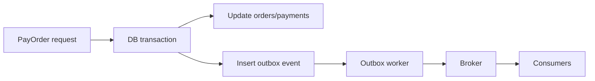

# Outbox Idempotency And Payment Flow

Это разбор типового interview-сценария:

## Содержание

- [Наивный flow](#наивный-flow)
- [Главные проблемы](#главные-проблемы)
- [Transactional outbox](#transactional-outbox)
- [Псевдо-SQL](#псевдо-sql)
- [Что должен делать consumer](#что-должен-делать-consumer)
- [Хороший interview ответ](#хороший-interview-ответ)

## Наивный flow

```text
1. Read order
2. Charge or mark paid
3. Commit DB changes
4. Publish OrderPaid to broker
5. Return success
```

Проблема:
- между commit и publish может случиться сбой;
- тогда БД уже изменилась, а событие не ушло.

## Главные проблемы

### 1. Потеря события

Сценарий:
- транзакция в БД закоммитилась;
- приложение упало до publish в Kafka/RabbitMQ/NATS.

Итог:
- order уже paid;
- downstream systems не узнали об этом.

Решение:
- transactional outbox.

### 2. Дубликаты

Сценарий:
- publish случился;
- приложение не получило ack;
- retry отправил событие еще раз.

Итог:
- downstream может обработать `OrderPaid` дважды.

Решение:
- event id;
- idempotent consumer;
- deduplication table;
- at-least-once mindset.

### 3. Double-pay

Сценарий:
- два запроса одновременно пытаются оплатить один order;
- оба видят `status = new`;
- оба создают payment.

Решение:
- transaction;
- `SELECT ... FOR UPDATE`;
- unique constraint на payment/order;
- state machine.

### 4. Контекст и background work

Плохая идея:

```go
go publishOrderPaid(ctx, event)
```

Почему:
- incoming request context отменится после возврата handler;
- background publish может оборваться.

Лучше:
- outbox worker со своим lifecycle;
- отдельный context от worker runtime.

## Transactional outbox

Идея:
- в одной транзакции меняем business tables;
- и в этой же транзакции пишем событие в таблицу `outbox`;
- отдельный worker читает outbox и публикует события в broker.

Схема:



## Псевдо-SQL

```sql
BEGIN;

SELECT *
FROM orders
WHERE id = $1
FOR UPDATE;

UPDATE orders
SET status = 'paid'
WHERE id = $1 AND status = 'new';

INSERT INTO payments (order_id, idempotency_key, amount)
VALUES ($1, $2, $3)
ON CONFLICT (idempotency_key) DO NOTHING;

INSERT INTO outbox_events (event_id, event_type, payload)
VALUES ($4, 'OrderPaid', $5);

COMMIT;
```

## Что должен делать consumer

Consumer тоже должен быть idempotent.

Причина:
- большинство брокеров и distributed systems дают at-least-once delivery;
- значит duplicates нормальны.

Практические варианты:
- хранить processed event ids;
- использовать idempotency key;
- делать update в стиле "set state if current state allows";
- использовать unique constraints.

## Хороший interview ответ

Сильный ответ:
- "Я не буду публиковать событие после commit как отдельный ненадежный шаг"
- "Я запишу событие в outbox в той же транзакции"
- "Worker опубликует событие асинхронно"
- "Consumers должны быть idempotent, потому что дубликаты возможны"
- "От double-pay защищусь lock/constraint/state machine/idempotency key"
