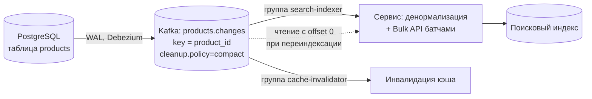
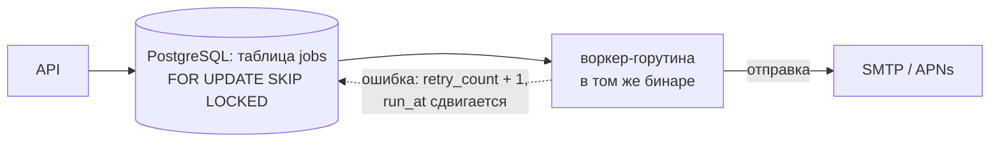
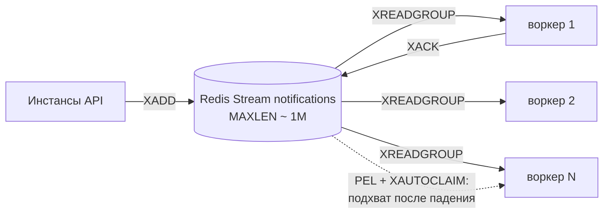
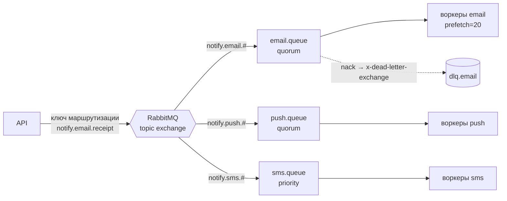
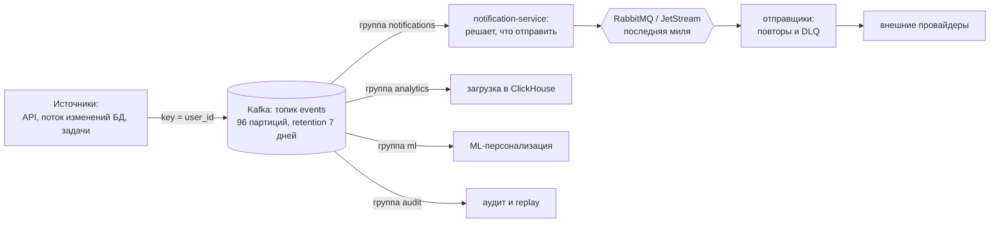

# Message Brokers: сравнение

## Содержание

- [Большая таблица](#большая-таблица)
- [Decision tree](#decision-tree)
- [Реальные задачи и брокеры под них](#реальные-задачи-и-брокеры-под-них)
- [Разбор задач с числами](#разбор-задач-с-числами)
- [Один кейс, четыре масштаба](#один-кейс-четыре-масштаба)
- [Что ломается первым при росте](#что-ломается-первым-при-росте)
- [Типичные ошибки выбора](#типичные-ошибки-выбора)
- [Когда несколько брокеров одновременно](#когда-несколько-брокеров-одновременно)
- [Быстрые характеристики](#быстрые-характеристики)
- [Interview-ready answer](#interview-ready-answer)

Этот файл работает в двух режимах. Как точка входа в раздел: decision tree и каталог задач отвечают на вопрос «что вообще брать под эту задачу» и подсказывают, какой брокер изучать первым. Как сводка после чтения деталей: большая таблица, разборы с числами и раздел про пределы масштабирования складываются в цельную картину только тогда, когда механика каждого инструмента уже знакома.

Материалы по отдельным брокерам: [Kafka](./01-kafka.md), [RabbitMQ](./02-rabbitmq.md), [NATS](./03-nats.md), [Redis Streams](./04-redis-streams.md), [Redis Pub/Sub](./05-redis-pubsub.md), [Cloud Pub/Sub](./06-cloud-pubsub.md), [gRPC Streaming](./07-grpc-streaming.md).

---

## Большая таблица

| | Kafka | RabbitMQ | NATS Core | NATS JetStream | Redis Streams | Redis Pub/Sub | Cloud (GCP Pub/Sub, SNS+SQS) |
|---|---|---|---|---|---|---|---|
| **Модель** | event log | message queue + routing | pub/sub + request-reply | стрим поверх subjects | append-only log | fire-and-forget | managed pub/sub + queue |
| **Persistence** | ✅ retention днями+ | ✅ durable/quorum | ❌ | ✅ file + Raft | ✅ до MAXLEN | ❌ | ✅ managed (обычно до 7 дней) |
| **Delivery** | at-least-once | at-least-once | at-most-once | at-least-once | at-least-once | at-most-once | at-least-once |
| **Exactly-once** | ✅ транзакции (дорого) | ❌ | ❌ | ⚠️ dedup window | ❌ | ❌ | ⚠️ опция GCP |
| **Распределение работы** | consumer groups (партиции) | competing consumers | queue groups | durable consumer / work-queue | XREADGROUP | ❌ broadcast | subscriptions / SQS consumers |
| **Replay** | ✅ любой offset | ❌ | ❌ | ✅ любая позиция | ✅ любой ID | ❌ | ⚠️ GCP seek; SQS ❌ |
| **Ordering** | per-partition | per-queue | per-publisher/subject | per-subject | per-stream | нет гарантий | ordering keys / FIFO |
| **Request-reply** | ❌ | руками (reply-to) | ✅ встроен | ✅ | ❌ | ❌ | ❌ |
| **Throughput** | 1M+ msg/s | 50–100k msg/s | миллионы msg/s | сотни тысяч | ~100k msg/s | 100k+ msg/s | managed, квоты |
| **Latency** | 5–20 мс (batching) | < 1 мс | < 1 мс | ~мс | < 1 мс | < 1 мс | десятки мс |
| **Routing** | ключ → партиция | exchange types | subject wildcards | subject wildcards | по stream key | channel/pattern | topics/filters |
| **Ops complexity** | высокая | умеренная | минимальная | низкая | низкая (есть Redis) | низкая (есть Redis) | нулевая (managed) |
| **DLQ** | ✅ отдельный топик | ✅ x-dead-letter | ❌ | ⚠️ advisories/вручную | вручную | ❌ | ✅ нативно |

gRPC Streaming в таблице нет намеренно: это транспорт точка-точка, а не брокер — сравнение в [07-grpc-streaming.md](./07-grpc-streaming.md).

Две строки таблицы стоит расшифровать сразу, дальше они используются постоянно. Replay — возможность заново прочитать уже обработанные сообщения с произвольной позиции. DLQ (`dead-letter queue`) — отдельная очередь или топик, куда уходит сообщение, которое не удалось обработать за отведённое число попыток.

---

## Decision tree

Идти сверху вниз, первый подходящий вопрос даёт ответ:

| # | Вопрос | Если да | Почему |
| --- | --- | --- | --- |
| 1 | Поток идёт только от сервера к клиенту (уведомления, прогресс задачи, живой дашборд, стриминг ответа модели)? | SSE | обычный HTTP, переподключение встроено в клиент, брокер не нужен |
| 2 | Двусторонняя real-time связь клиент ↔ сервер? | gRPC Streaming / WebSocket | это транспорт, брокер не нужен |
| 3 | Потеря сообщений допустима, Redis уже в стеке (инвалидация кэша, live-обновления)? | Redis Pub/Sub | простейшая рассылка всем |
| 4 | Потеря допустима, нужен ещё и request-reply между сервисами? | NATS Core | pub/sub + RPC, суб-мс latency |
| 5 | Нужны replay, долгое хранение, throughput 100k+ msg/s, несколько независимых групп читателей? | Kafka | распределённый лог |
| 6 | Надёжная очередь задач со сложной маршрутизацией (типы, приоритеты, TTL)? | RabbitMQ | exchange-модель |
| 7 | Надёжная очередь при минимальной эксплуатации (один бинарь, k8s/edge)? | NATS JetStream | стрим + очередь в одном сервере |
| 8 | Надёжная очередь, Redis уже в стеке, ставить отдельный брокер не хочется? | Redis Streams | consumer groups поверх Redis |
| 9 | Эксплуатировать самим не хочется вообще? | GCP Pub/Sub / SNS+SQS | managed, платить за объём |

Первые два пункта — про транспорт до клиента, а не про брокер, и порядок между ними именно такой: SSE проверяется раньше, потому что решает более узкую задачу более простыми средствами. Разбор самих транспортов — [SSE и реалтайм-протоколы](../08-networking-and-api/protocols/04-realtime/02-sse.md) и [WebSocket](../08-networking-and-api/protocols/04-realtime/01-websocket.md).

---

## Реальные задачи и брокеры под них

Decision tree отвечает на абстрактный вопрос. Ниже — конкретные задачи, которые встречаются в продакшене, и почему у них разные ответы. Ключ к выбору всегда одна-две доминирующие характеристики задачи: длительность обработки, нужен ли replay, сколько независимых читателей, допустима ли потеря, нужен ли порядок по сущности.

| Задача | Что доминирует | Разумный выбор | Почему не альтернатива |
| --- | --- | --- | --- |
| Отправка email / push / SMS | надёжность, повторные попытки, DLQ, обработка десятки мс–секунды | RabbitMQ, NATS JetStream, Redis Streams + [Asynq](https://github.com/hibiken/asynq) | Kafka здесь избыточна: нет ни требования replay, ни 100k msg/s; Redis Pub/Sub теряет задачи при рестарте воркера |
| Аудит-лог, event sourcing | долгое хранение, повторное чтение с нуля новым сервисом | Kafka (или JetStream с большим retention) | у RabbitMQ прочитанное сообщение исчезает — новый сервис не догонит историю |
| Аналитика кликов, продуктовые события | 100k+ msg/s, много независимых потребителей, загрузка в аналитическое хранилище | Kafka + загрузчик в ClickHouse/BigQuery | RabbitMQ: копия сообщения на каждую очередь-подписчика, память растёт кратно числу подписчиков; облачный Pub/Sub на таком объёме дорог |
| Поток изменений из БД (`change data capture`, Debezium) | строгий порядок по строке, replay после сбоя коннектора | Kafka + log compaction | нужен упорядоченный лог с offset, а не очередь, из которой сообщение исчезает |
| Инвалидация кэша на всех инстансах | «оповестить живых прямо сейчас», потеря допустима | Redis Pub/Sub, NATS Core | хранение не нужно: следующий запрос всё равно прогреет кэш, а очередь добавит лишнюю инфраструктуру |
| Backplane для SSE или WebSocket — доставить сообщение туда, где сидит клиент | рассылка по инстансам, latency < 10 мс | Redis Pub/Sub, NATS Core | Kafka требует consumer group на инстанс и даёт rebalance при каждом деплое; транспорты — [SSE](../08-networking-and-api/protocols/04-realtime/02-sse.md), [WebSocket](../08-networking-and-api/protocols/04-realtime/01-websocket.md), [gRPC Streaming](./07-grpc-streaming.md) |
| Стриминг ответа модели или прогресса длинной задачи в браузер | только сервер → клиент, важна докачка после обрыва | SSE поверх Redis Streams или Kafka: `Last-Event-ID` = позиция в потоке | WebSocket даст двусторонность, которая здесь не нужна, и потребует своего протокола докачки |
| Синхронный вызов сервиса с SLA 50 мс | ответ нужен в том же запросе | gRPC / HTTP, NATS request-reply | брокер добавляет сетевой переход и делает таймауты непрозрачными |
| Платежи, списания, статусы заказа | порядок по сущности и отсутствие двойного эффекта | Kafka, ключ = `account_id`/`order_id`, плюс идемпотентность на приёмнике | RabbitMQ не гарантирует порядок при competing consumers; см. [outbox и идемпотентность](../06-databases/database-systems-catalog/postgresql/14-outbox-and-idempotency.md) |
| Транскодинг видео, отчёты, ML-инференс (минуты на задачу) | долгая обработка, `prefetch=1`, приоритеты | RabbitMQ (priority queue, подтверждение после завершения), SQS с продлением visibility timeout | Kafka исключит consumer из группы по `max.poll.interval.ms`, если долго не вызывать poll |
| «Напомнить через 3 дня», отложенная отмена брони | планирование во времени и отмена конкретной задачи | планировщик на Redis ZSET (Asynq), RabbitMQ delayed-exchange, Temporal | лог Kafka читается последовательно: отложить одно сообщение значит задержать всю партицию |
| Рассылка события 8 разным сервисам | веерная доставка, каждый читает в своём темпе | Kafka (8 consumer groups), SNS+SQS | RabbitMQ создаёт 8 очередей с копией сообщения; NATS Core не даст догнать при отставании |
| Телеметрия с 50k устройств, ненадёжная сеть | тонкий клиент, буферизация на границе сети | MQTT (EMQX) или leaf nodes в NATS с мостом в Kafka | прямое подключение 50k клиентов к Kafka упирается в файловые дескрипторы и TLS-хендшейки, offline-семантики нет |
| Сглаживание вызовов внешнего API с лимитом 100 rps | ограничение скорости и backpressure | любая durable-очередь плюс пул воркеров с лимитером | брокер не решает задачу сам: см. [backpressure](../05-system-design/reliability-patterns/05-backpressure-and-shedding.md) |
| Передача файла 50 МБ между сервисами | размер сообщения | claim-check: файл в S3/MinIO, в брокер уходит только ссылка | лимиты: Kafka `max.message.bytes` 1 МБ по умолчанию, SQS — 256 КБ |
| Логи и метрики приложений | огромный объём, потеря отдельных строк не критична | Kafka или NATS как буфер перед Loki/ClickHouse | at-least-once с транзакциями здесь не нужен и стоит дорого |
| Стартап, 5 сервисов, нет отдельной команды эксплуатации | стоимость эксплуатации | NATS JetStream (один бинарь) или managed Pub/Sub | Kafka-кластер требует людей: KRaft-кворум, ребалансы, мониторинг lag |

---

## Разбор задач с числами

Пять задач из таблицы разобраны подробнее: в каждой выбор выводится из арифметики требований, а не из предпочтений. Все цифры — порядок величины для сообщений 0.2–1 КБ на обычном железе (несколько vCPU, NVMe-диск). Конкретные значения зависят от размера сообщения, уровня подтверждения (`acks`), политики сброса на диск и сети, поэтому важны не абсолютные числа, а точки перелома, в которых меняется решение.

### Очередь уведомлений: 200 msg/s, обработка 300 мс, повторные попытки обязательны

```text
Требования
  поток       200 msg/s (пики 2k при массовой рассылке)
  обработка   300 мс (вызов внешнего провайдера)
  потеря      недопустима — письмо о платеже
  порядок     не нужен
  replay      не нужен, нужны DLQ и ручной повтор
```

Нужный параллелизм считается по закону Литтла — среднее число задач в системе равно интенсивности потока, умноженной на время обработки:

```text
воркеры = rps × время обработки
2000 × 0.3 с = 600 одновременных задач на пике
```

Число 600 и решает выбор: нужна очередь, в которой параллелизм не привязан к числу партиций.

- RabbitMQ — competing consumers, `prefetch=20`, DLQ через `x-dead-letter-exchange`, отдельные очереди под приоритеты. Шестьсот воркеров здесь означают просто шестьсот подписчиков одной очереди.
- Kafka — те же 600 параллельных обработчиков требуют 600 партиций либо пула горутин внутри consumer-а с ручным управлением commit, и добавляют риск rebalance посреди отправки писем.

Вывод: RabbitMQ, JetStream или Redis Streams. Разбор целиком — [notification service](../05-system-design/interview-cases/02-notification-service.md) и [task queue](../05-system-design/interview-cases/05-task-queue.md).

### Продуктовая аналитика: 300k events/s, 5 потребителей, хранение 7 дней

```text
Объём в секунду   300k msg/s × 400 B ≈ 120 МБ/с
Секунд в сутках   86 400
Объём за 7 дней   120 МБ/с × 86 400 × 7 ≈ 72 ТБ
С репликацией 3   72 ТБ × 3 ≈ 216 ТБ
Со сжатием zstd   JSON сжимается в 3–5 раз → ≈ 50–70 ТБ на диске
```

- Kafka — 120 МБ/с закрываются примерно 12–24 партициями по пропускной способности, но партиций берут больше (60–120) с запасом на параллелизм потребителей и рост. Настройки: `linger.ms=20`, `compression=zstd`, `acks=all` при `min.insync.replicas=2`. Пять потребителей — это пять consumer groups поверх одного и того же лога, дополнительной записи не возникает.
- Managed Pub/Sub — 120 МБ/с дают около 10 ТБ в сутки. При тарифе порядка $40 за ТиБ и оплате отдельно публикации и каждой доставки пять подписок превращают объём в шестизначный месячный счёт. Тарифы нужно проверять калькулятором провайдера, но порядок величины отсекает вариант сразу.
- RabbitMQ — пять очередей-подписчиков означают пятикратную запись и пятикратную память, а потолок одной очереди (очередь обслуживается одним процессом Erlang, то есть одним ядром) не даёт 300k msg/s в одну очередь.

### Платежи: 500 msg/s, порядок по счёту, двойное списание недопустимо

```text
Порядок    строго по account_id (баланс), между счетами — не важен
Дубликаты  возможны всегда (at-least-once), значит нужна идемпотентность
Аудит      обязателен: кто, когда, на каком offset
```

- Kafka — `key = account_id`, поэтому все события одного счёта попадают в одну партицию и читаются по порядку, а разные счета обрабатываются параллельно. Порядок получается без глобальной сериализации всего потока.
- Транзакции Kafka (exactly-once) закрывают только цепочку «прочитал → обработал → записал обратно в Kafka». Списание в базе или вызов платёжного шлюза — внешний эффект, поэтому обязательна дедупликация по ключу идемпотентности: [идемпотентность](../05-system-design/reliability-patterns/06-idempotency.md), [outbox](../06-databases/database-systems-catalog/postgresql/14-outbox-and-idempotency.md).
- SQS FIFO — рабочая альтернатива при небольших объёмах: `MessageGroupId = account_id` задаёт порядок, дедупликация встроена. Лимит обычного FIFO — около 300 msg/s (до 3000 при батчинге), режим high-throughput FIFO выше.

### Поисковый индекс из базы: 12M товаров, 800 изменений/с, переиндексация без нагрузки на базу

```text
Данные      12M товаров в PostgreSQL, документ в индексе ≈ 2 КБ
Поток       300–800 изменений/с, пики до 20k/с при импорте прайсов
Требование  индекс не расходится с базой; отставание не больше 5 секунд
Требование  полная переиндексация после смены схемы индекса — без запросов к базе
Порядок     строго по товару: старая цена не должна перезаписать новую
```

Первое решение — не писать в базу и в индекс двумя вызовами: при сбое между ними данные разъезжаются молча. Источник изменений должен быть один, и это либо чтение WAL (`change data capture`, Debezium), либо transactional outbox. Дальше поток изменений идёт через брокер, и требования выше почти целиком определяют выбор.



- Ключ `product_id` даёт порядок там, где он нужен. Без ключа два изменения одного товара попадают в разные партиции и обрабатываются параллельно — в индекс прилетает старая цена после новой. С ключом все изменения товара лежат в одной партиции и читаются по порядку, а разные товары по-прежнему обрабатываются параллельно.
- Компактируемый топик (`cleanup.policy=compact`) — то, из-за чего здесь выбирают именно Kafka. В логе остаётся последнее состояние каждого товара, поэтому полная переиндексация превращается в чтение топика с нулевого offset: 12M записей вместо шестимесячной истории изменений, и ни одного запроса к базе. Объём топика при этом предсказуем: 12M × 2 КБ ≈ 24 ГБ плюс несжатый хвост. Удаление товара едет как tombstone (значение `null`): consumer удаляет документ, а compaction со временем убирает и сам ключ.
- Несколько независимых потребителей — вторая причина. Тот же поток нужен инвалидации кэша, аналитике и пересчёту рекомендаций; каждая подписка это отдельная consumer group поверх того же лога, дополнительной записи не возникает.
- Идемпотентность вместо exactly-once. Дубликат при ретрае неизбежен, но в индекс пишут с внешней версией документа (LSN или offset записи): устаревшая версия отбрасывается приёмником, и повтор становится безвредным. Транзакции Kafka здесь не помогли бы — запись в индекс это внешний эффект.
- Consumer lag становится продуктовой метрикой: «индекс отстаёт не больше 5 секунд» измеряется напрямую по lag группы `search-indexer`, а не по жалобам пользователей.

Почему не альтернативы:

- RabbitMQ — прочитанное сообщение исчезает, поэтому переиндексация возможна только вторым проходом по базе, то есть ровно той нагрузкой, которую требование запрещает. Плюс competing consumers не дают порядка по товару.
- Периодическая джоба по `updated_at` — понятный вариант, который ломается на деталях: она не видит удалённых строк, пропускает изменения при откатах и расхождении часов между узлами, каждый проход сканирует таблицу и создаёт нагрузку на базу, а повторить вчерашний прогон нечем — истории изменений нет. CDC читает WAL и не конкурирует с продуктовыми запросами.
- Redis Streams — по механике подходят (порядок в потоке, consumer groups), но 24 ГБ состояния в памяти под задачу «перестроить индекс» стоят несопоставимо дороже дискового лога.

Подробности про сам индекс и денормализацию — [Elasticsearch и OpenSearch](../06-databases/database-systems-catalog/09-elasticsearch-and-opensearch.md), про outbox как альтернативу чтению WAL — [outbox и идемпотентность](../06-databases/database-systems-catalog/postgresql/14-outbox-and-idempotency.md).

### Real-time статусы в UI: 30k открытых соединений на 20 инстансах

```text
Задача    доставить событие на тот инстанс, где держится соединение клиента
Направление  только сервер → клиент, клиент ничего не пишет в этот канал
Потеря    допустима: после переподключения интерфейс забирает состояние REST-запросом
Latency   цель < 50 мс от источника до браузера
```

Сначала выбирается транспорт до клиента, и здесь его определяет строчка про направление: раз клиент только слушает, достаточно SSE — обычного HTTP-ответа, который не закрывается. WebSocket нужен, когда клиент пишет в тот же канал (чат, совместное редактирование, игровые действия); за двусторонность платят отдельным протоколом после upgrade, ручным ping/pong и тем, что многие прокси и балансировщики требуют отдельной настройки. Детали и подводные камни обоих — в [SSE и реалтайм-протоколы](../08-networking-and-api/protocols/04-realtime/02-sse.md) и [WebSocket](../08-networking-and-api/protocols/04-realtime/01-websocket.md).

Дальше выбирается брокер под backplane — механизм, доставляющий событие на нужный инстанс:

- Redis Pub/Sub или NATS Core — канал (subject) на пользователя или комнату, без хранения. Запуск нового инстанса ничего не ломает: подписка создаётся мгновенно и не требует координации.
- Kafka здесь неудобна структурно: каждому инстансу нужны все сообщения, то есть отдельная consumer group с уникальным `group.id`, и при роллинг-деплое такие группы плодятся и остаются в метаданных. Дополнительно rebalance даёт паузы, неприятные для интерактивного интерфейса.
- Если те же события нужны для аналитики и истории, оба варианта сосуществуют: Kafka как источник истины, Redis Pub/Sub как последняя миля до сокетов. См. [chat messaging](../05-system-design/interview-cases/04-chat-messaging.md).

Отдельная деталь, которая связывает транспорт с выбором брокера: SSE при обрыве переподключается сам и присылает заголовок `Last-Event-ID` с идентификатором последнего доставленного события. Если в качестве этого идентификатора отдавать позицию из брокера — ID записи Redis Stream или offset Kafka, — то возобновление превращается в продолжение чтения с той же позиции:

```text
1. Клиент подписан: GET /events, Accept: text/event-stream
2. Сервер отдаёт кадры, в поле id — позиция из брокера
   id: 1719400005123-0
   data: {"order":"A-42","status":"packed"}
3. Обрыв сети → клиент сам переподключается:
   GET /events, Last-Event-ID: 1719400005123-0
4. Сервер читает поток с этой позиции (XREAD ... 1719400005123-0)
   и досылает пропущенное, а не полное состояние заново
```

Это работает только с брокером, который умеет читать с произвольной позиции: Redis Streams, Kafka, JetStream. С Redis Pub/Sub догонять нечего — пропущенное потеряно, и после переподключения интерфейс обязан забрать состояние обычным REST-запросом. Тот же приём с WebSocket приходится изобретать руками в прикладном протоколе, потому что докачки по идентификатору в самом протоколе нет.

---

## Один кейс, четыре масштаба

Одна и та же задача — «сервис уведомлений» — при росте нагрузки на четыре порядка меняет ответ четыре раза. Полезная привычка на интервью: спрашивать масштаб до выбора технологии.

| Этап | Нагрузка | Решение | Что заставило перейти дальше |
| --- | --- | --- | --- |
| 1. MVP | 100 сообщений в сутки, один инстанс | таблица `jobs` в PostgreSQL, выборка через `SELECT ... FOR UPDATE SKIP LOCKED`, воркер-горутина | пики рассылок: база начала конкурировать с продуктовыми запросами за соединения |
| 2. Рост | 200 msg/s, три инстанса, Redis уже есть | Redis Streams с `XREADGROUP` (или Asynq поверх Redis) | понадобились приоритеты, разные типы задач, полноценный DLQ и наблюдаемость очередей |
| 3. Зрелость | 5k msg/s, больше десяти типов уведомлений | RabbitMQ: topic exchange, очередь на тип, quorum queues, DLQ, приоритеты | появились аналитика, ML-персонализация и требование переиграть вчерашний поток заново |
| 4. Highload | 200k events/s, шесть потребителей | Kafka как шина событий, RabbitMQ или JetStream остаются очередью последней мили | дальше растут не брокеры, а партиционирование, регионы и стоимость |

**Этап 1 — MVP, 100 сообщений в сутки.** Брокера нет вообще: задача и её состояние живут в той же транзакции, что и бизнес-данные, поэтому «создали заказ, но потеряли письмо» невозможно по построению. `SKIP LOCKED` позволяет нескольким воркерам брать разные строки, не блокируя друг друга.



**Этап 2 — рост, 200 msg/s.** Очередь уходит из базы в Redis, который уже есть в стеке. Появляются consumer group и горизонтальное добавление воркеров. Список выданных, но не подтверждённых сообщений (`PEL`, pending entries list) хранит, кому что отдано, а `XAUTOCLAIM` передаёт зависшие сообщения другому воркеру после падения.



**Этап 3 — зрелость, 5k msg/s и больше десяти типов уведомлений.** Нужны маршрутизация по типу, приоритеты и настоящий DLQ — это профиль RabbitMQ. Ключ маршрутизации выбирает очередь, отказ обработки (`nack`) отправляет сообщение в dead-letter exchange.



**Этап 4 — highload, 200k events/s и шесть потребителей.** Kafka становится шиной событий и источником истины, а очередь остаётся последней милей перед внешними провайдерами: у отправки писем свои повторные попытки и свой темп, которые незачем смешивать с общим логом.



Обратный вывод так же важен: на 100 сообщениях в сутки Kafka-кластер — это минус, а не плюс. Стоимость эксплуатации платится сразу, а выгода от replay и высокой пропускной способности появляется только на следующих порядках нагрузки.

### Как масштабируется каждое решение

| Решение | Один инстанс | Как масштабируется | Практический потолок |
| --- | --- | --- | --- |
| база как очередь (`SKIP LOCKED`) | сотни–тысячи msg/s | вертикально, затем шардирование таблицы | конкуренция с транзакционной нагрузкой, autovacuum на «горячей» таблице |
| Redis Streams | около 100k операций/с (команды исполняются в одном потоке) | несколько потоков-ключей вместо одного; один поток живёт в одном слоте кластера | память и один поток исполнения: за пределы одного шарда поток не растянуть |
| RabbitMQ | 20–50k msg/s на очередь с записью на диск | больше очередей, sharding plugin, consistent-hash exchange | очередь обслуживается одним ядром, а глубокая очередь съедает память |
| NATS JetStream | 100–200k msg/s на поток при трёх репликах и файловом хранилище | несколько потоков, разделение по subject, leaf nodes | Raft-репликация потока и сброс на диск |
| Kafka | 1M+ msg/s на кластер, от ~10 МБ/с на партицию | добавление партиций и брокеров, tiered storage для длинного retention | число партиций на брокер (порядок тысяч), время rebalance, диск и сеть |
| Managed Pub/Sub, SQS | квоты провайдера | автоматически, вручную ничего | стоимость за объём и latency в десятки мс |

---

## Что ломается первым при росте

| Брокер | Первый предел | Симптом | Что делать |
| --- | --- | --- | --- |
| Kafka | партиций меньше, чем нужно параллелизма | consumer lag растёт, добавление инстансов не помогает | увеличить число партиций заранее и с запасом либо распараллелить обработку внутри consumer-а с аккуратным commit |
| Kafka | долгая обработка одного сообщения | постоянные rebalance и дубликаты | вынести работу в пул воркеров, продолжая вызывать poll, поднять `max.poll.interval.ms`, уменьшить `max.poll.records` |
| Kafka | retention против размера диска | старые сегменты удаляются раньше, чем прочитаны | алерт на consumer lag как на SLO-метрику, tiered storage, компакция по ключу вместо хранения по времени |
| RabbitMQ | глубина очереди | резидентная память процесса (RSS) растёт, flow control тормозит продюсеров | quorum- или lazy-очереди, ограничение `x-max-length` с уходом в DLQ, больше воркеров |
| RabbitMQ | одна «горячая» очередь | упор в одно ядро: latency растёт, хотя CPU кластера свободен | разбить на очереди по типу или шарду, поставить consistent-hash exchange |
| Redis Streams | память и один поток исполнения | latency всех команд Redis растёт, включая обычный кэш | ограничить `MAXLEN ~`, вынести очереди на отдельный инстанс, перейти на JetStream или RabbitMQ |
| Redis Pub/Sub | медленный подписчик | сообщения отбрасываются по лимиту `client-output-buffer-limit` | не использовать для данных, которые нельзя терять |
| NATS JetStream | сброс на диск и Raft внутри потока | latency публикации растёт, реплики отстают | разделить по subject на несколько потоков, хранить в памяти там, где потеря допустима |
| Managed Pub/Sub | стоимость и квоты | счёт растёт линейно объёму, издатель упирается в квоту | батчинг, фильтрация на стороне публикации, переход на собственный кластер на больших объёмах |
| любой | неидемпотентный consumer | дубликаты после повторных попыток и rebalance | ключ идемпотентности и дедупликация в базе |

---

## Типичные ошибки выбора

### Redis Pub/Sub для надёжной доставки

```text
❌ "Используем Redis Pub/Sub для отправки писем"
   → email-worker перезапустился — письма потеряны

✅ Redis Streams или RabbitMQ для очереди писем;
   Redis Pub/Sub — только "оповестить живые инстансы прямо сейчас"
```

То же относится к NATS Core: fire-and-forget не для задач, которые нельзя терять.

### Kafka для простой task queue

```text
❌ "Ставим Kafka для фоновых задач"
   → кластер, KRaft-кворум, мониторинг — ради простой очереди

✅ Без требований к replay и throughput:
   RabbitMQ, NATS JetStream или Redis Streams + Asynq/River
```

### Один consumer в Kafka при 12 партициях

```text
❌ Topic с 12 партициями, 1 consumer в группе
   → читает всё последовательно, партиции не используются

✅ partitions ≥ consumers в группе,
   либо параллелизм внутри consumer-а (goroutines по партициям)
```

### Consumer lag не мониторится

```text
❌ "Kafka справляется" → lag растёт неделями
   → retention вытесняет непрочитанные сообщения

✅ Consumer lag — SLO-метрика с алертом
```

---

## Когда несколько брокеров одновременно

Реальные системы часто комбинируют инструменты по их нишам:

```text
Kafka         — audit log, event sourcing, аналитические потоки
RabbitMQ/NATS — task queues, сервис-сервис messaging и RPC
Redis Pub/Sub — real-time cache invalidation, WebSocket backplane
```

Пример: e-commerce платформа

```text
1. Клиент создаёт заказ
   → REST API → Kafka topic "orders.created" (audit + replay)

2. Kafka consumer "fulfillment-service"
   → читает orders.created
   → публикует задачу в RabbitMQ queue "warehouse.tasks"
   → warehouse workers (competing consumers) разбирают задачи

3. При смене статуса заказа
   → Kafka topic "orders.status-changed"
   → Redis Pub/Sub "notifications:real-time"
   → WebSocket-серверы рассылают push-уведомления
```

---

## Быстрые характеристики

**Kafka** — distributed log: replay, высокий throughput, consumer groups по партициям, ordering per-partition; операционно самый тяжёлый.

**RabbitMQ** — классический broker: exchange/queue/binding, fanout/direct/topic routing, competing consumers, quorum queues, низкая latency; умеренная сложность.

**NATS** — лёгкий messaging: Core — at-most-once pub/sub + request-reply с минимальной эксплуатацией; JetStream — персистентные стримы с at-least-once, replay и KV store.

**Redis Streams** — append-only log внутри Redis: consumer groups (XREADGROUP), at-least-once через XACK, persistence до MAXLEN; хорош, когда Redis уже есть.

**Redis Pub/Sub** — fire-and-forget broadcast всем подписчикам: нет persistence, at-most-once; ниша — backplane и live-сигналы.

**Cloud (GCP Pub/Sub, SNS+SQS)** — managed: нулевая эксплуатация, нативный DLQ, at-least-once; платится объёмом и latency, ограничен replay.

---

## Interview-ready answer

**1. Какой брокер выбрать для задачи X?**

- Порядок ответа — сначала уточнение требований, а не «X лучше»: нужен ли replay, какой поток сообщений, допустима ли потеря, нужны ли consumer groups, какая latency, кто будет это эксплуатировать.
- Kafka — replay, высокая пропускная способность и несколько независимых потребителей одного лога ценой эксплуатации.
- RabbitMQ — гибкая маршрутизация, приоритеты и низкая latency, но без replay.
- NATS — минимальная эксплуатация и встроенный request-reply, надёжность добавляет JetStream.
- Redis Streams — разумный компромисс, когда Redis уже есть в стеке и отдельный брокер ставить не хочется.
- Managed Pub/Sub или SQS — когда эксплуатировать некому, а объём умеренный.

**2. В чём разница delivery semantics?**

- At-most-once — потеря возможна, дубликатов нет; подходит логам, метрикам и live-сигналам.
- At-least-once — потерь нет, дубликаты возможны, поэтому consumer обязан быть идемпотентным.
- Exactly-once — самое дорогое: требует транзакций или дедупликации и работает только внутри конвейера брокера.
- Внешние эффекты (запись в базу, вызов платёжного шлюза) не покрываются транзакциями брокера, для них нужна идемпотентность приёмника.
- Практический стандарт — at-least-once плюс идемпотентный consumer.

**3. Как меняется выбор с ростом нагрузки?**

- Порядок ответа — сначала уточняется масштаб, потом называется технология: 100 задач в сутки — таблица в PostgreSQL со `SKIP LOCKED`, сотни msg/s — Redis Streams или RabbitMQ, десятки тысяч событий в секунду с несколькими независимыми потребителями — Kafka.
- Точки перелома — не «стало много», а симптом: очередь начала конкурировать с транзакционной нагрузкой за соединения, понадобились приоритеты и DLQ, понадобился replay и второй-третий потребитель одного потока, уперлись в одно ядро на очередь.
- Предел внутри одного брокера — у Kafka число партиций и время rebalance, у RabbitMQ одно ядро на очередь и память при глубокой очереди, у Redis Streams один поток исполнения и объём памяти, у managed-облака стоимость за объём.
- Обратное направление — избыточный выбор (Kafka под фоновые задачи) платится эксплуатацией сразу, а выгоду даёт только на следующих порядках нагрузки.

**4. Пример задачи, где Kafka — плохой выбор?**

- Отложенные задачи («отменить бронь через 30 минут») — лог читается последовательно, отложить одно сообщение значит заблокировать партицию; нужен планировщик по времени с возможностью отмены: Redis ZSET, таблица с `run_at`, Temporal.
- Долгие задачи на минуты (транскодинг, отчёты) — consumer исключается из группы по `max.poll.interval.ms`, начинаются rebalance и дубликаты; лучше RabbitMQ с `prefetch=1` или SQS с продлением visibility timeout.
- Высокий параллелизм на небольшом потоке — 600 одновременных обработчиков при 200 msg/s потребовали бы 600 партиций, тогда как в очереди с competing consumers это просто 600 подписчиков.
- Backplane для SSE или WebSocket — каждому инстансу нужны все сообщения, то есть своя consumer group, и такие группы плодятся при каждом деплое; Redis Pub/Sub или NATS Core решают это без состояния.

**5. Чем SSE отличается от WebSocket при выборе транспорта до клиента?**

- Направление — SSE односторонний (сервер → клиент), WebSocket двусторонний; если клиент в этот канал не пишет, двусторонность оплачивается зря.
- Транспорт — SSE это обычный HTTP-ответ, который не закрывается, поэтому проходит через привычные прокси и балансировщики при отключённой буферизации; WebSocket требует upgrade-соединения и отдельной настройки инфраструктуры.
- Переподключение — у SSE встроено в клиент вместе с заголовком `Last-Event-ID`, у WebSocket пишется руками.
- Докачка — если в поле `id` кадра отдавать позицию из брокера (ID записи Redis Stream, offset Kafka), возобновление становится продолжением чтения с той же позиции вместо повторной отдачи всего состояния.
- Ограничение — с Redis Pub/Sub догонять нечего: пропущенное потеряно, и после обрыва интерфейс забирает состояние REST-запросом.
- Общее — оба транспорта не заменяют брокер: событие всё равно нужно доставить на тот инстанс, где держится соединение, и это делает backplane на Redis Pub/Sub или NATS Core.
