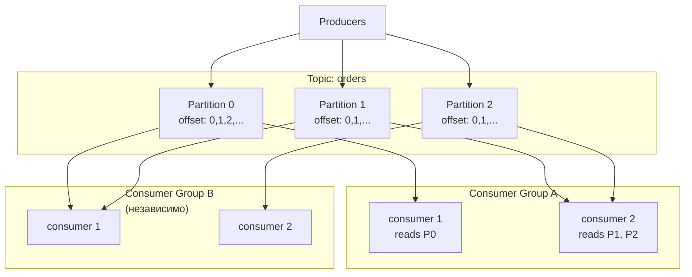

# Apache Kafka

Kafka — распределённый лог событий. Не очередь сообщений (как [RabbitMQ](./02-rabbitmq.md)), а append-only журнал с партиционированием и consumer groups. Понимание архитектуры объясняет все его trade-offs.

## Содержание

- [Архитектура: основные понятия](#архитектура-основные-понятия)
- [Координация кластера: от ZooKeeper к KRaft](#координация-кластера-от-zookeeper-к-kraft)
- [Delivery semantics](#delivery-semantics)
- [Producer: acks, batching, compression](#producer-acks-batching-compression)
- [Consumer: poll loop, commit offset, rebalance](#consumer-poll-loop-commit-offset-rebalance)
- [Kafka в Go: выбор клиента](#kafka-в-go-выбор-клиента)
- [DLQ и retry-топики](#dlq-и-retry-топики)
- [Log compaction vs retention](#log-compaction-vs-retention)
- [Когда Kafka не нужен](#когда-kafka-не-нужен)
- [Типичные ошибки](#типичные-ошибки)
- [Interview-ready answer](#interview-ready-answer)

## Архитектура: основные понятия



Каждая партиция реплицируется: 1 leader + N follower-реплик на разных брокерах (см. ISR ниже).

### Topic

Логическая категория сообщений. Аналог таблицы в БД или очереди. Каждый топик делится на **партиции**.

### Partition

Физическая единица параллелизма. Append-only лог на диске. Каждое сообщение в партиции имеет уникальный **offset** (монотонно растущий integer).

Больше партиций → выше пропускная способность (параллельная запись/чтение).

### Offset

Позиция сообщения внутри партиции. Consumer хранит, **до какого offset** он дочитал. Это позволяет replay: начать чтение с любого offset.

### Broker

Отдельный сервер Kafka. Кластер из нескольких брокеров делит партиции между собой — масштаб и отказоустойчивость.

### ISR — In-Sync Replicas

Набор реплик, которые не отстают от leader. Если leader упадёт, новым leader становится одна из ISR — данные не теряются. Связанные ручки:

- `replication.factor` — сколько всего копий партиции (обычно 3);
- `min.insync.replicas` — сколько реплик обязаны подтвердить запись при `acks=all` (обычно 2 при факторе 3: переживает падение одного брокера, не останавливаясь);
- `unclean.leader.election.enable` — можно ли выбирать leader из **отставших** реплик. `false` (default) — при потере всех ISR партиция недоступна, но данные целы; `true` — партиция доступна, но подтверждённые сообщения могут потеряться. Это ручка «availability vs durability».

### Consumer Group

Несколько consumers, которые читают один топик **сообща**:

- каждая партиция назначается **одному** consumer в группе;
- разные группы читают **независимо** (каждая со своего offset);
- максимальный параллелизм группы = количество партиций.

```text
Topic: orders (3 партиции)

Consumer Group "shipping":
  consumer-1 → P0
  consumer-2 → P1
  consumer-3 → P2

Consumer Group "analytics":
  consumer-1 → P0, P1, P2 (один consumer читает все)
```

## Координация кластера: от ZooKeeper к KRaft

Кластеру нужен координатор: кто leader каждой партиции, какие брокеры живы, метаданные топиков. Исторически это делал внешний **ZooKeeper** — отдельный кворумный кластер, вторая распределённая система рядом с первой (своя эксплуатация, свои сбои).

**KRaft** (Kafka Raft, production-ready с 3.3) убирает ZooKeeper: метаданные хранятся в самом Kafka как внутренний Raft-лог, часть брокеров выполняет роль controller-кворума. С Kafka 4.0 ZooKeeper удалён полностью. Практические следствия: один кластер вместо двух, быстрее failover контроллера, проще эксплуатация. На собеседовании «ZooKeeper или KRaft?» — вопрос на актуальность знаний: новые кластеры — только KRaft.

## Delivery semantics

### At-most-once

```text
Producer → fire-and-forget (acks=0)
Consumer → коммитит offset ДО обработки
```

Если consumer упал после коммита, но до обработки — сообщение потеряно. Подходит для метрик и логов, где потеря дешевле дубликата.

### At-least-once

```text
Producer → acks=all + retries → повторная отправка при ошибке
Consumer → коммитит offset ПОСЛЕ обработки
```

Если consumer упал после обработки, но до коммита — сообщение обработается дважды. Поэтому at-least-once требует **идемпотентности** consumer-а ([06-idempotency.md](../05-system-design/reliability-patterns/06-idempotency.md)).

Важно: со стороны producer-а at-least-once даёт именно `acks=all`. При `acks=1` подтверждение приходит от leader **до** репликации — если leader упадёт сразу после ack, сообщение потеряно, то есть это уже не «не менее одного раза».

### Exactly-once

Самая дорогая гарантия. Kafka реализует через:

1. **Idempotent producer** (`enable.idempotence=true`): брокер дедуплицирует ретраи по producer id + sequence number.
2. **Transactions** (`transactional.id`): атомарная запись в несколько топиков + коммит offset — для паттерна consume-process-produce.

```go
// Idempotent producer
producer, _ := kafka.NewProducer(&kafka.ConfigMap{
    "bootstrap.servers":  "localhost:9092",
    "enable.idempotence": true, // подразумевает acks=all
})
```

Exactly-once заметно снижает пропускную способность (транзакционный coordinator, больше round-trip). И это «effectively once» **внутри Kafka-конвейера**: side effects во внешних системах (HTTP, другая БД) транзакция не откатит — там всё равно нужна идемпотентность приёмника. В большинстве случаев достаточно at-least-once + идемпотентный consumer.

## Producer: acks, batching, compression

### `acks` — уровень подтверждения

| `acks` | Поведение | Когда |
|---|---|---|
| `0` | Не ждать подтверждения | логи, метрики — потеря допустима |
| `1` | Подтверждение от leader (до репликации) | компромисс; возможна потеря при падении leader |
| `all` / `-1` | Подтверждение от всех ISR (минимум `min.insync.replicas`) | критические данные |

```go
// Producer: клиентская сторона
producer, _ := kafka.NewProducer(&kafka.ConfigMap{
    "acks":             "all",
    "retries":          3,
    "retry.backoff.ms": 100,
})
```

```bash
# min.insync.replicas — конфиг ТОПИКА/брокера, не клиента:
kafka-configs.sh --alter --topic orders \
  --add-config min.insync.replicas=2
```

Связка `acks=all` + `min.insync.replicas=2` + `replication.factor=3` означает: запись подтверждена минимум двумя репликами, кластер переживает падение одного брокера без потери данных и без остановки записи.

### Batching и linger

```text
Producer → [batch buffer] → flush при: batch.size ИЛИ linger.ms → Broker
```

- `batch.size` — максимальный размер батча в байтах (default 16KB);
- `linger.ms` — сколько ждать, собирая сообщения в батч (default 0 — отправлять немедленно).

Увеличение `linger.ms` до 5–20 мс значительно повышает throughput при незначительном росте latency.

### Compression

```text
"compression.type": "snappy"  // snappy, gzip, lz4, zstd
```

Сжатие — на уровне батча: брокер хранит и передаёт батч как есть, распаковывает только consumer.

- `snappy` — баланс скорости и степени сжатия, частый выбор по умолчанию;
- `lz4` — быстрее snappy, чуть слабее сжатие;
- `zstd` — лучшее сжатие при хорошей скорости, рекомендуется для трафика между дата-центрами;
- `gzip` — сильное сжатие, медленный; legacy.

## Consumer: poll loop, commit offset, rebalance

### Poll loop

Kafka consumer — pull-based: активно опрашивает брокер.

```go
consumer, _ := kafka.NewConsumer(&kafka.ConfigMap{
    "bootstrap.servers": "localhost:9092",
    "group.id":          "my-group",
    "auto.offset.reset": "earliest",
    "enable.auto.commit": false,
})
consumer.SubscribeTopics([]string{"orders"}, nil)

for {
    msg, err := consumer.ReadMessage(time.Second)
    if err != nil {
        if err.(kafka.Error).Code() == kafka.ErrTimedOut {
            continue
        }
        log.Printf("consumer error: %v", err)
        break
    }

    processOrder(msg)            // обработка
    consumer.CommitMessage(msg)  // manual commit ПОСЛЕ обработки
}
```

### Auto vs manual commit

```go
// Auto-commit: offset коммитится фоном каждые N мс
// Риск 1: обработал, но commit не успел → повторная обработка при рестарте (at-least-once)
// Риск 2: commit прошёл, обработка не завершена → потеря (at-most-once)
"enable.auto.commit":      true,
"auto.commit.interval.ms": 5000,

// Manual commit: явный контроль момента подтверждения
"enable.auto.commit": false,
consumer.CommitMessage(msg) // sync — блокирует
consumer.CommitAsync(nil)   // async — быстрее, но при crash возможна потеря коммита
```

### Rebalance

Когда consumer входит в группу или покидает её (deploy, scale, падение), Kafka перераспределяет партиции между участниками.

Два протокола:

- **Eager** (классический, `range`/`round-robin` assignor): на время rebalance **все** consumers группы отзывают **все** партиции и останавливают обработку — stop-the-world.
- **Cooperative** (incremental, `cooperative-sticky`, KIP-429): переезжают только те партиции, которым реально нужно сменить владельца; остальные consumers продолжают работу. Современный выбор — franz-go использует cooperative-sticky по умолчанию.

Классическая проблема: при долгой обработке consumer не вызывает poll → брокер решает, что он умер → лишний rebalance живой группы.

```go
"max.poll.interval.ms":  300000, // max время между poll (default 5 мин)
"session.timeout.ms":    45000,  // таймаут heartbeat (default 45 c)
"heartbeat.interval.ms": 3000,   // частота heartbeat
```

## Kafka в Go: выбор клиента

| | franz-go | sarama | confluent-kafka-go |
|---|---|---|---|
| Тип | Pure Go | Pure Go | CGo (librdkafka) |
| Производительность | ⭐⭐⭐ лучшая | ⭐⭐ средняя | ⭐⭐⭐ лучшая |
| API | современный, идиоматичный | громоздкий | C-like |
| Поддержка | активная | медленная (IBM/sarama) | Confluent |
| Зависимости | только stdlib | много | librdkafka |
| Cross-compile | ✅ | ✅ | ❌ (CGo) |
| Транзакции | ✅ | ✅ | ✅ |
| Ниша | новые проекты | legacy-кодовые базы | команды на стеке Confluent |

### Пример с franz-go

```go
import "github.com/twmb/franz-go/pkg/kgo"

// Producer
client, _ := kgo.NewClient(
    kgo.SeedBrokers("localhost:9092"),
    kgo.RequiredAcks(kgo.AllISRAcks()),
)
defer client.Close()

// Sync produce
err := client.ProduceSync(ctx, &kgo.Record{
    Topic: "orders",
    Key:   []byte(orderID), // ключ → партиция → ordering по сущности
    Value: orderJSON,
}).FirstErr()

// Consumer: commit только отмеченных записей
client, _ := kgo.NewClient(
    kgo.SeedBrokers("localhost:9092"),
    kgo.ConsumerGroup("my-group"),
    kgo.ConsumeTopics("orders"),
    kgo.AutoCommitMarks(), // коммитятся только записи, отмеченные MarkCommitRecords
)

for {
    fetches := client.PollFetches(ctx)
    if errs := fetches.Errors(); len(errs) > 0 {
        log.Printf("fetch errors: %v", errs)
    }
    fetches.EachRecord(func(r *kgo.Record) {
        processOrder(r.Value)
        client.MarkCommitRecords(r) // отметить ПОСЛЕ обработки
    })
}
```

## DLQ и retry-топики

Сообщения, которые не удалось обработать N раз, перемещаются в отдельный топик для анализа — иначе poison message бесконечно блокирует партицию.

```go
const maxRetries = 3

func processWithDLQ(ctx context.Context, client *kgo.Client, record *kgo.Record) {
    retries := getRetryCount(record.Headers)

    if err := processOrder(record.Value); err != nil {
        if retries >= maxRetries {
            // В DLQ с метаданными об ошибке
            dlqRecord := &kgo.Record{
                Topic: record.Topic + ".dlq",
                Key:   record.Key,
                Value: record.Value,
                Headers: append(record.Headers,
                    kgo.RecordHeader{Key: "error", Value: []byte(err.Error())},
                    kgo.RecordHeader{Key: "original_topic", Value: []byte(record.Topic)},
                ),
            }
            client.ProduceSync(ctx, dlqRecord)
        } else {
            // Retry-топик с увеличенным счётчиком
            retryRecord := &kgo.Record{
                Topic:   record.Topic + ".retry",
                Key:     record.Key,
                Value:   record.Value,
                Headers: setRetryCount(record.Headers, retries+1),
            }
            client.ProduceSync(ctx, retryRecord)
        }
        return
    }

    client.MarkCommitRecords(record)
}
```

## Log compaction vs retention

### Retention (time/size based)

Стандартный режим: сообщения удаляются по истечении времени или при превышении размера.

```text
retention.ms=604800000     # хранить 7 дней
retention.bytes=1073741824 # или 1 GB
```

Подходит, когда важна история событий за период: clickstream, логи, транзакции.

### Log compaction

Kafka оставляет **только последнее значение** для каждого ключа.

```text
Исходный лог:     user1:A  user2:B  user1:C  user3:D  user1:E
После compaction: user2:B  user3:D  user1:E   (только последние)
```

```text
cleanup.policy=compact
```

Подходит, когда топик — это состояние (changelog): нужен последний known state для каждого ключа. Примеры: цены товаров, настройки пользователей, state stores в Kafka Streams.

**Tombstone**: значение `null` — удаление ключа из compacted-лога.

## Когда Kafka не нужен

Kafka — не серебряная пуля: он добавляет значительную операционную сложность.

Kafka **избыточен**, когда:

- нужна простая задачная очередь ([RabbitMQ](./02-rabbitmq.md) или [Redis Streams](./03-redis-streams.md) проще);
- latency < 10 мс критична (batching добавляет задержку);
- нет требований к replay/истории;
- consumers не масштабируются горизонтально.

Kafka **оправдан**, когда:

- throughput от ~100k msg/s;
- нужен replay/reprocessing исторических данных;
- несколько независимых consumer groups с разной логикой;
- event sourcing / CQRS;
- долгосрочное хранение событий (недели/месяцы).

Сводное сравнение брокеров — [07-comparison.md](./07-comparison.md).

## Типичные ошибки

### 1. Слишком мало партиций

Число партиций = максимальный параллелизм consumer group: 1 партиция → 1 активный consumer. Ориентир: `partitions >= ожидаемый максимум consumers × 2`. Партиции можно только добавлять; добавление ломает ordering по ключу для существующих ключей (`hash(key) % N` меняется).

### 2. Consumer lag не мониторится

Consumer lag = разница между последним offset партиции и закоммиченным offset группы. Растущий lag означает, что consumer не успевает; когда lag превысит retention, непрочитанные сообщения будут удалены.

```bash
kafka-consumer-groups.sh --bootstrap-server localhost:9092 \
  --group my-group --describe
```

### 3. Ordering ломается без ключа

Kafka гарантирует порядок только внутри партиции. Без ключа сообщения размазываются по партициям, и события одной сущности читаются вразнобой.

```go
record := &kgo.Record{
    Topic: "orders",
    Key:   []byte(userID), // все события пользователя → одна партиция → порядок
    Value: orderData,
}
```

## Interview-ready answer

**1. Чем Kafka отличается от RabbitMQ?**

- Kafka — distributed log (append-only), RabbitMQ — message broker (queue-семантика). Kafka хранит сообщения по retention policy и поддерживает replay с любого offset; RabbitMQ удаляет после ack, но гибче в маршрутизации (exchange types). Kafka — для high-throughput event streaming и независимых consumer groups; RabbitMQ — для task queues и сложного routing.

**2. Что такое exactly-once и почему это дорого?**

- Idempotent producer (дедупликация по producer id + sequence number) + транзакционный API (атомарная запись + commit offset). Добавляет round-trips к transaction coordinator и снижает throughput в разы. Это «effectively once» внутри Kafka: внешние side effects не откатываются — приёмнику всё равно нужна идемпотентность. Чаще всего достаточно at-least-once + идемпотентный consumer.

**3. Как гарантировать ordering?**

- Kafka гарантирует порядок только внутри партиции. Для порядка по сущности — партиционировать по её id (`Key: userID`): все события сущности попадают в одну партицию и читаются в порядке записи. Глобального порядка по топику нет (только топик с одной партицией ценой параллелизма).

**4. Когда Kafka теряет данные?**

- `acks=0/1` — потеря при падении leader до репликации; `unclean.leader.election=true` — выбор отставшей реплики лидером затирает подтверждённые сообщения; consumer lag больше retention — непрочитанное удалено. Защита: `acks=all` + `min.insync.replicas=2` + `replication.factor=3`, unclean election выключен, мониторинг lag.

**5. Что такое KRaft?**

- Режим координации без ZooKeeper: метаданные кластера хранятся во внутреннем Raft-логе, кворум контроллеров — часть самого Kafka. Production-ready с 3.3, с 4.0 ZooKeeper удалён. Меньше эксплуатации (одна система вместо двух), быстрее failover контроллера.
