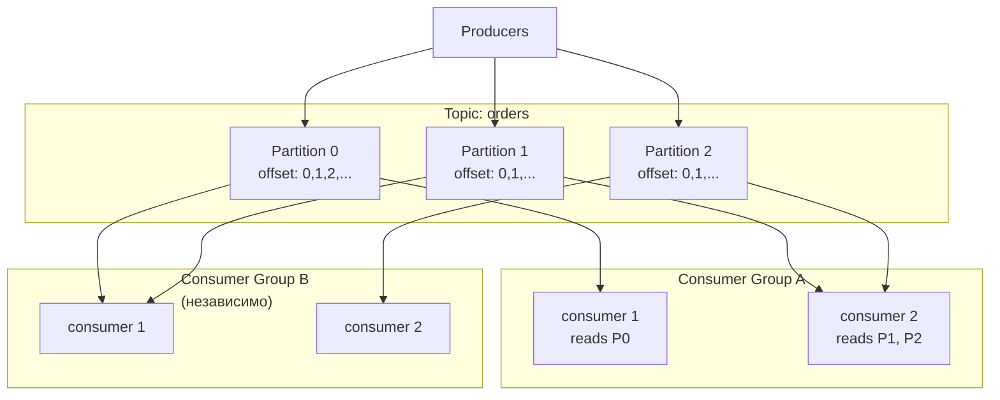
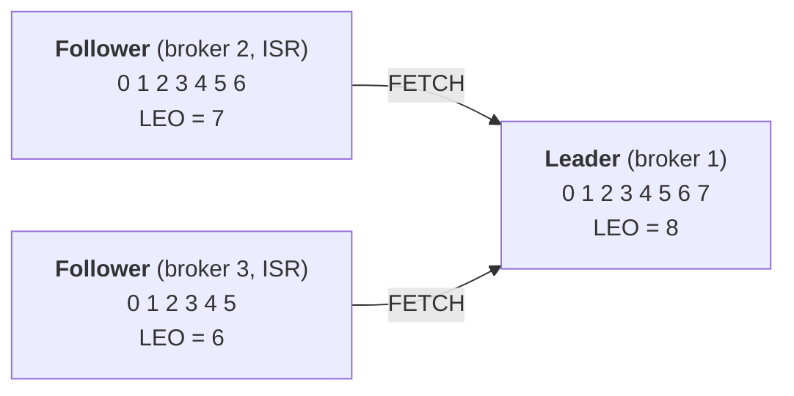
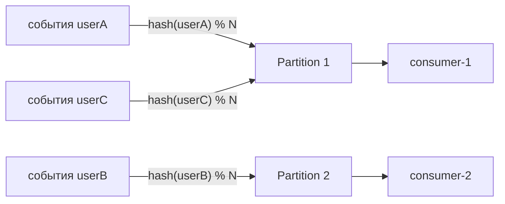

# Apache Kafka

Kafka — распределённый лог событий. Не очередь сообщений (как [RabbitMQ](./02-rabbitmq.md)), а append-only журнал с партиционированием и consumer groups. Понимание архитектуры объясняет все его trade-offs.

## Содержание

- [Архитектура: основные понятия](#архитектура-основные-понятия)
  - [Topic](#topic)
  - [Partition](#partition)
  - [Offset](#offset)
  - [Broker](#broker)
  - [ISR — In-Sync Replicas](#isr--in-sync-replicas)
  - [Consumer Group](#consumer-group)
- [Как хранится лог на диске: сегменты и индексы](#как-хранится-лог-на-диске-сегменты-и-индексы)
  - [Директория партиции](#директория-партиции)
  - [Сегменты](#сегменты)
  - [Три файла сегмента](#три-файла-сегмента)
  - [Что лежит внутри файлов](#что-лежит-внутри-файлов)
  - [Как читается сообщение по offset](#как-читается-сообщение-по-offset)
  - [Retention удаляет сегменты, compaction их переписывает](#retention-удаляет-сегменты-compaction-их-переписывает)
  - [Почему это быстро: sequential I/O, page cache, zero-copy](#почему-это-быстро-sequential-io-page-cache-zero-copy)
  - [Zero-copy: почему отдача consumer'у почти бесплатна](#zero-copy-почему-отдача-consumerу-почти-бесплатна)
- [Координация кластера: от ZooKeeper к KRaft](#координация-кластера-от-zookeeper-к-kraft)
  - [Как работает KRaft: controller-кворум и метаданные](#как-работает-kraft-controller-кворум-и-метаданные)
  - [В облаке: managed Kafka vs Kafka-совместимые сервисы](#в-облаке-managed-kafka-vs-kafka-совместимые-сервисы)
- [Репликация: leader, followers и high watermark](#репликация-leader-followers-и-high-watermark)
  - [Кто с кем говорит](#кто-с-кем-говорит)
  - [LEO и High Watermark](#leo-и-high-watermark--что-видит-consumer)
  - [Динамика ISR: shrink и expand](#динамика-isr-shrink-и-expand)
  - [Выбор нового leader](#выбор-нового-leader)
  - [Что с «хвостом» выше HW при падении leader](#что-с-хвостом-выше-hw-при-падении-leader)
  - [Размещение реплик по AZ](#размещение-реплик-по-az)
- [Delivery semantics](#delivery-semantics)
  - [At-most-once — «не более одного раза»](#at-most-once--не-более-одного-раза)
  - [At-least-once — «не менее одного раза»](#at-least-once--не-менее-одного-раза)
  - [Exactly-once — «ровно один раз»](#exactly-once--ровно-один-раз)
- [Producer: acks, batching, compression](#producer-acks-batching-compression)
  - [`acks` — уровень подтверждения](#acks--уровень-подтверждения)
  - [Batching и linger](#batching-и-linger)
  - [Compression](#compression)
- [Consumer: poll loop, commit offset, rebalance](#consumer-poll-loop-commit-offset-rebalance)
  - [Poll loop](#poll-loop)
  - [Auto vs manual commit](#auto-vs-manual-commit)
  - [Rebalance](#rebalance)
- [Партиционирование: ключ, порядок и consumer](#партиционирование-ключ-порядок-и-consumer)
  - [Три способа выбрать партицию](#три-способа-выбрать-партицию)
  - [Зачем ключ: цепочка key → партиция → consumer](#зачем-ключ-цепочка-key--партиция--consumer)
  - [Как выбирать ключ](#как-выбирать-ключ)
  - [Подводный камень: hot partition](#подводный-камень-hot-partition-перекос-ключей)
  - [Изменение числа партиций](#изменение-числа-партиций)
- [Kafka в Go: выбор клиента](#kafka-в-go-выбор-клиента)
  - [Пример с franz-go](#пример-с-franz-go)
- [DLQ и retry-топики](#dlq-и-retry-топики)
- [Log compaction vs retention](#log-compaction-vs-retention)
  - [Retention (time/size based)](#retention-timesize-based)
  - [Log compaction](#log-compaction)
- [Когда Kafka не нужен](#когда-kafka-не-нужен)
- [Типичные ошибки](#типичные-ошибки)
  - [1. Слишком мало партиций](#1-слишком-мало-партиций)
  - [2. Consumer lag не мониторится](#2-consumer-lag-не-мониторится)
  - [3. Ordering ломается без ключа](#3-ordering-ломается-без-ключа)
- [Interview-ready answer](#interview-ready-answer)

## Архитектура: основные понятия



Каждая партиция реплицируется: 1 leader + N follower-реплик на разных брокерах (см. ISR ниже).

### Topic

Топик — логическая категория сообщений, ближайшая аналогия из знакомого мира — таблица в БД или именованная очередь. Но физически топик — это не единая сущность: он всегда разбит на **партиции**, и именно они, а не сам топик, определяют, как данные лежат на диске и как параллелятся.

### Partition

Партиция — физическая единица параллелизма: отдельный append-only лог на диске, в который сообщения только дописываются в конец. Каждому сообщению партиция присваивает уникальный **offset** — монотонно растущий integer, задающий его позицию в логе.

Чем больше у топика партиций, тем выше пропускная способность: запись и чтение идут по партициям параллельно.

### Offset

Offset — позиция сообщения внутри партиции. Важная деталь: **до какого offset дочитано, хранит сам consumer**, а брокер ничего не удаляет по факту прочтения. Отсюда фирменное свойство Kafka — replay: сдвинув offset назад, можно перечитать историю с любого места.

### Broker

Брокер — отдельный сервер Kafka. Кластер из нескольких брокеров делит партиции между собой, и это сразу про две вещи: горизонтальный масштаб (нагрузка размазана по серверам) и отказоустойчивость (реплики одной партиции живут на разных брокерах).

### ISR — In-Sync Replicas

ISR — набор реплик, которые успевают за leader и потому считаются актуальными. Если leader упадёт, новым leader выбирают одну из них — тогда подтверждённые данные не теряются. Поведением ISR управляют три ручки:

- `replication.factor` — сколько всего копий партиции (обычно 3);
- `min.insync.replicas` — сколько реплик обязаны подтвердить запись при `acks=all` (обычно 2 при факторе 3: переживает падение одного брокера, не останавливаясь);
- `unclean.leader.election.enable` — можно ли выбирать leader из **отставших** реплик. `false` (default) — при потере всех ISR партиция недоступна, но данные целы; `true` — партиция доступна, но подтверждённые сообщения могут потеряться. Это ручка «availability vs durability».

### Consumer Group

Несколько consumers, которые читают один топик **сообща**:

- каждая партиция назначается **одному** consumer в группе;
- разные группы читают **независимо** (каждая со своего offset);
- максимальный параллелизм группы = количество партиций.

```text
Topic: orders (3 партиции)

Consumer Group "shipping":
  consumer-1 → P0
  consumer-2 → P1
  consumer-3 → P2

Consumer Group "analytics":
  consumer-1 → P0, P1, P2 (один consumer читает все)
```

## Как хранится лог на диске: сегменты и индексы

Партиция — это не один огромный файл, а **директория из множества файлов**. Раскладка объясняет сразу три вещи: почему `.index`/`.timeindex` лежат рядом с данными, почему retention дёшев и почему Kafka такой быстрый.

### Директория партиции

Каждая реплика партиции — каталог под `log.dirs`:

```text
/var/lib/kafka/orders-0/            # топик orders, партиция 0
├── 00000000000000000000.log         # записи (батчи) — сами данные
├── 00000000000000000000.index       # разреженный индекс: offset → байт в .log
├── 00000000000000000000.timeindex   # разреженный индекс: timestamp → offset
├── 00000000000000368769.log         # следующий сегмент (base offset = 368769)
├── 00000000000000368769.index
├── 00000000000000368769.timeindex
├── 00000000000000368769.snapshot    # снапшот состояния producer'ов (дедупликация)
├── leader-epoch-checkpoint          # leader epoch → offset (корректный truncate при смене лидера)
└── partition.metadata
```

### Сегменты

Лог партиции нарезан на **сегменты**. Сегмент — тройка файлов с общим **base offset** (offset первого сообщения в нём); имя файлов — этот base offset, 20 цифр с ведущими нулями. Только **последний** сегмент активный (в него дописывают аппендом), остальные закрыты и неизменны — читать можно из любого.

Новый сегмент начинается (rolls), когда активный:
- достиг `segment.bytes` (default 1 GB), или
- живёт дольше `segment.ms` (default 7 дней).

Это важно, потому что retention и compaction работают **сегментами целиком** и никогда не трогают активный.

### Три файла сегмента

| Файл | Что внутри | Зачем |
|---|---|---|
| `.log` | последовательность record-батчей | сами данные; только аппенд в конец |
| `.index` | разреженный `offset → байтовая позиция в .log` | найти сообщение по offset без скана всего .log |
| `.timeindex` | разреженный `timestamp → offset` | seek по времени, retention по времени, `offsetsForTimes` |

`.index`/`.timeindex` — **разреженные** (запись примерно раз в `index.interval.bytes`, default 4 KB) и memory-mapped. Поэтому поиск = бинарный поиск в маленьком индексе → короткий доскан в `.log`, а не чтение гигабайтов. Компромисс «немного памяти под индекс ради быстрого поиска».

### Что лежит внутри файлов

Сами файлы бинарные, но их читаемый дамп через `kafka-dump-log.sh` показывает устройство.

`.log` — записи, сгруппированные в **батчи**. В заголовке батча — `baseOffset`/`lastOffset` и `position` (его байтовое смещение в файле), внутри — отдельные записи с offset, ключом и payload:

```text
$ kafka-dump-log.sh --files 00000000000000000000.log --print-data-log

baseOffset: 0 lastOffset: 2 count: 3 position: 0     compresscodec: none
  | offset: 0 timestamp: 1719400000123 key: user1 payload: {"amount":100}
  | offset: 1 timestamp: 1719400000456 key: user2 payload: {"amount":50}
  | offset: 2 timestamp: 1719400000789 key: user1 payload: {"amount":75}
baseOffset: 3 lastOffset: 5 count: 3 position: 4245  compresscodec: lz4
  | offset: 3 ...
```

`.index` — пары `offset → position`, примерно по одной на каждые 4 KB `.log` (потому «разреженный»):

```text
$ kafka-dump-log.sh --files 00000000000000000000.index

offset: 37  position: 4245
offset: 75  position: 8490
offset: 112 position: 12735
```

`.timeindex` — пары `timestamp → offset` (для seek по времени и retention по времени):

```text
$ kafka-dump-log.sh --files 00000000000000000000.timeindex

timestamp: 1719400005123 offset: 37
timestamp: 1719400010456 offset: 75
```

### Как читается сообщение по offset

Скажем, consumer просит offset 50:

1. по именам сегментов (это base offset'ы) бинпоиском найти сегмент, где `base ≤ 50` — здесь `00000000000000000000`;
2. в его `.index` бинпоиском найти ближайший offset ≤ 50 — это `offset 37 → position 4245`;
3. открыть `.log` на байте 4245 и досканировать батчи вперёд до offset 50.

Разреженность индекса и есть тот самый компромисс: доскан нескольких КБ вместо чтения всего сегмента.

### Retention удаляет сегменты, compaction их переписывает

- **Retention** (`retention.ms`/`retention.bytes`) не удаляет отдельные сообщения — он `unlink`-ает **закрытые сегменты целиком**, когда самое свежее сообщение сегмента старше `retention.ms` (или чтобы уложиться в `retention.bytes`). Отсюда: retention дёшев (просто удаление файлов), сообщение может слегка пережить свой `retention.ms` (пока не устареет весь его сегмент), а активный сегмент не удаляется никогда.
- **Compaction** (`cleanup.policy=compact`) наоборот — фоновый cleaner **переписывает** сегменты, оставляя по последнему значению на ключ (детали — [Log compaction vs retention](#log-compaction-vs-retention)).

### Почему это быстро: sequential I/O, page cache, zero-copy

Скорость Kafka — не из хитрого кода, а из опоры на ОС:

- **Запись** — последовательный append в `.log` (быстро даже на HDD), сначала в **page cache** ОС. Kafka не делает `fsync` на каждое сообщение: durability обеспечивают репликация и `acks=all`, а флаш на диск делает ОС в фоне.
- **Чтение** горячих данных идёт из page cache — без обращения к диску.
- **Zero-copy (`sendfile`)**: байты `.log` уходят из page cache прямо в сетевой сокет, минуя копирование в user space приложения (подробно — [ниже](#zero-copy-почему-отдача-consumerу-почти-бесплатна)) → Kafka упирается в сетевую карту, а не в CPU.
- Вывод: Kafka любит **RAM под page cache**, а не большую JVM heap; и durability даёт **репликация**, а не per-message fsync на диск.

### Zero-copy: почему отдача consumer'у почти бесплатна

Zero-copy проще понять через то, **от чего** он избавляет. Обычно, когда сервер отдаёт данные с диска в сокет, те же байты копируются четырежды и дважды пересекают границу kernel/user space:

```text
диск ──DMA──▶ page cache (kernel)
                  │  CPU-копия ▼
              буфер приложения (user space)   ← сюда читает read()
                  │  CPU-копия ▼
              буфер сокета (kernel)           ← сюда пишет write()
                  │  DMA ▼
                 NIC (сеть)
```

Копии 2 и 3 (в user space и обратно) — чистая трата, если приложение просто перекладывает байты с диска в сеть, не глядя в них: две лишние CPU-копии, переключения контекста, давление на память (в JVM — ещё и на heap/GC).

`sendfile` схлопывает это: приложение одним syscall'ом говорит ядру «отправь байты из этого файла прямо в этот сокет», и ядро гонит их из page cache сразу в NIC, **не поднимая в user space**:

```text
диск ──DMA──▶ page cache (kernel) ──▶ NIC
              (приложение байты даже не трогает)
```

Kafka под это заточен: при fetch брокеру нужно лишь отгрузить сырые байты `.log` (горячие в page cache) в сокет consumer'а. И — ключевое — **на диске сообщения лежат ровно в том формате, в каком уходят по сети** (включая сжатие). Парсить, разжимать, преобразовывать не нужно → `sendfile` ложится идеально, без участия JVM heap. Отсюда способность одного брокера «упереться в сетевую карту». (RabbitMQ так не умеет: он работает с каждым сообщением по отдельности, и формат хранения ≠ формат провода → байты идут через user space.)

Zero-copy **отключается**, как только байты надо изменить в user space:
- **TLS** — шифровать приходится в приложении;
- **конверсия формата** — старый consumer просит более старую версию record-формата → брокер переупаковывает.

В этих случаях Kafka откатывается на обычный путь с копиями.

## Координация кластера: от ZooKeeper к KRaft

Кластеру нужен координатор: кто leader каждой партиции, какие брокеры живы, метаданные топиков. Исторически это делал внешний **ZooKeeper** — отдельный кворумный кластер, вторая распределённая система рядом с первой (своя эксплуатация, свои сбои).

**KRaft** (Kafka Raft, production-ready с 3.3) убирает ZooKeeper: метаданные хранятся в самом Kafka как внутренний Raft-лог, часть узлов выполняет роль controller-кворума. С Kafka 4.0 ZooKeeper удалён полностью. Практические следствия: один кластер вместо двух, быстрее failover контроллера, проще эксплуатация. На собеседовании «ZooKeeper или KRaft?» — вопрос на актуальность знаний: новые кластеры — только KRaft.

### Как работает KRaft: controller-кворум и метаданные

**Роли узлов.** У каждого узла есть `process.roles`: `broker` (хранит данные партиций, обслуживает клиентов), `controller` (участник кворума метаданных) или `broker,controller` (совмещённый режим — удобно для маленьких/dev-кластеров, в больших prod роли разносят). Контроллеров обычно **3 или 5** — нечётное число для Raft-кворума большинства (3 переживает отказ 1, 5 — отказ 2).

**Метаданные как Raft-лог.** Вся метаинформация кластера (топики, конфиги, кто leader каждой партиции, ISR, живость брокеров) хранится в специальном логе `__cluster_metadata` (одна партиция), который контроллеры реплицируют между собой по Raft. Запись метаданных «закоммичена», когда её подтвердило большинство кворума.

**Два уровня «лидерства» — их часто путают:**

- **Active controller** — Raft-лидер кворума контроллеров, выбранный голосованием среди них. Только он пишет в метадата-лог; остальные контроллеры — standby, реплицируют лог и готовы стать active.
- **Partition leader** — брокер, назначенный active controller-ом для конкретной партиции (см. [Репликация](#репликация-leader-followers-и-high-watermark)). Это разные вещи: контроллер рулит метаданными, partition leader — данными своей партиции.

Схематично связи в кластере:

```text
        Controller quorum (Raft)
   ┌──────────────┬──────────────┐
   │ Active       │  Standby     │  Standby
   │ controller   │  controller  │  controller
   │ (Raft-лидер) │              │
   └──────────────┴──────────────┘
   пишет метадата-лог → реплика   → реплика
        │  (__cluster_metadata по Raft)
        │
        │  назначает partition leaders,
        ▼  рассылает метаданные
   ┌───────────┐   ┌───────────┐
   │ Broker 1  │   │ Broker 2  │   ← observers метадата-лога
   └───────────┘   └───────────┘
        ▲                ▲
        └── heartbeat, AlterPartition (ISR) ──┘  → к active controller
```

**Как назначаются partition leader/follower.** Брокеры регистрируются у контроллера и шлют ему **heartbeat**. Если брокер-leader перестал отвечать (истёк `broker.session.timeout.ms`), active controller помечает его мёртвым и **выбирает новый leader для его партиций из ISR**, записывая решение в метадата-лог. Изменения ISR (shrink/expand) инициирует сам broker-leader запросом `AlterPartition` к контроллеру, а тот валидирует и коммитит их в лог. То есть все решения о лидерах партиций и составе ISR — это записи в одном Raft-логе.

**Как брокеры узнают об изменениях.** Брокеры — **observers** метадата-лога: они реплицируют его (read-only, без права голоса) и применяют изменения в свою in-memory картину. Это «push» через репликацию лога, а не «watch» как в ZooKeeper, — быстрее и без отдельной системы. И failover контроллера почти мгновенный: standby уже держит весь лог, ему не нужно перечитывать состояние из ZK.

**Где это крутится / конфиг.** Контроллеры слушают отдельный listener (обычно порт 9093), состав кворума задаётся статически:

```properties
process.roles=broker,controller
node.id=1
controller.quorum.voters=1@host1:9093,2@host2:9093,3@host3:9093
controller.listener.names=CONTROLLER
```

Кластер инициализируют `kafka-storage.sh format` с общим cluster UUID.

### В облаке: managed Kafka vs Kafka-совместимые сервисы

В облаке координацию (ZK/KRaft) ты **не эксплуатируешь сам** — это забота провайдера. Важно различать два класса предложений, потому что «где живёт координация» у них разное:

1. **Настоящий Apache Kafka под управлением провайдера** — Confluent Cloud, AWS MSK, **Google Cloud Managed Service for Apache Kafka** (GA 2024). Внутри — тот самый Kafka (современные версии на KRaft, раньше на ZooKeeper), но кворум контроллеров держит и обновляет провайдер. Тебе видны только bootstrap-эндпоинты, топики и партиции; клиенты и семантика 100% кафковские.

2. **Kafka-совместимые по протоколу, но с другим движком** — говорят на wire-протоколе Kafka (те же клиенты franz-go/sarama), но внутри своя координация, без ZK/KRaft:
   - **Google Pub/Sub** — вообще **не Kafka**: собственная глобально-распределённая модель (нет партиций/offset в кафковском смысле, координация на инфраструктуре Google). Именно его обычно «принимают за кафку у гугла». Настоящий managed Kafka у GCP — это отдельный сервис из п.1;
   - **Azure Event Hubs** — Kafka-эндпоинт поверх собственного движка Microsoft;
   - **Redpanda** — брокер, переписанный на C++, где Raft встроен в каждую партицию: нет ни ZooKeeper, ни KRaft как отдельной сущности;
   - **WarpStream** — Kafka-совместимый поверх объектного хранилища (S3): брокеры stateless, метаданные и координация — в отдельном control-plane.

Главное отличие двух классов: совместимость по протоколу ≠ тот же движок внутри. Managed Kafka — это спрятанный провайдером KRaft; Kafka-совместимые сервисы заменяют координацию своей, часто вокруг объектного хранилища.

## Репликация: leader, followers и high watermark

Партиция существует в `replication.factor` копиях на разных брокерах. Одна копия — **leader**, остальные — **followers**. Это и есть механизм durability и failover: разберём, как копии остаются согласованными.

### Кто с кем говорит

По умолчанию **весь трафик — и запись, и чтение — идёт через leader**. Followers существуют не для масштабирования чтения (это частое заблуждение), а для отказоустойчивости. Сам follower — это по сути consumer лидера: он постоянно делает `FETCH` у leader и дописывает полученные записи в **свою** копию лога (те же offset'ы, те же сегменты на диске).

> Чтение с followers всё же есть — «follower fetching» (KIP-392, с 2.4): consumer может читать с ближайшей реплики в своей AZ, чтобы не платить за меж-зональный трафик. Данные те же — просто копия ближе.

### LEO и High Watermark — что видит consumer

Две ключевые позиции в логе каждой реплики:

- **LEO (Log End Offset)** — offset следующей записи, которую реплика запишет (то есть «докуда дописано»).
- **High Watermark (HW)** — offset, до которого запись доехала до **всех** реплик из ISR. Технически leader считает HW как минимум из LEO по всем ISR.

Важнейшее правило: **consumer видит записи только до HW**. Всё, что уже на leader, но ещё не подтверждено всеми ISR (offset ≥ HW), консьюмеру невидимо. Это и даёт гарантию: consumer никогда не прочитает сообщение, которое может пропасть при падении leader.



Здесь `HW = min(LEO по ISR) = 6`: consumer видит offset'ы 0–5, а 6 и 7 «висят» на leader, пока их не подтянут все ISR. Запись, доехавшая до всех ISR, называется **committed** — только committed-сообщения переживают падение leader.

### Динамика ISR: shrink и expand

Реплика считается **in-sync**, пока успевает вычитывать leader в пределах `replica.lag.time.max.ms` (default 30 c). Если follower отстал (медленный диск/сеть или упал) — leader **выкидывает** его из ISR (shrink); догнал — **возвращает** (expand).

Связка с записью: `acks=all` ждёт подтверждения от всех реплик **в ISR**, но не меньше `min.insync.replicas`. Если ISR схлопнулся ниже `min.insync.replicas`, producer с `acks=all` получает ошибку `NotEnoughReplicas` — **запись отклоняется**, чтобы не потерять durability (лучше отказать, чем принять сообщение, которое некому продублировать). Это прямое следствие ручек из [ISR](#isr--in-sync-replicas).

### Выбор нового leader

Когда брокер-leader падает, controller (KRaft, см. выше) выбирает нового leader **из ISR**. Любая ISR-реплика имеет все committed-записи (до HW), поэтому переключение — без потери подтверждённых данных. Если же ISR опустел (упали все синхронные реплики), поведение решает `unclean.leader.election.enable`: `false` (default) — партиция недоступна, но данные целы; `true` — лидером станет отставшая реплика, партиция доступна, но подтверждённые сообщения могут пропасть (см. [ISR](#isr--in-sync-replicas)).

### Что с «хвостом» выше HW при падении leader

Частый уточняющий вопрос: если followers отстают, а leader упал — теряются ли сообщения? Ответ зависит от того, доехала ли запись до HW. В примере выше leader держал `LEO=8`, а `HW=6` — offset'ы 6 и 7 были **только** на нём:

- **≤ HW (committed, 0–5)** — есть у каждой ISR-реплики, новый leader их содержит → **не теряются никогда**.
- **> HW (6, 7)** — followers до них не дотянулись, у нового leader их нет → они **отбрасываются** (лог обрежется). Потеря это или нет — зависит от `acks` продюсера:
  - `acks=all` — продюсер **не получал** ack на 6 и 7 (ack приходит только после HW) → он их повторит → **реальной потери нет**, только retry;
  - `acks=1` — leader подтвердил 6 и 7 сразу, до репликации; продюсер считает их успешными, а новый leader их не видит → **тихая потеря**. Это классический data-loss `acks=1` при падении leader.

Отставание followers лишь увеличивает этот «хвост» (HW ниже → больше неподтверждённого сверху), но при `acks=all` он всё равно не теряется, а переотправляется. Когда старый leader вернётся, он станет follower и **обрежет свой хвост** (6, 7) под нового leader по механизму **leader epoch** — чтобы логи не разошлись (защита от split-brain).

### Размещение реплик по AZ

`broker.rack` + rack-aware назначение раскидывают реплики одной партиции по разным стойкам/зонам доступности, чтобы падение одной AZ не унесло сразу все копии. Для `replication.factor=3` типично «по одной реплике в трёх AZ».

## Delivery semantics

Гарантии доставки — это компромисс между «не потерять» и «не задвоить», и складывается он из настроек с **обеих** сторон: как коммитит producer и в какой момент коммитит offset consumer.

### At-most-once — «не более одного раза»

Каждое сообщение доставляется максимум один раз: дубликатов не бывает, но при сбое сообщение может потеряться.

```text
Producer → fire-and-forget (acks=0)
Consumer → коммитит offset ДО обработки
```

Если consumer упал после коммита, но до обработки, сообщение теряется. Это осознанный выбор для метрик и логов, где потерять одну запись дешевле, чем разбираться с дубликатом.

### At-least-once — «не менее одного раза»

Каждое сообщение доставляется хотя бы один раз: ничего не теряется, но при сбое возможны повторы (дубликаты). Дефолтная и самая частая на практике гарантия.

```text
Producer → acks=all + retries → повторная отправка при ошибке
Consumer → коммитит offset ПОСЛЕ обработки
```

Если consumer упал после обработки, но до коммита — сообщение обработается дважды. Поэтому at-least-once требует **идемпотентности** consumer-а ([06-idempotency.md](../05-system-design/reliability-patterns/06-idempotency.md)).

Важно: со стороны producer-а at-least-once даёт именно `acks=all`. При `acks=1` подтверждение приходит от leader **до** репликации — если leader упадёт сразу после ack, сообщение потеряно, то есть это уже не «не менее одного раза».

### Exactly-once — «ровно один раз»

Каждое сообщение обрабатывается строго один раз: ни потерь, ни дубликатов. Самая сильная и самая дорогая гарантия. Kafka реализует её через:

1. **Idempotent producer** (`enable.idempotence=true`): брокер дедуплицирует ретраи по producer id + sequence number.
2. **Transactions** (`transactional.id`): атомарная запись в несколько топиков + коммит offset — для паттерна consume-process-produce.

```go
// Idempotent producer
producer, _ := kafka.NewProducer(&kafka.ConfigMap{
    "bootstrap.servers":  "localhost:9092",
    "enable.idempotence": true, // подразумевает acks=all
})
```

Exactly-once заметно снижает пропускную способность (транзакционный coordinator, больше round-trip). И это «effectively once» **внутри Kafka-конвейера**: side effects во внешних системах (HTTP, другая БД) транзакция не откатит — там всё равно нужна идемпотентность приёмника. В большинстве случаев достаточно at-least-once + идемпотентный consumer.

## Producer: acks, batching, compression

### `acks` — уровень подтверждения

| `acks` | Поведение | Когда |
|---|---|---|
| `0` | Не ждать подтверждения | логи, метрики — потеря допустима |
| `1` | Подтверждение от leader (до репликации) | компромисс; возможна потеря при падении leader |
| `all` / `-1` | Подтверждение от всех ISR (минимум `min.insync.replicas`) | критические данные |

```go
// Producer: клиентская сторона
producer, _ := kafka.NewProducer(&kafka.ConfigMap{
    "acks":             "all",
    "retries":          3,
    "retry.backoff.ms": 100,
})
```

```bash
# min.insync.replicas — конфиг ТОПИКА/брокера, не клиента:
kafka-configs.sh --alter --topic orders \
  --add-config min.insync.replicas=2
```

Связка `acks=all` + `min.insync.replicas=2` + `replication.factor=3` означает: запись подтверждена минимум двумя репликами, кластер переживает падение одного брокера без потери данных и без остановки записи.

### Batching и linger

Батчинг — **фундамент пропускной способности Kafka**, а не просто ручка тюнинга. Producer не шлёт сообщения по одному: он копит их в буфере по (topic, partition) и отправляет **пачкой** одним запросом.

```text
Producer → [batch buffer по партициям] → flush при: batch.size ИЛИ linger.ms → Broker
```

- `batch.size` — максимальный размер батча в байтах на партицию (default 16 KB);
- `linger.ms` — сколько ждать, набивая батч, прежде чем отправить (default 0 — отправлять сразу, как только есть хоть что-то).

Почему пачка радикально дешевле, чем те же сообщения по одному, — стоимость **амортизируется** на весь батч:

- один сетевой round-trip и один ack вместо N;
- одна запись в WAL брокера на батч, а не N;
- сжатие эффективнее (общий словарь на батч — см. [Compression](#compression) ниже);
- батч хранится и отдаётся consumer'у как единое целое через zero-copy (см. [как хранится лог](#как-хранится-лог-на-диске-сегменты-и-индексы)).

Отсюда trade-off: `linger.ms = 0` — минимальная latency, но мелкие батчи; поднять до 5–20 мс — батчи крупнее, throughput кратно выше ценой этих миллисекунд задержки. Это та самая «плата задержкой за пропускную способность», из-за которой Kafka не берут, когда критична latency < 10 мс.

**Consumer-side батчинг** симметричен: consumer тоже забирает данные пачками, а брокер может **придержать ответ на fetch**, пока не накопит достаточно:

- `fetch.min.bytes` — брокер ждёт, пока наберётся столько байт, прежде чем ответить на fetch (default 1 — отвечать сразу);
- `fetch.max.wait.ms` — но не дольше этого таймаута (default 500 мс).

Подняв `fetch.min.bytes`, разгружаешь брокер и сеть при высоком трафике — тот же компромисс throughput/latency, что и `linger.ms`, только на стороне чтения.

> Смежное: `max.in.flight.requests.per.connection` — сколько неподтверждённых батчей producer держит «в полёте». Больше единицы → выше throughput, но при ретраях батчи могут переупорядочиться; с `enable.idempotence=true` порядок сохраняется даже при in-flight > 1.

### Compression

```text
"compression.type": "snappy"  // snappy, gzip, lz4, zstd
```

Сжатие — на уровне батча: брокер хранит и передаёт батч как есть, распаковывает только consumer.

- `snappy` — баланс скорости и степени сжатия, частый выбор по умолчанию;
- `lz4` — быстрее snappy, чуть слабее сжатие;
- `zstd` — лучшее сжатие при хорошей скорости, рекомендуется для трафика между дата-центрами;
- `gzip` — сильное сжатие, медленный; legacy.

## Consumer: poll loop, commit offset, rebalance

### Poll loop

Kafka consumer — pull-based: активно опрашивает брокер.

```go
consumer, _ := kafka.NewConsumer(&kafka.ConfigMap{
    "bootstrap.servers": "localhost:9092",
    "group.id":          "my-group",
    "auto.offset.reset": "earliest",
    "enable.auto.commit": false,
})
consumer.SubscribeTopics([]string{"orders"}, nil)

for {
    msg, err := consumer.ReadMessage(time.Second)
    if err != nil {
        if err.(kafka.Error).Code() == kafka.ErrTimedOut {
            continue
        }
        log.Printf("consumer error: %v", err)
        break
    }

    processOrder(msg)            // обработка
    consumer.CommitMessage(msg)  // manual commit ПОСЛЕ обработки
}
```

### Auto vs manual commit

```go
// Auto-commit: offset коммитится фоном каждые N мс
// Риск 1: обработал, но commit не успел → повторная обработка при рестарте (at-least-once)
// Риск 2: commit прошёл, обработка не завершена → потеря (at-most-once)
"enable.auto.commit":      true,
"auto.commit.interval.ms": 5000,

// Manual commit: явный контроль момента подтверждения
"enable.auto.commit": false,
consumer.CommitMessage(msg) // sync — блокирует
consumer.CommitAsync(nil)   // async — быстрее, но при crash возможна потеря коммита
```

### Rebalance

Когда consumer входит в группу или покидает её (deploy, scale, падение), Kafka перераспределяет партиции между участниками.

Два протокола:

- **Eager** (классический, `range`/`round-robin` assignor): на время rebalance **все** consumers группы отзывают **все** партиции и останавливают обработку — stop-the-world.
- **Cooperative** (incremental, `cooperative-sticky`, KIP-429): переезжают только те партиции, которым реально нужно сменить владельца; остальные consumers продолжают работу. Современный выбор — franz-go использует cooperative-sticky по умолчанию.

Классическая проблема отсюда: если обработка одного батча затягивается, consumer вовремя не вызывает poll, брокер считает его умершим и запускает ненужный rebalance живой группы.

```go
"max.poll.interval.ms":  300000, // max время между poll (default 5 мин)
"session.timeout.ms":    45000,  // таймаут heartbeat (default 45 c)
"heartbeat.interval.ms": 3000,   // частота heartbeat
```

## Партиционирование: ключ, порядок и consumer

Как producer выбирает, в какую партицию положить сообщение, — едва ли не главное проектное решение в Kafka: от него зависят порядок обработки, параллелизм и возможность копить состояние в consumer'е.

### Три способа выбрать партицию

1. **Явная партиция** — указать номер вручную. Редко, для спец-маршрутизации.
2. **По ключу** (основной паттерн): `partition = hash(key) mod partitions` (Kafka использует murmur2). Одинаковый ключ всегда попадает в одну и ту же партицию.
3. **Без ключа** (`key = null`): sticky-партиционер набивает батч в одну партицию, затем переключается на другую — сообщения размазываются по партициям ради равномерной нагрузки, **без гарантии порядка**.

```go
// по ключу: все события userID → одна партиция → порядок по пользователю
&kgo.Record{Topic: "events", Key: []byte(userID), Value: v}

// без ключа: максимальный throughput, порядок не важен (метрики, логи)
&kgo.Record{Topic: "metrics", Value: v}
```

### Зачем ключ: цепочка key → партиция → consumer

Kafka гарантирует порядок только внутри партиции, а ключ жёстко связывает сущность с партицией и, значит, с одним consumer'ом группы:



Раз все события userA лежат в одной партиции, а партицией владеет один consumer, получаем сразу две вещи:

- **порядок по сущности** — события одного пользователя обрабатываются в порядке записи;
- **локальность состояния** — один consumer видит всю историю ключа, поэтому может копить state в памяти (счётчики, агрегаты, дедупликация) без координации с другими consumers. На этом стоит stateful-обработка (Kafka Streams, changelog-топики).

Обрати внимание: userA и userC могут делить одну партицию (`hash` совпал по модулю N) — это нормально, порядок держится для каждого ключа отдельно, просто их читает один и тот же consumer.

### Как выбирать ключ

Ключ — это «единица порядка и параллелизма». Берут ту сущность, для которой важен порядок:

- платежи/заказы одного аккаунта → `accountId`;
- события устройства → `deviceId`;
- CDC-строки таблицы → её primary key.

Компромисс по кардинальности ключа:
- слишком **мало** уникальных значений → задействовано мало партиций, потолок параллелизма низкий;
- ключ **уникальный на каждое сообщение** → фактически как без ключа: порядок ни по чему не держится.

### Подводный камень: hot partition (перекос ключей)

Если один ключ доминирует (пользователь-гигант, один tenant на весь трафик), его партиция становится «горячей»: consumer, которому она досталась, перегружен, а остальные простаивают. `hash(key)%N` тут не помогает — все сообщения ключа всё равно в одной партиции. Лечения:

- **составной ключ** — `userID:bucket`, где `bucket = messageId % K`: размазывает горячий ключ по K партициям (ценой строгого порядка внутри пользователя — годится, если критичен порядок только внутри bucket);
- вынести «толстого» tenant в отдельный топик;
- кастомный partitioner с явной логикой распределения.

### Изменение числа партиций

**Увеличить можно — но это ломает маппинг ключей.** `hash(key) % N` зависит от N: добавили партиции → тот же ключ поедет в другую партицию, и порядок для уже существующих ключей нарушится (старые сообщения ключа — в старой партиции, новые — в новой). Данные при этом не двигаются: старые партиции остаются как есть, добавляется пустая.

**Уменьшить нельзя вообще.** `kafka-topics.sh --alter --partitions N` принимает только `N ≥ текущего`; меньше — ошибка «Topic currently has X partitions, which is higher than the requested Y». Причина принципиальная: партиция — append-only лог со своими offset'ами и данными, «слить» две партиции в одну без нарушения порядка по ключу и без переезда committed offset'ов consumer-групп невозможно, поэтому операцию просто запретили.

Если партиций реально слишком много (over-partitioning тоже стоит денег: больше файлов и метаданных, дольше failover/leader election, дороже rebalance, выше end-to-end latency), единственный путь — **новый топик** с нужным числом партиций + миграция данных (job consumer→producer или MirrorMaker) и переключение клиентов.

Практический вывод: любое изменение `N` — это миграция, а уменьшение — миграция всегда. Поэтому число партиций не берут «с большим запасом на всякий случай», а прикидывают реалистичный потолок параллелизма (см. также [Типичные ошибки](#типичные-ошибки)).

## Kafka в Go: выбор клиента

| | franz-go | sarama | confluent-kafka-go |
|---|---|---|---|
| Тип | Pure Go | Pure Go | CGo (librdkafka) |
| Производительность | ⭐⭐⭐ лучшая | ⭐⭐ средняя | ⭐⭐⭐ лучшая |
| API | современный, идиоматичный | громоздкий | C-like |
| Поддержка | активная | медленная (IBM/sarama) | Confluent |
| Зависимости | только stdlib | много | librdkafka |
| Cross-compile | ✅ | ✅ | ❌ (CGo) |
| Транзакции | ✅ | ✅ | ✅ |
| Ниша | новые проекты | legacy-кодовые базы | команды на стеке Confluent |

### Пример с franz-go

```go
import "github.com/twmb/franz-go/pkg/kgo"

// Producer
client, _ := kgo.NewClient(
    kgo.SeedBrokers("localhost:9092"),
    kgo.RequiredAcks(kgo.AllISRAcks()),
)
defer client.Close()

// Sync produce
err := client.ProduceSync(ctx, &kgo.Record{
    Topic: "orders",
    Key:   []byte(orderID), // ключ → партиция → ordering по сущности
    Value: orderJSON,
}).FirstErr()

// Consumer: commit только отмеченных записей
client, _ := kgo.NewClient(
    kgo.SeedBrokers("localhost:9092"),
    kgo.ConsumerGroup("my-group"),
    kgo.ConsumeTopics("orders"),
    kgo.AutoCommitMarks(), // коммитятся только записи, отмеченные MarkCommitRecords
)

for {
    fetches := client.PollFetches(ctx)
    if errs := fetches.Errors(); len(errs) > 0 {
        log.Printf("fetch errors: %v", errs)
    }
    fetches.EachRecord(func(r *kgo.Record) {
        processOrder(r.Value)
        client.MarkCommitRecords(r) // отметить ПОСЛЕ обработки
    })
}
```

## DLQ и retry-топики

Сообщения, которые не удалось обработать N раз, перемещаются в отдельный топик для анализа — иначе poison message бесконечно блокирует партицию.

```go
const maxRetries = 3

func processWithDLQ(ctx context.Context, client *kgo.Client, record *kgo.Record) {
    retries := getRetryCount(record.Headers)

    if err := processOrder(record.Value); err != nil {
        if retries >= maxRetries {
            // В DLQ с метаданными об ошибке
            dlqRecord := &kgo.Record{
                Topic: record.Topic + ".dlq",
                Key:   record.Key,
                Value: record.Value,
                Headers: append(record.Headers,
                    kgo.RecordHeader{Key: "error", Value: []byte(err.Error())},
                    kgo.RecordHeader{Key: "original_topic", Value: []byte(record.Topic)},
                ),
            }
            client.ProduceSync(ctx, dlqRecord)
        } else {
            // Retry-топик с увеличенным счётчиком
            retryRecord := &kgo.Record{
                Topic:   record.Topic + ".retry",
                Key:     record.Key,
                Value:   record.Value,
                Headers: setRetryCount(record.Headers, retries+1),
            }
            client.ProduceSync(ctx, retryRecord)
        }
        return
    }

    client.MarkCommitRecords(record)
}
```

## Log compaction vs retention

### Retention (time/size based)

Стандартный режим: сообщения удаляются по истечении времени или при превышении размера.

```text
retention.ms=604800000     # хранить 7 дней
retention.bytes=1073741824 # или 1 GB
```

Такой режим уместен, когда ценна именно история событий за период: clickstream, логи, транзакции.

### Log compaction

Kafka оставляет **только последнее значение** для каждого ключа.

```text
Исходный лог:     user1:A  user2:B  user1:C  user3:D  user1:E
После compaction: user2:B  user3:D  user1:E   (только последние)
```

```text
cleanup.policy=compact
```

Это то, что нужно, когда топик представляет не поток событий, а состояние (changelog): важен лишь последний known state каждого ключа. Типичные примеры — цены товаров, настройки пользователей, state stores в Kafka Streams.

**Tombstone**: значение `null` — удаление ключа из compacted-лога.

## Когда Kafka не нужен

Kafka — не серебряная пуля: он добавляет значительную операционную сложность.

Kafka **избыточен**, когда:

- нужна простая задачная очередь ([RabbitMQ](./02-rabbitmq.md) или [Redis Streams](./03-redis-streams.md) проще);
- latency < 10 мс критична (batching добавляет задержку);
- нет требований к replay/истории;
- consumers не масштабируются горизонтально.

Kafka **оправдан**, когда:

- throughput от ~100k msg/s;
- нужен replay/reprocessing исторических данных;
- несколько независимых consumer groups с разной логикой;
- event sourcing / CQRS;
- долгосрочное хранение событий (недели/месяцы).

Сводное сравнение брокеров — [07-comparison.md](./07-comparison.md).

## Типичные ошибки

### 1. Слишком мало партиций

Число партиций задаёт потолок параллелизма consumer group: на одну партицию приходится ровно один активный consumer, поэтому три партиции не разгонишь пятью consumers — двое будут простаивать. Разумный ориентир — `partitions >= ожидаемый максимум consumers × 2`. И считать наперёд, потому что партиции можно только добавлять, а добавление меняет `hash(key) % N` и тем самым ломает ordering по ключу для уже существующих ключей.

### 2. Consumer lag не мониторится

Consumer lag — это разрыв между последним offset партиции и последним закоммиченным offset группы. Растущий lag означает, что consumer не поспевает за потоком; а если lag перевалит за retention, непрочитанные сообщения удалятся раньше, чем их успеют прочитать.

```bash
kafka-consumer-groups.sh --bootstrap-server localhost:9092 \
  --group my-group --describe
```

### 3. Ordering ломается без ключа

Kafka гарантирует порядок только внутри партиции. Без ключа сообщения размазываются по партициям, и события одной сущности читаются вразнобой.

```go
record := &kgo.Record{
    Topic: "orders",
    Key:   []byte(userID), // все события пользователя → одна партиция → порядок
    Value: orderData,
}
```

## Interview-ready answer

**1. Чем Kafka отличается от RabbitMQ?**

- Kafka — distributed log (append-only), RabbitMQ — message broker (queue-семантика). Kafka хранит сообщения по retention policy и поддерживает replay с любого offset; RabbitMQ удаляет после ack, но гибче в маршрутизации (exchange types). Kafka — для high-throughput event streaming и независимых consumer groups; RabbitMQ — для task queues и сложного routing.

**2. Что такое exactly-once и почему это дорого?**

- Idempotent producer (дедупликация по producer id + sequence number) + транзакционный API (атомарная запись + commit offset). Добавляет round-trips к transaction coordinator и снижает throughput в разы. Это «effectively once» внутри Kafka: внешние side effects не откатываются — приёмнику всё равно нужна идемпотентность. Чаще всего достаточно at-least-once + идемпотентный consumer.

**3. Как гарантировать ordering?**

- Kafka гарантирует порядок только внутри партиции. Для порядка по сущности — партиционировать по её id (`Key: userID`): `hash(key) % partitions` кладёт все события сущности в одну партицию, а её читает один consumer группы → порядок по записи + возможность копить state локально. Глобального порядка по топику нет (только топик с одной партицией ценой параллелизма). Подвох: горячий ключ перегружает одну партицию (hot partition), а добавление партиций меняет маппинг и ломает порядок для старых ключей.

**4. Когда Kafka теряет данные?**

- `acks=0/1` — потеря при падении leader до репликации; `unclean.leader.election=true` — выбор отставшей реплики лидером затирает подтверждённые сообщения; consumer lag больше retention — непрочитанное удалено. Защита: `acks=all` + `min.insync.replicas=2` + `replication.factor=3`, unclean election выключен, мониторинг lag.

**5. Что такое KRaft?**

- Режим координации без ZooKeeper: метаданные кластера (топики, конфиги, partition leaders, ISR, живость брокеров) хранятся во внутреннем Raft-логе `__cluster_metadata`, который реплицирует кворум контроллеров (3 или 5). Active controller (Raft-лидер кворума) назначает partition leaders и пишет решения в лог; брокеры-observers применяют изменения из лога. Не путать два лидерства: active controller рулит метаданными, partition leader — данными партиции. Production-ready с 3.3, с 4.0 ZooKeeper удалён. Меньше эксплуатации (одна система вместо двух), быстрее failover контроллера. В облаке координацией не управляешь сам: managed Kafka (Confluent Cloud, AWS MSK, GCP Managed Kafka) — это спрятанный KRaft, а Kafka-совместимые сервисы (Google Pub/Sub, Azure Event Hubs, WarpStream) — свой движок с собственной координацией под тем же протоколом.

**5a. Как работает репликация: leader, ISR, high watermark?**

- У партиции `replication.factor` копий: один leader (через него идут запись и чтение) и followers, которые `FETCH`-ат лог у leader в свою копию. In-sync реплики (ISR) — те, что успевают за leader (`replica.lag.time.max.ms`). Consumer видит записи только до **high watermark** — offset, до которого доехали все ISR; это гарантирует, что прочитанное переживёт падение leader. `acks=all` ждёт все ISR (≥ `min.insync.replicas`); при падении leader новый выбирается из ISR без потери committed-данных.

**6. Как Kafka хранит лог на диске и почему он быстрый?**

- Партиция — каталог из сегментов; каждый сегмент = `.log` (данные) + `.index` (offset → байт) + `.timeindex` (timestamp → offset), индексы разреженные и mmap-нутые. Чтение по offset: бинпоиск сегмента → бинпоиск в `.index` → короткий доскан `.log`. Retention удаляет закрытые сегменты целиком (дёшево), compaction — переписывает. Быстро за счёт последовательного I/O, page cache и zero-copy (`sendfile`) — данные летят из page cache в сокет минуя приложение; durability — от репликации, а не от per-message fsync.
