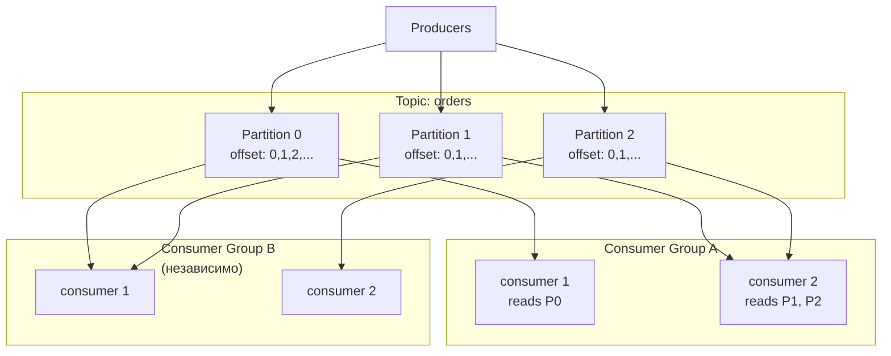
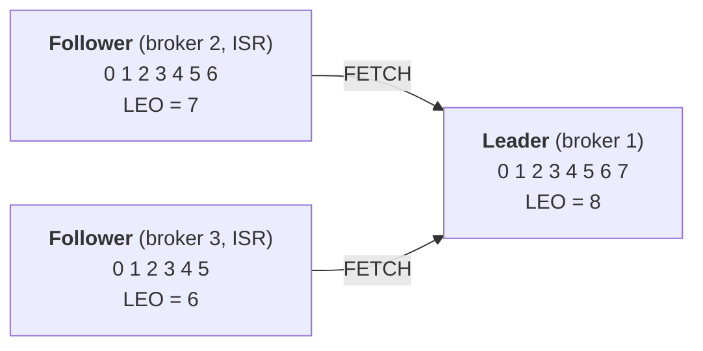
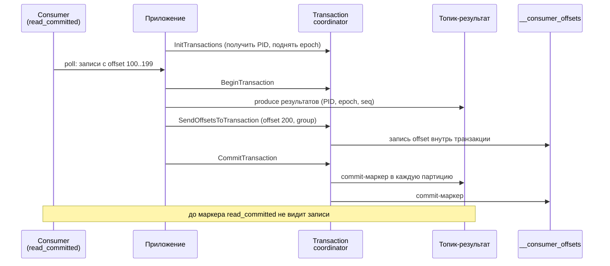
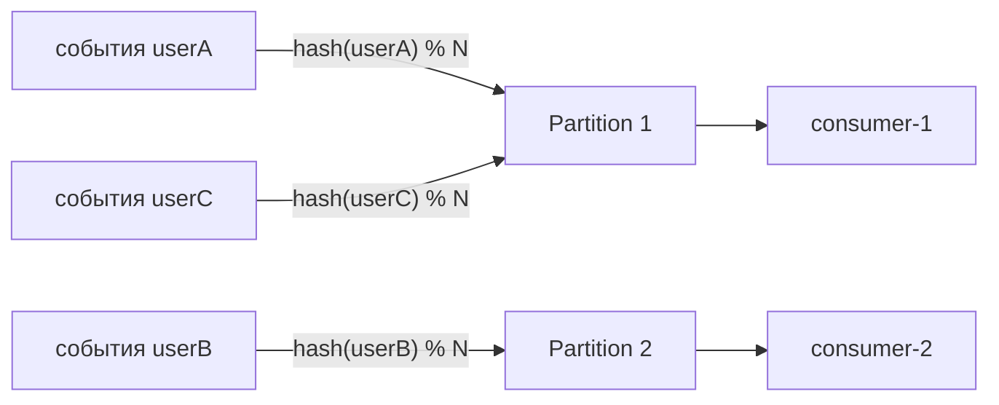

# Apache Kafka

## Содержание

- [Архитектура: основные понятия](#архитектура-основные-понятия)
- [Как хранится лог на диске: сегменты и индексы](#как-хранится-лог-на-диске-сегменты-и-индексы)
- [Координация кластера: от ZooKeeper к KRaft](#координация-кластера-от-zookeeper-к-kraft)
- [Репликация: leader, followers и high watermark](#репликация-leader-followers-и-high-watermark)
- [Delivery semantics](#delivery-semantics)
- [Producer: acks, batching, compression](#producer-acks-batching-compression)
- [Consumer: poll loop, commit offset, rebalance](#consumer-poll-loop-commit-offset-rebalance)
- [Партиционирование: ключ, порядок и consumer](#партиционирование-ключ-порядок-и-consumer)
- [Kafka в Go: выбор клиента](#kafka-в-go-выбор-клиента)
- [DLQ и retry-топики](#dlq-и-retry-топики)
- [Log compaction vs retention](#log-compaction-vs-retention)
- [Схема сообщений и её эволюция](#схема-сообщений-и-её-эволюция)
- [Когда Kafka не нужен](#когда-kafka-не-нужен)
- [Типичные ошибки](#типичные-ошибки)
- [Interview-ready answer](#interview-ready-answer)

Kafka — распределённый лог событий. Не очередь сообщений (как [RabbitMQ](./02-rabbitmq.md)), а append-only журнал с партиционированием и consumer groups. Понимание архитектуры объясняет все его trade-offs.

Все примеры кода — на franz-go, сравнение клиентов и обоснование выбора вынесено в раздел [Kafka в Go](#kafka-в-go-выбор-клиента). Параметры настройки в тексте называются по именам из документации Kafka (`acks`, `max.poll.records`), потому что они одинаковы для любого клиента.

---

## Архитектура: основные понятия



Каждая партиция реплицируется: 1 leader + N follower-реплик на разных брокерах (см. ISR ниже).

### Topic

Топик — логическая категория сообщений, ближайшая аналогия из знакомого мира — таблица в БД или именованная очередь. Но физически топик — это не единая сущность: он всегда разбит на партиции, и именно они, а не сам топик, определяют, как данные лежат на диске и как параллелятся.

### Partition

Партиция — физическая единица параллелизма: отдельный append-only лог на диске, в который сообщения только дописываются в конец. Каждому сообщению партиция присваивает уникальный offset — монотонно растущий integer, задающий его позицию в логе.

Чем больше у топика партиций, тем выше пропускная способность: запись и чтение идут по партициям параллельно.

### Offset

Offset — позиция сообщения внутри партиции. Важная деталь: до какого offset дочитано, хранит сам consumer, а брокер ничего не удаляет по факту прочтения. Отсюда фирменное свойство Kafka — replay: сдвинув offset назад, можно перечитать историю с любого места.

### Broker

Брокер — отдельный сервер Kafka. Кластер из нескольких брокеров делит партиции между собой, и это сразу про две вещи: горизонтальный масштаб (нагрузка размазана по серверам) и отказоустойчивость (реплики одной партиции живут на разных брокерах).

### ISR — In-Sync Replicas

ISR — набор реплик, которые успевают за leader и потому считаются актуальными. Если leader упадёт, новым leader выбирают одну из них — тогда подтверждённые данные не теряются. Поведением ISR управляют три ручки:

- `replication.factor` — сколько всего копий партиции (обычно 3);
- `min.insync.replicas` — сколько реплик обязаны подтвердить запись при `acks=all` (обычно 2 при факторе 3: переживает падение одного брокера, не останавливаясь);
- `unclean.leader.election.enable` — можно ли выбирать leader из отставших реплик. `false` (значение по умолчанию) — при потере всех ISR партиция недоступна, но данные целы; `true` — партиция доступна, но подтверждённые сообщения могут потеряться. Это ручка «availability vs durability».

### Consumer Group

Несколько consumers, которые читают один топик сообща:

- каждая партиция назначается ровно одному consumer в группе;
- разные группы читают независимо, каждая со своего offset;
- максимальный параллелизм группы = количество партиций.

```text
Topic: orders (3 партиции)

Consumer Group "shipping":
  consumer-1 → P0
  consumer-2 → P1
  consumer-3 → P2

Consumer Group "analytics":
  consumer-1 → P0, P1, P2 (один consumer читает все)
```

---

## Как хранится лог на диске: сегменты и индексы

Партиция — это не один огромный файл, а директория из множества файлов. Раскладка объясняет сразу три вещи: почему `.index`/`.timeindex` лежат рядом с данными, почему retention дёшев и почему Kafka такой быстрый.

### Директория партиции

Каждая реплика партиции — каталог под `log.dirs`:

```text
/var/lib/kafka/orders-0/            # топик orders, партиция 0
├── 00000000000000000000.log         # записи (батчи) — сами данные
├── 00000000000000000000.index       # разреженный индекс: offset → байт в .log
├── 00000000000000000000.timeindex   # разреженный индекс: timestamp → offset
├── 00000000000000368769.log         # следующий сегмент (base offset = 368769)
├── 00000000000000368769.index
├── 00000000000000368769.timeindex
├── 00000000000000368769.snapshot    # снапшот состояния producer'ов (дедупликация)
├── leader-epoch-checkpoint          # leader epoch → offset (корректный truncate при смене лидера)
└── partition.metadata
```

### Сегменты

Лог партиции нарезан на сегменты. Сегмент — тройка файлов с общим base offset, то есть offset первого сообщения в нём; имя файлов — этот base offset, 20 цифр с ведущими нулями. Только последний сегмент активный (в него дописывают аппендом), остальные закрыты и неизменны — читать можно из любого.

Новый сегмент начинается (rolls), когда активный:
- достиг `segment.bytes` (по умолчанию 1 ГБ), или
- живёт дольше `segment.ms` (по умолчанию 7 дней).

Это важно, потому что retention и compaction работают сегментами целиком и никогда не трогают активный.

### Три файла сегмента

| Файл | Что внутри | Зачем |
|---|---|---|
| `.log` | последовательность record-батчей | сами данные; только аппенд в конец |
| `.index` | разреженный `offset → байтовая позиция в .log` | найти сообщение по offset без скана всего .log |
| `.timeindex` | разреженный `timestamp → offset` | seek по времени, retention по времени, `offsetsForTimes` |

`.index`/`.timeindex` — разреженные (запись примерно раз в `index.interval.bytes`, по умолчанию 4 КБ) и memory-mapped. Поэтому поиск = бинарный поиск в маленьком индексе → короткий доскан в `.log`, а не чтение гигабайтов. Компромисс «немного памяти под индекс ради быстрого поиска».

### Что лежит внутри файлов

Сами файлы бинарные, но их читаемый дамп через `kafka-dump-log.sh` показывает устройство.

`.log` — записи, сгруппированные в батчи. В заголовке батча — `baseOffset`/`lastOffset` и `position` (его байтовое смещение в файле), внутри — отдельные записи с offset, ключом и payload:

```text
$ kafka-dump-log.sh --files 00000000000000000000.log --print-data-log

baseOffset: 0 lastOffset: 2 count: 3 position: 0     compresscodec: none
  | offset: 0 timestamp: 1719400000123 key: user1 payload: {"amount":100}
  | offset: 1 timestamp: 1719400000456 key: user2 payload: {"amount":50}
  | offset: 2 timestamp: 1719400000789 key: user1 payload: {"amount":75}
baseOffset: 3 lastOffset: 5 count: 3 position: 4245  compresscodec: lz4
  | offset: 3 ...
```

`.index` — пары `offset → position`, примерно по одной на каждые 4 KB `.log` (потому «разреженный»):

```text
$ kafka-dump-log.sh --files 00000000000000000000.index

offset: 37  position: 4245
offset: 75  position: 8490
offset: 112 position: 12735
```

`.timeindex` — пары `timestamp → offset` (для seek по времени и retention по времени):

```text
$ kafka-dump-log.sh --files 00000000000000000000.timeindex

timestamp: 1719400005123 offset: 37
timestamp: 1719400010456 offset: 75
```

### Как читается сообщение по offset

Скажем, consumer просит offset 50:

1. по именам сегментов (это base offset'ы) бинпоиском найти сегмент, где `base ≤ 50` — здесь `00000000000000000000`;
2. в его `.index` бинпоиском найти ближайший offset ≤ 50 — это `offset 37 → position 4245`;
3. открыть `.log` на байте 4245 и досканировать батчи вперёд до offset 50.

Разреженность индекса и есть тот самый компромисс: доскан нескольких КБ вместо чтения всего сегмента.

### Retention удаляет сегменты, compaction их переписывает

- **Retention** (`retention.ms`/`retention.bytes`) не удаляет отдельные сообщения — он `unlink`-ает **закрытые сегменты целиком**, когда самое свежее сообщение сегмента старше `retention.ms` (или чтобы уложиться в `retention.bytes`). Отсюда: retention дёшев (просто удаление файлов), сообщение может слегка пережить свой `retention.ms` (пока не устареет весь его сегмент), а активный сегмент не удаляется никогда.
- **Compaction** (`cleanup.policy=compact`) наоборот — фоновый cleaner **переписывает** сегменты, оставляя по последнему значению на ключ (детали — [Log compaction vs retention](#log-compaction-vs-retention)).

### Почему это быстро: sequential I/O, page cache, zero-copy

Скорость Kafka — не из хитрого кода, а из опоры на ОС:

- **Запись** — последовательный append в `.log` (быстро даже на HDD), сначала в **page cache** ОС. Kafka не делает `fsync` на каждое сообщение: durability обеспечивают репликация и `acks=all`, а флаш на диск делает ОС в фоне.
- **Чтение** горячих данных идёт из page cache — без обращения к диску.
- **Zero-copy (`sendfile`)**: байты `.log` уходят из page cache прямо в сетевой сокет, минуя копирование в user space приложения (подробно — [ниже](#zero-copy-почему-отдача-consumerу-почти-бесплатна)) → Kafka упирается в сетевую карту, а не в CPU.
- Вывод: Kafka любит память под page cache, а не большую JVM heap, а durability даёт репликация, а не fsync на каждое сообщение.

### Zero-copy: почему отдача consumer'у почти бесплатна

Zero-copy проще понять через то, от чего он избавляет. Обычно, когда сервер отдаёт данные с диска в сокет, те же байты копируются четырежды и дважды пересекают границу kernel/user space:

```text
диск ──DMA──▶ page cache (kernel)
                  │  CPU-копия ▼
              буфер приложения (user space)   ← сюда читает read()
                  │  CPU-копия ▼
              буфер сокета (kernel)           ← сюда пишет write()
                  │  DMA ▼
                 NIC (сеть)
```

Копии 2 и 3 (в user space и обратно) — чистая трата, если приложение просто перекладывает байты с диска в сеть, не глядя в них: две лишние CPU-копии, переключения контекста, давление на память (в JVM — ещё и на heap/GC).

`sendfile` схлопывает это: приложение одним syscall'ом говорит ядру «отправь байты из этого файла прямо в этот сокет», и ядро гонит их из page cache сразу в NIC, не поднимая их в user space:

```text
диск ──DMA──▶ page cache (kernel) ──▶ NIC
              (приложение байты даже не трогает)
```

Kafka под это заточен: при fetch брокеру нужно лишь отгрузить сырые байты `.log` (горячие в page cache) в сокет consumer'а. И, что здесь ключевое, на диске сообщения лежат ровно в том формате, в каком уходят по сети, включая сжатие. Парсить, разжимать, преобразовывать не нужно → `sendfile` ложится идеально, без участия JVM heap. Отсюда способность одного брокера «упереться в сетевую карту». (RabbitMQ так не умеет: он работает с каждым сообщением по отдельности, и формат хранения ≠ формат провода → байты идут через user space.)

Zero-copy отключается, как только байты надо изменить в user space:
- **TLS** — шифровать приходится в приложении;
- **конверсия формата** — старый consumer просит более старую версию record-формата → брокер переупаковывает.

В этих случаях Kafka откатывается на обычный путь с копиями.

---

## Координация кластера: от ZooKeeper к KRaft

Кластеру нужен координатор: кто leader каждой партиции, какие брокеры живы, метаданные топиков. Исторически это делал внешний ZooKeeper — отдельный кворумный кластер, вторая распределённая система рядом с первой (своя эксплуатация, свои сбои).

**KRaft** (Kafka Raft, production-ready с 3.3) убирает ZooKeeper: метаданные хранятся в самом Kafka как внутренний Raft-лог, часть узлов выполняет роль controller-кворума. С Kafka 4.0 ZooKeeper удалён полностью. Практические следствия: один кластер вместо двух, быстрее failover контроллера, проще эксплуатация. На собеседовании «ZooKeeper или KRaft?» — вопрос на актуальность знаний: новые кластеры — только KRaft.

### Как работает KRaft: controller-кворум и метаданные

**Роли узлов.** У каждого узла есть `process.roles`: `broker` (хранит данные партиций, обслуживает клиентов), `controller` (участник кворума метаданных) или `broker,controller` (совмещённый режим — удобно для маленьких/dev-кластеров, в больших prod роли разносят). Контроллеров обычно **3 или 5** — нечётное число для Raft-кворума большинства (3 переживает отказ 1, 5 — отказ 2).

**Метаданные как Raft-лог.** Вся метаинформация кластера (топики, конфиги, кто leader каждой партиции, ISR, живость брокеров) хранится в специальном логе `__cluster_metadata` (одна партиция), который контроллеры реплицируют между собой по Raft. Запись метаданных «закоммичена», когда её подтвердило большинство кворума.

**Два уровня «лидерства» — их часто путают:**

- **Active controller** — Raft-лидер кворума контроллеров, выбранный голосованием среди них. Только он пишет в метадата-лог; остальные контроллеры — standby, реплицируют лог и готовы стать active.
- **Partition leader** — брокер, назначенный active controller-ом для конкретной партиции (см. [Репликация](#репликация-leader-followers-и-high-watermark)). Это разные вещи: контроллер рулит метаданными, partition leader — данными своей партиции.

Схематично связи в кластере:

```text
        Controller quorum (Raft)
   ┌──────────────┬──────────────┐
   │ Active       │  Standby     │  Standby
   │ controller   │  controller  │  controller
   │ (Raft-лидер) │              │
   └──────────────┴──────────────┘
   пишет метадата-лог → реплика   → реплика
        │  (__cluster_metadata по Raft)
        │
        │  назначает partition leaders,
        ▼  рассылает метаданные
   ┌───────────┐   ┌───────────┐
   │ Broker 1  │   │ Broker 2  │   ← observers метадата-лога
   └───────────┘   └───────────┘
        ▲                ▲
        └── heartbeat, AlterPartition (ISR) ──┘  → к active controller
```

**Как назначаются partition leader/follower.** Брокеры регистрируются у контроллера и шлют ему **heartbeat**. Если брокер-leader перестал отвечать (истёк `broker.session.timeout.ms`), active controller помечает его мёртвым и **выбирает новый leader для его партиций из ISR**, записывая решение в метадата-лог. Изменения ISR (shrink/expand) инициирует сам broker-leader запросом `AlterPartition` к контроллеру, а тот валидирует и коммитит их в лог. То есть все решения о лидерах партиций и составе ISR — это записи в одном Raft-логе.

**Как брокеры узнают об изменениях.** Брокеры — **observers** метадата-лога: они реплицируют его (read-only, без права голоса) и применяют изменения в свою in-memory картину. Это «push» через репликацию лога, а не «watch» как в ZooKeeper, — быстрее и без отдельной системы. И failover контроллера почти мгновенный: standby уже держит весь лог, ему не нужно перечитывать состояние из ZK.

**Где это крутится / конфиг.** Контроллеры слушают отдельный listener (обычно порт 9093), состав кворума задаётся статически:

```properties
process.roles=broker,controller
node.id=1
controller.quorum.voters=1@host1:9093,2@host2:9093,3@host3:9093
controller.listener.names=CONTROLLER
```

Кластер инициализируют `kafka-storage.sh format` с общим cluster UUID.

### В облаке: managed Kafka vs Kafka-совместимые сервисы

В облаке координация (ZooKeeper или KRaft) остаётся заботой провайдера. Важно различать два класса предложений, потому что «где живёт координация» у них разное:

1. **Настоящий Apache Kafka под управлением провайдера** — Confluent Cloud, AWS MSK, **Google Cloud Managed Service for Apache Kafka** (GA 2024). Внутри — тот самый Kafka (современные версии на KRaft, раньше на ZooKeeper), но кворум контроллеров держит и обновляет провайдер. Наружу видны только bootstrap-эндпоинты, топики и партиции; клиенты и семантика полностью кафковские.

2. **Kafka-совместимые по протоколу, но с другим движком** — говорят на wire-протоколе Kafka (те же клиенты franz-go/sarama), но внутри своя координация, без ZK/KRaft:
   - **Google Pub/Sub** — вообще **не Kafka**: собственная глобально-распределённая модель (нет партиций/offset в кафковском смысле, координация на инфраструктуре Google). Именно его обычно «принимают за кафку у гугла». Настоящий managed Kafka у GCP — это отдельный сервис из п.1;
   - **Azure Event Hubs** — Kafka-эндпоинт поверх собственного движка Microsoft;
   - **Redpanda** — брокер, переписанный на C++, где Raft встроен в каждую партицию: нет ни ZooKeeper, ни KRaft как отдельной сущности;
   - **WarpStream** — Kafka-совместимый поверх объектного хранилища (S3): брокеры stateless, метаданные и координация — в отдельном control-plane.

Главное отличие двух классов: совместимость по протоколу ≠ тот же движок внутри. Managed Kafka — это спрятанный провайдером KRaft; Kafka-совместимые сервисы заменяют координацию своей, часто вокруг объектного хранилища.

---

## Репликация: leader, followers и high watermark

Партиция существует в `replication.factor` копиях на разных брокерах. Одна копия — leader, остальные — followers. Это и есть механизм durability и failover: разберём, как копии остаются согласованными.

### Кто с кем говорит

По умолчанию через leader идёт весь трафик — и запись, и чтение. Followers существуют не для масштабирования чтения (это частое заблуждение), а для отказоустойчивости. Сам follower — это по сути consumer лидера: он постоянно делает `FETCH` у leader и дописывает полученные записи в собственную копию лога (те же offset'ы, те же сегменты на диске).

> Чтение с followers всё же есть — «follower fetching» (KIP-392, с 2.4): consumer может читать с ближайшей реплики в своей AZ, чтобы не платить за меж-зональный трафик. Данные те же — просто копия ближе.

### LEO и High Watermark — что видит consumer

Две ключевые позиции в логе каждой реплики:

- **LEO (Log End Offset)** — offset следующей записи, которую реплика запишет (то есть «докуда дописано»).
- **High Watermark (HW)** — offset, до которого запись доехала до **всех** реплик из ISR. Технически leader считает HW как минимум из LEO по всем ISR.

Важнейшее правило: consumer видит записи только до HW. Всё, что уже на leader, но ещё не подтверждено всеми ISR (offset ≥ HW), консьюмеру невидимо. Это и даёт гарантию: consumer никогда не прочитает сообщение, которое может пропасть при падении leader.



Здесь `HW = min(LEO по ISR) = 6`: consumer видит offset'ы 0–5, а 6 и 7 «висят» на leader, пока их не подтянут все ISR. Запись, доехавшая до всех ISR, называется committed — только committed-сообщения переживают падение leader.

### Динамика ISR: shrink и expand

Реплика считается in-sync, пока успевает вычитывать leader в пределах `replica.lag.time.max.ms` (по умолчанию 30 секунд). Если follower отстал (медленный диск/сеть или упал) — leader выкидывает его из ISR (shrink); догнал — возвращает обратно (expand).

Связка с записью: `acks=all` ждёт подтверждения от всех реплик, состоящих в ISR, но сам ISR не должен быть меньше `min.insync.replicas`. Если ISR схлопнулся ниже `min.insync.replicas`, producer с `acks=all` получает ошибку `NotEnoughReplicas` и запись отклоняется, чтобы не потерять durability (лучше отказать, чем принять сообщение, которое некому продублировать). Это прямое следствие ручек из [ISR](#isr--in-sync-replicas).

### Выбор нового leader

Когда брокер-leader падает, controller (KRaft, см. выше) выбирает нового leader из ISR. Любая ISR-реплика имеет все committed-записи (до HW), поэтому переключение — без потери подтверждённых данных. Если же ISR опустел (упали все синхронные реплики), поведение решает `unclean.leader.election.enable`: `false` (значение по умолчанию) — партиция недоступна, но данные целы; `true` — лидером станет отставшая реплика, партиция доступна, но подтверждённые сообщения могут пропасть (см. [ISR](#isr--in-sync-replicas)).

### Что с «хвостом» выше HW при падении leader

Если followers отстают, а leader упал, теряются ли сообщения? Зависит от того, доехала ли запись до HW. В примере выше leader держал `LEO=8`, а `HW=6` — offset'ы 6 и 7 были только на нём:

- **Записи до HW (committed, 0–5)** — есть у каждой ISR-реплики, новый leader их содержит → не теряются никогда.
- **Записи выше HW (6, 7)** — followers до них не дотянулись, у нового leader их нет → они отбрасываются, лог обрежется. Потеря это или нет — зависит от `acks` продюсера:
  - `acks=all` — продюсер не получал ack на 6 и 7 (ack приходит только после HW) → он их повторит → реальной потери нет, только повторная отправка;
  - `acks=1` — leader подтвердил 6 и 7 сразу, до репликации; продюсер считает их успешными, а новый leader их не видит → это тихая потеря. Это классический data-loss `acks=1` при падении leader.

Отставание followers лишь увеличивает этот «хвост» (HW ниже → больше неподтверждённого сверху), но при `acks=all` он всё равно не теряется, а переотправляется. Когда старый leader вернётся, он станет follower и обрежет свой хвост (6, 7) под нового leader по механизму leader epoch — чтобы логи не разошлись (защита от split-brain).

### Размещение реплик по AZ

`broker.rack` + rack-aware назначение раскидывают реплики одной партиции по разным стойкам/зонам доступности, чтобы падение одной AZ не унесло сразу все копии. Для `replication.factor=3` типично «по одной реплике в трёх AZ».

---

## Delivery semantics

Гарантии доставки — это компромисс между «не потерять» и «не задвоить», и складывается он из настроек обеих сторон: как коммитит producer и в какой момент коммитит offset consumer.

### At-most-once — «не более одного раза»

Каждое сообщение доставляется максимум один раз: дубликатов не бывает, но при сбое сообщение может потеряться.

```text
Producer → fire-and-forget (acks=0)
Consumer → коммитит offset ДО обработки
```

Если consumer упал после коммита, но до обработки, сообщение теряется. Это осознанный выбор для метрик и логов, где потерять одну запись дешевле, чем разбираться с дубликатом.

### At-least-once — «не менее одного раза»

Каждое сообщение доставляется хотя бы один раз: ничего не теряется, но при сбое возможны повторы (дубликаты). Дефолтная и самая частая на практике гарантия.

```text
Producer → acks=all + retries → повторная отправка при ошибке
Consumer → коммитит offset ПОСЛЕ обработки
```

Если consumer упал после обработки, но до коммита — сообщение обработается дважды. Поэтому at-least-once требует идемпотентности consumer-а ([06-idempotency.md](../05-system-design/reliability-patterns/06-idempotency.md)).

Важно: со стороны producer-а at-least-once даёт именно `acks=all`. При `acks=1` подтверждение приходит от leader раньше репликации — если leader упадёт сразу после ack, сообщение потеряно, то есть это уже не «не менее одного раза».

### Exactly-once — «ровно один раз»

Каждое сообщение обрабатывается строго один раз: ни потерь, ни дубликатов. Самая сильная и самая дорогая гарантия, и главная сложность здесь не в настройках, а в том, что дубликаты появляются из двух независимых источников. Kafka закрывает их двумя разными механизмами, и путать их нельзя.

#### Откуда берутся дубликаты

Источник первый — повторная отправка producer-ом. Брокер записал батч, но ответ не дошёл до producer-а (потеря пакета, таймаут, разрыв соединения). Producer не знает, записалось ли, и по `retries` отправляет тот же батч заново:

```text
producer                       leader партиции
   | --- батч (order-42) ----------> | записан на offset 100
   | <-- ack ... потерян в сети ---  |
   | --- тот же батч заново -------> | записан ещё раз на offset 101
```

В логе появляются две копии одного события. Ни `acks=all`, ни репликация от этого не спасают: с точки зрения брокера пришли два обычных запроса.

Источник второй — повторная обработка consumer-ом. Consumer обработал сообщение, но упал до коммита offset; после rebalance тот же offset выдаётся заново. Эффект обработки (запись в базу, отправка письма, новое сообщение в выходной топик) выполняется дважды.

Дальше два механизма: идемпотентный producer убирает первый источник, транзакции — второй, но только когда эффект обработки остаётся внутри Kafka.

#### Идемпотентный producer: PID, epoch, sequence number

При `enable.idempotence=true` (с Kafka 3.0 это значение по умолчанию) producer при старте запрашивает у брокера идентификатор `producer id` (PID) и номер поколения `epoch`. Дальше каждое сообщение получает `sequence number` — счётчик, монотонный внутри пары (PID, партиция), начиная с нуля. Лидер партиции держит в памяти последние принятые номера по каждой такой паре и сравнивает их с пришедшими.

Логика лидера на конкретных числах — пусть по паре (`PID=1001`, `orders-3`) последним записан номер 7:

```text
приходит seq = 8   → 8 == 7 + 1        → записать, запомнить last = 8
ack теряется, producer повторяет seq = 8
приходит seq = 8   → 8 <= last (8)     → DUPLICATE_SEQUENCE_NUMBER:
                                         ответить «ок», в лог ничего не писать
приходит seq = 10  → ожидался 9        → OUT_OF_ORDER_SEQUENCE_NUMBER:
                                         producer перепошлёт, начиная с 9
```

Отсюда сразу видны границы механизма:

- дедупликация работает по паре (PID, партиция), поэтому она защищает только от ретраев одного и того же producer-а;
- нетранзакционный producer получает новый PID при каждом старте приложения, а значит после рестарта повторно отправленное событие — это уже другой PID, и брокер запишет его как новое. Идемпотентность живёт внутри одной сессии producer-а, а не «навсегда»;
- состояние PID на брокере не хранится вечно: оно чистится по `producer.id.expiration.ms` (по умолчанию сутки), у транзакционных — по `transactional.id.expiration.ms`;
- механизм требует `acks=all`, `retries > 0` и `max.in.flight.requests.per.connection ≤ 5`. Зато при этих условиях порядок в партиции сохраняется даже при ретраях с несколькими запросами в полёте — брокер отклоняет батчи, пришедшие не по порядку;
- `epoch` нужен для отсечения «зомби»: producer с тем же `transactional.id`, но меньшим поколением, получает `PRODUCER_FENCED` и не может дописать в лог.

```go
// franz-go включает идемпотентность по умолчанию: снимает её DisableIdempotentWrite(),
// а acks ниже AllISRAcks() с ней несовместим
client, err := kgo.NewClient(
    kgo.SeedBrokers("localhost:9092"),
    kgo.RequiredAcks(kgo.AllISRAcks()), // acks=all — обязательное условие идемпотентности
)
```

Ограничение на число запросов в полёте при включённой идемпотентности задаёт сам протокол (не больше 5 с Kafka 1.0), поэтому вручную его не выставляют: опция `MaxProduceRequestsInflightPerBroker` в franz-go влияет только на случай, когда идемпотентность отключена.

#### Транзакции: атомарные «прочитал → обработал → записал»

Идемпотентный producer убирает дубликаты в логе, но не связывает запись результата со сдвигом offset входного топика. Именно эту связь дают транзакции — они нужны для схемы consume-process-produce: прочитать из топика, обработать, записать в другой топик (или несколько) и сдвинуть offset так, чтобы всё это случилось целиком или не случилось вовсе.

Ключевые сущности:

- `transactional.id` — стабильное имя транзакционного producer-а, которое задаёт приложение. По нему координатор узнаёт producer после рестарта, поднимает `epoch` и фенсит предыдущее воплощение. Случайный идентификатор при каждом старте ломает весь механизм: фенсить будет некого;
- transaction coordinator — брокер, отвечающий за партицию внутреннего топика `__transaction_state`, которая выбирается по хешу `transactional.id`. Он хранит состояние транзакции и список задействованных партиций;
- control records — служебные записи commit- или abort-маркеров, которые координатор пишет в каждую затронутую партицию. Приложению они не видны, но занимают offset: отсюда «дырки» в нумерации, из-за которых нельзя считать, что `offset + 1` — это следующее сообщение;
- `isolation.level` на стороне consumer-а: `read_uncommitted` (по умолчанию) видит и записи незавершённых, и записи прерванных транзакций; `read_committed` показывает только зафиксированные.

Порядок вызовов и роль каждого шага:



Главное в этой схеме — offset коммитит не consumer, а транзакция через `SendOffsetsToTransaction`. Поэтому «результат записан» и «вход прочитан» становятся одним атомарным фактом: при `AbortTransaction` или падении приложения посреди работы обе части откатываются, и следующая попытка начнётся с того же offset 100. Автокоммит consumer-а при этом обязательно выключается (`enable.auto.commit=false`), иначе offset уедет отдельно от транзакции и гарантия исчезнет.

Со стороны читателя результата важен `read_committed`: такой consumer читает не до high watermark, а до `last stable offset` (LSO) — минимального offset незавершённой транзакции. Отсюда практическое следствие: открытая транзакция придерживает хвост партиции для всех `read_committed`-читателей, а зависшая транзакция держит LSO до `transaction.timeout.ms` (по умолчанию 60 секунд, потолок задаётся брокерным `transaction.max.timeout.ms`). Симптом на графиках выглядит странно: кластер здоров, producer пишет, а consumer lag растёт — смотреть нужно на LSO и открытые транзакции.

#### Пример на franz-go

В franz-go транзакционный цикл обёрнут в `GroupTransactSession`, которая сама делает `SendOffsetsToTransaction` при завершении:

```go
sess, err := kgo.NewGroupTransactSession(
    kgo.SeedBrokers("localhost:9092"),
    kgo.TransactionalID("payments-enricher-0"), // стабильный, привязан к инстансу
    kgo.ConsumerGroup("payments-enricher"),
    kgo.ConsumeTopics("payments"),
    kgo.FetchIsolationLevel(kgo.ReadCommitted()), // не читать незакоммиченное
    kgo.RequireStableFetchOffsets(),              // не стартовать поверх открытой транзакции
)
if err != nil {
    log.Fatal(err)
}
defer sess.Close()

for {
    fetches := sess.PollFetches(ctx)
    if errs := fetches.Errors(); len(errs) > 0 {
        log.Printf("fetch errors: %v", errs)
        continue
    }
    if err := sess.Begin(); err != nil {
        log.Fatalf("begin: %v", err) // фатально: producer зафенсен или координатор недоступен
    }

    fetches.EachRecord(func(r *kgo.Record) {
        sess.ProduceSync(ctx, &kgo.Record{
            Topic: "payments-enriched",
            Key:   r.Key, // тот же ключ — тот же порядок по сущности
            Value: enrich(r.Value),
        })
    })

    // End сам отправляет offset-ы в транзакцию и коммитит либо прерывает её
    committed, err := sess.End(ctx, kgo.TryCommit)
    if err != nil || !committed {
        log.Printf("transaction aborted: committed=%v err=%v", committed, err)
    }
}
```

Транзакция закрывается один раз на всю пачку из `PollFetches`, а не на сообщение: накладные расходы платятся за транзакцию, поэтому размер пачки прямо определяет их долю.

#### Что каждый механизм закрывает, а что нет

| Механизм | От чего защищает | От чего не защищает |
| --- | --- | --- |
| `enable.idempotence=true` | дубликаты от ретраев producer-а внутри его сессии | повторная отправка после рестарта приложения (новый PID), повторная обработка consumer-ом |
| транзакции + `SendOffsetsToTransaction` | рассинхрон «результат записан, offset не сдвинут» и обратный | эффекты вне Kafka: HTTP-вызовы, запись в другую базу, письма |
| `isolation.level=read_committed` | чтение записей прерванных и незавершённых транзакций | собственные неидемпотентные эффекты читателя |
| идемпотентный consumer (ключ + дедупликация) | повторный эффект при любой повторной доставке | ничего не требует от брокера и работает всегда |

Отсюда правило выбора: транзакции имеют смысл, когда конвейер начинается и заканчивается в Kafka — обогащение, агрегация, дедупликация, пересборка потоков. Как только результат уходит во внешнюю систему, транзакция брокера его не откатит, и нужна идемпотентность приёмника: ключ идемпотентности и дедупликация в базе ([идемпотентность](../05-system-design/reliability-patterns/06-idempotency.md)) либо связка outbox/inbox ([outbox и идемпотентность](../06-databases/database-systems-catalog/postgresql/14-outbox-and-idempotency.md)).

#### Цена и типичные грабли

Плата за транзакции складывается из дополнительных обращений к координатору (`InitProducerId`, `AddPartitionsToTxn`, `AddOffsetsToTxn`, `EndTxn`), записей в `__transaction_state` с их собственной репликацией и control-маркеров в каждой партиции. Все эти расходы приходятся на транзакцию целиком, поэтому итог зависит от её размера: тысяча сообщений в транзакции размазывает их почти незаметно, одна транзакция на сообщение делает их доминирующими. Отдельно растёт end-to-end latency: `read_committed`-читатель видит результат только после коммита, то есть задержка не меньше длительности транзакции. Конкретные проценты нужно мерить на своём профиле нагрузки, а не брать из статей.

| Грабли | Что происходит | Как правильно |
| --- | --- | --- |
| `transactional.id` генерируется случайно при старте | фенсить зомби нечем: старый экземпляр может дописать в лог после того, как поднялся новый | стабильный идентификатор, привязанный к инстансу или к назначенным партициям (в Kafka Streams эту роль играет task id) |
| один `transactional.id` на несколько инстансов | инстансы по кругу фенсят друг друга, обработка стоит | свой идентификатор на инстанс, при статическом делении — по номеру |
| включён автокоммит offset | offset двигается вне транзакции, атомарность теряется | `enable.auto.commit=false`, offset только через `SendOffsetsToTransaction` |
| зависшая транзакция | LSO не двигается, `read_committed`-консюмеры стоят, lag растёт при здоровом кластере | контролировать `transaction.timeout.ms`, мониторить LSO и открытые транзакции |
| ожидание, что идемпотентность переживёт рестарт | после перезапуска PID новый, повторно отправленное событие запишется как новое | дедупликация по бизнес-ключу на приёмнике |
| «включили exactly-once, значит дубликатов нет» | consumer с внешним эффектом всё равно может выполнить его дважды | идемпотентность приёмника остаётся обязательной |

В Kafka Streams та же механика включается одной настройкой `processing.guarantee=exactly_once_v2` (версия `v2` доступна с 2.5 и заменила устаревший `exactly_once`): библиотека сама держит стабильные идентификаторы по task id и коммитит offset внутрь транзакции. Для обычного сервиса на Go всё перечисленное приходится делать руками, и это ещё одна причина, почему на практике по умолчанию выбирают at-least-once с идемпотентным consumer-ом.

---

## Producer: acks, batching, compression

### `acks` — уровень подтверждения

| `acks` | Поведение | Когда |
|---|---|---|
| `0` | не ждать подтверждения | логи, метрики — потеря допустима |
| `1` | подтверждение от leader, раньше репликации | компромисс; возможна потеря при падении leader |
| `all` / `-1` | подтверждение от всех реплик, состоящих в ISR | критические данные |

Здесь легко попасть в ловушку формулировки: `acks=all` ждёт все реплики текущего ISR, а не `min.insync.replicas` штук. Роль `min.insync.replicas` другая — это порог, ниже которого запись вообще не принимается:

```text
replication.factor=3, min.insync.replicas=2

ISR = 3 реплики → acks=all ждёт все три
одна реплика отстала, ISR = 2 → acks=all ждёт две, запись идёт
вторая отстала, ISR = 1 → 1 < 2 → NotEnoughReplicas, запись отклонена
```

```go
client, err := kgo.NewClient(
    kgo.SeedBrokers("localhost:9092"),
    kgo.RequiredAcks(kgo.AllISRAcks()),       // acks=all
    kgo.RecordDeliveryTimeout(2*time.Minute), // бюджет времени вместо счётчика попыток
)
```

Про повторные попытки отдельно: фиксированное `retries=3` — устаревший совет. Ограничивать нужно не количество попыток, а общий бюджет времени на доставку записи. Три быстрые попытки при сетевой просадке исчерпаются за миллисекунды и вернут ошибку, хотя запись спокойно прошла бы через секунду.

Значения по умолчанию у клиентов разные, и это стоит проверять: в Java-клиенте `retries` уже максимальный, а бюджет ограничен `delivery.timeout.ms` (2 минуты); в franz-go по умолчанию не ограничено ни то, ни другое — запись будет повторяться, пока её принимают в буфер, поэтому явный `RecordDeliveryTimeout` здесь как раз и добавляет предсказуемости.

```bash
# min.insync.replicas — конфигурация топика или брокера, не клиента
kafka-configs.sh --alter --topic orders \
  --add-config min.insync.replicas=2
```

Связка `acks=all` + `min.insync.replicas=2` + `replication.factor=3` означает: запись подтверждена минимум двумя репликами, кластер переживает падение одного брокера без потери данных и без остановки записи.

### Batching и linger

Батчинг — фундамент пропускной способности Kafka, а не просто ручка тюнинга. Producer не шлёт сообщения по одному: он копит их в буфере по (topic, partition) и отправляет пачкой одним запросом.

```text
Producer → [batch buffer по партициям] → flush при: batch.size ИЛИ linger.ms → Broker
```

- `batch.size` — максимальный размер батча в байтах на партицию (по умолчанию 16 КБ);
- `linger.ms` — сколько ждать, набивая батч, прежде чем отправить (по умолчанию 0 — отправлять сразу, как только есть хоть что-то).

Почему пачка радикально дешевле, чем те же сообщения по одному, — стоимость амортизируется на весь батч:

- один сетевой round-trip и один ack вместо N;
- одна запись в WAL брокера на батч, а не N;
- сжатие эффективнее (общий словарь на батч — см. [Compression](#compression) ниже);
- батч хранится и отдаётся consumer'у как единое целое через zero-copy (см. [как хранится лог](#как-хранится-лог-на-диске-сегменты-и-индексы)).

Отсюда trade-off: `linger.ms = 0` — минимальная latency, но мелкие батчи; поднять до 5–20 мс — батчи крупнее, throughput кратно выше ценой этих миллисекунд задержки. Это та самая «плата задержкой за пропускную способность», из-за которой Kafka не берут, когда критична latency < 10 мс.

Батчинг на стороне consumer-а симметричен: consumer тоже забирает данные пачками, а брокер может придержать ответ на fetch, пока не накопит достаточно:

- `fetch.min.bytes` — брокер ждёт, пока наберётся столько байт, прежде чем ответить на fetch (по умолчанию 1 — отвечать сразу);
- `fetch.max.wait.ms` — но не дольше этого таймаута (по умолчанию 500 мс).

Поднятый `fetch.min.bytes` разгружает брокер и сеть при высоком трафике — тот же компромисс между пропускной способностью и задержкой, что и `linger.ms`, только на стороне чтения.

> Смежное: `max.in.flight.requests.per.connection` — сколько неподтверждённых батчей producer держит «в полёте». Больше единицы → выше throughput, но при ретраях батчи могут переупорядочиться; с `enable.idempotence=true` порядок сохраняется даже при in-flight > 1.

### Compression

Сжатие работает на уровне батча, а не отдельного сообщения: producer сжимает набитый батч целиком, брокер хранит и передаёт его в том же виде, распаковывает уже consumer. Общий словарь на весь батч — причина, по которой сжатие однотипного JSON даёт кратный выигрыш.

```go
// список — это приоритет: если брокер не поддерживает zstd, клиент возьмёт lz4
// (по умолчанию franz-go предпочитает snappy, затем отсутствие сжатия)
kgo.ProducerBatchCompression(kgo.ZstdCompression(), kgo.Lz4Compression())
```

- `lz4` — быстрый, умеренное сжатие; хороший выбор по умолчанию для внутрикластерного трафика;
- `zstd` — заметно лучшее сжатие при сопоставимой скорости (доступен с Kafka 2.1); разумный выбор и для обычных топиков, и обязательный для трафика между дата-центрами, где платят за байты;
- `snappy` — исторически частый выбор, по совокупности характеристик проигрывает lz4 и zstd;
- `gzip` — сильное сжатие, дорогой по CPU; сегодня остаётся ради совместимости.

Отдельная деталь, которую стоит знать про эксплуатацию: `compression.type` задаётся не только у producer-а, но и на топике. Значение `producer` (по умолчанию) означает «хранить как прислали» — брокер просто пишет батч на диск. Если же на топике указан конкретный кодек, отличный от кодека producer-а, брокер распакует и перепакует батч. Это ломает сразу два свойства из раздела про хранение: тратится CPU брокера на каждый батч и теряется zero-copy при отдаче, потому что байты на диске больше не совпадают с тем, что придёт клиенту.

---

## Consumer: poll loop, commit offset, rebalance

### Poll loop

Kafka consumer работает по модели pull: он сам опрашивает брокер, а не получает push-поток. Обработка батча и отметка обработанных записей идут внутри одного цикла:

```go
client, err := kgo.NewClient(
    kgo.SeedBrokers("localhost:9092"),
    kgo.ConsumerGroup("orders-service"),
    kgo.ConsumeTopics("orders"),
    kgo.ConsumeResetOffset(kgo.NewOffset().AtStart()), // поведение, когда закоммиченного offset нет
    kgo.InstanceID("orders-service-0"),                // static membership, см. ниже
    kgo.AutoCommitMarks(),                             // коммитятся только отмеченные записи
)
if err != nil {
    log.Fatal(err)
}
defer client.Close()

for {
    fetches := client.PollRecords(ctx, 500) // не больше 500 записей за проход
    if errs := fetches.Errors(); len(errs) > 0 {
        log.Printf("fetch errors: %v", errs)
        continue
    }
    fetches.EachRecord(func(r *kgo.Record) {
        if err := processOrder(r.Value); err != nil {
            return // не отмечать: запись придёт снова
        }
        client.MarkCommitRecords(r) // отметить ПОСЛЕ успешной обработки
    })
}
```

`PollRecords(ctx, 500)` ограничивает размер порции — прямой аналог `max.poll.records` в Java-клиенте. Ограничение важно не для памяти, а для таймингов: чем меньше записей за проход, тем быстрее цикл возвращается к следующему опросу и тем меньше риск не успеть с ним до `max.poll.interval.ms`.

### Где хранятся offset-ы и что такое auto.offset.reset

Позиции групп лежат не у клиента, а во внутреннем компактируемом топике `__consumer_offsets`: ключ — тройка (группа, топик, партиция), значение — последний закоммиченный offset. Отсюда два практических следствия.

Первое: `auto.offset.reset` (`ConsumeResetOffset` в franz-go) срабатывает только когда закоммиченного offset нет вообще — у новой группы либо когда сохранённая позиция уже вне диапазона лога:

| Значение | Поведение при отсутствии offset | Риск |
| --- | --- | --- |
| `earliest` | читать с начала доступного лога | новая группа перечитывает всю историю и заливает нижестоящие системы |
| `latest` | читать только новые записи | всё, что пришло до старта группы, пропущено молча |
| `none` | вернуть ошибку | нужно обработать явно, зато нет тихого сюрприза |

Второе: сохранённая позиция группы не живёт вечно. Если группа не коммитит дольше `offsets.retention.minutes` (по умолчанию 7 дней), её offset-ы удаляются как устаревшие. Сервис, выключенный на две недели, при старте окажется в ситуации «offset нет» и по `earliest` перечитает топик с начала — авария выглядит как внезапный шторм повторной обработки на пустом месте.

### Auto vs manual commit

Автокоммит коммитит не «то, что обработано», а то, что уже вернул предыдущий опрос, и делает это по таймеру:

- обработка завершилась, а таймер до неё не дошёл — при рестарте записи придут снова, то есть at-least-once;
- таймер сработал раньше конца обработки — при падении записи считаются пройденными и теряются, то есть фактически at-most-once.

Поэтому в сервисах, где потеря недопустима, автокоммит по таймеру заменяют на отметку обработанных записей:

```go
kgo.AutoCommitMarks()             // фоновый коммит, но только отмеченных записей
client.MarkCommitRecords(r)       // отметить после успешной обработки
client.CommitMarkedOffsets(ctx)   // синхронный коммит отмеченного, например перед выходом
```

Разница с обычным автокоммитом принципиальная: коммитится не позиция последнего выданного батча, а позиция того, что приложение подтвердило само.

### Backpressure: pause и resume

Когда обработка не успевает, увеличивать `max.poll.interval.ms` — лечение симптома. Штатный инструмент — приостановить выборку по конкретным партициям, дав очереди внутри приложения разгрузиться:

```go
if queueLen() > highWatermark {
    client.PauseFetchPartitions(map[string][]int32{"orders": {0, 1}})
}
if queueLen() < lowWatermark {
    client.ResumeFetchPartitions(map[string][]int32{"orders": {0, 1}})
}
```

Пауза не выводит consumer из группы: heartbeat продолжает идти, партиции остаются назначенными, rebalance не запускается. Общая логика приёма — в [backpressure и shedding](../05-system-design/reliability-patterns/05-backpressure-and-shedding.md).

### Rebalance

Когда consumer входит в группу или покидает её (деплой, масштабирование, падение), Kafka перераспределяет партиции между участниками.

Два протокола:

- eager (классический, assignor `range` или `round-robin`): на время rebalance все consumers группы отзывают все партиции и останавливают обработку — пауза затрагивает всю группу;
- cooperative (инкрементальный, `cooperative-sticky`, KIP-429): переезжают только те партиции, которым действительно нужно сменить владельца, остальные consumers продолжают работу. Современный выбор; franz-go использует cooperative-sticky по умолчанию.

Классическая проблема: если обработка батча затягивается, consumer вовремя не возвращается к опросу, брокер считает его мёртвым и запускает ненужный rebalance живой группы. Три таймаута, которые за это отвечают:

| Параметр | По умолчанию | За что отвечает |
| --- | --- | --- |
| `max.poll.interval.ms` | 5 минут | сколько приложению позволено обрабатывать батч между опросами |
| `session.timeout.ms` | 45 секунд | сколько брокер ждёт heartbeat, прежде чем счесть участника мёртвым |
| `heartbeat.interval.ms` | 3 секунды | частота heartbeat, идущего в отдельном потоке |

### Static membership: деплой без rebalance

По умолчанию участник группы получает идентификатор при каждом подключении, поэтому рестарт пода выглядит для координатора как «один ушёл, другой пришёл» — и вызывает два rebalance подряд. Static membership (`group.instance.id`, KIP-345; `kgo.InstanceID` в примере выше) даёт участнику стабильное имя: после рестарта он возвращается с тем же именем и получает те же партиции, а rebalance не запускается вовсе, если он успел вернуться в пределах `session.timeout.ms`.

Практический смысл: для сервиса в StatefulSet идентификатор берут из имени пода, а `session.timeout.ms` поднимают до времени, за которое под гарантированно перезапускается. Ценой становится задержка реакции на настоящее падение: группа будет ждать вернувшегося участника весь таймаут.

---

## Партиционирование: ключ, порядок и consumer

Как producer выбирает, в какую партицию положить сообщение, — едва ли не главное проектное решение в Kafka: от него зависят порядок обработки, параллелизм и возможность копить состояние в consumer'е.

### Три способа выбрать партицию

1. **Явная партиция** — указать номер вручную. Редко, для специальной маршрутизации.
2. **По ключу** (основной паттерн): `partition = hash(key) mod partitions`. Одинаковый ключ всегда попадает в одну и ту же партицию.
3. **Без ключа** (`key = null`): sticky-партиционер набивает батч в одну партицию, затем переключается на другую — сообщения размазываются по партициям ради равномерной нагрузки, порядок при этом не гарантируется ничем.

Важная тонкость про хеш: выбор партиции делает клиент, а не брокер, поэтому алгоритм — свойство клиентской библиотеки. Java-клиент использует murmur2, franz-go по умолчанию совместим с ним (`StickyKeyPartitioner`), но это не универсальный закон. Если один сервис пишет в топик клиентом с другим партиционером, события того же ключа лягут в другую партицию, и порядок по сущности тихо сломается — при смене клиента или языка это проверяют отдельно.

```go
// по ключу: все события userID → одна партиция → порядок по пользователю
&kgo.Record{Topic: "events", Key: []byte(userID), Value: v}

// без ключа: максимальный throughput, порядок не важен (метрики, логи)
&kgo.Record{Topic: "metrics", Value: v}
```

### Зачем ключ: цепочка key → партиция → consumer

Kafka гарантирует порядок только внутри партиции, а ключ жёстко связывает сущность с партицией и, значит, с одним consumer'ом группы:



Раз все события userA лежат в одной партиции, а партицией владеет один consumer, получаем сразу две вещи:

- **порядок по сущности** — события одного пользователя обрабатываются в порядке записи;
- **локальность состояния** — один consumer видит всю историю ключа, поэтому может копить state в памяти (счётчики, агрегаты, дедупликация) без координации с другими consumers. На этом стоит stateful-обработка (Kafka Streams, changelog-топики).

Отдельно стоит заметить: userA и userC могут делить одну партицию (`hash` совпал по модулю N) — это нормально, порядок держится для каждого ключа отдельно, просто их читает один и тот же consumer.

### Как выбирать ключ

Ключ — это «единица порядка и параллелизма». Берут ту сущность, для которой важен порядок:

- платежи/заказы одного аккаунта → `accountId`;
- события устройства → `deviceId`;
- CDC-строки таблицы → её primary key.

Компромисс по кардинальности ключа:
- слишком мало уникальных значений → задействовано мало партиций, потолок параллелизма низкий;
- ключ, уникальный для каждого сообщения, → фактически как без ключа: порядок ни по чему не держится.

### Подводный камень: hot partition (перекос ключей)

Если один ключ доминирует (пользователь-гигант, один tenant на весь трафик), его партиция становится «горячей»: consumer, которому она досталась, перегружен, а остальные простаивают. `hash(key)%N` тут не помогает — все сообщения ключа всё равно в одной партиции. Лечения:

- **составной ключ** — `userID:bucket`, где `bucket = messageId % K`: размазывает горячий ключ по K партициям (ценой строгого порядка внутри пользователя — годится, если критичен порядок только внутри bucket);
- вынести «толстого» tenant в отдельный топик;
- кастомный partitioner с явной логикой распределения.

### Изменение числа партиций

**Увеличить можно, но это ломает распределение ключей.** `hash(key) % N` зависит от N: добавили партиции → тот же ключ поедет в другую партицию, и порядок для уже существующих ключей нарушится (старые сообщения ключа — в старой партиции, новые — в новой). Данные при этом не двигаются: старые партиции остаются как есть, добавляется пустая.

**Уменьшить нельзя вообще.** `kafka-topics.sh --alter --partitions N` принимает только `N ≥ текущего`; меньше — ошибка «Topic currently has X partitions, which is higher than the requested Y». Причина принципиальная: партиция — append-only лог со своими offset'ами и данными, «слить» две партиции в одну без нарушения порядка по ключу и без переезда committed offset'ов consumer-групп невозможно, поэтому операцию просто запретили.

Если партиций реально слишком много (over-partitioning тоже стоит денег: больше файлов и метаданных, дольше failover/leader election, дороже rebalance, выше end-to-end latency), единственный путь — новый топик с нужным числом партиций + миграция данных (job consumer→producer или MirrorMaker) и переключение клиентов.

Практический вывод: любое изменение `N` — это миграция, а уменьшение — миграция всегда. Поэтому число партиций не берут «с большим запасом на всякий случай», а прикидывают реалистичный потолок параллелизма (см. также [Типичные ошибки](#типичные-ошибки)).

---

## Kafka в Go: выбор клиента

| | franz-go | sarama | confluent-kafka-go |
|---|---|---|---|
| Реализация | на Go, без C-зависимостей | на Go, без C-зависимостей | обёртка над C-библиотекой librdkafka |
| Сборка | обычная, кросс-компиляция работает | обычная, кросс-компиляция работает | нужен CGo и librdkafka в образе, кросс-компиляция болезненна |
| Стиль API | батчи записей, функциональные опции | много ручных структур, низкоуровневые вызовы | повторяет C-API, конфигурация строками |
| Протокол | поддерживает новые KIP быстро | отстаёт от свежих версий | следует за librdkafka от Confluent |
| Rebalance | cooperative-sticky по умолчанию | нужно настраивать вручную | настраивается строкой конфигурации |
| Транзакции | есть, обёрнуты в `GroupTransactSession` | есть, собираются вручную | есть, API близкий к Java |
| Ниша | новые сервисы | существующие кодовые базы на sarama | команды на платформе Confluent, единая конфигурация с не-Go сервисами |

Про производительность честнее говорить не «этот быстрее», а откуда берётся разница: franz-go и librdkafka агрессивно батчат и экономят аллокации, sarama исторически делает больше выделений на запись. Реальный разрыв зависит от размера сообщений, `linger.ms` и того, синхронно ли приложение ждёт подтверждения, поэтому цифры имеет смысл получать на своём профиле нагрузки, а не брать из сравнений.

Дальше все примеры в статье — на franz-go. Конфигурационные параметры в тексте называются по именам из документации Kafka (`acks`, `max.poll.records`, `enable.auto.commit`): так они переносятся на любой клиент, у franz-go для них свои функции-опции.

### Пример с franz-go

<details>
<summary>Полный пример: producer и consumer на franz-go</summary>

```go
import "github.com/twmb/franz-go/pkg/kgo"

// Producer
client, _ := kgo.NewClient(
    kgo.SeedBrokers("localhost:9092"),
    kgo.RequiredAcks(kgo.AllISRAcks()),
)
defer client.Close()

// Sync produce
err := client.ProduceSync(ctx, &kgo.Record{
    Topic: "orders",
    Key:   []byte(orderID), // ключ → партиция → ordering по сущности
    Value: orderJSON,
}).FirstErr()

// Consumer: commit только отмеченных записей
client, _ := kgo.NewClient(
    kgo.SeedBrokers("localhost:9092"),
    kgo.ConsumerGroup("my-group"),
    kgo.ConsumeTopics("orders"),
    kgo.AutoCommitMarks(), // коммитятся только записи, отмеченные MarkCommitRecords
)

for {
    fetches := client.PollFetches(ctx)
    if errs := fetches.Errors(); len(errs) > 0 {
        log.Printf("fetch errors: %v", errs)
    }
    fetches.EachRecord(func(r *kgo.Record) {
        processOrder(r.Value)
        client.MarkCommitRecords(r) // отметить ПОСЛЕ обработки
    })
}
```

</details>

---

## DLQ и retry-топики

Сообщение, которое не удаётся обработать (`poison message`, «отравленное сообщение»), нельзя ни бесконечно повторять, ни молча пропускать: без коммита offset оно навсегда блокирует свою партицию, а с коммитом — теряется. Штатное решение — перекладывать такие записи в отдельные топики: `.retry` для повторных попыток и `.dlq` для разбора вручную.

Ключевая деталь реализации, в которой легко ошибиться: после успешной пересылки записи в `.retry` или `.dlq` её нужно отметить обработанной в исходном топике. Иначе после рестарта та же запись прочитается снова и продублируется в DLQ — и так на каждом рестарте. И наоборот: если пересылка не удалась, отмечать нельзя, иначе запись исчезнет вообще.

```go
const maxRetries = 3

// processWithDLQ возвращает ошибку, если запись нельзя считать обработанной:
// вызывающий цикл в этом случае не отмечает её и получит запись снова.
func processWithDLQ(ctx context.Context, client *kgo.Client, record *kgo.Record) error {
    procErr := processOrder(record.Value)
    if procErr == nil {
        client.MarkCommitRecords(record)
        return nil
    }

    retries := getRetryCount(record.Headers)
    next := &kgo.Record{
        Topic:   record.Topic + ".retry",
        Key:     record.Key, // тот же ключ: группировка по сущности сохраняется
        Value:   record.Value,
        Headers: setRetryCount(record.Headers, retries+1),
    }
    if retries >= maxRetries {
        next = &kgo.Record{
            Topic: record.Topic + ".dlq",
            Key:   record.Key,
            Value: record.Value,
            Headers: append(record.Headers,
                kgo.RecordHeader{Key: "error", Value: []byte(procErr.Error())},
                kgo.RecordHeader{Key: "original_topic", Value: []byte(record.Topic)},
                kgo.RecordHeader{Key: "original_offset", Value: []byte(strconv.FormatInt(record.Offset, 10))},
            ),
        }
    }

    // Пересылка не прошла — запись не отмечается: лучше обработать её повторно,
    // чем потерять. Дубликат в DLQ исключён именно этим порядком действий.
    if err := client.ProduceSync(ctx, next).FirstErr(); err != nil {
        return fmt.Errorf("redirect to %s: %w", next.Topic, err)
    }
    client.MarkCommitRecords(record)
    return nil
}
```

Схема остаётся at-least-once: если приложение упадёт между успешной пересылкой и коммитом отметки, запись уедет в `.retry` дважды. Поэтому обработчик retry-топика тоже обязан быть идемпотентным.

### Что нужно знать про retry-топики до того, как их вводить

- **Порядок теряется.** Запись, ушедшая в `.retry`, вернётся в обработку позже остальных записей того же ключа. Для потоков, где важен порядок по сущности (платежи, статусы заказа), это меняет семантику: сначала обработается более свежее событие, потом отложенное. Иногда правильный ответ — вообще не пропускать сбойную запись, а останавливать обработку партиции и звать человека.
- **Задержки между попытками делают лестницей топиков.** В Kafka нет отложенной доставки: единственный способ выждать — топики-ступени `retry.5s`, `retry.1m`, `retry.10m`, каждый со своим consumer-ом, который спит до `timestamp + задержка` перед обработкой. Альтернатива — держать расписание вне Kafka (планировщик на Redis ZSET или таблица с `run_at`), как разобрано в [00-comparison.md](./00-comparison.md).
- **Блокирующий повтор внутри цикла блокирует партицию.** Sleep с backoff прямо в обработчике останавливает не только эту запись, а всё, что стоит за ней в партиции, и рискует упереться в `max.poll.interval.ms`. Короткий повтор на месте (одна-две попытки на сетевую ошибку) допустим, длинный — уже задача для `.retry`.
- **Отдельный consumer и отдельные метрики.** `.retry` читает свой consumer, а не тот же цикл; на `.dlq` ставят алерт по скорости поступления. DLQ, в который никто не смотрит, — это удаление данных с лишними шагами.

---

## Log compaction vs retention

### Retention: удаление по времени и размеру

Режим по умолчанию (`cleanup.policy=delete`): сообщения удаляются по истечении срока или при превышении размера партиции.

```text
retention.ms=604800000     # хранить 7 дней
retention.bytes=1073741824 # или не больше 1 ГБ на партицию
```

Такой режим уместен, когда ценна история событий за период: клики, логи, транзакции. Как показано в разделе про хранение, удаляются целые закрытые сегменты, поэтому отдельное сообщение может прожить немного дольше своего `retention.ms`.

Отдельно стоит знать про tiered storage (KIP-405, готово к продакшену с Kafka 3.9): «холодные» закрытые сегменты уезжают в объектное хранилище (S3 и совместимые), а на локальных дисках брокера остаётся только горячий хвост, заданный `local.retention.ms`. Это меняет экономику долгого хранения — retention в месяцы перестаёт требовать месяцев данных на дисках брокеров, — но чтение старых offset-ов становится заметно медленнее, потому что идёт из объектного хранилища и без zero-copy.

### Log compaction: хранение состояния вместо потока

При `cleanup.policy=compact` Kafka сохраняет последнее значение для каждого ключа, а старые версии того же ключа удаляет:

```text
Исходный лог:     user1:A  user2:B  user1:C  user3:D  user1:E
После compaction: user2:B  user3:D  user1:E
```

Это нужно, когда топик описывает не поток событий, а состояние (changelog): важно лишь текущее значение каждого ключа. Типичные примеры — цены товаров, настройки пользователей, state store в Kafka Streams. На этом же механизме работают внутренние топики `__consumer_offsets` и `__transaction_state`.

Важно понимать, что compaction не мгновенный и не гарантирует отсутствия дубликатов ключа в любой момент времени. Фоновый log cleaner берётся за партицию, когда выполнены условия:

| Параметр | По умолчанию | Что задаёт |
| --- | --- | --- |
| `min.cleanable.dirty.ratio` | 0.5 | какая доля лога должна состоять из «грязных» (ещё не сжатых) записей, чтобы cleaner начал работу |
| `min.compaction.lag.ms` | 0 | минимальный возраст записи, до которого её не тронут — окно, в котором consumer гарантированно увидит все версии ключа |
| `max.compaction.lag.ms` | не ограничен | максимальный срок, после которого сжатие запускается даже при малой доле грязных записей |
| `delete.retention.ms` | сутки | сколько хранятся tombstone-записи после сжатия |

Активный сегмент не сжимается никогда, поэтому самые свежие записи по ключу всегда лежат в логе как есть. Отсюда практическое следствие: читатель compacted-топика обязан быть готов увидеть несколько версий одного ключа и применять их по порядку, а не рассчитывать на «одну запись на ключ».

**Tombstone** — запись с ключом и значением `null`, означающая удаление ключа. Она нужна именно потому, что compaction сам по себе ничего не удаляет: без tombstone ключ жил бы в логе вечно. После сжатия tombstone держится ещё `delete.retention.ms`, чтобы читатели, которые в этот момент были в отставании, успели увидеть факт удаления, а не просто перестали находить ключ.

Режимы можно комбинировать: `cleanup.policy=compact,delete` оставляет последнее значение по ключу и при этом выкидывает данные старше `retention.ms` — так делают, когда состояние нужно, но не бесконечно долго.

---

## Схема сообщений и её эволюция

Топик живёт дольше кода, который его пишет: в логе с retention в неделю лежат записи, созданные предыдущей версией сервиса, а читателей у топика обычно несколько и обновляются они не одновременно. Поэтому формат сообщения — часть публичного контракта, а не деталь реализации producer-а.

JSON без схемы работает, пока топик читает одна команда. Дальше начинаются типовые поломки: producer переименовал поле, и молча сломался только один из пяти потребителей; в поле, которое все считали числом, приехала строка; удалённое поле оказалось обязательным для аналитики. Ошибка обнаруживается не на деплое, а на потребителе, и часто не сразу.

Schema Registry (Confluent Schema Registry и совместимые реализации) закрывает это так: схема (Avro, Protobuf или JSON Schema) регистрируется отдельно от сообщения, в сообщение попадает лишь её идентификатор, а реестр проверяет совместимость новой версии со старой раньше, чем producer начнёт писать. Проверку задаёт режим совместимости:

| Режим | Что разрешено | Кого защищает |
| --- | --- | --- |
| `BACKWARD` (по умолчанию) | новая схема читает данные, записанные старой: добавлять поля с значением по умолчанию, удалять необязательные | потребителей: их можно обновить после producer-а |
| `FORWARD` | старая схема читает данные новой | producer-ов: их можно обновить первыми, потребители подтянутся позже |
| `FULL` | обе проверки одновременно | обе стороны, ценой самых строгих ограничений на изменения |
| `NONE` | ничего не проверяется | никого; годится только для черновых топиков |

Практические правила, которые из этого следуют:

- новые поля добавляются с значением по умолчанию, иначе старый потребитель не сможет прочитать запись;
- поля не переименовываются — переименование это удаление плюс добавление, то есть несовместимое изменение; вместо него добавляют новое поле и постепенно уводят чтение на него;
- удалять можно только необязательные поля, и лишь после того, как в них никто не смотрит;
- несовместимое изменение делается через новый топик или новую major-версию схемы, а не «на месте».

В Go схема обычно подключается генерацией кода из `.proto` или Avro-описания, и это дополнительный аргумент в пользу Protobuf: контракт лежит в репозитории, а не в договорённостях.

---

## Когда Kafka не нужен

Kafka добавляет заметную операционную сложность, поэтому решение о ней принимается не по объёму трафика, а по набору требований.

Kafka избыточна, когда:

- нужна обычная очередь задач — [RabbitMQ](./02-rabbitmq.md) или [Redis Streams](./04-redis-streams.md) проще и дают приоритеты с DLQ из коробки;
- критична latency меньше 10 мс — батчинг и репликация её не дадут;
- истории и повторного чтения не требуется, обработанное сообщение можно забыть;
- нужен высокий параллелизм на небольшом потоке: 600 одновременных обработчиков потребуют 600 партиций, тогда как в очереди это просто 600 подписчиков;
- нужны отложенные задачи или отмена конкретной задачи — лог читается последовательно и таких операций не поддерживает.

Kafka оправдана, когда есть хотя бы одно из свойств, за которые платят её эксплуатацией:

- один поток нужен нескольким независимым потребителям с разной логикой и разным темпом;
- нужно повторное чтение истории: новый сервис догоняет прошлое, исправленная логика перерабатывает вчерашний день;
- нужен строгий порядок по сущности при высоком параллелизме — ключ даёт то и другое одновременно;
- нужен долгий срок хранения событий как источника истины (event sourcing, аудит, CDC);
- поток действительно большой: сотни тысяч сообщений в секунду с несколькими потребителями обычная очередь уже не переваривает.

Порог по количеству сообщений сам по себе плохой критерий: Kafka бывает оправдана и на тысяче сообщений в секунду, если из неё читают шесть сервисов и нужен replay, и не оправдана на десятках тысяч, если это односторонняя очередь задач без истории. Сводное сравнение брокеров и разбор задач по нагрузке — [00-comparison.md](./00-comparison.md).

---

## Типичные ошибки

### 1. Слишком мало партиций

Число партиций задаёт потолок параллелизма consumer group: на одну партицию приходится ровно один активный consumer, поэтому три партиции не разгонятся пятью consumers — двое будут простаивать. Разумный ориентир — `partitions >= ожидаемый максимум consumers × 2`, и считать наперёд, потому что партиции можно только добавлять, а добавление меняет `hash(key) % N` и ломает порядок по ключу для уже существующих ключей (см. [Изменение числа партиций](#изменение-числа-партиций)).

### 2. Consumer lag не мониторится

Consumer lag — разрыв между последним offset партиции и последним закоммиченным offset группы. Растущий lag означает, что consumer не поспевает за потоком, а если lag перевалит за retention, непрочитанные сообщения удалятся раньше, чем их прочитают.

```bash
kafka-consumer-groups.sh --bootstrap-server localhost:9092 \
  --group my-group --describe
```

Отдельно стоит помнить о ложном диагнозе: при `isolation.level=read_committed` lag растёт и из-за незакрытой транзакции, хотя обработка идёт нормально (см. [Exactly-once](#exactly-once--ровно-один-раз)).

### 3. Порядок ломается без ключа

Kafka гарантирует порядок только внутри партиции. Без ключа сообщения размазываются по партициям, и события одной сущности читаются вразнобой.

```go
record := &kgo.Record{
    Topic: "orders",
    Key:   []byte(userID), // все события пользователя → одна партиция → порядок
    Value: orderData,
}
```

### 4. Автокоммит при долгой обработке

Автокоммит по таймеру подтверждает записи, которые вернул опрос, независимо от того, закончилась ли их обработка. При падении посреди долгой обработки записи считаются пройденными и теряются. Лечится отметкой обработанных записей (`AutoCommitMarks` плюс `MarkCommitRecords`) вместо коммита по расписанию.

### 5. Деплой вызывает двойной rebalance

Без `group.instance.id` рестарт каждого пода читается координатором как уход одного участника и приход другого, то есть два rebalance на каждый под. Static membership возвращает участнику те же партиции и убирает rebalance целиком, если под успел вернуться в пределах `session.timeout.ms` (см. [Static membership](#static-membership-деплой-без-rebalance)).

### 6. Фиксированное число попыток вместо бюджета времени

`retries=3` исчерпывается за миллисекунды на сетевой просадке и возвращает ошибку там, где запись прошла бы со второй секунды. Ограничивать нужно общее время доставки (`delivery.timeout.ms`), а число попыток оставлять большим.

### 7. Группа теряет offset после долгого простоя

Позиции группы живут в `__consumer_offsets` не вечно: после `offsets.retention.minutes` без коммитов они удаляются. Сервис, выключенный дольше срока, стартует как новая группа и по `auto.offset.reset=earliest` перечитывает топик с начала. Для редко работающих потребителей это либо `none` с явной обработкой, либо хранение позиции на своей стороне.

### 8. DLQ без разбора и алертов

Топик `.dlq`, в который никто не смотрит, эквивалентен удалению данных с лишними шагами. Нужны алерт на скорость поступления, метаданные об ошибке в заголовках и понятная процедура повторной обработки.

---

## Interview-ready answer

**1. Чем Kafka отличается от RabbitMQ?**

- Модель — Kafka это append-only лог с retention, RabbitMQ это очередь: прочитанное и подтверждённое сообщение из очереди исчезает.
- Следствие для чтения — Kafka позволяет перечитать историю с любого offset и держать несколько независимых consumer groups поверх одного потока; RabbitMQ на каждого подписчика создаёт отдельную очередь с копией сообщения.
- Сильная сторона RabbitMQ — маршрутизация (типы exchange, приоритеты, TTL) и низкая latency без батчинга.
- Ниши — Kafka для потоков событий, аудита и нескольких потребителей; RabbitMQ для очередей задач и сложной маршрутизации.

**2. Что такое exactly-once и как оно устроено?**

- Начинать с двух источников дубликатов: ретрай producer-а после потерянного ack и повторная обработка consumer-ом, упавшим до коммита offset. Механизмы разные, и каждый закрывает только свой источник.
- Идемпотентный producer (`enable.idempotence=true`) — брокер дедуплицирует по паре (PID, партиция) через sequence number: номер меньше или равен последнему принятому — ответить «ок» и не писать, больше ожидаемого — попросить перепослать. Работает внутри сессии producer-а: после рестарта PID новый.
- Транзакции (`transactional.id`) — атомарная связка «запись в выходные топики + сдвиг offset входного»: offset коммитится не консюмером, а через `SendOffsetsToTransaction`, поэтому автокоммит обязательно выключается.
- Transaction coordinator — брокер, отвечающий за партицию `__transaction_state`; при коммите он пишет control-маркеры в каждую затронутую партицию, из-за чего в нумерации offset появляются пропуски.
- Читатель обязан ставить `isolation.level=read_committed`, тогда он видит записи только до last stable offset. Практическое следствие: зависшая транзакция держит LSO и даёт растущий lag при полностью здоровом кластере.
- `epoch` и стабильный `transactional.id` дают fencing зомби: старый экземпляр после подъёма нового получает `PRODUCER_FENCED`. Случайный идентификатор при каждом старте ломает эту защиту.
- Цена платится за транзакцию, а не за сообщение (обращения к координатору, записи в `__transaction_state`, маркеры), плюс latency не меньше длительности транзакции — поэтому транзакцию делают на пачку записей.
- Граница гарантии — конвейер внутри Kafka. Внешние эффекты (HTTP, другая база, письмо) транзакция не откатит, поэтому по умолчанию берут at-least-once с идемпотентным consumer-ом, а транзакции — для Kafka→Kafka обработки.

**3. Как гарантировать порядок?**

- Гарантия — порядок есть только внутри партиции, глобального порядка по топику нет.
- Способ — партиционировать по идентификатору сущности (`Key: userID`): `hash(key) % partitions` кладёт все её события в одну партицию, а партицию читает один consumer группы.
- Бонус — локальность состояния: один consumer видит всю историю ключа и может копить агрегаты в памяти без координации.
- Подвох первый — горячий ключ перегружает свою партицию, лечится составным ключом или выносом крупного клиента в отдельный топик.
- Подвох второй — добавление партиций меняет `hash(key) % N` и ломает порядок для уже существующих ключей.
- Подвох третий — партиционер живёт в клиенте: другой клиент с другим алгоритмом хеширования разложит те же ключи иначе.

**4. Когда Kafka теряет данные?**

- `acks=0` или `acks=1` — подтверждение приходит раньше репликации, при падении leader запись исчезает молча.
- `unclean.leader.election.enable=true` — лидером становится отставшая реплика, и подтверждённые сообщения затираются.
- Consumer lag больше retention — непрочитанное удаляется по сроку, потеря происходит на стороне чтения.
- Группа простояла дольше `offsets.retention.minutes` — позиция удалена, и по `earliest` топик перечитывается с начала, по `latest` пропускается всё накопленное.
- Защита — `acks=all` с `min.insync.replicas=2` при `replication.factor=3`, unclean election выключен, бюджет доставки вместо трёх попыток, алерт на lag как на SLO-метрику.

**5. Как работает репликация: leader, ISR, high watermark?**

- Устройство — у партиции `replication.factor` копий: один leader, через который идут запись и чтение, и followers, которые сами делают `FETCH` у leader в свою копию лога.
- ISR — набор реплик, успевающих за leader в пределах `replica.lag.time.max.ms`; отставшая выпадает из ISR, догнавшая возвращается.
- High watermark — offset, до которого запись доехала до всех реплик ISR; consumer видит только записи до него, поэтому прочитанное гарантированно переживёт смену leader.
- `acks=all` ждёт все реплики текущего ISR, а `min.insync.replicas` — порог, ниже которого запись отклоняется с `NotEnoughReplicas`.
- Failover — новый leader выбирается из ISR, поэтому подтверждённые данные не теряются; хвост выше high watermark обрезается по механизму leader epoch.

**6. Что такое KRaft?**

- Суть — режим координации без ZooKeeper: метаданные кластера (топики, конфигурации, лидеры партиций, ISR, живость брокеров) лежат во внутреннем Raft-логе `__cluster_metadata`.
- Кворум — 3 или 5 контроллеров реплицируют этот лог; запись метаданных закоммичена, когда её подтвердило большинство.
- Два лидерства не путать — active controller распоряжается метаданными и назначает лидеров партиций, partition leader отвечает за данные своей партиции.
- Распространение — брокеры реплицируют метадата-лог как observers и применяют изменения у себя, вместо механизма watch из ZooKeeper.
- Версии — готово к продакшену с 3.3, в 4.0 ZooKeeper удалён полностью.
- В облаке — managed Kafka (Confluent Cloud, AWS MSK, GCP Managed Service for Apache Kafka) это спрятанный KRaft, а Kafka-совместимые сервисы (Google Pub/Sub, Azure Event Hubs, WarpStream) держат под тем же протоколом собственный движок и координацию.

**7. Как Kafka хранит лог на диске и почему это быстро?**

- Раскладка — партиция это каталог сегментов, сегмент это `.log` с данными, `.index` с отображением offset в байтовую позицию и `.timeindex` с отображением времени в offset; индексы разреженные и отображены в память.
- Чтение по offset — бинарный поиск сегмента по имени, бинарный поиск в `.index`, короткий доскан `.log` от найденной позиции.
- Очистка — retention удаляет закрытые сегменты целиком, поэтому дёшева; compaction переписывает сегменты, оставляя последнее значение по ключу.
- Скорость — последовательная запись, page cache вместо своего кеша и zero-copy через `sendfile`: байты уходят из page cache сразу в сокет, минуя приложение.
- Условие zero-copy — формат на диске совпадает с форматом в сети; TLS, конверсия старого формата и перепаковка сжатия его отключают.
- Durability — от репликации и `acks`, а не от fsync на каждое сообщение.

**8. Что нужно предусмотреть в consumer-е перед продакшеном?**

- Отметка обработанного вместо автокоммита по таймеру, иначе падение посреди обработки теряет записи.
- Идемпотентность обработки: при at-least-once дубликат приходит и после rebalance, и после повторной отправки.
- Static membership (`group.instance.id`), чтобы деплой не вызывал двойной rebalance на каждый под.
- Ограничение размера порции (`max.poll.records`) и понимание `max.poll.interval.ms`: долгая обработка выкидывает участника из группы.
- `pause`/`resume` как штатный backpressure вместо раздувания таймаутов.
- DLQ и retry-топики с отметкой исходной записи, алертом на DLQ и осознанием, что порядок в retry-потоке теряется.
