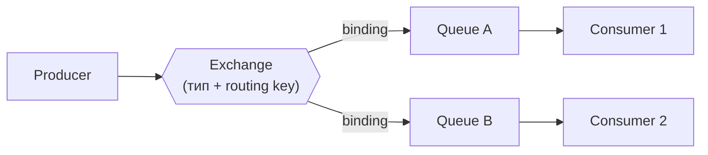

# RabbitMQ

## Содержание

- [Архитектура: exchange → binding → queue](#архитектура-exchange--binding--queue)
- [Типы exchange](#типы-exchange)
- [Что делать с сообщениями, которые некуда маршрутизировать](#что-делать-с-сообщениями-которые-некуда-маршрутизировать)
- [Надёжность: confirms, ack/nack, prefetch, DLQ](#надёжность-confirms-acknack-prefetch-dlq)
- [Порядок сообщений и где он ломается](#порядок-сообщений-и-где-он-ломается)
- [Как RabbitMQ хранит сообщения](#как-rabbitmq-хранит-сообщения)
- [Quorum queues](#quorum-queues)
- [Streams: лог-режим с реплеем](#streams-лог-режим-с-реплеем)
- [Метаданные кластера: Mnesia и Khepri](#метаданные-кластера-mnesia-и-khepri)
- [Go код: publisher и subscriber](#go-код-publisher-и-subscriber)
- [Competing consumers паттерн](#competing-consumers-паттерн)
- [Production-грабли](#production-грабли)
- [Когда RabbitMQ, когда Kafka](#когда-rabbitmq-когда-kafka)
- [Interview-ready answer](#interview-ready-answer)

RabbitMQ — классический message broker на основе протокола AMQP 0-9-1. Его сила — гибкая маршрутизация через модель exchange/binding, а ниша — очереди задач, event-driven пайплайны и сложный routing. Контраст с [Kafka](./01-kafka.md): классическая очередь удаляет сообщение после подтверждения, поэтому повторного чтения истории у неё нет. Лог-режим у RabbitMQ тоже появился — см. [Streams](#streams-лог-режим-с-реплеем).

---

## Архитектура: exchange → binding → queue



- **Exchange** — точка входа. Producer всегда публикует в exchange, никогда напрямую в queue.
- **Queue** — хранилище сообщений. Consumer подписывается на queue, не на exchange.
- **Binding** — связь exchange → queue с опциональным routing key: правило «форвардить сюда, если ключ совпадает».

### Connection и Channel

Прежде чем что-то публиковать, клиент открывает connection — одно TCP-соединение к брокеру (с TLS-handshake и heartbeat, поэтому оно дорогое). Внутри него мультиплексируются channels — лёгкие виртуальные сессии, и почти все операции (declare, publish, consume, ack) идут именно через канал, а не через соединение напрямую.

Практические правила, из которых растут многие production-грабли:

- **Канал не потокобезопасен** — на каждую горутину свой channel, одно соединение можно делить.
- **Publish и consume — по разным connections.** Flow control (см. [Как хранит сообщения](#как-rabbitmq-хранит-сообщения)) при перегрузке блокирует публикующее соединение — и если consume висит на том же, потребление встанет вместе с публикацией.
- **Не открывать connection на операцию** — соединения держат долгоживущими (пул), пересоздают только при обрыве.

---

## Типы exchange

### Fanout — broadcast

```text
Exchange (fanout)
    ├── Queue A  ← все получают копию
    ├── Queue B  ← все получают копию
    └── Queue C  ← все получают копию

Routing key игнорируется
```

Где применяется: рассылка событий (уведомления, инвалидация кэша), чат, где у каждого участника своя очередь.

### Direct — точное совпадение

```text
Exchange (direct)
    ├── [binding: routing_key="error"] → Queue "errors"
    ├── [binding: routing_key="info"]  → Queue "logs"
    └── [binding: routing_key="warn"]  → Queue "alerts"
```

Где применяется: логи по уровням, задачи по типу.

### Topic — паттерн по ключу

```text
Exchange (topic)
    ├── [binding: "orders.#"]       → Queue "all-orders"
    ├── [binding: "orders.created"] → Queue "new-orders"
    └── [binding: "*.cancelled"]    → Queue "cancellations"

"#" — ноль или более слов
"*" — ровно одно слово
```

Где применяется: событийные системы с категоризацией (`orders.created.EU`, `payments.failed.USD`).

### Headers — по заголовкам

```text
Exchange (headers, match: all/any)
    ├── [binding: {"format":"json", "type":"order"}] → Queue A
    └── [binding: {"format":"xml"}]                  → Queue B
```

Routing key игнорируется, решение принимается по заголовкам сообщения. Используется редко: обходится дороже topic.

---

## Что делать с сообщениями, которые некуда маршрутизировать

Exchange ничего не хранит: если ни одно binding не подошло, сообщение просто исчезает, и по умолчанию publisher об этом не узнаёт. Даже publisher confirm здесь не спасает — брокер честно подтверждает, что сообщение принято и обработано маршрутизацией, а «обработано» включает вариант «выброшено, потому что некуда положить». Опечатка в routing key превращается в тихую потерю трафика.

Два механизма закрывают эту дырку, и они дополняют друг друга.

**Флаг mandatory** — это первый из двух булевых аргументов публикации, который в примерах кода обычно стоит `false` без пояснения. С `mandatory=true` брокер возвращает немаршрутизируемое сообщение обратно клиенту, а клиент получает его через отдельный канал уведомлений:

```go
returns := ch.NotifyReturn(make(chan amqp.Return, 16))
go func() {
    for r := range returns {
        // сюда попадает то, что не подошло ни под одно binding
        log.Printf("unroutable: exchange=%s key=%s reason=%s", r.Exchange, r.RoutingKey, r.ReplyText)
    }
}()

ch.PublishWithDeferredConfirmWithContext(ctx, exchangeName, routingKey,
    true,  // mandatory: вернуть, если маршрута нет
    false, // immediate: удалён из протокола, всегда false
    msg,
)
```

Второй аргумент — `immediate` — исторический: он требовал доставки сразу подписанному consumer-у и был удалён ещё в RabbitMQ 3.0, поэтому там всегда `false`.

**Alternate exchange** решает ту же задачу на стороне брокера: у exchange указывается запасной, куда уходит всё немаршрутизируемое. Это удобнее, когда терять нельзя, а обрабатывать такие сообщения должен отдельный сервис, а не publisher:

```go
ch.ExchangeDeclare("events.topic", "topic", true, false, false, false,
    amqp.Table{"alternate-exchange": "events.unrouted"})
```

Разница в ответственности: `mandatory` возвращает проблему автору публикации (полезно, чтобы ловить ошибки в коде), alternate exchange складывает её в отдельную очередь (полезно, чтобы ничего не потерять в продакшене). На критичных потоках включают оба.

---

## Надёжность: confirms, ack/nack, prefetch, DLQ

Надёжная доставка в RabbitMQ собирается из двух половин — подтверждения на стороне публикации и на стороне потребления. Частая ошибка — настроить только вторую.

### Publisher confirms — подтверждение публикации

`DeliveryMode: Persistent` сам по себе не гарантирует, что сообщение доехало: publish — асинхронная операция, и без confirm-режима брокер может упасть до записи на диск, а publisher об этом не узнает. Confirm-режим заставляет брокер подтверждать каждую публикацию:

```go
ch.Confirm(false) // перевести канал в confirm mode

// amqp091-go: publish с ожиданием подтверждения
conf, err := ch.PublishWithDeferredConfirmWithContext(ctx,
    exchangeName, routingKey, false, false,
    amqp.Publishing{
        DeliveryMode: amqp.Persistent,
        ContentType:  "application/json",
        Body:         data,
    },
)
if err != nil {
    return err
}
if ok, err := conf.WaitContext(ctx); err != nil || !ok {
    return fmt.Errorf("publish not confirmed: %w", err) // retry / outbox
}
```

Итог: at-least-once на публикации складывается из persistent-сообщения, durable-очереди и publisher confirm. Для критичных событий поверх этого — outbox-паттерн ([outbox и идемпотентность](../06-databases/database-systems-catalog/postgresql/14-outbox-and-idempotency.md)).

Важная оговорка про цену: пример выше ждёт подтверждение на каждую публикацию, то есть платит сетевым round-trip за сообщение. Так делают для единичных критичных событий, но на потоке это сразу упирается в потолок в несколько тысяч сообщений в секунду. Для потока подтверждения обрабатывают асинхронно — публикуют пачку и разбирают подтверждения по номеру доставки:

```go
confirms := ch.NotifyPublish(make(chan amqp.Confirmation, 1024))
go func() {
    for c := range confirms {
        if c.Ack {
            markDelivered(c.DeliveryTag) // подтверждено: можно удалить из outbox
        } else {
            retry(c.DeliveryTag) // брокер отказался принять — повторить
        }
    }
}()
```

Номер доставки (`DeliveryTag`) нумерует публикации в канале по порядку начиная с единицы, поэтому publisher держит карту «номер → сообщение» и вычищает её по подтверждениям. Это тот же приём, что батчинг в Kafka: стоимость подтверждения размазывается на пачку вместо оплаты за каждое сообщение.

### Manual acknowledgement — подтверждение обработки

```go
// autoAck=false → consumer явно подтверждает обработку
d.Ack(false)         // подтвердить это сообщение
d.Nack(false, true)  // отклонить, requeue=true → вернуть в очередь
d.Nack(false, false) // отклонить, requeue=false → в DLQ (если настроен)
```

Осторожно с `requeue=true` для постоянно падающих сообщений: без счётчика попыток получается бесконечный цикл (см. DLQ ниже).

### Prefetch (QoS)

```go
// Не отправлять consumer-у более N неподтверждённых (unacked) сообщений.
// Вызывать ДО ch.Consume — иначе первые доставки уйдут без лимита.
ch.Qos(
    10,    // prefetchCount: max N сообщений без ack
    0,     // prefetchSize: 0 = без лимита по байтам
    false, // global: false = per-consumer
)
```

Без prefetch брокер может отгрузить тысячи сообщений одному быстрому consumer-у, пока остальные простаивают, а при падении этого consumer-а все неподтверждённые сообщения вернутся в очередь разом.

Отдельная ловушка при долгой обработке — `consumer_timeout` на стороне брокера (по умолчанию 30 минут). Если сообщение не подтверждено за это время, брокер считает consumer-а зависшим, закрывает канал, и все неподтверждённые сообщения возвращаются в очередь. Поведение похоже на `max.poll.interval.ms` в Kafka, но проявляется иначе: в логах видно `channel closed: delivery acknowledgement timed out`, доставка возобновляется с начала, и при по-настоящему долгих задачах это превращается в бесконечный цикл переобработки. Варианты решения: разбивать задачу на этапы с подтверждением каждого, поднимать `consumer_timeout` в конфигурации брокера или выносить статус задачи в базу и подтверждать сообщение сразу после регистрации работы.

### Dead Letter Queue (DLQ)

Сообщение попадает в DLQ, когда: consumer отклонил его с `requeue=false`; истёк message TTL; очередь переполнена.

```go
args := amqp.Table{
    "x-dead-letter-exchange":    "dlq.exchange",
    "x-dead-letter-routing-key": "failed",
    "x-message-ttl":             int32(30000), // TTL 30 секунд
}
ch.QueueDeclare("orders", true, false, false, false, args)
```

Счётчик попыток RabbitMQ сам ведёт только у quorum-очередей (`x-delivery-count` в заголовках и настройка `x-delivery-limit`). У классических очередей такого счётчика нет: `Nack` с `requeue=true` возвращает сообщение без пометки, и различить первую попытку от сотой невозможно. Поэтому на классических очередях счётчик кладут в заголовок сообщения сами: прочитать, увеличить, опубликовать заново, а после N попыток отправить в DLQ.

---

## Порядок сообщений и где он ломается

Формально порядок в RabbitMQ гарантируется внутри очереди: сообщения выдаются в том порядке, в каком попали в неё. На практике этой гарантии почти никогда недостаточно, потому что ломают её штатные механизмы:

| Что происходит | Почему порядок ломается |
| --- | --- |
| Несколько consumers на одной очереди | сообщения расходятся по обработчикам, и кто закончит первым — неизвестно |
| `Nack` с `requeue=true` | сообщение возвращается в голову очереди и обрабатывается после тех, что уже ушли следом |
| `prefetch` больше единицы | consumer держит пачку и может обработать её конкурентно внутри себя |
| Приоритеты или несколько очередей на поток | порядок между очередями не определён в принципе |

Отсюда практическое следствие: если порядок по сущности критичен (статусы заказа, движения по счёту), одной очереди мало — нужен механизм, который гарантирует единственного обработчика. Их два:

- **Single active consumer** (`x-single-active-consumer: true`) — подписчиков может быть много, но сообщения получает только один; остальные ждут в резерве и подхватывают при его падении. Порядок сохраняется, параллелизм внутри очереди теряется полностью.
- **Consistent hash exchange** (плагин) — поток разбивается по хешу routing key на несколько очередей, каждую читает один consumer. Получается ровно та же схема, что партиции с ключом в Kafka: порядок внутри сущности при параллелизме между сущностями.

```go
args := amqp.Table{
    "x-queue-type":             "quorum",
    "x-single-active-consumer": true,
}
ch.QueueDeclare("account-events", true, false, false, false, args)
```

---

## Как RabbitMQ хранит сообщения

В отличие от Kafka (где всё всегда на диске в append-only логе), RabbitMQ — брокер очередей, и хранение у него гибридное: часть в RAM ради скорости, часть на диске ради надёжности. Разберём, из чего это складывается.

### Persistent ≠ durable ≠ на диске сейчас

Три ортогональные вещи, которые часто путают:

- **`DeliveryMode: Persistent`** — свойство **сообщения**: «его можно писать на диск».
- **durable queue** — свойство **очереди**: её определение переживёт рестарт брокера.
- Чтобы сообщение реально пережило перезапуск, нужны оба: persistent-сообщение в durable-очереди. Persistent-сообщение в transient-очереди пропадёт вместе с очередью; сообщение без persistent в durable-очереди — вместе с сообщением.

И даже это не значит «уже на диске»: запись на диск батчится и делается периодическим fsync. Момент, когда сообщение реально записано (или отреплицировано), брокер сообщает через [publisher confirm](#publisher-confirms--подтверждение-публикации) — поэтому confirms и есть настоящая гарантия, а не сам флаг persistent.

### Где физически лежат данные

- **Message store** — общий на vhost склад тел сообщений (persistent и transient раздельно). Мелкие сообщения могут встраиваться прямо в индекс очереди.
- **Queue index** — на каждую очередь: порядок сообщений и их статус (доставлено/подтверждено), сегментами на диске.

### Память vs диск и flow control

Классические очереди исторически держали сообщения в памяти и сбрасывали их на диск под давлением (`paging`). Затем появился режим lazy queues — сообщения пишутся на диск сразу, память экономится ценой чуть меньшей пиковой скорости, зато очередь на миллионы сообщений не съедает RAM. В RabbitMQ 3.12 классические очереди перешли на новый формат хранения (`classic queue v2`), где запись на диск происходит всегда, а отдельная настройка `queue-mode=lazy` потеряла смысл и в 4.x игнорируется. Практический вывод для нового кода: специально включать lazy-режим не нужно, а старые конфигурации с ним стоит вычистить, чтобы не создавать иллюзию управления поведением.

Защита от переполнения — alarm и flow control: при превышении `vm_memory_high_watermark` (по умолчанию ~0.4 RAM) или падении свободного места ниже `disk_free_limit` брокер поднимает alarm и блокирует публикующие соединения (TCP backpressure), пока не разгрузится. Со стороны это выглядит как «продюсер завис», хотя это штатная защита — и ровно поэтому publish и consume разносят по разным connections.

---

## Quorum queues

Классические зеркалируемые очереди (`classic mirrored queues`) объявлены устаревшими и удалены в RabbitMQ 4.x — они плохо переживали ресинхронизацию после failover. Современный ответ на отказоустойчивость — quorum queues: реплицируемая очередь на основе консенсуса Raft.

- Данные реплицируются на кворум узлов, поэтому подтверждённое сообщение переживает падение узла.
- Очередь всегда durable, тип задаётся в объявлении: `x-queue-type: quorum`.
- Есть встроенный счётчик доставок `x-delivery-count` и настройка `x-delivery-limit`: после N неудачных попыток сообщение уходит в DLQ. У классических очередей этого нет, и именно это решает проблему бесконечного requeue.
- Цена: больше памяти и диска, чуть выше latency из-за консенсуса на запись, и часть возможностей классических очередей недоступна.

```go
args := amqp.Table{"x-queue-type": "quorum", "x-delivery-limit": int32(5)}
ch.QueueDeclare("orders", true, false, false, false, args)
```

Про ограничения стоит уточнить версию, потому что список меняется. Quorum-очередь нельзя объявить `exclusive` или недолговечной — сама модель предполагает реплицируемую и живущую дольше подключения очередь. А вот приоритеты сообщений в RabbitMQ 4.0 у quorum-очередей появились, хотя и в упрощённом виде: вместо произвольной шкалы `x-max-priority` брокер разделяет сообщения на обычные и высокоприоритетные. Утверждение «quorum не умеет приоритеты» верно для 3.x и устарело для 4.x — на собеседовании это как раз вопрос на актуальность знаний.

Правило выбора: всё, что нельзя терять, — quorum queue; классические остаются для эфемерных и exclusive-очередей, где потеря при перезапуске узла ничего не стоит.

---

## Streams: лог-режим с реплеем

Тезис «в RabbitMQ реплея нет» верен для очередей, но с 3.9 у RabbitMQ есть Streams — append-only реплицируемый лог, по духу близкий к Kafka, живущий внутри того же брокера.

Чем он отличается от очереди:

- **Не разрушающее чтение** — сообщение не удаляется после потребления — много независимых consumers читают один и тот же лог, каждый со своим **offset**;
- **Повторное чтение** — с любого offset или момента времени, чего у очереди нет;
- **Retention** — по размеру, времени или возрасту: старое отрезается, как в Kafka, а не по факту подтверждения;
- хранится сегментами на диске, реплицируется между узлами; читается либо через AMQP (с `x-stream-offset`), либо через отдельный, более быстрый stream-протокол.

```go
// объявить stream и читать с начала лога
args := amqp.Table{"x-queue-type": "stream", "x-max-length-bytes": 5_000_000_000}
ch.QueueDeclare("events", true, false, false, false, args)

ch.Qos(100, 0, false) // для stream prefetch обязателен
ch.Consume("events", "", false, false, false, false,
    amqp.Table{"x-stream-offset": "first"}) // "first"/"last"/"next"/offset/timestamp
```

Ещё две вещи, которых у обычной очереди нет. Во-первых, отдельный бинарный stream-протокол (порт 5552) с собственным клиентом: он батчит и даёт кратно больший поток, чем чтение того же stream через AMQP. Во-вторых, super streams (с 3.11) — набор потоков, между которыми сообщения раскладываются по ключу; это прямой аналог партиционирования в Kafka, включая параллелизм чтения с сохранением порядка внутри ключа.

Когда брать: нужен Kafka-подобный веерный разбор и повторное чтение истории, но заводить отдельную Kafka не хочется. Компромисс в том, что это не очередь: модель потребления по offset, без семантики competing consumers с requeue, и маршрутизация exchange к самому потоку ограничена. Если весь проект про потоковую обработку, честнее взять Kafka — [сравнение](./00-comparison.md).

---

## Метаданные кластера: Mnesia и Khepri

Кластеру нужно согласованно хранить метаданные: какие есть vhost-ы, очереди, exchange-и, bindings, пользователи и права. Исторически это делала Mnesia — встроенная база Erlang, которая согласовывала метаданные без консенсуса и потому болезненно переживала сетевые расщепления: узлы могли разойтись в определениях очередей, а восстановление требовало ручного вмешательства и выбора «победителя».

RabbitMQ 4.0 сделал хранилищем метаданных Khepri — движок на том же Raft, на котором работают quorum-очереди. Смысл ровно тот же, что у перехода Kafka с ZooKeeper на KRaft: одна модель согласования на весь продукт, предсказуемое поведение при разделении сети (меньшая часть кластера теряет право менять метаданные) и меньше ручной работы после аварии.

Практическое следствие для эксплуатации: расщепление кластера теперь не приводит к расходящимся определениям очередей, но меньшинство узлов не сможет объявлять очереди и exchange-и, пока кворум не восстановится. Сервису, который объявляет очередь при старте, это добавляет обязанность корректно пережить такую ошибку и повторить попытку, а не падать в бесконечный рестарт.

---

## Go код: publisher и subscriber

Сценарий — fanout broadcast: каждый подписчик получает копию каждого события.

### Publisher (fanout exchange)

<details>
<summary>Полная реализация publisher с confirm-режимом</summary>

```go
package rabbitmq

import (
    "context"
    "encoding/json"
    "fmt"

    amqp "github.com/rabbitmq/amqp091-go"
)

const exchangeName = "events.fanout"

type Publisher struct {
    conn *amqp.Connection
    ch   *amqp.Channel
}

func NewPublisher(amqpURL string) (*Publisher, error) {
    conn, err := amqp.Dial(amqpURL)
    if err != nil {
        return nil, fmt.Errorf("dial: %w", err)
    }
    ch, err := conn.Channel()
    if err != nil {
        conn.Close()
        return nil, fmt.Errorf("channel: %w", err)
    }

    // Декларация idempotent — создаётся, только если не существует
    if err := ch.ExchangeDeclare(
        exchangeName, // name
        "fanout",     // type
        true,         // durable — переживёт перезапуск брокера
        false,        // auto-delete
        false,        // internal
        false,        // no-wait
        nil,          // args
    ); err != nil {
        ch.Close()
        conn.Close()
        return nil, fmt.Errorf("exchange declare: %w", err)
    }

    if err := ch.Confirm(false); err != nil { // publisher confirms
        ch.Close()
        conn.Close()
        return nil, fmt.Errorf("confirm mode: %w", err)
    }
    return &Publisher{conn: conn, ch: ch}, nil
}

func (p *Publisher) Publish(ctx context.Context, event any) error {
    data, err := json.Marshal(event)
    if err != nil {
        return fmt.Errorf("marshal: %w", err)
    }
    conf, err := p.ch.PublishWithDeferredConfirmWithContext(ctx,
        exchangeName, // exchange
        "",           // routing key (fanout игнорирует)
        false, false,
        amqp.Publishing{
            ContentType:  "application/json",
            DeliveryMode: amqp.Persistent,
            Body:         data,
        },
    )
    if err != nil {
        return fmt.Errorf("publish: %w", err)
    }
    if ok, err := conf.WaitContext(ctx); err != nil || !ok {
        return fmt.Errorf("not confirmed: %w", err)
    }
    return nil
}

func (p *Publisher) Close() error {
    p.ch.Close()
    return p.conn.Close()
}
```

</details>

### Subscriber (exclusive queue per consumer)

<details>
<summary>Полная реализация subscriber с exclusive-очередью и ручным ack</summary>

```go
type Subscriber[T any] struct {
    conn *amqp.Connection
    ch   *amqp.Channel
    msgs chan T
}

func NewSubscriber[T any](amqpURL string) (*Subscriber[T], error) {
    conn, err := amqp.Dial(amqpURL)
    if err != nil {
        return nil, err
    }
    ch, err := conn.Channel()
    if err != nil {
        conn.Close()
        return nil, err
    }

    // Декларация с той же конфигурацией, что у publisher: несовпадение типа
    // или durable вернёт ошибку PRECONDITION_FAILED и закроет канал.
    if err := ch.ExchangeDeclare(exchangeName, "fanout", true, false, false, false, nil); err != nil {
        ch.Close()
        conn.Close()
        return nil, fmt.Errorf("exchange declare: %w", err)
    }

    // Prefetch — ДО Consume
    if err := ch.Qos(10, 0, false); err != nil {
        ch.Close()
        conn.Close()
        return nil, err
    }

    // Exclusive queue: своя на каждое подключение, имя автогенерируется,
    // удаляется при disconnect — так fanout даёт broadcast каждому подписчику
    q, err := ch.QueueDeclare(
        "",    // name: auto-generated
        false, // durable: нет — очередь эфемерная
        true,  // auto-delete
        true,  // exclusive
        false,
        nil,
    )
    if err != nil {
        ch.Close()
        conn.Close()
        return nil, err
    }

    if err := ch.QueueBind(q.Name, "", exchangeName, false, nil); err != nil {
        ch.Close()
        conn.Close()
        return nil, err
    }

    deliveries, err := ch.Consume(
        q.Name, // queue
        "",     // consumer tag (auto)
        false,  // auto-ack: нет — подтверждаем вручную
        true,   // exclusive
        false,  // no-local
        false,  // no-wait
        nil,
    )
    if err != nil {
        ch.Close()
        conn.Close()
        return nil, err
    }

    s := &Subscriber[T]{conn: conn, ch: ch, msgs: make(chan T, 64)}
    go s.consumeLoop(deliveries)
    return s, nil
}

// Отправка в канал блокирующая, и это осознанно: ack уходит только после того,
// как читатель забрал событие. Если ack-ать сразу после Unmarshal, гарантия
// превращается из at-least-once в «доставлено в буфер» — падение между буфером
// и обработкой потеряет сообщение, и брокер об этом не узнает.
//
// Важное ограничение примера: подтверждение здесь означает «передано читателю»,
// а не «обработано». Для настоящего at-least-once обработчик передают внутрь
// (Subscriber вызывает handler и ack-ает после его успешного возврата), как это
// сделано в примере consumer-а в 04-redis-streams.md.
func (s *Subscriber[T]) consumeLoop(deliveries <-chan amqp.Delivery) {
    defer close(s.msgs)
    for d := range deliveries {
        var event T
        if err := json.Unmarshal(d.Body, &event); err != nil {
            // Битое сообщение: повторять бессмысленно, requeue=false уводит его в DLQ.
            d.Nack(false, false)
            continue
        }
        s.msgs <- event
        if err := d.Ack(false); err != nil {
            // Канал закрыт (обрыв или consumer_timeout): цикл всё равно завершится
            // по закрытию deliveries, но ошибку надо видеть в логах.
            log.Printf("[rabbitmq] ack %d: %v", d.DeliveryTag, err)
            return
        }
    }
}

func (s *Subscriber[T]) Messages() <-chan T { return s.msgs }

func (s *Subscriber[T]) Close() error {
    s.ch.Close()
    return s.conn.Close()
}
```

</details>

---

## Competing consumers паттерн

Несколько consumers на одной очереди — задачи распределяются между ними:

```text
Queue "tasks"
    ├── Consumer A  ← task 1, 4, 7 ...
    ├── Consumer B  ← task 2, 5, 8 ...
    └── Consumer C  ← task 3, 6, 9 ...
```

```go
// Три инстанса одного сервиса подключаются к одной queue —
// RabbitMQ балансирует задачи (round-robin с учётом prefetch)
ch.QueueDeclare("tasks", true, false, false, false,
    amqp.Table{"x-queue-type": "quorum"})
ch.Consume("tasks", "worker-1", false, false, false, false, nil)
```

Отличие от Kafka: явного понятия consumer group нет — work-sharing получается просто несколькими подписчиками одной queue, а broadcast — отдельной queue на каждого подписчика (fanout).

---

## Production-грабли

- **`amqp091-go` не переподключается сам.** При обрыве соединения `Connection` и `Channel` мертвы навсегда, а канал `deliveries` закрывается. Нужен слой переподключения: слушать `conn.NotifyClose(...)`, пересоздавать соединение, канал и подписки с выдержкой — либо взять обёртку с автопереподключением. Это самая частая причина «consumer молча перестал получать сообщения после сетевого моргания».
- **Очередь без ограничения длины.** Если потребители отстают, очередь растёт, пока не съест диск или память, после чего брокер начинает придушивать publishers через flow control. Ставить `x-max-length` или TTL и алерт на глубину очереди.
- **Одно соединение на всё.** Каналы мультиплексируются в одном TCP-соединении, но публикацию и потребление разносят по разным соединениям: flow control на публикацию может заблокировать и потребление.
- **Немаршрутизируемые сообщения без `mandatory` и alternate exchange.** Опечатка в routing key даёт тихую потерю: confirm приходит, сообщение исчезает. Проверяется одним тестом на существование маршрута для каждого ключа, который публикует сервис.
- **Долгая обработка против `consumer_timeout`.** Задача на час при таймауте 30 минут даёт бесконечный цикл: канал закрывается, сообщение возвращается, обработка начинается заново. Диагностируется по `delivery acknowledgement timed out` в логах брокера.
- **Разные декларации одной очереди в разных сервисах.** `QueueDeclare` с несовпадающими параметрами (durable, тип очереди, аргументы) возвращает `PRECONDITION_FAILED` и закрывает канал. Определения очередей держат в одном месте — миграции инфраструктуры или общей библиотеке, а не в каждом сервисе своей копией.
- **Число очередей и соединений.** Каждая очередь — это процесс Erlang со своим состоянием, каждое соединение держит буферы; десятки тысяч эфемерных очередей или соединение на запрос упираются в память брокера раньше, чем в его пропускную способность.

---

## Когда RabbitMQ, когда Kafka

| Критерий | RabbitMQ | Kafka |
|---|---|---|
| Основная модель | Message queue | Event log |
| Routing | Гибкий (exchange types) | По ключу → партиция |
| Throughput | Умеренный (50–100k msg/s) | Высокий (1M+ msg/s) |
| Persistence | Durable queues + persistent messages | По умолчанию, retention днями |
| Replay | ❌ (после ack сообщение удалено) | ✅ с любого offset |
| Распределение работы | Competing consumers (queue) | Consumer groups (partition assignment) |
| Ordering | Per-queue (ломается при requeue/нескольких consumers) | Per-partition |
| Latency | Очень низкая (доли мс) | Выше (batching) |
| Операционная сложность | Умеренная | Высокая |

RabbitMQ — когда: task queues (email, notifications, background jobs), сложный routing по типам событий, низкая latency, брокер нужен «попроще». Kafka — когда: high-throughput streaming, replay/reprocessing, event sourcing, несколько независимых групп читателей. Сводная таблица по всем брокерам — [00-comparison.md](./00-comparison.md).

### Почему Kafka быстрее по throughput (и почему это не делает RabbitMQ хуже)

RabbitMQ не «медленный» — он делает на каждое сообщение больше работы, и разрыв в пропускной способности это прямая цена гибкости:

- **Работа на сообщение против пакетной дозаписи.** Kafka-брокер просто дописывает батч в конец лога — почти без per-message логики. RabbitMQ на каждое сообщение делает маршрутизацию по bindings, кладёт в структуру очереди, ведёт состояние доставки/ack, удаляет после ack, обрабатывает requeue/TTL/DLQ/priority.
- **Kafka не удаляет, RabbitMQ удаляет.** Лог читается по offset без мутации, N групп читают одни байты бесплатно; в RabbitMQ fan-out на N потребителей = N копий в N очередях, каждая независимо хранится и удаляется (очередь — изменяемая структура).
- **Zero-copy против отправки по одному.** Kafka отдаёт байты из page cache через `sendfile` пачками и в сжатом виде; RabbitMQ пушит по одному, держит unacked-состояние на каждого consumer-а и ждёт ack.
- **Параллелизм.** Kafka масштабируется партициями (линейно, последовательный I/O на диск). Классическая очередь обслуживается по сути одним процессом — потолок одной очереди; масштаб только шардированием, а quorum queue добавляет Raft-консенсус на сообщение.
- **Протокол.** AMQP 0-9-1 — per-message и «болтливый»; протокол Kafka бинарный и батч-ориентированный.

Оговорка: это trade-off, а не дефект. По latency RabbitMQ обычно быстрее (доли миллисекунды), потому что отдаёт сразу, без батчинга — Kafka сознательно меняет задержку на пропускную способность. Разные точки одной кривой: RabbitMQ заточен под гибкую маршрутизацию, низкую latency и per-message-семантику, Kafka — под массовый последовательный стрим.

---

## Interview-ready answer

**1. Объясни модель exchange, queue и binding.**

- Producer публикует всегда в exchange — компонент маршрутизации, который сам ничего не хранит.
- Binding связывает exchange с очередью правилом «форвардить сюда, если routing key подходит».
- Queue хранит сообщения и отдаёт их подписанным consumers; consumer подписывается на очередь, а не на exchange.
- Тип exchange задаёт логику: fanout рассылает во все привязанные очереди, direct требует точного совпадения ключа, topic сравнивает по шаблону (`orders.#`), headers смотрит на заголовки.
- Если ни одно binding не подошло, сообщение исчезает молча — от этого защищают `mandatory` и alternate exchange.

**2. Как получить надёжную доставку от публикации до обработки?**

- На публикации — persistent-сообщение, durable-очередь (лучше quorum) и publisher confirm: без confirm публикация это fire-and-forget, брокер может упасть до записи.
- На потреблении — ручное подтверждение после обработки, а не после получения.
- На приёмнике — идемпотентность, потому что вся схема даёт at-least-once и дубликаты возможны по построению.
- На маршрутизации — `mandatory` или alternate exchange, иначе confirm подтвердит сообщение, которое некуда положить.
- Цена — синхронное ожидание confirm на каждое сообщение упирается в потолок несколько тысяч в секунду; на потоке подтверждения разбирают асинхронно через `NotifyPublish`.

**3. Зачем exclusive queue в fanout-архитектуре?**

- Смысл рассылки — каждый подписчик получает копию, а копии в RabbitMQ создаёт exchange по числу привязанных очередей.
- Поэтому каждый подписчик объявляет свою очередь (exclusive, auto-delete) и привязывает её к fanout exchange.
- Если бы все читали одну очередь, вышло бы распределение нагрузки (competing consumers), а не рассылка.
- Цена такой схемы — веерная доставка на N подписчиков это N копий сообщения и N независимо хранимых очередей.

**4. Что такое quorum queues и чем они лучше mirrored?**

- Устройство — реплицируемая очередь на консенсусе Raft: подтверждённое сообщение лежит на кворуме узлов и переживает падение узла.
- Причина замены — классические mirrored queues плохо переживали ресинхронизацию после failover и удалены в RabbitMQ 4.x.
- Главный практический бонус — встроенные `x-delivery-count` и `x-delivery-limit`: после N неудачных попыток сообщение уходит в DLQ, что закрывает проблему бесконечного requeue.
- Цена — больше памяти и диска, чуть выше latency, нельзя объявить очередь exclusive или недолговечной.
- Про версии — «quorum не умеет приоритеты» верно для 3.x; в 4.0 приоритеты сообщений появились в упрощённом виде.

**5. Зачем prefetch и что он ограничивает?**

- Ограничивает число неподтверждённых сообщений, которые брокер отдаёт одному consumer-у.
- Без него брокер отгружает пачку самому быстрому потребителю: остальные простаивают, а при его падении вся пачка возвращается в очередь разом.
- Ставится до `Consume`, иначе первые доставки уйдут без лимита.
- Типичные значения — единицы или десятки при тяжёлой обработке, сотни при лёгкой.
- Связанный подвох — `consumer_timeout` брокера (30 минут по умолчанию): неподтверждённое дольше этого сообщение закрывает канал и возвращается в очередь.

**6. Persistent и durable — в чём разница, и когда сообщение реально на диске?**

- `Persistent` — свойство сообщения, разрешающее писать его на диск; durable — свойство очереди, её определение переживает рестарт.
- Чтобы сообщение пережило перезапуск, нужны оба: persistent-сообщение в durable-очереди.
- «На диске сейчас» не гарантировано даже так: запись батчится с периодическим fsync.
- Настоящей гарантией является publisher confirm — именно он приходит после того, как брокер записал или отреплицировал сообщение.
- При нехватке памяти или места срабатывает alarm, и flow control блокирует публикующие соединения — со стороны это выглядит как зависший producer.

**7. Чем Streams отличаются от очередей?**

- Модель — append-only реплицируемый лог внутри того же брокера (с 3.9), а не изменяемая структура с удалением после подтверждения.
- Чтение не разрушающее: несколько независимых потребителей читают один лог, каждый со своим offset.
- Есть повторное чтение с любого offset или момента времени и retention по размеру, времени или возрасту.
- Дополнительно — отдельный бинарный протокол на порту 5552 для высокой пропускной способности и super streams (с 3.11) как аналог партиционирования.
- Ограничение — это не очередь: нет семантики competing consumers с requeue, маршрутизация к потоку ограничена. Если весь проект про стриминг, честнее взять Kafka.

**8. Где в RabbitMQ ломается порядок сообщений?**

- Гарантия узкая: порядок держится внутри очереди, и только пока её читает один потребитель.
- Ломают порядок несколько consumers на очереди, `Nack` с `requeue=true`, prefetch больше единицы и приоритеты.
- Решение при жёстком требовании — `x-single-active-consumer`: обработчик один, остальные в резерве, параллелизм внутри очереди теряется.
- Решение при требовании порядка и параллелизма — consistent hash exchange: поток делится по хешу ключа на несколько очередей, по одному потребителю на каждую. Это ровно та же идея, что ключ и партиции в Kafka.

**9. Что изменилось в RabbitMQ 4.x?**

- Метаданные кластера переехали с Mnesia на Khepri — хранилище на Raft, то есть на той же модели консенсуса, что и quorum-очереди.
- Смысл тот же, что у перехода Kafka на KRaft: предсказуемое поведение при разделении сети вместо расходящихся определений очередей и ручного восстановления.
- Следствие для эксплуатации — меньшинство узлов не может объявлять очереди и exchange-и до восстановления кворума, поэтому сервис должен корректно переживать такую ошибку при старте.
- Классические mirrored queues удалены полностью, `queue-mode=lazy` больше ни на что не влияет.
