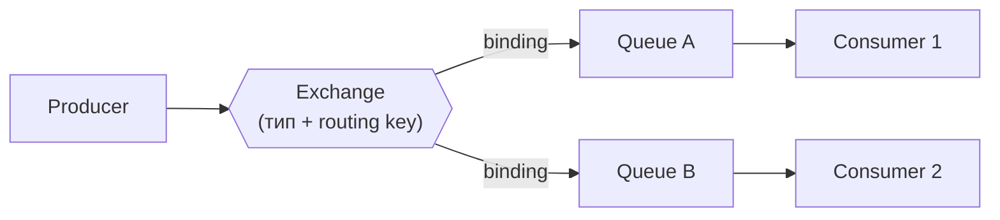

# RabbitMQ

RabbitMQ — классический message broker на основе протокола AMQP 0-9-1. Его сила — гибкая маршрутизация через модель exchange/binding. Ниша: task queues, event-driven пайплайны, сложный routing. Контраст с [Kafka](./01-kafka.md): классическая очередь удаляет сообщение после подтверждения — реплея нет (хотя у RabbitMQ появился и лог-режим — [Streams](#streams-лог-режим-с-реплеем), см. ниже).

## Содержание

- [Архитектура: exchange → binding → queue](#архитектура-exchange--binding--queue)
  - [Connection и Channel](#connection-и-channel)
- [Типы exchange](#типы-exchange)
  - [Fanout — broadcast](#fanout--broadcast)
  - [Direct — точное совпадение](#direct--точное-совпадение)
  - [Topic — паттерн по ключу](#topic--паттерн-по-ключу)
  - [Headers — по заголовкам](#headers--по-заголовкам)
- [Надёжность: confirms, ack/nack, prefetch, DLQ](#надёжность-confirms-acknack-prefetch-dlq)
  - [Publisher confirms — подтверждение публикации](#publisher-confirms--подтверждение-публикации)
  - [Manual acknowledgement — подтверждение обработки](#manual-acknowledgement--подтверждение-обработки)
  - [Prefetch (QoS)](#prefetch-qos)
  - [Dead Letter Queue (DLQ)](#dead-letter-queue-dlq)
- [Как RabbitMQ хранит сообщения](#как-rabbitmq-хранит-сообщения)
  - [Persistent ≠ durable ≠ на диске сейчас](#persistent--durable--на-диске-сейчас)
  - [Где физически лежат данные](#где-физически-лежат-данные)
  - [Память vs диск и flow control](#память-vs-диск-и-flow-control)
- [Quorum queues](#quorum-queues)
- [Streams: лог-режим с реплеем](#streams-лог-режим-с-реплеем)
- [Go код: publisher и subscriber](#go-код-publisher-и-subscriber)
  - [Publisher (fanout exchange)](#publisher-fanout-exchange)
  - [Subscriber (exclusive queue per consumer)](#subscriber-exclusive-queue-per-consumer)
- [Competing consumers паттерн](#competing-consumers-паттерн)
- [Production-грабли](#production-грабли)
- [Когда RabbitMQ, когда Kafka](#когда-rabbitmq-когда-kafka)
  - [Почему Kafka быстрее по throughput](#почему-kafka-быстрее-по-throughput-и-почему-это-не-делает-rabbitmq-хуже)
- [Interview-ready answer](#interview-ready-answer)

## Архитектура: exchange → binding → queue



- **Exchange** — точка входа. Producer всегда публикует в exchange, никогда напрямую в queue.
- **Queue** — хранилище сообщений. Consumer подписывается на queue, не на exchange.
- **Binding** — связь exchange → queue с опциональным routing key: правило «форвардить сюда, если ключ совпадает».

### Connection и Channel

Прежде чем что-то публиковать, клиент открывает **connection** — одно TCP-соединение к брокеру (с TLS-handshake и heartbeat, поэтому оно дорогое). Внутри него мультиплексируются **channels** — лёгкие виртуальные сессии, и почти все операции (declare, publish, consume, ack) идут именно через канал, а не через соединение напрямую.

Практические правила, из которых растут многие production-грабли:

- **Канал не потокобезопасен** — на каждую горутину свой channel, одно соединение можно делить.
- **Publish и consume — по разным connections.** Flow control (см. [Как хранит сообщения](#как-rabbitmq-хранит-сообщения)) при перегрузке блокирует публикующее соединение — и если consume висит на том же, потребление встанет вместе с публикацией.
- **Не открывать connection на операцию** — соединения держат долгоживущими (пул), пересоздают только при обрыве.

## Типы exchange

### Fanout — broadcast

```text
Exchange (fanout)
    ├── Queue A  ← все получают копию
    ├── Queue B  ← все получают копию
    └── Queue C  ← все получают копию

Routing key игнорируется
```

Use case: broadcast событий (notifications, cache invalidation); чат, где у каждого участника своя queue.

### Direct — точное совпадение

```text
Exchange (direct)
    ├── [binding: routing_key="error"] → Queue "errors"
    ├── [binding: routing_key="info"]  → Queue "logs"
    └── [binding: routing_key="warn"]  → Queue "alerts"
```

Use case: логи по уровням, задачи по типу.

### Topic — паттерн по ключу

```text
Exchange (topic)
    ├── [binding: "orders.#"]       → Queue "all-orders"
    ├── [binding: "orders.created"] → Queue "new-orders"
    └── [binding: "*.cancelled"]    → Queue "cancellations"

"#" — ноль или более слов
"*" — ровно одно слово
```

Use case: событийные системы с категоризацией (`orders.created.EU`, `payments.failed.USD`).

### Headers — по заголовкам

```text
Exchange (headers, match: all/any)
    ├── [binding: {"format":"json", "type":"order"}] → Queue A
    └── [binding: {"format":"xml"}]                  → Queue B
```

Routing key игнорируется, решение — по headers сообщения. Используется редко: дороже topic.

## Надёжность: confirms, ack/nack, prefetch, DLQ

Надёжная доставка в RabbitMQ собирается из **двух половин** — подтверждения на стороне публикации и на стороне потребления. Частая ошибка — настроить только вторую.

### Publisher confirms — подтверждение публикации

`DeliveryMode: Persistent` сам по себе **не гарантирует**, что сообщение доехало: publish — асинхронная операция, и без confirm-режима брокер может упасть до записи на диск, а publisher об этом не узнает. Confirm-режим заставляет брокер подтверждать каждую публикацию:

```go
ch.Confirm(false) // перевести канал в confirm mode

// amqp091-go: publish с ожиданием подтверждения
conf, err := ch.PublishWithDeferredConfirmWithContext(ctx,
    exchangeName, routingKey, false, false,
    amqp.Publishing{
        DeliveryMode: amqp.Persistent,
        ContentType:  "application/json",
        Body:         data,
    },
)
if err != nil {
    return err
}
if ok, err := conf.WaitContext(ctx); err != nil || !ok {
    return fmt.Errorf("publish not confirmed: %w", err) // retry / outbox
}
```

Итог: at-least-once на публикации = persistent message + durable queue + publisher confirm. Для критичных событий поверх этого — outbox-паттерн ([06-outbox-idempotency-and-payment-flow.md](../06-databases/relational-databases-and-sql/06-outbox-idempotency-and-payment-flow.md)).

### Manual acknowledgement — подтверждение обработки

```go
// autoAck=false → consumer явно подтверждает обработку
d.Ack(false)         // подтвердить это сообщение
d.Nack(false, true)  // отклонить, requeue=true → вернуть в очередь
d.Nack(false, false) // отклонить, requeue=false → в DLQ (если настроен)
```

Осторожно с `requeue=true` для постоянно падающих сообщений: без счётчика попыток получается бесконечный цикл (см. DLQ ниже).

### Prefetch (QoS)

```go
// Не отправлять consumer-у более N неподтверждённых (unacked) сообщений.
// Вызывать ДО ch.Consume — иначе первые доставки уйдут без лимита.
ch.Qos(
    10,    // prefetchCount: max N сообщений без ack
    0,     // prefetchSize: 0 = без лимита по байтам
    false, // global: false = per-consumer
)
```

Без prefetch брокер может отгрузить тысячи сообщений одному быстрому consumer-у, пока остальные простаивают, а при падении этого consumer-а все unacked вернутся в очередь разом.

### Dead Letter Queue (DLQ)

Сообщение попадает в DLQ, когда: consumer отклонил его с `requeue=false`; истёк message TTL; очередь переполнена.

```go
args := amqp.Table{
    "x-dead-letter-exchange":    "dlq.exchange",
    "x-dead-letter-routing-key": "failed",
    "x-message-ttl":             int32(30000), // TTL 30 секунд
}
ch.QueueDeclare("orders", true, false, false, false, args)
```

## Как RabbitMQ хранит сообщения

В отличие от Kafka (где всё всегда на диске в append-only логе), RabbitMQ — брокер очередей, и хранение у него гибридное: часть в RAM ради скорости, часть на диске ради надёжности. Разберём, из чего это складывается.

### Persistent ≠ durable ≠ на диске сейчас

Три ортогональные вещи, которые часто путают:

- **`DeliveryMode: Persistent`** — свойство **сообщения**: «его можно писать на диск».
- **durable queue** — свойство **очереди**: её определение переживёт рестарт брокера.
- Чтобы сообщение реально пережило перезапуск, нужны **оба**: persistent-сообщение **в** durable-очереди. Persistent-сообщение в transient-очереди пропадёт вместе с очередью; сообщение без persistent в durable-очереди — вместе с сообщением.

И даже это не значит «уже на диске»: запись на диск батчится и делается периодическим fsync. Момент, когда сообщение реально записано (или отреплицировано), брокер сообщает через [publisher confirm](#publisher-confirms--подтверждение-публикации) — поэтому confirms и есть настоящая гарантия, а не сам флаг persistent.

### Где физически лежат данные

- **Message store** — общий на vhost склад тел сообщений (persistent и transient раздельно). Мелкие сообщения могут встраиваться прямо в индекс очереди.
- **Queue index** — на каждую очередь: порядок сообщений и их статус (доставлено/подтверждено), сегментами на диске.

### Память vs диск и flow control

Классические очереди исторически держали сообщения в RAM и сбрасывали на диск (**paging**) под давлением. **Lazy queues** (а в RabbitMQ 3.12+ это поведение классических очередей по умолчанию) наоборот держат сообщения на диске, экономя память ценой чуть меньшей пиковой скорости — зато очередь на миллионы сообщений не съедает RAM.

Защита от переполнения — **alarms + flow control**: при превышении `vm_memory_high_watermark` (по умолчанию ~0.4 RAM) или падении свободного места ниже `disk_free_limit` брокер поднимает alarm и **блокирует публикующие соединения** (TCP backpressure), пока не разгрузится. Со стороны это выглядит как «продюсер завис», хотя это штатная защита — и ровно поэтому publish и consume разносят по разным connections.

## Quorum queues

Классические зеркалируемые очереди (classic mirrored queues) **deprecated** и удалены в RabbitMQ 4.x. Современный ответ на HA — **quorum queues**: реплицируемая очередь на основе Raft.

- Данные реплицируются на кворум узлов; очередь переживает падение узла без потери подтверждённых сообщений.
- Всегда durable; в объявлении — `x-queue-type: quorum`.
- Встроенный счётчик доставок `x-delivery-count` → нативный `delivery-limit` (после N попыток — в DLQ), чего нет у классических очередей.
- Цена: больше памяти/диска, чуть выше latency, не поддерживают некоторые фичи классических (priority, exclusive).

```go
args := amqp.Table{"x-queue-type": "quorum", "x-delivery-limit": int32(5)}
ch.QueueDeclare("orders", true, false, false, false, args)
```

Правило: для всего, что нельзя терять, — quorum queue; классические — для эфемерных и exclusive-очередей.

## Streams: лог-режим с реплеем

Тезис «в RabbitMQ реплея нет» верен для очередей, но с 3.9 у RabbitMQ есть **Streams** — append-only реплицируемый лог, по духу близкий к Kafka, живущий внутри того же брокера.

Чем он отличается от очереди:

- **не разрушающее чтение**: сообщение не удаляется после потребления — много независимых consumers читают один и тот же лог, каждый со своим **offset**;
- **реплей** с любого offset или timestamp (time-travel), чего у queue нет;
- **retention** по размеру/времени/возрасту — старое отрезается, как в Kafka, а не по факту ack;
- хранится сегментами на диске, реплицируется между узлами; читается либо через AMQP (с `x-stream-offset`), либо через отдельный, более быстрый stream-протокол.

```go
// объявить stream и читать с начала лога
args := amqp.Table{"x-queue-type": "stream", "x-max-length-bytes": 5_000_000_000}
ch.QueueDeclare("events", true, false, false, false, args)

ch.Qos(100, 0, false) // для stream prefetch обязателен
ch.Consume("events", "", false, false, false, false,
    amqp.Table{"x-stream-offset": "first"}) // "first"/"last"/"next"/offset/timestamp
```

Когда брать: нужен Kafka-подобный fan-out и реплей (несколько независимых читателей, повторная обработка истории), но заводить отдельную Kafka не хочется. Компромисс: это **не** очередь — модель потребления по offset, без competing-consumers-семантики с requeue; сложный exchange-routing к самому stream ограничен. Если весь проект — про streaming, честнее взять Kafka ([сравнение](./07-comparison.md)).

## Go код: publisher и subscriber

Сценарий — fanout broadcast: каждый подписчик получает копию каждого события.

### Publisher (fanout exchange)

```go
package rabbitmq

import (
    "context"
    "encoding/json"
    "fmt"

    amqp "github.com/rabbitmq/amqp091-go"
)

const exchangeName = "events.fanout"

type Publisher struct {
    conn *amqp.Connection
    ch   *amqp.Channel
}

func NewPublisher(amqpURL string) (*Publisher, error) {
    conn, err := amqp.Dial(amqpURL)
    if err != nil {
        return nil, fmt.Errorf("dial: %w", err)
    }
    ch, err := conn.Channel()
    if err != nil {
        conn.Close()
        return nil, fmt.Errorf("channel: %w", err)
    }

    // Декларация idempotent — создаётся, только если не существует
    if err := ch.ExchangeDeclare(
        exchangeName, // name
        "fanout",     // type
        true,         // durable — переживёт перезапуск брокера
        false,        // auto-delete
        false,        // internal
        false,        // no-wait
        nil,          // args
    ); err != nil {
        ch.Close()
        conn.Close()
        return nil, fmt.Errorf("exchange declare: %w", err)
    }

    if err := ch.Confirm(false); err != nil { // publisher confirms
        ch.Close()
        conn.Close()
        return nil, fmt.Errorf("confirm mode: %w", err)
    }
    return &Publisher{conn: conn, ch: ch}, nil
}

func (p *Publisher) Publish(ctx context.Context, event any) error {
    data, err := json.Marshal(event)
    if err != nil {
        return fmt.Errorf("marshal: %w", err)
    }
    conf, err := p.ch.PublishWithDeferredConfirmWithContext(ctx,
        exchangeName, // exchange
        "",           // routing key (fanout игнорирует)
        false, false,
        amqp.Publishing{
            ContentType:  "application/json",
            DeliveryMode: amqp.Persistent,
            Body:         data,
        },
    )
    if err != nil {
        return fmt.Errorf("publish: %w", err)
    }
    if ok, err := conf.WaitContext(ctx); err != nil || !ok {
        return fmt.Errorf("not confirmed: %w", err)
    }
    return nil
}

func (p *Publisher) Close() error {
    p.ch.Close()
    return p.conn.Close()
}
```

### Subscriber (exclusive queue per consumer)

```go
type Subscriber[T any] struct {
    conn *amqp.Connection
    ch   *amqp.Channel
    msgs chan T
}

func NewSubscriber[T any](amqpURL string) (*Subscriber[T], error) {
    conn, err := amqp.Dial(amqpURL)
    if err != nil {
        return nil, err
    }
    ch, err := conn.Channel()
    if err != nil {
        conn.Close()
        return nil, err
    }

    ch.ExchangeDeclare(exchangeName, "fanout", true, false, false, false, nil)

    // Prefetch — ДО Consume
    if err := ch.Qos(10, 0, false); err != nil {
        ch.Close()
        conn.Close()
        return nil, err
    }

    // Exclusive queue: своя на каждое подключение, имя автогенерируется,
    // удаляется при disconnect — так fanout даёт broadcast каждому подписчику
    q, err := ch.QueueDeclare(
        "",    // name: auto-generated
        false, // durable: нет — очередь эфемерная
        true,  // auto-delete
        true,  // exclusive
        false,
        nil,
    )
    if err != nil {
        ch.Close()
        conn.Close()
        return nil, err
    }

    if err := ch.QueueBind(q.Name, "", exchangeName, false, nil); err != nil {
        ch.Close()
        conn.Close()
        return nil, err
    }

    deliveries, err := ch.Consume(
        q.Name, // queue
        "",     // consumer tag (auto)
        false,  // auto-ack: нет — подтверждаем вручную
        true,   // exclusive
        false,  // no-local
        false,  // no-wait
        nil,
    )
    if err != nil {
        ch.Close()
        conn.Close()
        return nil, err
    }

    s := &Subscriber[T]{conn: conn, ch: ch, msgs: make(chan T, 64)}
    go s.consumeLoop(deliveries)
    return s, nil
}

// handler вызывается синхронно: ack уходит только после успешной обработки.
// Если отправлять сообщение в канал и ack-ать сразу — подтверждение произойдёт
// ДО фактической обработки, и at-least-once превратится в "доставлено в буфер".
func (s *Subscriber[T]) consumeLoop(deliveries <-chan amqp.Delivery) {
    defer close(s.msgs)
    for d := range deliveries {
        var event T
        if err := json.Unmarshal(d.Body, &event); err != nil {
            d.Nack(false, false) // poison message не возвращаем в очередь — в DLQ
            continue
        }
        s.msgs <- event // блокирует, пока потребитель не заберёт
        d.Ack(false)
    }
}

func (s *Subscriber[T]) Messages() <-chan T { return s.msgs }

func (s *Subscriber[T]) Close() error {
    s.ch.Close()
    return s.conn.Close()
}
```

## Competing consumers паттерн

Несколько consumers на **одной** queue — задачи распределяются между ними:

```text
Queue "tasks"
    ├── Consumer A  ← task 1, 4, 7 ...
    ├── Consumer B  ← task 2, 5, 8 ...
    └── Consumer C  ← task 3, 6, 9 ...
```

```go
// Три инстанса одного сервиса подключаются к одной queue —
// RabbitMQ балансирует задачи (round-robin с учётом prefetch)
ch.QueueDeclare("tasks", true, false, false, false,
    amqp.Table{"x-queue-type": "quorum"})
ch.Consume("tasks", "worker-1", false, false, false, false, nil)
```

Отличие от Kafka: явного понятия consumer group нет — work-sharing получается просто несколькими подписчиками одной queue, а broadcast — отдельной queue на каждого подписчика (fanout).

## Production-грабли

- **`amqp091-go` не переподключается сам.** При обрыве соединения `Connection` и `Channel` мёртвые навсегда; канал `deliveries` закрывается. Нужен reconnect-слой: слушать `conn.NotifyClose(...)`, пересоздавать connection/channel/подписки с backoff — или взять обёртку с автопереподключением. Это самая частая причина «consumer молча перестал получать сообщения после сетевого моргания».
- **Unbounded queue.** Если consumers отстают, очередь растёт, пока не съест диск/память и брокер не начнёт душить publishers (flow control). Ставить `x-max-length`/TTL + алерт на глубину очереди.
- **Одно соединение на всё.** Каналы мультиплексируются в одном TCP-соединении, но publish и consume лучше разносить по разным соединениям: flow control на публикацию может заблокировать и потребление.

## Когда RabbitMQ, когда Kafka

| Критерий | RabbitMQ | Kafka |
|---|---|---|
| Основная модель | Message queue | Event log |
| Routing | Гибкий (exchange types) | По ключу → партиция |
| Throughput | Умеренный (50–100k msg/s) | Высокий (1M+ msg/s) |
| Persistence | Durable queues + persistent messages | По умолчанию, retention днями |
| Replay | ❌ (после ack сообщение удалено) | ✅ с любого offset |
| Распределение работы | Competing consumers (queue) | Consumer groups (partition assignment) |
| Ordering | Per-queue (ломается при requeue/нескольких consumers) | Per-partition |
| Latency | Очень низкая (доли мс) | Выше (batching) |
| Операционная сложность | Умеренная | Высокая |

RabbitMQ — когда: task queues (email, notifications, background jobs), сложный routing по типам событий, низкая latency, брокер нужен «попроще». Kafka — когда: high-throughput streaming, replay/reprocessing, event sourcing, несколько независимых групп читателей. Сводная таблица по всем брокерам — [07-comparison.md](./07-comparison.md).

### Почему Kafka быстрее по throughput (и почему это не делает RabbitMQ хуже)

RabbitMQ не «медленный» — он делает **на каждое сообщение больше работы**, и разрыв в throughput это прямая цена гибкости:

- **Per-message работа vs пакетный append.** Kafka-брокер просто дописывает батч в конец лога — почти без per-message логики. RabbitMQ на каждое сообщение делает маршрутизацию по bindings, кладёт в структуру очереди, ведёт состояние доставки/ack, удаляет после ack, обрабатывает requeue/TTL/DLQ/priority.
- **Kafka не удаляет, RabbitMQ удаляет.** Лог читается по offset без мутации, N групп читают одни байты бесплатно; в RabbitMQ fan-out на N потребителей = N копий в N очередях, каждая независимо хранится и удаляется (очередь — изменяемая структура).
- **Zero-copy vs per-message dispatch.** Kafka отдаёт байты из page cache через `sendfile` пачками и в сжатом виде; RabbitMQ пушит по одному, держит unacked-состояние на каждого consumer-а и ждёт ack.
- **Параллелизм.** Kafka масштабируется партициями (линейно, последовательный I/O на диск). Классическая очередь обслуживается по сути одним процессом — потолок одной очереди; масштаб только шардированием, а quorum queue добавляет Raft-консенсус на сообщение.
- **Протокол.** AMQP 0-9-1 — per-message и «болтливый»; протокол Kafka бинарный и батч-ориентированный.

Оговорка: это trade-off, а не дефект. По **latency** RabbitMQ обычно **быстрее** (доли мс), потому что пушит сразу без батчинга — Kafka сознательно меняет задержку на пропускную способность. Разные точки одной кривой: RabbitMQ заточен под гибкую маршрутизацию, низкую latency и per-message-семантику, Kafka — под массовый последовательный стрим.

## Interview-ready answer

**1. Объясни модель exchange/queue/binding.**

- Producer публикует в exchange — компонент маршрутизации, который сам сообщения не хранит. Binding связывает exchange с queue правилом «форвардить, если routing key совпадает». Queue хранит сообщения для consumers. Тип exchange задаёт логику: fanout — broadcast всем привязанным очередям, direct — точное совпадение ключа, topic — glob-паттерн (`orders.#`), headers — по заголовкам.

**2. Как получить надёжную доставку end-to-end?**

- Три составляющие: durable queue (лучше quorum) + persistent message + **publisher confirms** на публикации; manual ack после обработки на потреблении; идемпотентный consumer, потому что всё это даёт at-least-once — дубликаты возможны. Без confirms publish — fire-and-forget: брокер может упасть до записи, и publisher не узнает.

**3. Зачем exclusive queue в fanout-архитектуре?**

- При broadcast каждый consumer должен получить копию сообщения, поэтому каждый создаёт **свою** queue (exclusive, auto-delete) и привязывает её к fanout exchange — тот копирует сообщение во все очереди. Если бы все читали одну queue, получился бы competing consumers (распределение нагрузки), а не broadcast.

**4. Что такое quorum queues и чем они лучше mirrored?**

- Реплицируемые очереди на Raft: подтверждённое сообщение хранится на кворуме узлов и переживает падение узла. Классические mirrored queues имели проблемы с ресинхронизацией после failover и удалены в RabbitMQ 4.x. Бонус quorum — встроенный delivery-limit: после N неудачных доставок сообщение уходит в DLQ, что решает проблему бесконечного requeue.

**5. Зачем prefetch (QoS)?**

- Ограничивает число unacked-сообщений на consumer-а. Без него брокер отгружает всё одному быстрому потребителю: остальные простаивают, а при падении этого consumer-а вся пачка возвращается в очередь разом. Ставится до `Consume`; типичные значения — единицы–десятки при тяжёлой обработке.

**6. Persistent, durable — в чём разница, и когда сообщение реально на диске?**

- `Persistent` — свойство сообщения («можно писать на диск»), durable — свойство очереди («определение переживёт рестарт»). Чтобы сообщение пережило перезапуск, нужны оба. Но даже так «на диске сейчас» не гарантировано: запись батчится с периодическим fsync, и момент реальной записи брокер сообщает через publisher confirm — поэтому настоящая гарантия это confirm, а не флаг persistent. При нехватке памяти/диска срабатывает alarm и flow control блокирует публикующие соединения.

**7. Чем Streams отличаются от очередей?**

- Streams (с 3.9) — append-only реплицируемый лог внутри RabbitMQ: чтение не разрушающее (много consumers, каждый со своим offset), есть реплей с любого offset/timestamp и retention по размеру/времени — как в Kafka. Очередь же удаляет сообщение после ack и реплея не имеет. Streams берут, когда нужен Kafka-подобный fan-out/реплей, но без отдельной Kafka; это не queue — модель по offset, без requeue-семантики.
