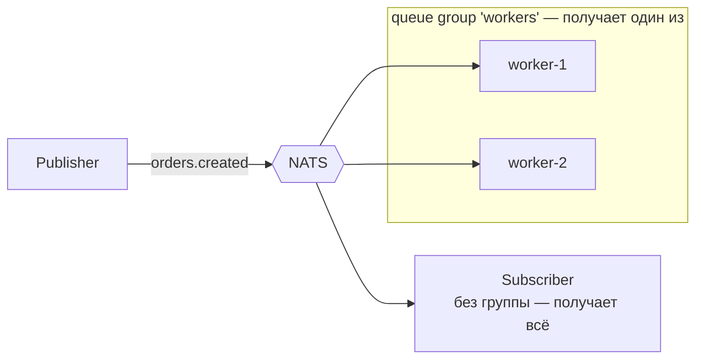

# NATS

## Содержание

- [Ниша NATS](#ниша-nats)
- [Core NATS: subjects, pub/sub, request-reply, queue groups](#core-nats-subjects-pubsub-request-reply-queue-groups)
- [Slow consumer: как теряются сообщения в Core](#slow-consumer-как-теряются-сообщения-в-core)
- [JetStream: персистентность и at-least-once](#jetstream-персистентность-и-at-least-once)
- [Flow control потребителя: AckWait и MaxAckPending](#flow-control-потребителя-ackwait-и-maxackpending)
- [NATS в Go](#nats-в-go)
- [Когда NATS, когда Kafka/RabbitMQ](#когда-nats-когда-kafkarabbitmq)
- [Типичные ошибки](#типичные-ошибки)
- [Interview-ready answer](#interview-ready-answer)

NATS — лёгкий messaging-сервер (один статический бинарь около 20 МБ, проект CNCF) с двумя слоями. Core NATS — очень быстрый fire-and-forget pub/sub со встроенным request-reply, JetStream — надстройка с хранением, at-least-once и стримами. Ниша — «нервная система» микросервисов: обмен сообщениями и RPC с минимальной задержкой и минимальной эксплуатацией там, где [Kafka](./01-kafka.md) избыточна, а [RabbitMQ](./02-rabbitmq.md) тяжеловат.

---

## Ниша NATS

Что отличает NATS от «больших» брокеров:

- **Эксплуатация** — один статический бинарь, кластер из трёх узлов поднимается флагом `--routes`; нет ZooKeeper (как в старой Kafka) и Erlang-рантайма (как в RabbitMQ). Родной для Kubernetes (официальный Helm chart, лёгкие sidecar-топологии).
- **Задержка** — суб-миллисекундная доставка в Core-режиме — сообщения не пишутся на диск.
- **Request-reply из коробки** — встроенный механизм RPC, которого нет ни у Kafka, ни у RabbitMQ (там его собирают руками через reply-to очереди/топики).
- **Топологии** — leaf nodes (edge-узлы, подключённые к центральному кластеру), superclusters с гейтвеями между регионами, multi-tenancy через accounts — поэтому NATS популярен в IoT/edge и связке «облако + устройства».

---

## Core NATS: subjects, pub/sub, request-reply, queue groups

### Subjects и wildcards

Адресация идёт по строковым subjects с иерархией через точку. Подписка поддерживает wildcards:

- `*` — ровно один токен: `orders.*.eu` поймает `orders.created.eu`;
- `>` — весь хвост: `orders.>` поймает `orders.created.eu.retail`.

Это покрывает большую часть того, что в RabbitMQ делается topic exchange — но без объявления exchanges, queues и bindings: подписка на subject и есть вся топология.

### Pub/Sub — at-most-once

Core NATS работает по принципу interest-based и fire-and-forget: сообщение доставляется тем, кто подписан прямо сейчас, и нигде не сохраняется. Нет подписчика — сообщение исчезло. Подписчик отстаёт — сервер, защищая себя, отключает его как slow consumer, и пропущенное не вернётся. Семантика — at-most-once, аналог [Redis Pub/Sub](./05-redis-pubsub.md), только с кластеризацией и wildcards.

### Request-reply

Встроенный RPC: клиент публикует запрос с автоматически сгенерированным reply-subject (inbox), получатель отвечает туда. С точки зрения кода это один вызов с таймаутом. Паттерн масштабируется сам: если получатели состоят в queue group, запрос обработает один из них — получается load-balanced RPC без балансировщика.

### Queue groups

Аналог competing consumers: подписчики с одним именем группы делят поток — каждое сообщение получает один участник группы. Подписчики без группы получают всё (broadcast). Никаких заранее объявленных очередей: группа существует, пока есть подписчики.



---

## Slow consumer: как теряются сообщения в Core

Главный механизм потери сообщений в Core NATS — не сбой сети, а отставание подписчика, и он работает на двух уровнях.

На стороне сервера: если исходящий буфер соединения переполняется (лимит задаётся `write_deadline` и размером буфера), сервер объявляет клиента медленным и разрывает соединение. Об этом пишется в лог сервера, а клиент получает ошибку и переподключается — с потерей всего, что не успел получить.

На стороне клиента: у каждой подписки есть собственные лимиты на число и суммарный размер непрочитанных сообщений (по умолчанию порядка десятков тысяч сообщений и десятков мегабайт). Когда обработчик не успевает, библиотека начинает отбрасывать сообщения и сообщает об этом через обработчик ошибок — но не блокирует чтение соединения, потому что это привело бы к разрыву на стороне сервера.

```go
nc, _ := nats.Connect("nats://localhost:4222",
    nats.ErrorHandler(func(c *nats.Conn, s *nats.Subscription, err error) {
        // Именно здесь появляется nats.ErrSlowConsumer — без этого обработчика
        // потери остаются полностью незаметными.
        log.Printf("[nats] subject=%v error=%v", subjectOf(s), err)
    }),
)

sub, _ := nc.Subscribe("orders.*", handler)
sub.SetPendingLimits(65536, 64*1024*1024) // сообщений и байт в очереди подписки

// Наблюдаемость: сколько ждёт обработки и сколько уже потеряно
pendingMsgs, pendingBytes, _ := sub.Pending()
dropped, _ := sub.Dropped()
```

Вывод для проектирования такой же, как в [Redis Pub/Sub](./05-redis-pubsub.md): обработчик должен только принимать сообщение и отдавать работу дальше, а тяжёлая логика жить в отдельном пуле. И обязательно нужен обработчик ошибок — без него потери из-за медленного подписчика не видны ни в логах, ни в метриках.

Отдельный лимит, о который спотыкаются на старте: максимальный размер сообщения `max_payload` по умолчанию 1 МБ (настраивается, но обычно не выше 8 МБ). Большие полезные нагрузки передают через Object Store или внешнее хранилище, а в сообщении отправляют ссылку.

---

## JetStream: персистентность и at-least-once

JetStream — слой поверх Core NATS (включается флагом `-js`), добавляющий то, чего Core принципиально не даёт: хранение, повторную доставку и replay.

### Stream

Stream захватывает сообщения по subjects и пишет их в лог (file или memory storage, репликация через Raft — 1/3/5 копий). Retention-политики:

- `limits` (по умолчанию) — хранить в пределах `MaxAge`, `MaxBytes` и `MaxMsgs`, аналог retention в Kafka;
- `interest` — хранить, пока есть consumers, которые ещё не подтвердили;
- `work-queue` — сообщение удаляется после подтверждения одним consumer-ом, то есть семантика обычной очереди задач.

### Consumer

Consumer — курсор по стриму (durable или ephemeral, pull или push; современный API — pull). Ключевые настройки: `AckPolicy: explicit` (подтверждать каждое сообщение), `AckWait` (нет подтверждения за N секунд — повторная доставка), `MaxDeliver` (лимит попыток), `MaxAckPending` (сколько сообщений в работе одновременно). Возможен replay — consumer создаётся с любой стартовой позиции (`DeliverAll`, по времени, по sequence).

Нативного DLQ нет: после `MaxDeliver` сервер публикует advisory-событие `MAX_DELIVERIES` — DLQ собирается подпиской на advisories либо явным `Term` с публикацией в отдельный stream.

### Exactly-once с оговорками

- **Публикация** — заголовок `Nats-Msg-Id` включает дедупликацию — повторная публикация с тем же идентификатором в пределах окна дедупликации (по умолчанию 2 минуты) отбрасывается.
- **Потребление** — двойное подтверждение (`DoubleAck`): клиент ждёт, что сервер подтвердил приём его ack.

Вместе это «effectively once» в пределах окна — как и в Kafka, сквозной exactly-once во внешние системы не существует, приёмнику нужна идемпотентность ([идемпотентность](../05-system-design/reliability-patterns/06-idempotency.md)).

### KV и Object Store

Поверх стримов JetStream предоставляет Key-Value store (компактируемый стрим: последнее значение на ключ, слежение за изменениями, TTL, операции сравнения с обменом) и Object store (большие объекты, разбитые на части). KV закрывает часть сценариев Redis и etcd — конфигурация, обнаружение сервисов, флаги функциональности — без отдельной системы в стеке.

---

## Flow control потребителя: AckWait и MaxAckPending

Две настройки consumer-а определяют и надёжность, и пропускную способность, и их стоит разбирать вместе.

`AckWait` — сколько сервер ждёт подтверждения, прежде чем доставить сообщение снова. Значение подбирают по времени обработки с запасом: слишком маленькое даёт повторные доставки живых сообщений (обработчик ещё работает, а копия уже улетела второму потребителю), слишком большое задерживает восстановление после реального падения. Если обработка иногда затягивается, вместо большого `AckWait` используют продление в процессе работы (`InProgress`), сообщающее серверу, что работа идёт — прямой аналог heartbeat в Kafka и продления visibility timeout в SQS.

`MaxAckPending` — сколько неподтверждённых сообщений consumer может держать одновременно. Это главный ограничитель параллелизма и одновременно защита от перегрузки:

```text
MaxAckPending = 1    строго последовательная обработка, порядок гарантирован
MaxAckPending = 1000 до тысячи сообщений в работе, порядок не гарантирован
MaxAckPending = 0    без ограничения: потребитель может захлебнуться
```

Практическое следствие: порядок доставки в JetStream держится ровно до того момента, когда `MaxAckPending` становится больше единицы. Нужен порядок по сущности — либо отдельный consumer с фильтром по subject этой сущности и `MaxAckPending = 1`, либо разделение потока по subjects, где subject играет роль ключа партиции.

Ещё одна нестыковка, которая обнаруживается не сразу: стрим с политикой `work-queue` допускает только неперекрывающиеся consumers. Два durable consumer-а на одни и те же subjects такого стрима создать нельзя — сервер вернёт ошибку, потому что семантика «сообщение удаляется после подтверждения одним получателем» не совместима с несколькими независимыми читателями. Нужны несколько независимых потребителей одного потока — берут политику `limits` или `interest`.

---

## NATS в Go

Клиент — `github.com/nats-io/nats.go`.

### Core: pub/sub, request-reply, queue group

```go
nc, _ := nats.Connect("nats://localhost:4222",
    nats.MaxReconnects(-1), // клиент сам переподключается (в отличие от amqp091-go)
)
defer nc.Drain() // дообработать полученное перед закрытием

// Pub/Sub
nc.Subscribe("orders.*", func(m *nats.Msg) {
    log.Printf("subject=%s payload=%s", m.Subject, m.Data)
})
nc.Publish("orders.created", orderJSON)

// Queue group: сообщение получит один worker из группы
nc.QueueSubscribe("tasks.email", "email-workers", func(m *nats.Msg) {
    sendEmail(m.Data)
})

// Request-reply: RPC одним вызовом
resp, err := nc.Request("svc.users.get", []byte(`{"id":42}`), 2*time.Second)

// Ответчик
nc.Subscribe("svc.users.get", func(m *nats.Msg) {
    m.Respond(userJSON)
})
```

### JetStream: stream + pull consumer

```go
import "github.com/nats-io/nats.go/jetstream"

js, _ := jetstream.New(nc)

// Stream: захватывает все subjects orders.>, хранит 7 дней
s, _ := js.CreateOrUpdateStream(ctx, jetstream.StreamConfig{
    Name:      "ORDERS",
    Subjects:  []string{"orders.>"},
    Storage:   jetstream.FileStorage,
    Retention: jetstream.LimitsPolicy,
    MaxAge:    7 * 24 * time.Hour,
    Replicas:  3, // Raft-репликация
})

// Публикация с дедупликацией: повтор с тем же Msg-Id в окне отбрасывается
js.Publish(ctx, "orders.created", orderJSON, jetstream.WithMsgID(orderID))

// Durable pull consumer: at-least-once
cons, _ := s.CreateOrUpdateConsumer(ctx, jetstream.ConsumerConfig{
    Durable:       "order-processor",
    AckPolicy:     jetstream.AckExplicitPolicy,
    AckWait:       30 * time.Second, // нет подтверждения за 30 с → повторная доставка
    MaxDeliver:    5,                // лимит попыток
    MaxAckPending: 1000,             // сколько сообщений в работе одновременно
})

cc, _ := cons.Consume(func(m jetstream.Msg) {
    md, _ := m.Metadata()
    if md.NumDelivered >= 5 { // последняя попытка: дальше сервер бросит advisory
        toDLQ(ctx, m)
        m.Term() // снять с доставки насовсем, не тратить оставшиеся попытки
        return
    }
    if err := processOrder(m.Data()); err != nil {
        m.NakWithDelay(5 * time.Second) // повтор с задержкой, а не сразу
        return
    }
    m.Ack() // подтверждение ПОСЛЕ обработки
})
defer cc.Stop()
```

Три детали, которые отличают рабочий код от примера из README. `Metadata().NumDelivered` даёт номер попытки — по нему строят собственный DLQ, потому что штатного в JetStream нет. `NakWithDelay` вместо `Nak` не бомбардирует внешний сервис повторами в цикле. `Term` окончательно снимает сообщение с доставки, когда повторять бессмысленно: без него сообщение будет ходить по кругу до исчерпания `MaxDeliver`, впустую расходуя попытки и время.

---

## Когда NATS, когда Kafka/RabbitMQ

| | Core NATS | JetStream | Kafka | RabbitMQ |
|---|---|---|---|---|
| Модель | interest-based pub/sub + RPC | стрим с consumers | распределённый лог | очереди + routing |
| Delivery | at-most-once | at-least-once (+dedup window) | at-least-once / EOS | at-least-once |
| Persistence | ❌ | ✅ file/memory, Raft | ✅ retention днями+ | ✅ durable/quorum |
| Replay | ❌ | ✅ с любой позиции | ✅ с любого offset | ❌ |
| Request-reply | ✅ встроен | ✅ | ❌ (руками) | ⚠️ RPC-паттерн руками |
| Throughput | миллионы msg/s | сотни тысяч | миллионы (batching) | 50–100k |
| Эксплуатация | минимальная | низкая | высокая | умеренная |

NATS выигрывает, когда нужен лёгкий messaging + RPC между сервисами, edge/IoT-топологии, минимальная эксплуатация, суб-миллисекундная latency. JetStream закрывает задачи «надёжная очередь + умеренный стриминг» в одном бинаре.

Kafka остаётся сильнее для тяжёлого event streaming: долгий retention террабайтами, reprocessing больших историй, экосистема (Connect, Streams, schema registry), партиционирование с гарантией порядка по ключу. RabbitMQ — когда нужны богатые очередные фичи: сложные exchange-топологии, per-message TTL, priorities, федерация с legacy AMQP-системами.

Сводная таблица по всем брокерам — [00-comparison.md](./00-comparison.md).

---

## Типичные ошибки

### 1. Core NATS там, где терять нельзя

Core — fire-and-forget: перезапуск подписчика, сетевое моргание или slow consumer — и сообщения пропали. Всё, что должно пережить сбой (задачи, события заказов), — только через JetStream или другой персистентный брокер. Core — для сигналов «важно сейчас»: presence, live-обновления, cache invalidation, RPC.

### 2. Ожидание Kafka-семантики от JetStream

JetStream — не полный аналог Kafka: нет партиций с ключами (порядок — в пределах subject, параллелизм consumers масштабируется иначе), retention обычно короче, нет экосистемы стрим-процессинга. Проекты, которым нужен «Kafka-стиль» на годы истории и десятки consumer groups, упрутся в ограничения.

### 3. Нет обработки лимита доставок

`MaxDeliver` без подписки на advisory `MAX_DELIVERIES` — сообщения молча исчерпывают попытки и зависают/теряются для бизнес-логики. Нужен аналог DLQ: advisory-подписка или `Term` + отдельный stream для разбора.

### 4. Игнорирование slow consumer в Core

Если подписчик не успевает вычитывать, клиентская библиотека копит буфер и затем начинает отбрасывать сообщения с ошибкой slow consumer. Мониторить `nc.Statistics`/error handler, а не удивляться «куда делись сообщения».

---

## Interview-ready answer

**1. Чем NATS отличается от Kafka?**

- Вес и эксплуатация — один статический бинарь без внешних зависимостей против кластера с кворумом контроллеров и отдельным мониторингом.
- Задержка — суб-миллисекундная доставка в Core, потому что сообщения не пишутся на диск; Kafka сознательно меняет задержку на пропускную способность через батчинг.
- Встроенный request-reply — в NATS это часть протокола, в Kafka и RabbitMQ его собирают руками через reply-to.
- Хранение — Core не хранит ничего, JetStream хранит с Raft-репликацией, но не претендует на месяцы истории и террабайты, как Kafka.
- Ниши — NATS для обмена сообщениями и RPC между сервисами, для edge и IoT через leaf nodes; Kafka для потоковой обработки, аудита и повторного чтения больших историй.

**2. Core NATS или JetStream?**

- Core — доставка только тем, кто подписан прямо сейчас, без хранения, at-most-once, максимальная скорость.
- JetStream — стрим поверх тех же subjects: файловое или memory-хранение, Raft-репликация, durable consumers, повторные доставки, повторное чтение с любой позиции, дедупликация публикации.
- Правило выбора — сигнал через Core, факт через JetStream: presence, живые обновления и инвалидация кэша обесцениваются через секунду, а событие заказа терять нельзя.
- Стоимость перехода низкая — те же subjects и тот же клиент, меняется способ подписки, поэтому начинать с Core и добавить JetStream там, где выяснилась потребность, нормально.

**3. Как сделать распределение работы и рассылку?**

- Queue group — подписчики с одинаковым именем группы делят поток, каждое сообщение достаётся одному участнику; это competing consumers без объявления очередей.
- Рассылка — подписчики без группы получают всё, никакой настройки не требуется.
- В JetStream — политика `work-queue` для очереди задач и durable consumer с `MaxAckPending` для параллелизма.
- Оговорка про `work-queue` — такой стрим допускает только неперекрывающиеся consumers: несколько независимых читателей одного потока требуют политики `limits` или `interest`.

**4. Есть ли в NATS exactly-once?**

- На публикации — дедупликация по заголовку `Nats-Msg-Id` в пределах окна (по умолчанию 2 минуты): повтор с тем же идентификатором отбрасывается.
- На потреблении — двойное подтверждение (`DoubleAck`): клиент дожидается, что сервер принял его ack, а не отправляет его в пустоту.
- Граница — как и в Kafka, это «effectively once» внутри NATS; эффекты во внешних системах не откатываются.
- Практический вывод — идемпотентность приёмника обязательна, окно дедупликации закрывает только быстрые повторы, а не повторную обработку через час.

**5. Как в NATS теряются сообщения?**

- Core вообще не хранит: нет подписчика в момент публикации — сообщения нет.
- Медленный подписчик отключается сервером по переполнению исходящего буфера либо теряет сообщения на стороне клиента по лимитам подписки.
- Без обработчика ошибок эти потери полностью незаметны, поэтому `ErrorHandler` и метрики `Pending`/`Dropped` обязательны.
- В JetStream потери заменяются повторными доставками, но исчерпание `MaxDeliver` без подписки на advisory `MAX_DELIVERIES` или явного `Term` даёт то же самое молчаливое исчезновение для бизнес-логики.

**6. Когда выбрать NATS вместо RabbitMQ?**

- Эксплуатация — один бинарь против кластера на Erlang с Khepri и плагинами.
- Задержка и RPC — суб-миллисекундная доставка и встроенный request-reply, которого в RabbitMQ нет.
- Топологии — leaf nodes и суперкластеры для edge и нескольких регионов, чего в RabbitMQ достигают федерацией и Shovel.
- Когда наоборот RabbitMQ — нужны приоритеты, TTL на сообщение, сложные exchange-топологии, alternate exchange или совместимость с существующими AMQP-системами.
