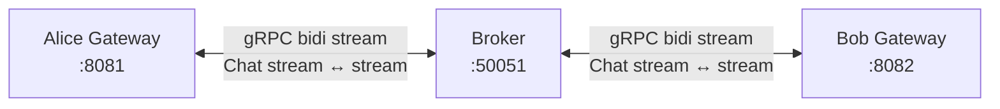
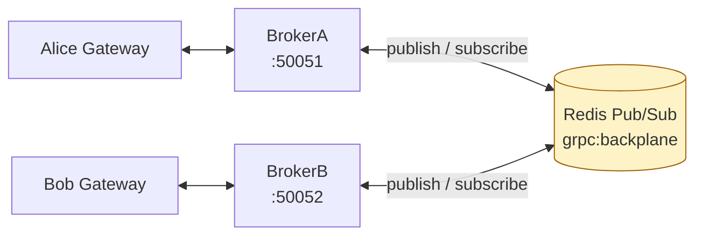

# gRPC Bidirectional Streaming как транспорт сообщений

## Содержание

- [Когда gRPC streaming вместо брокера](#когда-grpc-streaming-вместо-брокера)
- [Четыре типа вызовов gRPC](#четыре-типа-вызовов-grpc)
- [Protobuf: определение сервиса](#protobuf-определение-сервиса)
- [Архитектура: один брокер](#архитектура-один-брокер)
- [Сервер (Broker): fan-out через registry](#сервер-broker-fan-out-через-registry)
- [Клиент (Gateway): отправка и получение](#клиент-gateway-отправка-и-получение)
- [Несколько инстансов: backplane на Redis](#несколько-инстансов-backplane-на-redis)
- [Backpressure в gRPC streams](#backpressure-в-grpc-streams)
- [Что ломается в продакшене](#что-ломается-в-продакшене)
- [gRPC Streaming против брокера](#grpc-streaming-против-брокера)
- [Interview-ready answer](#interview-ready-answer)

gRPC streaming — альтернатива брокеру для связи сервис-сервис в реальном времени: постоянное соединение HTTP/2 вместо опроса очереди. Основы gRPC — [06-grpc.md](../08-networking-and-api/protocols/06-grpc.md), механика потоков и управления окнами HTTP/2 — [02-http2-and-http3.md](../08-networking-and-api/protocols/02-http2-and-http3.md).

---

## Когда gRPC streaming вместо брокера

```text
Модель с брокером:
  Producer → [Kafka/RabbitMQ] → Consumer
  + Persistence, replay, fan-out к независимым consumers
  - Дополнительная инфраструктура, latency (batching)

gRPC Streaming модель:
  Client ←────────────────────────→ Server (bidi stream)
  + Нет дополнительной инфраструктуры, низкая latency, типобезопасно
  - Нет persistence, нет replay, нет fan-out из коробки
```

gRPC streaming уместен, когда:
- нужна real-time двусторонняя связь (чат, collaboration, live updates);
- persistence и replay не требуются;
- gRPC уже используется между сервисами;
- важна типобезопасность через Protobuf.

---

## Четыре типа вызовов gRPC

```text
Unary:             Client ──req──► Server ──resp──► Client
Server streaming:  Client ──req──► Server ──resp1,2,3...──► Client
Client streaming:  Client ──req1,2,3...──► Server ──resp──► Client
Bidirectional:     Client ◄──────────────────────────────► Server
```

Bidirectional streaming — полный дуплекс: обе стороны отправляют и получают независимо.

---

## Protobuf: определение сервиса

```protobuf
// proto/chat/chat.proto
syntax = "proto3";
package chat;

option go_package = "gen/chat;chat";

message ChatMessage {
    string sender  = 1;
    string text    = 2;
    int64  sent_at = 3;  // unix timestamp
}

service ChatService {
    // Bidirectional stream: gateway ↔ broker
    rpc Chat(stream ChatMessage) returns (stream ChatMessage);
}
```

---

## Архитектура: один брокер



Broker — gRPC сервер. Каждый gateway открывает один постоянный bidi поток. Broker при получении сообщения от одного gateway — рассылает всем остальным.

---

## Сервер (Broker): fan-out через registry

Два правила, которые определяют всю конструкцию сервера, и нарушение любого из них даёт ошибку не сразу, а под нагрузкой.

**Правило первое.** `Send` на одном стриме нельзя вызывать из нескольких горутин одновременно: метод не потокобезопасен, и параллельная отправка ломает кадрирование HTTP/2. Наивная схема «горутина, читающая клиента A, рассылает сообщение прямо в стримы B и C» нарушает это правило сразу, потому что горутины A и D одновременно пишут в стрим B.

**Правило второе.** `Send` блокируется, когда окно потока HTTP/2 заполнено, то есть когда получатель не успевает читать. Рассылка в цикле по всем клиентам под общим мьютексом означает, что один медленный клиент останавливает рассылку всем остальным и держит блокировку реестра.

Из обоих правил следует одна и та же конструкция: у каждого клиента свой буферизованный канал и своя горутина-писатель, единственная, кто вызывает `Send`. Рассылка становится неблокирующей записью в каналы.

```go
type client struct {
    id     string
    out    chan *pb.ChatMessage // буфер на всплески
    stream grpc.BidiStreamingServer[pb.ChatMessage, pb.ChatMessage]
    done   chan struct{}
}

// writeLoop — единственное место, где вызывается Send для этого стрима.
func (c *client) writeLoop() {
    for {
        select {
        case msg := <-c.out:
            if err := c.stream.Send(msg); err != nil {
                close(c.done) // читающая горутина увидит это и завершит handler
                return
            }
        case <-c.done:
            return
        }
    }
}

func (s *Server) broadcastExcept(senderID string, msg *pb.ChatMessage) {
    s.mu.RLock()
    defer s.mu.RUnlock()

    for _, c := range s.clients {
        if c.id == senderID {
            continue
        }
        select {
        case c.out <- msg:
        default:
            // Клиент не успевает читать. Отбрасываем сообщение для него одного:
            // блокировка здесь остановила бы рассылку всем остальным.
            metrics.Dropped.WithLabelValues(c.id).Inc()
        }
    }
}
```

<details>
<summary>Регистрация стрима, чтение и запуск сервера целиком</summary>

```go
type Server struct {
    pb.UnimplementedChatServiceServer

    mu      sync.RWMutex
    clients map[string]*client // ключ — идентификатор клиента, а не сам стрим

    brokerID string
    rdb      *redis.Client // backplane между инстансами, опционально
}

// Chat вызывается на каждое новое подключение и живёт столько же, сколько стрим.
func (s *Server) Chat(stream grpc.BidiStreamingServer[pb.ChatMessage, pb.ChatMessage]) error {
    c := &client{
        id:     uuid.NewString(),
        out:    make(chan *pb.ChatMessage, 256),
        stream: stream,
        done:   make(chan struct{}),
    }

    s.mu.Lock()
    s.clients[c.id] = c
    s.mu.Unlock()

    go c.writeLoop()

    defer func() {
        s.mu.Lock()
        delete(s.clients, c.id)
        s.mu.Unlock()
        close(c.done) // остановить writeLoop
    }()

    for {
        msg, err := stream.Recv()
        if err != nil {
            return err // io.EOF при штатном закрытии клиентом, иначе ошибка транспорта
        }

        s.broadcastExcept(c.id, msg)
        s.publishToBackplane(msg) // для схемы с несколькими инстансами
    }
}

func (s *Server) Start(addr string) error {
    lis, err := net.Listen("tcp", addr)
    if err != nil {
        return err
    }
    gs := grpc.NewServer(
        // Долгоживущие стримы обязаны пинговаться, иначе балансировщики и NAT
        // тихо рвут «простаивающее» соединение.
        grpc.KeepaliveParams(keepalive.ServerParameters{
            Time:    30 * time.Second, // как часто пинговать при простое
            Timeout: 10 * time.Second, // сколько ждать ответ на пинг
        }),
        grpc.KeepaliveEnforcementPolicy(keepalive.EnforcementPolicy{
            MinTime:             15 * time.Second, // не отклонять частые пинги клиента
            PermitWithoutStream: true,
        }),
    )
    pb.RegisterChatServiceServer(gs, s)
    return gs.Serve(lis)
}
```

</details>

---

## Клиент (Gateway): отправка и получение

<details>
<summary>Транспорт клиента целиком: открытие стрима, чтение и отправка</summary>

```go
type ClientTransport struct {
    conn   *grpc.ClientConn
    stream grpc.BidiStreamingClient[pb.ChatMessage, pb.ChatMessage]
    ch     chan model.ChatMessage
    cancel context.CancelFunc
}

func NewClientTransport(brokerAddr string) (*ClientTransport, error) {
    conn, err := grpc.NewClient(brokerAddr,
        grpc.WithTransportCredentials(insecure.NewCredentials()),
    )
    if err != nil {
        return nil, err
    }
    
    client := pb.NewChatServiceClient(conn)
    ctx, cancel := context.WithCancel(context.Background())
    
    // Открываем bidirectional stream — долгоживущее соединение
    stream, err := client.Chat(ctx)
    if err != nil {
        cancel(); conn.Close()
        return nil, err
    }
    
    ct := &ClientTransport{
        conn: conn, stream: stream,
        ch: make(chan model.ChatMessage, 64),
        cancel: cancel,
    }
    go ct.recvLoop() // горутина для входящих сообщений
    return ct, nil
}

// recvLoop — читает входящие сообщения в фоне
func (c *ClientTransport) recvLoop() {
    defer close(c.ch)
    for {
        msg, err := c.stream.Recv()
        if err != nil {
            log.Printf("[grpc] recv error: %v", err)
            return // соединение закрыто
        }
        c.ch <- fromProto(msg)
    }
}

// Send — отправить сообщение на broker
func (c *ClientTransport) Send(ctx context.Context, msg model.ChatMessage) error {
    return c.stream.Send(toProto(msg))
}

func (c *ClientTransport) Messages() <-chan model.ChatMessage { return c.ch }
func (c *ClientTransport) Close() error { c.cancel(); return c.conn.Close() }
```

</details>

---

## Несколько инстансов: backplane на Redis

При горизонтальном масштабировании — несколько инстансов broker. Клиенты на разных инстансах не видят друг друга без backplane.



<details>
<summary>Публикация в backplane и подписка на сообщения других инстансов</summary>

```go
// При получении сообщения от клиента:
// 1. Broadcast локальным clients
// 2. Publish в Redis backplane (с broker_id чтобы не echo)

func (s *Server) publishToBackplane(msg *pb.ChatMessage) {
    if s.rdb == nil { return }
    
    bm := backplaneMessage{
        BrokerID: s.brokerID, // уникальный ID этого брокера
        Sender:   msg.Sender,
        Text:     msg.Text,
        SentAt:   msg.SentAt,
    }
    data, _ := json.Marshal(bm)
    s.rdb.Publish(context.Background(), "grpc:backplane", data)
}

// subscribeBackplane — слушает сообщения от других брокеров
func (s *Server) subscribeBackplane() {
    pubsub := s.rdb.Subscribe(context.Background(), "grpc:backplane")
    defer pubsub.Close()
    
    for redisMsg := range pubsub.Channel() {
        var bm backplaneMessage
        json.Unmarshal([]byte(redisMsg.Payload), &bm)
        
        // Пропускаем собственные сообщения (защита от echo loop)
        if bm.BrokerID == s.brokerID { continue }
        
        // Relay всем локальным клиентам
        s.broadcastAll(&pb.ChatMessage{
            Sender: bm.Sender,
            Text:   bm.Text,
            SentAt: bm.SentAt,
        })
    }
}
```

</details>

---

## Backpressure в gRPC streams

У HTTP/2 есть встроенное управление потоком по окнам: получатель объявляет, сколько байт готов принять, и отправитель останавливается, когда окно исчерпано. Механика окон разобрана в [02-http2-and-http3.md](../08-networking-and-api/protocols/02-http2-and-http3.md).

Для сервиса это означает, что `Send` — потенциально блокирующий вызов, и вся конструкция из раздела про сервер существует именно из-за этого. Три уровня, на которых давление нужно куда-то девать:

| Уровень | Что происходит при отставании получателя | Что делает сервис |
| --- | --- | --- |
| Окно HTTP/2 | `Send` блокируется до освобождения окна | вызывает `Send` только из своей горутины на клиента |
| Буферизованный канал клиента | канал заполняется | неблокирующая запись, при переполнении сообщение для этого клиента отбрасывается или клиент отключается |
| Приложение | обработка не успевает за приёмом | ограничение параллелизма, отбрасывание по приоритету, [backpressure и shedding](../05-system-design/reliability-patterns/05-backpressure-and-shedding.md) |

Выбор политики при переполнении буфера зависит от смысла данных. Для живых обновлений и статусов правильно отбросить сообщение: следующее всё равно перезапишет состояние. Для чата или ленты событий отбрасывание незаметно ломает историю, и честнее отключить клиента, чтобы он переподключился и загрузил состояние заново.

Hub-паттерн с буфером на клиента и горутинами-писателями разобран в [10-websocket.md](../08-networking-and-api/protocols/10-websocket.md), backplane на Redis — в [05-redis-pubsub.md](./05-redis-pubsub.md).

---

## Что ломается в продакшене

Три проблемы, которые не видны на локальной машине с одним инстансом и появляются при первой же реальной эксплуатации.

**Стрим не переподключается сам.** `grpc.NewClient` восстанавливает соединение и повторяет unary-вызовы, но сломанный стрим восстановлению не подлежит: после ошибки в `Recv` его нужно создавать заново. Без этого сервис молча перестаёт получать сообщения, оставаясь при этом «живым» для проверок готовности — ровно та же ловушка, что с amqp091-go в [RabbitMQ](./02-rabbitmq.md).

```go
func (c *ClientTransport) runWithReconnect(ctx context.Context) {
    backoff := 100 * time.Millisecond
    for ctx.Err() == nil {
        stream, err := c.client.Chat(ctx)
        if err == nil {
            backoff = 100 * time.Millisecond // соединились: сбрасываем выдержку
            err = c.recvLoop(stream)         // возвращается при обрыве стрима
        }
        log.Printf("[grpc] stream lost: %v, retry in %s", err, backoff)
        select {
        case <-time.After(backoff):
        case <-ctx.Done():
            return
        }
        if backoff < 5*time.Second {
            backoff *= 2
        }
    }
}
```

**Простаивающий стрим тихо умирает по таймауту посредников.** Балансировщики, NAT и сервисные меши закрывают соединения без трафика, а долгоживущий стрим в чате может молчать часами. Лечится keepalive-пингами с обеих сторон: параметры сервера показаны выше, на клиенте это `grpc.WithKeepaliveParams` с `PermitWithoutStream`. Без согласования настроек получается вторая типичная ошибка: клиент пингует чаще, чем разрешает `MinTime` сервера, и сервер сам разрывает соединение как нарушающее политику.

**Балансировка ломается на долгих соединениях.** Балансировщик уровня L4 распределяет соединения, а не запросы, поэтому стрим, однажды попавший на инстанс, остаётся там до разрыва. После перезапуска или добавления инстансов нагрузка распределяется неравномерно и сама не выравнивается: новый инстанс стоит пустым, пока клиенты не переподключатся. Варианты решения — принудительно ограничивать время жизни соединения на сервере (`MaxConnectionAge` в keepalive-параметрах, чтобы клиенты периодически переподключались и перераспределялись), балансировка на стороне клиента с разрешением всех адресов сервиса или прокси уровня L7, понимающий gRPC.

---

## gRPC Streaming против брокера

| | gRPC Bidi Stream | Kafka/RabbitMQ |
|---|---|---|
| Persistence | ❌ | ✅ |
| Replay | ❌ | ✅ (Kafka) |
| Fan-out к независимым consumers | ❌ (вручную) | ✅ |
| Latency | Очень низкая | Выше |
| Типобезопасность | ✅ Protobuf | ⚠️ схема отдельно |
| Дополнительная инфраструктура | ❌ | ✅ broker cluster |
| Horizontal scaling | Через backplane | Встроено |
| Use case | Real-time, service mesh | Event streaming, async processing |

---

## Interview-ready answer

**1. Когда gRPC streaming вместо Kafka?**

- Когда нужна двусторонняя связь в реальном времени без хранения: чат, совместное редактирование, живой дашборд, поток обновлений в интерфейс.
- Плюсы — нет отдельной инфраструктуры, минимальная задержка, контракт описан в Protobuf и проверяется компилятором.
- Минусы — нет хранения, нет повторного чтения, нет веерной доставки независимым получателям: всё это пришлось бы реализовывать самому.
- Формулировка выбора — это транспорт, а не брокер: если сообщение обязано пережить перезапуск получателя, нужен брокер.

**2. Как масштабировать сервер со стримами горизонтально?**

- Проблема та же, что у веб-сокетов: клиенты на разных инстансах друг друга не видят.
- Решение — backplane: каждый инстанс публикует сообщение в Redis Pub/Sub или NATS и подписан на тот же канал, полученное рассылает своим локальным стримам.
- Защита от петли — идентификатор инстанса в сообщении: своё собственное сообщение из backplane игнорируется.
- Подвох балансировки — L4-балансировщик распределяет соединения, а не запросы, поэтому после перезапуска нагрузка не выравнивается сама; помогают ограничение времени жизни соединения, клиентская балансировка или L7-прокси.

**3. Какие ошибки чаще всего допускают в реализации?**

- Вызов `Send` на одном стриме из нескольких горутин — метод не потокобезопасен; на клиента нужна одна горутина-писатель.
- Рассылка через `Send` под общим мьютексом — `Send` блокируется при заполненном окне HTTP/2, поэтому один медленный клиент останавливает рассылку всем.
- Отсутствие политики переполнения буфера — для живых обновлений сообщение отбрасывают, для истории клиента отключают, чтобы он перечитал состояние.
- Ожидание, что клиент переподключится сам — соединение восстановится, а стрим нет: его создают заново с выдержкой.
- Отсутствие keepalive — простаивающий стрим тихо рвут посредники, и сервис остаётся «живым», но перестаёт получать сообщения.

**4. Где здесь backpressure и кто его обеспечивает?**

- На транспорте — окна HTTP/2: получатель объявляет, сколько байт готов принять, отправитель останавливается при исчерпании окна.
- В приложении — буфер на клиента и решение, что делать при переполнении; транспорт сам данные не выбрасывает, он лишь блокирует отправителя.
- Ограничение приёма — параллелизм обработки и отбрасывание по приоритету, иначе давление просто переезжает с сети на память процесса.
- Отличие от брокера — в брокере отставание превращается в рост очереди и измеряется lag-ом; здесь отставание превращается в блокировку записи, а мерой служат размер буфера и число отброшенных сообщений.
