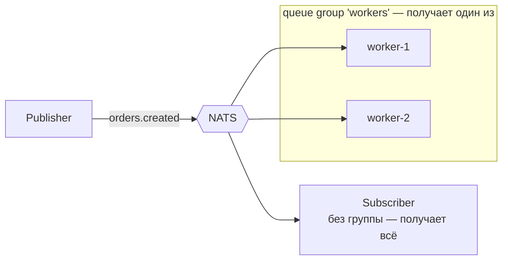

# NATS

NATS — лёгкий messaging-сервер (один Go-бинарь ~20 МБ, CNCF-проект) с двумя слоями: **Core NATS** — сверхбыстрый fire-and-forget pub/sub с request-reply, и **JetStream** — надстройка с персистентностью, at-least-once и стримами. Ниша — «нервная система» микросервисов: обмен сообщениями и RPC с минимальной latency и минимальной эксплуатацией, там где [Kafka](./01-kafka.md) избыточна, а [RabbitMQ](./02-rabbitmq.md) тяжеловат.

## Содержание

- [Ниша NATS](#ниша-nats)
- [Core NATS: subjects, pub/sub, request-reply, queue groups](#core-nats-subjects-pubsub-request-reply-queue-groups)
- [JetStream: персистентность и at-least-once](#jetstream-персистентность-и-at-least-once)
- [NATS в Go](#nats-в-go)
- [Когда NATS, когда Kafka/RabbitMQ](#когда-nats-когда-kafkarabbitmq)
- [Типичные ошибки](#типичные-ошибки)
- [Interview-ready answer](#interview-ready-answer)

## Ниша NATS

Что отличает NATS от «больших» брокеров:

- **Эксплуатация**: один статический бинарь, кластер из трёх узлов поднимается флагом `--routes`; нет ZooKeeper (как в старой Kafka) и Erlang-рантайма (как в RabbitMQ). Родной для Kubernetes (официальный Helm chart, лёгкие sidecar-топологии).
- **Latency**: суб-миллисекундная доставка в Core-режиме — сообщения не пишутся на диск.
- **Request-reply из коробки** — встроенный RPC-паттерн, которого нет ни у Kafka, ни у RabbitMQ (там его собирают руками через reply-to очереди/топики).
- **Топологии**: leaf nodes (edge-узлы, подключённые к центральному кластеру), superclusters с гейтвеями между регионами, multi-tenancy через accounts — поэтому NATS популярен в IoT/edge и связке «облако + устройства».

## Core NATS: subjects, pub/sub, request-reply, queue groups

### Subjects и wildcards

Адресация — по строковым **subjects** с иерархией через точку. Подписка поддерживает wildcards:

- `*` — ровно один токен: `orders.*.eu` поймает `orders.created.eu`;
- `>` — весь хвост: `orders.>` поймает `orders.created.eu.retail`.

Это покрывает большую часть того, что в RabbitMQ делается topic exchange — но без объявления exchanges, queues и bindings: подписка на subject и есть вся топология.

### Pub/Sub — at-most-once

Core NATS — **interest-based** и **fire-and-forget**: сообщение доставляется тем, кто подписан прямо сейчас, и нигде не сохраняется. Нет подписчика — сообщение исчезло. Подписчик отстаёт — сервер, защищая себя, отключает его как slow consumer, и пропущенное не вернётся. Семантика — at-most-once, аналог [Redis Pub/Sub](./04-redis-pubsub.md), только с кластеризацией и wildcards.

### Request-reply

Встроенный RPC: клиент публикует запрос с автоматически сгенерированным reply-subject (inbox), получатель отвечает туда. С точки зрения кода это один вызов с таймаутом. Паттерн масштабируется сам: если получатели состоят в queue group, запрос обработает один из них — получается load-balanced RPC без балансировщика.

### Queue groups

Аналог competing consumers: подписчики с одним именем группы делят поток — каждое сообщение получает **один** участник группы. Подписчики без группы получают всё (broadcast). Никаких заранее объявленных очередей: группа существует, пока есть подписчики.



## JetStream: персистентность и at-least-once

JetStream — слой поверх Core NATS (включается флагом `-js`), добавляющий то, чего Core принципиально не даёт: хранение, повторную доставку и replay.

### Stream

**Stream** захватывает сообщения по subjects и пишет их в лог (file или memory storage, репликация через Raft — 1/3/5 копий). Retention-политики:

- `limits` (default) — хранить по ограничениям `MaxAge`/`MaxBytes`/`MaxMsgs` — аналог retention в Kafka;
- `interest` — хранить, пока есть consumers, которые ещё не подтвердили;
- `work-queue` — сообщение удаляется после ack **одним** consumer-ом — семантика классической задачной очереди.

### Consumer

**Consumer** — курсор по стриму (durable или ephemeral, pull или push; современный API — pull). Ключевые настройки: `AckPolicy: explicit` (подтверждение каждого сообщения), `AckWait` (не подтвердил за N секунд → redelivery), `MaxDeliver` (лимит попыток). Возможен replay — consumer создаётся с любой стартовой позиции (`DeliverAll`, по времени, по sequence).

Нативного DLQ нет: после `MaxDeliver` сервер публикует advisory-событие `MAX_DELIVERIES` — DLQ собирается подпиской на advisories либо явным `Term` с публикацией в отдельный stream.

### Exactly-once с оговорками

- **Публикация**: заголовок `Nats-Msg-Id` включает дедупликацию — повторная публикация с тем же id в пределах dedup window (default 2 минуты) отбрасывается.
- **Потребление**: double-ack (`AckSync`) — подтверждение с подтверждением от сервера.

Вместе это «effectively once» в пределах окна — как и в Kafka, сквозной exactly-once во внешние системы не существует, приёмнику нужна идемпотентность ([06-idempotency.md](../05-system-design/reliability-patterns/06-idempotency.md)).

### KV и Object Store

Поверх стримов JetStream предоставляет **Key-Value store** (compacted-стрим: последнее значение на ключ, watch на изменения, TTL, CAS-операции) и **Object store** (чанкованные большие объекты). KV закрывает часть сценариев Redis/etcd — конфиги, service discovery, feature flags — без дополнительной системы в стеке.

## NATS в Go

Клиент — `github.com/nats-io/nats.go`.

### Core: pub/sub, request-reply, queue group

```go
nc, _ := nats.Connect("nats://localhost:4222",
    nats.MaxReconnects(-1), // клиент сам переподключается (в отличие от amqp091-go)
)
defer nc.Drain() // дообработать полученное перед закрытием

// Pub/Sub
nc.Subscribe("orders.*", func(m *nats.Msg) {
    log.Printf("subject=%s payload=%s", m.Subject, m.Data)
})
nc.Publish("orders.created", orderJSON)

// Queue group: сообщение получит один worker из группы
nc.QueueSubscribe("tasks.email", "email-workers", func(m *nats.Msg) {
    sendEmail(m.Data)
})

// Request-reply: RPC одним вызовом
resp, err := nc.Request("svc.users.get", []byte(`{"id":42}`), 2*time.Second)

// Ответчик
nc.Subscribe("svc.users.get", func(m *nats.Msg) {
    m.Respond(userJSON)
})
```

### JetStream: stream + pull consumer

```go
import "github.com/nats-io/nats.go/jetstream"

js, _ := jetstream.New(nc)

// Stream: захватывает все subjects orders.>, хранит 7 дней
s, _ := js.CreateOrUpdateStream(ctx, jetstream.StreamConfig{
    Name:      "ORDERS",
    Subjects:  []string{"orders.>"},
    Storage:   jetstream.FileStorage,
    Retention: jetstream.LimitsPolicy,
    MaxAge:    7 * 24 * time.Hour,
    Replicas:  3, // Raft-репликация
})

// Публикация с дедупликацией: повтор с тем же Msg-Id в окне отбрасывается
js.Publish(ctx, "orders.created", orderJSON, jetstream.WithMsgID(orderID))

// Durable pull consumer: at-least-once
cons, _ := s.CreateOrUpdateConsumer(ctx, jetstream.ConsumerConfig{
    Durable:    "order-processor",
    AckPolicy:  jetstream.AckExplicitPolicy,
    AckWait:    30 * time.Second, // нет ack за 30с → redelivery
    MaxDeliver: 5,                // лимит попыток
})

cc, _ := cons.Consume(func(m jetstream.Msg) {
    if err := processOrder(m.Data()); err != nil {
        m.Nak() // немедленная повторная доставка
        return
    }
    m.Ack() // подтверждение ПОСЛЕ обработки
})
defer cc.Stop()
```

## Когда NATS, когда Kafka/RabbitMQ

| | Core NATS | JetStream | Kafka | RabbitMQ |
|---|---|---|---|---|
| Модель | interest-based pub/sub + RPC | стрим с consumers | распределённый лог | очереди + routing |
| Delivery | at-most-once | at-least-once (+dedup window) | at-least-once / EOS | at-least-once |
| Persistence | ❌ | ✅ file/memory, Raft | ✅ retention днями+ | ✅ durable/quorum |
| Replay | ❌ | ✅ с любой позиции | ✅ с любого offset | ❌ |
| Request-reply | ✅ встроен | ✅ | ❌ (руками) | ⚠️ RPC-паттерн руками |
| Throughput | миллионы msg/s | сотни тысяч | миллионы (batching) | 50–100k |
| Эксплуатация | минимальная | низкая | высокая | умеренная |

NATS выигрывает, когда нужен лёгкий messaging + RPC между сервисами, edge/IoT-топологии, минимальная эксплуатация, суб-миллисекундная latency. JetStream закрывает задачи «надёжная очередь + умеренный стриминг» в одном бинаре.

Kafka остаётся сильнее для тяжёлого event streaming: долгий retention террабайтами, reprocessing больших историй, экосистема (Connect, Streams, schema registry), партиционирование с гарантией порядка по ключу. RabbitMQ — когда нужны богатые очередные фичи: сложные exchange-топологии, per-message TTL, priorities, федерация с legacy AMQP-системами.

Сводная таблица по всем брокерам — [07-comparison.md](./07-comparison.md).

## Типичные ошибки

### 1. Core NATS там, где терять нельзя

Core — fire-and-forget: перезапуск подписчика, сетевое моргание или slow consumer — и сообщения пропали. Всё, что должно пережить сбой (задачи, события заказов), — только через JetStream или другой персистентный брокер. Core — для сигналов «важно сейчас»: presence, live-обновления, cache invalidation, RPC.

### 2. Ожидание Kafka-семантики от JetStream

JetStream — не полный аналог Kafka: нет партиций с ключами (порядок — в пределах subject, параллелизм consumers масштабируется иначе), retention обычно короче, нет экосистемы стрим-процессинга. Проекты, которым нужен «Kafka-стиль» на годы истории и десятки consumer groups, упрутся в ограничения.

### 3. Нет обработки лимита доставок

`MaxDeliver` без подписки на advisory `MAX_DELIVERIES` — сообщения молча исчерпывают попытки и зависают/теряются для бизнес-логики. Нужен аналог DLQ: advisory-подписка или `Term` + отдельный stream для разбора.

### 4. Игнорирование slow consumer в Core

Если подписчик не успевает вычитывать, клиентская библиотека копит буфер и затем **дропает** сообщения (ошибка slow consumer). Мониторить `nc.Statistics`/error handler, а не удивляться «куда делись сообщения».

## Interview-ready answer

**1. Чем NATS отличается от Kafka?**

- NATS — лёгкий messaging (один бинарь, суб-мс latency, request-reply из коробки): Core — at-most-once pub/sub, JetStream добавляет персистентность и at-least-once. Kafka — тяжёлый распределённый лог для high-throughput стриминга с retention и replay на большие истории. NATS берут для сервис-сервис messaging/RPC и edge; Kafka — для event streaming и event sourcing.

**2. Core NATS vs JetStream?**

- Core: interest-based fire-and-forget — доставка только живым подписчикам, без хранения, at-most-once, максимальная скорость. JetStream: стрим поверх тех же subjects — файловое хранение с Raft-репликацией, durable consumers, ack/redelivery, replay, дедупликация по Msg-Id. Правило: сигнал — Core, факт — JetStream.

**3. Как в NATS сделать competing consumers и broadcast?**

- Queue group: подписчики с одним именем группы делят поток, сообщение получает один из них. Подписчики без группы получают всё — broadcast без настройки. В JetStream work-sharing даёт work-queue retention или общий durable consumer.

**4. Есть ли в NATS exactly-once?**

- «Effectively once»: дедупликация публикации по `Nats-Msg-Id` в пределах dedup window (default 2 мин) + double-ack на потреблении. Как и в Kafka, сквозной exactly-once во внешние системы невозможен — нужна идемпотентность приёмника.

**5. Когда выбрать NATS вместо RabbitMQ?**

- Когда важны простота эксплуатации (один бинарь vs Erlang-кластер), latency, встроенный request-reply и k8s/edge-топологии (leaf nodes), а маршрутизации wildcards по subjects достаточно. RabbitMQ — когда нужны богатые очередные механики: приоритеты, per-message TTL, сложные exchange-топологии, AMQP-совместимость с legacy.
