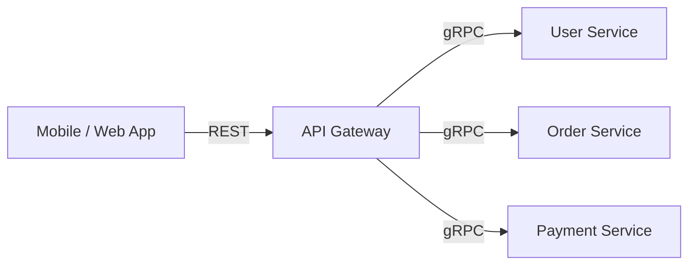
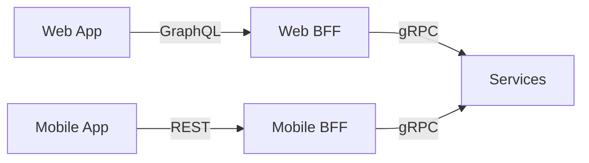
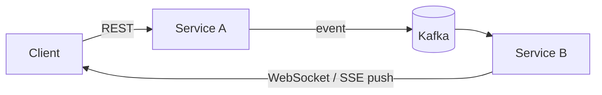

# Сравнение протоколов API

## Содержание

- [Большая таблица](#большая-таблица)
- [Decision tree](#decision-tree)
- [Trade-offs по протоколам](#trade-offs-по-протоколам)
- [Смешанные архитектуры](#смешанные-архитектуры)
- [Выбор по типу взаимодействия](#выбор-по-типу-взаимодействия)
- [Interview-ready answer](#interview-ready-answer)

Точка входа в раздел и одновременно сводка после него. Как точка входа: decision tree и таблица отвечают на вопрос «что здесь вообще есть и что брать под мою задачу», подсказывая, какой протокол разбирать первым. Как сводка: границы применимости и trade-offs становятся осмысленными, когда механика каждого протокола уже знакома.

Транспорт, на котором стоит почти всё перечисленное, разобран отдельно — [HTTP/1.1, HTTP/2 и HTTP/3](./02-http/01-http-versions.md).

---

## Большая таблица

| | [REST](./03-api-styles/01-rest-and-http-semantics.md) | [gRPC](./03-api-styles/02-grpc.md) | [GraphQL](./03-api-styles/03-graphql.md) | [WebSocket](./04-realtime/01-websocket.md) | [SSE](./04-realtime/02-sse.md) | [Webhooks](./05-integration-patterns/01-webhooks.md) | [WebRTC](./04-realtime/03-webrtc.md) | [SOAP](./03-api-styles/05-soap.md) |
|---|---|---|---|---|---|---|---|---|
| **Транспорт** | HTTP/1.1–2 | HTTP/2 | HTTP/1.1–2 | TCP (upgrade из HTTP) | HTTP (длинный response) | HTTP/1.1–2 | UDP/DTLS | HTTP/SMTP |
| **Формат данных** | JSON/XML | Protobuf | JSON | любой | text/event-stream | JSON | binary | XML |
| **Streaming** | SSE/polling | встроено (4 типа) | subscriptions | ✅ full-duplex | ✅ только сервер → клиент | ❌ | ✅ P2P | ❌ |
| **Из браузера** | ✅ нативно | ❌ (grpc-web) | ✅ | ✅ | ✅ (EventSource, авто-reconnect) | ✅ (server-side) | ✅ | ✅ |
| **Контракт и типы** | OpenAPI opt. | ✅ Protobuf | ✅ Schema | ❌ | ❌ | ❌ | ❌ | ✅ WSDL |
| **HTTP-кэширование** | ✅ HTTP cache | ❌ | ❌ (POST) | ❌ | ❌ | ❌ | ❌ | ❌ |
| **Читаемость глазами** | ✅ JSON | ❌ binary | ✅ JSON | зависит | ✅ | ✅ JSON | ❌ | ⚠️ verbose XML |
| **Инфраструктура** | минимум | минимум | минимум | backplane при масштабировании | минимум | публичный endpoint | STUN/TURN | минимум |
| **Сложность** | низкая | средняя | высокая | средняя | низкая | низкая | высокая | высокая |
| **Производительность** | средний | высокий | средний | высокий | средний | средний | P2P высокий | низкий |
| **Ниша сегодня** | публичные API | сервис-сервис | multi-client backend | двусторонний real-time | односторонний push | интеграции между системами | P2P медиа | legacy |

Строка «Транспорт» важнее, чем кажется: мультиплексирование HTTP/2 определяет, будут ли параллельные вызовы мешать друг другу, а отсутствие мультиплексирования в HTTP/1.1 — причина, по которой WebSocket и SSE ведут себя в старой инфраструктуре по-разному. Механика разобрана в [02-http/01-http-versions.md](./02-http/01-http-versions.md).

---

## Decision tree

Идти сверху вниз, первый подходящий вопрос даёт ответ:

| # | Вопрос | Если да | Почему |
| --- | --- | --- | --- |
| 1 | Публичный API для сторонних разработчиков? | REST | знаком всем, curl-friendly, HTTP caching |
| 2 | Синхронный вызов сервис-сервис? | gRPC | строгий контракт, скорость, streaming |
| 3 | Несколько клиентов с разными потребностями в данных? | GraphQL | клиент сам выбирает поля |
| 4 | Двусторонний обмен в реальном времени (чат, совместное редактирование)? | WebSocket | full-duplex канал |
| 5 | Поток только от сервера к клиенту (уведомления, котировки, прогресс)? | SSE | проще WebSocket, авто-reconnect |
| 6 | Уведомления о событиях в чужом сервисе? | Webhooks | GitHub, Stripe, Twilio |
| 7 | Медиа между пирами напрямую (аудио, видео, экран)? | WebRTC | трафик напрямую между пирами |
| 8 | Интеграция с legacy-системами (банки, SAP)? | SOAP | вынужденно |

---

## Trade-offs по протоколам

**REST** — универсальный выбор по умолчанию для публичных API: HTTP-методы и статус-коды знакомы всем, GET-запросы кэшируются CDN и браузером, отладка — curl/Postman, stateless-модель легко масштабируется горизонтально. Плата — over-fetching (endpoint возвращает 50 полей, когда клиенту нужно 3) и under-fetching (три запроса там, где хватило бы одного), а контракт без OpenAPI остаётся джентльменским соглашением. Streaming приходится добирать отдельными протоколами (SSE, WebSocket). Подробно про сам стиль, уровни зрелости и механизмы HTTP, которые делают его рабочим, — [03-api-styles/01-rest-and-http-semantics.md](./03-api-styles/01-rest-and-http-semantics.md).

**gRPC** — стандарт для сервис-сервис вызовов: строгий контракт Protobuf с кодогенерацией, binary-сериализация в 3–10 раз компактнее JSON, мультиплексирование и 4 типа streaming поверх HTTP/2, interceptors для сквозных задач. Плата — браузер требует grpc-web proxy, binary payload сложнее отлаживать, нужен proto-toolchain. Подробно: [03-api-styles/02-grpc.md](./03-api-styles/02-grpc.md).

**GraphQL** — решение для нескольких типов клиентов с разными потребностями: клиент сам определяет форму ответа, один endpoint, schema даёт автодокументацию через introspection. Плата — N+1 без DataLoader, POST-запросы лишают HTTP-кэширования, introspection в проде отключается (утечка схемы), нужна защита от дорогих запросов (depth limiting, complexity scoring). Подробно: [03-api-styles/03-graphql.md](./03-api-styles/03-graphql.md).

**WebSocket** — полнодуплексный канал для двустороннего real-time: низкая latency, браузерная поддержка нативная. Плата — stateful-соединение: горизонтальное масштабирование требует backplane (pub/sub между инстансами), прокси и firewall рвут долгие соединения, reconnect и retry пишутся вручную. Подробно: [04-realtime/01-websocket.md](./04-realtime/01-websocket.md).

**SSE** — односторонний поток сервер → клиент поверх обычного HTTP: EventSource в браузере с автоматическим reconnect из коробки, проще WebSocket и проходит через любую HTTP-инфраструктуру. Плата — только текст, только в одну сторону; отправка данных на сервер идёт обычными запросами рядом. Подробно: [04-realtime/02-sse.md](./04-realtime/02-sse.md).

**Webhooks** — push-интеграция между системами: обычный HTTP POST на подписанный endpoint, нет polling, at-least-once через retry. Плата — endpoint получателя должен быть публично доступен и проверять подпись (HMAC), порядок доставки не гарантирован, отладка сложнее — инициатор на другой стороне. Подробно: [05-integration-patterns/01-webhooks.md](./05-integration-patterns/01-webhooks.md).

**WebRTC** — P2P-медиа (видео, аудио, screen sharing) с минимальной latency: трафик идёт напрямую между пирами. Плата — самая сложная инфраструктура из списка: signaling-сервер, STUN/TURN для обхода NAT, SFU для групповых звонков. Подробно: [04-realtime/03-webrtc.md](./04-realtime/03-webrtc.md).

**SOAP** — XML-протокол эпохи enterprise: строгий контракт WSDL, WS-Security. Сегодня выбирается только вынужденно — интеграция с банками, SAP и другим legacy. Подробно: [03-api-styles/05-soap.md](./03-api-styles/05-soap.md).

---

## Смешанные архитектуры

В реальных системах протоколы комбинируются.

**API Gateway** — клиенты говорят на REST (знакомо, кэшируется), внутри — gRPC (быстро, типобезопасно), gateway транслирует:

**BFF (Backend For Frontend)** — свой фасад под каждый тип клиента:

**Синхронный вход + асинхронное распространение** — запрос принимается синхронно, событие уходит через брокер, второй сервис пушит обновление клиенту:

---

## Выбор по типу взаимодействия

| Тип взаимодействия | Выбор |
| --- | --- |
| Клиент → сервер (request/response) | REST (публичный API) или gRPC (internal) |
| Сервер → клиент (push) | SSE (односторонний поток), WebSocket (двусторонний real-time), Webhooks (событийные интеграции) |
| Сервис → сервис | gRPC (sync) или message broker (async) |
| P2P медиа | WebRTC |
| Legacy enterprise | SOAP (вынужденно) |

---

## Interview-ready answer

**1. REST или gRPC — когда что?**

- REST — публичные API: работает из браузера без прослоек, кэшируется CDN, отлаживается через curl, знаком всем.
- gRPC — вызовы между своими сервисами: контракт в Protobuf с кодогенерацией, компактная бинарная сериализация, мультиплексирование и стриминг поверх HTTP/2.
- Цена gRPC — из браузера нужен прокси grpc-web, полезная нагрузка не читается глазами, требуется инструментарий сборки proto.
- На практике берут оба: REST-шлюз наружу, gRPC внутри, и это самый частый ответ на собеседовании.

**2. Зачем GraphQL, если есть REST?**

- Задача — несколько типов клиентов с разными потребностями: мобильному нужны три поля, десктопу двадцать, телевизору другие пять.
- Решение — клиент сам описывает форму ответа, один эндпоинт обслуживает всех, схема даёт автодокументацию.
- Цена — проблема N+1 без DataLoader, потеря HTTP-кэширования из-за POST, необходимость ограничивать сложность запросов.
- Когда не нужен — один клиент и стабильный набор полей: GraphQL добавит сложность, ничего не решив.

**3. WebSocket или REST с опросом?**

- Опрос создаёт лишние запросы, большинство из которых возвращают пустой ответ, и добавляет задержку до следующего интервала.
- WebSocket держит соединение и отдаёт данные сразу, но становится состоянием: инстанс помнит, кто к нему подключён.
- Следствие — горизонтальное масштабирование требует backplane, а прокси и балансировщики рвут простаивающие соединения.
- Промежуточный вариант — длинный опрос: сложность близка к обычному HTTP, задержка ниже обычного опроса, но соединение всё равно занято.

**4. SSE или WebSocket?**

- Направление — если поток идёт только к клиенту (уведомления, лента, прогресс, стриминг ответа модели), достаточно SSE.
- Инфраструктура — SSE это обычный HTTP-ответ, он проходит через прокси и балансировщики без отдельной настройки upgrade.
- Переподключение — у SSE встроено в браузерный клиент вместе с `Last-Event-ID`, у WebSocket пишется руками.
- WebSocket оправдан, когда клиент шлёт данные так же интенсивно, как получает: чат, игры, совместное редактирование.

**5. Как выбирать протокол в общем случае?**

- Сначала направление и частота обмена: запрос-ответ, поток к клиенту, двусторонний поток или уведомление в чужую систему.
- Затем кто клиент: браузер, мобильное приложение, свой сервис или внешний партнёр — это отсекает половину вариантов.
- Затем требования к контракту: нужна ли кодогенерация и строгая схема или важнее читаемость и знакомость.
- И только в конце — производительность: на большинстве продуктовых нагрузок разница между протоколами меньше, чем стоимость неудобной для команды технологии.
