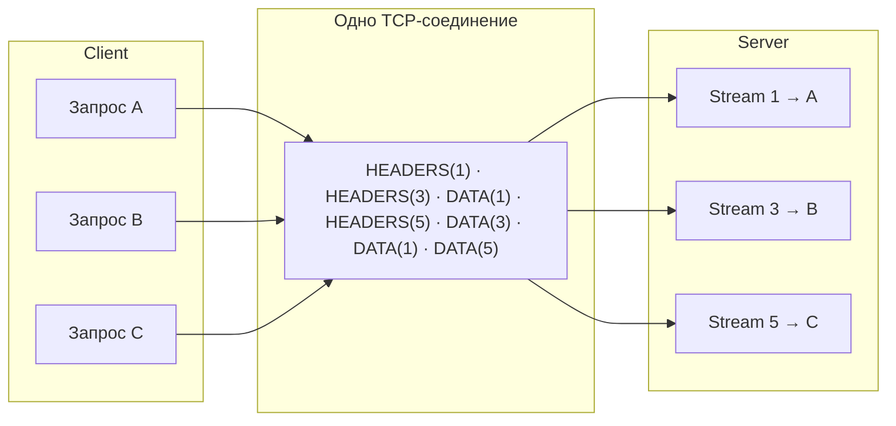

# HTTP/1.1, HTTP/2 и HTTP/3

## Содержание

- [Эволюция коротко](#эволюция-коротко)
- [HTTP/1.1: keep-alive и его пределы](#http11-keep-alive-и-его-пределы)
- [HTTP/2: бинарный фрейминг и мультиплексирование](#http2-бинарный-фрейминг-и-мультиплексирование)
- [HPACK: сжатие заголовков](#hpack-сжатие-заголовков)
- [Flow control, приоритеты, server push](#flow-control-приоритеты-server-push)
- [Что HTTP/2 не решил: TCP head-of-line](#что-http2-не-решил-tcp-head-of-line)
  - [Кто именно переотправляет потерянное](#кто-именно-переотправляет-потерянное)
- [h2, h2c и ALPN](#h2-h2c-и-alpn)
- [HTTP/3 и QUIC](#http3-и-quic)
- [Как gRPC ложится на HTTP/2](#как-grpc-ложится-на-http2)
- [HTTP/2 в Go](#http2-в-go)
- [Типичные ошибки](#типичные-ошибки)
- [Interview-ready answer](#interview-ready-answer)

Все версии HTTP разделяют одну семантику (методы, статус-коды, заголовки — RFC 9110) и различаются транспортным слоем: как байты запросов и ответов упаковываются и едут по сети. Каждая новая версия решает конкретное узкое место предыдущей, и почти вся история сводится к одной проблеме — head-of-line blocking на разных уровнях стека.
Head-of-line (HoL) blocking — «блокировка головой очереди»: первый элемент в очереди не готов, и все за ним ждут, даже если сами давно готовы.

---

## Эволюция коротко

| | HTTP/1.1 (1997) | HTTP/2 (2015) | HTTP/3 (2022) |
| --- | --- | --- | --- |
| RFC | 9112 | 9113 (бывший 7540) | 9114 |
| Формат | текстовый | бинарные фреймы | бинарные фреймы |
| Транспорт | TCP | TCP | QUIC (UDP) |
| Запросов на соединение одновременно | 1 | много (streams) | много (streams) |
| Сжатие заголовков | нет | HPACK | QPACK |
| HoL blocking | на уровне HTTP | убран в HTTP, остался в TCP | убран и в транспорте |
| TLS | опционально, отдельный handshake | де-факто обязателен (ALPN) | встроен (TLS 1.3), 0–1 RTT |
| Какую проблему решает | соединение на каждый запрос (HTTP/1.0) | очередь запросов, дублирование заголовков | потеря пакета тормозит все стримы |

---

## HTTP/1.1: keep-alive и его пределы

HTTP/1.0 открывал TCP-соединение на каждый запрос — с трёхсторонним handshake и slow start каждый раз. HTTP/1.1 добавил keep-alive: соединение переиспользуется для следующих запросов (см. connection pooling в [04-http-client.md](./04-http-client.md)).

Но внутри одного соединения HTTP/1.1 строго последовательный: один запрос → дождаться ответа целиком → следующий запрос. Это и есть HoL blocking на уровне HTTP: медленный ответ блокирует все запросы за ним.

Попытки обойти:

- **Pipelining** — слать несколько запросов не дожидаясь ответов. Провалился: ответы всё равно обязаны приходить строго по порядку (медленный первый ответ держит остальные), а прокси массово ломали реализацию. Выключен во всех браузерах.
- **Параллельные соединения** — браузеры открывают до 6 TCP-соединений на хост. Помогает, но дорого: 6 handshake, 6 slow start, 6 congestion window.
- **Домен-шардинг, спрайты, конкатенация JS/CSS** — хаки эпохи 1.1, чтобы обойти лимит соединений и цену запроса. С HTTP/2 стали антипаттернами.

---

## HTTP/2: бинарный фрейминг и мультиплексирование

Ключевая идея HTTP/2: вместо текстового «запрос за запросом» — бинарный фрейминг внутри одного TCP-соединения.

Три уровня:

- **Соединение** — одно TCP-соединение на origin.
- **Stream** — независимый двунаправленный «виртуальный канал» внутри соединения; один stream = один request/response. У каждого stream свой id (нечётные — инициированы клиентом).
- **Frame** — минимальная единица протокола; фреймы разных стримов **перемешиваются** в соединении и собираются обратно по stream id.

Основные типы фреймов: `HEADERS` (заголовки), `DATA` (тело), `SETTINGS` (параметры соединения), `WINDOW_UPDATE` (flow control), `RST_STREAM` (оборвать один stream), `GOAWAY` (закрыть соединение gracefully), `PING` (keepalive).



Что это даёт:

- **Мультиплексирование**: десятки запросов летят параллельно в одном соединении; медленный ответ не блокирует остальные — его `DATA`-фреймы просто перемежаются с другими. HoL blocking на уровне HTTP исчез.
- **Одно соединение на origin**: один handshake, один прогретый congestion window, меньше памяти на сервере; лимит параллелизма — `SETTINGS_MAX_CONCURRENT_STREAMS` (обычно 100+), а не 6 соединений.
- **Отмена без разрыва**: `RST_STREAM` обрывает один запрос, соединение и остальные стримы живут (в HTTP/1.1 отмена = разорвать соединение целиком).

---

## HPACK: сжатие заголовков

В HTTP/1.1 заголовки повторяются в каждом запросе открытым текстом: `cookie`, `user-agent`, `authorization` — сотни байт на каждый запрос, и сжимать их нельзя было ещё и из-за атак на сжатие (CRIME: наблюдая размер сжатого текста, можно посимвольно угадать секрет внутри него).

HPACK решает обе проблемы:

- **статическая таблица** — 61 частый заголовок (`:method: GET`, `content-type` и т.п.) кодируются одним байтом;
- **динамическая таблица** — заголовки, уже переданные в этом соединении, дальше передаются как короткая ссылка на индекс: `cookie` из 400 байт после первого запроса стоит 1–2 байта;
- **Huffman-кодирование** новых значений;
- устойчивость к CRIME: никакого потокового gzip, только табличные ссылки и литералы.

Служебные данные запроса переехали в псевдозаголовки `:method`, `:path`, `:scheme`, `:authority`, `:status` — стартовой строки больше нет, всё единообразно кодируется HPACK.

---

## Flow control, приоритеты, server push

**Flow control.** Быстрый отправитель не должен заваливать медленного получателя: у каждого stream и у соединения в целом есть окно (по умолчанию 64 КБ), получатель расширяет его фреймами `WINDOW_UPDATE` по мере вычитывания. Это то, что позволяет качать большой файл и параллельно гонять мелкие API-запросы в одном соединении — большой стрим упирается в своё окно, не съедая всё соединение.

**Приоритеты.** RFC 7540 описывал дерево приоритетов стримов (веса, зависимости). На практике реализации были слабыми и несовместимыми; RFC 9113 пометил механизм deprecated, заменён простой схемой RFC 9218 (urgency 0–7). Практический вывод: полагаться на приоритеты HTTP/2 нельзя.

**Server push — мёртв.** Идея «сервер заранее пушит CSS вместе с HTML» не взлетела: сложно угадать кэш клиента (пуш уже закэшированного — потраченный трафик), Chrome удалил поддержку в 2022. Практическая замена — `103 Early Hints` + `Link: rel=preload`. На собеседовании push стоит упоминать только с оговоркой «deprecated».

---

## Что HTTP/2 не решил: TCP head-of-line

HTTP/2 убрал HoL на уровне HTTP, но все стримы по-прежнему едут в одном TCP-потоке байтов. TCP не знает про стримы: если один сегмент потерялся, TCP не отдаст приложению ничего после дыры, пока не дождётся ретрансмита — даже байты чужих, полностью доехавших стримов.

### Кто именно переотправляет потерянное

Механизма «перезапросить кадр» в HTTP/2 не существует, и знать о потере протоколу не нужно.

Ответственность разложена по слоям так:

- **TCP** нумерует байты и отслеживает подтверждения. Пропажу обнаруживает отправитель — по дублирующим подтверждениям или по истечению таймера — и переотправляет сегмент сам. Получатель ничего не запрашивает, он просто не подтверждает недостающее.
- **HTTP/2** видит только надёжный упорядоченный поток байтов и разбирает из него кадры: девять байт заголовка (длина, тип, флаги, идентификатор потока), дальше полезная нагрузка. Пока дыра не закрыта, ядро не отдаёт ему байты, лежащие за ней, и он просто ждёт.

Отсюда, кстати, следует, что кадр не является единицей передачи: один кадр может быть разрезан между несколькими TCP-сегментами, а в один сегмент может попасть несколько кадров. Ситуации «не хватает куска кадра» с точки зрения HTTP/2 не бывает — бывает «поток байтов ещё не доехал».

Именно в этом и состоит блокировка на уровне TCP: в буфере ядра могут уже лежать полностью доехавшие данные одного стрима, но отдать их приложению нельзя, потому что раньше в байтовой последовательности зияет дыра от другого. Мультиплексирование свою работу сделало, а транспорт всё равно всех задержал. Подробно про обнаружение потерь и повторные передачи — [01-tcp-mechanics.md](./01-tcp-mechanics.md).

Сам HTTP/2 реагирует не на потери, а только на нарушения протокола — неверную длину кадра, кадр для неизвестного стрима, превышение лимитов. Реакция при этом не «перезапросить», а оборвать: `RST_STREAM` для одного стрима или `GOAWAY` для всего соединения; частичного восстановления в протоколе нет.

Не путать с повторами на прикладном уровне: повтор вызова gRPC при `Unavailable` или докачка файла через `Range` — это другой этаж, где заново запрашивается целая логическая операция, а не кусок кадра.

Следствие: на сетях с заметными потерями (мобильные) HTTP/2 с одним соединением может работать хуже, чем HTTP/1.1 с шестью — там потеря в одном соединении не трогает остальные пять. Это и есть мотивация HTTP/3, где повтор тоже транспортный, но привязан к стриму: переотправляются данные потерянного стрима, а остальные продолжают отдаваться приложению.

---

## h2, h2c и ALPN

- **h2** — HTTP/2 поверх TLS. Версия согласуется через **ALPN** (Application-Layer Protocol Negotiation) — расширение TLS handshake: клиент присылает список (`h2, http/1.1`), сервер выбирает. Отдельного round-trip не нужно. Браузеры поддерживают HTTP/2 **только** через TLS.
- **h2c** — HTTP/2 cleartext, без TLS. Используется внутри периметра: сервис-сервис за service mesh, gRPC внутри кластера, за терминирующим TLS балансировщиком. Согласуется либо HTTP/1.1 Upgrade, либо **prior knowledge** — клиент сразу шлёт HTTP/2, зная, что сервер умеет (так работает gRPC без TLS).

Подробно про TLS handshake — [03-tcp-tls-and-http-request.md](../request-lifecycle/03-tcp-tls-and-http-request.md).

---

## HTTP/3 и QUIC

HTTP/3 — та же семантика поверх QUIC: транспортного протокола поверх UDP, реализованного в user space.

Что меняет QUIC:

- **Стримы — понятие транспорта.** Потеря пакета блокирует только стрим, чьи данные в нём ехали; остальные продолжают доставляться. TCP HoL исчез.
- **TLS 1.3 встроен**: транспортный и криптографический handshake совмещены — 1 RTT на новое соединение, 0-RTT на повторное (с оговоркой про replay-атаки для неидемпотентных запросов).
- **Connection migration**: соединение идентифицируется connection id, а не четвёркой (src ip, src port, dst ip, dst port) — переход Wi-Fi → LTE не рвёт соединение.
- **QPACK** вместо HPACK: динамическая таблица HPACK требует строгого порядка доставки (иначе ссылка на ещё не доехавшую запись), что вернуло бы HoL; QPACK ослабляет зависимость ценой чуть худшего сжатия.

Как клиент узнаёт про HTTP/3: сервер отдаёт заголовок `Alt-Svc: h3=":443"` (или DNS HTTPS-запись), браузер пробует QUIC при следующем обращении.

Цена: UDP местами режется firewall-ами (нужен fallback на h2), CPU-стоимость выше (шифрование и congestion control в user space), инфраструктурная поддержка моложе. В Go stdlib HTTP/3 нет — есть [quic-go](https://github.com/quic-go/quic-go).

---

## Как gRPC ложится на HTTP/2

gRPC — не «похож на HTTP/2», а буквально им является; спецификация gRPC описывает маппинг:

- **один RPC = один stream** — отсюда бесплатное мультиплексирование RPC по одному соединению и дешёвая отмена (`RST_STREAM` на context cancel);
- запрос — `HEADERS` (`:path = /user.v1.UserService/GetUser`, `content-type: application/grpc`) + `DATA` с length-prefixed protobuf-сообщениями;
- все 4 типа RPC (unary/streaming, см. [06-grpc.md](./06-grpc.md)) — это просто разные режимы использования одного и того же двунаправленного stream: на проводе тип вызова не передаётся, различие задаётся тем, кто сколько сообщений шлёт до `END_STREAM`, а согласуется через общий контракт и кодогенерацию;
- **статус едет в trailers** — заголовках, отправляемых **после** тела (`grpc-status`, `grpc-message`). Так нужно потому, что при стриминге статус известен только в конце ответа. Именно из-за trailers браузерный `fetch` не может реализовать gRPC (JS не даёт доступ к trailers) — отсюда grpc-web с proxy;
- keepalive gRPC — это `PING`-фреймы; graceful shutdown — `GOAWAY`; лимит параллельных RPC — `MAX_CONCURRENT_STREAMS`.

Продакшн-нюанс: одно долгоживущее HTTP/2-соединение ломает балансировку через L4-балансировщик — все RPC уезжают в один pod, пока соединение живо. Решения: client-side load balancing (`round_robin` по DNS/resolver в gRPC-клиенте), L7-прокси (Envoy, Linkerd), либо `MaxConnectionAge` на сервере, чтобы соединения периодически пересоздавались.

---

## HTTP/2 в Go

Сервер `net/http` включает HTTP/2 автоматически, если есть TLS (ALPN договаривается сам):

```go
srv := &http.Server{Addr: ":443", Handler: mux}
srv.ListenAndServeTLS("cert.pem", "key.pem") // h2 включён автоматически
```

h2c (без TLS, для внутренних сервисов за балансировщиком):

```go
import (
    "golang.org/x/net/http2"
    "golang.org/x/net/http2/h2c"
)

h2s := &http2.Server{}
srv := &http.Server{
    Addr:    ":8080",
    Handler: h2c.NewHandler(mux, h2s), // принимает и h2c, и HTTP/1.1
}
```

Клиент: `http.Transport` сам пробует HTTP/2 по ALPN (`ForceAttemptHTTP2: true` по умолчанию при TLS). Проверить версию: `resp.Proto` (`"HTTP/2.0"`). Отладка фреймов: `GODEBUG=http2debug=2`.

Тонкая настройка (`golang.org/x/net/http2`): `MaxConcurrentStreams`, размеры окон flow control, `ReadIdleTimeout`/`PingTimeout` у транспорта — health-check соединения PING-фреймами, без него мёртвое соединение обнаруживается только по TCP-таймауту.

Таймауты и пулы соединений — в [03-http-server.md](./03-http-server.md) и [04-http-client.md](./04-http-client.md).

---

## Типичные ошибки

**«HTTP/2 всегда быстрее».** На чистых сетях — да (одно соединение, мультиплексирование, HPACK). На сетях с потерями TCP HoL может сделать одно h2-соединение медленнее шести h1-соединений. Ответ «зависит от потерь в сети» — признак понимания, а не незнания.

**«HTTP/2 нужен только браузерам».** Наоборот: главный потребитель в backend — gRPC и сервис-сервис трафик; браузерная часть (bundle-хаки эпохи 1.1) — уже история.

**«Server push ускорит наш сайт».** Push deprecated и удалён из Chrome; использовать `103 Early Hints`/preload.

**Оптимизации из эпохи HTTP/1.1 поверх HTTP/2.** Domain sharding вредит (дробит одно соединение на несколько холодных), конкатенация бандлов мешает кэшированию — при мультиплексировании много мелких ресурсов перестали быть проблемой.

**gRPC за L4-балансировщиком** — весь трафик в один pod (см. выше).

---

## Interview-ready answer

**1. Чем HTTP/2 отличается от HTTP/1.1?**

- Формат — бинарные кадры вместо текста, поэтому парсинг однозначен и дёшев.
- Мультиплексирование — запросы едут независимыми потоками в одном соединении, и медленный ответ не задерживает остальные: блокировка головой очереди на уровне HTTP исчезла.
- Заголовки — HPACK с динамической таблицей: повторяющиеся `cookie` и `authorization` после первого запроса стоят пару байт вместо сотен.
- Управление потоком — окна на каждый поток, поэтому большая загрузка не съедает всё соединение.
- Отмена — `RST_STREAM` обрывает один запрос, соединение и остальные потоки продолжают работать.
- Чего не изменилось — семантика: методы, коды и заголовки те же самые, меняется только способ передачи.

**2. Что такое блокировка головой очереди и на каких уровнях она бывает?**

- Суть — первый элемент очереди не готов, и всё за ним ждёт, даже если само готово давно.
- На уровне HTTP/1.1 — ответы в соединении идут строго по порядку, поэтому один медленный запрос держит остальные; лечится мультиплексированием в HTTP/2.
- На уровне TCP — потерянный сегмент задерживает выдачу приложению всех данных после него, включая полностью доехавшие потоки других запросов.
- Следствие — на сетях с потерями одно соединение HTTP/2 может проигрывать шести соединениям HTTP/1.1, где потеря в одном не трогает остальные.
- Решение — QUIC в HTTP/3: потоки становятся понятием транспорта, и потеря пакета задерживает только свой поток.

**3. Почему gRPC построен на HTTP/2?**

- Один вызов равен одному потоку, поэтому мультиплексирование вызовов достаётся бесплатно, без своего пула соединений.
- Двунаправленные потоки дают все четыре типа вызовов как режимы одного механизма, а не как отдельные надстройки.
- `RST_STREAM` делает отмену дешёвой: отменённый контекст обрывает один вызов, не трогая соединение.
- Трейлеры позволяют отправить статус после тела — единственный способ сообщить результат стримингового вызова.
- `PING` и `GOAWAY` закрывают проверку живости и корректное завершение без самодельных механизмов.
- HTTP/1.1 не даёт ничего из перечисленного, поэтому gRPC поверх него существовать не может.

**4. Что нового в HTTP/3?**

- Транспорт — QUIC поверх UDP, реализованный в пространстве пользователя, а не в ядре.
- Потоки независимы на уровне транспорта, поэтому блокировки головой очереди в TCP больше нет.
- TLS 1.3 встроен в рукопожатие: одна круговая задержка на новое соединение и ноль на возобновлённое.
- Миграция соединения по идентификатору вместо четвёрки адресов: переход с Wi-Fi на мобильную сеть не рвёт соединение.
- QPACK вместо HPACK — сжатие заголовков без требования строгого порядка доставки, иначе вернулась бы та же блокировка.
- Цена — UDP местами режется межсетевыми экранами, выше расход процессора, инфраструктура моложе; нужен запасной путь на HTTP/2.
