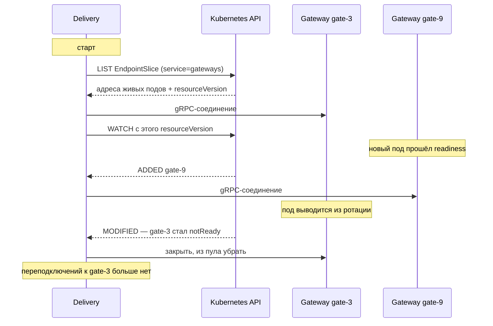

# WebSocket

## Содержание

- [Handshake: HTTP Upgrade](#handshake-http-upgrade)
- [Go: выбор библиотеки](#go-выбор-библиотеки)
- [Паттерн: read-goroutine + write-goroutine](#паттерн-read-goroutine--write-goroutine)
- [Hub — центральный registry клиентов](#hub--центральный-registry-клиентов)
- [Scaling: три способа связать инстансы](#scaling-три-способа-связать-инстансы)
- [WebSocket vs SSE vs Long Polling](#websocket-vs-sse-vs-long-polling)
- [Interview-ready answer](#interview-ready-answer)

WebSocket — протокол поверх TCP для двусторонней real-time связи. После HTTP Upgrade-рукопожатия — full-duplex соединение без overhead request/response.

---

## Handshake: HTTP Upgrade

```
Client → Server:
  GET /ws HTTP/1.1
  Host: example.com
  Upgrade: websocket
  Connection: Upgrade
  Sec-WebSocket-Key: dGhlIHNhbXBsZSBub25jZQ==
  Sec-WebSocket-Version: 13

Server → Client:
  HTTP/1.1 101 Switching Protocols
  Upgrade: websocket
  Connection: Upgrade
  Sec-WebSocket-Accept: s3pPLMBiTxaQ9kYGzzhZRbK+xOo=
```

После `101 Switching Protocols` HTTP-соединение превращается в WebSocket. Нет больше запросов — только frames в обоих направлениях.

### Framing — структура WebSocket фрейма

```
 0                   1                   2                   3
 0 1 2 3 4 5 6 7 8 9 0 1 2 3 4 5 6 7 8 9 0 1 2 3 4 5 6 7 8 9 0 1
+-+-+-+-+-------+-+-------------+-------------------------------+
|F|R|R|R| opcode|M| Payload len |    Extended payload length    |
|I|S|S|S|  (4)  |A|     (7)     |            (16/64)            |
|N|V|V|V|       |S|             |   (if payload len==126/127)   |
| |1|2|3|       |K|             |                               |
+-+-+-+-+-------+-+-------------+ - - - - - - - - - - - - - - -+
```

### Opcodes — типы фреймов

| Opcode | Тип | Описание |
|---|---|---|
| `0x0` | Continuation | Продолжение fragmented сообщения |
| `0x1` | Text | UTF-8 текст |
| `0x2` | Binary | Бинарные данные |
| `0x8` | Close | Закрытие соединения |
| `0x9` | Ping | Keepalive ping |
| `0xA` | Pong | Ответ на ping |

**Ping/Pong** — keepalive механизм. Сервер должен отвечать Pong на каждый Ping. Клиент может тоже слать Ping.

---

## Go: выбор библиотеки

| | gorilla/websocket | coder/websocket |
|---|---|---|
| Путь модуля | `github.com/gorilla/websocket` | `github.com/coder/websocket` (бывший `nhooyr.io/websocket`) |
| Состояние | архивировался в 2022, с 2023 снова развивается новыми мейнтейнерами | активно развивается |
| Стиль API | ручное управление соединением, свои таймауты чтения и записи | контекст в каждом вызове, отмена через `context` |
| Одновременная запись | не допускается, нужна своя сериализация записи | запись безопасна для параллельного вызова |
| Сборка в Wasm | нет | есть |
| Сжатие | permessage-deflate | permessage-deflate |
| Где встречается | огромное число существующих проектов и примеров | новые проекты, особенно с активным использованием контекстов |

Обе библиотеки живые, поэтому выбор чаще определяется не «какая лучше», а тем, что уже используется в проекте и насколько нужен контекст в API. Имя `nhooyr.io/websocket` осталось в старых статьях: в 2024 модуль переехал под `github.com/coder/websocket`, старый путь работает, но новые версии выходят по новому.

---

## Паттерн: read-goroutine + write-goroutine

Соединение не потокобезопасно: одновременная запись из нескольких горутин ломает кадрирование, и это не теоретический риск, а первая ошибка, которую допускают почти все. Стандартное решение — на каждое соединение ровно две горутины: одна только читает, вторая только пишет, а всё остальное приложение общается с соединением через канал.

Из этой конструкции следуют три вещи, которые обычно и отличают рабочий код от примера:

- **Пинги обязательны.** Обрыв TCP не всегда виден как ошибка: соединение может «висеть» часами. Горутина-писатель шлёт `ping` по таймеру, читатель обновляет крайний срок чтения при получении `pong`; не пришёл вовремя — соединение считается мёртвым.
- **Крайние сроки, а не таймауты запроса.** У долгоживущего соединения нет понятия «время запроса», поэтому используют `SetReadDeadline` и `SetWriteDeadline`, сдвигая их при активности. Без этого мёртвый клиент удерживает горутину и буферы неограниченно долго.
- **Буфер на клиента и политика переполнения.** Медленный клиент не должен тормозить остальных: запись в его канал делают неблокирующей, а при переполнении либо отбрасывают сообщение, либо закрывают соединение — выбор зависит от того, можно ли терять события.

```go
type Client struct {
    conn    *websocket.Conn
    send    chan []byte
    hub     *Hub
    userID  string
}

// Pump: две горутины на клиента
func (c *Client) pump() {
    go c.writePump()
    c.readPump() // в вызывающей горутине
}

func (c *Client) readPump() {
    defer func() {
        c.hub.unregister <- c
        c.conn.Close()
    }()
    
    c.conn.SetReadLimit(512 * 1024) // 512 KB max message
    c.conn.SetReadDeadline(time.Now().Add(60 * time.Second))
    c.conn.SetPongHandler(func(string) error {
        c.conn.SetReadDeadline(time.Now().Add(60 * time.Second))
        return nil
    })
    
    for {
        _, message, err := c.conn.ReadMessage()
        if err != nil {
            if websocket.IsUnexpectedCloseError(err,
                websocket.CloseGoingAway,
                websocket.CloseAbnormalClosure) {
                log.Printf("ws read error: %v", err)
            }
            break
        }
        c.hub.broadcast <- &Message{data: message, from: c.userID}
    }
}

func (c *Client) writePump() {
    ticker := time.NewTicker(54 * time.Second) // ping interval
    defer func() {
        ticker.Stop()
        c.conn.Close()
    }()
    
    for {
        select {
        case message, ok := <-c.send:
            c.conn.SetWriteDeadline(time.Now().Add(10 * time.Second))
            if !ok {
                // Hub закрыл канал
                c.conn.WriteMessage(websocket.CloseMessage, []byte{})
                return
            }
            if err := c.conn.WriteMessage(websocket.TextMessage, message); err != nil {
                return
            }
        case <-ticker.C:
            c.conn.SetWriteDeadline(time.Now().Add(10 * time.Second))
            if err := c.conn.WriteMessage(websocket.PingMessage, nil); err != nil {
                return
            }
        }
    }
}
```

---

## Hub — центральный registry клиентов

Соединения нужно где-то держать: чтобы отправить сообщение конкретному пользователю или всем сразу, сервер должен знать, какие соединения сейчас открыты. Эту роль и играет Hub — единственное место, где живёт множество активных клиентов.

Ключевое решение конструкции: реестр не защищают мьютексом с прямой записью в соединения из чужих горутин. Вместо этого Hub владеет состоянием единолично, а регистрация, отключение и рассылка приходят к нему каналами. Причина та же, что и в паттерне выше: писать в одно соединение из нескольких горутин нельзя, а рассылка под общей блокировкой останавливается на первом же медленном клиенте.

Отсюда следует и политика переполнения: если буфер клиента полон, его либо отключают, либо для него пропускают сообщение, но никогда не блокируют рассылку остальным.

<details>
<summary>Hub целиком: регистрация, отключение, рассылка</summary>

```go
type Hub struct {
    clients    map[*Client]bool
    broadcast  chan *Message
    register   chan *Client
    unregister chan *Client
}

func NewHub() *Hub {
    return &Hub{
        broadcast:  make(chan *Message, 256),
        register:   make(chan *Client),
        unregister: make(chan *Client),
        clients:    make(map[*Client]bool),
    }
}

// Run: единственная горутина управляет map клиентов
// Нет mutex — все изменения через каналы (channel ownership)
func (h *Hub) Run() {
    for {
        select {
        case client := <-h.register:
            h.clients[client] = true
            
        case client := <-h.unregister:
            if _, ok := h.clients[client]; ok {
                delete(h.clients, client)
                close(client.send)
            }
            
        case message := <-h.broadcast:
            for client := range h.clients {
                if client.userID == message.from {
                    continue // не отправлять себе
                }
                select {
                case client.send <- message.data:
                default:
                    // Буфер полный — клиент медленный → disconnect
                    delete(h.clients, client)
                    close(client.send)
                }
            }
        }
    }
}
```

</details>

### HTTP handler для WebSocket upgrade

Обработчик соединяет две предыдущие части: превращает HTTP-запрос в соединение и передаёт готового клиента в Hub. Единственное содержательное решение здесь — `CheckOrigin`: по умолчанию библиотека пропускает любой источник, а браузерная политика единого источника на WebSocket не распространяется, поэтому без явной проверки чужая страница откроет соединение от имени залогиненного пользователя.

<details>
<summary>Обработчик upgrade целиком</summary>

```go
var upgrader = websocket.Upgrader{
    ReadBufferSize:  1024,
    WriteBufferSize: 1024,
    CheckOrigin: func(r *http.Request) bool {
        // Без этой проверки соединение откроет любая страница
        origin := r.Header.Get("Origin")
        return origin == "https://myapp.com"
    },
}

func wsHandler(hub *Hub, w http.ResponseWriter, r *http.Request) {
    conn, err := upgrader.Upgrade(w, r, nil)
    if err != nil {
        log.Printf("ws upgrade error: %v", err)
        return
    }
    
    client := &Client{
        conn:   conn,
        send:   make(chan []byte, 256),
        hub:    hub,
        userID: getUserID(r),
    }
    hub.register <- client
    go client.pump()
}
```

</details>

---

## Scaling: три способа связать инстансы

Ответов на эту задачу три: привязать клиента к инстансу, разослать событие всем инстансам или заранее знать, на каком инстансе лежит нужное соединение. Первый кажется проще, но откладывает проблему; второй и третий решают её по-разному и уместны в разных сценариях.

### Проблема горизонтального масштабирования

```
Instance A: [client1, client3, client5]
Instance B: [client2, client4, client6]

Client1 (на Instance A) отправляет сообщение client4 (на Instance B)
→ Instance A не знает о client4 → сообщение потеряно
```

### Sticky sessions (session affinity)

Load balancer направляет одного клиента всегда на один инстанс (по cookie или IP).

**Минусы:**
- Неравномерная нагрузка при отключении клиентов
- При падении инстанса — все его клиенты теряют соединение
- Сложно масштабировать

### Pub/Sub backplane (предпочтительно)

Инстансы перестают быть изолированными: каждый подписан на общий канал и раздаёт полученные сообщения своим локальным соединениям. Клиент по-прежнему подключён к одному инстансу, но событие доходит до него независимо от того, где оно родилось.

Что важно понимать про такую схему:

- **Доставка at-most-once.** Redis Pub/Sub и NATS Core ничего не хранят: сообщение, отправленное в момент переподключения клиента, потеряно. Для живых обновлений это нормально — состояние подтянется следующим событием или обычным запросом; для чата, где сообщения терять нельзя, нужен поток с хранением ([брокеры](../../../07-message-brokers-and-streaming/00-comparison.md)).
- **Защита от эха.** Инстанс получает из канала и собственные публикации, поэтому в сообщение кладут идентификатор отправителя и свои пропускают, иначе клиент увидит дубль.
- **Гранулярность каналов.** Канал на пользователя или комнату дешевле, чем один общий: иначе каждый инстанс получает весь трафик системы и фильтрует его у себя.
- **Медленный подписчик.** Инстанс, который не успевает вычитывать канал, будет отключён брокером по лимиту буфера — обработку выносят из цикла чтения ([05-redis-pubsub.md](../../../07-message-brokers-and-streaming/05-redis-pubsub.md)).

```
Instance A: [client1, client3]    ←─── Redis Pub/Sub ───→    Instance B: [client2, client4]
     │                                  "ws:room:42"                            │
     └── PUBLISH "msg from client1" ──────────────────────── ─► broadcast local
```

```go
// При получении WebSocket сообщения
func (h *Hub) handleMessage(msg *Message) {
    // Broadcast локально
    h.broadcastLocal(msg)
    
    // Publish в Redis для других инстансов
    data, _ := json.Marshal(msg)
    h.rdb.Publish(ctx, "ws:broadcast:"+msg.RoomID, data)
}

// Подписка на Redis (при старте инстанса)
func (h *Hub) subscribeRedis() {
    pubsub := h.rdb.Subscribe(ctx, "ws:broadcast:*")
    go func() {
        for msg := range pubsub.Channel() {
            var wsMsg Message
            json.Unmarshal([]byte(msg.Payload), &wsMsg)
            h.broadcastLocal(&wsMsg) // broadcast только локальным клиентам
        }
    }()
}
```

### Таблица маршрутизации: адресная доставка

Pub/Sub рассылает событие всем инстансам, и каждый проверяет, есть ли у него подходящее соединение. Для комнаты на пятьдесят человек это разумно: получатели размазаны по инстансам, и широковещание всё равно понадобилось бы. Для личного сообщения одному человеку — нет: при сорока инстансах событие получают все сорок, тридцать девять выбрасывают его молча.

Третий подход убирает лишнюю рассылку: отдельное хранилище отвечает на вопрос «на каком инстансе сейчас лежит сокет этого пользователя», и событие уходит только туда.

```text
ws_conns:user-42:
  member = gate-3|conn-abc, score = expires_at
  member = gate-8|conn-xyz, score = expires_at
```

| Событие | Команда Redis |
| --- | --- |
| Подключение | `ZADD ws_conns:user-42 <now+90> "gate-3\|conn-abc"` |
| Heartbeat | тот же `ZADD` — обновляет score только своего элемента |
| Поиск | `ZREMRANGEBYSCORE ... -inf <now>`, затем `ZRANGE` живых |
| Отключение | `ZREM` только своего элемента |

Выбор структуры не случаен, и обе причины неочевидны:

- **У пользователя несколько устройств.** Одна строка `user → инстанс` затирается при подключении со второго устройства, и телефон перестаёт получать сообщения, как только человек открыл вкладку в браузере.
- **Срок жизни нужен каждому соединению отдельно.** Хеш не подходит: у поля хеша нет собственного TTL (появился только в Redis 7.4). Общий TTL на весь ключ тоже неверен — heartbeat ноутбука будет продлевать ключ и навсегда оставит в нём мёртвую запись телефона. Поэтому срок жизни кладут в score, и проверка на протухание становится частью чтения.

Побочный эффект: `ZREMRANGEBYSCORE` при поиске делает чтение записью, поэтому увести поиск на реплики нельзя.

#### Две независимые петли

Главная путаница в этой схеме — попытка представить, что отправитель на каждое сообщение узнаёт адрес и подключается. На самом деле работают два независимых цикла, и они не связаны между собой.

```text
Петля 1 (постоянно, к сообщениям отношения не имеет):
  список живых инстансов → появился новый  → открыть соединение
                         → инстанс выбыл   → закрыть, не переподключаться

Петля 2 (на каждое сообщение):
  Redis → "gate-3|conn-abc" → взять готовое соединение из map в памяти → отправить
```

Поиск в петле 2 не резолвит имён и никуда не подключается: соединение к `gate-3` уже открыто первой петлёй, остаётся взять его из `map[string]*grpc.ClientConn`.

Отсюда следует, почему пул держат ко всем инстансам, а не к нужным. Отправитель обычно тоже горизонтальный — например, потребитель партиционированного потока событий. Его партиции разложены по одному признаку (идентификатор комнаты, чата, канала), а сокеты размещены по другому — по тому, куда случайно подключился клиент. Совместить эти два разбиения нельзя: у одной комнаты участники сидят на разных инстансах. Значит, каждый отправитель обязан доставать до каждого инстанса, и число соединений равно произведению.

```text
12 отправителей × 40 инстансов = 480 соединений
```

Величина обычно незаметная, но она и объясняет существование пула: оптимизации «обрабатывать событие там, где лежит сокет» в этой схеме не существует.

Разделение отвечает и на вопрос, когда прекращать попытки переподключения. Оборвавшееся соединение неоднозначно — это может быть сетевой сбой, и тогда переподключаться нужно. А исчезновение инстанса из списка живых однозначно: его больше нет, соединение закрывается и попытки прекращаются. В Kubernetes такой список ведётся сам — это `EndpointSlice` соответствующего `Service`, и под выбывает из него ещё до того, как процесс убьют.

#### Что означает «подписаться на список»

Формулировка «подписан на список живых инстансов» скрывает конкретный механизм: у API-сервера Kubernetes есть режим `watch` — долгоживущее HTTP-соединение, в которое сервер пишет изменения объектов по мере их появления. Клиент не опрашивает список по таймеру, а один раз получает его целиком и дальше принимает поток событий.



Первый шаг обязателен: сначала полный список, потом подписка с той версии, на которой список был получен. Иначе между чтением и подпиской теряются изменения.

Ключевое отличие от опроса — в событии `MODIFIED`. Опрос по таймеру дал бы только «этого адреса больше нет в списке», и отличить выведенный из ротации под от подтормозившего DNS было бы нельзя. Подписка даёт причину, а не только факт.

Отдельно стоит помнить, что под покидает `EndpointSlice` и получает `SIGTERM` асинхронно: эти два события не упорядочены, и на короткое время в пуле может остаться соединение к уже завершающемуся поду. Это ещё одна причина, по которой доставка через таблицу маршрутизации обязана быть best-effort. Подробнее про порядок остановки — [пробы и graceful shutdown](../../../10-devops-and-observability/kubernetes/07-probes-and-graceful-shutdown.md).

<details>
<summary>Пул соединений: подписка на EndpointSlice и отправка</summary>

```go
// Pool держит по одному gRPC-соединению на живой Gateway.
// Ключ — адрес пода, тот же, что лежит в таблице маршрутизации.
type Pool struct {
    mu    sync.RWMutex
    conns map[string]*grpc.ClientConn
}

func (p *Pool) Watch(ctx context.Context, informer cache.SharedIndexInformer) {
    // Информер сам делает LIST, затем WATCH и переподписывается при обрыве.
    informer.AddEventHandler(cache.ResourceEventHandlerFuncs{
        AddFunc:    func(obj any) { p.sync(obj.(*discoveryv1.EndpointSlice)) },
        UpdateFunc: func(_, obj any) { p.sync(obj.(*discoveryv1.EndpointSlice)) },
        DeleteFunc: func(obj any) { p.sync(&discoveryv1.EndpointSlice{}) },
    })
    informer.Run(ctx.Done())
}

// sync приводит пул в соответствие со списком: открывает соединения к новым
// адресам и закрывает те, которых в списке больше нет.
func (p *Pool) sync(slice *discoveryv1.EndpointSlice) {
    alive := make(map[string]bool)
    for _, ep := range slice.Endpoints {
        if ep.Conditions.Ready == nil || !*ep.Conditions.Ready {
            continue // под ещё не готов либо уже выводится из ротации
        }
        for _, addr := range ep.Addresses {
            alive[addr] = true
        }
    }

    p.mu.Lock()
    defer p.mu.Unlock()

    for addr := range alive {
        if _, ok := p.conns[addr]; ok {
            continue
        }
        // grpc.NewClient не подключается немедленно: соединение
        // устанавливается лениво и само восстанавливается после обрыва
        cc, err := grpc.NewClient(net.JoinHostPort(addr, "9000"),
            grpc.WithTransportCredentials(insecure.NewCredentials()))
        if err != nil {
            continue
        }
        p.conns[addr] = cc
    }

    for addr, cc := range p.conns {
        if alive[addr] {
            continue
        }
        cc.Close() // пода больше нет — переподключаться не к чему
        delete(p.conns, addr)
    }
}

// Send отправляет событие в конкретный сокет на конкретном поде.
func (p *Pool) Send(ctx context.Context, addr, connID string, ev *pb.Event) error {
    p.mu.RLock()
    cc, ok := p.conns[addr]
    p.mu.RUnlock()
    if !ok {
        // Запись в таблице маршрутизации протухла: пода уже нет.
        // Не ошибка доставки — сигнал уйти в push.
        return ErrGatewayGone
    }
    _, err := pb.NewDeliveryClient(cc).Push(ctx, &pb.PushRequest{ConnId: connID, Event: ev})
    return err
}
```

Пример показывает одну идею — жизненный цикл пула. В рабочем коде добавляются: ошибка от `AddEventHandler` (client-go возвращает её с версии 1.27), фильтрация нескольких `EndpointSlice` одного `Service` (Kubernetes режет список на части при большом числе подов, и объединять их надо самому), TLS, лимиты и метрики на состояние пула.

</details>

Доступ к API Kubernetes нужен не всегда. Если прав на `watch` нет или тянуть `client-go` не хочется, тот же список получают периодическим резолвом headless `Service`:

```text
раз в 5 с: A-записи gateways.default.svc.cluster.local
           → множество адресов
           → сравнить с текущим пулом: открыть новые, закрыть исчезнувшие
```

Проще и без прав в API, но реагирует с задержкой до интервала опроса и не отличает «под выведен из ротации» от «DNS ещё не обновился». Для пула соединений это приемлемо, для быстрого вывода пода из ротации — нет.

#### Откуда инстанс знает свой адрес

Запрашивать его не нужно: адрес и так на сетевом интерфейсе, а Kubernetes передаёт его при старте через downward API.

```yaml
env:
  - name: POD_IP
    valueFrom: { fieldRef: { fieldPath: status.podIP } }
  - name: POD_NAME
    valueFrom: { fieldRef: { fieldPath: metadata.name } }
```

Дальше есть развилка — что именно писать в таблицу маршрутизации:

| | Адрес в таблице | Логическое имя в таблице |
| --- | --- | --- |
| Элемент | `10.244.3.17:9000\|gw-uuid\|conn-abc` | `gate-3\|conn-abc` |
| Превращение в адрес | Не нужно | Нужно: имя → адрес через headless `Service` |
| Соединения | Пул создаётся лениво, по первому сообщению | Соединения ко всему флоту заранее |
| Подвох | Новый под может занять адрес умершего | Требует стабильных имён, то есть `StatefulSet` |

В первом варианте обнаружение сервисов (`service discovery`) не нужно вовсе — адрес уже лежит в таблице. Защита от переиспользования адреса делается идентификатором запуска: инстанс отвергает кадр, в котором `gw-uuid` не совпадает с его собственным.

Во втором варианте имя превращается в адрес через headless `Service`: обычный `Service` прячет поды за одним виртуальным адресом и раздаёт соединения между ними, а здесь нужен конкретный под, а не любой свободный. Подробнее — [сеть, Service, DNS и Ingress](../../../10-devops-and-observability/kubernetes/12-networking-service-dns-and-ingress.md).

#### Когда такая доставка допустима

Записи умершего инстанса остаются в таблице до истечения своего `expires_at` — до полутора минут. Всё это время поиск возвращает адрес, по которому никого нет, и отправка не проходит.

Схема живёт с этим только при одном условии: доставка через таблицу маршрутизации не является источником правды. Сообщение уже сохранено в основном хранилище и имеет порядковый номер, поэтому потерянная отправка означает лишь, что получатель увидит сообщение при следующем чтении истории. Клиент при подключении присылает последний известный ему номер и дочитывает разрыв — этим же лечится гонка, когда пользователь переподключился на другой инстанс, пока событие летело на прежний.

Если такого хранилища за спиной нет, адресную доставку строить нельзя — потеря будет окончательной.

### Что выбрать

| | Sticky sessions | Pub/Sub backplane | Таблица маршрутизации |
| --- | --- | --- | --- |
| Инстанс получателя | Определён балансировщиком | Не важен: получают все | Известен точно |
| Лишний трафик | Нет | Событие идёт на все инстансы | Нет |
| Внешнее состояние | Нет | Нет | Таблица `user → инстанс` |
| Когда уместно | Прототип, один инстанс в обозримом будущем | Комнаты и широковещание | Личные сообщения, миллионы соединений |
| Цена | Падение инстанса рвёт все его соединения | При сорока инстансах тридцать девять выбрасывают событие | Ещё одно хранилище и его отказ |

Подходы не исключают друг друга: широковещание в комнату идёт через pub/sub, личное сообщение — через таблицу. Разборы с числами — [Marketplace Messenger](../../../05-system-design/interview-cases/18-marketplace-messenger.md) и [WebSocket Chat at Scale](../../../05-system-design/interview-cases/04.1-websocket-chat-capacity.md).

---

## WebSocket vs SSE vs Long Polling

| | WebSocket | SSE | Long Polling |
|---|---|---|---|
| Направление | Full-duplex | Сервер → клиент | Сервер → клиент |
| Protocol | Отдельный | HTTP | HTTP |
| Reconnect | Вручную | Автоматически | Вручную |
| Browser support | ✅ | ✅ | ✅ |
| Firewall/Proxy | ❌ проблемы | ✅ | ✅ |
| Use case | Chat, gaming, collab | Feeds, notifications | Fallback |

---

## Interview-ready answer

**1. Как устанавливается WebSocket-соединение?**

- Начинается как обычный HTTP-запрос с заголовками `Upgrade: websocket` и `Connection: Upgrade`, поэтому проходит через ту же инфраструктуру, что и остальной трафик.
- Сервер отвечает `101 Switching Protocols` и подтверждает ключ клиента: значение `Sec-WebSocket-Accept` считается по фиксированному алгоритму, что защищает от случайного апгрейда на стороннем сервисе.
- После ответа HTTP заканчивается: по тому же TCP-соединению идут кадры собственного формата, и разбирать их HTTP-прокси уже не умеет.
- Практическое следствие — балансировщики и прокси должны быть настроены на проброс апгрейда, иначе соединение рвётся сразу после рукопожатия.

**2. Почему на соединение нужны две горутины?**

- Соединение не потокобезопасно: одновременная запись из нескольких горутин ломает кадрирование.
- Поэтому пишет ровно одна горутина, а остальное приложение отправляет ей сообщения через канал.
- Вторая горутина только читает и обновляет крайний срок чтения по приходящим `pong`.
- Без пингов мёртвое соединение не обнаруживается: обрыв TCP не всегда приходит как ошибка, и горутина с буферами живёт до перезапуска процесса.

**3. Что делать с медленным клиентом?**

- Запись в его буфер делают неблокирующей: блокировка остановила бы рассылку всем остальным.
- При переполнении буфера выбирают одно из двух — отбросить сообщение или закрыть соединение.
- Выбор зависит от смысла данных: живые статусы и котировки можно терять, сообщения чата нет, поэтому там клиента отключают и он перечитывает историю после переподключения.
- Метрика, которую стоит завести, — число отброшенных сообщений и отключений по переполнению: она заранее показывает, что клиенты не успевают.

**4. Как масштабировать WebSocket горизонтально?**

- Проблема — клиент подключён к одному инстансу, а событие может родиться на другом, и Hub знает только про свои соединения.
- Липкие сессии лишь привязывают клиента к инстансу: они не решают задачу доставки, ломаются при выкатке и дают неравномерную нагрузку.
- Рабочее решение — backplane: каждый инстанс подписан на общий канал (Redis Pub/Sub, NATS) и раздаёт полученное своим соединениям.
- Оговорки — доставка at-most-once, поэтому пропущенное во время переподключения теряется; в сообщение кладут идентификатор отправителя, чтобы инстанс не рассылал собственные публикации повторно.

**5. WebSocket или SSE?**

- Если клиент только слушает, достаточно SSE: обычный HTTP-ответ, встроенное переподключение, никакой отдельной настройки прокси.
- WebSocket нужен, когда клиент шлёт данные так же интенсивно, как получает: чат, игры, совместное редактирование.
- Цена WebSocket — своё переподключение, свои пинги, отдельная настройка инфраструктуры и бинарный протокол, который не видно в обычных инструментах отладки.
- Общее для обоих — состояние на инстансе, поэтому backplane нужен в любом случае ([04-realtime/02-sse.md](./02-sse.md)).
